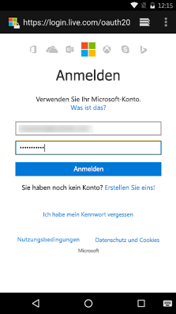

# <a name="get-started-with-microsoft-graph-in-an-android-app"></a>Erste Schritte mit Microsoft Graph in einer Android-App

> **Sie erstellen Apps für Unternehmenskunden?** Ihre App funktioniert möglicherweise nicht, wenn Ihr Unternehmenskunde Enterprise Mobility-Sicherheitsfunktionen wie <a href="https://azure.microsoft.com/en-us/documentation/articles/active-directory-conditional-access-device-policies/" target="_newtab">bedingten Gerätezugriff</a> aktiviert. In diesem Fall treten bei Ihren Kunden möglicherweise Fehler auf. 

> Zur Unterstützung **aller Unternehmenskunden** über **alle Unternehmensszenarien** hinweg müssen Sie den Azure AD-Endpunkt verwenden und Ihr Apps mithilfe des [Azure-Verwaltungsportals](https://aka.ms/aadapplist) verwalten. Weitere Informationen finden Sie unter [Entscheiden zwischen dem Azure AD- und dem Azure AD v2.0-Endpunkt](../concepts/auth_overview.md#deciding-between-the-azure-ad-and-azure-ad-v20-endpoints).

Dieser Artikel beschreibt die erforderlichen Aufgaben zum Abrufen eines Zugriffstokens vom Azure AD v2.0-Endpunkt und zum Aufrufen von Microsoft Graph. Sie werden durch die Erstellung der [Connect-Beispiels für Android](https://github.com/microsoftgraph/android-java-connect-sample) geführt und erhalten Informationen zu den Hauptkonzepten, die Sie zur Verwendung von Microsoft Graph in Ihrer App für Android implementieren. In diesem Artikel wird auch beschrieben, wie Sie mithilfe des [Microsoft Graph-SDKs für Android](https://github.com/microsoftgraph/msgraph-sdk-android) oder reinen REST-Aufrufen auf Microsoft Graph zugreifen.

Um Microsoft Graph in Ihrer App für Android zu verwenden, müssen Sie für Benutzer die Microsoft-Anmeldeseite anzeigen, wie im folgenden Screenshot dargestellt.



**Sie möchten keine App erstellen?** Laden Sie sich für einen Schnelleinstieg das [Connect-Beispiel für Android](https://github.com/microsoftgraph/android-java-connect-sample) herunter, auf dem dieser Artikel basiert.


## <a name="prerequisites"></a>Voraussetzungen

Für die ersten Schritte benötigen Sie: 

- Ein [Microsoft-Konto](https://www.outlook.com/) oder ein [Geschäfts-, Schul- oder Unikonto](http://dev.office.com/devprogram)
- Android Studio 2.0 oder eine höhere Version


## <a name="configure-a-new-project"></a>Konfigurieren eines neuen Projekts

Wenn Sie das [Connect-Beispiel für Android](https://github.com/microsoftgraph/android-java-connect-sample) heruntergeladen haben, überspringen Sie diesen Schritt. 

Starten Sie ein neues Projekt in Android Studio. Für den Großteil des Assistenten können Sie die Standardwerte belassen, stellen Sie aber sicher, dass Sie die folgenden Optionen auswählen:

* Android-Zielgeräte - **Smartphone und Tablet**
    * Minimales SDK - **API 16: Android 4.1 (Jelly Bean)**
* Hinzufügen einer Aktivität zu Mobile - **Grundlegende Aktivität**
 
Auf diese Weise erhalten Sie ein Android-Projekt mit einer Aktivität und einer Schaltfläche, die Sie zum Authentifizieren des Benutzers verwenden können.


## <a name="register-the-application"></a>Registrieren der App

Sie müssen Ihre App im [Microsoft-App-Registrierungsportal](https://apps.dev.microsoft.com/) registrieren, unabhängig davon, ob Sie das Connect-Beispiel heruntergeladen oder ein neues Projekt erstellt haben.

Registrieren Sie eine App im Microsoft-App-Registrierungsportal. Dadurch wird die App-ID generiert, mit der Sie die App konfigurieren.

1. Melden Sie sich beim [Microsoft-App-Registrierungsportal](https://apps.dev.microsoft.com/) entweder mit Ihrem persönlichen oder mit einem Geschäfts-, Schul- oder Unikonto an.

2. Klicken Sie auf **App hinzufügen**.

>Tipp:  Wenn Sie das [Connect-Beispiel für Android](https://github.com/microsoftgraph/android-java-connect-sample) heruntergeladen haben und dieses lediglich registrieren möchten, deaktivieren Sie **Guided Setup**, bevor Sie auf die Schaltfläche **Create** klicken.

3. Geben Sie einen Namen für die App ein, und wählen Sie **Create**. 
    
    Für den Fluss **Guided Setup**:
 
    a. Wählen Sie **Mobile and Desktop App**, um den Typ der App zu definieren, die Sie erstellen.

    b. Wählen Sie **Android**, um die verwendete Mobiltechnologie zu definieren.

    c. Lesen Sie das einleitende Thema, und klicken Sie abschließend auf die Schaltfläche **Setup** am Ende der Seite.

    d. Befolgen Sie die Anweisungen im Schritt **Setup**, um die MSAL-Bibliothek zu Datei „build.gradle“ der App hinzuzufügen.

    e. Befolgen Sie die Anweisungen im Schritt **Use**, um Ihrem neuen Projekt MSAL-Logik hinzuzufügen.

    f. Auf der Seite **Configure** hat das Portal eine eindeutige Anwendungs-ID für Sie erstellt. Verwenden Sie diese, um Ihre App zu konfigurieren.

    Für den Fluss ohne Anleitung:

    Die Registrierungsseite wird angezeigt, und die Eigenschaften der App werden aufgeführt.

    a. Kopieren Sie die Anwendungs-ID. Dies ist der eindeutige Bezeichner für Ihre App. 

    b. Wählen Sie **Plattform hinzufügen** und **Systemeigene Anwendung** aus.

    > **Hinweis:** Das App-Registrierungsportal stellt einen Umleitungs-URI mit dem Wert *msalYOUR NEW APP ID://auth* bereit. Verwenden Sie nicht die integrierten Umleitungs-URIs. Das [Connect-Beispiel für Android](https://github.com/microsoftgraph/android-java-connect-sample) implementiert die MSAL-Authentifizierungsbibliothek, die diesen Umleitungs-URI erfordert. Bei Verwendung einer [unterstützten Drittanbieterbibliothek](https://docs.microsoft.com/en-us/azure/active-directory/develop/active-directory-v2-libraries#compatible-client-libraries) oder der **ADAL**-Bibliothek müssen Sie die integrierten Umleitungs-URIs verwenden.

    Für den Fluss „Guided Setup“ und den Fluss ohne Anleitung

    a. Fügen Sie delegierte Berechtigungen hinzu. Sie benötigen die Berechtigungen **profile**, **Mail.ReadWrite**, **Mail.Send**, **Files.ReadWrite** und **User.ReadBasic.All**. 
   
    b. Wählen Sie **Speichern** aus.


## <a name="authenticate-the-user-and-get-an-access-token"></a>Authentifizieren des Benutzers und Abrufen eines Zugriffstokens

> **Hinweis:** Wenn Sie die Anweisungen im Fluss **Guided Setup** des App-Registrierungsportals ausgeführt haben, um eine neue Anwendung zu erstellen, können Sie diese Schritte überspringen. Wechseln Sie zu [Aufrufen von Microsoft Graph mit dem Microsoft Graph-SDK](#call-microsoft-graph-using-the-microsoft-graph-sdk), um mehr über die Graph-API zu erfahren.

Wir wollen nun das [Connect-Beispiel für Android](https://github.com/microsoftgraph/android-java-connect-sample) durcharbeiten, um mehr über den MSAL- und Microsoft Graph-Code zu erfahren, den wir hinzugefügt haben.

### <a name="add-the-dependency-to-appbuildgradle"></a>Hinzufügen der Abhängigkeit zu „app/build.gradle“

Öffnen Sie die Datei `build.gradle` im App-Modul, und suchen Sie nach der folgenden Abhängigkeit:

```gradle
    compile ('com.microsoft.identity.client:msal:0.1.+') {
        exclude group: 'com.android.support', module: 'appcompat-v7'
    }
    compile 'com.android.volley:volley:1.0.0'

```

### <a name="start-the-authentication-flow"></a>Starten des Authentifizierungsflusses

1. Öffnen Sie die Datei **AuthenticationManager**, und suchen Sie nach der Objektdeklaration **PublicClientApplication** und dann nach der Instantiierung der **getInstance**-Methode.

   ```java
    private static PublicClientApplication mPublicClientApplication;
    ....

    public static synchronized AuthenticationManager getInstance() {
        if (INSTANCE == null) {
            INSTANCE = new AuthenticationManager();
            if (mPublicClientApplication == null) {
                mPublicClientApplication = new PublicClientApplication(Connect.getInstance());
            }
        }
        return INSTANCE;
    }

   ```


2. Suchen Sie in der Klasse **ConnectActivity** nach dem Ereignishandler für das Klick-Ereignis von **mConnectButton**. Suchen Sie die **OnClick**-Methode, und überprüfen Sie den relevanten Code.
  
    Die **connect**-Methode aktiviert die Protokollierung von personenbezogenen Informationen (PII), ruft eine Instanz der Beispiel-Hilfsklasse **CustomTargetNameDictionary** ab und ruft die Benutzersammlung des MSAL-Plattformobjekts ab. Wenn keine Benutzer vorhanden sind, wird der neue Benutzer zum Azure AD-Authentifizierungs- und Autorisierungsfluss geleitet. Andernfalls wird ein Authentifizierungstoken im Hintergrund abgerufen.

   ```java
    @Override
    public void onClick(View view) {
        ....
        connect();
    }

        private void connect() {

        if (mEnablePiiLogging) {
            Logger.getInstance().setEnablePII(true);
        } else {
            Logger.getInstance().setEnablePII(false);
        }

        AuthenticationManager mgr = AuthenticationManager.getInstance();

        List<User> users = null;

        try {
            users = mgr.getPublicClient().getUsers();

            if (users != null && users.size() == 1) {
                mUser = users.get(0);
                mgr.callAcquireTokenSilent(mUser, true, this);
            } else {
                mgr.callAcquireToken(
                        this,
                        this);
            }
        } catch (MsalClientException e) {
            Log.d(TAG, "MSAL Exception Generated while getting users: " + e.toString());

        } catch (IndexOutOfBoundsException e) {
            Log.d(TAG, "User at this position does not exist: " + e.toString());
        }
    }

   ```
3. Suchen Sie den Ereignishandler, der die Azure AD-Umleitungsantwort verarbeitet, die von Azure AD generiert wird, wenn der Benutzer das Authentifizierungsdialogfeld schließt. Dieser Handler befindet sich in der Klasse **ConnectActivity**.

   ```java
       /**
     * Handles redirect response from https://login.microsoftonline.com/common and
     * notifies the MSAL library that the user has completed the authentication
     * dialog
     * @param requestCode
     * @param resultCode
     * @param data
     */
    @Override
    protected void onActivityResult(int requestCode, int resultCode, Intent data) {
        super.onActivityResult(requestCode, resultCode, data);
        if (AuthenticationManager
                .getInstance()
                .getPublicClient() != null) {
            AuthenticationManager
                    .getInstance()
                    .getPublicClient()
                    .handleInteractiveRequestRedirect(requestCode, resultCode, data);
        }
    }

   ```    
3. Suchen Sie die Rückrufmethode der Authentifizierung, die das Authentifizierungstoken zwischenspeichert, das in Aufrufen der Graph-API verwendet wird.

 

```java
    /* Callback used for interactive request.  If succeeds we use the access
         * token to call the Microsoft Graph. Does not check cache
         */
    private AuthenticationCallback getAuthInteractiveCallback() {
        return new AuthenticationCallback() {
            @Override
            public void onSuccess(AuthenticationResult authenticationResult) {
            /* Successfully got a token, call graph now */
                Log.d(TAG, "Successfully authenticated");
                Log.d(TAG, "ID Token: " + authenticationResult.getIdToken());

            /* Store the auth result */
                mAuthResult = authenticationResult;
                if (mActivityCallback != null)
                    mActivityCallback.onSuccess(mAuthResult);
            }

            @Override
            public void onError(MsalException exception) {
            /* Failed to acquireToken */
                Log.d(TAG, "Authentication failed: " + exception.toString());
                if (mActivityCallback != null)
                    mActivityCallback.onError(exception);
            }

            @Override
            public void onCancel() {
            /* User canceled the authentication */
                Log.d(TAG, "User cancelled login.");
            }
        };
    }

```
    
In der Hauptaktivität der Connect-Beispiel-App befindet sich eine Schaltfläche **Connect**. Wenn Sie zum ersten Mal auf die Schaltfläche klicken, wird in der App eine Authentifizierungsseite über den Browser des Geräts angezeigt. Der nächste Schritt besteht darin, den Code zu behandeln, den der Autorisierungsserver an den Umleitung-URI sendet, und diesen durch ein Zugriffstoken zu ersetzen.

### <a name="exchange-the-authorization-code-for-an-access-token"></a>Ersetzen des Autorisierungscodes durch ein Zugriffstoken

Sie müssen Ihre App so vorbereiten, dass die Antwort des Autorisierungsservers verarbeitet wird, die einen Code enthält, der durch ein Zugriffstoken ersetzt werden kann.

1. Wir müssen dem Android-System mitteilen, dass die Connect-App Anforderungen an den Umleitungs-URI verarbeiten kann, der bei der Registrierung der Anwendung konfiguriert wurde. Öffnen Sie hierzu die Datei **AndroidManifest**, und fügen sie dem Element **\<application/\>** des Projekts die folgenden untergeordneten Elemente hinzu.
    ```xml
        <uses-sdk tools:overrideLibrary="com.microsoft.identity.msal" />
        <application ...>
            ...
            <activity
                android:name="com.microsoft.identity.client.BrowserTabActivity">
                <intent-filter>
                    <action android:name="android.intent.action.VIEW" />
                    <category android:name="android.intent.category.DEFAULT" />
                    <category android:name="android.intent.category.BROWSABLE" />
                    <data android:scheme="msalENTER_YOUR_CLIENT_ID"
                        android:host="auth" />
                </intent-filter>
            </activity>
            <meta-data
                android:name="https://login.microsoftonline.com/common"
                android:value="authority string"/>
            <meta-data
                android:name="com.microsoft.identity.client.ClientId"
                android:value="ENTER_YOUR_CLIENT_ID"/>
        </application>
    ```
2. Die **MSAL**-Bibliothek benötigt Zugriff auf die vom Registrierungsportal zugewiesene Anwendungs-ID. **Die MSAL-Bibliothek bezeichnet die Anwendungs-ID als „Client-ID“**. Sie ruft die Anwendungs-ID (Client-ID) aus dem Anwendungskontext ab, den Sie im Bibliothekskonstruktor übergeben. 

   >Hinweis: Sie können die Client-ID auch zur Laufzeit angeben, indem Sie einen Zeichenfolgeparameter an den Konstruktor übergeben. 

3. Die Aktivität wird aufgerufen, wenn der Autorisierungsserver eine Antwort sendet. Fordern Sie ein Zugriffstoken mit der Antwort vom Autorisierungsserver an. Wechseln Sie zur Klasse **AuthenticationManager**, und suchen Sie den folgenden Code.

   ```java
    /**
     * Authenticates the user and lets the user authorize the app for the requested permissions.
     * An authentication token is returned via the getAuthInteractiveCalback method
     * @param activity
     * @param authenticationCallback
     */
    public void connect(Activity activity, final MSALAuthenticationCallback authenticationCallback){
        mActivityCallback = authenticationCallback;
        mPublicClientApplication.acquireToken(
                activity, Constants.SCOPES, getAuthInteractiveCallback());
    }


     /* Callback used for interactive request.  If succeeds we use the access
         * token to call the Microsoft Graph. Does not check cache
         */
    private AuthenticationCallback getAuthInteractiveCallback() {
        return new AuthenticationCallback() {
            @Override
            public void onSuccess(AuthenticationResult authenticationResult) {
            /* Successfully got a token, call graph now */
                Log.d(TAG, "Successfully authenticated");
                Log.d(TAG, "ID Token: " + authenticationResult.getIdToken());

            /* Store the auth result */
                mAuthResult = authenticationResult;
                if (mActivityCallback != null)
                    mActivityCallback.onSuccess(mAuthResult);
            }

            @Override
            public void onError(MsalException exception) {
            /* Failed to acquireToken */
                Log.d(TAG, "Authentication failed: " + exception.toString());
                if (mActivityCallback != null)
                    mActivityCallback.onError(exception);
            }

            @Override
            public void onCancel() {
            /* User canceled the authentication */
                Log.d(TAG, "User cancelled login.");
            }
        };
    }

     /**
     * Returns the access token obtained in authentication
     *
     * @return mAccessToken
     */
    public String getAccessToken() throws AuthenticatorException, IOException, OperationCanceledException {
        return  mAuthResult.getAccessToken();
    }

   ```


## <a name="call-microsoft-graph"></a>Aufrufen von Microsoft Graph
Zum Aufrufen von Microsoft Graph können Sie [das Microsoft Graph-SDK](#call-microsoft-graph-using-the-microsoft-graph-sdk) oder die [Microsoft Graph-REST-API](#call-microsoft-graph-using-the-microsoft-graph-rest-api) verwenden.

### <a name="call-microsoft-graph-using-the-microsoft-graph-sdk"></a>Aufrufen von Microsoft Graph mit dem Microsoft Graph-SDK
Das [Microsoft Graph-SDK für Android](https://github.com/microsoftgraph/msgraph-sdk-android) stellt Klassen bereit, aus denen Anforderungen und Prozessergebnisse aus Microsoft Graph erstellt werden. Führen Sie die folgenden Schritte aus, um das Microsoft Graph-SDK zu verwenden.

1. Gewähren Sie Ihrer App entsprechende Internetberechtigungen. Öffnen Sie die Datei **AndroidManifest**, und fügen Sie das folgende untergeordnete Element zum Manifest hinzu.
    ```xml
    <uses-permission android:name="android.permission.INTERNET" />
    <uses-permission android:name="android.permission.ACCESS_NETWORK_STATE" />
    <uses-permission android:name="android.permission.READ_EXTERNAL_STORAGE" />
    <uses-permission android:name="android.permission.WRITE_EXTERNAL_STORAGE" />

    ```

2. Fügen Sie Abhängigkeiten zum Microsoft Graph-SDK und zu GSON hinzu.
   ```gradle
    compile 'com.microsoft.graph:msgraph-sdk-android:1.3.2'
    compile 'com.google.code.gson:gson:2.7'
   ```


3. Verwenden Sie die Hilfsmethode **authenticateRequest**, um Authentifizierungstoken zu neuen Anforderungen hinzuzufügen. Diese Methode implementiert die gleiche Methode aus der Microsoft Graph-Authentifizierungsoberfläche **IAuthenticationProvider**.
    
   ```java
    /**
     * Appends an access token obtained from the {@link AuthenticationManager} class to the
     * Authorization header of the request.
     * @param request
     */
    @Override
    public void authenticateRequest(IHttpRequest request)  {
        try {
            request.addHeader("Authorization", "Bearer "
                    + AuthenticationManager.getInstance()
                    .getAccessToken());
            // This header has been added to identify this sample in the Microsoft Graph service.
            // If you're using this code for your project please remove the following line.
            request.addHeader("SampleID", "android-java-connect-sample");
        } catch (AuthenticatorException e) {
            e.printStackTrace();
        } catch (IOException e) {
            e.printStackTrace();
        }  catch (OperationCanceledException e) {
            e.printStackTrace();
        } catch (NullPointerException e) {
            e.printStackTrace();
        }
    }
   ```

4. Erstellen Sie einen E-Mail-Entwurf, und senden Sie ihn mit den folgenden Hilfsmethoden aus der Hilfsklasse **GraphServiceController**.

   ```java
    /**
     * Creates a draft email message using the Microsoft Graph API on Office 365. The mail is sent
     * from the address of the signed in user.
     *
     * @param senderPreferredName The mail senders principal user name (email addr)
     * @param emailAddress        The recipient email address.
     * @param subject             The subject to use in the mail message.
     * @param body                The body of the message.
     * @param callback            The callback method to invoke on completion of the POST request
     */
    public void createDraftMail(
            final String senderPreferredName,
            final String emailAddress,
            final String subject,
            final String body,
            ICallback<Message> callback
    ) {
        try {
            // create the email message
            Message message = createMessage(subject, body, emailAddress);
            mGraphServiceClient
                    .getMe()
                    .getMessages()
                    .buildRequest()
                    .post(message, callback);

        } catch (Exception ex) {
            showException(ex, "exception on send mail","Send mail failed", "The send mail method failed");
        }
    }

        /**
     * Creates a new Message object 
     */
    Message createMessage(
            String subject,
            String body,
            String address) {

        if (address == null || address.isEmpty()) {
            throw new IllegalArgumentException("The address parameter can't be null or empty.");
        } else {
            // perform a simple validation of the email address
            String addressParts[] = address.split("@");
            if (addressParts.length != 2 || addressParts[0].length() == 0 || addressParts[1].indexOf('.') == -1) {
                throw new IllegalArgumentException(
                        String.format("The address parameter must be a valid email address {0}", address)
                );
            }
        }
        Message message = new Message();
        EmailAddress emailAddress = new EmailAddress();
        emailAddress.address = address;
        Recipient recipient = new Recipient();
        recipient.emailAddress = emailAddress;
        message.toRecipients = Collections.singletonList(recipient);
        ItemBody itemBody = new ItemBody();
        itemBody.content = body;
        itemBody.contentType = BodyType.html;
        message.body = itemBody;
        message.subject = subject;
        return message;
    }
    /**
     * Sends a draft message to the specified recipients
     *
     * @param messageId String. The id of the message to send
     * @param callback
     */
    public void sendDraftMessage(String messageId,
                                 ICallback<Void> callback) {
        try {

            mGraphServiceClient
                    .getMe()
                    .getMessages(messageId)
                    .getSend()
                    .buildRequest()
                    .post(callback);

        } catch (Exception ex) {
            showException(ex, "exception on send draft message ","Send draft mail failed", "The send draft mail method failed");
        }
    }

   ```
### <a name="call-microsoft-graph-using-the-microsoft-graph-rest-api"></a>Aufrufen von Microsoft Graph mit der Microsoft Graph-REST-API
Die [Microsoft Graph-REST-API](http://developer.microsoft.com/en-us/graph/docs) macht mehrere APIs aus Microsoft-Clouddiensten über einen einzelnen REST-API-Endpunkt verfügbar. Gehen Sie folgendermaßen vor, um die REST-API zu verwenden.

1. Gewähren Sie Ihrer App entsprechende Internetberechtigungen. Öffnen Sie die Datei **AndroidManifest**, und fügen Sie das folgende untergeordnete Element zum Manifest hinzu.
    ```xml
    <uses-permission android:name="android.permission.INTERNET" />
    ```

2. Fügen Sie der Volley HTTP-Bibliothek eine Abhängigkeit hinzu.

    ```gradle
    compile 'com.android.volley:volley:1.0.0'
    ```
   
3. Ersetzen Sie die Zeile `String accessToken = tokenResponse.accessToken;` durch den folgenden Code. Fügen Sie Ihre E-Mail-Adresse in den Platzhalter ein, der mit **\<YOUR_EMAIL_ADDRESS\>** markiert ist.
   ```java
    final String accessToken = tokenResponse.accessToken;

    final RequestQueue queue = Volley.newRequestQueue(getApplicationContext());
    String url ="https://graph.microsoft.com/v1.0/me/sendMail";
    final String body = "{" +
        "  Message: {" +
        "    subject: 'Sent using the Microsoft Graph REST API'," +
        "    body: {" +
        "      contentType: 'text'," +
        "      content: 'This is the email body'" +
        "    }," +
        "    toRecipients: [" +
        "      {" +
        "        emailAddress: {" +
        "          address: '<YOUR_EMAIL_ADDRESS>'" +
        "        }" +
        "      }" +
        "    ]}" +
        "}";

    final StringRequest stringRequest = new StringRequest(Request.Method.POST, url,
        new Response.Listener<String>() {
            @Override
            public void onResponse(String response) {
                Log.d("Response", response);
            }
        },
        new Response.ErrorListener() {
            @Override
            public void onErrorResponse(VolleyError error) {
                Log.d("ERROR","error => " + error.getMessage());
            }
        }
    ) {
        @Override
        public Map<String, String> getHeaders() throws AuthFailureError {
            Map<String,String> params = new HashMap<>();
            params.put("Authorization", "Bearer " + accessToken);
            params.put("Content-Length", String.valueOf(body.getBytes().length));
            return params;
        }
        @Override
        public String getBodyContentType() {
            return "application/json";
        }
        @Override
        public byte[] getBody() throws AuthFailureError {
            return body.getBytes();
        }
    };

    AsyncTask.execute(new Runnable() {
        @Override
        public void run() {
            queue.add(stringRequest);
        }
    });
   ```

## <a name="run-the-app"></a>Ausführen der App
Sie können Ihre Android-App nun testen.

1. Starten Sie Ihren Android-Emulator, oder schließen Sie das Gerät an Ihren Computer an.
2. Drücken Sie in Android Studio UMSCHALT+F10, um die App auszuführen.
3. Wählen Sie im Dialogfeld für die Bereitstellung Ihren Android-Emulator oder das Android-Gerät aus.
4. Tippen Sie in der Hauptaktivität auf die Floating-Action-Button.
5. Melden Sie sich mit Ihrem persönlichen Konto oder mit Ihrem Geschäfts- oder Schulkonto an, und gewähren Sie die erforderlichen Berechtigungen.
6. Tippen Sie im App-Auswahldialogfeld auf die App, um fortzufahren.

Überprüfen Sie den Posteingang der E-Mail-Adresse, die Sie im Abschnitt [Aufrufen von Microsoft Graph](#call-microsoft-graph) konfiguriert haben. Dort sollten Sie eine E-Mail von dem Konto vorfinden, das Sie zum Anmelden bei der App verwendet haben.

## <a name="next-steps"></a>Nächste Schritte
- Testen Sie den [Microsoft Graph-Explorer](https://graph.microsoft.io/graph-explorer).
- Beispiele für allgemeine Vorgänge finden Sie im [Codeausschnittbeispiel für Android](https://github.com/microsoftgraph/android-java-snippets-sample). Sie können auch unsere anderen [Android-Beispiele](https://github.com/microsoftgraph?utf8=%E2%9C%93&query=android) auf GitHub erkunden.


## <a name="see-also"></a>Siehe auch
- [Microsoft Graph-SDK für Android](https://github.com/microsoftgraph/msgraph-sdk-android) 
- [Abrufen von Zugriffstoken zum Aufrufen von Microsoft Graph](https://developer.microsoft.com/en-us/graph/docs/concepts/auth_overview)
- [Im Namen eines Benutzers zugreifen](https://developer.microsoft.com/en-us/graph/docs/concepts/auth_v2_user)
- [Ohne Benutzer zugreifen](https://developer.microsoft.com/en-us/graph/docs/concepts/auth_v2_service)