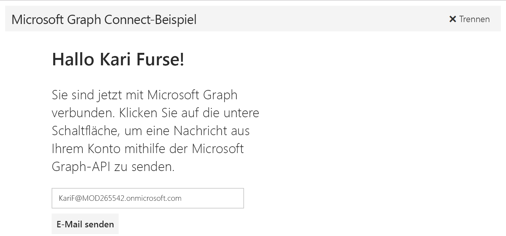

# Erste Schritte mit Microsoft Graph in einer Angular JS-App

Dieser Artikel beschreibt die erforderlichen Aufgaben zum Abrufen eines Zugriffstokens vom Azure AD v2.0-Endpunkt und zum Aufrufen von Microsoft Graph. Sie werden durch die Erstellung des [Microsoft Connect-Beispiels für Angular JS](https://github.com/microsoftgraph/angular-connect-rest-sample) geführt und erhalten Informationen zu den Hauptkonzepten, die Sie zur Verwendung von Microsoft Graph implementieren. In diesem Artikel wird auch beschrieben, wie Sie mithilfe des [Microsoft Graph-SDKs für JavaScript](https://github.com/microsoftgraph/msgraph-sdk-javascript) oder reinen REST-Aufrufen auf Microsoft Graph zugreifen.

In der folgenden Abbildung ist die App dargestellt, die Sie erstellen. 

**Sie möchten keine App erstellen?** Verwenden Sie für einen schnellen Einstieg den [Schnellstart Microsoft Graph](https://graph.microsoft.io/en-us/getting-started).

Zum Herunterladen einer Version des Connect-Beispiels, das den Endpunkt Azure AD verwendet, siehe [Microsoft Graph Connect-Beispiel für Angular JS](https://github.com/microsoftgraph/angular-connect-rest-sample/releases/tag/last_v1_auth).

## Voraussetzungen

Für die ersten Schritte benötigen Sie: 

- Ein [Microsoft-Konto](https://www.outlook.com/) oder ein [Geschäfts- oder Schulkonto](http://dev.office.com/devprogram)
- [Node.js with npm](https://nodejs.org/en/download/)
- [Bower](https://bower.io)
- Das [Microsoft Connect-Beispiel für AngularJS](https://github.com/microsoftgraph/angular-connect-sample). Für diese exemplarische Vorgehensweise verwenden Sie den Ordner **Startprojekt** in den Beispieldateien.

## Registrieren der App
Registrieren Sie eine App im Microsoft App-Registrierungsportal. Dadurch werden die APP-ID und das Kennwort generiert, mit der bzw. dem Sie die App in Visual Studio konfigurieren.

1. Melden Sie sich beim [Microsoft-App-Registrierungsportal](https://apps.dev.microsoft.com/) entweder mit Ihrem persönlichen oder geschäftlichen Konto oder mit Ihrem Schulkonto an.

2. Klicken Sie auf **App hinzufügen**.

3. Geben Sie einen Namen für die App ein, und wählen Sie **Anwendung erstellen** aus. 
    
    Die Registrierungsseite wird angezeigt, und die Eigenschaften der App werden aufgeführt.

4. Kopieren Sie die Anwendungs-ID: Hierbei handelt es sich um einen eindeutigen Bezeichner, die Sie für die Konfiguration der App verwenden werden.

5. Wählen Sie unter **Plattformen** die Option **Plattform hinzufügen** > **Web** aus.

6. Stellen Sie sicher, dass das Kontrollkästchen **Impliziten Fluss zulassen** aktiviert ist, und geben Sie *http://localhost:8080/* als Umleitungs-URI ein. 

7. Wählen Sie **Speichern** aus.

## Konfigurieren des Projekts
1. Öffnen Sie den Ordner **Startprojekt** in den Beispieldateien.
2. Führen Sie die folgenden Befehle in einem Eingabeaufforderungsfenster im Stammverzeichnis des Startprojekts aus. Dadurch werden die Projekt-Abhängigkeiten installiert.

        npm install  
        bower install
    
3. Öffnen Sie in den Startprojektdateien im Ordner **Öffentlich/Skripts** config.js.
4. Ersetzen Sie im Feld **Client-ID** den Platzhalterwert **ENTER_YOUR_CLIENT_ID** durch die Anwendungs-ID, die Sie gerade kopiert haben.

## Aufrufen von Microsoft Graph mit dem SDK
Die App ruft Microsoft Graph auf, um Benutzerinformationen abzurufen und eine E-Mail-Nachricht im Auftrag des Benutzers zu senden. Diese Anrufe werden vom Maincontroller als Antwort auf UI-Ereignisse initiiert.

Öffnen Sie „app.js“, und fügen Sie den folgenden Code an das Ende der Datei an. Dadurch wird das SDK initialisiert.

    var authToken;
    var graphClient = MicrosoftGraph.Client.init({
        authProvider: function(done) {
        if (typeof authToken === "undefined") {
          done({err: "No auth token"})
        } else {
          done(null, authToken); //first parameter takes an error if you can't get an access token
        }
        }
    });

### Verwenden des SDK
1. Ersetzen Sie in „graphHelper.js“ *//Profil des aktuellen Benutzers abrufen* durch folgenden Code. Dadurch wird die GET-Anforderung konfiguriert und an den Endpunkt */me* gesendet und die Antwort verarbeitet.

        // Get the profile of the current user.
        me: function me() {
          return graphClient.api('/me').get();
        },
  
2. Ersetzen Sie *//Eine E-Mail im Namen des aktuellen Benutzers senden* durch folgenden Code. Dadurch wird die POST-Anforderung konfiguriert und an den Endpunkt */me/sendMail* gesendet und die Antwort verarbeitet.

        // Send an email on behalf of the current user.
        sendMail: function sendMail(email) {
          return graphClient.api('/me/sendMail').post({ 'message' : email, 'saveToSentItems': true });
        }

3. Öffnen Sie im Ordner **Öffentlich/Controller** „mainController.js“.

4. Ersetzen Sie *//Standard-Header und Benutzereigenschaften festlegen* durch folgenden Code. Dadurch wird das Zugriffstoken zu der HTTP-Anforderung hinzugefügt, das Profil des aktuellen Benutzers von **GraphHelper.me** abgerufen und die Antwort verarbeitet.

        // Set the default headers and user properties.
        function processAuth() {

        // let the authProvider access the access token
        authToken = localStorage.token;

        if (localStorage.getItem('user') === null) {

          // Get the profile of the current user.
          GraphHelper.me().then(function(user) {

            // Save the user to localStorage.
            localStorage.setItem('user', angular.toJson(user));

            vm.displayName = user.displayName;
            vm.emailAddress = user.mail || user.userPrincipalName;
          });
        } else {
          let user = angular.fromJson(localStorage.user);

          vm.displayName = user.displayName;
          vm.emailAddress = user.mail || user.userPrincipalName;
        }

        }

5. Ersetzen Sie *//Eine E-Mail im Namen des aktuellen Benutzers senden* durch folgenden Code. Dadurch wird die E-Mail-Nachricht erstellt , **GraphHelper.sendMail** aufgerufen und die Antwort verarbeitet.

        // Send an email on behalf of the current user.
        function sendMail() {

          authToken = localStorage.token;       

          // Build the HTTP request payload (the Message object).
          var email = {
          Subject: 'Welcome to Microsoft Graph development with Angular and the Microsoft Graph Connect sample',
          Body: {
            ContentType: 'HTML',
            Content: getEmailContent()
          },
          ToRecipients: [
            {
              EmailAddress: {
            Address: vm.emailAddress
              }
            }
          ]
          };

          // Save email address so it doesn't get lost with two way data binding.
          vm.emailAddressSent = vm.emailAddress;
          GraphHelper.sendMail(email)
        .then(function (response) {
          $log.debug('HTTP request to the Microsoft Graph API returned successfully.', response);
          vm.requestSuccess = true;
          vm.requestFinished = true;
          $scope.$apply();
        }, function (error) {
          $log.error('HTTP request to the Microsoft Graph API failed.');
          vm.requestSuccess = false;
          vm.requestFinished = true;
          $scope.$apply();
        });

        };

6. Speichern Sie all Ihre Änderungen.

## Ausführen der App

1. Führen Sie den folgenden Befehl in einem Eingabeaufforderungsfenster im Stammverzeichnis des Startprojekts aus.

        npm start

2. Navigieren Sie in einem Browser zu *http://localhost:8080*, und wählen Sie die Schaltfläche **Verbinden** aus.

3. Melden Sie sich an, und erteilen Sie die erforderlichen Berechtigungen. 

4. Optional können Sie die E-Mail-Adresse des Empfängers bearbeiten. Klicken Sie dann auf die Schaltfläche **E-Mail senden**. Nachdem die E-Mail gesendet wurde, wird unter der Schaltfläche eine Erfolgsmeldung angezeigt. 

## Nächste Schritte
- Testen Sie die REST-API mithilfe des [Graph-Explorers](https://developer.microsoft.com/graph/graph-explorer).
- Weitere [AngularJS-Proben](https://github.com/search?utf8=%E2%9C%93&q=angular+sample+user%3Amicrosoftgraph&type=Repositories&ref=searchresults) finden Sie auf GitHub.

## Siehe auch
- [Azure AD v2.0-Protokolle](https://azure.microsoft.com/en-us/documentation/articles/active-directory-v2-protocols/)
- [Azure AD v2.0-Tokens](https://azure.microsoft.com/en-us/documentation/articles/active-directory-v2-tokens/)
