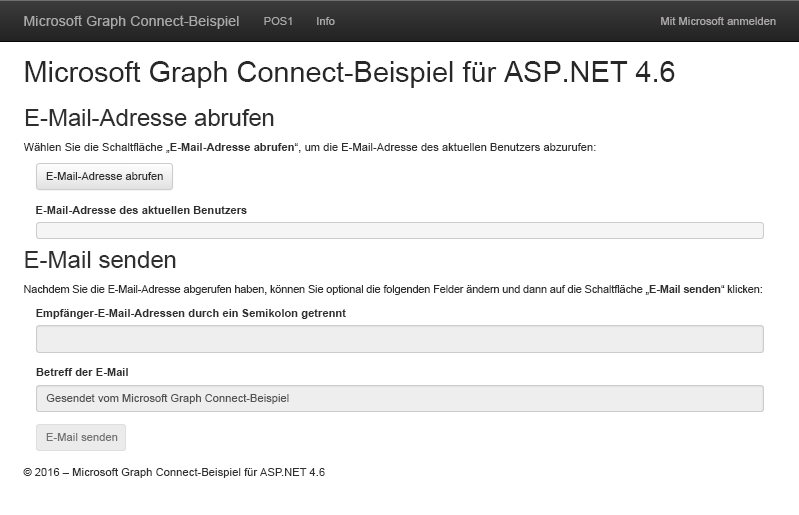

# Erste Schritte mit Microsoft Graph in einer ASP.NET 4.6 MVC-AppGet started with Microsoft Graph in an ASP.NET 4.6 MVC app

Dieser Artikel beschreibt die erforderlichen Aufgaben zum Abrufen eines Zugriffstoken vom Azure AD v2.0-Endpunkt und zum Aufrufen von Microsoft Graph. Sie werden durch die Erstellung des [Microsoft Graph Connect-Beispiels für ASP.NET 4.6](https://github.com/microsoftgraph/aspnet-connect-sample) geführt und erhalten Informationen zu den Hauptkonzepten, die Sie zur Verwendung von Microsoft Graph implementieren.This article describes the tasks required to get an access token from the Azure AD v2.0 endpoint and call Microsoft Graph. It walks you through building the [Microsoft Graph Connect Sample for ASP.NET 4.6](https://github.com/microsoftgraph/aspnet-connect-sample) and explains the main concepts that you implement to use Microsoft Graph.

In der folgenden Abbildung ist die App dargestellt, die Sie erstellen.The following image shows the app you'll create. 

Der [Azure AD Version 2.0-Endpunkt](https://azure.microsoft.com/de-DE/documentation/articles/active-directory-appmodel-v2-overview) ermöglicht Benutzern, sich mit einem Microsoft-Konto (MSA) oder einem Geschäfts-, Schul- oder Unikonto anzumelden. Die App verwendet die [ASP.Net OpenID Connect OWIN Middleware](https://www.nuget.org/packages/Microsoft.Owin.Security.OpenIdConnect/) und die [Microsoft Authentication Library (MSAL) für .NET](https://www.nuget.org/packages/Microsoft.Identity.Client) für die Anmeldung und die Token-Verwaltung.The [Azure AD v2.0 endpoint](https://azure.microsoft.com/de-DE/documentation/articles/active-directory-appmodel-v2-overview) lets users sign in with a Microsoft account (MSA) or a work or school account. The app uses the [ASP.Net OpenID Connect OWIN middleware](https://www.nuget.org/packages/Microsoft.Owin.Security.OpenIdConnect/) and the [Microsoft Authentication Library (MSAL) for .NET](https://www.nuget.org/packages/Microsoft.Identity.Client) for sign in and token management.

**Sie möchten keine App erstellen?** Verwenden Sie für einen schnellen Einstieg den [Microsoft Graph-Schnellstart](https://developer.microsoft.com/de-DE/graph/quick-start). Beachten Sie auch, dass es eine [REST-Version dieses Beispiels](https://github.com/microsoftgraph/aspnet-connect-rest-sample) gibt.**Don't feel like building an app?** Use the [Microsoft Graph quick start](https://developer.microsoft.com/de-DE/graph/quick-start) to get up and running fast. Also note that we have a [REST version of this sample](https://github.com/microsoftgraph/aspnet-connect-rest-sample).

## VoraussetzungenPrerequisites

Für die ersten Schritte benötigen Sie:To get started, you'll need: 

- Ein [Microsoft-Konto](https://www.outlook.com/) oder ein [Geschäfts- oder Schulkonto](https://docs.microsoft.com/de-DE/office/developer-program/office-365-developer-program-faq#account-types)A [Microsoft account](https://www.outlook.com/) or a [work or school account](https://docs.microsoft.com/de-DE/office/developer-program/office-365-developer-program-faq#account-types)
- Visual Studio 2015Visual Studio 2015 
- [Microsoft Graph Connect-Beispiel für ASP.NET 4.6](https://github.com/microsoftgraph/aspnet-connect-sample). Sie verwenden den Ordner **Startprojekt** in den Beispieldateien.The [Microsoft Graph Connect Sample for ASP.NET 4.6](https://github.com/microsoftgraph/aspnet-connect-sample). You'll use the **starter-project** folder in the sample files.

## Registrieren der AppRegister the application

In diesem Schritt registrieren Sie eine App im Microsoft App-Registrierungsportal. Dadurch werden die APP-ID und das Kennwort generiert, mit der bzw. dem Sie die App in Visual Studio konfigurieren.In this step, you'll register an app on the Microsoft App Registration Portal. This generates the app ID and password that you'll use to configure the app in Visual Studio.

1. Melden Sie sich beim [Microsoft-App-Registrierungsportal](https://apps.dev.microsoft.com/) entweder mit Ihrem persönlichen oder geschäftlichen Konto oder mit Ihrem Schulkonto an.Sign into the [Microsoft App Registration Portal](https://apps.dev.microsoft.com/) using either your personal or work or school account.

2. Klicken Sie auf **App hinzufügen**.Choose **Add an app**.

3. Geben Sie einen Namen für die App ein, und wählen Sie **Anwendung erstellen** aus.Enter a name for the app, and choose **Create application**. 
    
    Die Registrierungsseite wird angezeigt, und die Eigenschaften der App werden aufgeführt.The registration page displays, listing the properties of your app.

4. Kopieren Sie die Anwendungs-ID: Dies ist der eindeutige Bezeichner für Ihre App.Copy the application ID. This is the unique identifier for your app. 

5. Wählen Sie unter **Anwendungsgeheimnisse** die Option **Neues Kennwort generieren** aus. Kopieren Sie das Kennwort aus dem Dialogfeld **Neues Kennwort wurde generiert**.Under **Application Secrets**, choose **Generate New Password**. Copy the password from the **New password generated** dialog.

    Sie werden die Anwendungs-ID und das Kennwort verwenden, um die App zu konfigurieren.You'll use the application ID and password to configure the app. 

6. Klicken Sie unter **Plattformen** auf **Plattform hinzufügen** > **Web**.Under **Platforms**, choose **Add platform** > **Web**.

7. Vergewissern Sie sich, dass das Kontrollkästchen **Allow Implicit Flow** aktiviert ist, und geben Sie als Umleitungs-URI *http://localhost:55065/* ein.Make sure the Allow Implicit Flow check box is selected, and enter http://localhost:55065/ as the Redirect URI. 

    Die Option **Impliziten Fluss zulassen** ermöglicht den OpenID Connect-Hybridfluss. Während der Authentifizierung ermöglicht dies der App, sowohl Anmeldeinformationen (das **id_token**) als auch Artefakte (in diesem Fall ein Autorisierungscode) abzurufen, den die App zum Abrufen eines Zugriffstokens verwendet.The **Allow Implicit Flow** option enables the OpenID Connect hybrid flow. During authentication, this enables the app to receive both sign-in info (the **id_token**) and artifacts (in this case, an authorization code) that the app uses to obtain an access token.

8. Wählen Sie **Speichern** aus.Choose **Save**.

### Konfigurieren des ProjektsConfigure the project

1. Öffnen Sie die Projektmappendatei für das Startprojekt in Visual Studio.Open the solution file for the starter project in Visual Studio.

2. Öffnen Sie die Datei Web.config des Projekts.Open the project's Web.config file.

3. Suchen Sie die App-Konfigurationsschlüssel im Element **AppSettings**. Ersetzen Sie die Platzhalterwerte ENTER_YOUR_CLIENT_ID und ENTER_YOUR_SECRET durch die Werte, die Sie soeben kopiert haben.Locate the app configuration keys in the **appSettings** element. Replace the ENTER_YOUR_CLIENT_ID and ENTER_YOUR_SECRET placeholder values with the values you just copied.

Der Umleitung-URI ist die URL des Projekts, das Sie registriert haben. Die angeforderten [Berechtigungsbereiche](https://developer.microsoft.com/de-DE/graph/docs/concepts/permission_scopes) ermöglichen der App das Abrufen der Benutzerprofilinformationen und das Senden einer E-Mail.The redirect URI is the URL of the project that you registered. The requested [permission scopes](https://developer.microsoft.com/de-DE/graph/docs/concepts/permission_scopes) allow the app to get user profile information and send an email.

## Aufrufen von Microsoft GraphCall Microsoft Graph

In diesem Schritt liegt der Schwerpunkt auf den Klassen **SDKHelper**, **GraphService** und **HomeController**.In this step, you'll focus on the **SDKHelper**, **GraphService**, and **HomeController** classes. 

 - **SDKHelper** Initialisiert eine Instanz von **GraphServiceClient** aus der Bibliothek vor jedem Aufruf von Microsoft Graph. Zu diesem Zeitpunkt wir der Zugriffstoken der Anforderung hinzugefügt.**SDKHelper** intializes an instance of the **GraphServiceClient** from the library before each call to the Microsoft Graph. This is when the access token is added to the request. 
 - **GraphService** erstellt und sendet mithilfe der Bibliothek Anfragen an Microsoft Graph und verarbeitet die Antworten.**GraphService** builds and sends requests to the Microsoft Graph using the library, and processes the responses.
 - **HomeController** enthält Aktionen, die Bibliotheksaufrufe als Antwort auf Benutzeroberflächenereignisse auslösen.**HomeController** contains actions that initiate the calls to the library in response to UI events.

Das Startprojekt deklariert bereits eine Abhängigkeit für das Microsoft Graph .NET Client Library NuGet-Paket:  *Microsoft.Graph*.The starter project already declares a dependency for the Microsoft Graph .NET Client Library NuGet package:  *Microsoft.Graph*.

1. Klicken Sie mit der rechten Maustaste in den Ordner **Hilfsprogramme** Ordner, und wählen Sie **Hinzufügen** > **Klasse**.Right-click the **Helpers** folder and choose **Add** > **Class**. 

1. Nennen Sie die neue Klasse *SDKHelper*, und wählen Sie **Hinzufügen**.Name the new class *SDKHelper* and choose **Add**.

1. Ersetzen Sie den Inhalt durch den folgenden Code.Replace the contents with the following code.

        using System.Net.Http.Headers;
        using Microsoft.Graph;

        namespace Microsoft_Graph_SDK_ASPNET_Connect.Helpers
        {
            public class SDKHelper
            {   
                private static GraphServiceClient graphClient = null;

                // Get an authenticated Microsoft Graph Service client.
                public static GraphServiceClient GetAuthenticatedClient()
                {
                    GraphServiceClient graphClient = new GraphServiceClient(
                        new DelegateAuthenticationProvider(
                            async (requestMessage) =>
                            {
                                string accessToken = await SampleAuthProvider.Instance.GetUserAccessTokenAsync();

                                // Append the access token to the request.
                                requestMessage.Headers.Authorization = new AuthenticationHeaderValue("bearer", accessToken);
                            }));
                    return graphClient;
                }

                public static void SignOutClient()
                {
                    graphClient = null;
                }
            }
        }

  Beachten Sie den Aufruf von **SampleAuthProvider**, um den Token abzurufen, wenn der Client initialisiert wird.Note the call to **SampleAuthProvider** to get the token when the client is initialized.

1. Im Ordner **Modelle** öffnen Sie GraphService.cs. Der Dienst verwendet die Bibliothek zur Interaktion mit dem Microsoft Graph.In the **Models** folder, open GraphService.cs. The service uses the library to interact with the Microsoft Graph.

1. Fügen Sie die folgende **using**-Anweisung hinzu.Add the following **using** statement.

        using Microsoft.Graph;

1. Ersetzen Sie */ / GetMyEmailAddress* durch die folgende Methode. Dadurch wird die E-Mail-Adresse des aktuellen Benutzers abgerufen.Replace *// GetMyEmailAddress* with the following method. This gets the current user's email address. 

        // Get the current user's email address from their profile.
        public async Task<string> GetMyEmailAddress(GraphServiceClient graphClient)
        {

            // Get the current user. 
            // The app only needs the user's email address, so select the mail and userPrincipalName properties.
            // If the mail property isn't defined, userPrincipalName should map to the email for all account types. 
            User me = await graphClient.Me.Request().Select("mail,userPrincipalName").GetAsync();
            return me.Mail ?? me.UserPrincipalName;
        }

  Beachten Sie das **Select**-Segment, mit dem nur **mail** und **UserPrinicipalName** zurückgegeben werden. Sie können mit **Select** und **Filter** die Größe der Antwortdaten-Nutzlast verringern.Note the **Select** segment, which requests only the **mail** and **userPrinicipalName** to be returned. You can use **Select** and **Filter** to reduce the size of the response data payload.

1. Ersetzen Sie */ / SendEmail* mit den folgenden Methoden zum Erstellen und Senden der E-Mail.Replace *// SendEmail* with the following methods to build and send the email.

        // Send an email message from the current user.
        public async Task SendEmail(GraphServiceClient graphClient, Message message)
        {
            await graphClient.Me.SendMail(message, true).Request().PostAsync();
        }

        public async Task<Message> BuildEmailMessage(GraphServiceClient graphClient, string recipients, string subject)
        {

            // Get current user photo
            Stream photoStream = await GetCurrentUserPhotoStreamAsync(graphClient);

            // If the user doesn't have a photo, or if the user account is MSA, we use a default photo

            if ( photoStream == null)
            {
                photoStream = System.IO.File.OpenRead(System.Web.Hosting.HostingEnvironment.MapPath("/Content/test.jpg"));
            }

            MemoryStream photoStreamMS = new MemoryStream();
            // Copy stream to MemoryStream object so that it can be converted to byte array.
            photoStream.CopyTo(photoStreamMS);

            DriveItem photoFile = await UploadFileToOneDrive(graphClient, photoStreamMS.ToArray());

            MessageAttachmentsCollectionPage attachments = new MessageAttachmentsCollectionPage();
            attachments.Add(new FileAttachment
            {
                ODataType = "#microsoft.graph.fileAttachment",
                ContentBytes = photoStreamMS.ToArray(),
                ContentType = "image/png",
                Name = "me.png"
            });

            Permission sharingLink = await GetSharingLinkAsync(graphClient, photoFile.Id);

            // Add the sharing link to the email body.
            string bodyContent = string.Format(Resource.Graph_SendMail_Body_Content, sharingLink.Link.WebUrl);

            // Prepare the recipient list.
            string[] splitter = { ";" };
            string[] splitRecipientsString = recipients.Split(splitter, StringSplitOptions.RemoveEmptyEntries);
            List<Recipient> recipientList = new List<Recipient>();
            foreach (string recipient in splitRecipientsString)
            {
                recipientList.Add(new Recipient
                {
                    EmailAddress = new EmailAddress
                    {
                        Address = recipient.Trim()
                    }
                });
            }

            // Build the email message.
            Message email = new Message
            {
                Body = new ItemBody
                {
                    Content = bodyContent,
                    ContentType = BodyType.Html,
                },
                Subject = subject,
                ToRecipients = recipientList,
                Attachments = attachments
            };
            return email;
        }

        // Gets the stream content of the signed-in user's photo. 
        // This snippet doesn't work with consumer accounts.
        public async Task<Stream> GetCurrentUserPhotoStreamAsync(GraphServiceClient graphClient)
        {
            Stream currentUserPhotoStream = null;

            try
            {
                currentUserPhotoStream = await graphClient.Me.Photo.Content.Request().GetAsync();

            }

            // If the user account is MSA (not work or school), the service will throw an exception.
            catch (ServiceException)
            {
                return null;
            }

            return currentUserPhotoStream;

        }

        // Uploads the specified file to the user's root OneDrive directory.
        public async Task<DriveItem> UploadFileToOneDrive(GraphServiceClient graphClient, byte[] file)
        {
            DriveItem uploadedFile = null;

            try
            {
                MemoryStream fileStream = new MemoryStream(file);
                uploadedFile = await graphClient.Me.Drive.Root.ItemWithPath("me.png").Content.Request().PutAsync<DriveItem>(fileStream);

            }

            catch (ServiceException)
            {
                return null;
            }

            return uploadedFile;
        }

        public static async Task<Permission> GetSharingLinkAsync(GraphServiceClient graphClient, string Id)
        {
            Permission permission = null;

            try
            {
                permission = await graphClient.Me.Drive.Items[Id].CreateLink("view").Request().PostAsync();
            }

            catch (ServiceException)
            {
                return null;
            }

            return permission;
        }

1. Im Ordner **Controller** öffnen Sie HomeController.cs.In the **Controllers** folder, open HomeController.cs.

1. Fügen Sie die folgende **using**-Anweisung hinzu.Add the following **using** statement.

        using Microsoft.Graph;
  
1. Ersetzen Sie *// Controller actions* durch die folgenden Aktionen.Replace *// Controller actions* with the following actions.

        [Authorize]
        // Get the current user's email address from their profile.
        public async Task<ActionResult> GetMyEmailAddress()
        {
            try
            {

                // Initialize the GraphServiceClient.
                GraphServiceClient graphClient = SDKHelper.GetAuthenticatedClient();

                // Get the current user's email address. 
                ViewBag.Email = await graphService.GetMyEmailAddress(graphClient);
                return View("Graph");
            }
            catch (ServiceException se)
            {
                if (se.Error.Message == Resource.Error_AuthChallengeNeeded) return new EmptyResult();
                return RedirectToAction("Index", "Error", new { message = Resource.Error_Message + Request.RawUrl + ": " + se.Error.Message });
            }
        }

        [Authorize]
        // Send mail on behalf of the current user.
        public async Task<ActionResult> SendEmail()
        {
            if (string.IsNullOrEmpty(Request.Form["email-address"]))
            {
                ViewBag.Message = Resource.Graph_SendMail_Message_GetEmailFirst;
                return View("Graph");
            }

            try
            {

                // Initialize the GraphServiceClient.
                GraphServiceClient graphClient = SDKHelper.GetAuthenticatedClient();

                // Build the email message.
                Message message = await graphService.BuildEmailMessage(graphClient, Request.Form["recipients"], Request.Form["subject"]);

                // Send the email.
                await graphService.SendEmail(graphClient, message);

                // Reset the current user's email address and the status to display when the page reloads.
                ViewBag.Email = Request.Form["email-address"];
                ViewBag.Message = Resource.Graph_SendMail_Success_Result;
                return View("Graph");
            }
            catch (ServiceException se)
            {
                if (se.Error.Code == Resource.Error_AuthChallengeNeeded) return new EmptyResult();
                return RedirectToAction("Index", "Error", new { message = Resource.Error_Message + Request.RawUrl + ": " + se.Error.Message });
            }
        }

Jetzt können Sie [die App ausführen](#run-the-app).Now you're ready to [run the app](#run-the-app).

## Ausführen der AppRun the app
1. Drücken Sie zum Erstellen und Ausführen der App F5.Press F5 to build and run the app. 

2. Melden Sie sich mit Ihrem persönlichen Konto oder mit Ihrem Geschäfts- oder Schulkonto an, und gewähren Sie die erforderlichen Berechtigungen.Sign in with your personal or work or school account and grant the requested permissions.

3. Klicken Sie auf die Schaltfläche **E-Mail-Adresse abrufen**. Wenn der Vorgang abgeschlossen ist, wird die E-Mail-Adresse des angemeldeten Benutzers auf der Seite angezeigt.Choose the **Get email address** button. When the operation completes, the email address of the signed-in user is displayed on the page.

4. Optional können Sie die Empfängerliste und den Betreff der E-Mail bearbeiten. Klicken Sie dann auf die Schaltfläche **E-Mail senden**. Nachdem die E-Mail gesendet wurde, wird unter der Schaltfläche eine Erfolgsmeldung angezeigt.Optionally edit the recipient list and email subject, and then choose the **Send email** button. When the mail is sent, a Success message is displayed below the button.

## Nächste SchritteNext steps
- Testen Sie die REST-API mithilfe des [Graph-Explorers](https://developer.microsoft.com/graph/graph-explorer).Try out the REST API using the [Graph explorer](https://developer.microsoft.com/graph/graph-explorer).
- Suchen Sie nach Beispielen für allgemeine Vorgänge im [Microsoft Graph-Codeausschnittbeispiel für ASP.NET 4.6](https://github.com/microsoftgraph/aspnet-snippets-sample). Sie können auch unsere anderen [ASP.NET-Beispiele](http://aka.ms/aspnetgraphsamples) auf GitHub erkunden.Find examples of common operations in the [Microsoft Graph Snippets Sample for ASP.NET 4.6](https://github.com/microsoftgraph/aspnet-snippets-sample), or explore our other [ASP.NET samples](http://aka.ms/aspnetgraphsamples) on GitHub.

## Siehe auchSee also
- [Microsoft Graph .NET ClientbibliothekMicrosoft Graph .NET Client Library](https://github.com/microsoftgraph/msgraph-sdk-dotnet)
- [Webanwendung mit Web-API-AuthentifizierungsszenarioWeb application to web API authentication scenario](https://azure.microsoft.com/de-DE/documentation/articles/active-directory-authentication-scenarios/#web-application-to-web-api)
- [Integrieren einer Microsoft-Identität und von Microsoft Graph in eine Webanwendung mithilfe von OpenID ConnectIntegrate Microsoft identity and the Microsoft Graph into a web application using OpenID Connect](https://azure.microsoft.com/de-DE/documentation/samples/active-directory-dotnet-webapp-openidconnect-v2/)
- [Azure AD v2.0-ProtokolleAzure AD v2.0 protocols](https://azure.microsoft.com/de-DE/documentation/articles/active-directory-v2-protocols/)
- [Azure AD v2.0-TokensAzure AD v2.0 tokens](https://azure.microsoft.com/de-DE/documentation/articles/active-directory-v2-tokens/)
