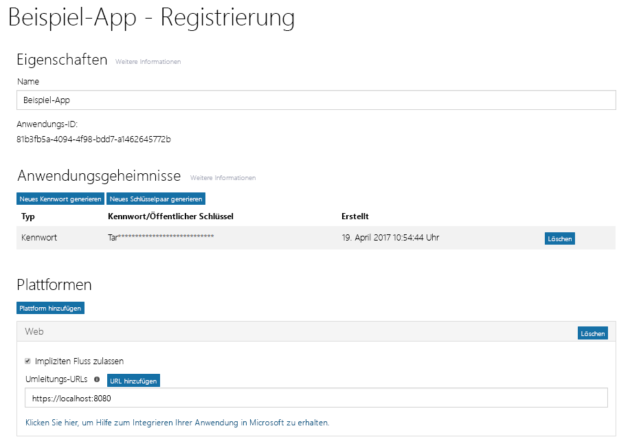

# Registrieren Ihrer App beim Azure AD v2.0-EndpunktRegister your app with the Azure AD v2.0 endpoint

Ihre App muss bei Azure AD registriert werden. Durch Registrieren Ihrer App werden eine eindeutige Anwendungs-ID und andere Werte erstellt, die die App zum Authentifizieren bei Azure AD und zum Abrufen von Tokens verwendet. Für den Azure AD v2.0-Endpunkt registrieren Sie Ihre App mit dem [Microsoft App-Registrierungsportal](https://apps.dev.microsoft.com). Sie können entweder ein Microsoft-Konto oder ein Geschäfts-, Schul- oder Unikonto zum Registrieren Ihrer App verwenden. Abhängig vom Typ der von Ihnen entwickelten App müssen Sie während der Registrierung eine oder mehrere Eigenschaften kopieren, die beim Konfigurieren von Authentifizierung und Autorisierung für die App verwendet werden sollen.Your app must be registered with Azure AD. Registering your app establishes a unique application ID and other values that your app uses to authenticate with Azure AD and get tokens. For the Azure AD v2.0 endpoint, you register your app with the [Microsoft App Registration Portal](https://apps.dev.microsoft.com). You can use either a Microsoft account or a work or school account to register your app. Depending on the type of app you are developing, you will need to copy one or more properties during registration to use when you configure authentication and authorization for your app. 

> **Hinweis:** Dieser Artikel befasst sich in erster Linie mit dem Registrieren von Apps beim Azure AD v2.0-Endpunkt. Informationen zum Registrieren Ihrer App beim Azure AD-Endpunkt finden Sie unter [Überlegungen zum Azure AD-Endpunkt](#azure-ad-endpoint-considerations) weiter unten.**Note:** This article primarily covers registering apps with the Azure AD v2.0 endpoint. For information about registering your app with the Azure AD endpoint, see [Azure AD endpoint considerations](#azure-ad-endpoint-considerations) below.
> 
> Beachten Sie außerdem Folgendes: Wenn Sie bereits zuvor Apps im Microsoft Azure-Portal registriert haben, werden diese nicht im App-Registrierungsportal aufgeführt.Also, be aware that if you've previously registered apps in the Microsoft Azure portal, those apps will not be listed in the App Registration Portal. Verwalten Sie diese Apps im Azure-Portal.Manage those apps in the Azure portal. 

Der folgende Screenshot zeigt ein Beispiel für die Registrierung einer Web-App, die mit einem Kennwort und implizitem Fluss konfiguriert wurde. The following screenshot shows an example web app registration that has been configured with a password and implicit flow. 

Führen Sie die folgenden Schritte aus, um Ihre App zu registrieren; denken Sie daran, die angegebenen Werte für die Konfiguration der Autorisierung für Ihre App zu kopieren:To register your app, follow these steps; be sure to copy the indicated values to use when configuring authorization for your app:

1. Melden Sie sich beim [Microsoft App-Registrierungsportal](https://apps.dev.microsoft.com/) an.Sign into the [Microsoft App Registration Portal](https://apps.dev.microsoft.com/).
   
    Sie können sich mit einem Microsoft-Konto oder einem Geschäfts-, Schul- oder Unikonto anmelden.You can sign in with either a Microsoft account or a work or school account. 

2. Klicken Sie auf **App hinzufügen**.Choose **Add an app**.
    > Hinweis: Wenn Sie sich mit einem Geschäfts-, Schul- oder Unikonto angemeldet haben, wählen Sie die Schaltfläche **App hinzufügen** für **Konvergente Anwendungen**.Note: If you signed in with a work or school account, select the **Add an app** button for **Converged applications**. 

3. Geben Sie einen Namen für die App ein, und wählen Sie **Anwendung erstellen** aus.Enter a name for the app and choose **Create application**.

    Die Registrierungsseite wird angezeigt, und die Eigenschaften der App werden aufgeführt.The registration page displays, listing the properties of your app.

4. Kopieren Sie die Anwendungs-ID: Dies ist der eindeutige Bezeichner für Ihre App.Copy the application ID. This is the unique identifier for your app.

    Sie werden die Anwendungs-ID verwenden, um die App zu konfigurieren.You'll use the application ID to configure the app.

5. Wählen Sie unter **Plattformen** **Plattform hinzufügen**, und wählen Sie die passende Plattform für Ihre App aus:Under **Platforms**, choose **Add Platform**, and select the appropriate platform for your app:
    
    **Für systemeigene oder mobile Apps**:**For native or mobile apps**:

    1. Wählen Sie **Systemeigene Anwendung**.Select **Native Application**.

    2. Kopieren Sie den Wert des **integrierten Umleitungs-URI**. Sie benötigen diesen, um Ihre App zu konfigurieren.Copy the **Built-in redirect URI** value. You'll need this to configure your app.

        Der Umleitungs-URI ist ein eindeutiger URI für Ihre Anwendung, der sicherstellt, dass an diesen URI gesendete Nachrichten nur an diese Anwendung gesendet werden.The redirect URI is a unique URI provided for your application to ensure that messages sent to that URI are only sent to that application. 

    **Für Web-Apps:****For web apps**:

    1. Klicken Sie auf **Web**.Select **Web**.

    2. Abhängig vom verwendeten Authentifizierungsflusstyp müssen Sie möglicherweise sicherstellen, dass das Kontrollkästchen **Impliziten Fluss zulassen** aktiviert ist.Depending on the type of authentication flow you're using, you may have to make sure the **Allow Implicit Flow** check box is selected. 
        
        Die Option **Impliziten Fluss zulassen** aktiviert den hybriden und den impliziten OpenID Connect-Fluss. Der hybride Fluss ermöglicht es der App, sowohl Anmeldeinformationen (das ID-Token) als auch Artefakte (in diesem Fall einen Autorisierungscode) zu erhalten, die die App zum Abrufen eines Zugriffstokens verwendet. Der hybride Fluss ist der von der Middleware OWIN OpenID Connect verwendete Standardfluss. Für Einzelseiten-Apps (SPA) ermöglicht der implizite Fluss der App, Anmeldeinformationen und das Zugriffstoken zu erhalten.The **Allow Implicit Flow** option enables the OpenID Connect hybrid and implicit flows. The hybrid flow enables the app to receive both sign-in info (the id token) and artifacts (in this case, an authorization code) that the app uses to obtain an access token. The hybrid flow is the default flow used by the OWIN OpenID Connect middleware. For single page apps (SPA), the implicit flow enables the app to receive sign-in info and the access token. 

    3. Geben Sie eine Umleitungs-URL an.Specify a Redirect URL.
        
        Die Umleitungs-URL ist die Position in Ihrer App, die der Azure AD v2.0-Endpunkt aufruft, wenn er die Authentifizierungsanforderung verarbeitet hat.The redirect URL is the location in your app that the Azure AD v2.0 endpoint calls when it has processed the authentication request.

    4. Wählen Sie unter **Anwendungsgeheimnisse** die Option **Neues Kennwort generieren** aus. Kopieren Sie das Anwendungsgeheimnis aus dem Dialogfeld **Neues Kennwort wurde generiert**.Under **Application Secrets**, choose **Generate New Password**. Copy the app secret from the **New password generated** dialog box.
        > **Wichtig:** Sie müssen das Anwendungsgeheimnis kopieren, bevor Sie das Dialogfeld **Neues Kennwort wurde generiert** schließen. Nachdem Sie das Dialogfeld geschlossen haben, können Sie das Geheimnis nicht mehr abrufen.**Important** You must copy the app secret before you close the **New password generated** dialog. After you close the dialog, you cannot retrieve the secret. 
            
6. Wählen Sie **Speichern** aus.Choose **Save**.

Die folgende Tabelle zeigt die Eigenschaften, die Sie für verschiedene Arten von Apps konfigurieren und kopieren müssen. _Zugewiesen_ bedeutet, dass Sie den von Azure AD zugewiesenen Wert verwenden sollten.The following table shows the properties that you need to configure and copy for different kinds of apps. _Assigned_ means that you should use the value assigned by Azure AD.

| App-TypApp type | PlattformPlatform | Anwendungs-IDApplication ID | AnwendungsgeheimnisApplication Secret | Umleitungs-URI/-URLRedirect URI/URL | Impliziter FlussImplicit Flow 
| --- | --- | --- | --- | --- | --- |
| Systemeigen/MobilNative/Mobile | SystemeigenNative | ZugewiesenAssigned  | NeinNo | ZugewiesenAssigned | NeinNo |
| Web-AppWeb App | WebWeb | ZugewiesenAssigned | JaYes | JaYes | OptionalOptional  Die Middleware OpenID Connect verwendet standardmäßig den hybriden Fluss (Ja)Open ID Connect middleware uses hybrid flow by default (Yes) | 
| Einzelseiten-App (Single Page App, SPA)Single Page App (SPA) | WebWeb | ZugewiesenAssigned | JaYes | JaYes | JaYes   SPAs verwenden den impliziten OpenID Connect-FlussSPAs use Open ID Connect implicit Flow |
| Dienst/DämonService/Daemon | WebWeb | ZugewiesenAssigned | JaYes | JaYes | NeinNo |

Apps, die eine Funktion zur Administratorzustimmung bereitstellen, benötigen möglicherweise eine zusätzliche Umleitungs-URL, an die Azure AD die Antwort zurückgeben kann.Apps that provide an administrator consent experience may need an additional Redirect URL for Azure AD to return the response to.

Weitere Details zum App-Registrierungsportal und zu den Eigenschaften, die Sie für Ihre App konfigurieren können, finden Sie in der [Referenz zur App-Registrierung](https://docs.microsoft.com/de-DE/azure/active-directory/develop/active-directory-v2-registration-portal).For more detail about the App Registration Portal and the properties you can configure for your App, see [App registration reference](https://docs.microsoft.com/de-DE/azure/active-directory/develop/active-directory-v2-registration-portal).  

## Überlegungen zum Azure AD-EndpunktAzure AD endpoint considerations

Sie verwenden das [Azure-Portal](https://aka.ms/aadapplist), um Ihre App beim Azure AD-Endpunkt zu registrieren. Sie konfigurieren die gleichen grundlegenden Eigenschaften wie z. B. Anwendungs-ID, Anwendungsgeheimmis und Umleitungs-URI/-URL, die Sie auch für den v2.0-Endpunkt angeben; es sind jedoch einige wichtige Unterschiede zu beachten:You use the [Azure portal](https://aka.ms/aadapplist) to register your app for the Azure AD endpoint. You configure the same basic properties like Application ID, Application Secret, and Redirect URI/URL, as you would for the v2.0 endpoint; however, there are some important differences to be aware of: 

- Sie können zum Registrieren einer App nur ein Geschäfts-, Schul- oder Unikonto verwenden.You can only use a work or school account to register an app.
- Ihre App erfordert für jede Plattform eine andere Anwendungs-ID.Your app will require a different Application ID for each platform.
- Wenn Ihre App mehrinstanzenfähig ist, müssen Sie sie im Portal explizit als mehrinstanzenfähig konfigurieren.If your app is a multi-tenant app, you must explicitly configure it to be multi-tenant at the portal.
- Sie müssen alle Berechtigungen (einschließlich Microsoft Graph-Berechtigungen), die Ihre App im Portal benötigt, vorab konfigurieren.You must pre-configure all the permissions (including Microsoft Graph permissions) that your app needs at the portal. 

Eine Anleitung zur Verwendung des Azure-Portals zum Hinzufügen einer App finden Sie unter [Registrieren einer App beim Azure Active Directory v2.0-Endpunkt](https://docs.microsoft.com/de-DE/azure/active-directory/develop/quickstart-v2-register-an-app).For guidance on using the Azure portal to add an app, see [Register an app with the Azure Active Directory v2.0 endpoint](https://docs.microsoft.com/de-DE/azure/active-directory/develop/quickstart-v2-register-an-app).
