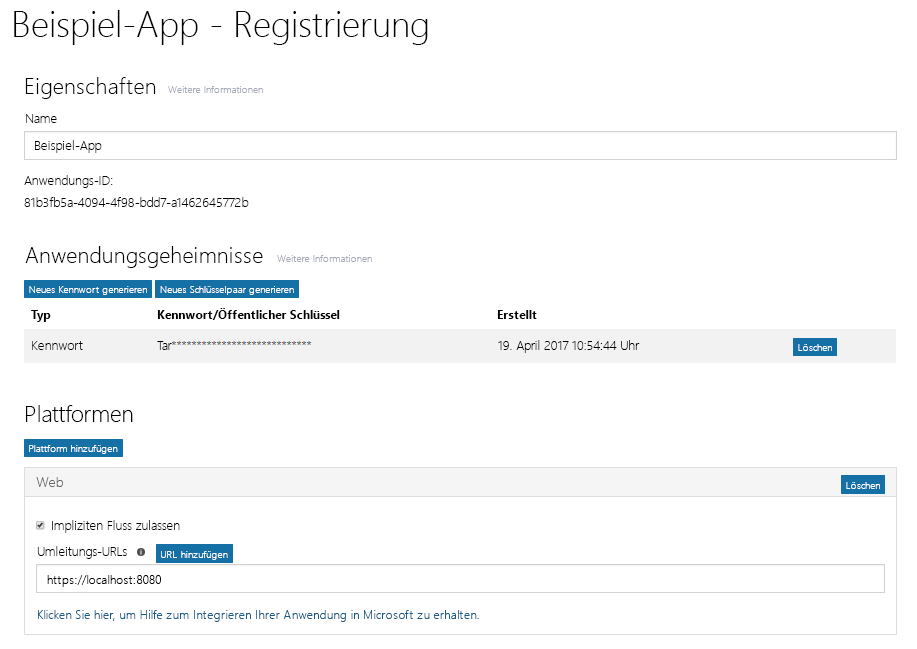
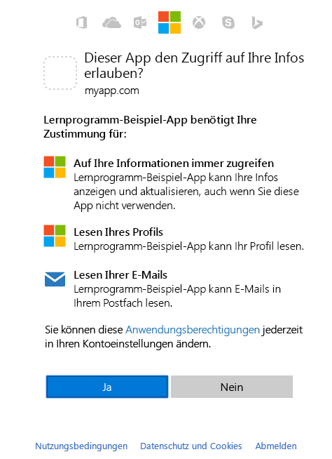

# <a name="get-access-on-behalf-of-a-user"></a><span data-ttu-id="a16f1-106">Im Namen eines Benutzers zugreifen</span><span class="sxs-lookup"><span data-stu-id="a16f1-106">Get access on behalf of a user</span></span>
<span data-ttu-id="a16f1-p102">Um Microsoft Graph zum Lesen und Schreiben von Ressourcen im Namen eines Benutzers zu verwenden, muss Ihre App ein Zugriffstoken von Azure AD abrufen und das Token an Anforderungen anfügen, die die API an Microsoft Graph sendet. Welchen Authentifizierungsfluss genau Sie zum Abrufen von Zugriffstoken verwenden, ist davon abhängig, welche Art von App Sie entwickeln und ob Sie OpenID Connect zum Anmelden des Benutzers bei Ihrer App verwenden möchten. Ein Fluss, der häufig von systemeigenen und mobilen Apps und auch von einigen Web-Apps verwendet wird, ist der Fluss zur Erteilung von OAuth 2.0-Autorisierungscodes. In diesem Thema werden anhand eines Beispiels die einzelnen Schritte dieses Flusses erläutert.</span><span class="sxs-lookup"><span data-stu-id="a16f1-p102">To use Microsoft Graph to read and write resources on behalf of a user, your app must get an access token from Azure AD and attach the token to requests that it sends to Microsoft Graph. The exact authentication flow that you will use to get access tokens will depend on the kind of app you are developing and whether you want to use OpenID Connect to sign the user in to your app. One common flow used by native and mobile apps and also by some Web apps is the OAuth 2.0 authorization code grant flow. In this topic, we will walk through an example using this flow.</span></span> 

## <a name="authentication-and-authorization-steps"></a><span data-ttu-id="a16f1-111">Authentifizierungs- und Autorisierungsschritte</span><span class="sxs-lookup"><span data-stu-id="a16f1-111">Authentication and Authorization steps</span></span>

<span data-ttu-id="a16f1-112">Um ein Zugriffstoken mit dem Fluss zur Erteilung von OAuth 2.0-Autorisierungscodes vom Azure AD v2.0-Endpunkt abzurufen, müssen die folgenden grundlegenden Schritte ausgeführt werden:</span><span class="sxs-lookup"><span data-stu-id="a16f1-112">The basic steps required to use the OAuth 2.0 authorization code grant flow to get an access token from the Azure AD v2.0 endpoint are:</span></span>

1. <span data-ttu-id="a16f1-113">Registrieren der App bei Azure AD</span><span class="sxs-lookup"><span data-stu-id="a16f1-113">Register your app with Azure AD.</span></span> 
2. <span data-ttu-id="a16f1-114">Abrufen eines Autorisierungscodes</span><span class="sxs-lookup"><span data-stu-id="a16f1-114">Get authorization.</span></span> 
3. <span data-ttu-id="a16f1-115">Abrufen eines Zugriffstokens</span><span class="sxs-lookup"><span data-stu-id="a16f1-115">Get an access token.</span></span>
4. <span data-ttu-id="a16f1-116">Aufrufen von Microsoft Graph mit dem Zugriffstoken</span><span class="sxs-lookup"><span data-stu-id="a16f1-116">Call Microsoft Graph with the access token.</span></span>
5. <span data-ttu-id="a16f1-117">Abrufen eines neuen Zugriffstokens mithilfe eines Aktualisierungstokens</span><span class="sxs-lookup"><span data-stu-id="a16f1-117">Use a refresh token to get a new access token.</span></span>

## <a name="1-register-your-app"></a><span data-ttu-id="a16f1-118">1. Registrieren der App</span><span class="sxs-lookup"><span data-stu-id="a16f1-118">1. Register your app</span></span>
<span data-ttu-id="a16f1-p103">Für den Azure AD v2.0-Endpunkt müssen Sie Ihre App im [Microsoft-App-Registrierungsportal](https://apps.dev.microsoft.com/) registrieren. Sie können entweder ein Microsoft-Konto oder ein Geschäfts-, Schul- oder Unikonto zum Registrieren einer App verwenden.</span><span class="sxs-lookup"><span data-stu-id="a16f1-p103">To use the Azure v2.0 endpoint, you must register your app at the [Microsoft App Registration Portal](https://apps.dev.microsoft.com/). You can use either a Microsoft account or a work or school account to register an app.</span></span> 

<span data-ttu-id="a16f1-p104">Der folgende Screenshot zeigt ein Beispiel für eine Web-App-Registrierung. </span><span class="sxs-lookup"><span data-stu-id="a16f1-p104">The following screenshot shows an example Web app registration. </span></span>

<span data-ttu-id="a16f1-123">Um eine App für die Verwendung des Flusses zur Erteilung von OAuth 2.0-Autorisierungscodes zu konfigurieren, müssen Sie beim Registrieren der App die folgenden Werte speichern:</span><span class="sxs-lookup"><span data-stu-id="a16f1-123">To configure an app to use the OAuth 2.0 authorization code grant flow, you'll need to save the following values when registering the app:</span></span>

- <span data-ttu-id="a16f1-124">Die Anwendung-ID, die vom App-Registrierungsportal zugewiesen wurde.</span><span class="sxs-lookup"><span data-stu-id="a16f1-124">The Application ID assigned by the app registration portal.</span></span>
- <span data-ttu-id="a16f1-p105">Ein Anwendungsgeheimnis, entweder ein Kennwort oder ein öffentliches/privates Schlüsselpaar (Zertifikat). Dies ist für systemeigene Apps nicht erforderlich.</span><span class="sxs-lookup"><span data-stu-id="a16f1-p105">An Application Secret, either a password or a public/private key pair (certificate). This is not required for native apps.</span></span> 
- <span data-ttu-id="a16f1-127">Eine Umleitungs-URL, damit Ihre App Antworten von Azure AD empfangen kann.</span><span class="sxs-lookup"><span data-stu-id="a16f1-127">A Redirect URL for your app to receive responses from Azure AD.</span></span>

<span data-ttu-id="a16f1-128">Schritte zum Konfigurieren einer App mit dem Microsoft-App-Registrierungsportal finden Sie unter [Apps registrieren](./auth-register-app-v2.md).</span><span class="sxs-lookup"><span data-stu-id="a16f1-128">For steps on how to configure an app using the Microsoft App Registration Portal, see [Register your app](./auth-register-app-v2.md).</span></span>

## <a name="2-get-authorization"></a><span data-ttu-id="a16f1-129">2. Abrufen eines Autorisierungscodes</span><span class="sxs-lookup"><span data-stu-id="a16f1-129">2. Get authorization</span></span>
<span data-ttu-id="a16f1-p106">Der erste Schritt zum Abrufen eines Zugriffstokens für viele OpenID Connect- und OAuth 2.0-Flüsse besteht darin, den Benutzer zum Azure AD v2.0 `/authorize`-Endpunkt umzuleiten. Azure AD meldet den Benutzer an und sichert dessen Zustimmung zu den von der App angeforderten Berechtigungen. Im Fluss zur Erteilung von Autorisierungscodes gibt Azure AD nach Erhalt der Zustimmung einen Autorisierungscode an Ihre App zurück, den diese beim Azure AD v2.0 `/token`-Endpunkt für ein Zugriffstoken einlösen kann.</span><span class="sxs-lookup"><span data-stu-id="a16f1-p106">The first step to getting an access token for many OpenID Connect and OAuth 2.0 flows is to redirect the user to the Azure AD v2.0 `/authorize` endpoint. Azure AD will sign the user in and ensure their consent for the permissions your app requests. In the authorization code grant flow, after consent is obtained, Azure AD will return an authorization_code to your app that it can redeem at the Azure AD v2.0 `/token` endpoint for an access token.</span></span>

### <a name="authorization-request"></a><span data-ttu-id="a16f1-133">Autorisierungsanforderung</span><span class="sxs-lookup"><span data-stu-id="a16f1-133">Authorization request</span></span> 
<span data-ttu-id="a16f1-134">Im Folgenden finden Sie ein Beispiel für eine an den `/authorize`-Endpunkt gesendete Anforderung.</span><span class="sxs-lookup"><span data-stu-id="a16f1-134">The following shows an example request to the `/authorize` endpoint.</span></span> 

<span data-ttu-id="a16f1-p107">Beim Azure AD v2.0-Endpunkt werden Berechtigungen mit dem `scope`-Parameter angefordert. In diesem Beispiel werden die Microsoft Graph-Berechtigungen _User.Read_ und _Mail.Read_ angefordert, die es der App ermöglichen, das Profil und die E-Mails des angemeldeten Benutzers zu lesen. Die Berechtigung _offline\_access_ wird angefordert, damit die App ein Aktualisierungstoken abrufen kann, um nach Ablauf des aktuellen Zugriffstokens ein neues abzurufen.</span><span class="sxs-lookup"><span data-stu-id="a16f1-p107">With the Azure AD v2.0 endpoint, permissions are requested using the `scope` parameter. In this example, the Microsoft Graph permissions requested are for _User.Read_ and _Mail.Read_, which will allow the app to read the profile and mail of the signed-in user. The _offline\_access_ permission is requested so that the app can get a refresh token, which it can use to get a new access token when the current one expires.</span></span> 

```
// Line breaks for legibility only

https://login.microsoftonline.com/{tenant}/oauth2/v2.0/authorize?
client_id=6731de76-14a6-49ae-97bc-6eba6914391e
&response_type=code
&redirect_uri=http%3A%2F%2Flocalhost%2Fmyapp%2F
&response_mode=query
&scope=offline_access%20user.read%20mail.read
&state=12345
```
| <span data-ttu-id="a16f1-138">Parameter</span><span class="sxs-lookup"><span data-stu-id="a16f1-138">Parameter</span></span> |  | <span data-ttu-id="a16f1-139">Beschreibung</span><span class="sxs-lookup"><span data-stu-id="a16f1-139">Description</span></span> |
| --- | --- | --- |
| <span data-ttu-id="a16f1-140">tenant</span><span class="sxs-lookup"><span data-stu-id="a16f1-140">tenant</span></span> |<span data-ttu-id="a16f1-141">Erforderlich</span><span class="sxs-lookup"><span data-stu-id="a16f1-141">required</span></span> |<span data-ttu-id="a16f1-p108">Mit dem Wert `{tenant}` im Pfad der Anforderung kann gesteuert werden, wer sich bei der Anwendung anmelden kann.  Die zulässigen Werte sind `common` für Microsoft-Konten und Geschäfts-, Schul- oder Unikonten, `organizations` nur für Geschäfts-, Schul- oder Unikonten, `consumers` nur für Microsoft-Konten und Mandantenbezeichner wie z. B. Mandanten-ID oder Domänenname.  Weitere Informationen finden Sie unter [Grundlagen zu Protokollen](https://docs.microsoft.com/azure/active-directory/develop/active-directory-v2-protocols#endpoints).</span><span class="sxs-lookup"><span data-stu-id="a16f1-p108">The `{tenant}` value in the path of the request can be used to control who can sign into the application.  The allowed values are `common` for both Microsoft accounts and work or school accounts, `organizations` for work or school accounts only, `consumers` for Microsoft accounts only, and tenant identifiers such as the tenant ID or domain name.  For more detail, see [protocol basics](https://docs.microsoft.com/azure/active-directory/develop/active-directory-v2-protocols#endpoints).</span></span> |
| <span data-ttu-id="a16f1-145">client_id</span><span class="sxs-lookup"><span data-stu-id="a16f1-145">client_id</span></span> |<span data-ttu-id="a16f1-146">erforderlich</span><span class="sxs-lookup"><span data-stu-id="a16f1-146">required</span></span> |<span data-ttu-id="a16f1-147">Die Anwendungs-ID, die Ihrer App vom Registrierungsportal ([apps.dev.microsoft.com](https://apps.dev.microsoft.com/?referrer=https://azure.microsoft.com/documentation/articles&deeplink=/appList)) zugewiesen wurde.</span><span class="sxs-lookup"><span data-stu-id="a16f1-147">The Application ID that the registration portal ([apps.dev.microsoft.com](https://apps.dev.microsoft.com/?referrer=https://azure.microsoft.com/documentation/articles&deeplink=/appList)) assigned your app.</span></span> |
| <span data-ttu-id="a16f1-148">response_type</span><span class="sxs-lookup"><span data-stu-id="a16f1-148">response_type</span></span> |<span data-ttu-id="a16f1-149">erforderlich</span><span class="sxs-lookup"><span data-stu-id="a16f1-149">required</span></span> |<span data-ttu-id="a16f1-150">Muss `code` für den Autorisierungscodefluss enthalten.</span><span class="sxs-lookup"><span data-stu-id="a16f1-150">Must include `code` for the authorization code flow.</span></span> |
| <span data-ttu-id="a16f1-151">redirect_uri</span><span class="sxs-lookup"><span data-stu-id="a16f1-151">redirect_uri</span></span> |<span data-ttu-id="a16f1-152">empfohlen</span><span class="sxs-lookup"><span data-stu-id="a16f1-152">recommended</span></span> |<span data-ttu-id="a16f1-p109">Der Umleitungs-URI Ihrer API, an den Authentifizierungsantworten gesendet und von Ihrer App empfangen werden können.  Er muss genau mit einem der Umleitungs-URIs übereinstimmen, die Sie im App-Registrierungsportal registriert haben, mit der Ausnahme, dass er URL-codiert sein muss.  Für systemeigene und mobile Apps sollten Sie den Standardwert `https://login.microsoftonline.com/common/oauth2/nativeclient` verwenden.</span><span class="sxs-lookup"><span data-stu-id="a16f1-p109">The redirect_uri of your app, where authentication responses can be sent and received by your app.  It must exactly match one of the redirect_uris you registered in the app registration portal, except it must be URL encoded.  For native and mobile apps, you should use the default value of `https://login.microsoftonline.com/common/oauth2/nativeclient`.</span></span> |
| <span data-ttu-id="a16f1-156">Umfang</span><span class="sxs-lookup"><span data-stu-id="a16f1-156">scope</span></span> |<span data-ttu-id="a16f1-157">Erforderlich</span><span class="sxs-lookup"><span data-stu-id="a16f1-157">required</span></span> |<span data-ttu-id="a16f1-p110">Eine mit Leerzeichen getrennte Liste von Microsoft Graph-Berechtigungen, denen der Benutzer zustimmen soll. Hierzu können auch OpenID-Bereiche gehören.</span><span class="sxs-lookup"><span data-stu-id="a16f1-p110">A space-separated list of the Microsoft Graph permissions that you want the user to consent to. This may also include OpenID scopes.</span></span> |
| <span data-ttu-id="a16f1-160">response_mode</span><span class="sxs-lookup"><span data-stu-id="a16f1-160">response_mode</span></span> |<span data-ttu-id="a16f1-161">empfohlen</span><span class="sxs-lookup"><span data-stu-id="a16f1-161">recommended</span></span> |<span data-ttu-id="a16f1-p111">Gibt die Methode an, die verwendet werden soll, um das resultierende Token an die App zurückzusenden.  Kann `query` oder `form_post` sein.</span><span class="sxs-lookup"><span data-stu-id="a16f1-p111">Specifies the method that should be used to send the resulting token back to your app.  Can be `query` or `form_post`.</span></span> |
| <span data-ttu-id="a16f1-164">Zustand</span><span class="sxs-lookup"><span data-stu-id="a16f1-164">state</span></span> |<span data-ttu-id="a16f1-165">empfohlen</span><span class="sxs-lookup"><span data-stu-id="a16f1-165">recommended</span></span> |<span data-ttu-id="a16f1-p112">Ein Wert, der in der Anforderung enthalten ist und ebenfalls in der Tokenantwort zurückgegeben wird.  Es kann eine Zeichenfolge beliebigen Inhalts sein.  In der Regel wird ein zufällig generierter eindeutiger Wert verwendet, um [websiteübergreifende Anforderungsfälschungsangriffe zu verhindern ](https://tools.ietf.org/html/rfc6749#section-10.12).  Der Status wird auch verwendet, um Informationen über den Status des Benutzers in der App vor dem Versand der Authentifizierungsanforderung zu codieren, z. B. die Seite oder die Ansicht, auf bzw. in der sich der Benutzer befunden hat.</span><span class="sxs-lookup"><span data-stu-id="a16f1-p112">A value included in the request that will also be returned in the token response.  It can be a string of any content that you wish.  A randomly generated unique value is typically used for [preventing cross-site request forgery attacks](https://tools.ietf.org/html/rfc6749#section-10.12).  The state is also used to encode information about the user's state in the app before the authentication request occurred, such as the page or view they were on.</span></span> |

> <span data-ttu-id="a16f1-p113">**Wichtig**: Microsoft Graph stellt zwei Arten von Berechtigungen zur Verfügung: Anwendungsberechtigungen und delegierte Berechtigungen. Für Apps, die mit einem angemeldeten Benutzer ausgeführt werden, fordern Sie delegierte Berechtigungen im `scope`-Parameter an. Diese Berechtigungen delegieren die Rechte des angemeldeten Benutzers an Ihre Anwendung und ermöglichen es ihr, als der angemeldete Benutzer zu agieren, wenn Aufrufe an Microsoft Graph gesendet werden. Ausführliche Informationen zu den in Microsoft Graph verfügbaren Berechtigungen finden Sie in der [Berechtigungsreferenz](./permissions-reference.md).</span><span class="sxs-lookup"><span data-stu-id="a16f1-p113">**Important**: Microsoft Graph exposes two kinds of permissions: application and delegated. For apps that run with a signed-in user, you request delegated permissions in the `scope` parameter. These permissions delegate the privileges of the signed-in user to your app, allowing it to act as the signed-in user when making calls to Microsoft Graph. For more detailed information about the permissions available through Microsoft Graph, see the [Permissions reference](./permissions-reference.md).</span></span>
 
### <a name="consent-experience"></a><span data-ttu-id="a16f1-174">Zustimmungsfunktionalität</span><span class="sxs-lookup"><span data-stu-id="a16f1-174">Consent experience</span></span>

<span data-ttu-id="a16f1-p114">An diesem Punkt wird der Benutzer aufgefordert, seine Anmeldeinformationen einzugeben, um sich bei Azure AD zu authentifizieren. Der v2.0-Endpunkt stellt außerdem sicher, dass der Benutzer den im `scope`-Parameter angegebenen Berechtigungen zugestimmt hat.  Wenn der Benutzer keiner dieser Berechtigungen zugestimmt hat und wenn nicht zuvor ein Administrator im Namen aller Benutzer in der Organisation seine Zustimmung erteilt hat, fordert Azure AD den Benutzer auf, den erforderlichen Berechtigungen zuzustimmen.</span><span class="sxs-lookup"><span data-stu-id="a16f1-p114">At this point, the user will be asked to enter their credentials to authenticate with Azure AD. The v2.0 endpoint will also ensure that the user has consented to the permissions indicated in the `scope` query parameter.  If the user has not consented to any of those permissions and if an administrator has not previously consented on behalf of all users in the organization, Azure AD will ask the user to consent to the required permissions.</span></span>  

<span data-ttu-id="a16f1-178">Hier sehen Sie ein Beispiel für das Zustimmungsdialogfeld, das für ein Microsoft-Konto angezeigt wird:</span><span class="sxs-lookup"><span data-stu-id="a16f1-178">Here is an example of the consent dialog presented for a Microsoft account:</span></span>



> <span data-ttu-id="a16f1-p115">**Versuchen Sie es** Wenn Sie über ein Microsoft-Konto oder ein Azure AD-Geschäfts-, Schul- oder Unikonto verfügen, können Sie dies selbst ausprobieren, indem Sie auf den nachstehenden Link klicken. Nach der Anmeldung sollte Ihr Browser zu `https://localhost/myapp/` mit einem `code` in der Adressleiste umgeleitet werden.</span><span class="sxs-lookup"><span data-stu-id="a16f1-p115">**Try** If you have a Microsoft account or an Azure AD work or school account, you can try this for yourself by clicking on the link below. After signing in, your browser should be redirected to `https://localhost/myapp/` with a `code` in the address bar.</span></span>
> 
> <span data-ttu-id="a16f1-182"><a href="https://login.microsoftonline.com/common/oauth2/v2.0/authorize?client_id=6731de76-14a6-49ae-97bc-6eba6914391e&response_type=code&redirect_uri=http%3A%2F%2Flocalhost%2Fmyapp%2F&response_mode=query&scope=offline_access%20user.read%20mail.read&state=12345" target="_blank">https://login.microsoftonline.com/common/oauth2/v2.0/authorize...</a></span><span class="sxs-lookup"><span data-stu-id="a16f1-182"><a href="https://login.microsoftonline.com/common/oauth2/v2.0/authorize?client_id=6731de76-14a6-49ae-97bc-6eba6914391e&response_type=code&redirect_uri=http%3A%2F%2Flocalhost%2Fmyapp%2F&response_mode=query&scope=offline_access%20user.read%20mail.read&state=12345" target="_blank">https://login.microsoftonline.com/common/oauth2/v2.0/authorize...</a></span></span>

### <a name="authorization-response"></a><span data-ttu-id="a16f1-183">Autorisierungsantwort</span><span class="sxs-lookup"><span data-stu-id="a16f1-183">Authorization response</span></span>
<span data-ttu-id="a16f1-p116">Falls der Benutzer den von Ihrer App angeforderten Berechtigungen zustimmt, enthält die Antwort den Autorisierungscode im `code`-Parameter. Hier sehen Sie ein Beispiel einer erfolgreichen Antwort auf die vorstehende Anforderung. Da der `response_mode`-Parameter in der Anforderung auf `query` festgelegt wurde, wird die Antwort in der Abfragezeichenfolge der Umleitungs-URL zurückgegeben.</span><span class="sxs-lookup"><span data-stu-id="a16f1-p116">If the user consents to the permissions your app requested, the response will contain the authorization code in the `code` parameter. Here is an example of a successful response to the request above. Because the `response_mode` parameter in the request was set to `query`, the response is returned in the query string of the redirect URL.</span></span>

```
GET https://localhost/myapp/?
code=M0ab92efe-b6fd-df08-87dc-2c6500a7f84d
&state=12345
```
| <span data-ttu-id="a16f1-187">Parameter</span><span class="sxs-lookup"><span data-stu-id="a16f1-187">Parameter</span></span> | <span data-ttu-id="a16f1-188">Beschreibung</span><span class="sxs-lookup"><span data-stu-id="a16f1-188">Description</span></span> |
| --- | --- |
| <span data-ttu-id="a16f1-189">code</span><span class="sxs-lookup"><span data-stu-id="a16f1-189">code</span></span> |<span data-ttu-id="a16f1-p117">Der von der App angeforderte Autorisierungscode. Mit diesem Autorisierungscode kann die App ein Zugriffstoken für die Zielressource anfordern.  Autorisierungscodes haben nur eine sehr kurze Gültigkeit, normalerweise laufen sie nach ca. 10 Minuten ab.</span><span class="sxs-lookup"><span data-stu-id="a16f1-p117">The authorization_code that the app requested. The app can use the authorization code to request an access token for the target resource.  Authorization_codes are very short lived, typically they expire after about 10 minutes.</span></span> |
| <span data-ttu-id="a16f1-193">Zustand</span><span class="sxs-lookup"><span data-stu-id="a16f1-193">state</span></span> |<span data-ttu-id="a16f1-p118">Wenn ein Statusparameter in der Anforderung enthalten ist, sollte der gleiche Wert in der Antwort angezeigt werden. Die App sollte überprüfen, ob die Statuswerte in Anforderung und Antwort identisch sind.</span><span class="sxs-lookup"><span data-stu-id="a16f1-p118">If a state parameter is included in the request, the same value should appear in the response. The app should verify that the state values in the request and response are identical.</span></span> |

## <a name="3-get-a-token"></a><span data-ttu-id="a16f1-196">3. Abrufen eines Tokens</span><span class="sxs-lookup"><span data-stu-id="a16f1-196">3. Get a token</span></span>
<span data-ttu-id="a16f1-197">Ihre App verwendet den im vorherigen Schritt empfangenen Autorisierungs-`code` zum Anfordern eines Zugriffstokens; hierzu wird eine `POST`-Anforderung an den `/token`-Endpunkt gesendet.</span><span class="sxs-lookup"><span data-stu-id="a16f1-197">Your app uses the authorization `code` received in the previous step to request an access token by sending a `POST` request to the `/token` endpoint.</span></span>

### <a name="token-request"></a><span data-ttu-id="a16f1-198">Tokenanforderung</span><span class="sxs-lookup"><span data-stu-id="a16f1-198">Token request</span></span>
```
// Line breaks for legibility only

POST /common/oauth2/v2.0/token HTTP/1.1
Host: https://login.microsoftonline.com
Content-Type: application/x-www-form-urlencoded

client_id=6731de76-14a6-49ae-97bc-6eba6914391e
&scope=user.read%20mail.read
&code=OAAABAAAAiL9Kn2Z27UubvWFPbm0gLWQJVzCTE9UkP3pSx1aXxUjq3n8b2JRLk4OxVXr...
&redirect_uri=http%3A%2F%2Flocalhost%2Fmyapp%2F
&grant_type=authorization_code
&client_secret=JqQX2PNo9bpM0uEihUPzyrh    // NOTE: Only required for web apps
```

| <span data-ttu-id="a16f1-199">Parameter</span><span class="sxs-lookup"><span data-stu-id="a16f1-199">Parameter</span></span> |  | <span data-ttu-id="a16f1-200">Beschreibung</span><span class="sxs-lookup"><span data-stu-id="a16f1-200">Description</span></span> |
| --- | --- | --- |
| <span data-ttu-id="a16f1-201">tenant</span><span class="sxs-lookup"><span data-stu-id="a16f1-201">tenant</span></span> |<span data-ttu-id="a16f1-202">Erforderlich</span><span class="sxs-lookup"><span data-stu-id="a16f1-202">required</span></span> |<span data-ttu-id="a16f1-p119">Mit dem Wert `{tenant}` im Pfad der Anforderung kann gesteuert werden, wer sich bei der Anwendung anmelden kann.  Die zulässigen Werte sind `common` für Microsoft-Konten und Geschäfts-, Schul- oder Unikonten, `organizations` nur für Geschäfts-, Schul- oder Unikonten, `consumers` nur für Microsoft-Konten und Mandantenbezeichner wie z. B. Mandanten-ID oder Domänenname.  Weitere Informationen finden Sie unter [Grundlagen zu Protokollen](https://docs.microsoft.com/azure/active-directory/develop/active-directory-v2-protocols#endpoints).</span><span class="sxs-lookup"><span data-stu-id="a16f1-p119">The `{tenant}` value in the path of the request can be used to control who can sign into the application.  The allowed values are `common` for both Microsoft accounts and work or school accounts, `organizations` for work or school accounts only, `consumers` for Microsoft accounts only, and tenant identifiers such as the tenant ID or domain name.  For more detail, see [protocol basics](https://docs.microsoft.com/azure/active-directory/develop/active-directory-v2-protocols#endpoints).</span></span> |
| <span data-ttu-id="a16f1-206">client_id</span><span class="sxs-lookup"><span data-stu-id="a16f1-206">client_id</span></span> |<span data-ttu-id="a16f1-207">erforderlich</span><span class="sxs-lookup"><span data-stu-id="a16f1-207">required</span></span> |<span data-ttu-id="a16f1-208">Die Anwendungs-ID, die Ihrer App vom Registrierungsportal ([apps.dev.microsoft.com](https://apps.dev.microsoft.com/?referrer=https://azure.microsoft.com/documentation/articles&deeplink=/appList)) zugewiesen wurde.</span><span class="sxs-lookup"><span data-stu-id="a16f1-208">The Application ID that the registration portal ([apps.dev.microsoft.com](https://apps.dev.microsoft.com/?referrer=https://azure.microsoft.com/documentation/articles&deeplink=/appList)) assigned your app.</span></span> |
| <span data-ttu-id="a16f1-209">grant_type</span><span class="sxs-lookup"><span data-stu-id="a16f1-209">grant_type</span></span> |<span data-ttu-id="a16f1-210">erforderlich</span><span class="sxs-lookup"><span data-stu-id="a16f1-210">required</span></span> |<span data-ttu-id="a16f1-211">Muss `authorization_code` für den Autorisierungscodefluss sein.</span><span class="sxs-lookup"><span data-stu-id="a16f1-211">Must be `authorization_code` for the authorization code flow.</span></span> |
| <span data-ttu-id="a16f1-212">scope</span><span class="sxs-lookup"><span data-stu-id="a16f1-212">scope</span></span> |<span data-ttu-id="a16f1-213">Erforderlich</span><span class="sxs-lookup"><span data-stu-id="a16f1-213">required</span></span> |<span data-ttu-id="a16f1-p120">Eine mit Leerzeichen getrennte Liste von Bereichen.  Die Bereiche, die in diesem Zweig angefordert werden, müssen den im ersten Zweig (Autorisierung) angeforderten Bereichen entsprechen oder eine Teilmenge davon sein.  Wenn die in dieser Anforderung angegebenen Bereiche sich über mehrere Ressourcenserver erstrecken, gibt der v2.0-Endpunkt ein Token für die im ersten Bereich angegebene Ressource zurück.</span><span class="sxs-lookup"><span data-stu-id="a16f1-p120">A space-separated list of scopes.  The scopes requested in this leg must be equivalent to or a subset of the scopes requested in the first (authorization) leg.  If the scopes specified in this request span multiple resource servers, then the v2.0 endpoint will return a token for the resource specified in the first scope.</span></span> |
| <span data-ttu-id="a16f1-217">code</span><span class="sxs-lookup"><span data-stu-id="a16f1-217">code</span></span> |<span data-ttu-id="a16f1-218">erforderlich</span><span class="sxs-lookup"><span data-stu-id="a16f1-218">required</span></span> |<span data-ttu-id="a16f1-219">Der Autorisierungscode, den Sie im ersten Zweig des Flusses abgerufen haben.</span><span class="sxs-lookup"><span data-stu-id="a16f1-219">The authorization_code that you acquired in the first leg of the flow.</span></span> |
| <span data-ttu-id="a16f1-220">redirect_uri</span><span class="sxs-lookup"><span data-stu-id="a16f1-220">redirect_uri</span></span> |<span data-ttu-id="a16f1-221">erforderlich</span><span class="sxs-lookup"><span data-stu-id="a16f1-221">required</span></span> |<span data-ttu-id="a16f1-222">Die gleiche Umleitungs-URI-Wert, der zum Abrufen des Autorisierungscodes verwendet wurde.</span><span class="sxs-lookup"><span data-stu-id="a16f1-222">The same redirect_uri value that was used to acquire the authorization_code.</span></span> |
| <span data-ttu-id="a16f1-223">client_secret</span><span class="sxs-lookup"><span data-stu-id="a16f1-223">client_secret</span></span> |<span data-ttu-id="a16f1-224">erforderlich für Web-Apps</span><span class="sxs-lookup"><span data-stu-id="a16f1-224">required for web apps</span></span> |<span data-ttu-id="a16f1-p121">Das Anwendungsgeheimnis, das Sie im App-Registrierungsportal für Ihre App erstellt haben.  Es sollte nicht in einer systemeigenen App verwendet werden, da Anwendungsgeheimnisse nicht zuverlässig auf Geräten gespeichert werden können.  Es ist für Web-Apps und Web-APIs erforderlich, die die Möglichkeit haben, das Anwendungsgeheimnis sicher auf dem Server zu speichern.</span><span class="sxs-lookup"><span data-stu-id="a16f1-p121">The application secret that you created in the app registration portal for your app.  It should not be used in a native app, because client_secrets cannot be reliably stored on devices.  It is required for web apps and web APIs, which have the ability to store the client_secret securely on the server side.</span></span> |

### <a name="token-response"></a><span data-ttu-id="a16f1-228">Tokenantwort</span><span class="sxs-lookup"><span data-stu-id="a16f1-228">Token response</span></span>
<span data-ttu-id="a16f1-229">Obwohl das Zugriffstoken für Ihre App undurchsichtig ist, enthält die Antwort im `scope`-Parameter eine Liste der Berechtigungen, für die das Zugriffstoken gültig ist.</span><span class="sxs-lookup"><span data-stu-id="a16f1-229">Although the access token is opaque to your app, the response contains a list of the permissions that the access token is good for in the `scope` parameter.</span></span> 

```
{
    "token_type": "Bearer",
    "scope": "user.read%20Fmail.read",
    "expires_in": 3600,
    "access_token": "eyJ0eXAiOiJKV1QiLCJhbGciOiJSUzI1NiIsIng1dCI6Ik5HVEZ2ZEstZnl0aEV1Q...",
    "refresh_token": "AwABAAAAvPM1KaPlrEqdFSBzjqfTGAMxZGUTdM0t4B4..."
}
```
| <span data-ttu-id="a16f1-230">Parameter</span><span class="sxs-lookup"><span data-stu-id="a16f1-230">Parameter</span></span> | <span data-ttu-id="a16f1-231">Beschreibung</span><span class="sxs-lookup"><span data-stu-id="a16f1-231">Description</span></span> |
| --- | --- |
| <span data-ttu-id="a16f1-232">token_type</span><span class="sxs-lookup"><span data-stu-id="a16f1-232">token_type</span></span> |<span data-ttu-id="a16f1-p122">Gibt den Tokentypwert an. Der einzige von Azure AD unterstützte Typ ist „Bearer“.</span><span class="sxs-lookup"><span data-stu-id="a16f1-p122">Indicates the token type value. The only type that Azure AD supports is Bearer</span></span> |
| <span data-ttu-id="a16f1-235">Umfang</span><span class="sxs-lookup"><span data-stu-id="a16f1-235">scope</span></span> |<span data-ttu-id="a16f1-236">Eine mit Leerzeichen getrennte Liste der Microsoft Graph-Berechtigungen, für die das Zugriffstoken gültig ist.</span><span class="sxs-lookup"><span data-stu-id="a16f1-236">A space separated list of the Microsoft Graph permissions that the access_token is valid for.</span></span> |
| <span data-ttu-id="a16f1-237">expires_in</span><span class="sxs-lookup"><span data-stu-id="a16f1-237">expires_in</span></span> |<span data-ttu-id="a16f1-238">Gültigkeit des Zugriffstokens (in Sekunden).</span><span class="sxs-lookup"><span data-stu-id="a16f1-238">How long the access token is valid (in seconds).</span></span> |
| <span data-ttu-id="a16f1-239">access_token</span><span class="sxs-lookup"><span data-stu-id="a16f1-239">access_token</span></span> |<span data-ttu-id="a16f1-p123">Das angeforderte Zugriffstoken. Mit diesem Token kann Ihre App Microsoft Graph aufrufen.</span><span class="sxs-lookup"><span data-stu-id="a16f1-p123">The requested access token. Your app can use this token to call Microsoft Graph.</span></span> |
| <span data-ttu-id="a16f1-242">refresh_token</span><span class="sxs-lookup"><span data-stu-id="a16f1-242">refresh_token</span></span> |<span data-ttu-id="a16f1-243">Ein OAuth 2.0-Aktualisierungstoken.</span><span class="sxs-lookup"><span data-stu-id="a16f1-243">An OAuth 2.0 refresh token.</span></span> <span data-ttu-id="a16f1-244">Mit diesem Token kann Ihre App zusätzliche Zugriffstoken anfordern, nachdem das aktuelle Zugriffstoken abgelaufen ist.</span><span class="sxs-lookup"><span data-stu-id="a16f1-244">Your app can use this token to acquire additional access tokens after the current access token expires.</span></span>  <span data-ttu-id="a16f1-245">Aktualisierungstoken haben eine lange Lebensdauer und können verwendet werden, um für längere Zeit Zugriff auf Ressourcen zu behalten.</span><span class="sxs-lookup"><span data-stu-id="a16f1-245">Refresh tokens are long-lived, and can be used to retain access to resources for extended periods of time.</span></span>  <span data-ttu-id="a16f1-246">Ausführliche Informationen finden Sie in der [v2.0-Tokenreferenz](https://docs.microsoft.com/azure/active-directory/develop/active-directory-v2-tokens).</span><span class="sxs-lookup"><span data-stu-id="a16f1-246">For more detail, refer to the [v2.0 token reference](https://docs.microsoft.com/azure/active-directory/develop/active-directory-v2-tokens).</span></span> |

## <a name="4-use-the-access-token-to-call-microsoft-graph"></a><span data-ttu-id="a16f1-247">4. Aufrufen von Microsoft Graph unter Verwendung des Zugriffstokens</span><span class="sxs-lookup"><span data-stu-id="a16f1-247">4. Use the access token to call Microsoft Graph</span></span>

<span data-ttu-id="a16f1-p125">Sobald Sie über ein Zugriffstoken verfügen, können Sie damit Microsoft Graph aufrufen, indem Sie das Token in den `Authorization`-Header einer Anforderung einschließen. Die folgende Anforderung ruft das Profil des angemeldeten Benutzers ab.</span><span class="sxs-lookup"><span data-stu-id="a16f1-p125">Once you have an access token, you can use it to call Microsoft Graph by including it in the `Authorization` header of a request. The following request gets the profile of the signed-in user.</span></span>

```
GET https://graph.microsoft.com/v1.0/me 
Authorization: Bearer eyJ0eXAiO ... 0X2tnSQLEANnSPHY0gKcgw
Host: graph.microsoft.com

```
<span data-ttu-id="a16f1-250">Eine erfolgreiche Antwort sieht ähnlich wie die folgende aus (einige Antwortheader wurden entfernt):</span><span class="sxs-lookup"><span data-stu-id="a16f1-250">A successful response will look similar to this (some response headers have been removed):</span></span>

```
HTTP/1.1 200 OK
Content-Type: application/json;odata.metadata=minimal;odata.streaming=true;IEEE754Compatible=false;charset=utf-8
request-id: f45d08c0-6901-473a-90f5-7867287de97f
client-request-id: f45d08c0-6901-473a-90f5-7867287de97f
OData-Version: 4.0
Duration: 727.0022
Date: Thu, 20 Apr 2017 05:21:18 GMT
Content-Length: 407

{
    "@odata.context":"https://graph.microsoft.com/v1.0/$metadata#users/$entity",
    "id":"12345678-73a6-4952-a53a-e9916737ff7f",
    "businessPhones":[
        "+1 555555555"
    ],
    "displayName":"Chris Green",
    "givenName":"Chris",
    "jobTitle":"Software Engineer",
    "mail":null,
    "mobilePhone":"+1 5555555555",
    "officeLocation":"Seattle Office",
    "preferredLanguage":null,
    "surname":"Green",
    "userPrincipalName":"ChrisG@contoso.onmicrosoft.com"
}
```

## <a name="5-use-the-refresh-token-to-get-a-new-access-token"></a><span data-ttu-id="a16f1-251">5. Abrufen eines neuen Zugriffstokens mithilfe eines Aktualisierungstokens</span><span class="sxs-lookup"><span data-stu-id="a16f1-251">5. Use the refresh token to get a new access token</span></span>

<span data-ttu-id="a16f1-p126">Zugriffstokens sind kurzlebig, und Sie müssen sie nach ihrem Ablauf aktualisieren, um weiterhin auf Ressourcen zugreifen zu können.  Hierzu können Sie eine weitere `POST`-Anforderung an den `/token`-Endpunkt senden, in der Sie das `refresh_token` anstelle des `code` angeben.</span><span class="sxs-lookup"><span data-stu-id="a16f1-p126">Access tokens are short lived, and you must refresh them after they expire to continue accessing resources.  You can do so by submitting another `POST` request to the `/token` endpoint, this time providing the `refresh_token` instead of the `code`.</span></span>

### <a name="request"></a><span data-ttu-id="a16f1-254">Anforderung</span><span class="sxs-lookup"><span data-stu-id="a16f1-254">Request</span></span>
```
// Line breaks for legibility only

POST /common/oauth2/v2.0/token HTTP/1.1
Host: https://login.microsoftonline.com
Content-Type: application/x-www-form-urlencoded

client_id=6731de76-14a6-49ae-97bc-6eba6914391e
&scope=user.read%20mail.read
&refresh_token=OAAABAAAAiL9Kn2Z27UubvWFPbm0gLWQJVzCTE9UkP3pSx1aXxUjq...
&redirect_uri=http%3A%2F%2Flocalhost%2Fmyapp%2F
&grant_type=refresh_token
&client_secret=JqQX2PNo9bpM0uEihUPzyrh      // NOTE: Only required for web apps
```

| <span data-ttu-id="a16f1-255">Parameter</span><span class="sxs-lookup"><span data-stu-id="a16f1-255">Parameter</span></span> |  | <span data-ttu-id="a16f1-256">Beschreibung</span><span class="sxs-lookup"><span data-stu-id="a16f1-256">Description</span></span> |
| --- | --- | --- |
| <span data-ttu-id="a16f1-257">client_id</span><span class="sxs-lookup"><span data-stu-id="a16f1-257">client_id</span></span> |<span data-ttu-id="a16f1-258">erforderlich</span><span class="sxs-lookup"><span data-stu-id="a16f1-258">required</span></span> |<span data-ttu-id="a16f1-259">Die Anwendungs-ID, die Ihrer App vom Registrierungsportal ([apps.dev.microsoft.com](https://apps.dev.microsoft.com/?referrer=https://azure.microsoft.com/documentation/articles&deeplink=/appList)) zugewiesen wurde.</span><span class="sxs-lookup"><span data-stu-id="a16f1-259">The Application ID that the registration portal ([apps.dev.microsoft.com](https://apps.dev.microsoft.com/?referrer=https://azure.microsoft.com/documentation/articles&deeplink=/appList)) assigned your app.</span></span> |
| <span data-ttu-id="a16f1-260">grant_type</span><span class="sxs-lookup"><span data-stu-id="a16f1-260">grant_type</span></span> |<span data-ttu-id="a16f1-261">erforderlich</span><span class="sxs-lookup"><span data-stu-id="a16f1-261">required</span></span> |<span data-ttu-id="a16f1-262">Muss `refresh_token` sein.</span><span class="sxs-lookup"><span data-stu-id="a16f1-262">Must be `refresh_token`.</span></span> |
| <span data-ttu-id="a16f1-263">scope</span><span class="sxs-lookup"><span data-stu-id="a16f1-263">scope</span></span> |<span data-ttu-id="a16f1-264">Erforderlich</span><span class="sxs-lookup"><span data-stu-id="a16f1-264">required</span></span> |<span data-ttu-id="a16f1-p127">Eine mit Leerzeichen getrennte Liste von Berechtigungen (Bereichen).  Die angeforderten Berechtigungen müssen den im ursprünglichen Autorisierungscode angeforderten Berechtigungen entsprechen oder eine Teilmenge davon sein.</span><span class="sxs-lookup"><span data-stu-id="a16f1-p127">A space-separated list of permissions (scopes).  The permissions requested must be equivalent to or a subset of the permissions requested in the original authorization_code request.</span></span> |
| <span data-ttu-id="a16f1-267">refresh_token</span><span class="sxs-lookup"><span data-stu-id="a16f1-267">refresh_token</span></span> |<span data-ttu-id="a16f1-268">erforderlich</span><span class="sxs-lookup"><span data-stu-id="a16f1-268">required</span></span> |<span data-ttu-id="a16f1-269">Das während der Tokenanforderung abgerufene Aktualisierungstoken.</span><span class="sxs-lookup"><span data-stu-id="a16f1-269">The refresh_token that you acquired during the token request.</span></span> |
| <span data-ttu-id="a16f1-270">redirect_uri</span><span class="sxs-lookup"><span data-stu-id="a16f1-270">redirect_uri</span></span> |<span data-ttu-id="a16f1-271">erforderlich</span><span class="sxs-lookup"><span data-stu-id="a16f1-271">required</span></span> |<span data-ttu-id="a16f1-272">Die gleiche Umleitungs-URI-Wert, der zum Abrufen des Autorisierungscodes verwendet wurde.</span><span class="sxs-lookup"><span data-stu-id="a16f1-272">The same redirect_uri value that was used to acquire the authorization_code.</span></span> |
| <span data-ttu-id="a16f1-273">client_secret</span><span class="sxs-lookup"><span data-stu-id="a16f1-273">client_secret</span></span> |<span data-ttu-id="a16f1-274">erforderlich für Web-Apps</span><span class="sxs-lookup"><span data-stu-id="a16f1-274">required for web apps</span></span> |<span data-ttu-id="a16f1-p128">Das Anwendungsgeheimnis, das Sie im App-Registrierungsportal für Ihre App erstellt haben.  Es sollte nicht in einer systemeigenen App verwendet werden, da Anwendungsgeheimnisse nicht zuverlässig auf Geräten gespeichert werden können.  Es ist für Web-Apps und Web-APIs erforderlich, die die Möglichkeit haben, das Anwendungsgeheimnis sicher auf dem Server zu speichern.</span><span class="sxs-lookup"><span data-stu-id="a16f1-p128">The application secret that you created in the app registration portal for your app.  It should not be used in a native app, because client_secrets cannot be reliably stored on devices.  It is required for web apps and web APIs, which have the ability to store the client_secret securely on the server side.</span></span> |

### <a name="response"></a><span data-ttu-id="a16f1-278">Antwort</span><span class="sxs-lookup"><span data-stu-id="a16f1-278">Response</span></span>
<span data-ttu-id="a16f1-279">Eine erfolgreiche Tokenantwort sieht ähnlich wie folgende aus.</span><span class="sxs-lookup"><span data-stu-id="a16f1-279">A successful token response will look similar to the following.</span></span>

```
{
    "access_token": "eyJ0eXAiOiJKV1QiLCJhbGciOiJSUzI1NiIsIng1dCI6Ik5HVEZ2ZEstZnl0aEV1Q...",
    "token_type": "Bearer",
    "expires_in": 3599,
    "scope": "user.read%20mail.read",
    "refresh_token": "AwABAAAAvPM1KaPlrEqdFSBzjqfTGAMxZGUTdM0t4B4...",
}
```
| <span data-ttu-id="a16f1-280">Parameter</span><span class="sxs-lookup"><span data-stu-id="a16f1-280">Parameter</span></span> | <span data-ttu-id="a16f1-281">Beschreibung</span><span class="sxs-lookup"><span data-stu-id="a16f1-281">Description</span></span> |
| --- | --- |
| <span data-ttu-id="a16f1-282">access_token</span><span class="sxs-lookup"><span data-stu-id="a16f1-282">access_token</span></span> |<span data-ttu-id="a16f1-p129">Das angeforderte Zugriffstoken. Dieses Token kann die App in Aufrufen verwenden, die an Microsoft Graph gesendet werden.</span><span class="sxs-lookup"><span data-stu-id="a16f1-p129">The requested access token. The app can use this token in calls to Microsoft Graph.</span></span> |
| <span data-ttu-id="a16f1-285">token_type</span><span class="sxs-lookup"><span data-stu-id="a16f1-285">token_type</span></span> |<span data-ttu-id="a16f1-p130">Gibt den Tokentypwert an. Der einzige von Azure AD unterstützte Typ ist „Bearer“.</span><span class="sxs-lookup"><span data-stu-id="a16f1-p130">Indicates the token type value. The only type that Azure AD supports is Bearer</span></span> |
| <span data-ttu-id="a16f1-288">expires_in</span><span class="sxs-lookup"><span data-stu-id="a16f1-288">expires_in</span></span> |<span data-ttu-id="a16f1-289">Gültigkeit des Zugriffstokens (in Sekunden).</span><span class="sxs-lookup"><span data-stu-id="a16f1-289">How long the access token is valid (in seconds).</span></span> |
| <span data-ttu-id="a16f1-290">scope</span><span class="sxs-lookup"><span data-stu-id="a16f1-290">scope</span></span> |<span data-ttu-id="a16f1-291">Die Berechtigungen (Bereiche), für die das Zugriffstoken gültig ist.</span><span class="sxs-lookup"><span data-stu-id="a16f1-291">The permissions (scopes) that the access_token is valid for.</span></span> |
| <span data-ttu-id="a16f1-292">refresh_token</span><span class="sxs-lookup"><span data-stu-id="a16f1-292">refresh_token</span></span> |<span data-ttu-id="a16f1-p131">Ein neues OAuth 2.0-Aktualisierungstoken. Ersetzen Sie das alte Aktualisierungstoken durch dieses neu abgerufene Aktualisierungstoken, um sicherzustellen, dass Ihre Aktualisierungstoken möglichst lange gültig bleiben.</span><span class="sxs-lookup"><span data-stu-id="a16f1-p131">A new OAuth 2.0 refresh token. You should replace the old refresh token with this newly acquired refresh token to ensure your refresh tokens remain valid for as long as possible.</span></span> |

## <a name="supported-app-scenarios-and-additional-resources"></a><span data-ttu-id="a16f1-295">Unterstützte App-Szenarios und weitere Ressourcen</span><span class="sxs-lookup"><span data-stu-id="a16f1-295">Supported app scenarios and additional resources</span></span>
<span data-ttu-id="a16f1-296">Sie können Microsoft Graph aus den folgenden Arten von Apps im Namen eines Benutzers aufrufen:</span><span class="sxs-lookup"><span data-stu-id="a16f1-296">You can call Microsoft Graph on behalf of a user from the following kinds of apps:</span></span> 

- <span data-ttu-id="a16f1-297">Systemeigene/mobile Apps</span><span class="sxs-lookup"><span data-stu-id="a16f1-297">Native/Mobile apps</span></span> 
- <span data-ttu-id="a16f1-298">Web-Apps</span><span class="sxs-lookup"><span data-stu-id="a16f1-298">Web apps</span></span>
- <span data-ttu-id="a16f1-299">Einzelseiten-App (Single Page App, SPA)</span><span class="sxs-lookup"><span data-stu-id="a16f1-299">Single page apps (SPA)</span></span>
- <span data-ttu-id="a16f1-p132">Back-End-Web-APIs: Beispielsweise in Szenarios, in denen eine Client-App, wie eine systemeigene App, Funktionen in einem Web-API-Back-End implementiert. Beim Azure AD v2.0-Endpunkt müssen die Client-App und die Back-End-Web-API die gleiche Anwendungs-ID haben.</span><span class="sxs-lookup"><span data-stu-id="a16f1-p132">Back-end Web APIs: For example, in scenarios where a client app, like a native app, implements functionality in a Web API back end. With the Azure AD v2.0 endpoint, both the client app and the back-end Web API must have the same Application ID.</span></span> 

<span data-ttu-id="a16f1-302">Weitere Informationen zu für den Azure AD v2.0-Endpunkt unterstützten App-Typen finden Sie unter [App-Typen für den Azure Active Directory v2.0-Endpunkt](https://docs.microsoft.com/azure/active-directory/develop/active-directory-v2-flows).</span><span class="sxs-lookup"><span data-stu-id="a16f1-302">For more information about supported app types with the Azure AD v2.0 endpoint, see [Types of apps](https://docs.microsoft.com/azure/active-directory/develop/active-directory-v2-flows).</span></span>

> <span data-ttu-id="a16f1-p133">**Hinweis**: Das Aufrufen von Microsoft Graph aus einer [eigenständigen Web-API](https://docs.microsoft.com/azure/active-directory/develop/active-directory-v2-limitations#restrictions-on-app-types) wird derzeit vom Azure AD v2.0-Endpunkt nicht unterstützt. Für dieses Szenario müssen Sie den Azure AD-Endpunkt verwenden.</span><span class="sxs-lookup"><span data-stu-id="a16f1-p133">**Note**: Calling Microsoft Graph from a [standalone web API](https://docs.microsoft.com/azure/active-directory/develop/active-directory-v2-limitations#restrictions-on-app-types) is not currently supported by the Azure AD v2.0 endpoint. For this scenario, you need to use the Azure AD endpoint.</span></span>

<span data-ttu-id="a16f1-305">Hier finden Sie weitere Informationen zum Zugreifen auf Microsoft Graph im Namen eines Benutzers über den Azure AD-v2.0-Endpunkt:</span><span class="sxs-lookup"><span data-stu-id="a16f1-305">For more information about getting access to Microsoft Graph on behalf of a user from the Azure AD v2.0 endpoint:</span></span>

- <span data-ttu-id="a16f1-306">Links zu Protokolldokumentation und Erste-Schritte-Artikeln für verschiedene Arten von Apps stehen in der [Dokumentation zum Azure AD v.20-Endpunkt ](https://docs.microsoft.com/azure/active-directory/develop/active-directory-appmodel-v2-overview) zur Verfügung.</span><span class="sxs-lookup"><span data-stu-id="a16f1-306">For links to protocol documentation and getting started articles for different kinds of apps, see the [Azure AD v2.0 endpoint documentation](https://docs.microsoft.com/azure/active-directory/develop/active-directory-appmodel-v2-overview).</span></span> 
- <span data-ttu-id="a16f1-307">Ausführliche Beschreibungen der Authentifizierungsflüsse enthalten die Artikel zu [2.0-Protokollen](https://docs.microsoft.com/azure/active-directory/develop/active-directory-v2-protocols).</span><span class="sxs-lookup"><span data-stu-id="a16f1-307">For detailed explanations of authentication flows, see [v2.0 protocols](https://docs.microsoft.com/azure/active-directory/develop/active-directory-v2-protocols).</span></span>
- <span data-ttu-id="a16f1-308">Weitere Informationen zu empfohlenen Authentifizierungsbibliotheken und Servermiddleware von Microsoft und Drittanbietern für Azure AD v2.0 finden Sie unter [Azure Active Directory v2.0-Authentifizierungsbibliotheken](https://docs.microsoft.com/azure/active-directory/develop/active-directory-v2-libraries).</span><span class="sxs-lookup"><span data-stu-id="a16f1-308">For more information about recommended Microsoft and third-party authentication libraries and server middleware for Azure AD v2.0, see [Azure Active Directory v2.0 authentication libraries](https://docs.microsoft.com/azure/active-directory/develop/active-directory-v2-libraries).</span></span>

## <a name="azure-ad-endpoint-considerations"></a><span data-ttu-id="a16f1-309">Überlegungen zum Azure AD-Endpunkt</span><span class="sxs-lookup"><span data-stu-id="a16f1-309">Azure AD endpoint considerations</span></span>
<span data-ttu-id="a16f1-p134">Es gibt einige Unterschiede zwischen der Verwendung des Azure AD-Endpunkts und des Azure AD v2.0-Endpunkts. Beispiel:</span><span class="sxs-lookup"><span data-stu-id="a16f1-p134">There are several differences between using the Azure AD endpoint and the Azure AD v2.0 endpoint. For example:</span></span>

- <span data-ttu-id="a16f1-p135">Sie verwenden das [Azure-Portal](https://portal.azure.com) zum Konfigurieren Ihrer App. Weitere Informationen zum Konfigurieren von Apps mit dem Azure-Portal finden Sie unter [Integrieren von Anwendungen in Azure Active Directory: Hinzufügen einer Anwendung](https://docs.microsoft.com/azure/active-directory/develop/active-directory-integrating-applications#adding-an-application).</span><span class="sxs-lookup"><span data-stu-id="a16f1-p135">You use the [Azure portal](https://portal.azure.com) to configure your app. For more information about configuring apps with the Azure portal, see [Integrating applications with Azure Active Directory: Adding an application](https://docs.microsoft.com/azure/active-directory/develop/active-directory-integrating-applications#adding-an-application)</span></span>
- <span data-ttu-id="a16f1-314">Ihre App erfordert für jede Plattform eine andere Anwendungs-ID (Client-ID).</span><span class="sxs-lookup"><span data-stu-id="a16f1-314">Your app will require a different application ID (client ID) for each platform.</span></span>
- <span data-ttu-id="a16f1-315">Wenn Ihre App mehrinstanzenfähig ist, müssen Sie sie im [Azure-Portal](https://portal.azure.com) explizit als mehrinstanzenfähig konfigurieren.</span><span class="sxs-lookup"><span data-stu-id="a16f1-315">If your app is a multi-tenant app, you must explicitly configure it to be multi-tenant at the [Azure portal](https://portal.azure.com).</span></span>
- <span data-ttu-id="a16f1-p136">Beim Azure AD-Endpunkt müssen alle Berechtigungen, die Ihre App benötigt, vom Entwickler konfiguriert werden. Der Azure AD-Endpunkt unterstützt keine dynamische (inkrementelle) Zustimmung.</span><span class="sxs-lookup"><span data-stu-id="a16f1-p136">With the Azure AD endpoint, all permissions that your app needs must be configured by the developer. The Azure AD endpoint does not support dynamic (incremental) consent.</span></span>
- <span data-ttu-id="a16f1-p137">Der Azure AD-Endpunkt verwendet einen `resource`-Parameter in Autorisierungs- und Tokenanforderungen zur Angabe der Ressource, z. B. Microsoft Graph, für die Berechtigungen benötigt werden. Der Parameter `scope` wird vom Endpunkt nicht unterstützt.</span><span class="sxs-lookup"><span data-stu-id="a16f1-p137">The Azure AD endpoint uses a `resource` parameter in authorization and token requests to specify the resource, such as Microsoft Graph, for which it wants permissions. The endpoint does not support the `scope` parameter.</span></span> 
- <span data-ttu-id="a16f1-p138">Der Azure AD-Endpunkt macht keinen bestimmten Endpunkt für die Administratorzustimmung verfügbar. Stattdessen verwenden Apps den Parameter `prompt=admin_consent` in der Autorisierungsanforderung, um die Zustimmung des Administrators für eine Organisation zu erhalten. Weitere Informationen finden Sie unter **Auslösen von Azure AD-Consent Framework zur Laufzeit** im Artikel [Integrieren von Anwendungen in Azure Active Directory](https://docs.microsoft.com/azure/active-directory/develop/active-directory-integrating-applications).</span><span class="sxs-lookup"><span data-stu-id="a16f1-p138">The Azure AD endpoint does not expose a specific endpoint for administrator consent. Instead apps use the `prompt=admin_consent` parameter in the authorization request to obtain administrator consent for an organization. For more information, see **Triggering the Azure AD consent framework at runtime** in [Integrating applications with Azure Active Directory](https://docs.microsoft.com/azure/active-directory/develop/active-directory-integrating-applications).</span></span>

<span data-ttu-id="a16f1-323">Hier finden Sie weitere Informationen zum Zugreifen auf Microsoft Graph im Namen eines Benutzers über den Azure AD-Endpunkt:</span><span class="sxs-lookup"><span data-stu-id="a16f1-323">For more information about getting access to Microsoft Graph on behalf of a user from the Azure AD endpoint:</span></span>

- <span data-ttu-id="a16f1-p139">Informationen über die Verwendung des Azure AD-Endpunkts mit verschiedenen Arten von Apps können Sie über die Links im Abschnitt **Erste Schritte** des Leitfadens [Azure Active Directory für Entwickler](https://docs.microsoft.com/azure/active-directory/develop/active-directory-developers-guide) aufrufen. Der Leitfaden enthält Links zu Übersichtsthemen, schrittweise Codeerläuterungen und Protokolldokumentation für verschiedene Arten von Apps, die vom Azure AD-Endpunkt unterstützt werden.</span><span class="sxs-lookup"><span data-stu-id="a16f1-p139">For information about using the Azure AD endpoint with different kinds of apps, see the **Get Started** links in the [Azure Active Directory developers guide](https://docs.microsoft.com/azure/active-directory/develop/active-directory-developers-guide). The guide contains links to overview topics, code walk-throughs, and protocol documentation for different kinds of app supported by the Azure AD endpoint.</span></span>
- <span data-ttu-id="a16f1-326">Informationen zur Active Directory Authentication Library (ADAL) und Servermiddleware für die Verwendung mit dem Azure AD-Endpunkt finden Sie unter [Azure Active Directory-Authentifizierungsbibliotheken](https://docs.microsoft.com/azure/active-directory/develop/active-directory-authentication-libraries).</span><span class="sxs-lookup"><span data-stu-id="a16f1-326">For information about the Active Directory Authentication Library (ADAL) and server middleware available for use with the Azure AD endpoint, see [Azure Active Directory Authentication Libraries](https://docs.microsoft.com/azure/active-directory/develop/active-directory-authentication-libraries).</span></span>

