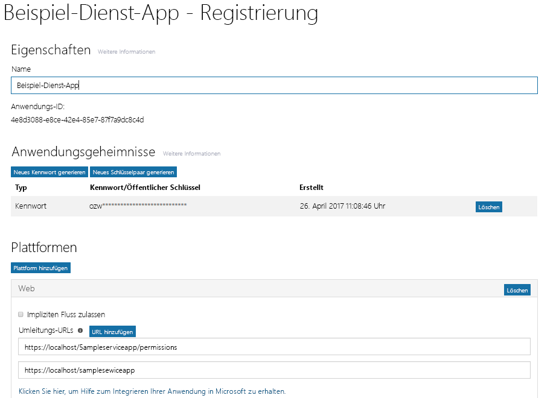
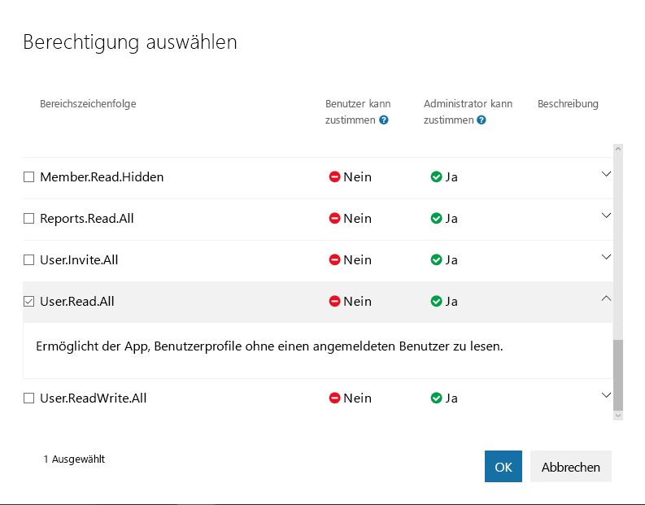
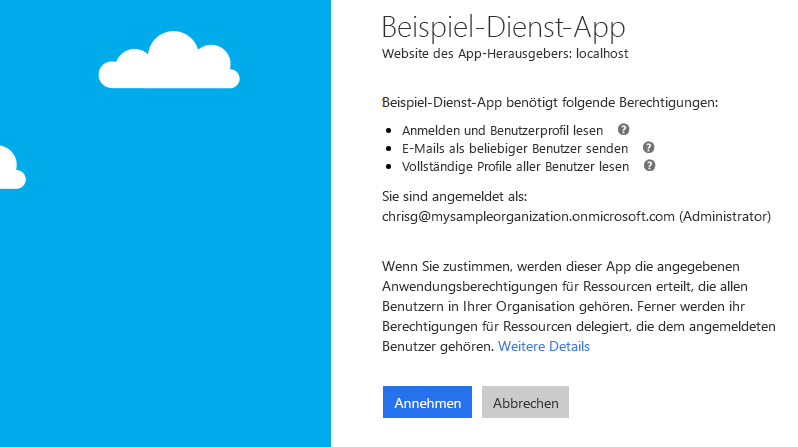

# <a name="get-access-without-a-user"></a>Ohne Benutzer zugreifen
Einige Apps werden auf einem Server ausgeführt, ohne dass ein Benutzer angemeldet ist. Diese App-Typen werden häufig als Hintergrunddienste oder Daemons bezeichnet. Ein Beispiel für eine solche App ist ein E-Mail-Archivierungsdienst, der nachts reaktiviert und ausgeführt wird. Hintergrunddienste verwenden in der Regel den Fluss zur Gewährung von OAuth 2.0-Clientanmeldeinformationen, um Zugriffstoken von Azure AD abzurufen. In diesem Thema werden Sie schrittweise durch das grundlegende Verfahren zum Konfigurieren eines Hintergrunddiensts und zum Verwenden des Flusses zur Gewährung von OAuth 2.0-Clientanmeldeinformationen geführt, um ein Zugriffstoken zum Aufrufen von Microsoft Graph von Azure AD abzurufen. 

## <a name="authentication-and-authorization-steps"></a>Authentifizierungs- und Autorisierungsschritte
Die grundlegenden Schritte zum Authentifizieren eines Hintergrunddiensts und Abrufen eines Tokens vom Azure AD v2.0-Endpunkt für den Aufruf von Microsoft Graph sind folgende:

1. Registrieren der App
2. Konfigurieren von Berechtigungen für Microsoft Graph
3. Einholen der Administratorzustimmung
4. Abrufen eines Zugriffstokens
5. Aufrufen von Microsoft Graph unter Verwendung des Zugriffstokens

## <a name="1-register-your-app"></a>1. Registrieren der App
Für die Authentifizierung beim Azure AD v2.0-Endpunkt müssen Sie Ihre App zunächst im [Microsoft App-Registrierungsportal](https://apps.dev.microsoft.com/) registrieren. Sie können entweder ein Microsoft-Konto oder ein Geschäfts-, Schul- oder Unikonto zum Registrieren Ihrer App verwenden. 

Der folgende Screenshot zeigt die Registrierung einer Web-App, die für einen Hintergrunddienst konfiguriert wurde. 

Für einen Hintergrunddienst müssen Sie Ihre App für die Webplattform registrieren und die folgenden Werte kopieren:

- Die Anwendung-ID, die vom App-Registrierungsportal zugewiesen wurde.
- Ein Anwendungsgeheimnis, entweder ein Kennwort oder ein öffentliches/privates Schlüsselpaar (Zertifikat).
- Eine Umleitungs-URL, damit der Dienst Tokenantworten von Azure AD empfangen kann.
- Eine Umleitungs-URL, damit der Dienst Antworten mit Administratorzustimmung empfangen kann, wenn Ihre App Funktionen zum Anfordern der Administratorzustimmung implementiert.  

Schritte zum Konfigurieren einer App mit dem Microsoft-App-Registrierungsportal finden Sie unter [Apps registrieren](./auth_register_app_v2.md).

Mit dem Fluss zur Gewährung von OAuth 2.0-Clientanmeldeinformationen authentifiziert sich Ihre App direkt beim Azure AD v2.0 `/token`-Endpunkt, und zwar unter Verwendung der von Azure AD zugewiesenen Anwendungs-ID und des mit dem Portal erstellten Anwendungsgeheimnisses. 

## <a name="2-configure-permissions-for-microsoft-graph"></a>2. Konfigurieren von Berechtigungen für Microsoft Graph
Für Apps, die ohne Benutzer ausgeführt werden, stellt Microsoft Graph Anwendungsberechtigungen zur Verfügung. Sie konfigurieren diese Berechtigungen vorab, wenn Sie Ihre App registrieren. Anwendungsberechtigungen erfordern immer die Zustimmung eines Administrators. Ein Administrator kann diesen Berechtigungen entweder im [Azure-Portal](https://portal.azure.com) zustimmen, wenn die App in seiner Organisation installiert wird, oder Sie können eine Anmeldefunktionalität in der App bereitstellen, über die Administratoren den von Ihnen konfigurierten Berechtigungen zustimmen können. Sobald die Administratorzustimmung von Azure AD aufgezeichnet wurde, kann Ihre App Token anfordern, ohne dass eine erneute Zustimmung erforderlich ist. Ausführliche Informationen zu den in Microsoft Graph verfügbaren Berechtigungen finden Sie in der [Berechtigungsreferenz](./permissions_reference.md).

Um Anwendungsberechtigungen für Ihre App im [Microsoft-App-Registrierungsportal](https://apps.dev.microsoft.com/) zu konfigurieren, wählen Sie unter **Microsoft Graph**, die Option **Hinzufügen** neben **Anwendungsberechtigungen**, und wählen Sie dann die von Ihrer App benötigten Berechtigungen im Dialogfeld **Berechtigungen auswählen** aus.

Der folgende Screenshot zeigt das Dialogfeld **Berechtigungen auswählen** für Microsoft Graph-Anwendungsberechtigungen. 



> **Wichtig**: Es wird empfohlen, den Satz geringster Rechte zu konfigurieren, der von Ihrer App benötigt wird. Dies ist wesentlich benutzerfreundlicher als das Szenario, in dem Administratoren einer langen Liste von Berechtigungen zustimmen müssen.
>

## <a name="3-get-administrator-consent"></a>3. Einholen der Administratorzustimmung
Sie können einen Administrator die von Ihrer App benötigten Berechtigungen im [Azure-Portal](https://portal.azure.com) gewähren lassen, häufig ist es jedoch besser, Administratoren eine Anmeldefunktionalität über den Azure AD v2.0 `/adminconsent`-Endpunkt zur Verfügung zu stellen. 

### <a name="request"></a>Anforderung
```
// Line breaks are for legibility only.

GET https://login.microsoftonline.com/{tenant}/adminconsent?
client_id=6731de76-14a6-49ae-97bc-6eba6914391e
&state=12345
&redirect_uri=http://localhost/myapp/permissions
```

| Parameter | Bedingung | Beschreibung |
| --- | --- | --- |
| tenant |Erforderlich |Der Verzeichnismandant, von dem Sie eine Berechtigung anfordern möchten. Dieser kann im GUID- oder Anzeigenamenformat angegeben werden. Wenn Sie nicht wissen, zu welchem Mandanten der Benutzer gehört, und Sie eine Anmeldung mit jedem Mandanten ermöglichen möchten, verwenden Sie `common`. |
| client_id |Erforderlich |Die Anwendungs-ID, die Ihrer App vom [App-Registrierungsportal](https://apps.dev.microsoft.com/) zugewiesen wurde. |
| redirect_uri |Erforderlich |Der Umleitungs-URI, an den die Antwort für die Weiterarbeitung durch Ihre App gesendet werden soll. Er muss genau mit einem der Umleitung-URIs übereinstimmen, die Sie im Portal registriert haben, mit der Ausnahme, dass er URL-codiert sein muss und zusätzliche Pfadsegmente enthalten kann. |
| state |Empfohlen |Ein Wert, der in der Anforderung enthalten ist und ebenfalls in der Tokenantwort zurückgegeben wird. Es kann eine Zeichenfolge beliebigen Inhalts sein. Der Status wird verwendet, um Informationen über den Status des Benutzers in der App vor dem Versand der Authentifizierungsanforderung zu codieren, z. B. die Seite oder die Ansicht, auf bzw. in der sich der Benutzer befunden hat. |

### <a name="consent-experience"></a>Zustimmungsfunktionalität
Azure AD erzwingt, dass sich nur ein Mandantenadministrator anmelden kann, um die Anforderung auszuführen. Der Administrator wird aufgefordert, alle direkten Anwendungsberechtigungen zu genehmigen, die Sie für Ihre App im App-Registrierungsportal angefordert haben. Nachfolgend finden Sie ein Beispiel für das Zustimmungsdialogfeld, das dem Administrator von Azure AD angezeigt wird:



### <a name="response"></a>Antwort
Wenn der Administrator die Berechtigungen für Ihre Anwendung genehmigt, sieht die erfolgreiche Antwort wie folgt aus:

```
GET http://localhost/myapp/permissions?tenant=a8990e1f-ff32-408a-9f8e-78d3b9139b95&state=state=12345&admin_consent=True
```

| Parameter | Beschreibung |
| --- | --- |
| tenant |Der Verzeichnismandant, der Ihrer Anwendung die angeforderten Berechtigungen gewährt hat, im GUID-Format. |
| state |Ein Wert, der in der Anforderung enthalten ist und ebenfalls in der Tokenantwort zurückgegeben wird. Es kann eine Zeichenfolge beliebigen Inhalts sein. Der Status wird verwendet, um Informationen über den Status des Benutzers in der App vor dem Versand der Authentifizierungsanforderung zu codieren, z. B. die Seite oder die Ansicht, auf bzw. in der sich der Benutzer befunden hat. |
| admin_consent |Auf **true** festgelegt. |


> **Versuchen Sie es** Sie können dies selbst ausprobieren, indem Sie die Anforderung unten in einen Browser einfügen. Wenn Sie sich als globaler Administrator für einen Azure AD-Mandanten anmelden, wird Ihnen das Dialogfeld zur Administratorzustimmung für die App angezeigt. (Dies ist eine andere App als die oben im Screenshot des Dialogfelds zur Administratorzustimmung abgebildete.)
> 

```
https://login.microsoftonline.com/common/adminconsent?client_id=6731de76-14a6-49ae-97bc-6eba6914391e&state=12345&redirect_uri=http://localhost/myapp/permissions
```

## <a name="4-get-an-access-token"></a>4. Abrufen eines Zugriffstokens
Im Fluss zur Gewährung von OAuth 2.0-Clientanmeldeinformationen verwenden Sie die Werte für Anwendungs-ID und Anwendungsgeheimnis, die Sie beim Registrieren der App gespeichert haben, um ein Zugriffstoken direkt vom Azure AD v2.0 `/token`-Endpunkt anzufordern.

Sie geben die vorkonfigurierten Berechtigungen an, indem Sie `https://graph.microsoft.com/.default` als Wert für den `scope`-Parameter in der Tokenanforderung übergeben. Einzelheiten finden Sie in der Beschreibung zum `scope`-Parameter in der nachstehenden Tokenanforderung.

### <a name="token-request"></a>Tokenanforderung
Sie senden eine POST-Anforderung an den v2.0 `/token`-Endpunkt, um ein Zugriffstoken abzurufen:

```
POST /{tenant}/oauth2/v2.0/token HTTP/1.1
Host: login.microsoftonline.com
Content-Type: application/x-www-form-urlencoded

client_id=535fb089-9ff3-47b6-9bfb-4f1264799865&scope=https%3A%2F%2Fgraph.microsoft.com%2F.default&client_secret=qWgdYAmab0YSkuL1qKv5bPX&grant_type=client_credentials
```

| Parameter | Bedingung | Beschreibung |
| --- | --- | --- |
| tenant |Erforderlich |Der Verzeichnismandant, von dem Sie eine Berechtigung anfordern möchten. Dieser kann im GUID- oder Anzeigenamenformat angegeben werden. |
| client_id |Erforderlich |Die Anwendungs-ID, die beim Registrieren der App vom [Microsoft-App-Registrierungsportal](https://apps.dev.microsoft.com) zugewiesen wurde. |
| scope |Erforderlich |Der Wert, der für den `scope`-Parameter in dieser Anforderung übergeben wird, sollte der Ressourcenbezeichner (Anwendungs-ID-URI) der gewünschten Ressource mit dem angehängten Suffix `.default` sein. Für Microsoft Graph lautet der Wert `https://graph.microsoft.com/.default`. Mit diesem Wert wird der v2.0-Endpunkt darüber informiert, dass er unter allen der direkten Anwendungsberechtigungen, die Sie für Ihre App konfiguriert haben, ein Token für die Berechtigungen ausstellen soll, die der gewünschten Ressource zugeordnet sind. |
| client_secret |Erforderlich |Das Anwendungsgeheimnis, das Sie im App-Registrierungsportal für Ihre App generiert haben. |
| grant_type |Erforderlich |Muss `client_credentials` sein. |

#### <a name="token-response"></a>Tokenantwort
Eine erfolgreiche Antwort sieht wie folgt aus:

```
{
  "token_type": "Bearer",
  "expires_in": 3599,
  "access_token": "eyJ0eXAiOiJKV1QiLCJhbGciOiJSUzI1NiIsIng1dCI6Ik1uQ19WWmNBVGZNNXBP..."
}
```

| Parameter | Beschreibung |
| --- | --- |
| access_token |Das angeforderte Zugriffstoken. Dieses Token kann die App in Aufrufen verwenden, die an Microsoft Graph gesendet werden. |
| token_type |Gibt den Tokentypwert an. Der einzige von Azure AD unterstützte Typ ist `bearer`. |
| expires_in |Gültigkeit des Zugriffstokens (in Sekunden). |

## <a name="5-use-the-access-token-to-call-microsoft-graph"></a>5. Aufrufen von Microsoft Graph unter Verwendung des Zugriffstokens

Sobald Sie über ein Zugriffstoken verfügen, können Sie damit Microsoft Graph aufrufen, indem Sie das Token in den `Authorization`-Header einer Anforderung einschließen. Die folgende Anforderung ruft das Profil eines bestimmten Benutzers ab. Ihre App muss über die Berechtigung _User.Read.All_ verfügen, um diese API aufzurufen.

```
GET https://graph.microsoft.com/v1.0/user/12345678-73a6-4952-a53a-e9916737ff7f 
Authorization: Bearer eyJ0eXAiO ... 0X2tnSQLEANnSPHY0gKcgw
Host: graph.microsoft.com

```
Eine erfolgreiche Antwort sieht ähnlich wie die folgende aus (einige Antwortheader wurden entfernt):

```
HTTP/1.1 200 OK
Content-Type: application/json;odata.metadata=minimal;odata.streaming=true;IEEE754Compatible=false;charset=utf-8
request-id: f45d08c0-6901-473a-90f5-7867287de97f
client-request-id: f45d08c0-6901-473a-90f5-7867287de97f
OData-Version: 4.0
Duration: 309.0273
Date: Wed, 26 Apr 2017 19:53:49 GMT
Content-Length: 407

{
    "@odata.context":"https://graph.microsoft.com/v1.0/$metadata#users/$entity",
    "id":"12345678-73a6-4952-a53a-e9916737ff7f",
    "businessPhones":[
        "+1 555555555"
    ],
    "displayName":"Chris Green",
    "givenName":"Chris",
    "jobTitle":"Software Engineer",
    "mail":null,
    "mobilePhone":"+1 5555555555",
    "officeLocation":"Seattle Office",
    "preferredLanguage":null,
    "surname":"Green",
    "userPrincipalName":"ChrisG@contoso.onmicrosoft.com"
}
```

## <a name="supported-app-scenarios-and-resources"></a>Unterstützte App-Szenarios und Ressourcen
Hintergrunddienste werden auf einem Server ausgeführt, ohne dass ein Benutzer angemeldet ist, und verwenden den Fluss zur Gewährung von OAuth 2.0-Clientanmeldeinformationen, um sich bei Azure AD zu authentifizieren und ein Token abzurufen. Für den v2.0-Endpunkt können Sie dieses Szenario mit den folgenden Ressourcen weiter untersuchen:

- Eine ausführlichere Beschreibung des Flusses zur Gewährung von Clientanmeldeinformationen, die auch Fehlerantworten enthält, finden Sie unter [Azure Active Directory v2.0 und der OAuth 2.0-Clientanmeldeinformations-Flow](https://docs.microsoft.com/azure/active-directory/develop/active-directory-v2-protocols-oauth-client-creds). 
- Ein Beispiel, das Microsoft Graph von einem Dienst aus aufruft, finden Sie im [v2.0-Daemonbeispiel](https://github.com/Azure-Samples/active-directory-dotnet-daemon-v2) auf GitHub.
- Weitere Informationen zu empfohlenen Authentifizierungsbibliotheken von Microsoft und Drittanbietern für Azure AD v2.0 finden Sie unter [Azure Active Directory v2.0-Authentifizierungsbibliotheken](https://docs.microsoft.com/azure/active-directory/develop/active-directory-v2-libraries).

## <a name="azure-ad-endpoint-considerations"></a>Überlegungen zum Azure AD-Endpunkt
Wenn Sie den Azure AD-Endpunkt verwenden, gibt es einige Unterschiede in der Weise, wie Sie Ihre App konfigurieren und wie diese sich bei Azure AD anmeldet:

- Sie verwenden das [Azure-Portal](https://portal.azure.com) zum Konfigurieren Ihrer App. Weitere Informationen zum Konfigurieren von Apps mit dem Azure-Portal finden Sie unter [Integrieren von Anwendungen in Azure Active Directory: Hinzufügen einer Anwendung](https://docs.microsoft.com/azure/active-directory/develop/active-directory-integrating-applications#adding-an-application).
- Wenn Ihre App mehrinstanzenfähig ist, müssen Sie sie im [Azure-Portal](https://portal.azure.com) explizit als mehrinstanzenfähig konfigurieren.
- Es gibt keinen Endpunkt für die Administratorzustimmung (`/adminconsent`), stattdessen kann Ihre App die Administratorzustimmung während der Laufzeit anfordern, indem Sie den Parameter `prompt=admin_consent` zu einer Autorisierungsanforderung hinzufügen. Weitere Informationen finden Sie unter **Auslösen von Azure AD-Consent Framework zur Laufzeit** im Artikel [Integrieren von Anwendungen in Azure Active Directory](https://docs.microsoft.com/azure/active-directory/develop/active-directory-integrating-applications).
- Die Parameter in Autorisierungs- und Tokenanforderungen sind verschieden. Es gibt z. B. keinen `scope`-Parameter in Azure AD-Endpunktanforderungen; stattdessen wird der `resource`-Parameter verwendet, um den URI der Ressource anzugeben (`resource=https://graph.microsoft.com`), für die Autorisierung (für Administratorzustimmung) oder ein Token angefordert wird.

Für den Azure AD-Endpunkt können Sie dieses Szenario mit den folgenden Ressourcen weiter untersuchen:

- Direktlinks zu einer Übersicht, Beispielen und einer detaillierten Beschreibung des Flusses zur Gewährung von Clientanmeldeinformationen finden Sie unter **Dienst-zu-Dienst** im Abschnitt **Erste Schritte** des Leitfadens [Azure Active Directory für Entwickler](https://docs.microsoft.com/azure/active-directory/develop/active-directory-developers-guide).
- Für den Azure AD-Endpunkt können Sie die Active Directory Authentication Library (ADAL) zum Abrufen von Token aus Azure AD verwenden. ADAL ist für mehrere Plattformen verfügbar, darunter .NET, iOS, Android, JavaScript, Java und Node.js. Weitere Informationen zu ADAL und anderen Microsoft-Authentifizierungsbibliotheken für den Azure AD-Endpunkt finden Sie unter [Azure Active Directory-Authentifizierungsbibliotheken](https://docs.microsoft.com/azure/active-directory/develop/active-directory-authentication-libraries). 

 