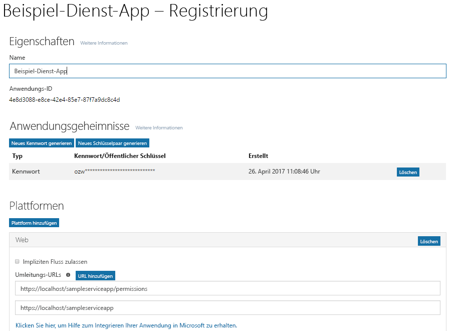
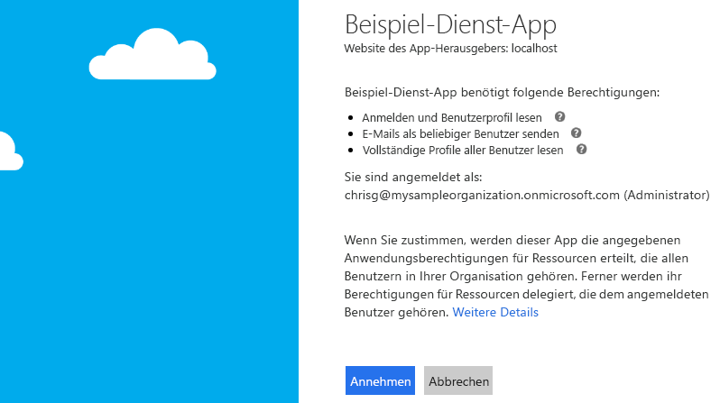

# <a name="get-access-without-a-user"></a><span data-ttu-id="e33e7-101">Ohne Benutzer zugreifen</span><span class="sxs-lookup"><span data-stu-id="e33e7-101">Get access without a user</span></span>

<span data-ttu-id="e33e7-p101">Einige Apps rufen Microsoft Graph mit ihrer eigenen Identität und nicht im Namen eines Benutzers auf. In vielen Fällen handelt es sich dabei um Hintergrunddienste oder Daemons, die auf einem Server ausgeführt werden, ohne dass ein Benutzer angemeldet ist. Ein Beispiel für eine solche App ist ein E-Mail-Archivierungsdienst, der nachts reaktiviert und ausgeführt wird. In einigen Fällen rufen Apps, bei deren Ausführung ein Benutzer angemeldet ist, Microsoft Graph auch unter ihrer eigenen Identität auf. Beispiel: Eine App muss Funktionen verwenden, die höhere Rechte in einer Organisation erfordern als diejenigen, die dem angemeldeten Benutzer zugewiesen sind.</span><span class="sxs-lookup"><span data-stu-id="e33e7-p101">Some apps call Microsoft Graph with their own identity and not on behalf of a user. In many cases, these are background services or daemons that run on a server without the presence of a signed-in user. An example of such an app might be an email archival service that wakes up and runs overnight. In some cases, apps that have a signed-in user present may also need to call Microsoft Graph under their own identity. For example, an app may need to use functionality that requires more elevated privileges in an organization than those carried by the signed-in user.</span></span>  

<span data-ttu-id="e33e7-p102">Apps, die Microsoft Graph mit ihrer eigenen Identität aufrufen, verwenden den Fluss zur Gewährung von OAuth 2.0-Clientanmeldeinformationen, um Zugriffstoken von Azure AD abzurufen. In diesem Thema werden Sie schrittweise durch das grundlegende Verfahren zum Konfigurieren eines Diensts und zum Verwenden des Flusses zur Gewährung von OAuth 2.0-Clientanmeldeinformationen geführt, um ein Zugriffstoken abzurufen.</span><span class="sxs-lookup"><span data-stu-id="e33e7-p102">Apps that call Microsoft Graph with their own identity use the OAuth 2.0 client credentials grant flow to get access tokens from Azure AD. In this topic, we will walk through the basic steps to configure a service and use the OAuth client credentials grant flow to get an access token.</span></span> 

## <a name="authentication-and-authorization-steps"></a><span data-ttu-id="e33e7-109">Authentifizierungs- und Autorisierungsschritte</span><span class="sxs-lookup"><span data-stu-id="e33e7-109">Authentication and authorization steps</span></span>

<span data-ttu-id="e33e7-110">Die grundlegenden Schritte zum Konfigurieren eines Diensts und zum Abrufen eines Tokens vom Azure AD v2.0-Endpunkt, mit dem Ihr Dienst Microsoft Graph unter seiner eigenen Identität aufrufen kann, sind folgende:</span><span class="sxs-lookup"><span data-stu-id="e33e7-110">The basic steps required to configure a service and get a token from the Azure AD v2.0 endpoint that your service can use to call Microsoft Graph under its own identity are:</span></span>

1. <span data-ttu-id="e33e7-111">Registrieren der App</span><span class="sxs-lookup"><span data-stu-id="e33e7-111">Register your app.</span></span>
2. <span data-ttu-id="e33e7-112">Konfigurieren von Berechtigungen für Microsoft Graph in der App</span><span class="sxs-lookup"><span data-stu-id="e33e7-112">Configure permissions for Microsoft Graph on your app.</span></span>
3. <span data-ttu-id="e33e7-113">Einholen der Administratorzustimmung</span><span class="sxs-lookup"><span data-stu-id="e33e7-113">Get administrator consent.</span></span>
4. <span data-ttu-id="e33e7-114">Abrufen eines Zugriffstokens</span><span class="sxs-lookup"><span data-stu-id="e33e7-114">Get an access token.</span></span>
5. <span data-ttu-id="e33e7-115">Aufrufen von Microsoft Graph unter Verwendung des Zugriffstokens</span><span class="sxs-lookup"><span data-stu-id="e33e7-115">Use the access token to call Microsoft Graph.</span></span>

## <a name="1-register-your-app"></a><span data-ttu-id="e33e7-116">1. Registrieren der App</span><span class="sxs-lookup"><span data-stu-id="e33e7-116">1. Register your app</span></span>

<span data-ttu-id="e33e7-p103">Für die Authentifizierung beim Azure AD v2.0-Endpunkt müssen Sie Ihre App zunächst im [Microsoft App-Registrierungsportal](https://apps.dev.microsoft.com/) registrieren. Sie können entweder ein Microsoft-Konto oder ein Geschäfts-, Schul- oder Unikonto zum Registrieren Ihrer App verwenden.</span><span class="sxs-lookup"><span data-stu-id="e33e7-p103">To authenticate with the Azure v2.0 endpoint, you must first register your app at the [Microsoft App Registration Portal](https://apps.dev.microsoft.com/). You can use either a Microsoft account or a work or school account to register your app.</span></span> 

<span data-ttu-id="e33e7-p104">Der folgende Screenshot zeigt die Registrierung einer Web-App, die für einen Hintergrunddienst konfiguriert wurde. </span><span class="sxs-lookup"><span data-stu-id="e33e7-p104">The following screenshot shows a web app registration that has been configured for a background service. </span></span>

<span data-ttu-id="e33e7-121">Für einen Dienst, der Microsoft Graph unter seiner eigenen Identität aufrufen soll, müssen Sie Ihre App für die Webplattform registrieren und die folgenden Werte kopieren:</span><span class="sxs-lookup"><span data-stu-id="e33e7-121">For a service that will call Microsoft Graph under its own identity, you need to register your app for the Web platform and copy the following values:</span></span>

- <span data-ttu-id="e33e7-122">Die Anwendung-ID, die vom App-Registrierungsportal zugewiesen wurde.</span><span class="sxs-lookup"><span data-stu-id="e33e7-122">The Application ID assigned by the app registration portal.</span></span>
- <span data-ttu-id="e33e7-123">Ein Anwendungsgeheimnis, entweder ein Kennwort oder ein öffentliches/privates Schlüsselpaar (Zertifikat).</span><span class="sxs-lookup"><span data-stu-id="e33e7-123">An Application Secret, either a password or a public/private key pair (certificate).</span></span>
- <span data-ttu-id="e33e7-124">Eine Umleitungs-URL, damit der Dienst Tokenantworten von Azure AD empfangen kann.</span><span class="sxs-lookup"><span data-stu-id="e33e7-124">A Redirect URL for your service to receive token responses from Azure AD.</span></span>
- <span data-ttu-id="e33e7-125">Eine Umleitungs-URL, damit der Dienst Antworten mit Administratorzustimmung empfangen kann, wenn Ihre App Funktionen zum Anfordern der Administratorzustimmung implementiert.</span><span class="sxs-lookup"><span data-stu-id="e33e7-125">A Redirect URL for your service to receive admin consent responses if your app implements functionality to request administrator consent.</span></span>  

<span data-ttu-id="e33e7-126">Schritte zum Konfigurieren einer App mit dem Microsoft-App-Registrierungsportal finden Sie unter [Apps registrieren](./auth_register_app_v2.md).</span><span class="sxs-lookup"><span data-stu-id="e33e7-126">For steps on how to configure an app using the Microsoft App Registration Portal, see [Register your app](./auth_register_app_v2.md).</span></span>

<span data-ttu-id="e33e7-127">Mit dem Fluss zur Gewährung von OAuth 2.0-Clientanmeldeinformationen authentifiziert sich Ihre App direkt beim Azure AD v2.0 `/token`-Endpunkt, und zwar unter Verwendung der von Azure AD zugewiesenen Anwendungs-ID und des mit dem Portal erstellten Anwendungsgeheimnisses.</span><span class="sxs-lookup"><span data-stu-id="e33e7-127">With the OAuth 2.0 client credentials grant flow, your app authenticates directly at the Azure AD v2.0 `/token` endpoint using the Application ID assigned by Azure AD and the Application Secret that you create using the portal.</span></span> 

## <a name="2-configure-permissions-for-microsoft-graph"></a><span data-ttu-id="e33e7-128">2. Konfigurieren von Berechtigungen für Microsoft Graph</span><span class="sxs-lookup"><span data-stu-id="e33e7-128">2. Configure permissions for Microsoft Graph</span></span>

<span data-ttu-id="e33e7-p105">Für Apps, die Microsoft Graph unter ihrer eigenen Identität aufrufen, stellt Microsoft Graph Anwendungsberechtigungen zur Verfügung. (Microsoft Graph macht auch delegierte Berechtigungen für Apps verfügbar, die Microsoft Graph im Namen eines Benutzers aufrufen.) Die Anwendungsberechtigungen, die Ihre App benötigt, werden beim Registrieren der App vorkonfiguriert. Anwendungsberechtigungen erfordern immer die Zustimmung eines Administrators. Ein Administrator kann diesen Berechtigungen entweder im [Azure-Portal](https://portal.azure.com) zustimmen, wenn die App in seiner Organisation installiert wird, oder Sie können eine Anmeldefunktionalität in der App bereitstellen, über die Administratoren den von Ihnen konfigurierten Berechtigungen zustimmen können. Sobald die Administratorzustimmung von Azure AD aufgezeichnet wurde, kann Ihre App Token anfordern, ohne dass eine erneute Zustimmung erforderlich ist. Ausführliche Informationen zu den in Microsoft Graph verfügbaren Berechtigungen finden Sie in der [Berechtigungsreferenz](./permissions_reference.md).</span><span class="sxs-lookup"><span data-stu-id="e33e7-p105">For apps that call Microsoft Graph under their own identity, Microsoft Graph exposes application permissions. (Microsoft Graph also exposes delegated permissions for apps that call Microsoft Graph on behalf of a user.) You pre-configure the application permissions your app needs when you register your app. Application permissions always require administrator consent. An administrator can either consent to these permissions using the [Azure portal](https://portal.azure.com) when your app is installed in their organization, or you can provide a sign-up experience in your app through which administrators can consent to the permissions you configured. Once administrator consent is recorded by Azure AD, your app can request tokens without having to request consent again. For more detailed information about the permissions available with Microsoft Graph, see the [Permissions reference](./permissions_reference.md)</span></span>

<span data-ttu-id="e33e7-135">Um Anwendungsberechtigungen für Ihre App im [Microsoft-App-Registrierungsportal](https://apps.dev.microsoft.com/) zu konfigurieren, wählen Sie unter **Microsoft Graph**, die Option **Hinzufügen** neben **Anwendungsberechtigungen**, und wählen Sie dann die von Ihrer App benötigten Berechtigungen im Dialogfeld **Berechtigungen auswählen** aus.</span><span class="sxs-lookup"><span data-stu-id="e33e7-135">To configure application permissions for your app in the [Microsoft App Registration Portal](https://apps.dev.microsoft.com/): under **Microsoft Graph**, choose **Add** next to **Application Permissions** and then select the permissions your app requires in the **Select Permissions** dialog.</span></span>

<span data-ttu-id="e33e7-136">Der folgende Screenshot zeigt das Dialogfeld **Berechtigungen auswählen** für Microsoft Graph-Anwendungsberechtigungen.</span><span class="sxs-lookup"><span data-stu-id="e33e7-136">The following screenshot shows the **Select Permissions** dialog for Microsoft Graph application permissions.</span></span> 


> <span data-ttu-id="e33e7-p106">**Hinweis**: Es wird empfohlen, den Satz geringster Rechte zu konfigurieren, der von Ihrer App benötigt wird. Dies ist wesentlich benutzerfreundlicher als das Szenario, in dem Administratoren einer langen Liste von Berechtigungen zustimmen müssen.</span><span class="sxs-lookup"><span data-stu-id="e33e7-p106">**Important**: We recommend configuring the least privileged set of permissions required by your app. This provides a much more comfortable experience for administrators than having to consent to a long list of permissions.</span></span>

## <a name="3-get-administrator-consent"></a><span data-ttu-id="e33e7-140">3. Einholen der Administratorzustimmung</span><span class="sxs-lookup"><span data-stu-id="e33e7-140">3. Get administrator consent</span></span>

<span data-ttu-id="e33e7-141">Sie können einen Administrator die von Ihrer App benötigten Berechtigungen im [Azure-Portal](https://portal.azure.com) gewähren lassen, häufig ist es jedoch besser, Administratoren eine Anmeldefunktionalität über den Azure AD v2.0 `/adminconsent`-Endpunkt zur Verfügung zu stellen.</span><span class="sxs-lookup"><span data-stu-id="e33e7-141">You can rely on an administrator to grant the permissions your app needs at the [Azure portal](https://portal.azure.com); however, often, a better option is to provide a sign-up experience for administrators by using the Azure AD v2.0 `/adminconsent` endpoint.</span></span> 

> <span data-ttu-id="e33e7-142">**Wichtig**: Jedes Mal, wenn Sie Änderungen an den konfigurierten Berechtigungen vornehmen, müssen Sie auch den Prozess für die Administratorzustimmung wiederholen.</span><span class="sxs-lookup"><span data-stu-id="e33e7-142">**Important**: Any time you make a change to the configured permissions, you must also repeat the Admin Consent process.</span></span> <span data-ttu-id="e33e7-143">Im App-Registrierungsportal vorgenommene Änderungen werden nicht wiedergegeben, bis die Zustimmung des Mandantenadministrators erneut erteilt wurde.</span><span class="sxs-lookup"><span data-stu-id="e33e7-143">Changes made in the app registration portal will not be reflected until consent has been reapplied by the tenant's administrator.</span></span>

### <a name="request"></a><span data-ttu-id="e33e7-144">Anforderung</span><span class="sxs-lookup"><span data-stu-id="e33e7-144">Request</span></span>

```
// Line breaks are for legibility only.

GET https://login.microsoftonline.com/{tenant}/adminconsent
?client_id=6731de76-14a6-49ae-97bc-6eba6914391e
&state=12345
&redirect_uri=http://localhost/myapp/permissions
```

| <span data-ttu-id="e33e7-145">Parameter</span><span class="sxs-lookup"><span data-stu-id="e33e7-145">Parameter</span></span>     | <span data-ttu-id="e33e7-146">Bedingung</span><span class="sxs-lookup"><span data-stu-id="e33e7-146">Condition</span></span>   | <span data-ttu-id="e33e7-147">Beschreibung</span><span class="sxs-lookup"><span data-stu-id="e33e7-147">Description</span></span> 
|:--------------|:------------|:------------
| <span data-ttu-id="e33e7-148">tenant</span><span class="sxs-lookup"><span data-stu-id="e33e7-148">tenant</span></span>        | <span data-ttu-id="e33e7-149">Erforderlich</span><span class="sxs-lookup"><span data-stu-id="e33e7-149">Required</span></span>    | <span data-ttu-id="e33e7-p108">Der Verzeichnismandant, von dem Sie eine Berechtigung anfordern möchten. Dieser kann im GUID- oder Anzeigenamenformat angegeben werden. Wenn Sie nicht wissen, zu welchem Mandanten der Benutzer gehört, und Sie eine Anmeldung mit jedem Mandanten ermöglichen möchten, verwenden Sie `common`.</span><span class="sxs-lookup"><span data-stu-id="e33e7-p108">The directory tenant that you want to request permission from. This can be in GUID or friendly name format. If you don't know which tenant the user belongs to and you want to let them sign in with any tenant, use `common`.</span></span> 
| <span data-ttu-id="e33e7-153">client_id</span><span class="sxs-lookup"><span data-stu-id="e33e7-153">client_id</span></span>     | <span data-ttu-id="e33e7-154">Erforderlich</span><span class="sxs-lookup"><span data-stu-id="e33e7-154">Required</span></span>    | <span data-ttu-id="e33e7-155">Die Anwendungs-ID, die Ihrer App vom [App-Registrierungsportal](https://apps.dev.microsoft.com/) zugewiesen wurde.</span><span class="sxs-lookup"><span data-stu-id="e33e7-155">The Application ID that the [Application Registration Portal](https://apps.dev.microsoft.com/) assigned to your app.</span></span> 
| <span data-ttu-id="e33e7-156">redirect_uri</span><span class="sxs-lookup"><span data-stu-id="e33e7-156">redirect_uri</span></span>  | <span data-ttu-id="e33e7-157">Erforderlich</span><span class="sxs-lookup"><span data-stu-id="e33e7-157">Required</span></span>    | <span data-ttu-id="e33e7-p109">Der Umleitungs-URI, an den die Antwort für die Weiterarbeitung durch Ihre App gesendet werden soll. Er muss genau mit einem der Umleitung-URIs übereinstimmen, die Sie im Portal registriert haben, mit der Ausnahme, dass er URL-codiert sein muss und zusätzliche Pfadsegmente enthalten kann.</span><span class="sxs-lookup"><span data-stu-id="e33e7-p109">The redirect URI where you want the response to be sent for your app to handle. It must exactly match one of the redirect URIs that you registered in the portal, except that it must be URL encoded, and it can have additional path segments.</span></span> 
| <span data-ttu-id="e33e7-160">state</span><span class="sxs-lookup"><span data-stu-id="e33e7-160">state</span></span>         | <span data-ttu-id="e33e7-161">Empfohlen</span><span class="sxs-lookup"><span data-stu-id="e33e7-161">Recommended</span></span> | <span data-ttu-id="e33e7-p110">Ein Wert, der in der Anforderung enthalten ist und ebenfalls in der Tokenantwort zurückgegeben wird. Es kann eine Zeichenfolge beliebigen Inhalts sein. Der Status wird verwendet, um Informationen über den Status des Benutzers in der App vor dem Versand der Authentifizierungsanforderung zu codieren, z. B. die Seite oder die Ansicht, auf bzw. in der sich der Benutzer befunden hat.</span><span class="sxs-lookup"><span data-stu-id="e33e7-p110">A value that is included in the request that also is returned in the token response. It can be a string of any content that you want. The state is used to encode information about the user's state in the app before the authentication request occurred, such as the page or view they were on.</span></span> 

### <a name="administrator-consent-experience"></a><span data-ttu-id="e33e7-165">Oberfläche zur Administratorzustimmung</span><span class="sxs-lookup"><span data-stu-id="e33e7-165">Administrator consent experience</span></span>

<span data-ttu-id="e33e7-p111">Bei an den `/adminconsent`-Endpunkt gesendeten Anforderungen erzwingt Azure AD, dass sich nur ein Mandantenadministrator anmelden kann, um die Anforderung auszuführen. Der Administrator wird aufgefordert, alle Anwendungsberechtigungen zu genehmigen, die Sie für Ihre App im App-Registrierungsportal angefordert haben.</span><span class="sxs-lookup"><span data-stu-id="e33e7-p111">With requests to the `/adminconsent` endpoint, Azure AD enforces that only a tenant administrator can sign in to complete the request. The administrator will be asked to approve all the application permissions that you have requested for your app in the app registration portal. The following is an example of the consent dialog that Azure AD presents to the administrator:</span></span> 

<span data-ttu-id="e33e7-168">Nachfolgend finden Sie ein Beispiel für das Zustimmungsdialogfeld, das dem Administrator von Azure AD angezeigt wird:</span><span class="sxs-lookup"><span data-stu-id="e33e7-168">The following is an example of the consent dialog that Azure AD presents to the administrator:</span></span>



### <a name="response"></a><span data-ttu-id="e33e7-170">Antwort</span><span class="sxs-lookup"><span data-stu-id="e33e7-170">Response</span></span>

<span data-ttu-id="e33e7-171">Wenn der Administrator die Berechtigungen für Ihre Anwendung genehmigt, sieht die erfolgreiche Antwort wie folgt aus:</span><span class="sxs-lookup"><span data-stu-id="e33e7-171">If the administrator approves the permissions for your application, the successful response looks like this:</span></span>

```
// Line breaks are for legibility only.

GET http://localhost/myapp/permissions
?tenant=a8990e1f-ff32-408a-9f8e-78d3b9139b95&state=state=12345
&admin_consent=True
```

| <span data-ttu-id="e33e7-172">Parameter</span><span class="sxs-lookup"><span data-stu-id="e33e7-172">Parameter</span></span>     | <span data-ttu-id="e33e7-173">Beschreibung</span><span class="sxs-lookup"><span data-stu-id="e33e7-173">Description</span></span> 
|:--------------|:------------
| <span data-ttu-id="e33e7-174">tenant</span><span class="sxs-lookup"><span data-stu-id="e33e7-174">tenant</span></span>        | <span data-ttu-id="e33e7-175">Der Verzeichnismandant, der Ihrer Anwendung die angeforderten Berechtigungen gewährt hat, im GUID-Format.</span><span class="sxs-lookup"><span data-stu-id="e33e7-175">The directory tenant that granted your application the permissions that it requested, in GUID format.</span></span> 
| <span data-ttu-id="e33e7-176">state</span><span class="sxs-lookup"><span data-stu-id="e33e7-176">state</span></span>         | <span data-ttu-id="e33e7-p112">Ein Wert, der in der Anforderung enthalten ist und ebenfalls in der Tokenantwort zurückgegeben wird. Es kann eine Zeichenfolge beliebigen Inhalts sein. Der Status wird verwendet, um Informationen über den Status des Benutzers in der App vor dem Versand der Authentifizierungsanforderung zu codieren, z. B. die Seite oder die Ansicht, auf bzw. in der sich der Benutzer befunden hat.</span><span class="sxs-lookup"><span data-stu-id="e33e7-p112">A value that is included in the request that also is returned in the token response. It can be a string of any content that you want. The state is used to encode information about the user's state in the app before the authentication request occurred, such as the page or view they were on.</span></span> 
| <span data-ttu-id="e33e7-180">admin_consent</span><span class="sxs-lookup"><span data-stu-id="e33e7-180">admin_consent</span></span> | <span data-ttu-id="e33e7-181">Auf **true** festgelegt.</span><span class="sxs-lookup"><span data-stu-id="e33e7-181">Set to **true**.</span></span> 


> <span data-ttu-id="e33e7-p113">**Testen**: Sie können dies selbst ausprobieren, indem Sie die Anforderung unten in einen Browser einfügen. Wenn Sie sich als globaler Administrator für einen Azure AD-Mandanten anmelden, wird Ihnen das Dialogfeld zur Administratorzustimmung für die App angezeigt. (Dies ist eine andere App als die zuvor im Screenshot des Dialogfelds zur Administratorzustimmung abgebildete.)</span><span class="sxs-lookup"><span data-stu-id="e33e7-p113">**Try** You can try this for yourself by pasting the request below in a browser. If you sign in as a Global administrator for an Azure AD tenant, you will be presented with the administrator consent dialog for the app. (This will be a different app than that in the consent dialog screenshot shown above.)</span></span>
> 
> <span data-ttu-id="e33e7-185">https://login.microsoftonline.com/common/adminconsent?client_id=6731de76-14a6-49ae-97bc-6eba6914391e&state=12345&redirect_uri=http://localhost/myapp/permissions</span><span class="sxs-lookup"><span data-stu-id="e33e7-185">https://login.microsoftonline.com/common/adminconsent?client_id=6731de76-14a6-49ae-97bc-6eba6914391e&state=12345&redirect_uri=http://localhost/myapp/permissions</span></span> 

## <a name="4-get-an-access-token"></a><span data-ttu-id="e33e7-186">4. Abrufen eines Zugriffstokens</span><span class="sxs-lookup"><span data-stu-id="e33e7-186">4. Get an access token</span></span>

<span data-ttu-id="e33e7-187">Im Fluss zur Gewährung von OAuth 2.0-Clientanmeldeinformationen verwenden Sie die Werte für Anwendungs-ID und Anwendungsgeheimnis, die Sie beim Registrieren der App gespeichert haben, um ein Zugriffstoken direkt vom Azure AD v2.0 `/token`-Endpunkt anzufordern.</span><span class="sxs-lookup"><span data-stu-id="e33e7-187">In the OAuth 2.0 client credentials grant flow, you use the Application ID and Application Secret values that you saved when you registered your app to request an access token directly from the Azure AD v2.0 `/token` endpoint.</span></span>

<span data-ttu-id="e33e7-p114">Sie geben die vorkonfigurierten Berechtigungen an, indem Sie `https://graph.microsoft.com/.default` als Wert für den `scope`-Parameter in der Tokenanforderung übergeben. Einzelheiten finden Sie in der Beschreibung zum `scope`-Parameter in der nachstehenden Tokenanforderung.</span><span class="sxs-lookup"><span data-stu-id="e33e7-p114">You specify the pre-configured permissions by passing `https://graph.microsoft.com/.default` as the value for the `scope` parameter in the token request. See the `scope` parameter description in the token request below for details.</span></span>

### <a name="token-request"></a><span data-ttu-id="e33e7-190">Tokenanforderung</span><span class="sxs-lookup"><span data-stu-id="e33e7-190">Token request</span></span>

<span data-ttu-id="e33e7-191">Sie senden eine POST-Anforderung an den v2.0 `/token`-Endpunkt, um ein Zugriffstoken abzurufen:</span><span class="sxs-lookup"><span data-stu-id="e33e7-191">You send a POST request to the `/token` v2.0 endpoint to acquire an access token:</span></span>

```
// Line breaks are for legibility only.

POST /{tenant}/oauth2/v2.0/token HTTP/1.1
Host: login.microsoftonline.com
Content-Type: application/x-www-form-urlencoded

client_id=535fb089-9ff3-47b6-9bfb-4f1264799865
&scope=https%3A%2F%2Fgraph.microsoft.com%2F.default
&client_secret=qWgdYAmab0YSkuL1qKv5bPX
&grant_type=client_credentials
```

| <span data-ttu-id="e33e7-192">Parameter</span><span class="sxs-lookup"><span data-stu-id="e33e7-192">Parameter</span></span>     | <span data-ttu-id="e33e7-193">Bedingung</span><span class="sxs-lookup"><span data-stu-id="e33e7-193">Condition</span></span> | <span data-ttu-id="e33e7-194">Beschreibung</span><span class="sxs-lookup"><span data-stu-id="e33e7-194">Description</span></span> 
|:--------------|:----------|:------------
| <span data-ttu-id="e33e7-195">tenant</span><span class="sxs-lookup"><span data-stu-id="e33e7-195">tenant</span></span>        | <span data-ttu-id="e33e7-196">Erforderlich</span><span class="sxs-lookup"><span data-stu-id="e33e7-196">Required</span></span>  | <span data-ttu-id="e33e7-p115">Der Verzeichnismandant, von dem Sie eine Berechtigung anfordern möchten. Dieser kann im GUID- oder Anzeigenamenformat angegeben werden.</span><span class="sxs-lookup"><span data-stu-id="e33e7-p115">The directory tenant that you want to request permission from. This can be in GUID or friendly name format.</span></span> 
| <span data-ttu-id="e33e7-199">client_id</span><span class="sxs-lookup"><span data-stu-id="e33e7-199">client_id</span></span>     | <span data-ttu-id="e33e7-200">Erforderlich</span><span class="sxs-lookup"><span data-stu-id="e33e7-200">Required</span></span>  | <span data-ttu-id="e33e7-201">Die Anwendungs-ID, die beim Registrieren der App vom [Microsoft-App-Registrierungsportal](https://apps.dev.microsoft.com) zugewiesen wurde.</span><span class="sxs-lookup"><span data-stu-id="e33e7-201">The Application ID that the [Microsoft App Registration Portal](https://apps.dev.microsoft.com) assigned when you registered your app.</span></span> 
| <span data-ttu-id="e33e7-202">scope</span><span class="sxs-lookup"><span data-stu-id="e33e7-202">scope</span></span>         | <span data-ttu-id="e33e7-203">Erforderlich</span><span class="sxs-lookup"><span data-stu-id="e33e7-203">Required</span></span>  | <span data-ttu-id="e33e7-p116">Der Wert, der für den `scope`-Parameter in dieser Anforderung übergeben wird, sollte der Ressourcenbezeichner (Anwendungs-ID-URI) der gewünschten Ressource mit dem angehängten Suffix `.default` sein. Für Microsoft Graph lautet der Wert `https://graph.microsoft.com/.default`. Mit diesem Wert wird der v2.0-Endpunkt darüber informiert, dass er unter allen Anwendungsberechtigungen, die Sie für Ihre App konfiguriert haben, ein Token für die Berechtigungen ausstellen soll, die der gewünschten Ressource zugeordnet sind.</span><span class="sxs-lookup"><span data-stu-id="e33e7-p116">The value passed for the `scope` parameter in this request should be the resource identifier (Application ID URI) of the resource you want, affixed with the `.default` suffix. For Microsoft Graph, the value is `https://graph.microsoft.com/.default`. This value informs the v2.0 endpoint that of all the application permissions you have configured for your app, it should issue a token for the ones associated with the resource you want to use.</span></span> 
| <span data-ttu-id="e33e7-207">client_secret</span><span class="sxs-lookup"><span data-stu-id="e33e7-207">client_secret</span></span> | <span data-ttu-id="e33e7-208">Erforderlich</span><span class="sxs-lookup"><span data-stu-id="e33e7-208">Required</span></span>  | <span data-ttu-id="e33e7-209">Das Anwendungsgeheimnis, das Sie im App-Registrierungsportal für Ihre App generiert haben.</span><span class="sxs-lookup"><span data-stu-id="e33e7-209">The Application Secret that you generated for your app in the app registration portal.</span></span> 
| <span data-ttu-id="e33e7-210">grant_type</span><span class="sxs-lookup"><span data-stu-id="e33e7-210">grant_type</span></span>    | <span data-ttu-id="e33e7-211">Erforderlich</span><span class="sxs-lookup"><span data-stu-id="e33e7-211">Required</span></span>  | <span data-ttu-id="e33e7-212">Muss `client_credentials` sein.</span><span class="sxs-lookup"><span data-stu-id="e33e7-212">Must be `client_credentials`.</span></span> 

#### <a name="token-response"></a><span data-ttu-id="e33e7-213">Tokenantwort</span><span class="sxs-lookup"><span data-stu-id="e33e7-213">Token response</span></span>

<span data-ttu-id="e33e7-214">Eine erfolgreiche Antwort sieht wie folgt aus:</span><span class="sxs-lookup"><span data-stu-id="e33e7-214">A successful response looks like this:</span></span>

```json
{
  "token_type": "Bearer",
  "expires_in": 3599,
  "access_token": "eyJ0eXAiOiJKV1QiLCJhbGciOiJSUzI1NiIsIng1dCI6Ik1uQ19WWmNBVGZNNXBP..."
}
```

| <span data-ttu-id="e33e7-215">Parameter</span><span class="sxs-lookup"><span data-stu-id="e33e7-215">Parameter</span></span>     | <span data-ttu-id="e33e7-216">Beschreibung</span><span class="sxs-lookup"><span data-stu-id="e33e7-216">Description</span></span> 
|:--------------|:------------
| <span data-ttu-id="e33e7-217">access_token</span><span class="sxs-lookup"><span data-stu-id="e33e7-217">access_token</span></span>  | <span data-ttu-id="e33e7-p117">Das angeforderte Zugriffstoken. Dieses Token kann die App in Aufrufen verwenden, die an Microsoft Graph gesendet werden.</span><span class="sxs-lookup"><span data-stu-id="e33e7-p117">The requested access token. Your app can use this token in calls to Microsoft Graph.</span></span> 
| <span data-ttu-id="e33e7-220">token_type</span><span class="sxs-lookup"><span data-stu-id="e33e7-220">token_type</span></span>    | <span data-ttu-id="e33e7-p118">Gibt den Tokentypwert an. Der einzige von Azure AD unterstützte Typ ist `bearer`.</span><span class="sxs-lookup"><span data-stu-id="e33e7-p118">Indicates the token type value. The only type that Azure AD supports is `bearer`.</span></span> 
| <span data-ttu-id="e33e7-223">expires_in</span><span class="sxs-lookup"><span data-stu-id="e33e7-223">expires_in</span></span>    | <span data-ttu-id="e33e7-224">Gültigkeit des Zugriffstokens (in Sekunden).</span><span class="sxs-lookup"><span data-stu-id="e33e7-224">How long the access token is valid (in seconds).</span></span> 

## <a name="5-use-the-access-token-to-call-microsoft-graph"></a><span data-ttu-id="e33e7-225">5. Aufrufen von Microsoft Graph unter Verwendung des Zugriffstokens</span><span class="sxs-lookup"><span data-stu-id="e33e7-225">5. Use the access token to call Microsoft Graph</span></span>

<span data-ttu-id="e33e7-p119">Sobald Sie über ein Zugriffstoken verfügen, können Sie damit Microsoft Graph aufrufen, indem Sie das Token in den `Authorization`-Header einer Anforderung einschließen. Die folgende Anforderung ruft das Profil eines bestimmten Benutzers ab. Ihre App muss über die Berechtigung _User.Read.All_ verfügen, um diese API aufzurufen.</span><span class="sxs-lookup"><span data-stu-id="e33e7-p119">Once you have an access token, you can use it to call Microsoft Graph by including it in the `Authorization` header of a request. The following request gets the profile of a specific user. Your app must have the _User.Read.All_ permission to call this API.</span></span>

```
GET https://graph.microsoft.com/v1.0/user/12345678-73a6-4952-a53a-e9916737ff7f 
Authorization: Bearer eyJ0eXAiO ... 0X2tnSQLEANnSPHY0gKcgw
Host: graph.microsoft.com
```
<span data-ttu-id="e33e7-229">Eine erfolgreiche Antwort sieht ähnlich wie die folgende aus (einige Antwortheader wurden entfernt):</span><span class="sxs-lookup"><span data-stu-id="e33e7-229">A successful response will look similar to this (some response headers have been removed):</span></span>

```http
HTTP/1.1 200 OK
Content-Type: application/json;odata.metadata=minimal;odata.streaming=true;IEEE754Compatible=false;charset=utf-8
request-id: f45d08c0-6901-473a-90f5-7867287de97f
client-request-id: f45d08c0-6901-473a-90f5-7867287de97f
OData-Version: 4.0
Duration: 309.0273
Date: Wed, 26 Apr 2017 19:53:49 GMT
Content-Length: 407
```

```json
{
    "@odata.context":"https://graph.microsoft.com/v1.0/$metadata#users/$entity",
    "id":"12345678-73a6-4952-a53a-e9916737ff7f",
    "businessPhones":[
        "+1 555555555"
    ],
    "displayName":"Chris Green",
    "givenName":"Chris",
    "jobTitle":"Software Engineer",
    "mail":null,
    "mobilePhone":"+1 5555555555",
    "officeLocation":"Seattle Office",
    "preferredLanguage":null,
    "surname":"Green",
    "userPrincipalName":"ChrisG@contoso.onmicrosoft.com"
}
```

## <a name="supported-app-scenarios-and-resources"></a><span data-ttu-id="e33e7-230">Unterstützte App-Szenarios und Ressourcen</span><span class="sxs-lookup"><span data-stu-id="e33e7-230">Supported app scenarios and resources</span></span>

<span data-ttu-id="e33e7-231">Es gibt zwei Kategorien von Apps, die Microsoft Graph unter ihrer eigenen Identität aufrufen:</span><span class="sxs-lookup"><span data-stu-id="e33e7-231">Apps that call Microsoft Graph under their own identity fall into one of two categories:</span></span>

- <span data-ttu-id="e33e7-232">Hintergrunddienste (Daemons), die auf einem Server ausgeführt werden, ohne dass ein Benutzer angemeldet ist.</span><span class="sxs-lookup"><span data-stu-id="e33e7-232">Background services (daemons) that run on a server without a signed-in user.</span></span>
- <span data-ttu-id="e33e7-233">Apps, bei deren Ausführung ein Benutzer angemeldet ist, die Microsoft Graph aber auch unter ihrer eigenen Identität aufrufen, z. B. um Funktionen zu verwenden, die höhere Rechte erfordern als die des Benutzers.</span><span class="sxs-lookup"><span data-stu-id="e33e7-233">Apps that have a signed-in user but also call Microsoft Graph with their own identity; for example, to use functionality that requires more elevated privileges than those of the user.</span></span>

<span data-ttu-id="e33e7-p120">Apps, die Microsoft Graph mit ihrer eigenen Identität aufrufen, verwenden den Fluss zur Gewährung von OAuth 2.0-Clientanmeldeinformationen, um sich bei Azure AD zu authentifizieren und ein Token abzurufen. Für den v2.0-Endpunkt können Sie dieses Szenario mit den folgenden Ressourcen weiter untersuchen:</span><span class="sxs-lookup"><span data-stu-id="e33e7-p120">Apps that call Microsoft Graph with their own identity use the OAuth 2.0 client credentials grant to authenticate with Azure AD and get a token. For the v2.0 endpoint, you can explore this scenario further with the following resources:</span></span>

- <span data-ttu-id="e33e7-236">Eine ausführlichere Beschreibung des Flusses zur Gewährung von Clientanmeldeinformationen, die auch Fehlerantworten enthält, finden Sie unter [Azure Active Directory v2.0 und der OAuth 2.0-Clientanmeldeinformations-Flow](https://docs.microsoft.com/azure/active-directory/develop/active-directory-v2-protocols-oauth-client-creds).</span><span class="sxs-lookup"><span data-stu-id="e33e7-236">For a more complete treatment of the client credentials grant flow that also includes error responses, see [Azure Active Directory v2.0 and the OAuth 2.0 client credentials flow](https://docs.microsoft.com/azure/active-directory/develop/active-directory-v2-protocols-oauth-client-creds).</span></span> 
- <span data-ttu-id="e33e7-237">Ein Beispiel, das Microsoft Graph von einem Dienst aus aufruft, finden Sie im [v2.0-Daemonbeispiel](https://github.com/Azure-Samples/active-directory-dotnet-daemon-v2) auf GitHub.</span><span class="sxs-lookup"><span data-stu-id="e33e7-237">For a sample that calls Microsoft Graph from a service, see the [v2.0 daemon sample](https://github.com/Azure-Samples/active-directory-dotnet-daemon-v2) on GitHub.</span></span>
- <span data-ttu-id="e33e7-238">Weitere Informationen zu empfohlenen Authentifizierungsbibliotheken von Microsoft und Drittanbietern für Azure AD v2.0 finden Sie unter [Azure Active Directory v2.0-Authentifizierungsbibliotheken](https://docs.microsoft.com/azure/active-directory/develop/active-directory-v2-libraries).</span><span class="sxs-lookup"><span data-stu-id="e33e7-238">For more information about recommended Microsoft and third-party authentication libraries for Azure AD v2.0, see [Azure Active Directory v2.0 authentication libraries](https://docs.microsoft.com/azure/active-directory/develop/active-directory-v2-libraries).</span></span>

## <a name="azure-ad-endpoint-considerations"></a><span data-ttu-id="e33e7-239">Überlegungen zum Azure AD-Endpunkt</span><span class="sxs-lookup"><span data-stu-id="e33e7-239">Azure AD endpoint considerations</span></span>

<span data-ttu-id="e33e7-240">Wenn Sie den Azure AD-Endpunkt verwenden, gibt es einige Unterschiede in der Weise, wie Sie Ihre App konfigurieren und wie diese sich bei Azure AD anmeldet:</span><span class="sxs-lookup"><span data-stu-id="e33e7-240">If you are using the Azure AD endpoint, there are some differences in the way that you configure your app and the way that it signs in to Azure AD:</span></span>

- <span data-ttu-id="e33e7-p121">Sie verwenden das [Azure-Portal](https://portal.azure.com) zum Konfigurieren Ihrer App. Weitere Informationen zum Konfigurieren von Apps mit dem Azure-Portal finden Sie unter [Integrieren von Anwendungen in Azure Active Directory: Hinzufügen einer Anwendung](https://docs.microsoft.com/azure/active-directory/develop/active-directory-integrating-applications#adding-an-application).</span><span class="sxs-lookup"><span data-stu-id="e33e7-p121">You use the [Azure portal](https://portal.azure.com) to configure your app. For more information about configuring apps with the Azure portal, see [Integrating applications with Azure Active Directory: Adding an application](https://docs.microsoft.com/azure/active-directory/develop/active-directory-integrating-applications#adding-an-application)</span></span>
- <span data-ttu-id="e33e7-243">Wenn Ihre App mehrinstanzenfähig ist, müssen Sie sie im [Azure-Portal](https://portal.azure.com) explizit als mehrinstanzenfähig konfigurieren.</span><span class="sxs-lookup"><span data-stu-id="e33e7-243">If your app is a multi-tenant app, you must explicitly configure it to be multi-tenant at the [Azure portal](https://portal.azure.com).</span></span>
- <span data-ttu-id="e33e7-p122">Es gibt keinen Endpunkt für die Administratorzustimmung (`/adminconsent`), stattdessen kann Ihre App die Administratorzustimmung während der Laufzeit anfordern, indem Sie den Parameter `prompt=admin_consent` zu einer Autorisierungsanforderung hinzufügen. Weitere Informationen finden Sie unter **Auslösen von Azure AD-Consent Framework zur Laufzeit** im Artikel [Integrieren von Anwendungen in Azure Active Directory](https://docs.microsoft.com/azure/active-directory/develop/active-directory-integrating-applications).</span><span class="sxs-lookup"><span data-stu-id="e33e7-p122">There is no admin consent endpoint (`/adminconsent`), instead, your app can request administrator consent during runtime by adding the `prompt=admin_consent` parameter to an authorization request. For more information, see **Triggering the Azure AD consent framework at runtime** in [Integrating applications with Azure Active Directory](https://docs.microsoft.com/azure/active-directory/develop/active-directory-integrating-applications).</span></span>
- <span data-ttu-id="e33e7-p123">Die Parameter in Autorisierungs- und Tokenanforderungen sind verschieden. Es gibt z. B. keinen `scope`-Parameter in Azure AD-Endpunktanforderungen; stattdessen wird der `resource`-Parameter verwendet, um den URI der Ressource anzugeben (`resource=https://graph.microsoft.com`), für die Autorisierung (für Administratorzustimmung) oder ein Token angefordert wird.</span><span class="sxs-lookup"><span data-stu-id="e33e7-p123">The parameters in authorization and token requests are different. For example, there is no `scope` parameter in Azure AD endpoint requests; instead, the `resource` parameter is used to specify the URI of the resource (`resource=https://graph.microsoft.com`) that authorization (for administrator consent) or a token is being requested for.</span></span>

<span data-ttu-id="e33e7-248">Für den Azure AD-Endpunkt können Sie dieses Szenario mit den folgenden Ressourcen weiter untersuchen:</span><span class="sxs-lookup"><span data-stu-id="e33e7-248">For the Azure AD endpoint, you can explore this scenario further with the following resources:</span></span>

- <span data-ttu-id="e33e7-249">Direktlinks zu einer Übersicht, Beispielen und einer detaillierten Beschreibung des Flusses zur Gewährung von Clientanmeldeinformationen finden Sie unter **Dienst-zu-Dienst** im Abschnitt **Erste Schritte** des Leitfadens [Azure Active Directory für Entwickler](https://docs.microsoft.com/azure/active-directory/develop/active-directory-developers-guide).</span><span class="sxs-lookup"><span data-stu-id="e33e7-249">For quick links to an overview, samples, and a detailed treatment of the client credentials grant flow, see **Service-to-Service** in the **Getting Started section** in [Azure Active Directory for Developers](https://docs.microsoft.com/azure/active-directory/develop/active-directory-developers-guide).</span></span>
- <span data-ttu-id="e33e7-p124">Für den Azure AD-Endpunkt können Sie die Active Directory Authentication Library (ADAL) zum Abrufen von Token aus Azure AD verwenden. ADAL ist für mehrere Plattformen verfügbar, darunter .NET, iOS, Android, JavaScript, Java und Node.js. Weitere Informationen zu ADAL und anderen Microsoft-Authentifizierungsbibliotheken für den Azure AD-Endpunkt finden Sie unter [Azure Active Directory-Authentifizierungsbibliotheken](https://docs.microsoft.com/azure/active-directory/develop/active-directory-authentication-libraries).</span><span class="sxs-lookup"><span data-stu-id="e33e7-p124">For the Azure AD endpoint, you can use the Azure Active Directory Authentication Library (ADAL) to get tokens from Azure AD. ADAL is available for several platforms including .NET, iOS, Android, JavaScript, Java, and Node.js. For more information about ADAL and other Microsoft authentication libraries for the Azure AD endpoint, see [Azure Active Directory Authentication Libraries](https://docs.microsoft.com/azure/active-directory/develop/active-directory-authentication-libraries).</span></span> 

 
