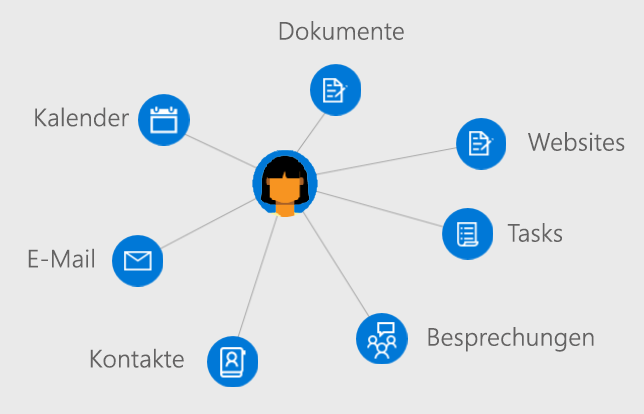

# Überblick über Benutzer in Microsoft Graph

Benutzer stehen für ein Geschäfts- oder Schul- bzw. Unikonto von Azure Active Directory (Azure AD) oder ein Microsoft-Konto in Microsoft Graph. Die **Benutzer**-Ressource in Microsoft Graph ist ein Hub, von dem aus Sie auf die Beziehungen und Ressourcen, die für Ihre Benutzer relevant sind, zugreifen können.

## Entwickeln von auf Benutzer ausgerichteten Anwendungen

Sie können mit Microsoft Graph auf die Beziehungen, Dokumente, Kontakte und Einstellungen zugreifen, die im Kontext des angemeldeten Benutzers relevant sind. Die **Benutzer**-Ressource bietet eine einfache Möglichkeit zum Zugreifen und Bearbeiten von Benutzerressourcen ohne zusätzliche Aufrufe, ohne Suche nach bestimmten Authentifizierungsinformationen und die direkte Ausgabe von Abfragen für Microsoft Graph-Ressourcen.

Um auf die Informationen oder Daten eines Benutzers zuzugreifen, müssen Sie [den Zugriff im Namen dieses Benutzers erhalten](auth-v2-user.md). Das Authentifizieren Ihrer Anwendung mit [Admin Zustimmung](permissions-reference.md) ermöglicht Ihnen, eine umfassendere Palette von Entitäten, die einem Benutzer zugeordnet sind, zu verwenden und zu aktualisieren.

### Verwalten Ihrer Organisation

Erstellen Sie in Ihrer Organisation neue Benutzer, oder aktualisieren Sie die Ressourcen und Beziehungen vorhandener Benutzer. Mit Microsoft Graph können Sie die folgenden Aufgaben für die Benutzerverwaltung ausführen: 

- Erstellen oder Löschen von Benutzern im Azure AD Ihrer Organisation
- Auflisten der Gruppenmitgliedschaften eines Benutzers und Ermitteln, ob ein Benutzer ein Mitglied einer Gruppe ist
- Auflisten der Benutzer, die einem Benutzer unterstellt sind, und Zuweisen eines Vorgesetzten zu einem Benutzer
- Hochladen oder Abrufen eines Fotos des Benutzers

### Arbeiten mit Kalendern und Aufgaben

Sie den Kalender und die Kalendergruppen, die einem Benutzer zugewiesen sind, anzeigen, Abfragen dazu durchführen und sie aktualisieren. Dies schließt Folgendes ein:

- Auflisten und Erstellen von Ereignissen in einem Benutzerkalender
- Anzeigen von Aufgaben, die einem Benutzer zugewiesen sind
- Suchen von freien Besprechungszeiten für eine Gruppe von Benutzern
- Abrufen einer Liste von Erinnerungen, die im Benutzerkalender eingestellt sind

### Verwalten von E-Mails und Verarbeiten von Kontakten

Sie können die E-Mail-Einstellungen und Kontaktlisten eines Benutzer konfigurieren und E-Mails im Auftrag eines Benutzers senden. Dies schließt Folgendes ein:

- Auflisten von E-Mail-Nachrichten und Senden neuer E-Mails
- Erstellen und Auflisten von Benutzerkontakten und Organisieren von Kontakten in Ordnern
- Abrufen und Aktualisieren von Postfachordnern und Einstellungen

### Optimieren der App durch Einblicke in das Benutzerverhalten

Maximieren Sie die Relevanz in der Anwendung, indem Sie zuletzt verwendete oder beliebten Dokumente und Kontakte, die einem Benutzer zugeordnet sind, besonders hervorheben. Mit Microsoft Graph haben Sie die folgenden Möglichkeiten:

- Zurückgeben der zuletzt angezeigten und durch einen Benutzer geänderten Dokumente
- Zurückgeben von Dokumenten und Websites, die einen Trend bei den Aktivitäten eines Benutzers zeigen
- Auflisten von Dokumenten, die über E-Mail oder OneDrive for Business mit dem Benutzer geteilt wurden

## API-Referenz
Suchen Sie die API-Referenz für diesen Dienst?

- [Benutzer-API in Microsoft Graph v1.0](/graph/api/resources/users?view=graph-rest-1.0)
- [Benutzer-API in Microsoft Graph, Betaversion](/graph/api/resources/users?view=graph-rest-beta)

## Nächste Schritte

- Erfahren Sie mehr über das [Arbeiten mit Benutzern](/graph/api/resources/users?view=graph-rest-1.0).
- Untersuchen Sie Ihre eigenen Daten aus der **Benutzer**-Ressource im [Graph Explorer](https://developer.microsoft.com/graph/graph-explorer).
- Authentifizieren bei Microsoft Graph [im Auftrag eines Benutzers](auth-v2-user.md) oder [als Daemon oder als Dienst durch Zustimmung eines Administrators](auth-v2-service.md).
- Festlegen der Zugriffssteuerung und Richtlinien für Benutzer mit der [Azure AD-API](/graph/api/resources/azure-ad-overview?view=graph-rest-1.0).
- Überprüfen der [Berechtigungen](permissions-reference.md), die Ihre App zum Zugreifen auf die Benutzerdaten haben muss. 
<!-- This isn't really a next step; let's remove to keep the list of links concise.>
- Stay up to date with Microsoft Graph [changelog](changelog.md).
-->
