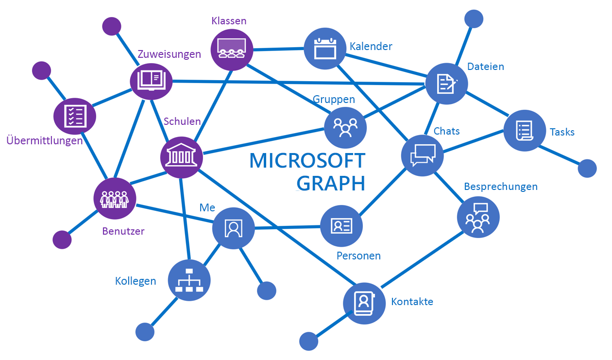
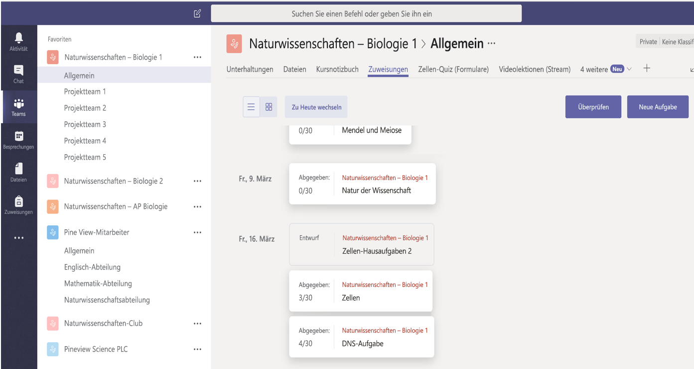

# Übersicht über die Bildungs-API

Mit Bildungs-APIs in Microsoft Graph werden Office 365-Ressourcen mithilfe von Informationen optimiert, die für Bildungsszenarien, u. a. Schulen, Kurse, Benutzer (Schüler/Studenten und Lehrer), Aufgaben und Übermittlungen relevant sind. Dies erleichtert das Erstellen von Lösungen, die in Bildungsressourcen für verschiedene Schul- und Kursraumszenarien integriert werden.

Die Bildungs-API in Microsoft Graph bietet Zugriff auf Kurse, Schulen, Benutzer, Aufgaben, Übermittlungen und vieles mehr.

## Gründe für die Integration in Bildungsszenarien

### Erstellen von Anwendungen, die die Klassenliste kennen

Die meisten Entwickler von Bildungssoftware erfahren früh, dass die Klassenliste eine der wichtigsten Informationen ist, die sie zum Ausführen Ihrer Anwendung benötigen. Diese ist in der Regel in einem Student Information System (SIS) einer Bildungseinrichtung eingeschlossen. Jedes Mal, wenn Lehrer eine neue Anwendung in ihren Kursraum bringen, verbringen sie Zeit damit, die Klassenlistendaten manuell in die App zu importieren. Viele ISVs widmen sich diesem Problem, indem sie eine Verbindung mit einem SIS herstellen, um die Kurslistendaten zu importieren. Bei hunderten von SIS-Systemen mit eigenen Formaten kann dies zu einer Herausforderung werden. [Microsoft School Data Sync](https://sds.microsoft.com/) stellt sich in Verbindung mit Listen-APIs dieser Herausforderung für Anwendungsentwickler und Schulen.

Im Folgenden werden einige Szenarien aufgeführt, die die Listen-APIs ermöglichen:

- [Abrufen aller Kurse einer Schule](https://developer.microsoft.com/en-us/graph/docs/api-reference/v1.0/api/educationschool_list_classes)
- [Abrufen aller Benutzer in einem Kurs](https://developer.microsoft.com/en-us/graph/docs/api-reference/v1.0/api/educationclass_list_members)
- [Abrufen aller Kurse, die von mir unterrichtet werden](https://developer.microsoft.com/en-us/graph/docs/api-reference/v1.0/api/educationuser_list_classes)

### Verwenden von Microsoft Teams zum Erstellen von Kursaufgaben in der Registerkarte „Aufgaben“

Sie können die Aufgaben-API zum Erstellen einer Web-App verwenden, die die Kursaufgaben verwaltet, und die App anschließend in Microsoft Teams auf einer neuen benutzerdefinierten Registerkarte integrieren.  

Microsoft Teams in Office 365 ist ein digitaler Hub, der Unterhaltungen, Inhalte und Apps an einem zentralen Ort für Kursräume zusammenführt. Microsoft Teams bietet [umfassende Erweiterungspunkte](https://docs.microsoft.com/en-us/microsoftteams/platform/concepts/apps/apps-overview), unter anderem die Erstellung von Registerkarten, Connectors und Bots. Diese Erweiterungspunkte können Bildungs-APIs in Microsoft Graph aufrufen, um mit Aufgaben und Übermittlungen zu arbeiten. Erstellen Sie eine umfassendere Oberfläche, indem Sie Ihren Erweiterungspunkt mit einer beliebigen Microsoft Graph-API zusammen mit Aufgaben- und Übermittlungs-APIs aktivieren.

Für den Bildungsbereich werden die benutzerdefinierten Registerkarten-Apps von Microsoft Teams in einem Kurskontext (einem Team) geöffnet, in dem es sinnvoll ist, den End-to-End-Aufgabenfluss von der Erstellung und Verteilung bis hin zur Bewertung und Rückmeldung zu verwalten. Dies ist nur ein Beispiel dafür, wie Sie mit Microsoft Teams Zeit sparen und die tägliche Logistik vereinfachen können, sodass Lehrer sich ihren Schülern widmen können.

Die folgende Abbildung zeigt eine Web-App für die Verwaltung von Aufgaben in einer benutzerdefinierten Registerkarte „Aufgaben“ für den Kurs **Naturwissenschaften – Biologie 1**.

Mit der Aufgaben-API kann Ihre App mit dem Aufgabendienst außerhalb von Microsoft Teams interagieren. In Microsoft Teams werden Verteilung, Fälligkeitsdaten und Benotung verarbeitet während Ihr System eine umfassende Oberfläche für die Schüler und Studenten bereitstellen kann.
Im folgenden werden Beispiele für einige Szenarien aufgeführt, die durch die Aufgaben-API ermöglicht werden:

- [Hinzufügen einer Aufgabe, die auf Ihre Anwendung verweist](https://developer.microsoft.com/en-us/graph/docs/api-reference/beta/api/educationclass_post_assignments) 
- [Zuweisen von Noten zu einzelnen Schülern und Studenten für mit Ihrer Anwendung verknüpfte Aufgaben](https://developer.microsoft.com/en-us/graph/docs/api-reference/beta/api/educationsubmission_update)
- [Erstellen eines Dashboards für Schüler/Studenten zum Anzeigen der Fälligkeit von Aufgaben](https://developer.microsoft.com/en-us/graph/docs/api-reference/beta/api/educationclass_list_assignments)

### Verwalten der Identitäts- und Listensynchronisierung mithilfe von School Data Sync Management (Vorschau) durch Schuladministratoren

Mit [School Data Sync](https://sds.microsoft.com/) wird der Import und die Synchronisierung von Schüler/Studentenidentitäten und Listendaten aus SIS-Systemen mit Azure Active Directory (Azure AD) und Office 365 vereinfacht. Wenn die Informationen synchronisiert werden, können Sie die Listen-APIs zum Lesen der Listeninformationen in den Anwendung verwenden. Wenn Sie als Systemintegrator eine Integration eines SIS-Systems einer Schule in School Data Sync einrichten, können Sie die [SDS-Verwaltungs-APIs](https://developer.microsoft.com/en-us/graph/docs/api-reference/beta/resources/educationsynchronizationprofile) in Microsoft Graph verwenden, um die Synchronisierung aus einer CSV-Datei oder einem unterstützten SIS-API-Connector einzurichten.

School Data Sync-Verwaltungs-APIs unterstützen End-to-End-Szenarien für die Verwaltung der Synchronisierung, zum Beispiel:

- [Erstellen eines Synchronisierungsprofils zum automatischen Starten einer Synchronisierung](https://developer.microsoft.com/en-us/graph/docs/api-reference/beta/api/educationsynchronizationprofile_post)
- Verwalten des Synchronisierungslebenszyklus mit den Vorgängen zum [Anhalten](https://developer.microsoft.com/en-us/graph/docs/api-reference/beta/api/educationsynchronizationprofile_pause), [Fortsetzen](https://developer.microsoft.com/en-us/graph/docs/api-reference/beta/api/educationsynchronizationprofile_resume) und [Zurücksetzen](https://developer.microsoft.com/en-us/graph/docs/api-reference/beta/api/educationsynchronizationprofile_reset)

## Nächste Schritte

- Informationen zu den ersten Schritten mit den Bildungs-APIs finden Sie in den folgenden Themen:
    - [Verwenden der Listen-APIs](https://developer.microsoft.com/en-us/graph/docs/api-reference/v1.0/resources/education-overview)
    - [Verwenden von Aufgaben-APIs](https://developer.microsoft.com/en-us/graph/docs/api-reference/beta/resources/educationassignment)
    - [Verwenden der SDS-Verwaltungs-APIs](https://developer.microsoft.com/en-us/graph/docs/api-reference/beta/resources/educationsynchronizationprofile)
- Testen Sie die Bildungs-APIs im [Graph-Tester](https://developer.microsoft.com/en-us/graph/graph-explorer).
- Schauen Sie sich die folgenden bildungsbezogenen Beispiele an:
    - [.NET-Beispiel für SSO und Listenerstellung](https://github.com/OfficeDev/O365-EDU-AspNetMVC-Samples)
    - [Angular Node-Beispiel für SSO und Listenerstellung](https://github.com/OfficeDev/O365-EDU-AngularNodeJS-Samples)   
    - [Python-Beispiel für SSO und Listenerstellung](https://github.com/OfficeDev/O365-EDU-Python-Samples)
    - [PHP-Beispiel für SSO und Listenerstellung](https://github.com/OfficeDev/O365-EDU-PHP-Samples)
    - [Beispiel für Profilverwaltungs-APIs](https://github.com/OfficeDev/O365-EDU-SDS-AspNetMVC-Samples) 

 

