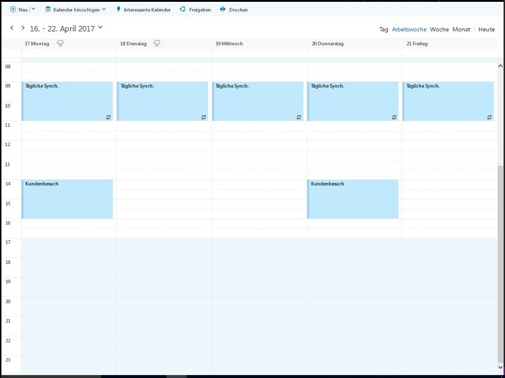

# <a name="find-possible-meeting-times-on-the-outlook-calendar"></a><span data-ttu-id="71192-104">Suchen nach möglichen Besprechungszeiten im Outlook-Kalender</span><span class="sxs-lookup"><span data-stu-id="71192-104">Find possible meeting times on the Outlook calendar</span></span>

<span data-ttu-id="71192-p102">In einem Unternehmen oder einer Schule oder Universität ist die Suche nach einer gemeinsamen Zeit und einem Ort für eine Besprechung häufig mit Mehraufwand verbunden. Microsoft Graph-Anwendungen können [findMeetingTimes](/graph/api/user-findmeetingtimes?view=graph-rest-1.0) verwenden, um alle möglichen Besprechungszeiten zu ermitteln, die Einschränkungen bzgl. Uhrzeit, Ort und anderen Aspekten erfüllen.</span><span class="sxs-lookup"><span data-stu-id="71192-p102">In a workplace or school, looking for a common time and place to meet often incurs overhead. Microsoft Graph applications can use [findMeetingTimes](/graph/api/user-findmeetingtimes?view=graph-rest-1.0) to identify any possible meeting times that satisfy time, location, and other constraints.</span></span>   

<span data-ttu-id="71192-p103">Mit der Aktion **findMeetingTimes** können Sie Bedingungen wie z. B. den Datums-/Uhrzeitbereich, die Dauer, optionale oder erforderliche Teilnehmer für die Besprechung und die Art der Aktivität (**activityDomain**) angeben. Die Aktion berücksichtigt die normalen Arbeitszeitpläne und den Frei-/Gebucht-Status der Teilnehmer und des Organisators und schlägt Zeiten vor, die für die Teilnehmer und den Typ der Aktivität geeignet sind. So beziehen sich Vorschläge für eine arbeitsbezogene Aktivität immer auf die Arbeitszeiten des Organisators und der Teilnehmer; außerdem werden vorgeschlagene Zeiten, zu denen die erforderlichen Teilnehmer verfügbar sind, weiter oben in der Liste mit Vorschlägen einsortiert.</span><span class="sxs-lookup"><span data-stu-id="71192-p103">The **findMeetingTimes** action lets you specify conditions such as the meeting date/time range, duration, optional or required attendees, and nature of the activity (**activityDomain**). The action takes into account the attendees' and organizer's normal work schedules and free/busy status, and suggests times that are appropriate for the participants and type of activity. For instance, suggestions for a work-related activity always occur during the work hours of the organizer and attendees, and suggestions where required attendees are available are ordered higher up in the suggested list.</span></span>

<span data-ttu-id="71192-p104">In Office 365 können Arbeitszeiten und Zeitzonen für jedes Postfach konfiguriert werden. Die Aktion **findMeetingTimes** berücksichtigt auch Zeitzonenunterschiede zwischen Organisator und Teilnehmern. Standardmäßig gibt **findMeetingTimes** Vorschläge in UTC zurück. Sie können den folgenden Anforderungsheader verwenden, damit **findMeetingTimes** Vorschläge in einer bestimmten Zeitzone ausgedrückt zurückgibt.</span><span class="sxs-lookup"><span data-stu-id="71192-p104">In Office 365, work hours and time zones are configurable per mailbox. The **findMeetingTimes** action handles time zone variations among the organizer and attendees. By default, **findMeetingTimes** returns suggestions in UTC. You can use the following request header to have **findMeetingTimes** return suggestions expressed in a specific time zone.</span></span>
```
Prefer: outlook.timezone="{time-zone-string}}"
```

<span data-ttu-id="71192-114">Besonders hilfreich für größere Besprechungen ist, dass Sie einen Prozentsatz (**minimumAttendeePercentage**) für ein Quorum angeben können, sodass **findMeetingTimes** nur Vorschläge zurückgibt, wenn diese minimale Teilnehmerzahl verfügbar ist.</span><span class="sxs-lookup"><span data-stu-id="71192-114">Especially useful for larger meetings, you can specify a percentage (**minimumAttendeePercentage**) for a quorum and have **findMeetingTimes** return suggestions only if that minimum attendee availability is met.</span></span>

<span data-ttu-id="71192-p105">Wenn **findMeetingTimes** keine Besprechungszeiten vorgeschlagen kann, wird ein bestimmter Grund (**emptySuggestionsReason**) angegeben, z. B. dass der Organisator oder ein erforderlicher Teilnehmer nicht verfügbar ist. Ausgehend von diesem Wert können Sie die Parameter optimieren und **findMeetingTimes** erneut aufrufen.</span><span class="sxs-lookup"><span data-stu-id="71192-p105">If **findMeetingTimes** cannot suggest any meeting times, it indicates a specific reason (**emptySuggestionsReason**), such as the organizer or a required attendee not available. Based on this value, you can better adjust the parameters and call **findMeetingTimes** again.</span></span>

><span data-ttu-id="71192-117">**Hinweis** Die Aktion **findMeetingTimes** ist derzeit für Office 365-Geschäfts-, -Schul- oder -Unipostfächer, aber nicht für persönliche outlook.com-Postfächer verfügbar.</span><span class="sxs-lookup"><span data-stu-id="71192-117">**Note** The **findMeetingTimes** action is currently available to Office 365 work or school mailboxes, but not personal, outlook.com mailboxes.</span></span>

## <a name="example"></a><span data-ttu-id="71192-118">Beispiel</span><span class="sxs-lookup"><span data-stu-id="71192-118">Example</span></span>

<span data-ttu-id="71192-p106">Das folgende Beispiel zeigt, wie Sie **findMeetingTimes** verwenden, um mögliche Zeiten für eine zweistündige Besprechung von zwei Benutzern zurückzugeben, wobei der Frei-/Gebucht-Status und die Arbeitszeitpläne der Benutzer und die teilweise Abwesenheit des Teilnehmer berücksichtigt werden. Da nur zwei Benutzer an dieser Besprechung teilnehmen sollen, ist für Vorschläge eine Anwesenheit von 100 % erforderlich. Die folgende Abbildung zeigt den Frei-/Gebucht-Zeitplan der Benutzer.</span><span class="sxs-lookup"><span data-stu-id="71192-p106">The following example shows how to use **findMeetingTimes** to return possible times for 2 users to meet for a couple of hours, taking into account the users' free/busy and work schedules, and the attendee being away for part of the time. Because there are only 2 users for this meeting, suggestions require 100% attendance. The following shows the users' free/busy schedule.</span></span>

### <a name="organizers-calendar"></a><span data-ttu-id="71192-122">Kalender des Organisators</span><span class="sxs-lookup"><span data-stu-id="71192-122">Organizer's calendar</span></span>

<span data-ttu-id="71192-123"></span><span class="sxs-lookup"><span data-stu-id="71192-123"></span></span>

### <a name="attendees-calendar"></a><span data-ttu-id="71192-124">Kalender des Teilnehmers</span><span class="sxs-lookup"><span data-stu-id="71192-124">Attendee's calendar</span></span>

<span data-ttu-id="71192-125"></span><span class="sxs-lookup"><span data-stu-id="71192-125"></span></span>

<span data-ttu-id="71192-126">Im Beispiel wird **findMeetingTimes** zwei Mal aufgerufen:</span><span class="sxs-lookup"><span data-stu-id="71192-126">The example makes 2 calls to **findMeetingTimes**:</span></span>

1. <span data-ttu-id="71192-p107">Der erste Aufruf sucht im Datumsbereich vom 18. bis 20. April. Da der Teilnehmer am 18. und 19. April abwesend ist und es keine gemeinsame verfügbare Zeit am 20. April gibt, gibt der erste Aufruf keine Vorschläge zurück und begründet es damit, dass die Teilnehmer nicht verfügbar sind (**emptySuggestionsReason**).</span><span class="sxs-lookup"><span data-stu-id="71192-p107">The first call looks in the date range of April 18-20. As the attendee is out-of-office on April 18-19, and there is no commonly available time on April 20, the first call returns no suggestions with the reason (**emptySuggestionsReason**) that attendees are not available.</span></span>
2. <span data-ttu-id="71192-129">Der zweite Aufruf sucht nach Verfügbarkeit am 21. April und gibt als Vorschlag den Zeitraum zwischen 14:00 und 16:00 Uhr zurück.</span><span class="sxs-lookup"><span data-stu-id="71192-129">The second call looks for availability on April 21 and returns a suggestion of 2-4pm.</span></span>

<span data-ttu-id="71192-p108">Die beiden Aufrufe von **findMeetingTimes** enthalten die folgenden Parameter. Alle [Parameter](/graph/api/user-findmeetingtimes?view=graph-rest-1.0#request-body) für **findMeetingTimes** sind optional.</span><span class="sxs-lookup"><span data-stu-id="71192-p108">The two calls to **findMeetingTimes** include the following parameters. All [parameters](/graph/api/user-findmeetingtimes?view=graph-rest-1.0#request-body) for **findMeetingTimes** are optional.</span></span>

- <span data-ttu-id="71192-132">**attendees**: ein Teilnehmer, Samantha Booth; die Eigenschaft **type** ist auf `required` festgelegt.</span><span class="sxs-lookup"><span data-stu-id="71192-132">**attendees**: one attendee, Samantha Booth, set as `required` for the **type** property</span></span>
- <span data-ttu-id="71192-133">**timeConstraint**: kein Ortsvorschlag erforderlich.</span><span class="sxs-lookup"><span data-stu-id="71192-133">**locationConstraint**: does not require any location suggestion</span></span>
- <span data-ttu-id="71192-134">**timeConstraint**: Der erste Aufruf sucht im Datums-/Uhrzeitbereich vom 18. April, 9:00 Uhr bis zum 20. April, 17:00 Uhr; nachdem der erste Aufruf keine Zeiten vorschlagen kann, untersucht der zweite Aufruf den 21. April zwischen 9:00 und 17:00 Uhr.</span><span class="sxs-lookup"><span data-stu-id="71192-134">**timeConstraint**: the first call looks in the date/time range of April 18, 9am to April 20, 5pm; after the first call fails to suggest any times, the second call looks at April 21, 9am to 5pm</span></span>
- <span data-ttu-id="71192-135">**meetingDuration**: zwei Stunden.</span><span class="sxs-lookup"><span data-stu-id="71192-135">**meetingDuration**: two hours</span></span>
- <span data-ttu-id="71192-136">**returnSuggestionReasons**: In diesem Beispiel muss ein Grund für jeden Vorschlag angegeben werden.</span><span class="sxs-lookup"><span data-stu-id="71192-136">**returnSuggestionReasons**: this example requires a reason for each suggestion</span></span>
- <span data-ttu-id="71192-137">**minimumAttendeePercentage**: 100 %, da der Teilnehmer zu jeder vorgeschlagenen Zeit verfügbar sein muss.</span><span class="sxs-lookup"><span data-stu-id="71192-137">**minimumAttendeePercentage**: 100%, as the attendee must be able to attend for any suggested time</span></span>

### <a name="first-request"></a><span data-ttu-id="71192-138">Erste Anforderung</span><span class="sxs-lookup"><span data-stu-id="71192-138">First request</span></span>

<span data-ttu-id="71192-139">Nach einem freien, zweistündigen Zeitfenster für beide Benutzer zwischen dem 18. und 20. April suchen.</span><span class="sxs-lookup"><span data-stu-id="71192-139">Look for a 2-hour free time slot for both users over April 18-20.</span></span>

<!-- {
  "blockType": "ignored",
  "name": "findmeetingtimes_example_first"
}-->
```http
POST https://graph.microsoft.com/v1.0/me/findMeetingTimes
Prefer: outlook.timezone="Pacific Standard Time"
Content-type: application/json

{ 
  "attendees": [ 
    { 
      "type": "required",  
      "emailAddress": { 
        "name": "Samantha Booth",
        "address": "samanthab@contoso.onmicrosoft.com" 
      } 
    }
  ],  
  "locationConstraint": { 
    "isRequired": false,  
    "suggestLocation": false,  
    "locations": [ 
      { 
        "resolveAvailability": false,
        "displayName": "Conf room Hood" 
      } 
    ] 
  },  
  "timeConstraint": {
    "activityDomain":"work", 
    "timeslots": [ 
      { 
        "start": { 
          "dateTime": "2017-04-18T09:00:00",  
          "timeZone": "Pacific Standard Time" 
        },  
        "end": { 
          "dateTime": "2017-04-20T17:00:00",  
          "timeZone": "Pacific Standard Time" 
        } 
      } 
    ] 
  },  
  "meetingDuration": "PT2H",
  "returnSuggestionReasons": true,
  "minimumAttendeePercentage": 100
}
```

### <a name="first-response"></a><span data-ttu-id="71192-140">Erste Antwort</span><span class="sxs-lookup"><span data-stu-id="71192-140">First response</span></span>
<span data-ttu-id="71192-141">Es gibt kein zweistündiges Zeitfenster während der Arbeitszeiten vom 18. bis 20. April, in dem beide Benutzer verfügbar sind.</span><span class="sxs-lookup"><span data-stu-id="71192-141">There is no 2-hour time slot during the work hours of April 18-20 when both users are available.</span></span>
<!-- {
  "blockType": "ignored",
  "truncated": true,
  "@odata.type": "microsoft.graph.meetingTimeSuggestionsResult",
  "isCollection": false
} -->
```http
HTTP/1.1 200 OK
Content-type: application/json
Preference-Applied: outlook.timezone="Pacific Standard Time"
Content-Length: 184

{
    "@odata.context":"https://graph.microsoft.com/v1.0/$metadata#microsoft.graph.meetingTimeSuggestionsResult",
    "emptySuggestionsReason":"AttendeesUnavailable",
    "meetingTimeSuggestions":[

    ]
}
```

### <a name="second-request"></a><span data-ttu-id="71192-142">Zweite Anforderung</span><span class="sxs-lookup"><span data-stu-id="71192-142">Second request</span></span>
<span data-ttu-id="71192-143">Nach einem zweistündigen Zeitfenster am 21. April suchen.</span><span class="sxs-lookup"><span data-stu-id="71192-143">Look for a 2-hour time slot on April 21.</span></span>
<!-- {
  "blockType": "ignored",
  "name": "findmeetingtimes_example_second"
}-->
```http
POST https://graph.microsoft.com/v1.0/me/findMeetingTimes
Prefer: outlook.timezone="Pacific Standard Time"
Content-type: application/json

{ 
  "attendees": [ 
    { 
      "type": "required",  
      "emailAddress": { 
        "name": "Samantha Booth",
        "address": "samanthab@contoso.onmicrosoft.com" 
      } 
    }
  ],  
  "locationConstraint": { 
    "isRequired": false,  
    "suggestLocation": false,  
    "locations": [ 
      { 
        "resolveAvailability": false,
        "displayName": "Conf room Hood" 
      } 
    ] 
  },  
  "timeConstraint": {
    "activityDomain":"work", 
    "timeslots": [ 
      { 
        "start": { 
          "dateTime": "2017-04-21T09:00:00",  
          "timeZone": "Pacific Standard Time" 
        },  
        "end": { 
          "dateTime": "2017-04-21T17:00:00",  
          "timeZone": "Pacific Standard Time" 
        } 
      } 
    ] 
  },  
  "meetingDuration": "PT2H",
  "returnSuggestionReasons": true,
  "minimumAttendeePercentage": 100
}
```

### <a name="second-response"></a><span data-ttu-id="71192-144">Zweite Antwort</span><span class="sxs-lookup"><span data-stu-id="71192-144">Second response</span></span>
<span data-ttu-id="71192-145">Die zweite **findMeetingTimes**-Anforderung schlägt als Besprechungszeit für beide Benutzer den 21. April von 14:00 bis 16:00 Uhr vor.</span><span class="sxs-lookup"><span data-stu-id="71192-145">The second **findMeetingTimes** request suggests April 21, 2-4pm for both users to meet.</span></span>
<!-- {
  "blockType": "ignored",
  "truncated": true,
  "@odata.type": "microsoft.graph.meetingTimeSuggestionsResult",
  "isCollection": false
} -->
```http
HTTP/1.1 200 OK
Content-type: application/json
Preference-Applied: outlook.timezone="Pacific Standard Time"
Content-Length: 714

{
    "@odata.context":"https://graph.microsoft.com/v1.0/$metadata#microsoft.graph.meetingTimeSuggestionsResult",
    "emptySuggestionsReason":"",
    "meetingTimeSuggestions":[
        {
            "confidence":100.0,
            "organizerAvailability":"free",
            "suggestionReason":"Suggested because it is one of the nearest times when all attendees are available.",
            "meetingTimeSlot":{
                "start":{
                    "dateTime":"2017-04-21T14:00:00.0000000",
                    "timeZone":"Pacific Standard Time"
                },
                "end":{
                    "dateTime":"2017-04-21T16:00:00.0000000",
                    "timeZone":"Pacific Standard Time"
                }
            },
            "attendeeAvailability":[
                {
                    "availability":"free",
                    "attendee":{
                        "type":"required",
                        "emailAddress":{
                            "address":"samanthab@contoso.onmicrosoft.com"
                        }
                    }
                }
            ],
            "locations":[
                {
                    "displayName":"Conf room Hood"
                }
            ]
        }
    ]
}
```


## <a name="next-steps"></a><span data-ttu-id="71192-146">Nächste Schritte</span><span class="sxs-lookup"><span data-stu-id="71192-146">Next steps</span></span>

<span data-ttu-id="71192-p109">Es gibt Situationen, in denen nicht alle Teilnehmer an einer Besprechung teilnehmen können. Sie können festlegen, dass **findMeetingTimes** eine Zeit vorschlägt, wenn die _Konfidenz_ für die Anwesenheit einen bestimmten Prozentsatz erreicht, indem Sie den optionalen Parameter **minimumAttendeePercentage** angeben. Erfahren Sie mehr über die [Konfidenz eines Besprechungsvorschlags](/graph/api/user-findmeetingtimes?view=graph-rest-1.0#the-confidence-of-a-meeting-suggestion) und andere [Parameter](/graph/api/user-findmeetingtimes?view=graph-rest-1.0#request-body), und wenden Sie sie nach Bedarf für größere Besprechungen an.</span><span class="sxs-lookup"><span data-stu-id="71192-p109">There are times when not all attendees can attend a meeting. You can have **findMeetingTimes** suggest a time if the _confidence_ for attendance reaches a certain percentage, by specifying the **minimumAttendeePercentage** optional parameter. Learn more about the [confidence of a meeting suggestion](/graph/api/user-findmeetingtimes?view=graph-rest-1.0#the-confidence-of-a-meeting-suggestion) and other [parameters](/graph/api/user-findmeetingtimes?view=graph-rest-1.0#request-body), and apply them as appropriate for meetings of larger sizes.</span></span>

<span data-ttu-id="71192-150">Nachdem Sie Vorschläge für Besprechungszeiten erhalten haben, haben Sie folgende Möglichkeiten:</span><span class="sxs-lookup"><span data-stu-id="71192-150">After getting meeting time suggestions, you may want to:</span></span>

1. <span data-ttu-id="71192-151">[Termin erstellen und als Besprechungsanfrage senden](/graph/api/user-post-events?view=graph-rest-1.0)</span><span class="sxs-lookup"><span data-stu-id="71192-151">[Create an event and send it as a meeting request](/graph/api/user-post-events?view=graph-rest-1.0).</span></span>
2. <span data-ttu-id="71192-152">Dem Termin [eine Anlage hinzufügen](/graph/api/event-post-attachments?view=graph-rest-1.0)</span><span class="sxs-lookup"><span data-stu-id="71192-152">[Add an attachment](/graph/api/event-post-attachments?view=graph-rest-1.0) to the event.</span></span>

<span data-ttu-id="71192-153">In diesem Artikel erfahren Sie mehr über die [Integration mit Outlook-Kalender](outlook-calendar-concept-overview.md).</span><span class="sxs-lookup"><span data-stu-id="71192-153">Find out more about [integrating with Outlook calendar](outlook-calendar-concept-overview.md).</span></span>
