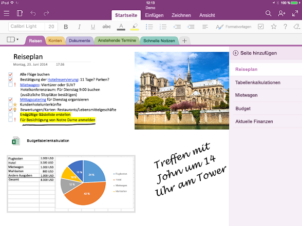

# Übersicht über die OneNote-API

OneNote ist ein digitales Notizbuch, mit dem Kunden Ideen und Notizen für zu Hause, Schule oder Arbeit durch Tippen, Skizzieren oder Sprechen im Web, auf dem Smartphone, Tablet oder Desktop aufzeichnen können. Sie können Notizen beliebig organisieren, zwischen Geräten wechseln und dort weitermachen, wo sie aufgehört haben. Zudem können sie Notizen in Echtzeit gemeinsam mit anderen Personen bearbeiten.

## Vorteile der Integration in OneNote

Durch die Integration Ihrer Apps in OneNote können Sie Erfahrungen plattformübergreifend für Millionen von Nutzern weltweit bereitstellen. Mit Microsoft Graph können Sie auf Notizbücher, Abschnitte und Seiten in OneNote-Lösungen zugreifen, um Ihren Benutzern zu helfen, Ideen umzusetzen und Informationen zu ordnen.

### Erfassen und Organisieren von Notizen und Ideen  

Verwenden Sie OneNote als Hilfsmittel zum Hinzufügen und Ordnen von Benutzerinhalten. Microsoft Graph vereinfacht das Schreiben von Apps, mit denen Studenten Notizen erstellen und recherchieren, Familien Pläne und Ideen teilen oder Einkäufer Bilder freigeben können. Ihre App sammelt die gewünschten Informationen, sendet sie an OneNote und hilft dann bei der Verwaltung dieser Informationen.

### Erfassen von Informationen in vielen verschiedenen Formaten

Erfassen Sie HTML-Code, eingebettete Bilder (aus einer lokalen Quelle oder öffentlichen URL), Videos, Audio, E-Mail-Nachrichten und andere gängige Dateitypen. OneNote kann sogar Webseiten und PDF-Dateien als Snapshots darstellen. Microsoft Graph unterstützt eine Reihe von standardmäßigen HTML- und CSS-Codes für das OneNote-Seitenlayout, sodass Sie Tabellen, Inline-Bilder und einfache Formatierungen verwenden können, um den gewünschten Look zu erzielen. 

### Verwenden Sie das Ökosystem von OneNote, um Ihre wichtigsten Szenarien zu verbessern.

Probieren Sie andere leistungsfähige Funktionen von OneNote aus. Die OneNote-APIs in Microsoft Graph führen OCR für Bilder aus, unterstützen die Volltextsuche, synchronisieren automatisch Clients, verarbeiten Bilder und extrahieren Visitenkarte sowie Online-Produkt- und Rezeptlisten. Verwenden Sie OneNote als digitalen Erinnerungsspeicher in der Cloud für Notizen und einfache Medien oder als Datenfeed für domänenspezifische Daten. 

### Millionen von OneNote-Benutzern auf allen wichtigen Plattformen erreichen

Verwenden Sie OneNote, um Ihre App-Nutzung zu steigern. OneNote ist auf neuen Windows-Geräten vorinstalliert und steht für die meisten Plattformen, online und als Bestandteil von Office 365 zur Verfügung. Wenn Sie Apps veröffentlichen, die die funktionsreiche OneNote-Umgebung verwenden, haben Sie Zugriff auf umfassendes plattformübergreifendes Marktpotenzial.

<!-- Might be good to show a few examples of Microsoft Graph API calls here, similar to what we have in the featured scenarios topic: featured_scenarios..md You could have an H2 section called "What can I do with OneNote APIs in Microsoft Graph?"-->

## Wozu kann ich OneNote-APIs in Microsoft Graph verwenden?

Im folgenden werden einige der am häufigsten verwendeten Anfragen für OneNote-Ressourcen vorgestellt.

|Vorgang|URL|
|:--------|:--|
|Abrufen meiner Notizbücher|[https://graph.microsoft.com/v1.0/me/onenote/notebooks](https://developer.microsoft.com/graph/graph-explorer?request=me/onenote/notebooks&version=1.0)|
|Abrufen meiner Abschnitte|[https://graph.microsoft.com/v1.0/me/onenote/sections](https://developer.microsoft.com/graph/graph-explorer?request=me/onenote/sections&version=1.0)|
|Abrufen meiner Seiten|[https://graph.microsoft.com/v1.0/me/onenote/pages](https://developer.microsoft.com/graph/graph-explorer?request=me/onenote/pages&version=1.0)|

## Weitere Informationen zu OneNote-APIs

Werfen Sie einen genaueren Blick auf Microsoft Graph-APIs, um mehr über die OneNote-Funktionen zum Aktualisieren von Inhalten zu erfahren. Die Themen in der folgenden Liste zeigen Ihnen, wie Sie neue OneNote-Seiten erstellen und vorhandene Seiten mit neuem Inhalt aktualisieren. Außerdem lernen Sie bewährte Methoden zum Aktualisieren von OneNote-Notizbüchern mit Microsoft Graph kennen. 

### Arbeiten mit OneNote

* [Verwenden der OneNote-REST-API](/graph/api/resources/onenote-api-overview?view=graph-rest-1.0)
* [Bewährte Methoden](onenote-best-practices.md)
* [Brandingrichtlinien](onenote-branding.md)
* [Öffnen der OneNote-Clients](open-onenote-client.md)
* [Verwenden von Notiztags auf OneNote-Seiten](onenote-note-tags.md)
* [Fehlercodes für OneNote-APIs in Microsoft Graph](onenote-error-codes.md)

### Arbeiten mit OneNote-Seiten

* [Eingabe- und Ausgabe-HTML auf OneNote-Seiten](onenote-input-output-html.md)
* [Abrufen von OneNote-Inhalten und -Strukturen mit Microsoft Graph](onenote-get-content.md)
* [Erstellen von OneNote-Seiten](onenote-create-page.md)
* [Aktualisieren der Inhalte von OneNote-Seiten](onenote-update-page.md)

### Arbeiten mit OneNote-Seiteninhalt

* [Erstellen von absolut positionierten Elementen auf OneNote-Seiten](onenote-abs-pos.md)
* [Hinzufügen von Bildern, Videos und Dateien zu OneNote-Seiten](onenote-images-files.md)
* [Verwenden von div-Tags der OneNote-API zum Extrahieren von Daten aus Erfassungen](onenote-extract-data.md)

## Siehe auch
Informieren Sie sich über weitere OneNote-Features, die nur am REST Endpunkt verfügbar sind, der für den OneNote-Dienst spezifisch ist.

- [OneNote-Entwicklung](https://docs.microsoft.com/de-DE/previous-versions/office/office-365-api/how-to/onenote-landing)
- [Arbeiten mit Kursnotizbüchern](https://docs.microsoft.com/de-DE/previous-versions/office/office-365-api/how-to/onenote-classnotebook)
- [Arbeiten Sie mit Notizbüchern der asynchronen Klasse](https://docs.microsoft.com/de-DE/previous-versions/office/office-365-api/how-to/onenote-classnotebook-asynchronous)
- [Arbeiten mit Mitarbeiternotizbüchern](https://docs.microsoft.com/de-DE/previous-versions/office/office-365-api/how-to/onenote-staffnotebook)
- [Kopieren von Notizbüchern, Abschnitten und Seiten](https://docs.microsoft.com/de-DE/previous-versions/office/office-365-api/how-to/onenote-copy)
- [Verwalten von Berechtigungen auf OneNote-Entitäten](https://docs.microsoft.com/de-DE/previous-versions/office/office-365-api/how-to/onenote-manage-perms)
- [Verwenden des OneNote-Speicherdialogs auf Ihren Webseiten](https://docs.microsoft.com/de-DE/previous-versions/office/office-365-api/how-to/onenote-save-dialog)
- [Abonnieren von Webhooks](https://docs.microsoft.com/de-DE/previous-versions/office/office-365-api/how-to/onenote-sync)

## API-Referenz
Suchen Sie die API-Referenz für diesen Dienst?

- [OneNote-API in Microsoft Graph v1.0](/graph/api/resources/onenote-api-overview?view=graph-rest-1.0)
- [OneNote-API in Microsoft Graph, Betaversion](/graph/api/resources/onenote-api-overview?view=graph-rest-beta)

## Nächste Schritte

Verwenden Sie den [Microsoft Graph-Tester](https://developer.microsoft.com/graph/graph-explorer), um die OneNote-APIs mit Ihren eigenen OneNote-Notizbüchern auszuprobieren.

Um OneNote-API-Aufrufe über den Graph-Explorer zu tätigen, wählen Sie **Mehr Beispiele anzeigen** in der Spalte auf der linken Seite aus. Schalten Sie OneNote über das Menü **Ein**. Zudem müssen Sie die entsprechenden Berechtigungen aktivieren. Wählen Sie unter Ihrem Kontonamen im Menü auf der linken Seite **Berechtigungen ändern** aus. Weitere Informationen über OneNote-Berechtigungen finden Sie unter [Notizenberechtigungen](permissions-reference.md#notes-permissions).

Hinweise zu den ersten Schritten mit OneNote-APIs in Microsoft Graph finden Sie unter [Referenzinhalte für OneNote](/graph/api/resources/onenote-api-overview?view=graph-rest-1.0).

