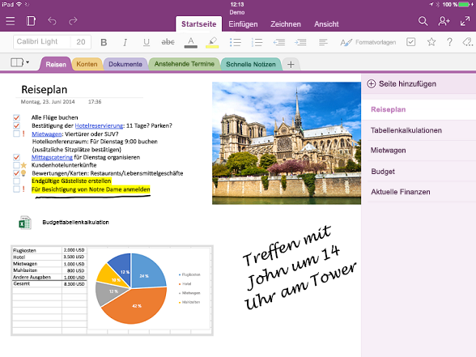

# Übersicht über die OneNote-APIOneNote API overview

OneNote ist ein digitales Notizbuch, mit dem Kunden Ideen und Notizen für zu Hause, Schule oder Arbeit durch Tippen, Skizzieren oder Sprechen im Web, auf dem Smartphone, Tablet oder Desktop aufzeichnen können.OneNote is a digital notebook that lets customers track ideas and notes for home, school, or work, by typing, sketching, or voice, on the web, phone, tablet, or desktop. Sie können Notizen beliebig organisieren, zwischen Geräten wechseln und dort weitermachen, wo sie aufgehört haben. Zudem können sie Notizen in Echtzeit gemeinsam mit anderen Personen bearbeiten.They can freely organize notes, switch devices and pick up where they leave off, and collaborate on notes with others in real time.

## Vorteile der Integration in OneNoteWhy integrate with OneNote?

Durch die Integration Ihrer Apps in OneNote können Sie Erfahrungen plattformübergreifend für Millionen von Nutzern weltweit bereitstellen.By integrating your apps with OneNote, you can create empowering experiences across multiple platforms that reach millions of users worldwide. Mit Microsoft Graph können Sie auf Notizbücher, Abschnitte und Seiten in OneNote-Lösungen zugreifen, um Ihren Benutzern zu helfen, Ideen umzusetzen und Informationen zu ordnen.You can use Microsoft Graph to access notebooks, sections, and pages in OneNote to create solutions that help your users plan and organize ideas and information.

### Erfassen und Organisieren von Notizen und IdeenCollect and organize notes and ideas  

Verwenden Sie OneNote als Hilfsmittel zum Hinzufügen und Ordnen von Benutzerinhalten.Use OneNote as a canvas where users can add and arrange their content. Microsoft Graph vereinfacht das Schreiben von Apps, mit denen Studenten Notizen erstellen und recherchieren, Familien Pläne und Ideen teilen oder Einkäufer Bilder freigeben können.Microsoft Graph makes it easy to write apps that enable students to take notes and do research, families to share plans and ideas, or shoppers to share pictures. Ihre App sammelt die gewünschten Informationen, sendet sie an OneNote und hilft dann bei der Verwaltung dieser Informationen.Your app can grab the information people want, send it to OneNote, and then help them organize it.

### Erfassen von Informationen in vielen verschiedenen FormatenCapture information in many formats

Erfassen Sie HTML-Code, eingebettete Bilder (aus einer lokalen Quelle oder öffentlichen URL), Videos, Audio, E-Mail-Nachrichten und andere gängige Dateitypen.Capture HTML, embed images (sourced locally or at a public URL), video, audio, email messages, and other common file types. OneNote kann sogar Webseiten und PDF-Dateien als Snapshots darstellen.OneNote can even render webpages and PDF files as snapshots. Microsoft Graph unterstützt eine Reihe von standardmäßigen HTML- und CSS-Codes für das OneNote-Seitenlayout, sodass Sie Tabellen, Inline-Bilder und einfache Formatierungen verwenden können, um den gewünschten Look zu erzielen.Microsoft Graph supports a set of standard HTML and CSS for OneNote page layout, so you can use tables, inline images, and basic formatting to get the look you want. 

### Verwenden Sie das Ökosystem von OneNote, um Ihre wichtigsten Szenarien zu verbessern.Use the OneNote ecosystem to enhance your core scenarios

Probieren Sie andere leistungsfähige Funktionen von OneNote aus.Tap into other powerful OneNote features. Die OneNote-APIs in Microsoft Graph führen OCR für Bilder aus, unterstützen die Volltextsuche, synchronisieren automatisch Clients, verarbeiten Bilder und extrahieren Visitenkarte sowie Online-Produkt- und Rezeptlisten.The OneNote APIs in Microsoft Graph run OCR on images, support full-text search, auto-syncs clients, process images, and extract business card captures and online product and recipe listings. Verwenden Sie OneNote als digitalen Erinnerungsspeicher in der Cloud für Notizen und einfache Medien oder als Datenfeed für domänenspezifische Daten.Use OneNote as your digital memory store in the cloud for notes and lightweight media, or as a data feed for domain-specific data. 

### Millionen von OneNote-Benutzern auf allen wichtigen Plattformen erreichenReach millions of OneNote users on all major platforms

Verwenden Sie OneNote, um Ihre App-Nutzung zu steigern.Use OneNote to increase your app usage. OneNote ist auf neuen Windows-Geräten vorinstalliert und steht für die meisten Plattformen, online und als Bestandteil von Office 365 zur Verfügung.OneNote is preinstalled on new Windows devices, and is available for most platforms, online, and as part of Office 365. Wenn Sie Apps veröffentlichen, die die funktionsreiche OneNote-Umgebung verwenden, haben Sie Zugriff auf umfassendes plattformübergreifendes Marktpotenzial.When you publish apps that use the feature-rich OneNote environment, you have access to broad cross-platform market potential.

<!-- Might be good to show a few examples of Microsoft Graph API calls here, similar to what we have in the featured scenarios topic: https://developer.microsoft.com/en-us/graph/docs/concepts/featured_scenarios. You could have an H2 section called "What can I do with OneNote APIs in Microsoft Graph?"-->

## Wozu kann ich OneNote-APIs in Microsoft Graph verwenden?What can I do with OneNote APIs in Microsoft Graph?

Im folgenden werden einige der am häufigsten verwendeten Anfragen für OneNote-Ressourcen vorgestellt.The following are some of the most popular requests for working with OneNote resources.

|VorgangOperation|URLURL|
|:--------|:--|
|Abrufen meiner NotizbücherGET my notebooks|[https://graph.microsoft.com/v1.0/me/onenote/notebooks](https://developer.microsoft.com/en-us/graph/graph-explorer?request=me/onenote/notebooks&version=1.0)|
|Abrufen meiner AbschnitteGET my sections|[https://graph.microsoft.com/v1.0/me/onenote/sections](https://developer.microsoft.com/en-us/graph/graph-explorer?request=me/onenote/sections&version=1.0)|
|Abrufen meiner SeitenGET my pages|[https://graph.microsoft.com/v1.0/me/onenote/pages](https://developer.microsoft.com/en-us/graph/graph-explorer?request=me/onenote/pages&version=1.0)|

## Weitere Informationen zu OneNote-APIsLearn more about OneNote APIs

Werfen Sie einen genaueren Blick auf Microsoft Graph-APIs, um mehr über die OneNote-Funktionen zum Aktualisieren von Inhalten zu erfahren.Take an in-depth look at Microsoft Graph APIs to learn about the OneNote content updating capabilities. Die Themen in der folgenden Liste zeigen Ihnen, wie Sie neue OneNote-Seiten erstellen und vorhandene Seiten mit neuem Inhalt aktualisieren.The topics in the following list show you how to create new OneNote pages and update existing pages with new content. Außerdem lernen Sie bewährte Methoden zum Aktualisieren von OneNote-Notizbüchern mit Microsoft Graph kennen.You'll also learn about best practices in using Microsoft Graph to update OneNote notebooks. 

### Arbeiten mit OneNoteWork with OneNote

* [Verwenden der OneNote-REST-APIUse the OneNote REST API](../api-reference/v1.0/resources/onenote-api-overview.md)
* [Bewährte MethodenBest practices](onenote_best_practices.md)
* [BrandingrichtlinienBranding guidelines](onenote-branding.md)
* [Öffnen der OneNote-ClientsOpen the OneNote client](open_onenote_client.md)
* [Verwenden von Notiztags auf OneNote-SeitenUse note tags in OneNote pages](onenote-note-tags.md)
* [Fehlercodes für OneNote-APIs in Microsoft GraphError codes for OneNote APIs in Microsoft Graph](onenote_error_codes.md)

### Arbeiten mit OneNote-SeitenWork with OneNote pages

* [Eingabe- und Ausgabe-HTML auf OneNote-SeitenInput and output HTML in OneNote pages](onenote_input_output_html.md)
* [Abrufen von OneNote-Inhalten und -Strukturen mit Microsoft GraphGet OneNote content and structure with Microsoft Graph](onenote-get-content.md)
* [Erstellen von OneNote-SeitenCreate OneNote pages](onenote-create-page.md)
* [Aktualisieren der Inhalte von OneNote-SeitenUpdate OneNote page content](onenote_update_page.md)

### Arbeiten mit OneNote-SeiteninhaltWork with OneNote page content

* [Erstellen von absolut positionierten Elementen auf OneNote-SeitenCreate absolute positioned elements in OneNote pages](onenote-abs-pos.md)
* [Hinzufügen von Bildern, Videos und Dateien zu OneNote-SeitenAdd images, videos, and files to OneNote pages](onenote_images_files.md)
* [Verwenden von div-Tags der OneNote-API zum Extrahieren von Daten aus ErfassungenUse OneNote API div tags to extract data from captures](onenote-extract-data.md)

## Erkunden Sie die OneNote-APIsExplore the OneNote APIs

Verwenden Sie den [Microsoft Graph-Tester](https://developer.microsoft.com/de-DE/graph/graph-explorer), um die OneNote-APIs mit Ihren eigenen OneNote-Notizbüchern auszuprobieren.Use the [Microsoft Graph Explorer](https://developer.microsoft.com/de-DE/graph/graph-explorer) to try out the OneNote APIs with your own OneNote notebooks.

Um OneNote-API-Aufrufe über den Graph-Explorer zu tätigen, wählen Sie **Mehr Beispiele anzeigen** in der Spalte auf der linken Seite aus.To make OneNote API calls from the Graph Explorer, choose **Show more samples** in the column on the left. Schalten Sie OneNote über das Menü **Ein**.Use the menu to toggle OneNote **On**. Zudem müssen Sie die entsprechenden Berechtigungen aktivieren.You will also need to enable the appropriate permissions. Wählen Sie unter Ihrem Kontonamen im Menü auf der linken Seite **Berechtigungen ändern** aus.Under your account name in the menu on the left, choose **modify permissions**. Weitere Informationen über OneNote-Berechtigungen finden Sie unter [Notizenberechtigungen](permissions_reference.md#notes-permissions).For more information about OneNote permissions, see [Notes permissions](permissions_reference.md#notes-permissions).

Hinweise zu den ersten Schritten mit OneNote-APIs in Microsoft Graph finden Sie unter [Referenzinhalte für OneNote](../api-reference/v1.0/resources/onenote-api-overview.md).To get started with OneNote APIs in Microsoft Graph, see the [OneNote reference content](../api-reference/v1.0/resources/onenote-api-overview.md).

## Siehe auchSee also

- [OneNote-EntwicklungOneNote development](https://docs.microsoft.com/de-DE/previous-versions/office/office-365-api/how-to/onenote-landing)
- [Arbeiten mit KursnotizbüchernWork with class notebooks](https://docs.microsoft.com/de-DE/previous-versions/office/office-365-api/how-to/onenote-classnotebook)
- [Arbeiten Sie mit Notizbüchern der asynchronen KlasseWork with class notebooks](https://docs.microsoft.com/de-DE/previous-versions/office/office-365-api/how-to/onenote-classnotebook-asynchronous)
- [Arbeiten mit MitarbeiternotizbüchernWork with staff notebooks](https://docs.microsoft.com/de-DE/previous-versions/office/office-365-api/how-to/onenote-staffnotebook)
- [Kopieren von Notizbüchern, Abschnitten und SeitenCopy notebooks, sections, and pages](https://docs.microsoft.com/de-DE/previous-versions/office/office-365-api/how-to/onenote-copy)
- [Verwalten von Berechtigungen auf OneNote-EntitätenManage permissions on OneNote entities](https://docs.microsoft.com/de-DE/previous-versions/office/office-365-api/how-to/onenote-manage-perms)
- [Verwenden des OneNote-Speicherdialogs auf Ihren WebseitenUse the OneNote save dialog on your web pages](https://docs.microsoft.com/de-DE/previous-versions/office/office-365-api/how-to/onenote-save-dialog)
- [Abonnieren von WebhooksSubscribe to webhooks](https://docs.microsoft.com/de-DE/previous-versions/office/office-365-api/how-to/onenote-sync)
