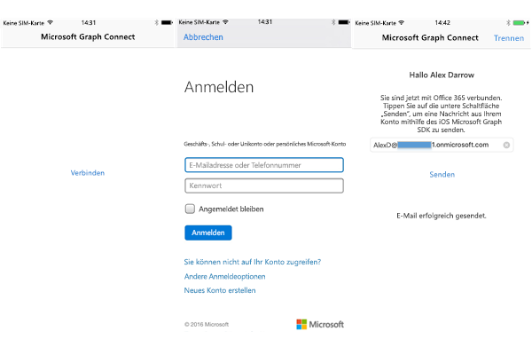

# <a name="get-started-with-microsoft-graph-in-an-objectve-c-ios-app"></a>Erste Schritte mit Microsoft Graph in einer Ziel-C-iOS-App

> **Sie erstellen Apps für Unternehmenskunden?** Ihre App funktioniert möglicherweise nicht, wenn Ihr Unternehmenskunde Enterprise Mobility-Sicherheitsfunktionen wie <a href="https://azure.microsoft.com/en-us/documentation/articles/active-directory-conditional-access-device-policies/" target="_newtab">bedingten Gerätezugriff</a> aktiviert. In diesem Fall treten bei Ihren Kunden möglicherweise Fehler auf. 

> Zur Unterstützung **aller Unternehmenskunden** über **alle Unternehmensszenarien** hinweg müssen Sie den Azure AD-Endpunkt verwenden und Ihre Apps mithilfe des [Azure-Portals](https://aka.ms/aadapplist) verwalten. Weitere Informationen finden Sie unter [Entscheiden zwischen dem Azure AD- und dem Azure AD v2.0-Endpunkt](../concepts/auth_overview.md#deciding-between-the-azure-ad-and-azure-ad-v20-endpoints).

Dieser Artikel beschreibt die erforderlichen Aufgaben zum Abrufen eines Zugriffstokens vom [Azure AD v2.0-Endpunkt](https://developer.microsoft.com/en-us/graph/docs/concepts/converged_auth) und zum Aufrufen von Microsoft Graph. Er führt Sie durch den Code im [Office 365 Connect-Beispiel für iOS (SDK)](https://github.com/microsoftgraph/ios-objectivec-connect-sample) und erläutert die wichtigsten Konzepte, die in einer App implementiert werden müssen, die Microsoft Graph verwendet. In diesem Artikel wird auch beschrieben, wie Sie mithilfe des [Microsoft Graph SDK für iOS](https://github.com/microsoftgraph/msgraph-sdk-ios) auf Microsoft Graph zugreifen.

Sie können die Version der App, die Sie erstellen, aus diesem GitHub Repository herunterladen:

* [Office 365 Connect-Beispiel für iOS unter Verwendung des Microsoft Graph-SDKs](https://github.com/microsoftgraph/ios-objectivec-connect-sample)

In der folgenden Abbildung ist die App dargestellt, die Sie erstellen.




Der Workflow beinhaltet das Herstellen einer Verbindung zu Microsoft Graph sowie die Authentifizierung, das Anmelden mit Ihrem Büro- oder persönlichen Konto und schließlich das Senden einer E-Mail an einen Empfänger.

**Sie möchten keine App erstellen?** Verwenden Sie für einen schnellen Einstieg den [Schnellstart Microsoft Graph](https://graph.microsoft.io/en-us/getting-started).

## <a name="prerequisites"></a>Voraussetzungen

Für die ersten Schritte benötigen Sie: 

* [Xcode](https://developer.apple.com/xcode/downloads/) von Apple
* Installation von [CocoaPods](https://guides.cocoapods.org/using/using-cocoapods.html) als ein Abhängigkeits-Manager.
* Ein [Microsoft-Konto](https://www.outlook.com/) oder ein [Geschäfts- oder Schulkonto](https://docs.microsoft.com/en-us/office/developer-program/office-365-developer-program-faq#account-types).
* Das [Microsoft Graph Startprojekt für iOS](https://github.com/microsoftgraph/ios-objectivec-connect-sample). Diese Vorlage enthält Klassen, denen Sie Code hinzufügen müssen. Sie rufen dieses Projekt ab, indem Sie das Beispielprojekt von diesem Speicherort aus klonen oder herunterladen. Dann arbeiten Sie mit dem Arbeitsbereich innerhalb des Ordners **Startprojekt** (**ios-objectivec-connect-sample.xcworkspace**).

## <a name="register-the-app"></a>Registrieren der App
 
1. Melden Sie sich beim [App-Registrierungsportal](https://apps.dev.microsoft.com/) entweder mit Ihrem persönlichen oder geschäftlichen Konto oder mit Ihrem Schulkonto an.
2. Klicken Sie auf **App hinzufügen**.
3. Geben Sie einen Namen für die App ein, und wählen Sie **Anwendung erstellen** aus.
    
    Die Registrierungsseite wird angezeigt, und die Eigenschaften der App werden aufgeführt.
 
4. Wählen Sie unter **Plattformen** die Option **Plattform hinzufügen** aus.
5. Wählen Sie **Systemeigene Plattform**.
6. Kopieren Sie die Client-ID in die Zwischenablage. Sie müssen diesen Wert in die Beispiel-App eingeben.

    Die App-ID ist ein eindeutiger Bezeichner für Ihre App. 

7. Klicken Sie auf **Speichern**.

## <a name="importing-the-project-dependencies"></a>Importieren der Projekt-Abhängigkeiten

1. Klonen Sie dieses Repository, [Office 365 Connect-Beispiel für iOS unter Verwendung des Microsoft Graph-SDKs](https://github.com/microsoftgraph/ios-objectivec-connect-sample). 
>WICHTIG: Verwenden Sie das Beispiel im Startprojekt-Ordner und nicht im Beispiel auf der Stammebene des Projekts.

2. Verwenden Sie CocoaPods, um das Microsoft Graph-SDK und Authentifizierungsabhängigkeiten zu importieren: Diese Beispiel-App enthält bereits eine POD-Datei, die die Pods in das Projekt überträgt. Navigieren Sie zu dem Ordner **Startprojekt** in der **Terminal** -App und führen Sie von **Terminal** folgenden Befehl aus:

        pod install

   Sie erhalten eine Bestätigung, dass die Pods in das Projekt importiert wurden. Weitere Informationen finden Sie unter [CocoaPods](https://guides.cocoapods.org/using/using-cocoapods.html)


## <a name="enable-keychain-sharing"></a>Aktivieren der Schlüsselbundfreigabe
 
Für Xcode 8 müssen Sie die Schlüsselbundgruppe hinzufügen, sonst kann Ihre App nicht auf den Schlüsselbund zugreifen. So fügen Sie die Schlüsselbundgruppe hinzu:
 
1. Wählen Sie im Projekt-Manager-Bereich in Xcode das Projekt aus. (⌘ + 1).
 
2. Wählen Sie **iOS-ObjectiveC-Connect-Sample**.
 
3. Aktivieren Sie auf der Registerkarte „Funktionen“ die Option **Schlüsselbundfreigabe**.
 
4. Fügen Sie **com.microsoft.ios-objectivec-connect-sample** zu den Schlüsselbundgruppen hinzu.
 

## <a name="authenticating-with-microsoft-graph"></a>Authentifizieren mit Microsoft Graph

Für den Zugriff auf den Benutzeroberflächenworkflow muss die App den Benutzer authentifizieren, sodass dieser dann eine E-Mail an einen bestimmten Benutzer senden kann. Für Anforderungen beim Microsoft Graph-Dienst muss ein Authentifizierungsanbieter bereitgestellt werden, der HTTPS-Anforderungen mit einem entsprechenden OAuth 2.0-Bearertoken authentifizieren kann. Im Beispielprojekt liegt eine Authentifizierungsklasse mit der Bezeichnung **AuthenticationProvider.m.** bereits als Stub vor. Wir fügen eine Funktion zum Anfordern und Erwerben eines Zugriffstokens für den Aufruf der Microsoft Graph-API hinzu. 

1. Öffnen Sie den Projektarbeitsbereich Xcode (**iOS-ObjectiveC-Connect-Sample.xcworkspace**) im Ordner **Startprojekt** und navigieren Sie zum Ordner **Authentifizierung** und öffnen Sie die Datei **AuthenticationProvider.m.** Fügen Sie dieser Klasse den folgenden Code hinzu.

```objectivec
   -(void) connectToGraphWithClientId:(NSString *)clientId scopes:(NSArray *)scopes completion:(void (^)    (NSError *))completion{
      [NXOAuth2AuthenticationProvider setClientId:kClientId scopes:scopes];
      /**
      Obtains access token by performing login with UI, where viewController specifies the parent view controller.
      @param viewController The view controller to present the UI on.
      @param completionHandler The completion handler to be called when the authentication has completed.
      error should be non nil if there was no error, and should contain any error(s) that occurred.
      */

      if ([[NXOAuth2AuthenticationProvider sharedAuthProvider] loginSilent]) {
         completion(nil);
      }
      else {
         [[NXOAuth2AuthenticationProvider sharedAuthProvider] loginWithViewController:nil completion:^(NSError *error) {
            if (!error) {
               NSLog(@"Authentication successful.");
               completion(nil);
            }
            else {
               NSLog(@"Authentication failed - %@", error.localizedDescription);
               completion(error);
            }
         }];
      }
   }
```     

2. Als Nächstes fügen Sie die Methode in der Header-Datei hinzu. Öffnen Sie die Datei **AuthenticationProvider.h** und fügen Sie dieser Klasse den folgenden Code hinzu.
   ```objectivec
   -(void) connectToGraphWithClientId:(NSString *)clientId
                               scopes:(NSArray *)scopes
                           completion:(void (^)(NSError *error))completion;
   ```

2. Abschließend rufen wir diese Methode aus **ConnectViewController.m**  heraus auf. Dieser Controller ist die Standardansicht, die die App lädt, und es gibt eine einzelne Schaltfläche mit dem Namen **Verbinden**, die der Benutzer antippt, um den Authentifizierungsprozess zu initiieren. Diese Methode beinhaltet zwei Parameter, die **Client-ID** und **Bereiche**, die wir nachfolgend im Detail besprechen. Fügen Sie die folgende Aktion zu **ConnectViewController.m** hinzu.

```objectivec
- (IBAction)connectTapped:(id)sender {
   [self showLoadingUI:YES];
   NSArray *scopes = [kScopes componentsSeparatedByString:@","];
   [self.authProvider connectToGraphWithClientId:kClientId scopes:scopes completion:^(NSError *error) {
   if (!error) {
      [self performSegueWithIdentifier:@"showSendMail" sender:nil];
      [self showLoadingUI:NO];
      NSLog(@"Authentication successful.");
   }
   else{
      NSLog(NSLocalizedString(@"CHECK_LOG_ERROR", error.localizedDescription));
      [self showLoadingUI:NO];
   };
  }];
}
```     

## <a name="send-an-email-with-microsoft-graph"></a>Senden einer E-Mail mit Microsoft Graph

Nach dem Konfigurieren des Projekts für die Authentifizierung wird in den nächsten Aufgaben mithilfe der Microsoft Graph-API eine E-Mail an einen Benutzer gesendet. Standardmäßig ist der angemeldete Benutzer der Empfänger, aber Sie haben die Möglichkeit, einen beliebigen anderen Empfänger anzugeben. Der Code, mit dem wir hier arbeiten, befindet sich im Ordner **Controller** und in der Klasse **SendMailViewController.m.** Sie werden sehen, dass es hier noch anderen Code für die Benutzeroberfläche und eine Hilfsmethode zum Abrufen von Benutzerprofildaten aus dem Microsoft Graph-Dienst gibt. Wir werden uns auf die Methoden zum Erstellen einer E-Mail-Nachricht und das Senden dieser Nachricht konzentrieren.

1. Öffnen Sie **SendMailViewController.m.** im Ordner „Controller“ und fügen Sie den folgenden Code  **viewDidLoad** nach `self.graphClient = [MSGraphClient client]` zu der Methode hinzu: `self.graphClient = [MSGraphClient client]`
   ```objectivec
       [self getUserInfo:(self.emailAddress) completion:^( NSError *error) {
        if (!error) {
            [self getUserPicture:(self.emailAddress)  completion:^(UIImage *image, NSError *error) {
                if (!error) {
                    self.userPicture = image;
                } else {
                    //get the test image out of the project resources
                    self.userPicture = [UIImage imageNamed:(@"test.png")];
                }
                [self uploadPictureToOneDrive:(self.userPicture) completion:^(NSString *webUrl, NSError *error) {
                    if (!error) {
                        self.pictureWebUrl = webUrl;
                        dispatch_async(dispatch_get_main_queue(), ^{
                            self.sendMailButton.enabled = true;
                        });
                    } else {
                        dispatch_async(dispatch_get_main_queue(), ^{
                            NSLog(NSLocalizedString(@"ERROR", ""), error.localizedDescription);
                            self.statusTextView.text = NSLocalizedString(@"PICTURE_UPLOAD_FAILURE", comment: "");
                        });
                    }
                }];
            }];
        }
    }];
   ```

1. Öffnen Sie **SendMailViewController.m.** im Ordner „Controller“ und fügen Sie die folgende Hilfsmethode zu der Klasse hinzu:
```objectivec
  //Create a sample test message to send to specified user account
  -(MSGraphMessage*) getSampleMessage{
      MSGraphMessage *message = [[MSGraphMessage alloc]init];
      MSGraphRecipient *toRecipient = [[MSGraphRecipient alloc]init];
      MSGraphEmailAddress *email = [[MSGraphEmailAddress alloc]init];
    
      //need to get email text field for send to!
    
      email.address = self.emailAddress;
      toRecipient.emailAddress = email;
    
      NSMutableArray *toRecipients = [[NSMutableArray alloc]init];
      [toRecipients addObject:toRecipient];
    
      message.subject = NSLocalizedString(@"MAIL_SUBJECT", comment: "");
    
      MSGraphItemBody *emailBody = [[MSGraphItemBody alloc]init];
      NSString *htmlContentPath = [[NSBundle mainBundle] pathForResource:@"EmailBody" ofType:@"html"];
      NSString *htmlContentString = [NSString stringWithContentsOfFile:htmlContentPath encoding:NSUTF8StringEncoding error:nil];
    
      emailBody.content = htmlContentString;
      NSString *replaceString = @"a href=";
      replaceString = [replaceString stringByAppendingString:(self.pictureWebUrl)];
      emailBody.content = [emailBody.content stringByReplacingOccurrencesOfString:(@"a href=%s") withString:(replaceString)];
      emailBody.contentType = [MSGraphBodyType html];
      message.body = emailBody;
    
      message.toRecipients = toRecipients;
    
      MSGraphFileAttachment *fileAttachment= [[MSGraphFileAttachment alloc]init];
      fileAttachment.oDataType = @"#microsoft.graph.fileAttachment";
      fileAttachment.contentType = @"image/png";
    
      NSString *decodedString = [UIImagePNGRepresentation(self.userPicture) base64EncodedStringWithOptions:NSDataBase64EncodingEndLineWithCarriageReturn];
    
      fileAttachment.contentBytes = decodedString;
      fileAttachment.name = @"me.png";
      message.attachments = [message.attachments arrayByAddingObject:(fileAttachment)];
      return message;
    
    }
```
3. Öffnen Sie **SendMailViewController.m.** Fügen Sie die folgende Methode zu der Klasse hinzu.
Mit **UploadPictureToOneDrive** wird das Profilbild des [Benutzers](https://developer.microsoft.com/en-us/graph/docs/api-reference/v1.0/resources/user) aus den [Benutzerinformationen](https://developer.microsoft.com/en-us/graph/docs/api-reference/v1.0/resources/user) hochgeladen. Die URL für die Webfreigabe wird in den Textkörper der E-Mail eingebettet, die vom Beispiel zurückgegeben wird.

  ```objectivec
  -(void) uploadPictureToOneDrive: (UIImage *) image completion:(void(^) (NSString*, NSError*))completionBlock{
    
    NSData *data = UIImagePNGRepresentation(image);
    [[[[[[[self.graphClient me]
          drive]
         root]
        children]
       driveItem:(@"me.png")]
      contentRequest]
     uploadFromData:(data) completion:^(MSGraphDriveItem *response, NSError *error) {
         
         if (!error) {
             NSString *webUrl = response.webUrl;
             completionBlock(webUrl, error);
         } else {
             dispatch_async(dispatch_get_main_queue(), ^{
                 self.statusTextView.text =  NSLocalizedString(@"USER_GET_PICTURE_FAILURE", comment: "");
                 NSLog(NSLocalizedString(@"ERROR", ""), error.localizedDescription);
             });
         }
     }];
    }
  ```
4. Öffnen Sie **SendMailViewController.m.** und fügen Sie die folgende Methode zu der Klasse hinzu. 
**getUserPicture** gibt das Profilbild des [Benutzers](https://developer.microsoft.com/en-us/graph/docs/api-reference/v1.0/resources/user) zurück, falls dieses verfügbar ist.
   ```objectivec
   -(void) getUserPicture: (NSString *)url completion:(void(^) (UIImage*, NSError*))completionBlock {
    
    [[[self.graphClient me] photoValue] downloadWithCompletion:^(NSURL *location, NSURLResponse *response, NSError *error) {
        //code
        if (!error) {
            NSData *data = [NSData dataWithContentsOfURL:location];
            UIImage *img = [[UIImage alloc] initWithData:data];
            completionBlock(img, error);
        } else{
            completionBlock(nil, error);

        }
    }];
    }

   ```
3. Öffnen Sie **SendMailViewcontroller.m.** und fügen Sie die folgende Methode zu der Klasse hinzu.
Diese Methode ruft die [Benutzerressource](https://developer.microsoft.com/en-us/graph/docs/api-reference/v1.0/resources/user) ab, die den authentifizierten Benutzer repräsentiert, speichert die zum Abrufen des Profilbilds des Benutzers notwendigen Felder zwischen und versendet eine E-Mail-Nachricht.
   ```objectivec
   //Retrieve the logged in user's display name and email address
   -(void) getUserInfo: (NSString *)url completion:(void(^) ( NSError*))completionBlock{
    
    [[[self.graphClient me]request]getWithCompletion:^(MSGraphUser *response, NSError *error) {
        if(!error){
            dispatch_async(dispatch_get_main_queue(), ^{
                self.emailAddress = response.userPrincipalName;
                self.emailTextField.text = self.emailAddress;
                self.headerLabel.text = [NSString stringWithFormat:(NSLocalizedString(@"HI_USER", comment "")), response.displayName];
                self.statusTextView.text =  NSLocalizedString(@"USER_INFO_LOAD_SUCCESS", comment: "");
            });

            completionBlock(nil);
        }
        else{
            dispatch_async(dispatch_get_main_queue(), ^{
                self.statusTextView.text =  NSLocalizedString(@"USER_INFO_LOAD_FAILURE", comment: "");
                NSLog(NSLocalizedString(@"ERROR", ""), error.localizedDescription);
            });
            completionBlock(error);
        }
    }];
    
   }

   ```
3. Öffnen Sie **SendMailViewController.m.** Fügen Sie die folgende Methode für das Senden von E-Mails zu der Klasse hinzu.
**getSampleMessage** erstellt einen Entwurf einer HTML-Beispiel-E-Mail für Demozwecke. Die nächste Methode, **sendMail**, nimmt die Nachricht auf und führt die Anforderung zum Senden der Nachricht aus. Der Standardempfänger ist auch hier der angemeldete Benutzer.


  ```objectivec
   //Send mail to the specified user in the email text field
   -(void) sendMail {
    MSGraphMessage *message = [self getSampleMessage];
    MSGraphUserSendMailRequestBuilder *requestBuilder = [[self.graphClient me]sendMailWithMessage:message saveToSentItems:true];
    NSLog(@"%@", requestBuilder);
    MSGraphUserSendMailRequest *mailRequest = [requestBuilder request];
    [mailRequest executeWithCompletion:^(NSDictionary *response, NSError *error) {
        if(!error){
            NSLog(@"response %@", response);
             dispatch_async(dispatch_get_main_queue(), ^{
                self.statusTextView.text = NSLocalizedString(@"SEND_SUCCESS", comment: "");
                self.descriptionLabel.text = @"Check your inbox. You have a new message :)";
            });
        }
        else {
            dispatch_async(dispatch_get_main_queue(), ^{
                NSLog(NSLocalizedString(@"ERROR", ""), error.localizedDescription);
                self.statusTextView.text = NSLocalizedString(@"SEND_FAILURE", comment: "");
            });
        }
    }];
   }
   ```


## <a name="run-the-app"></a>Ausführen der App
1. Vor dem Ausführen des Beispiels müssen Sie die Client-ID angeben, die Sie bei dem Registrierungsvorgang im Abschnitt **Registrieren der App** erhalten haben. Öffnen Sie **AuthenticationConstants.m** unter dem Ordner **Anwendung**. Sie werden sehen, dass die ClientID aus dem Registrierungsprozess am Anfang der Datei hinzugefügt werden kann:  
   ```objectivec
   // You will set your application's clientId
   NSString * const kClientId    = @"ENTER_YOUR_CLIENT_ID";
   NSString * const kScopes = @"https://graph.microsoft.com/User.Read, https://graph.microsoft.com/Mail.ReadWrite, https://graph.microsoft.com/Mail.Send, https://graph.microsoft.com/Files.ReadWrite";
   ```      

>Hinweis: Sie sehen, dass die folgenden Berechtigungsbereiche für dieses Projekt konfiguriert wurden: **"https://graph.microsoft.com/Mail.Send", "https://graph.microsoft.com/User.Read", "offline_access"**. Die in diesem Projekt verwendeten Dienstaufrufe, also das Senden einer E-Mail an Ihr E-Mail-Konto und das Abrufen einiger Profilinformationen (Anzeigename, E-Mail-Adresse), benötigen diese Berechtigungen, damit die App ordnungsgemäß ausgeführt wird.

2. Führen Sie das Beispiel aus, tippen Sie auf **Verbinden**, melden Sie sich mit Ihrem persönlichen Konto oder mit Ihrem Geschäfts- oder Schulkonto an und gewähren Sie die erforderlichen Berechtigungen.

3. Klicken Sie auf die Schaltfläche **E-Mail senden**. Nachdem die E-Mail gesendet wurde, wird unter der Schaltfläche eine Erfolgsmeldung angezeigt.

## <a name="next-steps"></a>Nächste Schritte
- Testen Sie die REST-API mithilfe des [Graph-Explorers](https://graph.microsoft.io/graph-explorer).
- Beispiele allgemeiner Vorgänge sowohl für REST- als auch für SDK-Operationen finden Sie in dem Beispiel [Microsoft Graph iOS Objective C Code Snippets](https://github.com/microsoftgraph/ios-objectiveC-snippets-sample).

## <a name="see-also"></a>Siehe auch
- [Microsoft Graph SDK für iOS](https://github.com/microsoftgraph/msgraph-sdk-ios)
- [Protokolle für Azure AD v2.0](https://azure.microsoft.com/en-us/documentation/articles/active-directory-v2-protocols/)
- [Azure AD v2.0-Tokens](https://azure.microsoft.com/en-us/documentation/articles/active-directory-v2-tokens/)
