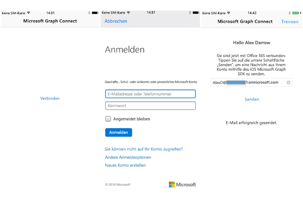

# <a name="get-started-with-microsoft-graph-in-a-swift-ios-app"></a>Erste Schritte mit Microsoft Graph in einer Swift iOS-App

> **Sie erstellen Apps für Unternehmenskunden?** Ihre App funktioniert möglicherweise nicht, wenn Ihr Unternehmenskunde Enterprise Mobility-Sicherheitsfunktionen wie <a href="https://azure.microsoft.com/en-us/documentation/articles/active-directory-conditional-access-device-policies/" target="_newtab">bedingten Gerätezugriff</a> aktiviert. In diesem Fall treten bei Ihren Kunden möglicherweise Fehler auf. 

> Zur Unterstützung **aller Unternehmenskunden** über **alle Unternehmensszenarien** hinweg müssen Sie den Azure AD-Endpunkt verwenden und Ihr Apps mithilfe des [Azure-Verwaltungsportals](https://aka.ms/aadapplist) verwalten. Weitere Informationen finden Sie in dem Artikel zum Thema [Entscheidung zwischen dem Azure AD- und dem Azure AD v2.0-Endpunkt](../concepts/auth_overview.md#deciding-between-the-azure-ad-and-azure-ad-v20-endpoints).

Dieser Artikel beschreibt die erforderlichen Aufgaben zum Abrufen eines Zugriffstokens vom [Azure AD v2.0-Endpunkt](https://developer.microsoft.com/en-us/graph/docs/concepts/converged_auth) und zum Aufrufen von Microsoft Graph. Er führt Sie durch den Code im [Office 365 Connect-Beispiel für iOS (SDK)](https://github.com/microsoftgraph/ios-swift-connect-sample) und erläutert die wichtigsten Konzepte, die in einer App implementiert werden müssen, die Microsoft Graph verwendet. In diesem Artikel wird auch beschrieben, wie Sie mithilfe des [Microsoft Graph SDK für iOS](https://github.com/microsoftgraph/msgraph-sdk-ios) auf Microsoft Graph zugreifen.

Sie können die Version der App, die Sie erstellen, aus diesem GitHub Repository herunterladen:

* [Office 365 Connect-Beispiel für iOS unter Verwendung des Microsoft Graph-SDKs](https://github.com/microsoftgraph/ios-objectivec-connect-sample)

In der folgenden Abbildung ist die App dargestellt, die Sie erstellen.




Der Workflow beinhaltet das Herstellen einer Verbindung zu Microsoft Graph sowie die Authentifizierung, das Anmelden mit Ihrem Büro- oder persönlichen Konto und schließlich das Senden einer E-Mail an einen Empfänger.

**Sie möchten keine App erstellen?** Verwenden Sie für einen schnellen Einstieg den [Schnellstart Microsoft Graph](https://graph.microsoft.io/en-us/getting-started).

## <a name="prerequisites"></a>Voraussetzungen

Für die ersten Schritte benötigen Sie: 

* [Xcode](https://developer.apple.com/xcode/downloads/) von Apple
* Installation von [CocoaPods](https://guides.cocoapods.org/using/using-cocoapods.html) als ein Abhängigkeits-Manager.
* Ein [Microsoft-Konto](https://www.outlook.com/) oder ein [Geschäfts- oder Schulkonto](http://dev.office.com/devprogram).
* Das [Microsoft Graph Startprojekt für iOS](https://github.com/microsoftgraph/ios-objectivec-connect-sample). Diese Vorlage enthält Klassen, denen Sie Code hinzufügen müssen. Sie rufen dieses Projekt ab, indem Sie das Beispielprojekt von diesem Speicherort aus klonen oder herunterladen. Dann arbeiten Sie mit dem Arbeitsbereich innerhalb des Ordners **Startprojekt** (**ios-objectivec-connect-sample.xcworkspace**).

## <a name="register-the-app"></a>Registrieren der App
 
1. Melden Sie sich beim [App-Registrierungsportal](https://apps.dev.microsoft.com/) entweder mit Ihrem persönlichen oder geschäftlichen Konto oder mit Ihrem Schulkonto an.
2. Klicken Sie auf **App hinzufügen**.
3. Geben Sie einen Namen für die App ein, und wählen Sie **Anwendung erstellen** aus.
    
    Die Registrierungsseite wird angezeigt, und die Eigenschaften der App werden aufgeführt.
 
4. Wählen Sie unter **Plattformen** die Option **Plattform hinzufügen** aus.
5. Wählen Sie **Systemeigene Plattform**.
6. Kopieren Sie die Client-ID in die Zwischenablage. Sie müssen diesen Wert in die Beispiel-App eingeben.

    Die App-ID ist ein eindeutiger Bezeichner für Ihre App. 

7. Klicken Sie auf **Speichern**.

## <a name="importing-the-project-dependencies"></a>Importieren der Projekt-Abhängigkeiten

1. Klonen Sie dieses Repository, [Office 365 Connect-Beispiel für iOS unter Verwendung des Microsoft Graph-SDKs](https://github.com/microsoftgraph/ios-objectivec-connect-sample). 
>WICHTIG: Verwenden Sie das Beispiel im Startprojekt-Ordner und nicht im Beispiel auf der Stammebene des Projekts.

2. Verwenden Sie CocoaPods, um das Microsoft Graph-SDK und Authentifizierungsabhängigkeiten zu importieren: Diese Beispiel-App enthält bereits eine POD-Datei, die die Pods in das Projekt überträgt. Navigieren Sie zu dem Ordner **Startprojekt** in der **Terminal** -App und führen Sie von **Terminal** folgenden Befehl aus:

        pod install

   Sie erhalten eine Bestätigung, dass die Pods in das Projekt importiert wurden. Weitere Informationen finden Sie unter [CocoaPods](https://guides.cocoapods.org/using/using-cocoapods.html)


## <a name="enable-keychain-sharing"></a>Aktivieren der Schlüsselbundfreigabe
 
Für Xcode 8 müssen Sie die Schlüsselbundgruppe hinzufügen, sonst kann Ihre App nicht auf den Schlüsselbund zugreifen. So fügen Sie die Schlüsselbundgruppe hinzu:
 
1. Wählen Sie im Projekt-Manager-Bereich in Xcode das Projekt aus. (⌘ + 1).
 
2. Wählen Sie **iOS-ObjectiveC-Connect-Sample**.
 
3. Aktivieren Sie auf der Registerkarte „Funktionen“ die Option **Schlüsselbundfreigabe**.
 
4. Fügen Sie **com.microsoft.ios-objectivec-connect-sample** zu den Schlüsselbundgruppen hinzu.

## <a name="authenticating-with-microsoft-graph"></a>Authentifizieren mit Microsoft Graph

Für den Zugriff auf den Benutzeroberflächenworkflow muss die App den Benutzer authentifizieren, sodass dieser dann eine E-Mail an einen bestimmten Benutzer senden kann. Für Anforderungen beim Microsoft Graph-Dienst muss ein Authentifizierungsanbieter bereitgestellt werden, der HTTPS-Anforderungen mit einem entsprechenden OAuth 2.0-Bearertoken authentifizieren kann. Im Beispielprojekt liegt eine Authentifizierungsstruktur mit der Bezeichnung **Authentication.swift.** bereits als Stub vor. Wir fügen eine Funktion zum Anfordern und Erwerben eines Zugriffstokens für den Aufruf der Microsoft Graph-API hinzu. 

1. Öffnen Sie den Xcode-Projektarbeitsbereich (**Graph-iOS-Swift-Connect.xcworkspace**) und öffnen Sie die Struktur- Erweiterungsdatei **Authentication.swift**. Suchen Sie den folgenden Code in dieser Erweiterung.


  ```swift
     /**
     Authenticates to Microsoft Graph. 
     If a user has previously signed in before and not disconnected, silent log in
     will take place. 
     If not, authentication will ask for credentials
     */
    func connectToGraph(withClientId clientId: String,
                                     scopes: [String],
                                     completion:@escaping (_ error: MSGraphError?) -> Void) {
    
        // Set client ID
        NXOAuth2AuthenticationProvider.setClientId(clientId, scopes: scopes)
        
        // Try silent log in. This will attempt to sign in if there is a previous successful
        // sign in user information.
        if NXOAuth2AuthenticationProvider.sharedAuth().loginSilent() == true {
            completion(nil)
        }
        // Otherwise, present log in controller.
        else {
            NXOAuth2AuthenticationProvider.sharedAuth()
                .login(with: nil) { (error: Error?) in
                    
                    if let nserror = error {
                        completion(MSGraphError.nsErrorType(error: nserror as NSError))
                    }
                    else {
                        completion(nil)
                    }
            }
        }
    }
  ```


2. Wir rufen diese Methode aus **ConnectViewController.swift**  heraus auf. Dieser Controller ist die Standardansicht, die die App lädt, und es gibt eine einzelne Schaltfläche mit dem Namen **Verbinden**, die der Benutzer antippt, um den Authentifizierungsprozess zu initiieren. Diese Methode akzeptiert einen einzigen Parameter, die **Bereiche**, die unten näher erläutert werden. Fügen Sie die folgende Aktion zu **ConnectViewController.swift** hinzu.

  ```swift
  // MARK: Authentication
  private extension ConnectViewController {
    func authenticate() {
        loadingUI(show: true)
        
        let clientId = ApplicationConstants.clientId
        let scopes = ApplicationConstants.scopes
        
        authentication.connectToGraph(withClientId: clientId, scopes: scopes) {
            (error) in
            
            defer {self.loadingUI(show: false)}
            
            if let graphError = error {
                switch graphError {
                case .nsErrorType(let nsError):
                    print(NSLocalizedString("ERROR", comment: ""), nsError.localizedDescription)
                    self.showError(message: NSLocalizedString("CHECK_LOG_ERROR", comment: ""))
                }
            }
            else {
                self.performSegue(withIdentifier: "showSendMail", sender: nil)
            }
        }
    }
  }

  ```

## <a name="send-an-email-with-microsoft-graph"></a>Senden einer E-Mail mit Microsoft Graph

Nachdem das Projekts für die Authentifizierung konfiguriert wurde, werden in den nächsten Schritten die authentifizierte E-Mail-Adresse, der Anzeigename und das Profilfoto des Benutzers abgerufen. Nachdem das Beispiel diese Werte erhalten hat, lädt es das Profilbild in OneDrive und ruft die Freigabe-Url des Bildes ab. Schließlich wird mithilfe der Microsoft Graph-API eine E-Mail an einen Benutzer gesendet. 

Standardmäßig ist der angemeldete Benutzer der Empfänger, aber Sie haben die Möglichkeit, einen beliebigen anderen Empfänger anzugeben. Der Code, den wir hier verwenden, gehört zur Klasse **SendMailViewController.swift.** Sie werden sehen, dass es hier noch anderen Code für die Benutzeroberfläche und eine Hilfsmethode zum Abrufen von Benutzerprofildaten aus dem Microsoft Graph-Dienst gibt. Wir werden uns auf die Methoden zum Erstellen einer E-Mail-Nachricht und das Senden dieser Nachricht konzentrieren.

1. Öffnen Sie **SendMailViewController.swift.**  Suchen Sie den E-Mail-Textkörper für die Erstellung der Hilfsmethode in der Klasse:

  ```swift
    /**
     Creates sample email message
     
     - parameter emailAddress: recipient email address
     
     - returns: MSGraphMessage object with given recipient. The body is created from EmailBody.html
     */
    func createSampleMessage(to emailAddress: String, picLink pictureUrl: String) -> MSGraphMessage? {
        let message = MSGraphMessage()
        
        // set recipients
        
        let _ = self.userPicture
        let toRecipient = MSGraphRecipient()
        let msEmailAddress = MSGraphEmailAddress()
        msEmailAddress.address = emailAddress
        toRecipient.emailAddress = msEmailAddress
        let toRecipientList = [toRecipient]
        message.toRecipients = toRecipientList
        message.subject = NSLocalizedString("MAIL_SUBJECT", comment: "")
        let messageBody = MSGraphItemBody()
        messageBody.contentType = MSGraphBodyType.html()
        guard let emailBodyFilePath = Bundle.main.path(forResource: "EmailBody", ofType: "html") else {return nil}
        messageBody.content = try! String(contentsOfFile: emailBodyFilePath, encoding: String.Encoding.utf8)
        messageBody.content = messageBody.content.replacingOccurrences(of: "a href=%s", with: ("a href=" + pictureUrl))
        message.body = messageBody

        if let unwrappedImage = self.userPicture {
            let fileAttachment = MSGraphFileAttachment()
            let data = UIImageJPEGRepresentation(unwrappedImage, 1.0)
            fileAttachment.contentType = "image/png"
            fileAttachment.oDataType = "#microsoft.graph.fileAttachment"
            fileAttachment.contentBytes = data?.base64EncodedString()
            fileAttachment.name = "me.png"
            message.attachments.append(fileAttachment)
        }
        return message
    }

  ```
2. Suchen Sie die folgende Hilfsmethoden, um Benutzerinformationen und ein Profilfoto abzurufen und das Foto auf OneDrive hochzuladen:

  ```swift
      /**
     Fetches user information such as mail and display name
     */
    func getUserInfo() {
        self.sendButton.isEnabled = false
        self.statusTextView.text = NSLocalizedString("LOADING_USER_INFO", comment: "")
        
        self.graphClient.me().request().getWithCompletion {
            (user: MSGraphUser?, error: Error?) in
            if let graphError = error {
                print(NSLocalizedString("ERROR", comment: ""), graphError)
                DispatchQueue.main.async(execute: {
                    self.statusTextView.text = NSLocalizedString("GRAPH_ERROR", comment: "")
                })
            }
            else {
                guard let userInfo = user else {
                    DispatchQueue.main.async(execute: {
                        self.statusTextView.text = NSLocalizedString("USER_INFO_LOAD_FAILURE", comment: "")
                    })
                    return
                }
                DispatchQueue.main.async(execute: {
                    self.emailTextField.text = userInfo.mail
                    
                    if let displayName = userInfo.displayName {
                        self.headerLabel.text = "Hi " + displayName
                    }
                    else {
                        self.headerLabel.text = NSString(format: NSLocalizedString("HI_USER", comment: "") as NSString, "") as String
                    }
                    
                    self.statusTextView.text = NSLocalizedString("USER_INFO_LOAD_SUCCESS", comment: "")
                    self.sendButton.isEnabled = true
                })
            }
        }
    }
    
    /**
     Uploads the user's profile picture (obtained via the Graph API) to the user's OneDrive drive. The OneDrive sharing url is
     returned in the completion handler.
    */
    func uploadPictureToOneDrive(uploadFile image: UIImage?, with completion: @escaping (_ result: GraphResult<String, NSError>) ->Void) {
        
        var webUrl: String = ""
        guard let unwrappedImage = image else {
            return
        }
        let data = UIImageJPEGRepresentation(unwrappedImage, 1.0)
        self.graphClient
            .me()
            .drive()
            .root()
            .children()
            .driveItem("me.png")
            .contentRequest()
            .upload(from: data, completion: {
                (driveItem: MSGraphDriveItem?, error: Error?) in
                if let nsError = error {
                    print(NSLocalizedString("ERROR", comment: ""), nsError.localizedDescription)
                    DispatchQueue.main.async(execute: {
                        self.statusTextView.text = NSLocalizedString("UPLOAD_PICTURE_FAILURE", comment: nsError.localizedDescription)
                    })
                    return

                } else {
                    webUrl = (driveItem?.webUrl)!
                    completion(.success(webUrl))
                }
            })
    }


    /**
     Gets the user's profile picture. Returns the picture as a UIImage via completion handler
    */
    func getUserPicture(forUser upn: String, with completion: @escaping (_ result: GraphResult<UIImage, NSError>) -> Void) {
        
        //Asynchronous Graph call. Closure is invoked after getUserPicture completes. Requires @escaping attribute
        self.graphClient.me().photoValue().download {
            (url: URL?, response: URLResponse?, error: Error?) in
            
                if let nsError = error {
                    print(NSLocalizedString("ERROR", comment: ""), nsError.localizedDescription)
                    DispatchQueue.main.async(execute: {
                        self.statusTextView.text = NSLocalizedString("GET_PICTURE_FAILURE", comment: nsError.localizedDescription)
                    })
                    return
                }
                guard let picUrl = url else {
                    DispatchQueue.main.async(execute: {
                        self.statusTextView.text = NSLocalizedString("GET_PICTURE_FAILURE", comment: "User profile picture is nil")
                    })
                    return
                }
                print(picUrl)
            
                let picData = NSData(contentsOf: picUrl)
                let picImage = UIImage(data: picData! as Data)
            
                if let validPic = picImage {
                    completion(.success(validPic))
                }
                else {
                    DispatchQueue.main.async(execute: {
                        self.statusTextView.text = NSLocalizedString("GET_PICTURE_FAILURE", comment: "Picture data is invalid")
                    })
                }
            }
    }

  ```

3. Suchen Sie die folgende Methode zum Versenden einer E-Mail-Nachricht in der Klasse.  

  ```swift
    @IBAction func sendMail(_ sender: AnyObject) {
        guard let toEmail = self.emailTextField.text else {return}
        guard let picUrl = self.userPictureUrl else {return}
        if let message = self.createSampleMessage(to: toEmail, picLink: picUrl) {
            
            let requestBuilder = graphClient.me().sendMail(with: message, saveToSentItems: false)
            let mailRequest = requestBuilder?.request()
            
            _ = mailRequest?.execute(completion: {
                (response: [AnyHashable: Any]?, error: Error?) in
                if let nsError = error {
                    print(NSLocalizedString("ERROR", comment: ""), nsError.localizedDescription)
                    DispatchQueue.main.async(execute: {
                        self.statusTextView.text = NSLocalizedString("SEND_FAILURE", comment: "")
                    })
                }
                else {
                    DispatchQueue.main.async(execute: {
                        self.descriptionLabel.text = "Check your inbox. You have a new message :)"
                        self.statusTextView.text = NSLocalizedString("SEND_SUCCESS", comment: "")
                    })
                }
            })
        }
    }

  ```


## <a name="run-the-app"></a>Ausführen der App
1. Vor dem Ausführen des Beispiels müssen Sie die Client-ID angeben, die Sie bei dem Registrierungsvorgang im Abschnitt **Registrieren der App** erhalten haben. Öffnen Sie **ApplicationConstants.swift**. Sie werden sehen, dass die ClientID aus dem Registrierungsprozess am Anfang der Datei hinzugefügt werden kann:  

  ```swift
struct ApplicationConstants {
    static let clientId = "Enter_Client_Id_Here"
    static let scopes   = ["openid", "profile", "Mail.ReadWrite","mail.send","Files.ReadWrite","User.ReadBasic.All"]
}


  ```

> Hinweis: Sie sehen, dass die folgenden Berechtigungsbereiche für dieses Projekt konfiguriert wurden: **"https://graph.microsoft.com/Mail.Send", "https://graph.microsoft.com/User.Read", "Offline_access"**. Die in diesem Projekt verwendeten Dienstaufrufe, also das Senden einer E-Mail an Ihr E-Mail-Konto und das Abrufen einiger Profilinformationen (Anzeigename, E-Mail-Adresse), benötigen diese Berechtigungen, damit die App ordnungsgemäß ausgeführt wird.

2. Führen Sie das Beispiel aus, tippen Sie auf **Verbinden**, melden Sie sich mit Ihrem persönlichen Konto oder mit Ihrem Geschäfts- oder Schulkonto an und gewähren Sie die erforderlichen Berechtigungen.

3. Klicken Sie auf die Schaltfläche **E-Mail senden**.
 Nachdem die E-Mail gesendet wurde, wird unter der Schaltfläche eine Erfolgsmeldung angezeigt.

## <a name="next-steps"></a>Nächste Schritte
- Testen Sie die REST-API mithilfe des [Graph-Explorers](https://graph.microsoft.io/graph-explorer).
- Beispiele allgemeiner Vorgänge sowohl für REST- als auch für SDK-Operationen finden Sie in dem Beispiel [Microsoft Graph iOS Objective C Code Snippets](https://github.com/microsoftgraph/ios-objectiveC-snippets-sample).

## <a name="see-also"></a>Siehe auch
- [Azure AD v2.0-Protokolle](https://azure.microsoft.com/en-us/documentation/articles/active-directory-v2-protocols/)
- [Azure AD v2.0-Tokens](https://azure.microsoft.com/en-us/documentation/articles/active-directory-v2-tokens/)
