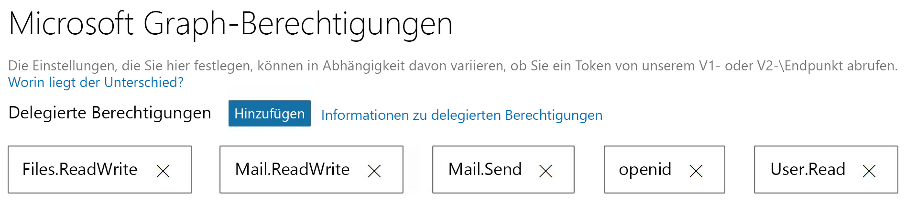

# <a name="get-started-with-microsoft-graph-in-a-java-app"></a><span data-ttu-id="45245-101">Erste Schritte mit Microsoft Graph in einer Java-App</span><span class="sxs-lookup"><span data-stu-id="45245-101">Get started with Microsoft Graph in a PHP app</span></span>

<span data-ttu-id="45245-102">In diesem Artikel wird das [console-java-connect-sample](https://github.com/microsoftgraph/console-java-connect-sample) verwendet, um Sie durch das Senden von E-Mails über Microsoft Graph von einer Java-Konsolenanwendung aus zu führen.</span><span class="sxs-lookup"><span data-stu-id="45245-102">This article uses the [console-java-connect-sample](https://github.com/microsoftgraph/console-java-connect-sample) to walk through sending mail via Microsoft Graph from a Java console application.</span></span> <span data-ttu-id="45245-103">In dem Artikel wird der Code veranschaulicht, den Sie zu Ihrer Java-App hinzufügen müssen, damit Sie die Microsoft Graph-API verwenden können.</span><span class="sxs-lookup"><span data-stu-id="45245-103">The article shows you the code that you need to add to your Java app so that you can use the Microsoft Graph API.</span></span> <span data-ttu-id="45245-104">Die App greift mithilfe des [Microsoft Graph-SDKs für Java](https://github.com/microsoftgraph/msgraph-sdk-java) auf Microsoft Graph zu.</span><span class="sxs-lookup"><span data-stu-id="45245-104">The app accesses Microsoft Graph by using the [Microsoft Graph SDK for Java](https://github.com/microsoftgraph/msgraph-sdk-java).</span></span>

## <a name="choose-an-authentication-library"></a><span data-ttu-id="45245-105">Auswählen einer Authentifizierungsbibliothek</span><span class="sxs-lookup"><span data-stu-id="45245-105">Choosing an authentication library</span></span>

<span data-ttu-id="45245-106">In Microsoft Graph wurden die Standards OAuth 2.0 and Open ID Connect eingeführt, mit denen Sie eine Auswahl aus vielen verfügbaren OAuth2-Java-Bibliotheken (Open Source) treffen können.</span><span class="sxs-lookup"><span data-stu-id="45245-106">Microsoft Graph adopted the OAuth 2.0 and Open ID Connect standards, which lets you choose from many available open source OAuth 2 Java libraries.</span></span> <span data-ttu-id="45245-107">Das Azure AD-Team empfiehlt die Verwendung von [ScribeJava](https://github.com/scribejava/scribejava), eine einfache OAuth2-Bibliothek für Java.</span><span class="sxs-lookup"><span data-stu-id="45245-107">The Azure AD team recommends using [ScribeJava](https://github.com/scribejava/scribejava), a simple OAuth2 library for Java.</span></span>

<span data-ttu-id="45245-108">Das Beispiel implementiert den Fluss zum Erteilen eines Autorisierungscodes, was die richtige Wahl für ein Clientauthentifizierungsszenario, einen Benutzer und einen OAuth2-fähigen Endpunkt ist.</span><span class="sxs-lookup"><span data-stu-id="45245-108">The sample implements the Authorization Code Grant flow which is the right choice for a client authorization scenario, a user, and an OAuth 2-enabled endpoint.</span></span> <span data-ttu-id="45245-109">In Server-zu-Server-Java-Anwendungen in der Produktion wird der Fluss zu Autorisierung von Clientanmeldeinformationen verwendet.</span><span class="sxs-lookup"><span data-stu-id="45245-109">In production server-to-server Java applications, the Client Credentials authorization flow is used.</span></span> <span data-ttu-id="45245-110">**ScribeJava** verarbeitet beide Autorisierungsflüsse.</span><span class="sxs-lookup"><span data-stu-id="45245-110">**ScribeJava** handles both of these authorization flows.</span></span> <span data-ttu-id="45245-111">Damit dieses Beispiel einfach registriert, authentifiziert und ausgeführt werden kann, wird der einfachste Fluss veranschaulicht.</span><span class="sxs-lookup"><span data-stu-id="45245-111">To make this sample easy to register, authenticate, and run, we demonstrate the simplest flow.</span></span>

<span data-ttu-id="45245-112">Bevor Ihre App Aufrufe von Microsoft Graph tätigen kann, muss die App ein Zugriffstoken aus Azure Active Directory (Azure AD) abrufen.</span><span class="sxs-lookup"><span data-stu-id="45245-112">Before your app can make calls on Microsoft Graph, the app must get an access token from Azure Active Directory (Azure AD).</span></span> <span data-ttu-id="45245-113">Dieses Token muss bei jedem Aufruf von Microsoft Graph in einem HTTP-Authentifizierungsheader vorhanden sein.</span><span class="sxs-lookup"><span data-stu-id="45245-113">This token must be present in an HTTP authentication header with each call to Microsoft Graph.</span></span> <span data-ttu-id="45245-114">Das **Microsoft Graph-SDK** übernimmt das Einfügen des Headers und das Hinzufügen des Tokens für jeden Aufruf, wenn Sie [IAuthenticationProvider](https://github.com/microsoftgraph/msgraph-sdk-java/blob/dev/src/main/java/com/microsoft/graph/authentication/IAuthenticationProvider.java) implementieren.</span><span class="sxs-lookup"><span data-stu-id="45245-114">The **Microsoft Graph SDK** takes care of inserting the header and adding the token for each call when you implement [IAuthenticationProvider](https://github.com/microsoftgraph/msgraph-sdk-java/blob/dev/src/main/java/com/microsoft/graph/authentication/IAuthenticationProvider.java).</span></span> <span data-ttu-id="45245-115">**ScribeJava** verarbeitet die Authentifizierung und das Abrufen eines Zugriffstokens.</span><span class="sxs-lookup"><span data-stu-id="45245-115">**ScribeJava** handles authentication and getting an access token.</span></span> <span data-ttu-id="45245-116">Ihre App stellt das Zugriffstoken für das Microsoft Graph-SDK über die **IAuthenticationProvider**-Schnittstelle bereit.</span><span class="sxs-lookup"><span data-stu-id="45245-116">Your app provides the access token to the Microsoft Graph SDK via the **IAuthenticationProvider** interface.</span></span>

## <a name="install-and-run-the-sample"></a><span data-ttu-id="45245-117">Installieren und Ausführen des Beispiels</span><span class="sxs-lookup"><span data-stu-id="45245-117">Install and run the solution</span></span>

<span data-ttu-id="45245-118">Anweisungen zum Installieren und Konfigurieren der Beispiel-App finden Sie in der [Infodatei](https://github.com/microsoftgraph/console-java-connect-sample/blob/master/README.md) im **console-java-connect-sample**-Repository auf GitHub.</span><span class="sxs-lookup"><span data-stu-id="45245-118">To install and configure the sample app, follow the instructions in the [README](https://github.com/microsoftgraph/console-java-connect-sample/blob/master/README.md) document in the **console-java-connect-sample** repository on GitHub.</span></span> <span data-ttu-id="45245-119">Sie können das Beispiel klonen und den Code in Ihrer bevorzugten Java-IDE mithilfe des folgenden Befehls zum Klonen des Repositorys durchlaufen:</span><span class="sxs-lookup"><span data-stu-id="45245-119">You can clone the sample and walk through the code in your favorite Java IDE by using this command to clone the repository:</span></span>

```
git@github.com:microsoftgraph/console-java-connect-sample.git
```

<span data-ttu-id="45245-120">Wenn Sie [Java Connect-Konsolen-App registrieren](https://github.com/microsoftgraph/console-java-connect-sample/blob/master/README.md#register-your-app), weisen Sie dem Beispiel delegierte Bereiche (Berechtigungen) zu.</span><span class="sxs-lookup"><span data-stu-id="45245-120">When you [register the Console Java Connect app](https://github.com/microsoftgraph/console-java-connect-sample/blob/master/README.md#register-your-app), assign delegated scopes (permissions) to the sample.</span></span> <span data-ttu-id="45245-121">Achten Sie dabei auf Bereiche wie in der folgenden Abbildung dargestellt:</span><span class="sxs-lookup"><span data-stu-id="45245-121">Be sure to scopes as shown in the following image:</span></span>



<span data-ttu-id="45245-123">Nachdem Sie die Anwendung registriert und [das Beispiel](https://github.com/microsoftgraph/console-java-connect-sample/blob/master/README.md#configure-your-app) für die **Anwendungs-ID konfiguriert** haben, die Sie von der Anwendungsregistrierung erhalten, können Sie das Beispiel ausführen.</span><span class="sxs-lookup"><span data-stu-id="45245-123">After you register the application and [configure the sample](https://github.com/microsoftgraph/console-java-connect-sample/blob/master/README.md#configure-your-app) for the **Application Id** you get from the application registration, you can build and run the sample.</span></span>

## <a name="console-java-connect-code"></a><span data-ttu-id="45245-124">Code für Console-Java-Connect</span><span class="sxs-lookup"><span data-stu-id="45245-124">Console-Java-Connect code</span></span> 

<span data-ttu-id="45245-125">Bevor Sie sich den logischen Fluss des Beispiels ansehen, sollten Sie sich einige Minuten Zeit nehmen, um mehr über die [Struktur des Beispielprojekts](#sample-project-structure) zu erfahren.</span><span class="sxs-lookup"><span data-stu-id="45245-125">Before you look at the sample logic flow, take a few minutes to learn about the [sample project's structure](#sample-project-structure).</span></span> <span data-ttu-id="45245-126">Wenn Sie fertig sind, können Sie sich die Logik in dem Beispiel näher ansehen:</span><span class="sxs-lookup"><span data-stu-id="45245-126">When you're ready, lets step through the logic in the sample:</span></span>


   
### <a name="walk-through-the-code"></a><span data-ttu-id="45245-127">Durchlaufen des Codes</span><span class="sxs-lookup"><span data-stu-id="45245-127">Walk through the code</span></span>
<span data-ttu-id="45245-128">Wir werden uns den Beispielcode auf einer allgemeinen Ebene ansehen und dann die Details des Erstellens und Sendens einer E-Mail näher betrachten.</span><span class="sxs-lookup"><span data-stu-id="45245-128">We'll look at the sample code at a high level and then dive into the details of creating an email message and sending it.</span></span>

#### <a name="the-user-experience"></a><span data-ttu-id="45245-129">Die Benutzererfahrung</span><span class="sxs-lookup"><span data-stu-id="45245-129">The user experience</span></span>

<span data-ttu-id="45245-130">In diesem Abschnitt wird ein Blick auf die Logik geworfen, die die Anwendung startet und Ihnen dann die Beispielausgabe anzeigt, die dem Benutzer angezeigt wird, wenn er das Beispiel ausführt.</span><span class="sxs-lookup"><span data-stu-id="45245-130">This section takes a look at the logic that starts up the application and then shows you the sample output that the user sees when they run the sample.</span></span>

<span data-ttu-id="45245-131">Die statische Methode [PublicClient](https://github.com/microsoftgraph/console-java-connect-sample/blob/master/src/main/java/com/microsoft/graphsample/PublicClient.java) **main** erstellt eine Instanz von **PublicClient** und startet dann den Anmelde- und Authentifizierungsprozess.</span><span class="sxs-lookup"><span data-stu-id="45245-131">The [PublicClient](https://github.com/microsoftgraph/console-java-connect-sample/blob/master/src/main/java/com/microsoft/graphsample/PublicClient.java) **main** static method creates an instance of **PublicClient** and then kicks off the sign in and authentication process.</span></span>  

<span data-ttu-id="45245-132">[AuthenticationManager](https://github.com/microsoftgraph/console-java-connect-sample/blob/master/src/main/java/com/microsoft/graphsample/connect/AuthenticationManager) stellt eine einzelne Instanz bereit, die verwendet wird, um den Benutzer mit Microsoft Graph zu verbinden.</span><span class="sxs-lookup"><span data-stu-id="45245-132">[AuthenticationManager](https://github.com/microsoftgraph/console-java-connect-sample/blob/master/src/main/java/com/microsoft/graphsample/connect/AuthenticationManager) provides a singleton instance which is used to connect the user to Microsoft Graph.</span></span> <span data-ttu-id="45245-133">**AuthenticationManager** macht ein **Zugriffstoken** als Zeichenfolgeneigenschaft verfügbar.</span><span class="sxs-lookup"><span data-stu-id="45245-133">**AuthenticationManager** exposes an **access token** as a string property.</span></span> <span data-ttu-id="45245-134">Das Zugriffstoken wird von **Azure AD** zurückgegeben, wenn der Benutzer authentifiziert ist, und gibt der Beispielberechtigung Zugriff auf angeforderte Microsoft Graph-Ressourcen.</span><span class="sxs-lookup"><span data-stu-id="45245-134">The access token is returned by **Azure AD** when the user is authenticated and gives the sample permission to access requested Microsoft Graph resources.</span></span> 

<span data-ttu-id="45245-135">Die **PublicClient.startSendMail**-Methode führt die folgenden Schritte aus:</span><span class="sxs-lookup"><span data-stu-id="45245-135">The **PublicClient.startSendMail** method performs the following steps:</span></span>

- <span data-ttu-id="45245-136">Erstellt eine neue Instanz der [GraphSendMail](https://github.com/microsoftgraph/console-java-connect-sample/blob/master/src/main/java/com/microsoft/graphsample/msgraph/GraphSendMail.java)-Klasse.</span><span class="sxs-lookup"><span data-stu-id="45245-136">Creates a new instance of the  [InputComponentSubmission](https://github.com/microsoftgraph/console-java-connect-sample/blob/master/src/main/java/com/microsoft/graphsample/msgraph/GraphSendMail.java) class.</span></span> 
- <span data-ttu-id="45245-137">Ruft **GraphSendMail.getMeUser()** auf, um das **Azure AD**-Profil des aktuellen Benutzers zurückzugeben, damit das Beispielkonsolenobjekt die Aufforderungen personalisieren kann, die für den Benutzer angezeigt werden.</span><span class="sxs-lookup"><span data-stu-id="45245-137">Calls **GraphSendMail.getMeUser()** to return the **Azure AD** profile of the current user so that the sample console object can personalize the prompts that it displays to the user.</span></span> 
- <span data-ttu-id="45245-138">In der Konsole wird Folgendes angezeigt:</span><span class="sxs-lookup"><span data-stu-id="45245-138">The console displays:</span></span>

   `Hello, Laura Steele. Would you like to send an email to yourself or someone else?`

   `Enter the address to which you'd like to send a message. If you enter nothing, the message will go to your address`

- <span data-ttu-id="45245-139">Ruft die **GraphSendMail.sendMail**-Methode auf, die die Benutzereingabe verwendet.</span><span class="sxs-lookup"><span data-stu-id="45245-139">Calls the **GraphSendMail.sendMail** method which takes the user's input.</span></span> <span data-ttu-id="45245-140">Wenn eine E-Mail-Adresse bereitgestellt wird, sendet **sendMail** eine Nachricht an diese Adresse.</span><span class="sxs-lookup"><span data-stu-id="45245-140">If an email address is provided, **sendMail** sends a message to that address.</span></span> <span data-ttu-id="45245-141">Andernfalls wird die Nachricht an den aktuellen Benutzer gesendet.</span><span class="sxs-lookup"><span data-stu-id="45245-141">Otherwise, the message is sent to the current user.</span></span> 

- <span data-ttu-id="45245-142">Fordert den Benutzer auf, eine weitere E-Mail zu senden oder die Konsolen-App zu schließen.</span><span class="sxs-lookup"><span data-stu-id="45245-142">Prompts the user to send another email or quit the console app.</span></span>

   `Email sent!`

   `Want to send another message? Type 'y' for yes and any other key to exit.`

#### <a name="the-send-mail-logic"></a><span data-ttu-id="45245-143">Die Logik zum Senden von E-Mails</span><span class="sxs-lookup"><span data-stu-id="45245-143">The send mail logic</span></span>

<span data-ttu-id="45245-144">Die Logik zum Senden von E-Mails besteht aus den folgenden Schritten:</span><span class="sxs-lookup"><span data-stu-id="45245-144">The mail sending logic takes the following steps:</span></span>


1. <span data-ttu-id="45245-145">**Abrufen des Profilbilds**:</span><span class="sxs-lookup"><span data-stu-id="45245-145">**Get profile picture**:</span></span><br/> <span data-ttu-id="45245-146">Ruft **GraphServiceController.getUserProfilePicture()** auf, um ein Array von Bytes abzurufen, das das Profilbild des **Azure AD**-Benutzers darstellt, der sich bei dem Beispiel angemeldet hat.</span><span class="sxs-lookup"><span data-stu-id="45245-146">Calls **GraphServiceController.getUserProfilePicture()** to get an array of bytes representing the profile picture of the **Azure AD** user who signed into the sample.</span></span>

   <span data-ttu-id="45245-147">**Der API-Aufruf**</span><span class="sxs-lookup"><span data-stu-id="45245-147">**The API call**</span></span>

```java
            photoStream = mGraphServiceClient
                    .me()
                    .photo()
                    .content()
                    .buildRequest()
                    .get();

```
2. <span data-ttu-id="45245-148">**Hochladen des Bilds in OneDrive**:</span><span class="sxs-lookup"><span data-stu-id="45245-148">**Upload picture to OneDrive**:</span></span>
<br/><span data-ttu-id="45245-149">Ruft **GraphServiceController.uploadPictureToOneDrive(bytes)** auf, um das Profilbild im OneDrive-Stammordner des Benutzers zu veröffentlichen.</span><span class="sxs-lookup"><span data-stu-id="45245-149">Calls **GraphServiceController.uploadPictureToOneDrive(bytes)** to POST the profile picture in the user's OneDrive root folder.</span></span> <span data-ttu-id="45245-150">Ein **DriveItem**-Objekt des Microsoft Graph-SDKs wird zurückgegeben.</span><span class="sxs-lookup"><span data-stu-id="45245-150">A Microsoft Graph SDK **DriveItem** object is returned.</span></span> 

   <span data-ttu-id="45245-151">**Der API-Aufruf**</span><span class="sxs-lookup"><span data-stu-id="45245-151">**The API call**</span></span>
```java
            driveItem = mGraphServiceClient
                    .me()
                    .drive()
                    .root()
                    .itemWithPath("me2.png")
                    .content()
                    .buildRequest()
                    .put(picture);

```
3. <span data-ttu-id="45245-152">**Abrufen des OneDrive-Freigabelinks für das Bild**:</span><span class="sxs-lookup"><span data-stu-id="45245-152">**Get the OneDrive sharing link for the picture**:</span></span><br/><span data-ttu-id="45245-153">Ruft **GraphServiceController.getPermissionSharingLink** auf, um einen neuen Freigabelink zu erstellen.</span><span class="sxs-lookup"><span data-stu-id="45245-153">Calls **GraphServiceController.getPermissionSharingLink** to create a new sharing link.</span></span> <span data-ttu-id="45245-154">Ein **Permission**-Objekt des Microsoft Graph-SDKs wird zurückgegeben.</span><span class="sxs-lookup"><span data-stu-id="45245-154">A Microsoft Graph SDK **Permission** object is returned.</span></span>

   <span data-ttu-id="45245-155">**Der API-Aufruf**</span><span class="sxs-lookup"><span data-stu-id="45245-155">**The API call**</span></span>
```java
            permission = mGraphServiceClient
                    .me()
                    .drive()
                    .items(id)
                    .createLink("view", "organization")
                    .buildRequest()
                    .post();

```
4. <span data-ttu-id="45245-156">**Ersetzen des Inhalts des Anchortags der HTML-Vorlage** durch die **WebUrl** für den Freigabelink im vorherigen Schritt.</span><span class="sxs-lookup"><span data-stu-id="45245-156">**Replace the contents of the HTML template anchor tag** with the **webUrl** for the sharing link in the previous step.</span></span> 
> <span data-ttu-id="45245-157">**Hinweis:** Der Text der von der Anwendung gesendeten Nachricht wird aus einer HTML-Vorlage erstellt, die in [Constants.java](https://github.com/microsoftgraph/console-java-connect-sample/blob/master/src/main/java/com/microsoft/graphsample/connect/Constants.java) als statische Zeichenfolge gespeichert wird.</span><span class="sxs-lookup"><span data-stu-id="45245-157">**Note:** The body of the message sent by the application originates as an HTML template stored in [Constants.java](https://github.com/microsoftgraph/console-java-connect-sample/blob/master/src/main/java/com/microsoft/graphsample/connect/Constants.java) as a static string.</span></span> <span data-ttu-id="45245-158">Nach dem Senden enthält der Text der Nachricht einen öffentlichen Freigabe-Hyperlink zu einem Bild, das das Beispiel in den OneDrive-Stammordner hochlädt.</span><span class="sxs-lookup"><span data-stu-id="45245-158">When sent, the body of the message contains a public sharing hyperlink to a picture that the sample uploads to the user's OneDrive root folder.</span></span> 
5. <span data-ttu-id="45245-159">**Erstellen eines Nachrichtenentwurfs**:</span><span class="sxs-lookup"><span data-stu-id="45245-159">**Create** a draft of a new message.</span></span> <br/><span data-ttu-id="45245-160">Ruft **GraphServiceController.createDraftMail** auf und übergibt die E-Mail-Adresse des Empfängers, den Betreffstext sowie die aktualisierte HTML-Vorlage.</span><span class="sxs-lookup"><span data-stu-id="45245-160">Calls **GraphServiceController.createDraftMail**, passing the recipient email address, subject text, and the updated HTML template.</span></span> <span data-ttu-id="45245-161">Es wird eine Entwurfsnachricht erstellt, die an den Entwurfsordner des Benutzers gesendet wird.</span><span class="sxs-lookup"><span data-stu-id="45245-161">A draft message is created and POSTed to the user's draft message folder.</span></span>

   <span data-ttu-id="45245-162">**Der API-Aufruf**</span><span class="sxs-lookup"><span data-stu-id="45245-162">**The API call**</span></span>
```java
            message = mGraphServiceClient
                    .me()
                    .messages()
                    .buildRequest()
                    .post(message);

```
6. <span data-ttu-id="45245-163">**Anfügen eines Bilds an die Entwurfsnachricht**:</span><span class="sxs-lookup"><span data-stu-id="45245-163">**Attach picture to draft message**:</span></span> <br/><span data-ttu-id="45245-164">Ruft **GraphServiceController.addPictureToDraftMessage** auf, um die Entwurfsnachricht abzurufen und das Bild zu der Nachricht als Objektanlage hinzuzufügen.</span><span class="sxs-lookup"><span data-stu-id="45245-164">Calls **GraphServiceController.addPictureToDraftMessage** to get the draft message and add the picture to the message as an object attachment.</span></span>

   <span data-ttu-id="45245-165">**Der API-Aufruf**</span><span class="sxs-lookup"><span data-stu-id="45245-165">**The API call**</span></span>
```java
            FileAttachment fileAttachment = new FileAttachment();
            fileAttachment.oDataType = "#microsoft.graph.fileAttachment";
            fileAttachment.contentBytes = attachementBytes;
            fileAttachment.name = "me.png";
            fileAttachment.size = attachementBytes.length;
            fileAttachment.isInline = false;
            fileAttachment.id = "my profile picture";

            attachment = mGraphServiceClient
                    .me()
                    .messages(messageId)
                    .attachments()
                    .buildRequest()
                    .post(fileAttachment);

```
7. <span data-ttu-id="45245-166">**Senden der Entwurfsnachricht**:</span><span class="sxs-lookup"><span data-stu-id="45245-166">**Send the draft message**:</span></span><br/><span data-ttu-id="45245-167">Ruft **GraphServiceController.sendDraftMessage** auf, um die aktualisierte Entwurfsnachricht an den gewünschten Empfänger zu senden.</span><span class="sxs-lookup"><span data-stu-id="45245-167">Calls **GraphServiceController.sendDraftMessage** to send the updated draft message to the intended user.</span></span>

   <span data-ttu-id="45245-168">**Der API-Aufruf**</span><span class="sxs-lookup"><span data-stu-id="45245-168">**The API call**</span></span>
```java
            mGraphServiceClient
                    .me()
                    .mailFolders("Drafts")
                    .messages(messageId)
                    .send()
                    .buildRequest()
                    .post();

```


### <a name="sample-project-structure"></a><span data-ttu-id="45245-169">Beispielprojektstruktur</span><span class="sxs-lookup"><span data-stu-id="45245-169">Sample project structure</span></span>

### <a name="connect-package"></a><span data-ttu-id="45245-170">connect-Paket</span><span class="sxs-lookup"><span data-stu-id="45245-170">connect package</span></span>
<span data-ttu-id="45245-171">Dieses Paket enthält die Logik des OAuth2-Authentifizierunsflusses und die Konfiguration, die Sie aktualisieren.</span><span class="sxs-lookup"><span data-stu-id="45245-171">This package contains the OAuth2 authentication flow logic and the configuration that you'll be updating.</span></span>

- <span data-ttu-id="45245-172">[AuthenticationManager.java](https://github.com/microsoftgraph/console-java-connect-sample/blob/master/src/main/java/com/microsoft/graphsample/connect/AuthenticationManager.java): Diese Klasse importiert die **ScribeJava**-Objekte, die für den Fluss der Autorisierungscodegenehmigung verwendet werden.</span><span class="sxs-lookup"><span data-stu-id="45245-172">[AuthenticationManager.java](https://github.com/microsoftgraph/console-java-connect-sample/blob/master/src/main/java/com/microsoft/graphsample/connect/AuthenticationManager.java):  This class imports the  **ScribeJava** objects used for the Authorization Code Grant flow.</span></span>
- <span data-ttu-id="45245-173">[Constants.Java](https://github.com/microsoftgraph/console-java-connect-sample/blob/master/src/main/java/com/microsoft/graphsample/connect/Constants.java): Speichert öffentliche statische Zeichenfolgen zur Bereitstellung von Werten im Zusammenhang mit der App-Registrierung und die Vorlage für die E-Mail-Nachricht, die die Anwendung sendet.</span><span class="sxs-lookup"><span data-stu-id="45245-173">[Constants.java](https://github.com/microsoftgraph/console-java-connect-sample/blob/master/src/main/java/com/microsoft/graphsample/connect/Constants.java): Holds public static strings for providing app registration related values and the template for the email message that the application sends.</span></span>
- <span data-ttu-id="45245-174">[Debug.java](https://github.com/microsoftgraph/console-java-connect-sample/blob/master/src/main/java/com/microsoft/graphsample/connect/Debug.java): Öffentliches Flag auf Debugebene.</span><span class="sxs-lookup"><span data-stu-id="45245-174">[Debug.java](https://github.com/microsoftgraph/console-java-connect-sample/blob/master/src/main/java/com/microsoft/graphsample/connect/Debug.java): Public debug level flag.</span></span> <span data-ttu-id="45245-175">Legen Sie diesen Wert so fest, dass das Protokollierungsverhalten der Beispiel-App geändert wird.</span><span class="sxs-lookup"><span data-stu-id="45245-175">Set it's value to change the logging behavior of the sample app.</span></span>
- <span data-ttu-id="45245-176">[DebugLogger.java](https://github.com/microsoftgraph/console-java-connect-sample/blob/master/src/main/java/com/microsoft/graphsample/connect/DebugLogger.java): Protokollierungsdienstprogramm, das Informationen gemäß der festgelegten Debugebene in die Konsole schreibt.</span><span class="sxs-lookup"><span data-stu-id="45245-176">[DebugLogger.java](https://github.com/microsoftgraph/console-java-connect-sample/blob/master/src/main/java/com/microsoft/graphsample/connect/DebugLogger.java): Logging utility that writes information to the console according to the debug level set.</span></span>
- <span data-ttu-id="45245-177">[IConnectCallback](https://github.com/microsoftgraph/console-java-connect-sample/blob/master/src/main/java/com/microsoft/graphsample/connect/IConnectCallback.java): Definiert die Rückrufmethode, die Sie beim Aufrufen der asynchronen Überladung der **ScribeJava.getAccessToken**-Methode verwenden würden.</span><span class="sxs-lookup"><span data-stu-id="45245-177">[IConnectCallback](https://github.com/microsoftgraph/console-java-connect-sample/blob/master/src/main/java/com/microsoft/graphsample/connect/IConnectCallback.java): Defines the callback method that you'd use if you call the asynchronous overload of the **ScribeJava.getAccessToken** method.</span></span>
- <span data-ttu-id="45245-178">[SendMailException](https://github.com/microsoftgraph/console-java-connect-sample/blob/master/src/main/java/com/microsoft/graphsample/msgraph/SendMailException.java): Eine Klasse, die von **Exception** abgeleitet wird und Microsoft Graph-spezifische Ausnahmeinformationen kapselt.</span><span class="sxs-lookup"><span data-stu-id="45245-178">[SendMailException](https://github.com/microsoftgraph/console-java-connect-sample/blob/master/src/main/java/com/microsoft/graphsample/msgraph/SendMailException.java): A class that is derived from **Exception** and encapsulates Microsoft Graph-specific exception information.</span></span> <span data-ttu-id="45245-179">Klassen im **GraphSendMail**-Paket können Sie diese Art von Ausnahme auslösen.</span><span class="sxs-lookup"><span data-stu-id="45245-179">Classes in the **GraphSendMail** package can throw this type of exception.</span></span>

### <a name="msgraph-package"></a><span data-ttu-id="45245-180">msgraph-Paket</span><span class="sxs-lookup"><span data-stu-id="45245-180">msgraph package</span></span>

<span data-ttu-id="45245-181">Dieses Paket enthält die gesamte Logik, die Aufrufe von Microsoft Graph ausführt.</span><span class="sxs-lookup"><span data-stu-id="45245-181">This package contains all of the logic that makes calls on Microsoft Graph.</span></span>

- <span data-ttu-id="45245-182">[GraphSendMail](https://github.com/microsoftgraph/console-java-connect-sample/blob/master/src/main/java/com/microsoft/graphsample/msgraph/GraphSendMail.java): Verkettet Aufrufe in **GraphServiceController** (eine Beispielhelferklasse der Microsoft Graph-API) zum Erstellen und Senden einer E-Mail-Nachricht mit einer Bildanlage.</span><span class="sxs-lookup"><span data-stu-id="45245-182">[GraphSendMail](https://github.com/microsoftgraph/console-java-connect-sample/blob/master/src/main/java/com/microsoft/graphsample/msgraph/GraphSendMail.java): Chains together calls into **GraphServiceController** (a Microsoft Graph API sample helper class) to create and send an email message with a picture attachment.</span></span>
- <span data-ttu-id="45245-183">[GraphServiceClientManager.java](https://github.com/microsoftgraph/console-java-connect-sample/blob/master/src/main/java/com/microsoft/graphsample/msgraph/GraphServiceClientManager.java): Instanziiert den [GraphServiceClient](https://github.com/microsoftgraph/msgraph-sdk-java/blob/dev/src/main/java/com/microsoft/graph/requests/extensions/GraphServiceClient.java) des Microsoft Graph-SDKs und fügt ein Zugriffstoken mit allen ausgehenden API-Aufrufen am Microsoft Graph-Endpunkt hinzu.</span><span class="sxs-lookup"><span data-stu-id="45245-183">[GraphServiceClientManager.java](https://github.com/microsoftgraph/console-java-connect-sample/blob/master/src/main/java/com/microsoft/graphsample/msgraph/GraphServiceClientManager.java): Instantiates the Microsoft Graph SDK [GraphServiceClient](https://github.com/microsoftgraph/msgraph-sdk-java/blob/dev/src/main/java/com/microsoft/graph/requests/extensions/GraphServiceClient.java) and adds an access token to all outgoing API calls on the Microsoft Graph endpoint.</span></span>

- <span data-ttu-id="45245-184">[GraphServiceController.java](https://github.com/microsoftgraph/console-java-connect-sample/blob/master/src/main/java/com/microsoft/graphsample/msgraph/GraphServiceController.java): Verwendet das Microsoft Graph-SDK für Aufrufe des **GraphServiceClient**.</span><span class="sxs-lookup"><span data-stu-id="45245-184">[GraphServiceController.java](https://github.com/microsoftgraph/console-java-connect-sample/blob/master/src/main/java/com/microsoft/graphsample/msgraph/GraphServiceController.java): Uses the Microsoft Graph SDK to make all of the calls on the **GraphServiceClient**.</span></span> <span data-ttu-id="45245-185">Anrufe umfassen Folgendes:</span><span class="sxs-lookup"><span data-stu-id="45245-185">Calls include:</span></span>

   - <span data-ttu-id="45245-186">**createDraftMail**: Erstellt eine Entwurfs-E-Mail-Nachricht und speichert diese im Entwurfsordner.</span><span class="sxs-lookup"><span data-stu-id="45245-186">**createDraftMail**: creates a draft email message and saves it in your draft messages folder.</span></span>
   - <span data-ttu-id="45245-187">**sendNewMessageAsync**: Erstellt und sendet eine E-Mail-Nachricht.</span><span class="sxs-lookup"><span data-stu-id="45245-187">**sendNewMessageAsync**: Creates and sends an email message.</span></span>
   - <span data-ttu-id="45245-188">**AddPictureToDraftMessage**: Stellt eine Dateianlage in einer Entwurfsnachricht anhand der Nachrichten-ID bereit.</span><span class="sxs-lookup"><span data-stu-id="45245-188">**addPictureToDraftMessage**: Posts a file attachment in a draft message by message Id</span></span>
   - <span data-ttu-id="45245-189">**addAttachmentToDraftAsync**: Fügt eine Anlage zu der Entwurfsnachricht hinzu.</span><span class="sxs-lookup"><span data-stu-id="45245-189">**addAttachmentToDraftAsync**: Adds an attachment to a draft message.</span></span>
   - <span data-ttu-id="45245-190">**sendDraftMessage**: Sendet eine Nachricht aus dem Entwurfsordner.</span><span class="sxs-lookup"><span data-stu-id="45245-190">**sendDraftMessage**: Sends a message from the drafts folder.</span></span>
   - <span data-ttu-id="45245-191">**getDraftMessage**: Ruft eine Nachricht aus der Nachrichtensammlung des Benutzers anhand der Nachrichten-ID ab.</span><span class="sxs-lookup"><span data-stu-id="45245-191">**getDraftMessage**: Gets a message from the user' message collection by message id.</span></span>
   - <span data-ttu-id="45245-192">**getUser**: Ruft den lokalen Benutzer ab, der beim Microsoft Graph-API-Endpunkt registriert ist.</span><span class="sxs-lookup"><span data-stu-id="45245-192">**getUser**: Gets the local user who is authenticated with the Microsoft Graph API endpoint.</span></span>
   - <span data-ttu-id="45245-193">**getUserProfilePicture**: Ruft das Profilbild des angemeldeten Benutzers aus Microsoft Graph ab.</span><span class="sxs-lookup"><span data-stu-id="45245-193">**getUserProfilePicture**: Gets the signed in user's profile picture from the Microsoft Graph.</span></span>
   - <span data-ttu-id="45245-194">**uploadPictureToOneDrive**: Lädt ein Bild als Bytearray in den OneDrive-Stammordner des Benutzers hoch.</span><span class="sxs-lookup"><span data-stu-id="45245-194">**uploadPictureToOneDrive**: Uploads a picture as byte array to the user's OneDrive root folder.</span></span>
   - <span data-ttu-id="45245-195">**getPermissionSharingLink**: Fordert OneDrive auf, einen öffentlichen Freigabelink zu einem in OneDrive gespeicherten Bild zu erstellen.</span><span class="sxs-lookup"><span data-stu-id="45245-195">**getPermissionSharingLink**: Requests OneDrive to create a public sharing link to a picture stored in OneDrive.</span></span>

## <a name="other-microsoft-graph-samples"></a><span data-ttu-id="45245-196">Weitere Beispiele für Microsoft Graph</span><span class="sxs-lookup"><span data-stu-id="45245-196">Other Microsoft Graph Snippets samples</span></span>

<span data-ttu-id="45245-197">Wenn Sie nach einem bestimmten Beispiel suchen, teilen Sie uns das mit, indem Sie uns [ein Problem übermitteln](https://github.com/microsoftgraph/console-java-connect-sample/issues).</span><span class="sxs-lookup"><span data-stu-id="45245-197">If there's a particular sample you'd like to see, please let us know by [submitting an issue](https://github.com/microsoftgraph/console-java-connect-sample/issues).</span></span> <span data-ttu-id="45245-198">Wir schätzen Ihr Feedback zu allen Microsoft Graph-Szenarien, die Sie in Java entwickeln möchten!</span><span class="sxs-lookup"><span data-stu-id="45245-198">We're very interested in your feedback on any Microsoft Graph scenario you'd like to build in Python!</span></span>

<span data-ttu-id="45245-199">Die Microsoft Graph-API ist eine leistungsfähige einheitliche API, die für die Interaktion mit beliebigen Microsoft-Daten verwendet werden kann.</span><span class="sxs-lookup"><span data-stu-id="45245-199">The Microsoft Graph API is a very powerful, unifiying API that can be used to interact with all kinds of Microsoft data.</span></span> <span data-ttu-id="45245-200">Schauen Sie sich die [Entwicklerdokumentationen](https://developer.microsoft.com/de-DE/graph/docs/concepts/overview) oder den [Graph-Explorer](https://developer.microsoft.com/de-DE/graph/graph-explorer) an, um sich von den Vorteilen von Microsoft Graph zu überzeugen.</span><span class="sxs-lookup"><span data-stu-id="45245-200">Check out the [developer documentation](https://developer.microsoft.com/de-DE/graph/docs/concepts/overview) or the [Graph Explorer](https://developer.microsoft.com/de-DE/graph/graph-explorer) to explore what else you can accomplish with Microsoft Graph.</span></span>
