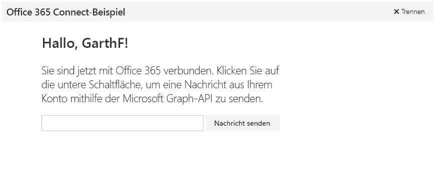

# Erste Schritte mit Microsoft Graph in einer Node.js-App

Dieser Artikel beschreibt die erforderlichen Aufgaben zum Abrufen eines Zugriffstokens vom Azure AD v2.0-Endpunkt und zum Aufrufen von Microsoft Graph. Sie werden durch die Erstellung des [Microsoft Connect-Beispiels für Node.js](https://github.com/microsoftgraph/nodejs-connect-rest-sample) geführt und erhalten Informationen zu den Hauptkonzepten, die Sie zur Verwendung von Microsoft Graph implementieren. In diesem Artikel wird beschrieben, wie Sie mithilfe von Raw-REST-Aufrufen auf die Microsoft Graph-API zugreifen.

In der folgenden Abbildung ist die App dargestellt, die Sie erstellen. 

**Sie möchten keine App erstellen?** Verwenden Sie für einen schnellen Einstieg den [Schnellstart Microsoft Graph](https://graph.microsoft.io/en-us/getting-started).

Zum Herunterladen einer Version des Connect-Beispiels, das den Endpunkt Azure AD verwendet, siehe [Microsoft Graph Connect-Beispiel für Node.js](https://github.com/microsoftgraph/nodejs-connect-rest-sample/releases/tag/last_v1_auth).

## Voraussetzungen

Für die ersten Schritte benötigen Sie: 

- Ein [Microsoft-Konto](https://www.outlook.com/) oder ein [Geschäfts- oder Schulkonto](http://dev.office.com/devprogram)
- [Node.js with npm](https://nodejs.org/en/download/) 
- Das [Microsoft Connect-Beispiel für Node.js](https://github.com/microsoftgraph/nodejs-connect-rest-sample). Für diese exemplarische Vorgehensweise verwenden Sie den Ordner **Startprojekt** in den Beispieldateien.

## Registrieren der App
Registrieren Sie eine App im Microsoft App-Registrierungsportal. Dadurch werden die APP-ID und das Kennwort generiert, mit der bzw. dem Sie die App in Visual Studio konfigurieren.

1. Melden Sie sich beim [Microsoft-App-Registrierungsportal](https://apps.dev.microsoft.com/) entweder mit Ihrem persönlichen oder geschäftlichen Konto oder mit Ihrem Schulkonto an.

2. Klicken Sie auf **App hinzufügen**.

3. Geben Sie einen Namen für die App ein, und wählen Sie **Anwendung erstellen** aus. 
    
    Die Registrierungsseite wird angezeigt, und die Eigenschaften der App werden aufgeführt.

4. Kopieren Sie die Anwendungs-ID: Dies ist der eindeutige Bezeichner für Ihre App. 

5. Wählen Sie unter **Anwendungsgeheimnisse** die Option **Neues Kennwort generieren** aus. Kopieren Sie das Kennwort aus dem Dialogfeld **Neues Kennwort wurde generiert**.

    Sie werden die ID und das Kennwort (geheim) der Anwendung-verwenden, um die App zu konfigurieren. 

6. Wählen Sie unter **Plattformen** die Option **Plattform hinzufügen** > ** Web** aus.

7. Geben Sie *http://localhost:3000/login* als Umleitungs-URI ein. 

8. Wählen Sie **Speichern** aus.

## Konfigurieren des Projekts
1. Öffnen Sie den Ordner **Startprojekt** in den Beispieldateien.

1. Führen Sie den folgenden Befehl in einem Eingabeaufforderungsfenster im Stammverzeichnis des Startprojekts aus. Dadurch werden die Projektabhängigkeiten installiert.

        npm install

1. Öffnen Sie in den Startprojektdateien „utils\config.js“.

1. Ersetzen Sie im Feld **Anmeldeinformationen** die Platzhalterwerte **ENTER\_YOUR\_CLIENT\_ID** und **ENTER\_YOUR\_SECRET** durch die Werte, die Sie soeben kopiert haben.

  
## Authentifizierung des Benutzers und Abrufen eines Zugriffstokens
In diesem Schritt fügen Sie Code für die Anmeldung und die Token-Verwaltung ein. Doch zunächst werfen wir einen genaueren Blick auf den Ablauf der Authentifizierung.

Diese App verwendet den Authorization Code Grant-Datenfluss mit einer delegierten Benutzeridentität. Für eine Webanwendung erfordert der Ablauf die ID der Anwendung, das Geheimnis und den Umleitungs-URI aus der registrierten App. 

Der Authentifizierungsfluss kann in diese grundlegenden Schritte unterteilt werden:

1. Umleitung des Benutzers für die Authentifizierung und Zustimmung
2. Anfordern eines Autorisierungscodes
3. Einlösen des Autorisierungscodes für ein Zugriffstoken
4. Anfordern eines neuen Zugriffstokens mit dem Aktualisierungstoken, wenn das Zugriffstoken abläuft

Die App verwendet die Middleware [OAuth](https://www.npmjs.com/package/oauth) zum Authentifizieren und Beschaffen von Token. Sie verwendet die Middleware [Cookie Parser](https://www.npmjs.com/package/cookie-parser), um Tokeninformationen in Cookies zwischenzuspeichern. Der Code zum Speichern und Aufrufen von Tokeninformationen befindet sich im Controller index.js.
    
   >**Wichtig** Die einfache Handhabung von Authentifizierung und Token bei diesem Projekt dient lediglich zu Beispielzwecken. In einer Produktions-App sollten Sie die Authentifizierung robuster gestalten, unter anderem mit Validierung und sicherer Handhabung von Token.

Sie können nun Code hinzufügen, um Microsoft Graph aufzurufen. 

## Aufrufen von Microsoft Graph
Die App ruft Microsoft Graph auf, um Benutzerinformationen abzurufen und eine E-Mail-Nachricht im Auftrag des Benutzers zu senden. Diesen Aufrufe werden vom Controller index.js als Antwort auf Benutzeroberflächenereignissen initiiert.

1. Öffnen Sie „utils\graphHelper.js“.

1. Ersetzen Sie die Funktion **getUserData** durch den folgenden Code. Dadurch wird die GET-Anforderung konfiguriert und an den Endpunkt */me* gesendet und die Antwort verarbeitet.

        function getUserData(accessToken, callback) {
          request
           .get('https://graph.microsoft.com/v1.0/me')
           .set('Authorization', 'Bearer ' + accessToken)
           .end((err, res) => {
             callback(err, res);
           });
        }

1. Ersetzen Sie die Funktion **getProfilePhoto** durch den folgenden Code. Dadurch wird die GET-Anforderung konfiguriert und an den Endpunkt */me/photo/$value* gesendet und die Antwort verarbeitet. Beachten Sie, dass derzeit keine Profilfotos für MSA-Konten verfügbar sind.
    
        function getProfilePhoto(accessToken, callback) {
          // Get the profile photo of the current user (from the user's mailbox on Exchange Online).
          // This operation in version 1.0 supports only work or school mailboxes, not personal mailboxes.
          request
           .get('https://graph.microsoft.com/v1.0/me/photo/$value')
           .set('Authorization', 'Bearer ' + accessToken)
           .end((err, res) => {
             // Returns 200 OK and the photo in the body. If no photo exists, returns 404 Not Found.
             callback(err, res.body);
           });
        }

1. Ersetzen Sie die Funktion **uploadFile** durch den folgenden Code. Dadurch wird die PUT-Anforderung konfiguriert und an den Endpunkt */me/drive/root/children/mypic.jpg/content* gesendet. Wenn die Datei vorhanden ist, wird ihr Inhalt mit dieser Anforderung aktualisiert. Wenn sie nicht vorhanden ist, wird die Datei erstellt und der Inhalt des Profilfotos hochgeladen. 

        function uploadFile(accessToken, file, callback) {
          // This operation only supports files up to 4MB in size.
          // To upload larger files, see `https://developer.microsoft.com/graph/docs/api-reference/v1.0/api/item_createUploadSession`.
          request
           .put('https://graph.microsoft.com/v1.0/me/drive/root/children/mypic.jpg/content')
           .send(file)
           .set('Authorization', 'Bearer ' + accessToken)
           .set('Content-Type', 'image/jpg')
           .end((err, res) => {
             // Returns 200 OK and the file metadata in the body.
             callback(err, res.body);
           });
        }

1. Ersetzen Sie die Funktion **getSharingLink** durch den folgenden Code. Dadurch wird die GET-Anforderung konfiguriert und an den Endpunkt */me/drive/items/{file id}/createLink* gesendet und das Ergebnis verarbeitet. Das Ergebnis ist ein Freigabelink zur Datei, der in die Nachricht eingeschlossen wird.

        function getSharingLink(accessToken, id, callback) {
          request
           .post('https://graph.microsoft.com/v1.0/me/drive/items/' + id + '/createLink')
           .send({ type: 'view' })
           .set('Authorization', 'Bearer ' + accessToken)
           .set('Content-Type', 'application/json')
           .end((err, res) => {
             // Returns 200 OK and the permission with the link in the body.
             callback(err, res.body.link);
           });
        }

1. Ersetzen Sie die Funktion **postSendMail** durch den folgenden Code. Dadurch wird die POST-Anforderung konfiguriert und an den Endpunkt */me/sendMail* gesendet und die Antwort verarbeitet.

        function postSendMail(accessToken, message, callback) {
          request
           .post('https://graph.microsoft.com/v1.0/me/sendMail')
           .send(message)
           .set('Authorization', 'Bearer ' + accessToken)
           .set('Content-Type', 'application/json')
           .set('Content-Length', message.length)
           .end((err, res) => {
             // Returns 202 if successful.
             // Note: If you receive a 500 - Internal Server Error
             // while using a Microsoft account (outlook.com, hotmail.com or live.com),
             // it's possible that your account has not been migrated to support this flow.
             // Check the inner error object for code 'ErrorInternalServerTransientError'.
             // You can try using a newly created Microsoft account or contact support.
             callback(err, res);
           });
        }

1. Öffnen Sie „utils\emailer.js“.

1. Ersetzen Sie die Funktion **wrapEMail** durch den folgenden Code. Dadurch werden die Nutzdaten erstellt, die die zu sendende E-Mail-Nachricht darstellen.

        function wrapEmail(content, recipient, file) {
          const attachments = [{
            '@odata.type': '#microsoft.graph.fileAttachment',
            ContentBytes: file,
            Name: 'mypic.jpg'
          }];
          const emailAsPayload = {
            Message: {
              Subject: 'Welcome to Microsoft Graph development with Node.js and the Microsoft Graph Connect sample',
              Body: {
                ContentType: 'HTML',
                Content: content
              },
              ToRecipients: [
                {
                  EmailAddress: {
                    Address: recipient
                  }
                }
              ]
            },
            SaveToSentItems: true,
            Attachments: attachments
          };
          return emailAsPayload;
        }

## Ausführen der App

1. Führen Sie den folgenden Befehl in einem Eingabeaufforderungsfenster im Stammverzeichnis des Startprojekts aus.

        npm start

1. Navigieren Sie in einem Browser zu *http://localhost:3000*, und wählen Sie die Schaltfläche **Mit Office 365 verbinden** aus.

1. Melden Sie sich an, und erteilen Sie die erforderlichen Berechtigungen. 

1. Optional können Sie die E-Mail-Adresse des Empfängers bearbeiten. Klicken Sie dann auf die Schaltfläche **E-Mail senden**. Nachdem die E-Mail gesendet wurde, wird unter der Schaltfläche eine Erfolgsmeldung angezeigt. 

## Nächste Schritte
- Testen Sie die REST-API mithilfe des [Graph-Explorers](https://graph.microsoft.io/graph-explorer).
- Schauen Sie sich weitere [Node.js-Beispiele](https://github.com/search?utf8=%E2%9C%93&q=node+sample+user%3Amicrosoftgraph&type=Repositories&ref=searchresults) unter GitHub an.

## Siehe auch
- [Azure AD v2.0-Protokolle](https://azure.microsoft.com/en-us/documentation/articles/active-directory-v2-protocols/)
- [Azure AD v2.0-Tokens](https://azure.microsoft.com/en-us/documentation/articles/active-directory-v2-tokens/)