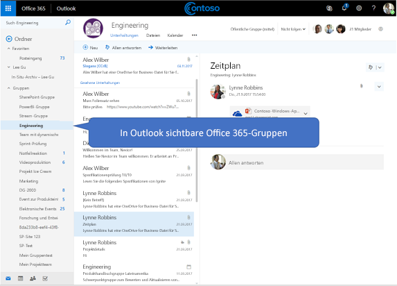

# Überblick über Office 365-Gruppen in Microsoft GraphOverview of Office 365 groups in Microsoft Graph

Office 365-Gruppen stellen den grundlegenden Mitgliedschaftsdienst für Benutzer bereit, um Unterhaltungen, Dateien, Notizen, Kalender, Pläne und viele andere Ressourcen freizugeben.Office 365 groups provide the foundational membership service for users to share conversations, files, notes, calendars, plans, and many other assets. 

## Gründe für die Integration in Office 365-GruppenWhy integrate with Office 365 groups?   

Gruppen bilden die Grundlage, die eine Zusammenarbeit von Benutzern und Integration über Dienste hinweg ermöglicht, um vielfältige Szenarien bei der Aufgabenplanung, der Teamarbeit, der Bildung usw. zu unterstützen.Groups form the foundation that enables user collaboration and integration across services to support rich scenarios in task planning, teamwork, education, and more. Wenn Sie eine Integration in Office 365-Gruppen durchführen, kann Ihre Anwendung Millionen von Benutzer bei ihrem Übergang von verschiedenen Oberflächen in der Office 365-Suite und darüber hinaus unterstützen.When you integrate with Office 365 groups, your application can support millions of users as they transition across various experiences in the Office 365 suite and beyond.  
 
### Erstellen von Gruppen zur Erleichterung der Teamarbeit über Dienste hinwegCreate groups to facilitate teamwork across services 
 
Sie können die Microsoft Graph-API verwenden, um Gruppen über den Lebenszyklus der Zusammenarbeit zu erstellen, zu verwalten oder zu löschen.You can use the Microsoft Graph API to create, manage, or delete groups throughout the lifecycle of collaboration. So können Sie beispielsweise folgende Aktionen ausführen:For example, you can specify the following:  
 
- Verwenden Sie die API [Gruppe erstellen](../api-reference/v1.0/api/group_post_groups.md), um eine neue Gruppe bereitzustellen.Use the [Create group](../api-reference/v1.0/api/group_post_groups.md) API to provision a new group. Die Gruppe wird dann in einem Bereich von Anwendungen, z. B. Outlook, SharePoint, Microsoft Teams, Planner und sogar Microsoft Stream, verfügbar gemacht.The group is then made available in a range of applications, such as Outlook, SharePoint, Microsoft Teams, Planner, and even Microsoft Stream. Microsoft Graph führt eine Synchronisierung über diese verbundenen Dienste hinweg durch, um allen Gruppenmitgliedern nahtlos Zugriff zu ermöglichen.Microsoft Graph synchronizes across these connected services to seamlessly provide access to all group members.  
 
    **Jede Office 365-Gruppe wird in einen Standardsatz von Office 365-Diensten integriert****Every Office 365 group is integrated with a default set of Office 365 services**

      

- Geben Sie Mitgliedern die Möglichkeit anzuzeigen, dass sich eine Gruppe in ihren [Favoriten](../api-reference/v1.0/api/group_addfavorite.md) befindet, oder [entfernen Sie sie ggf. aus ihren Favoriten](../api-reference/v1.0/api/group_removefavorite.md).Enable members to indicate that a group is one of their [favorites](../api-reference/v1.0/api/group_addfavorite.md), or [remove it from their favorites](../api-reference/v1.0/api/group_removefavorite.md) if they choose. 
- Von Ihrer benutzerdefinierten Anwendung aus können Sie Gruppenunterhaltungen [erstellen](../api-reference/v1.0/api/group_post_conversations.md), [abrufen](../api-reference/v1.0/api/group_get_conversation.md) oder [löschen](../api-reference/v1.0/api/group_delete_conversation.md).[Create](../api-reference/v1.0/api/group_post_conversations.md), [get](../api-reference/v1.0/api/group_get_conversation.md), or [delete](../api-reference/v1.0/api/group_delete_conversation.md) group conversations from your custom application. 
- Planen Sie Kalender[ereignisse](../api-reference/v1.0/resources/event.md) im Gruppenkalender.Schedule calendar [events](../api-reference/v1.0/resources/event.md) on the group calendar. 
- Rufen Sie Informationen zu der [SharePoint-Website](../api-reference/v1.0/resources/site.md) ab, mit einer Gruppe zugewiesen ist, z B. die [Listen](../api-reference/v1.0/api/list_list.md) oder [Unterwebsites](../api-reference/v1.0/api/site_list_subsites.md) der Dokumentbibliothek.Get information about the [SharePoint site](../api-reference/v1.0/resources/site.md) that's associated with a group, such as the document library [lists](../api-reference/v1.0/api/list_list.md) or [subsites](../api-reference/v1.0/api/site_list_subsites.md). 
- [Erstellen Sie einen Plan](../api-reference/v1.0/api/planner_post_buckets.md) in Planner, der im Besitz einer Gruppe ist.[Create a plan](../api-reference/v1.0/api/planner_post_buckets.md) in Planner that is owned by a group. Der Plan bietet eine visuelle Möglichkeit zur Aufzeichnung der Teamarbeit, indem Sie [Aufgaben erstellen](../api-reference/v1.0/api/planner_post_tasks.md) können, die [über Buckets hinweg organisiert](../api-reference/v1.0/api/planner_post_buckets.md) werden können. The plan provides a visual way to track teamwork by allowing you to [create tasks](../api-reference/v1.0/api/planner_post_tasks.md) that can be [organized across buckets](../api-reference/v1.0/api/planner_post_buckets.md). 
- Greifen Sie auf das [OneNote](../api-reference/v1.0/resources/onenote.md)-Notizbuch zu, das einer Gruppe zugewiesen ist, das zum Sammeln von Besprechungsnotizen und Organisationsideen verwendet werden kann.Access the [OneNote](../api-reference/v1.0/resources/onenote.md) notebook associated with a group, which can be used for collecting meeting notes and organizing ideas. 
  
    **Office 365-Gruppen und Unterhaltungen in Outlook im Web****Office 365 groups and conversations in Outlook in the web**

     

- [Aktivieren einer Gruppe für Microsoft Teams](../api-reference/beta/api/team_put_teams.md) (Vorschau), damit Mitglieder an einem beständigen Chat teilnehmen können.[Enable a group for Microsoft Teams](../api-reference/beta/api/team_put_teams.md) (preview) to allow group members to engage in persistent chat.  
- [Gruppen löschen](../api-reference/v1.0/api/group_delete.md).[Delete groups](../api-reference/v1.0/api/group_delete.md) Wenn eine Gruppe gelöscht wird, werden alle zugehörigen Inhalte ebenfalls gelöscht, wodurch verwaiste Websites, Unterhaltungen oder Pläne verhindert werden.When a group is deleted, all associated content is also deleted, which prevents orphaned sites, conversations, or plans. 
 
### Nahtloses Verwalten der GruppenmitgliedschaftManage group membership seamlessly 
 
Office 365-Gruppen sind Auflistungen von Benutzern, die den Zugriff auf Ressourcen in Microsoft-Diensten oder in Ihrer App gemeinsam nutzen.Groups are collections of users and other principals who share access to resources in Microsoft services or in your app. Da die Gruppenmitgliedschaft zentral verwaltet wird, wirken sich Änderungen an der Mitgliedschaft auf alle Dienste aus, die mit der Gruppe verknüpft sind.Because group membership is managed centrally, any changes to membership affect all services associated with the group. Mit Microsoft Graph können Sie die folgenden Aufgaben für die Gruppenmitgliedschaftsaufgaben ausführen:You can use Microsoft Graph to perform the following group membership tasks:
 
- [Hinzufügen](../api-reference/v1.0/api/group_post_members.md) und [Entfernen](../api-reference/v1.0/api/group_delete_members.md) von Mitgliedern aus einer vorhandenen Gruppe.[Add](../api-reference/v1.0/api/group_post_members.md) and [remove](../api-reference/v1.0/api/group_delete_members.md) members from an existing group. 
- Abrufen einer [Liste von Besitzern](../api-reference/v1.0/api/group_list_owners.md) oder einer [Liste von Mitgliedern](../api-reference/v1.0/api/group_list_members.md) für eine Gruppe.Get a [list of owners](../api-reference/v1.0/api/group_list_owners.md) or a [list of members](../api-reference/v1.0/api/group_list_members.md) for a group. Auf diese Weise kann kommuniziert werden, wer Zugriff auf Gruppeninhalte hat oder wer vielleicht administrative Aufgaben ausführen muss, z. B. Verlängern der Gruppe oder Genehmigen einer Beitrittsanfrage.This helps communicate who has access to group content, or who might need to perform administrative duties, such as renewing the group or approving a join request. 
- Festlegen von Gruppen als **Öffentlich**, wobei Gruppeninhalte für alle in der gleichen Organisation sichtbar sind, oder auf **Privat**, sodass Gruppeninhalte nur für Mitglieder sichtbar sind, über den Vorgang [Gruppe aktualisieren](../api-reference/v1.0/api/group_update.md).Designate groups as **Public**, where group content is visible to anyone in the same organization, or **Private**, where group content is only visible to members, via the [update group](../api-reference/v1.0/api/group_update.md) operation. 
- [Entfernen von Besitzern](../api-reference/v1.0/api/group_delete_owners.md), die nicht mehr an den Besitzeraufgaben für eine bestimmte Gruppe aus der Liste von Gruppenbesitzern teilnehmen.[Remove owners](../api-reference/v1.0/api/group_delete_owners.md) who are no longer participating in the ownership responsibilities for a particular group from the list of group owners. 
 
### Einrichten und Verwalten von GruppenrichtlinieneinstellungenEstablish and maintain group policy settings 
 
Wenn die Anzahl von Gruppen, die in einer Organisation erstellt werden, wächst, unterstützt Microsoft Graph die Möglichkeit, die Nutzung und den Lebenszyklus der Gruppe zu steuern.As the number of groups created within an organization begins to grow, Microsoft Graph supports the ability to govern the usage and lifecycle of the group. Sie können über alle Gruppen innerhalb einer Organisation hinweg Gruppenrichtlinien erzwingen.You can enforce group policies across all groups within an organization. Sie können die Microsoft Graph-API für Folgendes verwenden:You can use Microsoft Graph to:

- Konfigurieren einer breiten Palette von [Gruppenrichtlinieneinstellungen](../api-reference/v1.0/resources/groupsetting.md), mit denen Verhaltensweisen definiert werden, z. B. das automatische Löschen von Gruppen, sofern diese nicht von einem Besitzer verlängert werden, oder das Erzwingen von Benennungsrichtlinien für Office 365-Gruppen.Configure a broad range of [group policy settings](../api-reference/v1.0/resources/groupsetting.md) that help define behaviors, such as automatically deleting groups unless they are renewed by an owner and enforcing naming policies on Office 365 groups. 
- [Verlängern](../api-reference/v1.0/api/group_renew.md) von Gruppen, die bald ablaufen, sodass Teammitglieder die Zusammenarbeit fortsetzen und weiterhin auf Inhalte zugreifen können.[Renew](../api-reference/v1.0/api/group_renew.md) groups that are about to expire to allow team members to continue with collaboration and accessing content. Wenn die Gruppe nicht gemäß der geltenden Ablaufrichtlinie verlängert wird, wird die Gruppe automatisch gelöscht.If the group is not renewed according to the established expiration policy, the group is automatically deleted. 
- Gelöschte Gruppe [wiederherstellen](../api-reference/v1.0/api/directory_deleteditems_restore.md).[Restore](../api-reference/v1.0/api/directory_deleteditems_restore.md) deleted groups.
 
## Nächste SchritteNext steps

- Testen Sie ein paar Beispiel-API-Anforderungen im [Graph-Tester](https://developer.microsoft.com/de-DE/graph/graph-explorer).Try out some sample API requests in the [Graph Explorer](https://developer.microsoft.com/de-DE/graph/graph-explorer). 
- Erfahren Sie mehr über die [Verwendung der Gruppen-API](../api-reference/v1.0/resources/groups-overview.md) in Microsoft Graph.Learn more about how to [use the groups API](../api-reference/v1.0/resources/groups-overview.md) in Microsoft Graph.
