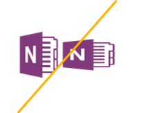
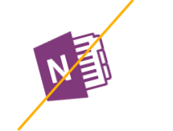
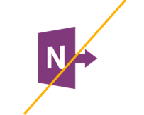
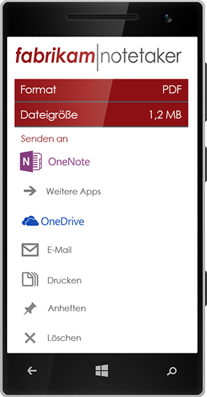
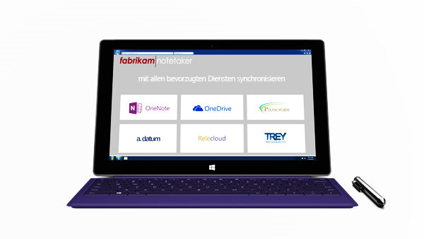
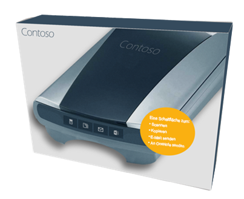
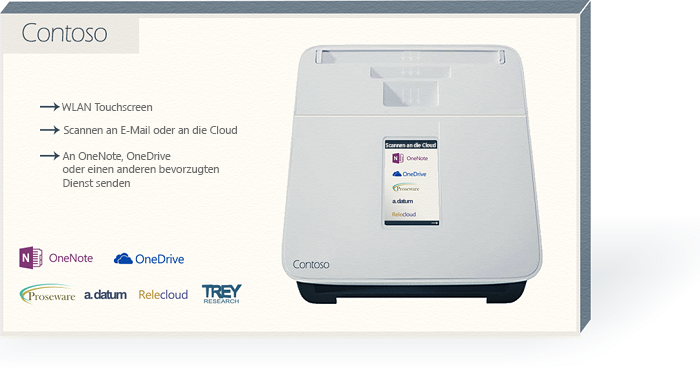

# Branding-Richtlinien für OneNote API-EntwicklerBranding guidelines for OneNote API developers 
 
*__Gilt für:__ Privatanwender-Notizbücher auf OneDrive | Enterprise-Notizbücher auf Office 365**__Applies to:__ Consumer notebooks on OneDrive | Enterprise notebooks on Office 365*

Folgen Sie den Anweisungen aus diesem Artikel, um die OneNote-Marke innerhalb Ihres Produkts am besten zu integrieren und die Anforderungen an das OneNote-Branding zu erfüllen.Follow the guidance in this article to best integrate the OneNote brand within your product and satisfy OneNote branding requirements.

## Logos zum HerunterladenDownloadable logos
Sie können die Logos aus diesem Artikel und eine PDF-Kopie dieser Richtlinien aus unseren [Brandingrichtlinien für OneNote-API-Entwickler](https://www.microsoft.com/download/details.aspx?id=42977) herunterladen (Downloadseite).You can download the logos shown in this article and a PDF copy of these guidelines from our [Branding guidelines for OneNote API developers](https://www.microsoft.com/download/details.aspx?id=42977) download page.

## LogovariationenLogo variations

**Symbol und Name** (empfohlen)**Icon and name lockup** (Preferred)  
Das Symbol ist mit dem Namen gesperrt.The icon symbol is locked with the name. Dies ist die bevorzugte graphische Darstellung des OneNote-Logos.This is the preferred graphic representation of the OneNote logo.

  

**Zeichensymbol****Icon symbol**  
Bestimmte Umgebungen, wie die auf kleinen Geräten, bieten nicht genügend Platz für das gesamte Logo.Certain environments, such as on small devices, don't provide enough room for the entire logo lockup. In diesen Fällen kann das Symbol allein in einer App oder im digitalen Marketing verwendet werden.In those cases, the icon symbol alone may be used in an app or in digital marketing. Sofern es in einer App verwendet wird, verwenden Sie das Symbol nur dann eigenständig, sofern Sie ein Symbol oder ein Favicon zur Darstellung von OneNote benötigen.The icon symbol alone may be used in an app or in digital marketing. Within an app, use the icon symbol by itself only when you need an icon or favicon to represent onnvshort.

  

## FreiraumClear space 
Behandeln Sie das Logo mit Respekt, und geben Sie ihm Raum zum Atmen. Das Logo muss von einem Mindestfreiraum entsprechend der Höhe des Symbols umgeben sein.Treat the logo with respect and give it room to breathe. A minimum clear space equivalent to the height of the symbol must surround the logo.

  

## MindestgrößeMinimum size 
Das Logo muss mindestens 16 Pixel groß sein, wenn es auf dem Bildschirm und mindestens 5 mm (0,2 Zoll) hoch sein, wenn es gedruckt wird.The logo should be at least 16 pixels high when it appears on-screen and at least 5 mm (0.2 inches) high when it appears in print.

**Bildschirm:**&nbsp;&nbsp;16 Pixel**Screen:**&nbsp;&nbsp;16 pixels  
**Drucken:**&nbsp;&nbsp;5 mm (0,2 Zoll)**Print:**&nbsp;&nbsp;5 mm (0.2 inches) 

  

## FarbeColor
Wenn das OneNote-Logo auf weißem oder hellem Hintergrund verwendet wird, ist die bevorzugte Logofarbe – seine Markenfarbe – lila.When the onnvshort logo is used on white or light backgrounds, the preferred logo color is its brand color, purple: Wenn es auf einem lila Hintergrund angezeigt wird, sollte das Logo auf Weiß platziert werden.When it appears on a purple background, the logo should be knocked out to white.

**Bildschirm:**&nbsp;&nbsp;R128 G57 B123 oder Hex #80397B**Screen:**&nbsp;&nbsp;R128 G57 B123 or Hex #80397B  
**Druck:**&nbsp;&nbsp;C75 M100 Y0 K0Print: C75 M100 Y0 K0 

  
 
In Umgebungen mit begrenzten Farben und einem einfarbigen Design kann das Logo in schwarz angezeigt werden. Das Logo sollte jedoch niemals grau angezeigt werden.In color-limited environments and one-color designs, the logo can appear in black. However, the logo should never appear in gray.
<!--or white?-->

## Unzulässige Verwendung des LogosLogo don’ts

**Platzieren Sie das Logo oder Symbol nicht auf einem farbigen Hintergrund****Don’t place the logo or icon on a color background.**  

**Ändern Sie nicht den Maßstab oder die Proportionen**  Don’t change the scale or the proportions.  

**Verwenden Sie keinen Schlagschatten****Don’t use a drop shadow.**  

**Ändern Sie nicht die Farbe, außer zu schwarz oder weiß** (siehe [Farben](#color))Don’t change the color, except to black or white. (See Preferred logo color.)  
 

**Drehen Sie das Logo oder Symbol nicht** Don’t rotate the logo or icon.  

**Ändern Sie nicht die Anordnung der Logoelemente****Don’t rearrange the logo elements.**  

**Verwenden Sie keine Effekte wie Extrudieren und abgeschrägte Kanten****Don’t use an effect such as extrude and bevel.**  

**Erstellen Sie kein neues Logo oder Symbol****Don’t create a new logo or icon.**  

 

## Verweisen auf den Namen OneNoteReferencing the OneNote name

**Vollständiger Name:**&nbsp;&nbsp;Microsoft OneNote**Full name:**&nbsp;&nbsp;Microsoft OneNote  
**Kurzname:**&nbsp;&nbsp;OneNote**Short name:**&nbsp;&nbsp;OneNote
 
In der folgenden Tabelle finden Sie Details dazu, wie Sie in verschiedenen Kontexten auf OneNote verweisen.Refer to the table below for details about how to refer to onnvshort in various contexts.

| KontextContext | VerwendungUsage |
|------|------|
| App-NamenApp names | Um Verbraucher im App-Store nicht zu verwirren, bevorzugen wir, wenn *OneNote* nicht in der Bezeichnung Ihrer App auftritt.To avoid confusing consumers within the app stores, we prefer that  onnvshort  not be included in the name of your app. If it’s determined that  onnvshort  must be used in the app name,  onnvshort  must be modified by a preposition (for example, for or with): Wenn festgestellt wird, dass OneNote in der Bezeichnung der App verwendet werden muss, muss *OneNote* durch eine Präposition geändert werden (z.B. *für OneNote* oder *mit OneNote*).If it’s determined that OneNote must be used in the app name, *OneNote* must be modified by a preposition (for example, *for OneNote* or *with OneNote*).  Beispiel:&nbsp;&nbsp;*Proseware für OneNote*Example:&nbsp;&nbsp;*Proseware for OneNote*  Auf keinen Fall darf der Name Ihrer App mit OneNote beginnen.Under no circumstances can the name of your app begin with onnvshort.
| Name des HerausgebersPublisher names | Der Name des Herausgebers darf keinen Verweis auf OneNote enthalten.The publisher’s name may not include a reference to OneNote. Der Namen des Herausgebers darf keine Handelsmarke von Microsoft verletzen.The publisher’s name may not include a reference to onnvshort. The publisher’s name may not infringe upon any Microsoft trademarks. |
| Angeben der Interoperabilität mit OneNoteIndicating interoperability with onnvshort | **Empfohlen:**&nbsp;&nbsp;an OneNote senden**Recommended:**&nbsp;&nbsp;Send to OneNote  **Akzeptabel:**&nbsp;&nbsp;mit OneNote teilen**Acceptable:**&nbsp;&nbsp;Share with OneNote &nbsp;&nbsp;Akzeptabel, wenn in Bezug auf „Teilen“ mit einer anderen Anwendung verwendet, z.B. *mit OneNote, Facebook oder Twitter teilen.*)&nbsp;&nbsp;Acceptable when used in reference to "sharing" with other applications—for example, *Share with OneNote, Facebook, or Twitter.*)  **Nie:**&nbsp;&nbsp;in OneNote speichern**Never:**&nbsp;&nbsp;Save to OneNote &nbsp;&nbsp;Dies ist technisch falsch.This is technically incorrect. |
| Allgemeines Marketing (einschließlich App-Beschreibungen)General marketing (including app descriptions) | Bei der ersten Erwähnung in einer Kommunikation sollte der vollständige Name verwendet werden: *Microsoft OneNote*.The first mention in a communication should use the full name (onnvlong).  Bei nachfolgenden Erwähnungen in der Kommunikation kann der Kurzname verwendet werden:*OneNote*.Subsequent references in the communication can use the short name (*onnvshort*).
 

## BeispieleExamples

**Anwendungen****Applications**

**Werbung****Advertising**

**Website****WebSite**

**Verpackung****Packaging**

## Siehe auchSee also
Wenn Sie zu diesen Richtlinien Fragen haben oder eine neue Kommunikation über die hier gezeigten Brand-Objekte erstellen, wenden Sie sich an uns unter [@onenotedev](http://twitter.com/onenotedev).If you have any questions about these guidelines or are creating new communications using the brand assets shown here, please submit a request through the  Microsoft Brand Tools Help Center https://brandtools.microsoft.com/HelpCenter/Pages/HelpCenter.aspx .

- [Branding-Richtlinien für OneNote API-Entwickler](https://www.microsoft.com/download/details.aspx?id=42977) (Downloadseite)Branding guidelines for OneNote API developers
- [Integrieren in OneNoteIntegrate with OneNote](integrate_with_onenote.md)
- [OneNote-EntwicklerblogOneNote Developer Blog](http://go.microsoft.com/fwlink/?LinkID=390183)
- [Fragen zur OneNote-Entwicklung auf Stack OverflowOneNote development questions on Stack Overflow](http://go.microsoft.com/fwlink/?LinkID=390182)
- [OneNote GitHub-ReposOneNote GitHub repos](http://go.microsoft.com/fwlink/?LinkID=390178)  

