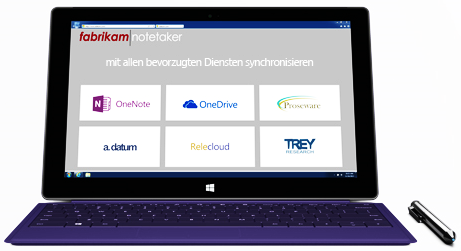

# Branding-Richtlinien für OneNote API-Entwickler 
 
*__Gilt für:__ Privatanwender-Notizbücher auf OneDrive | Enterprise-Notizbücher auf Office 365*

Folgen Sie den Anweisungen aus diesem Artikel, um die OneNote-Marke innerhalb Ihres Produkts am besten zu integrieren und die Anforderungen an das OneNote-Branding zu erfüllen.

## Logos zum Herunterladen
Sie können die Logos aus diesem Artikel und eine PDF-Kopie dieser Richtlinien aus unseren [Brandingrichtlinien für OneNote-API-Entwickler](https://www.microsoft.com/download/details.aspx?id=42977) herunterladen (Downloadseite).

## Logovariationen

**Symbol und Name** (empfohlen)  
Das Symbol ist mit dem Namen gesperrt. Dies ist die bevorzugte graphische Darstellung des OneNote-Logos.

  

**Zeichensymbol**  
Bestimmte Umgebungen, wie die auf kleinen Geräten, bieten nicht genügend Platz für das gesamte Logo. In diesen Fällen kann das Symbol allein in einer App oder im digitalen Marketing verwendet werden. Sofern es in einer App verwendet wird, verwenden Sie das Symbol nur dann eigenständig, sofern Sie ein Symbol oder ein Favicon zur Darstellung von OneNote benötigen.

  

## Freiraum 
Behandeln Sie das Logo mit Respekt, und geben Sie ihm Raum zum Atmen. Das Logo muss von einem Mindestfreiraum entsprechend der Höhe des Symbols umgeben sein.

  

## Mindestgröße 
Das Logo muss mindestens 16 Pixel groß sein, wenn es auf dem Bildschirm und mindestens 5 mm (0,2 Zoll) hoch sein, wenn es gedruckt wird.

**Bildschirm:**&nbsp;&nbsp;16 Pixel  
**Drucken:**&nbsp;&nbsp;5 mm (0,2 Zoll) 

  

## Farbe
Wenn das OneNote-Logo auf weißem oder hellem Hintergrund verwendet wird, ist die bevorzugte Logofarbe – seine Markenfarbe – lila. Wenn es auf einem lila Hintergrund angezeigt wird, sollte das Logo auf Weiß platziert werden.

**Bildschirm:**&nbsp;&nbsp;R128 G57 B123 oder Hex #80397B  
**Druck:**&nbsp;&nbsp;C75 M100 Y0 K0 

  
 
In Umgebungen mit begrenzten Farben und einem einfarbigen Design kann das Logo in schwarz angezeigt werden. Das Logo sollte jedoch niemals grau angezeigt werden.
<!--or white?-->

## Unzulässige Verwendung des Logos

**Platzieren Sie das Logo oder Symbol nicht auf einem farbigen Hintergrund**  

**Ändern Sie nicht den Maßstab oder die Proportionen**    

**Verwenden Sie keinen Schlagschatten**  

**Ändern Sie nicht die Farbe, außer zu schwarz oder weiß** (siehe [Farben](#color))  
 

**Drehen Sie das Logo oder Symbol nicht**   

**Ändern Sie nicht die Anordnung der Logoelemente**  

**Verwenden Sie keine Effekte wie Extrudieren und abgeschrägte Kanten**  

**Erstellen Sie kein neues Logo oder Symbol**  

 

## Verweisen auf den Namen OneNote

**Vollständiger Name:**&nbsp;&nbsp;Microsoft OneNote  
**Kurzname:**&nbsp;&nbsp;OneNote
 
In der folgenden Tabelle finden Sie Details dazu, wie Sie in verschiedenen Kontexten auf OneNote verweisen.

| Kontext | Verwendung |
|------|------|
| App-Namen | Um Verbraucher im App-Store nicht zu verwirren, bevorzugen wir, wenn *OneNote* nicht in der Bezeichnung Ihrer App auftritt. Wenn festgestellt wird, dass OneNote in der Bezeichnung der App verwendet werden muss, muss *OneNote* durch eine Präposition geändert werden (z.B. *für OneNote* oder *mit OneNote*).  Beispiel:&nbsp;&nbsp;*Proseware für OneNote*  Auf keinen Fall darf der Name Ihrer App mit OneNote beginnen.
| Name des Herausgebers | Der Name des Herausgebers darf keinen Verweis auf OneNote enthalten. Der Namen des Herausgebers darf keine Handelsmarke von Microsoft verletzen. |
| Angeben der Interoperabilität mit OneNote | **Empfohlen:**&nbsp;&nbsp;an OneNote senden  **Akzeptabel:**&nbsp;&nbsp;mit OneNote teilen &nbsp;&nbsp;Akzeptabel, wenn in Bezug auf „Teilen“ mit einer anderen Anwendung verwendet, z.B. *mit OneNote, Facebook oder Twitter teilen.*)  **Nie:**&nbsp;&nbsp;in OneNote speichern &nbsp;&nbsp;Dies ist technisch falsch. |
| Allgemeines Marketing (einschließlich App-Beschreibungen) | Bei der ersten Erwähnung in einer Kommunikation sollte der vollständige Name verwendet werden: *Microsoft OneNote*.  Bei nachfolgenden Erwähnungen in der Kommunikation kann der Kurzname verwendet werden:*OneNote*.
 

## Beispiele

**Anwendungen**

**Werbung**

**Website**

**Verpackung**

## Siehe auch
Wenn Sie zu diesen Richtlinien Fragen haben oder eine neue Kommunikation über die hier gezeigten Brand-Objekte erstellen, wenden Sie sich an uns unter [@onenotedev](http://twitter.com/onenotedev).

- [Branding-Richtlinien für OneNote API-Entwickler](https://www.microsoft.com/download/details.aspx?id=42977) (Downloadseite)
- [Integrieren in OneNote](integrate_with_onenote.md)
- [OneNote-Entwicklerblog](http://go.microsoft.com/fwlink/?LinkID=390183)
- [Fragen zur OneNote-Entwicklung auf Stack Overflow](http://go.microsoft.com/fwlink/?LinkID=390182)
- [OneNote GitHub-Repos](http://go.microsoft.com/fwlink/?LinkID=390178)  

