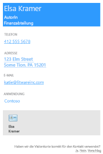
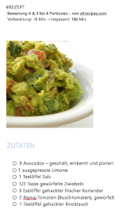

# <a name="use-onenote-api-div-tags-to-extract-data-from-captures"></a><span data-ttu-id="fbd17-103">Verwenden von div-Tags der OneNote-API zum Extrahieren von Daten aus Erfassungen</span><span class="sxs-lookup"><span data-stu-id="fbd17-103">Use OneNote API div tags to extract data from captures</span></span> 

<span data-ttu-id="fbd17-104">**Gilt für** Heimanwender-Notizbücher in OneDrive | Unternehmensnotizbücher in Office 365</span><span class="sxs-lookup"><span data-stu-id="fbd17-104">**Applies to** Consumer notebooks on OneDrive | Enterprise notebooks on Office 365</span></span>

<span data-ttu-id="fbd17-105">Verwenden Sie die OneNote-API zum Extrahieren von Visitenkartendaten aus einem Bild oder von Rezept- und Produktdaten von einer URL.</span><span class="sxs-lookup"><span data-stu-id="fbd17-105">Use the OneNote API to extract business card data from an image, or recipe and product data from a URL.</span></span>

<a name="attributes"></a>

## <a name="extraction-attributes"></a><span data-ttu-id="fbd17-106">Extraktionsattribute</span><span class="sxs-lookup"><span data-stu-id="fbd17-106">Extraction attributes</span></span>

<span data-ttu-id="fbd17-107">Zum Extrahieren und Transformieren von Daten schließen Sie einfach ein div-Tag in die [create-page](onenote-create-page.md)- oder [update-page](onenote-update-page.md)-Anforderung ein, das den Quellinhalt, die Extraktionsmethode sowie ein Ausweichverhalten angibt.</span><span class="sxs-lookup"><span data-stu-id="fbd17-107">To extract and transform data, simply include a div that specifies the source content, extraction method, and fallback behavior in your [create-page](onenote-create-page.md) or [update-page](onenote-update-page.md) request.</span></span> <span data-ttu-id="fbd17-108">Die API rendert extrahierte Daten auf der Seite in einem einfach zu lesenden Format.</span><span class="sxs-lookup"><span data-stu-id="fbd17-108">The API renders extracted data on the page in an easy-to-read format.</span></span> 

```html
<div
  data-render-src="image-or-url"
  data-render-method="extraction-method"
  data-render-fallback="fallback-action">
</div>
```

### <a name="data-render-src"></a><span data-ttu-id="fbd17-109">data-render-src</span><span class="sxs-lookup"><span data-stu-id="fbd17-109">data-render-src</span></span>

<span data-ttu-id="fbd17-110">Die Inhaltsquelle.</span><span class="sxs-lookup"><span data-stu-id="fbd17-110">The content source.</span></span> <span data-ttu-id="fbd17-111">Dies kann ein Bild einer Visitenkarte oder eine absolute URL von zahlreichen beliebten Rezept- oder Produktwebsites sein.</span><span class="sxs-lookup"><span data-stu-id="fbd17-111">This can be an image of a business card or an absolute URL from many popular recipe or product websites.</span></span> <span data-ttu-id="fbd17-112">Erforderlich. </span><span class="sxs-lookup"><span data-stu-id="fbd17-112">Required.</span></span>

<span data-ttu-id="fbd17-113">Verwenden Sie für optimale Ergebnisse beim Angeben einer URL die kanonische URL, die ggf. im HTML-Code der Quellwebseite definiert ist.</span><span class="sxs-lookup"><span data-stu-id="fbd17-113">For best results when specifying a URL, use the canonical URL defined in the HTML of the source webpage, if one is defined.</span></span> <span data-ttu-id="fbd17-114">Eine kanonische URL kann beispielsweise folgendermaßen in der Quellwebseite definiert werden:</span><span class="sxs-lookup"><span data-stu-id="fbd17-114">For example, a canonical URL might be defined in the source webpage like this:</span></span>

`<link rel="canonical" href="www.domainname.com/page/123/size12/type987" />` 


### <a name="data-render-method"></a><span data-ttu-id="fbd17-115">data-render-method</span><span class="sxs-lookup"><span data-stu-id="fbd17-115">data-render-method</span></span>

<span data-ttu-id="fbd17-116">Die auszuführende Extraktionsmethode.</span><span class="sxs-lookup"><span data-stu-id="fbd17-116">The extraction method to run.</span></span> <span data-ttu-id="fbd17-117">Erforderlich. </span><span class="sxs-lookup"><span data-stu-id="fbd17-117">Required.</span></span>

| <span data-ttu-id="fbd17-118">Wert</span><span class="sxs-lookup"><span data-stu-id="fbd17-118">Value</span></span> | <span data-ttu-id="fbd17-119">Beschreibung</span><span class="sxs-lookup"><span data-stu-id="fbd17-119">Description</span></span> |
|:------|:------|
| <span data-ttu-id="fbd17-120">extract.businesscard</span><span class="sxs-lookup"><span data-stu-id="fbd17-120">extract.businesscard</span></span> | <span data-ttu-id="fbd17-121">Extraktionen von Visitenkarten.</span><span class="sxs-lookup"><span data-stu-id="fbd17-121">A business card extraction.</span></span> |
| <span data-ttu-id="fbd17-122">extract.recipe</span><span class="sxs-lookup"><span data-stu-id="fbd17-122">extract.recipe</span></span> | <span data-ttu-id="fbd17-123">Extraktionen von Rezepten.</span><span class="sxs-lookup"><span data-stu-id="fbd17-123">A recipe extraction.</span></span> |
| <span data-ttu-id="fbd17-124">extract.product</span><span class="sxs-lookup"><span data-stu-id="fbd17-124">extract.product</span></span> | <span data-ttu-id="fbd17-125">Extraktionen von Produktlisten.</span><span class="sxs-lookup"><span data-stu-id="fbd17-125">A product listing extraction.</span></span> |
| <span data-ttu-id="fbd17-126">extract</span><span class="sxs-lookup"><span data-stu-id="fbd17-126">extract</span></span> | <span data-ttu-id="fbd17-127">Ein unbekannter Datenextraktionstyp.</span><span class="sxs-lookup"><span data-stu-id="fbd17-127">An unknown extraction type.</span></span> |

<span data-ttu-id="fbd17-128">Für optimale Ergebnisse geben Sie den Inhaltstyp (`extract.businesscard`, `extract.recipe` oder `extract.product`) an, falls bekannt.</span><span class="sxs-lookup"><span data-stu-id="fbd17-128">For best results, specify the content type (`extract.businesscard`, `extract.recipe`, or `extract.product`) if you know it.</span></span> <span data-ttu-id="fbd17-129">Wenn der Typ nicht bekannt ist, verwenden Sie die `extract`-Methode, und die OneNote-API versucht daraufhin, den Typ automatisch zu ermitteln.</span><span class="sxs-lookup"><span data-stu-id="fbd17-129">If the type is unknown, use the `extract` method, and the OneNote API will try to auto-detect the type.</span></span>

### <a name="data-render-fallback"></a><span data-ttu-id="fbd17-130">data-render-fallback</span><span class="sxs-lookup"><span data-stu-id="fbd17-130">data-render-fallback</span></span>

<span data-ttu-id="fbd17-131">Das Ausweichverhalten, wenn die Extraktion fehlschlägt.</span><span class="sxs-lookup"><span data-stu-id="fbd17-131">The fallback behavior if the extraction fails.</span></span> <span data-ttu-id="fbd17-132">Wenn der Wert weggelassen wird, gilt der Standardwert **render**.</span><span class="sxs-lookup"><span data-stu-id="fbd17-132">Defaults to **render** if omitted.</span></span> 

| <span data-ttu-id="fbd17-133">Wert</span><span class="sxs-lookup"><span data-stu-id="fbd17-133">Value</span></span> | <span data-ttu-id="fbd17-134">Beschreibung</span><span class="sxs-lookup"><span data-stu-id="fbd17-134">Description</span></span> |
|:------|:------|
| <span data-ttu-id="fbd17-135">render()</span><span class="sxs-lookup"><span data-stu-id="fbd17-135">render</span></span> | <span data-ttu-id="fbd17-136">Rendert das Quellbild oder eine Momentaufnahme der Rezept- oder Produktwebseite.</span><span class="sxs-lookup"><span data-stu-id="fbd17-136">Renders the source image or a snapshot of the recipe or product webpage.</span></span> |
| <span data-ttu-id="fbd17-137">n/v</span><span class="sxs-lookup"><span data-stu-id="fbd17-137">none</span></span> | <span data-ttu-id="fbd17-138">Hat keine Wirkung. </span><span class="sxs-lookup"><span data-stu-id="fbd17-138">Does nothing.</span></span><br /><br /><span data-ttu-id="fbd17-139">Die Option ist nützlich, wenn Sie zusätzlich zum extrahierten Inhalt immer eine Momentaufnahme der Visitenkarte oder Webseite auf der Seite einschließen möchten.</span><span class="sxs-lookup"><span data-stu-id="fbd17-139">This option is useful if you want to always include a snapshot of the business card or webpage on the page in addition to any extracted content.</span></span> <span data-ttu-id="fbd17-140">Achten Sie darauf, ein separates `img`-Element in der Anforderung zu senden, wie in den Beispielen dargestellt.</span><span class="sxs-lookup"><span data-stu-id="fbd17-140">Be sure to send a separate `img` element in the request, as shown in the examples.</span></span> |

<a name="biz-card"></a>

## <a name="business-card-extractions"></a><span data-ttu-id="fbd17-141">Extraktionen von Visitenkarten</span><span class="sxs-lookup"><span data-stu-id="fbd17-141">Business card extractions</span></span>

<span data-ttu-id="fbd17-142">Die OneNote-API sucht und rendert die folgenden Kontaktinformationen basierend auf dem Bild einer Visitenkarte einer Person oder eines Unternehmens.</span><span class="sxs-lookup"><span data-stu-id="fbd17-142">The OneNote API tries to find and render the following contact information based on an image of a person's or company's business card.</span></span>

- <span data-ttu-id="fbd17-143">Name</span><span class="sxs-lookup"><span data-stu-id="fbd17-143">Name</span></span>
- <span data-ttu-id="fbd17-144">Titel</span><span class="sxs-lookup"><span data-stu-id="fbd17-144">Title</span></span>
- <span data-ttu-id="fbd17-145">Organisation</span><span class="sxs-lookup"><span data-stu-id="fbd17-145">Organization</span></span>
- <span data-ttu-id="fbd17-146">Telefon- und Faxnummer</span><span class="sxs-lookup"><span data-stu-id="fbd17-146">Phone and fax numbers</span></span>
- <span data-ttu-id="fbd17-147">Postanschrift und physische Adressen</span><span class="sxs-lookup"><span data-stu-id="fbd17-147">Mailing and physical addresses</span></span>
- <span data-ttu-id="fbd17-148">E-Mail-Adressen</span><span class="sxs-lookup"><span data-stu-id="fbd17-148">Email addresses</span></span>
- <span data-ttu-id="fbd17-149">Websites</span><span class="sxs-lookup"><span data-stu-id="fbd17-149">Websites</span></span>




<span data-ttu-id="fbd17-p108">Eine vCard (.VCF-Datei) mit den extrahierten Kontaktinformationen wird ebenfalls in die Seite eingebettet. Die vCard-Datei ist eine bequeme Möglichkeit zum Abrufen von Kontaktinformationen beim Abrufen von HTML-Seiteninhalten.</span><span class="sxs-lookup"><span data-stu-id="fbd17-p108">A vCard (.VCF file) with the extracted contact information is also embedded in the page. The vCard is a convenient way to get the contact information when retrieving page HTML content.</span></span>

### <a name="common-scenarios-for-business-card-extractions"></a><span data-ttu-id="fbd17-152">Häufige Szenarien für Visitenkartenextraktionen</span><span class="sxs-lookup"><span data-stu-id="fbd17-152">Common scenarios for business card extractions</span></span>

#### <a name="extract-business-card-information-and-also-render-the-business-card-image"></a><span data-ttu-id="fbd17-153">Abbildung zum Extrahieren von Visitenkarteninformationen und Rendern der Visitenkarte</span><span class="sxs-lookup"><span data-stu-id="fbd17-153">Extract business card information, and also render the business card image</span></span>

<span data-ttu-id="fbd17-154">Geben Sie die `extract.businesscard`-Methode und das `none`-Ausweichverhalten an.</span><span class="sxs-lookup"><span data-stu-id="fbd17-154">Specify the `extract.businesscard` method and the `none` fallback.</span></span> <span data-ttu-id="fbd17-155">Senden Sie auch ein `img`-Element mit dem `src`-Attribut, das auch auf das Bild verweist.</span><span class="sxs-lookup"><span data-stu-id="fbd17-155">Also send an `img` element with the `src` attribute that also references the image.</span></span> <span data-ttu-id="fbd17-156">Wenn die API keinen Inhalt extrahieren kann, wird nur das Bild der Visitenkarte gerendert.</span><span class="sxs-lookup"><span data-stu-id="fbd17-156">If the API is unable to extract any content, it renders the business card image only.</span></span>

```html 
<div
    data-render-src="name:scanned-card-image"
    data-render-method="extract.businesscard"
    data-render-fallback="none">
</div>

```


#### <a name="extract-business-card-information-and-render-the-business-card-image-only-if-the-extraction-fails"></a><span data-ttu-id="fbd17-157">Abbildung zum Extrahieren von Visitenkarteninformationen und Rendern des Bilds der Visitenkarte, wenn die Extraktion fehlschlägt</span><span class="sxs-lookup"><span data-stu-id="fbd17-157">Extract business card information, and render the business card image only if the extraction fails</span></span>

<span data-ttu-id="fbd17-158">Geben Sie die `extract.businesscard`-Methode an, und verwenden Sie das standardmäßige `render`-Ausweichverhalten.</span><span class="sxs-lookup"><span data-stu-id="fbd17-158">Specify the `extract.businesscard` method and use the default `render` fallback.</span></span> <span data-ttu-id="fbd17-159">Wenn die API keinen Inhalt extrahieren kann, wird stattdessen das Bild der Visitenkarte gerendert.</span><span class="sxs-lookup"><span data-stu-id="fbd17-159">If the API is unable to extract any content, it renders the business card image instead.</span></span>

```html
<div
    data-render-src="name:scanned-card-image"
    data-render-method="extract.businesscard">
</div>
```
 
<span data-ttu-id="fbd17-160">Bei Visitenkartenextraktionen wird das Bild als benannten Teil in einer mehrteiligen Anforderung gesendet.</span><span class="sxs-lookup"><span data-stu-id="fbd17-160">For business card extractions, the image is sent as a named part in a multipart request.</span></span> <span data-ttu-id="fbd17-161">Unter [Hinzufügen von Bildern und Dateien](onenote-images-files.md) finden Sie Beispiele, in denen gezeigt wird, wie ein Bild in einer Anforderung gesendet wird.</span><span class="sxs-lookup"><span data-stu-id="fbd17-161">See [Add images and files](onenote-images-files.md) for examples that show how to send an image in a request.</span></span>


<a name="recipe"></a>

## <a name="recipe-extractions"></a><span data-ttu-id="fbd17-162">Extraktionen von Rezepten</span><span class="sxs-lookup"><span data-stu-id="fbd17-162">Recipe extractions</span></span>

<span data-ttu-id="fbd17-163">Die OneNote-API sucht und rendert die folgenden Informationen auf der Grundlage einer Rezeptkarten-URL.</span><span class="sxs-lookup"><span data-stu-id="fbd17-163">The OneNote API tries to find and render the following information based on a recipe's URL.</span></span>

- <span data-ttu-id="fbd17-164">Großformatiges Hintergrundbild</span><span class="sxs-lookup"><span data-stu-id="fbd17-164">Hero image</span></span>
- <span data-ttu-id="fbd17-165">Bewertung</span><span class="sxs-lookup"><span data-stu-id="fbd17-165">Rating</span></span>
- <span data-ttu-id="fbd17-166">Zutaten</span><span class="sxs-lookup"><span data-stu-id="fbd17-166">Ingredients</span></span>
- <span data-ttu-id="fbd17-167">Anweisungen</span><span class="sxs-lookup"><span data-stu-id="fbd17-167">Instructions</span></span>
- <span data-ttu-id="fbd17-168">Vorbereitungs-, Koch- und Gesamtzeiten</span><span class="sxs-lookup"><span data-stu-id="fbd17-168">Prep, cook, and total times</span></span>
- <span data-ttu-id="fbd17-169">Portionen</span><span class="sxs-lookup"><span data-stu-id="fbd17-169">Servings</span></span>




<span data-ttu-id="fbd17-170">Die API ist für Rezepte von vielen beliebten Websites wie *Allrecipes.com*, *FoodNetwork.com* und *SeriousEats.com* optimiert.</span><span class="sxs-lookup"><span data-stu-id="fbd17-170">The API is optimized for recipes from many popular sites such as *Allrecipes.com*, *FoodNetwork.com*, and *SeriousEats.com*.</span></span>

### <a name="common-scenarios-for-recipe-extractions"></a><span data-ttu-id="fbd17-171">Häufige Szenarien für Rezeptextraktionen</span><span class="sxs-lookup"><span data-stu-id="fbd17-171">Common scenarios for recipe extractions</span></span>

#### <a name="extract-recipe-information-and-also-render-a-snapshot-of-the-recipe-webpage"></a><span data-ttu-id="fbd17-172">Extrahieren von Rezeptinformationen und Rendern eines Snapshots der Rezeptwebseite</span><span class="sxs-lookup"><span data-stu-id="fbd17-172">Extract recipe information, and also render a snapshot of the recipe webpage</span></span>

<span data-ttu-id="fbd17-173">Geben Sie die `extract.recipe`-Methode und das `none`-Ausweichverhalten an.</span><span class="sxs-lookup"><span data-stu-id="fbd17-173">Specify the `extract.recipe` method and the `none` fallback.</span></span> <span data-ttu-id="fbd17-174">Senden Sie auch ein `img`-Element, wobei das `data-render-src`-Attribut auf die Rezept-URL festgelegt ist.</span><span class="sxs-lookup"><span data-stu-id="fbd17-174">Also send an `img` element with the `data-render-src` attribute set to the recipe URL.</span></span> <span data-ttu-id="fbd17-175">Wenn die API keinen Inhalt extrahieren kann, wird nur ein Snapshot der Rezeptwebseite gerendert.</span><span class="sxs-lookup"><span data-stu-id="fbd17-175">If the API is unable to extract any content, it renders a snapshot of the recipe webpage only.</span></span>

<span data-ttu-id="fbd17-176">Dieses Szenario bietet möglicherweise die meisten Informationen, da die Webseite weitere Informationen, wie z. B. Kundenbewertungen und Vorschläge, enthalten kann.</span><span class="sxs-lookup"><span data-stu-id="fbd17-176">This scenario potentially provides the most information because the webpage may include additional information, such as customer reviews and suggestions.</span></span>

```html 
<div
    data-render-src="https://allrecipes.com/recipe/guacamole/"
    data-render-method="extract.recipe"
    data-render-fallback="none">
</div>

```
 

#### <a name="extract-recipe-information-and-render-a-snapshot-of-the-recipe-webpage-only-if-the-extraction-fails"></a><span data-ttu-id="fbd17-177">Extrahieren von Rezeptinformationen und Rendern eines Snapshots der Rezeptwebseite, wenn die Extraktion fehlschlägt</span><span class="sxs-lookup"><span data-stu-id="fbd17-177">Extract recipe information, and render a snapshot of the recipe webpage only if the extraction fails</span></span>

<span data-ttu-id="fbd17-178">Geben Sie die `extract.recipe`-Methode an, und verwenden Sie das standardmäßige Render-Ausweichverhalten.</span><span class="sxs-lookup"><span data-stu-id="fbd17-178">Specify the `extract.recipe` method and use the default render fallback.</span></span> <span data-ttu-id="fbd17-179">Wenn die API keinen Inhalt extrahieren kann, wird stattdessen ein Snapshot der Rezeptwebseite gerendert.</span><span class="sxs-lookup"><span data-stu-id="fbd17-179">If the API is unable to extract any content, it renders a snapshot of the recipe webpage instead.</span></span>

```html  
<div
    data-render-src="https://www.foodnetwork.com/recipes/alton-brown/creme-brulee-recipe.html"
    data-render-method="extract.recipe">
</div>
```


#### <a name="extract-recipe-information-and-also-render-a-link-to-the-recipe"></a><span data-ttu-id="fbd17-180">Extrahieren von Rezeptinformationen und Rendern eines Links zum Rezept</span><span class="sxs-lookup"><span data-stu-id="fbd17-180">Extract recipe information, and also render a link to the recipe</span></span>

<span data-ttu-id="fbd17-181">Geben Sie die `extract.recipe`-Methode und das `none`-Ausweichverhalten an.</span><span class="sxs-lookup"><span data-stu-id="fbd17-181">Specify the `extract.recipe` method and the `none` fallback.</span></span> <span data-ttu-id="fbd17-182">Senden Sie auch ein `a`-Element, wobei das `src`-Attribut auf die Rezept-URL festgelegt ist (Sie können alternativ auch andere Informationen senden, die Sie der Seite hinzufügen möchten).</span><span class="sxs-lookup"><span data-stu-id="fbd17-182">Also send an `a` element with the `src` attribute set to the recipe URL (or you can send any other information you want to add to the page).</span></span> <span data-ttu-id="fbd17-183">Wenn die API keinen Inhalt extrahieren kann, wird nur der Rezept-Link gerendert.</span><span class="sxs-lookup"><span data-stu-id="fbd17-183">If the API is unable to extract any content, only the recipe link is rendered.</span></span>

```html  
<div
    data-render-src="https://www.seriouseats.com/recipes/2014/09/diy-spicy-kimchi-beef-instant-noodles-recipe.html"
    data-render-method="extract.recipe"
    data-render-fallback="none">
</div>
<a href="https://www.seriouseats.com/recipes/2014/09/diy-spicy-kimchi-beef-instant-noodles-recipe.html">Recipe URL</a>
``` 


<a name="product"></a>

## <a name="product-listing-extractions"></a><span data-ttu-id="fbd17-184">Extraktionen von Produktlisten</span><span class="sxs-lookup"><span data-stu-id="fbd17-184">Product listing extractions</span></span>

- <span data-ttu-id="fbd17-185">Titel</span><span class="sxs-lookup"><span data-stu-id="fbd17-185">Title</span></span>
- <span data-ttu-id="fbd17-186">Bewertung</span><span class="sxs-lookup"><span data-stu-id="fbd17-186">Rating</span></span>
- <span data-ttu-id="fbd17-187">Primäres Bild</span><span class="sxs-lookup"><span data-stu-id="fbd17-187">Primary image</span></span>
- <span data-ttu-id="fbd17-188">Beschreibung</span><span class="sxs-lookup"><span data-stu-id="fbd17-188">Description</span></span>
- <span data-ttu-id="fbd17-189">Features</span><span class="sxs-lookup"><span data-stu-id="fbd17-189">Features</span></span>
- <span data-ttu-id="fbd17-190">Spezifikationen</span><span class="sxs-lookup"><span data-stu-id="fbd17-190">Specifications</span></span>


<span data-ttu-id="fbd17-191">Die API ist für Produkte von vielen beliebten Websites wie *Amazon.com* und *HomeDepot.com* optimiert.</span><span class="sxs-lookup"><span data-stu-id="fbd17-191">The API is optimized for products from many popular sites such as *Amazon.com* and *HomeDepot.com*.</span></span>

### <a name="common-scenarios-for-recipe-extractions"></a><span data-ttu-id="fbd17-192">Häufige Szenarien für Rezeptextraktionen</span><span class="sxs-lookup"><span data-stu-id="fbd17-192">Common scenarios for recipe extractions</span></span>

#### <a name="extract-product-information-and-also-render-a-snapshot-of-the-product-webpage"></a><span data-ttu-id="fbd17-193">Extrahieren von Produktinformationen und Rendern eines Snapshots der Produktwebseite</span><span class="sxs-lookup"><span data-stu-id="fbd17-193">Extract product information, and also render a snapshot of the product webpage</span></span>

<span data-ttu-id="fbd17-194">Geben Sie die `extract.product`-Methode und das `none`-Ausweichverhalten an.</span><span class="sxs-lookup"><span data-stu-id="fbd17-194">Specify the `extract.product` method and the `none` fallback.</span></span> <span data-ttu-id="fbd17-195">Senden Sie auch ein `img`-Element, wobei das `data-render-src`-Attribut auf die Produkt-URL festgelegt ist.</span><span class="sxs-lookup"><span data-stu-id="fbd17-195">Also send an `img` element with the `data-render-src` attribute set to the product URL.</span></span> <span data-ttu-id="fbd17-196">Wenn die API keinen Inhalt extrahieren kann, wird nur ein Snapshot der Produktwebseite gerendert.</span><span class="sxs-lookup"><span data-stu-id="fbd17-196">If the API is unable to extract any content, it renders a snapshot of the product webpage only.</span></span>

<span data-ttu-id="fbd17-197">Dieses Szenario bietet möglicherweise die meisten Informationen, da die Webseite weitere Informationen, wie z. B. Kundenbewertungen und Vorschläge, enthalten kann.</span><span class="sxs-lookup"><span data-stu-id="fbd17-197">This scenario potentially provides the most information because the webpage may include additional information, such as customer reviews and suggestions.</span></span>

```html 
<div
    data-render-src="https://www.amazon.com/Microsoft-Band-Small/dp/B00P2T2WVO"
    data-render-method="extract.product"
    data-render-fallback="none">
</div>

```


#### <a name="extract-product-information-and-render-a-snapshot-of-the-product-webpage-only-if-the-extraction-fails"></a><span data-ttu-id="fbd17-198">Extrahieren von Produktinformationen und Rendern eines Snapshots der Produktwebseite, wenn die Extraktion fehlschlägt</span><span class="sxs-lookup"><span data-stu-id="fbd17-198">Extract product information, and render a snapshot of the product webpage only if the extraction fails</span></span>

<span data-ttu-id="fbd17-199">Geben Sie die `extract.product`-Methode an, und verwenden Sie das standardmäßige Render-Ausweichverhalten.</span><span class="sxs-lookup"><span data-stu-id="fbd17-199">Specify the `extract.product` method and use the default render fallback.</span></span> <span data-ttu-id="fbd17-200">Wenn die API keinen Inhalt extrahieren kann, wird stattdessen ein Snapshot der Produktwebseite gerendert.</span><span class="sxs-lookup"><span data-stu-id="fbd17-200">If the API is unable to extract any content, it renders a snapshot of the product webpage instead.</span></span>

```html 
<div
    data-render-src="https://www.sears.com/craftsman-19hp-42-8221-turn-tight-174-hydrostatic-yard-tractor/p-07120381000P"
    data-render-method="extract.product">
</div>
```
 

#### <a name="extract-product-information-and-also-render-a-link-to-the-product"></a><span data-ttu-id="fbd17-201">Extrahieren von Produktinformationen und Rendern eines Links zum Produkt</span><span class="sxs-lookup"><span data-stu-id="fbd17-201">Extract product information, and also render a link to the product</span></span>

<span data-ttu-id="fbd17-202">Geben Sie die `extract.product`-Methode und das `none`-Ausweichverhalten an.</span><span class="sxs-lookup"><span data-stu-id="fbd17-202">Specify the `extract.product` method and the `none` fallback.</span></span> <span data-ttu-id="fbd17-203">Senden Sie auch ein `a`-Element, wobei das `src`-Attribut auf die Produkt-URL festgelegt ist (Sie können alternativ auch andere Informationen senden, die Sie der Seite hinzufügen möchten).</span><span class="sxs-lookup"><span data-stu-id="fbd17-203">Also send an `a` element with the `src` attribute set to the product URL (or you can send any other information you want to add to the page).</span></span> <span data-ttu-id="fbd17-204">Wenn die API keinen Inhalt extrahieren kann, wird nur der Seitenlink gerendert.</span><span class="sxs-lookup"><span data-stu-id="fbd17-204">If the API is unable to extract any content, only the page link is rendered.</span></span>

```html 
<div
    data-render-src="https://www.homedepot.com/p/Active-Ventilation-5-Watt-Solar-Powered-Exhaust-Attic-Fan-RBSF-8-WT/204203001"
    data-render-method="extract.product"
    data-render-fallback="none">
</div>
<a href="https://www.homedepot.com/p/Active-Ventilation-5-Watt-Solar-Powered-Exhaust-Attic-Fan-RBSF-8-WT/204203001">Product URL</a>
```


<a name="unknown"></a> 

## <a name="unknown-content-type-extractions"></a><span data-ttu-id="fbd17-205">Extraktionen unbekannter Inhaltstypen</span><span class="sxs-lookup"><span data-stu-id="fbd17-205">Unknown content type extractions</span></span>

<span data-ttu-id="fbd17-206">Wenn Sie den Inhaltstyp (Visitenkarte, Rezept oder Produkt), den Sie versenden möchten, nicht kennen, können Sie die unqualifizierte `extract`-Methode verwenden und die OneNote-API den Typ automatisch erkennen lassen.</span><span class="sxs-lookup"><span data-stu-id="fbd17-206">If you don't know the content type (business card, recipe, or product) that you're sending, you can use the unqualified `extract` method and let the OneNote API automatically detect the type.</span></span> <span data-ttu-id="fbd17-207">Dies ist möglicherweise sinnvoll, wenn Ihre App andere Erfassungstypen sendet.</span><span class="sxs-lookup"><span data-stu-id="fbd17-207">You might want to do this if your app sends different capture types.</span></span>

> <span data-ttu-id="fbd17-208">**Hinweis:** Wenn Sie den Inhaltstyp kennen, den Sie senden, verwenden Sie die Methode `extract.businesscard`, `extract.recipe` oder `extract.product`.</span><span class="sxs-lookup"><span data-stu-id="fbd17-208">**Note:** If you do know the content type that you're sending, you should use the `extract.businesscard`, `extract.recipe`, or `extract.product` method.</span></span> <span data-ttu-id="fbd17-209">In einigen Fällen kann dies hilfreich sein, um die Extraktionsergebnisse zu optimieren.</span><span class="sxs-lookup"><span data-stu-id="fbd17-209">In some cases, this can help to optimize the extraction results.</span></span>
 
### <a name="common-scenarios-for-unknown-extractions"></a><span data-ttu-id="fbd17-210">Häufige Szenarien für Extraktionen unbekannter Inhaltstypen</span><span class="sxs-lookup"><span data-stu-id="fbd17-210">Common scenarios for unknown extractions</span></span>

#### <a name="send-an-image-or-a-url-and-render-the-supplied-image-or-a-snapshot-of-the-webpage-if-the-extraction-fails"></a><span data-ttu-id="fbd17-211">Senden Sie ein Bild oder eine URL, und rendern Sie das bereitgestellte Bild oder einen Snapshot der Webseite, wenn die Extraktion fehlschlägt</span><span class="sxs-lookup"><span data-stu-id="fbd17-211">Send an image or a URL, and render the supplied image or a snapshot of the webpage if the extraction fails</span></span>

<span data-ttu-id="fbd17-212">Geben Sie die `extract`-Methode an, damit die API den Inhaltstyp automatisch erkennen kann und verwenden Sie das standardmäßige render-Ausweichverhalten.</span><span class="sxs-lookup"><span data-stu-id="fbd17-212">Specify the `extract` method so the API automatically detects the content type, and use the default render fallback.</span></span> <span data-ttu-id="fbd17-213">Wenn die API keinen Inhalt extrahieren kann, wird stattdessen das bereitgestellte Bild oder ein Snapshot der Webseite gerendert.</span><span class="sxs-lookup"><span data-stu-id="fbd17-213">If the API is unable to extract any content, it renders the supplied image or snapshot of the webpage instead.</span></span>

```html 
<div
    data-render-src="some image or url"
    data-render-method="extract">
</div>
```


<a name="request-response-info"></a>

## <a name="response-information"></a><span data-ttu-id="fbd17-214">Informationen in der Antwort</span><span class="sxs-lookup"><span data-stu-id="fbd17-214">Response information</span></span>

| <span data-ttu-id="fbd17-215">Antwortdaten</span><span class="sxs-lookup"><span data-stu-id="fbd17-215">Response data</span></span> | <span data-ttu-id="fbd17-216">Beschreibung</span><span class="sxs-lookup"><span data-stu-id="fbd17-216">Description</span></span> |  
|------|------|  
| <span data-ttu-id="fbd17-217">Erfolgscode</span><span class="sxs-lookup"><span data-stu-id="fbd17-217">Success code</span></span> | <span data-ttu-id="fbd17-218">HTTP-Statuscode 201 bei erfolgreich ausgeführter POST-Anforderung, HTTP-Statuscode 204 bei erfolgreich ausgeführter PATCH-Anforderung</span><span class="sxs-lookup"><span data-stu-id="fbd17-218">A 201 HTTP status code for a successful POST request, and a 204 HTTP status code for a successful PATCH request.</span></span> |  
| <span data-ttu-id="fbd17-219">Fehler</span><span class="sxs-lookup"><span data-stu-id="fbd17-219">Errors</span></span>| <span data-ttu-id="fbd17-220">Informationen zu OneNote-Fehlern, die Microsoft Graph zurückgeben kann, finden Sie unter [Fehlercodes für OneNote-APIs in Microsoft Graph](onenote-error-codes.md).</span><span class="sxs-lookup"><span data-stu-id="fbd17-220">Read [Error codes for OneNote APIs in Microsoft Graph](onenote-error-codes.md) to learn about OneNote errors that Microsoft Graph can return.</span></span> |  


<a name="permissions"></a>

## <a name="permissions"></a><span data-ttu-id="fbd17-221">Berechtigungen</span><span class="sxs-lookup"><span data-stu-id="fbd17-221">Permissions</span></span>

<span data-ttu-id="fbd17-222">Zum Erstellen oder Aktualisieren von OneNote-Seiten müssen Sie die entsprechenden Berechtigungen anfordern.</span><span class="sxs-lookup"><span data-stu-id="fbd17-222">To create or update OneNote pages, you'll need to request appropriate permissions.</span></span> <span data-ttu-id="fbd17-223">Wählen Sie die niedrigste Berechtigungsstufe, die Ihre App zur Erledigung ihrer Aufgaben benötigt.</span><span class="sxs-lookup"><span data-stu-id="fbd17-223">Choose the lowest level of permissions that your app needs to do its work.</span></span>

#### <a name="permissions-for-post-pages"></a><span data-ttu-id="fbd17-224">Berechtigungen für BEITRAG-Seiten</span><span class="sxs-lookup"><span data-stu-id="fbd17-224">Permissions for POST pages</span></span>

- <span data-ttu-id="fbd17-225">Notes.Create</span><span class="sxs-lookup"><span data-stu-id="fbd17-225">Notes.Create</span></span>
- <span data-ttu-id="fbd17-226">Notes.ReadWrite</span><span class="sxs-lookup"><span data-stu-id="fbd17-226">Notes.ReadWrite</span></span>
- <span data-ttu-id="fbd17-227">Notes.ReadWrite.All</span><span class="sxs-lookup"><span data-stu-id="fbd17-227">Notes.ReadWrite.All</span></span>  

#### <a name="permissions-for-patch-pages"></a><span data-ttu-id="fbd17-228">Berechtigungen für PATCH-Seiten</span><span class="sxs-lookup"><span data-stu-id="fbd17-228">Permissions for PATCH pages</span></span>

- <span data-ttu-id="fbd17-229">Notes.ReadWrite</span><span class="sxs-lookup"><span data-stu-id="fbd17-229">Notes.ReadWrite</span></span>
- <span data-ttu-id="fbd17-230">Notes.ReadWrite.All</span><span class="sxs-lookup"><span data-stu-id="fbd17-230">Notes.ReadWrite.All</span></span>

<span data-ttu-id="fbd17-231">Weitere Informationen zu Berechtigungsbereichen und deren Funktionsweise finden Sie in der [Microsoft Graph-Berechtigungsreferenz](permissions-reference.md).</span><span class="sxs-lookup"><span data-stu-id="fbd17-231">For more information about permission scopes and how they work, see [Microsoft Graph permissions reference](permissions-reference.md).</span></span>


<a name="see-also"></a>

## <a name="see-also"></a><span data-ttu-id="fbd17-232">Siehe auch</span><span class="sxs-lookup"><span data-stu-id="fbd17-232">See also</span></span>

- [<span data-ttu-id="fbd17-233">Erstellen von OneNote-Seiten</span><span class="sxs-lookup"><span data-stu-id="fbd17-233">Create OneNote pages</span></span>](onenote-create-page.md)
- [<span data-ttu-id="fbd17-234">Aktualisieren mit OneNote-Seiteninhalt</span><span class="sxs-lookup"><span data-stu-id="fbd17-234">Update OneNote page content</span></span>](onenote-update-page.md)
- [<span data-ttu-id="fbd17-235">Hinzufügen von Bildern und Dateien</span><span class="sxs-lookup"><span data-stu-id="fbd17-235">Add images and files</span></span>](onenote-images-files.md)
- [<span data-ttu-id="fbd17-236">Integrieren mit OneNote</span><span class="sxs-lookup"><span data-stu-id="fbd17-236">Integrate with OneNote</span></span>](integrate-with-onenote.md)
- [<span data-ttu-id="fbd17-237">OneNote-Entwicklerblog</span><span class="sxs-lookup"><span data-stu-id="fbd17-237">OneNote Developer Blog</span></span>](https://go.microsoft.com/fwlink/?LinkID=390183)
- [<span data-ttu-id="fbd17-238">Fragen zur OneNote-Entwicklung auf Stack Overflow</span><span class="sxs-lookup"><span data-stu-id="fbd17-238">OneNote development questions on Stack Overflow</span></span>](https://go.microsoft.com/fwlink/?LinkID=390182)
- [<span data-ttu-id="fbd17-239">OneNote GitHub-Repos</span><span class="sxs-lookup"><span data-stu-id="fbd17-239">OneNote GitHub repos</span></span>](https://go.microsoft.com/fwlink/?LinkID=390178)  

