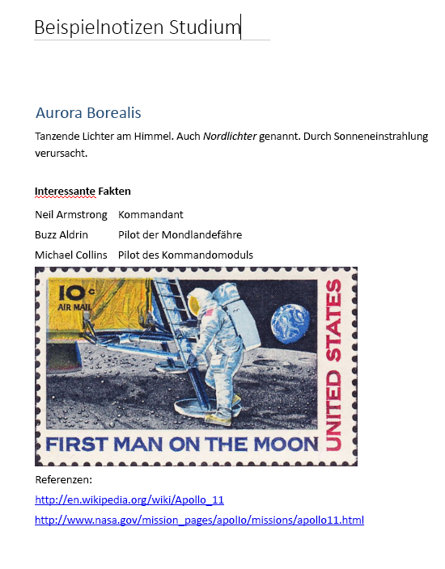

# <a name="input-and-output-html-in-onenote-pages"></a>Eingabe- und Ausgabe-HTML auf OneNote-Seiten

Der HTML-Code, der den Seiteninhalt und die Seitenstruktur definiert, wenn Sie eine OneNote-Seite [erstellen](onenote-create-page.md) oder [aktualisieren](onenote-update-page.md), wird *Eingabe-HTML* genannt. 

Der HTML-Code, der beim [Abrufen von Seiteninhalt](onenote-get-content.md) zurückgegeben wird, heißt *Ausgabe-HTML*. Der Ausgabe-HTML-Code entspricht nicht dem Eingabe-HTML-Code.

Die OneNote-APIs in Microsoft Graph behalten den semantischen Inhalt und die grundlegende Struktur des Eingabe-HTML-Codes bei, konvertieren diese jedoch in [unterstützte HTML-Elemente und CSS-Eigenschaften](onenote-create-page.md#supported-html-and-css-for-onenote-pages). Die APIs fügen zudem benutzerdefinierte Attribute hinzu, die OneNote-Funktionen unterstützen.
 
Dieser Artikel beschreibt die wichtigsten Elemente und Attribute von Eingabe- und Ausgabe-HTML-Codes. Es kann hilfreich sein, Eingabe-HTML-Codes zu verstehen, wenn Sie Seiteninhalte erstellen oder aktualisieren. Mit Ausgabe- HTML-Codes sollten Sie sich auskennen, wenn Sie zurückgegebene Seiteninhalte analysieren möchten. 

## <a name="body-element"></a>Textkörperelement

Der HTML-Inhalt im Textkörper der Seite repräsentiert den Seiteninhalt und die Seitenstruktur, einschließlich der Bild- und Dateiressourcen. Das **body**-Element kann die folgenden Attribute in der Eingabe- und Ausgabe-HTML enthalten.

#### <a name="input-attributes"></a>Eingabeattribute

|Eingabeattribut|Beschreibung|
|:------|:------|
| data-absolute-enabled | Gibt an, ob der Eingabe-Textkörper [absolute positioned](onenote-abs-pos.md)-Elemente unterstützt. |
| Formatvorlage | <p>Die CSS-[style](#styles)-Eigenschaften des Textkörpers. In der Ausgabe-HTML können Eingabeeinstellungen eingebettet in die entsprechenden untergeordneten Elemente zurückgegeben werden.</p><p>Hintergrundfarbe wird derzeit nicht für das **body**-Element unterstützt.</p> |
 

#### <a name="output-attributes"></a>Ausgabeattribute

|Ausgabeattribut|Beschreibung|
|:------|:------|
| data-absolute-enabled | Gibt an, ob der Textkörper [absolute positioned](onenote-abs-pos.md)-Elemente unterstützt. Immer **true** in der HTML-Ausgabe. |
| Formatvorlage | Die Eigenschaften **font-family** und **font-size** des Textkörpers. |


## <a name="div-elements"></a>Div-Elemente

**Div**-Elemente enthalten Text, Bilder und andere Inhalte. Das **div**-Element kann die folgenden Attribute in der Eingabe- und Ausgabe-HTML enthalten.

#### <a name="input-attributes"></a>Eingabeattribute

|Eingabeattribut|Beschreibung|
|:------|:------|
| data-id | Ein Verweis für das Element.<br/><br/>Wird verwendet, um [Seiteninhalt zu aktualisieren](onenote-update-page.md). |
| data-render-fallback | Die Ausweichaktion bei einem Fehler der [Extraktion](onenote-extract-data.md): **render** (Standard) oder **none**. |
| data-render-method | Die auszuführende [Extraktionsmethode](onenote-extract-data.md), z. B.:<br/>`extract.businesscard` oder `extract.recipe` |
| data-render-src | Die Inhaltsquelle für die [Extraktion](onenote-extract-data.md). |
| Formatvorlage | Die Position, Größe, Schriftart und Farbe von Eigenschaften für div: <ul><li>**Position** (nur **absolut**), **links**, **oben** und **Breite** (Höhe wird für div-Tags automatisch konfiguriert)<br/><br/>Wird verwendet, um ein [absolut positioniertes](onenote-abs-pos.md)-Div-Element zu erstellen, wenn das Div-Element ein direktes untergeordnetes Element des Textkörpers und für den Textkörper `data-absolute-enabled="true"` angegeben ist.<br/><br/>Beispiel: `<div style="position:absolute;width:360px;top:350px;left:300px" ... />`</li><li>Die CSS-[style](#styles)-Eigenschaften des Elements. In der Ausgabe-HTML werden diese Werte inline in entsprechenden untergeordneten Elementen zurückgegeben.</li></ul> |
 

Die OneNote-APIs in Microsoft Graph umschließen alle Textkörper mit mindestens einem Div. Die API erstellt ein standardmäßiges Div (mit `data-id="_default"`-Attributen), die den Textkörper enthalten, wenn:

- Das **data-absolute-enabled**-Attribut des Eingabe-Textkörper-Elements ausgelassen oder auf **false** gesetzt wird. In diesem Fall werden alle Inhalte des Textkörpers im standardmäßigen Div abgelegt.

- Das **data-absolute-enabled**-Attribut des Eingabe-Textkörper-Elements auf **true** gesetzt wird, die Eingabe HTML jedoch direkt untergeordnete Elemente enthält, die [absolute positioned](onenote-abs-pos.md)&nbsp;**div**, **img** oder **object**-Elemente sind. In diesem Fall werden untergeordnete Elemente, die keine [absolute positioned](onenote-abs-pos.md)&nbsp;**div**, **img** oder **object**-Elemente sind, im standardmäßigen Div abgelegt.


#### <a name="output-attributes"></a>Ausgabeattribute

|Ausgabeattribut|Beschreibung|
|:------|:------|
| data-id | Ein Verweis für das Element.<br/><br/>Wird verwendet, um [Seiteninhalt zu aktualisieren](onenote-update-page.md). |
| id | Eine eindeutige generierte ID für das Element. Zurückgegeben von einem [GET requests to a page's *-content*-Endpunkt ](/graph/api/page-get?view=graph-rest-1.0), wenn die `includeIDs=true`-Abfrageoption verwendet wird.<br/><br/>Wird verwendet, um [Seiteninhalt zu aktualisieren](onenote-update-page.md). |
| Formatvorlage | Die Positions- und Größeneigenschaften des div-Elements. |
 
### <a name="non-contributing-divs"></a>Nicht beitragende Divs

Wenn ein **div**-Element in der Eingabe-HTML nichts zur Seitenstruktur beiträgt und keine von OneNote verwendeten Informationen enthält,  verschiebt die API den Inhalt des div-Elements in das übergeordnete oder standardmäßige div-Element. Dieser Vorgang wird in den folgenden Beispielen dargestellt.

#### <a name="input-html"></a>Eingabe-HTML

Enthält ein nicht beitragendes, geschachteltes div-Element.

```html
<html>
    <head>
        <title>Page Title</title>
    </head>
    <body>
        <div>
            <p>Some text</p>
            <div>
                <p>More text inside a div that doesn't define page structure</p>
            </div>
        </div>
    </body>
</html>
```

#### <a name="output-html"></a>Ausgabe-HTML

> **Hinweis:** Der DIV-Inhalt wurde in die übergeordnete Div verschoben, und die geschachtelten `<div>`-Tags wurden entfernt. Die Div wäre erhalten geblieben, wenn sie semantische Informationen definiert hätte, z. B. eine **Daten-Id** (Beispiel: `<div data-id="keep-me">`).

```html
<html htmlns="https://www.w3.org/1999/xhtml" lang="en-US">
    <head>
        <title>Page Title</title>
    </head>
    <body data-absolute-enabled="true" style="font-family:Calibri;font-size:11px">
        <div data-id="_default" style="position:absolute;left:48px;top:120px;width:624px">
            <p>Some text</p>
            <p>More text inside a nested div</p>
        </div>
    </body>
</html>
```


## <a name="img-elements"></a>img-Elemente

Bilder auf OneNote-Seiten werden durch **img**-Elemente dargestellt. Das **img**-Element kann die folgenden Attribute in der Eingabe- und Ausgabe-HTML enthalten.

#### <a name="input-attributes"></a>Eingabeattribute

|Eingabeattribut|Beschreibung|
|:------|:------|
| alt | Der angegebene Alternativtext für das Bild. |
| data-id | Ein Verweis für das Element.<br/><br/>Wird verwendet, um [Seiteninhalt zu aktualisieren](onenote-update-page.md). |
| data-render-src |Es ist entweder **data-render-src** oder **src** erforderlich ist.<br/><br/>Die Webseite, die als Bitmapbild auf der OneNote-Seite gerendert werden soll:<br/><br/> - `data-render-src="https://..."` für eine öffentliche URL.<br/><br/> - `data-render-src="name:BlockName"` für ein Bild-Bestandteil im Block "Präsentation" einer [mehrteiligen Anforderung](/graph/api/section-post-pages?view=graph-rest-1.0#example).<br/><br/>Diese Methode ist nützlich, wenn die Webseite so komplex ist, dass sie nicht zuverlässig von OneNote analysiert werden kann, oder wenn für die Seite eine Anmeldung erforderlich ist.|
| data-tag | Ein [Notiztag](onenote-note-tags.md) für das Element. |
| Formatvorlage |Die Position- und Größen-Eigenschaften für das Bild: **Position** (nur **absolute**), **links**, **oben**, **Breite** und **Höhe**.<br/><br/>Die Größe kann für jedes Bild festgelegt werden.<br/><br/>Positionseigenschaften werden verwendet, um ein [absolute positioned](onenote-abs-pos.md)-Bild zu erstellen, wenn das Bild ein direktes untergeordnetes Element des Textkörpers und für den Textkörper `data-absolute-enabled="true"` angegeben ist.<br/><br/>Beispiel: ``<br/><br/>In der Ausgabe-HTML wird die Bildgröße separat in **width**- und **height**-Attributen zurückgegeben. |
| src |Es ist entweder **src** oder **data-render-src** erforderlich ist.<br/><br/>Das Bild, das auf der OneNote-Seite gerendert werden soll:<br/><br/>- `src="https://..."` für eine URL zu einem öffentlich verfügbaren Bild im Internet.<br/><br/> - `src="name:BlockName"` für einen benannten Teil in einer mehrteiligen Anforderung, die das Bild darstellt.|
| Breite, Höhe | Die Breite oder Höhe des Bilds, in Pixel, aber ohne px. Beispiel: `width="400"` |
 
> **Hinweis:** Die OneNote-APIs erkennt automatisch den Eingabe-Bildtyp und gibt ihn als **data-fullres-src-type** an die Ausgabe-HTML zurück. Daneben gibt die API auch den Bildtyp des optimierten Bilds zurück, in **data-src-type**.
 

#### <a name="output-attributes"></a>Ausgabeattribute

|Ausgabeattribut|Beschreibung|
|:------|:------|
| alt | Der angegebene Alternativtext für das Bild. |
| data-id | Ein Verweis für das Element.<br/><br/>Wird verwendet, um [Seiteninhalt zu aktualisieren](onenote-update-page.md). |
| data-index | Die Position des Bilds. Für die Unterstützung von [geteilten Bildern](#split-images). |
| data-fullres-src | Der Endpunkt für die Version der Bildressource, die ursprünglich in die Seite eingebettet war. |
| data-fullres-src-type | Der Medientyp der **data-fullres-src**-Ressource. Beispiel: `image/png` oder `image/jpeg`. |
| data-options | Der Quelltyp: **printout** für PDF-Dateien oder **splitimage** für alle anderen. Gilt nur für [geteilte Bilder](#split-images), die mit dem **data-render-src**-Attribut erstellt wurden. |
| data-render-original-src | Die ursprüngliche URL des Bilds, wenn das Quellbild aus dem öffentlichen Internet stammt und mit dem **data-render-src**-Attribut erstellt wurde. |
| data-src-type | Der Medientyp der **src**-Ressource. Beispiel: `image/png` oder `image/jpeg`. |
| data-tag | Ein [Notiztag](onenote-note-tags.md) für das Element. |
| id | Eine eindeutige generierte ID für das Element. Zurückgegeben von einem [GET requests to a page's *-content*-Endpunkt ](/graph/api/page-get?view=graph-rest-1.0), wenn die `includeIDs=true`-Abfrageoption verwendet wird.<br/><br/>Wird verwendet, um [Seiteninhalt zu aktualisieren](onenote-update-page.md). |
| src | Der Endpunkt für die Version der Bildressource, die für Webbrowser sowie mobile Geräte und Tablets optimiert wurde. |
| Formatvorlage | Die Positionseigenschaften des Bilds. |
| width, height | Die Breite oder Höhe des Bilds in Pixel. |
 

### <a name="output-html-examples-for-images"></a>Beispiele für die Ausgabe-HTML für Bilder

Ausgabe-**img**-Elemente enthalten die Endpunkte für Bilddateiressourcen und den Bildtyp (siehe  unten). Sie können separate [GET-Anforderung zu Bildressourcen-Endpunkten](/graph/api/resource-get?view=graph-rest-1.0) durchführen, um die binäre Inhalt abzurufen.

```html

```

Standardmäßig können Bilder nicht direkt in einem Browser gerendert werden, da sie wie die restlichen Seiteninhalte privat sind und eine Autorisierung erforderlich ist, um sie abzurufen. Um Öffentliche URLs für die Bildressourcen auf einer Seite zu erhalten, fügen Sie **preAuthenticated=true** in die Abfragezeichenfolge ein, wenn Sie die Seiteninhalte abrufen (Beispiel: `GET ../pages/{page-id}/content?preAuthenticated=true`). Die öffentlichen URLs, die zurückgegeben werden, sind eine Stunde lang gültig. 

#### <a name="image-with-public-url-when-preauthenticatedtrue-is-included-in-the-request"></a>Bild mit öffentlichen URL, wenn _vorauthentifiziert = True_ in der Anfrage enthalten ist

```html

```

Die folgenden Beispiele zeigen, welche Informationen ein **img**-Element in der Ausgabe-HTML enthalten kann.

#### <a name="image-with-web-ready-and-high-resolution-resources"></a>Bild mit webfähigen Ressourcen in hoher Auflösung

```html

```

#### <a name="image-created-by-using-the-data-render-src-attribute"></a>Mit dem *data-render-src*-Attribut erstelltes Bild

```html

```

### <a name="split-images"></a>Aufteilen von Bildern

Bilder, die mit dem **data-render-src**-Attribut (aus einer Webseiten-URL oder einem benannten Teil) erstellt werden, werden für eine bessere Leistung und ein besseres Rendering möglicherweise in aus mehreren Komponenten bestehende Bilder aufgeteilt. Komponenten-Bildern wird allen der gleiche **data-id**-Wert zugewiesen. Jedes Komponenten-Bild verfügt über ein nullbasiertes data-index-Attribut, welches das ursprüngliche vertikale Layout definiert.

#### <a name="split-image-with-three-component-images"></a>Aufgeteiltes Bild mit drei Komponentenbildern

```html
<div data-id="multi-component-image" style="position:absolute;left:48px;top:120px;width:624px">
    
    
    
</div>
```

Da Benutzer die Bilder auf der Seite verschieben können, werden die Indizes möglicherweise in falscher Reihenfolge zurückgegebenen. Die Sortierung erfolgt normalerweise von oben nach unten auf der Y-Achse und von links nach rechts auf der X-Achse, wenn es Konflikte mit der Y-Sortierung gibt.

## <a name="iframe-elements"></a>iframe-Elemente

OneNote-Seiten können eingebettete Videos enthalten, die durch **iframe**-Elemente dargestellt werden. 

> **Hinweis:** Sie können auch [eine Videodatei mithilfe eines **object**-Elements](onenote-images-files.md#adding-files) anfügen.

#### <a name="input-attributes"></a>Eingabeattribute

|Eingabeattribut|Beschreibung|
|:------|:------|
| data-original-src | Erforderlich. Die URL der Videoquelle. Siehe [Liste der unterstützten Videoquellen](onenote-images-files.md#adding-videos). <br/><br/>Beispiel: `data-original-src="https://www.youtube.com/watch?v=3Ztr44aKmQ8"` |
| Breite, Höhe | Die Breite oder Höhe des iframe in Pixel. Beispiel: `width=300` |

#### <a name="output-attributes"></a>Ausgabeattribute

|Ausgabeattribut|Beschreibung|
|:------|:------|
| data-original-src | Die URL der Videoquelle. |
| src | Ein Link zu dem Video, das in die OneNote-Seite eingebettet ist. |
| Breite, Höhe | Die Breite oder Höhe des iframe in Pixel.<br/><br/>Beispiel: `width=300` |
 
### <a name="output-html-example-for-videos"></a>Beispiel für eine Ausgabe-HTML eines Videos

Ausgabe-**iframe**-Elemente enthalten Endpunkte, die wie dargestellt auf die Quellseite und das Video verweisen. 

```html
<iframe 
    width="340" height="280" 
    data-original-src="https://www.youtube.com/watch?v=3Ztr44aKmQ8" 
    src="https://www.youtube.com/embed/3Ztr44aKmQ8?feature=oembed&autoplay=true" />
``` 

## <a name="object-elements"></a>Object-Elemente

OneNote-Seiten können Dateianlagen enthalten, die durch **object**-Elemente dargestellt werden. Das **object**-Element kann die folgenden Attribute in der Eingabe- und Ausgabe-HTML enthalten.

> **Hinweis:** OneNote-APIs können auch Dateiinhalte als Bilder auf einer Seite rendern, wenn die Datei als Bild gesendet und das Attribut **data-render-src** verwendet wird.
> Beispiel: ``
 

#### <a name="input-attributes"></a>Eingabeattribute

|Eingabeattribut|Beschreibung|
|:------|:------|
| data | Erforderlich. Der Name des Teils, der die Datei in der [mehrteiligen Anforderung](/graph/api/section-post-pages?view=graph-rest-1.0#example) darstellt. |
| data-attachment | Erforderlich. Der Dateiname. |
| data-id | Ein Verweis für das Element.<br/><br/>Wird verwendet, um [Seiteninhalt zu aktualisieren](onenote-update-page.md). |
| Formatvorlage | Die Position- und Größen-Eigenschaften für das Objekt: **Position** (nur **absolute**), **links**, **oben** und **Breite**.<br/><br/>Wird verwendet, um ein [absolut positioniertes](onenote-abs-pos.md)-Object-Element zu erstellen, wenn das Object-Element ein direktes untergeordnetes Element des Textkörpers und für den Textkörper `data-absolute-enabled="true"` angegeben ist.<br/><br/>Beispiel: `<object style="position:absolute;top:350px;left:300px" ... />` |
| type | Erforderlich.<br/><br/>Der standardmäßige Mediendateityp. Bei bekannten Dateitypen wird das dem Dateityp zugeordnete Symbol auf der OneNote-Seite angezeigt. Bei unbekannten Dateitypen wird ein generisches Symbol angezeigt. |
<!--todo: add link to known file types--> 

#### <a name="output-attributes"></a>Ausgabeattribute

|Ausgabeattribut|Beschreibung|
|:------|:------|
| data | Der Endpunkt für die Dateiressource. |
| data-attachment | Der Dateiname. |
| data-id | Ein Verweis für das Element.<br/><br/>Wird verwendet, um [Seiteninhalt zu aktualisieren](onenote-update-page.md). |
| id | Eine eindeutige generierte ID für das Element. Zurückgegeben von einem [GET requests to a page's *-content*-Endpunkt ](/graph/api/page-get?view=graph-rest-1.0), wenn die `includeIDs=true`-Abfrageoption verwendet wird.<br/><br/>Wird verwendet, um [Seiteninhalt zu aktualisieren](onenote-update-page.md). |
| Formatvorlage | Die Positionseigenschaften des Objekts. |
| type | Der standardmäßige Mediendateityp. |
 

#### <a name="output-html-example-for-objects"></a>Beispiel für Ausgabe-HTML für Objekte

Ausgabe-**object**-Elemente enthalten Endpunkte, die wie dargestellt auf Dateiressourcen auf der Seite verweisen. Sie können separate [GET-Anforderung zu Dateiressourcen-Endpunkten](/graph/api/resource-get?view=graph-rest-1.0) durchführen, um die binäre Inhalt abzurufen.

```html
<object
    data="https://graph.microsoft.com/v1.0/me/onenote/resources/{file-id}/$value"
    data-attachment="fileName.pdf" 
    type="application/pdf" 
    [style="..."] />
``` 

## <a name="paragraphs-and-headings"></a>Absätze und Überschriften

Absätze, Überschriften und andere Textcontainer können die folgenden Attribute in der Eingabe- und Ausgabe-HTML enthalten.

#### <a name="input-attributes"></a>Eingabeattribute

|Eingabeattribut|Beschreibung|
|:------|:------|
| data-id | Ein Verweis für das Element.<br/><br/>Wird verwendet, um [Seiteninhalt zu aktualisieren](onenote-update-page.md). |
| data-tag | Ein  [Notiztag ](onenote-note-tags.md) für ein **p**- oder **h1** - **h6**-Element. |
| Formatvorlage | Die CSS-[style](#styles)-Eigenschaften des Elements. |
 

#### <a name="output-attributes"></a>Ausgabeattribute

|Ausgabeattribut|Beschreibung|
|:------|:------|
| data-id | Ein Verweis für das Element.<br/><br/>Wird verwendet, um [Seiteninhalt zu aktualisieren](onenote-update-page.md). |
| data-tag | Ein  [Notiztag ](onenote-note-tags.md) für ein **p**- oder **h1** - **h6**-Element. |
| id | Eine eindeutige generierte ID für das Element. Zurückgegeben von einem [GET requests to a page's *-content*-Endpunkt ](/graph/api/page-get?view=graph-rest-1.0), wenn die `includeIDs=true`-Abfrageoption verwendet wird.<br/><br/>Wird verwendet, um [Seiteninhalt zu aktualisieren](onenote-update-page.md). |
| Formatvorlage | Die CSS-[style](#styles)-Eigenschaften des Elements. In der Ausgabe-HTML können diese Werte eingebettet in die entsprechenden untergeordneten Elemente oder in **span**-Elementen zurückgegeben. |
 

Die folgenden Beispiele zeigen Eingabe-HTML, die verschiedene Möglichkeiten zum Definieren von Formatvorlagen für Textcontainer verwendet, und die zurückgegebene Ausgabe-HTML.

#### <a name="input-html-with-styles-defined-using-inline-character-styles-in-the-start-tag-and-within-a-span-element"></a>Eingabe-HTML, in der Formatvorlagen mit Inlinezeichenformaten, im Starttag und in einem span-Element definiert sind.

```html
<h1>Heading <i>One</i> text</h1>
<p style="font-size:8pt;color:green;font-family:Courier;text-align:center">Some text</p>
<p>Some <span  style="font-size:16px;color:#ff0000;font-family:Segoe UI Black">more</span> text</p>
``` 

#### <a name="output-html-with-the-i-character-style-and-the-font-settings-in-the-p-start-tag-returned-as-inline-css-styles-on-span-elements"></a>Ausgabe-HTML, in der das `<i>`-Zeichenformat und die Schriftarteinstellungen im `<p>`-Starttag als Inline-CSS-Formate in span-Elementen zurückgegeben werden.

```html
<h1 style="font-size:16pt;color:#1e4e79;margin-top:11pt;margin-bottom:11pt">Heading <span style="font-style:italic">One</span> text</h1>
<p style="text-align:center"><span style="font-family:Courier;font-size:8pt;color:green">Some text</span></p>
<p>Some <span style="font-family:Segoe UI Black;font-size:12pt;color:red">more</span> text</p>
``` 


## <a name="lists"></a>Listen

Listen werden als **ol**- oder **ul**-Elemente dargestellt, die **li**-Elemente enthalten.

Listen und Listenelemente können die folgenden Attribute in der Eingabe- und Ausgabe-HTML enthalten.

#### <a name="input-attributes"></a>Eingabeattribute

|Eingabeattribut|Beschreibung|
|:------|:------|
| data-id | Ein Verweis für das Element.<br/><br/>Wird verwendet, um [Seiteninhalt zu aktualisieren](onenote-update-page.md). |
| data-tag | Ein [Notiztag](onenote-note-tags.md) für ein **ul**-, **ol**- oder **li**-Element. |
| Formatvorlage | Die **list-style-type**- und die CSS-[style](#styles)-Eigenschaften für die Liste oder das Listenelement. |
 

#### <a name="output-attributes"></a>Ausgabeattribute

|Ausgabeattribut|Beschreibung|
|:------|:------|
| data-id | Ein Verweis für das Element.<br/><br/>Wird verwendet, um [Seiteninhalt zu aktualisieren](onenote-update-page.md). |
| data-tag |  Ein [Notiztag](onenote-note-tags.md) für ein span-Objekt in einem **li**-Element. |
| id | Eine eindeutige generierte ID für das Element. Zurückgegeben von einem [GET requests to a page's *-content*-Endpunkt ](/graph/api/page-get?view=graph-rest-1.0), wenn die `includeIDs=true`-Abfrageoption verwendet wird.<br/><br/>Wird verwendet, um [Seiteninhalt zu aktualisieren](onenote-update-page.md). |
| Formatvorlage | Die **list-style-type**- und CSS-[style](#styles)-Eigenschaften des Elements. In der Ausgabe HTML werden die Listenebene-Einstellungen an die  Listenelemente zurückgegeben. Standard-Eigenschaften werden nicht zurückgegeben. |
 
### <a name="list-styles"></a>Listenformatvorlagen

Die OneNote-APIs in Microsoft Graph unterstützen die folgenden Listentypen:

|Sortierte Liste|Unsortierte Liste|
|:------|:------|
| keine | Keine |
| 
decimal (Standard) | 
disc (Standard) |
| lower-alpha | circle |
| lower-roman | 

square |
| 
upper-alpha | &nbsp; |
| upper-roman | &nbsp; |
 
Sie können globale Formatvorlagen für eine Liste im **ol**- oder **ul**-Element in der Eingabe-HTML anwenden, aber Formatvorlagen werden in den **li**-Elementen zurückgegeben.

#### <a name="homogenous-list-style"></a>Homogene Listenformatvorlage

Dieses Beispiel zeigt Eingabe-HTML, die den Listenformattyp im **ol**-Element und CSS-Formatvorlagen in einzelnen Listenelementen festlegt.

```html
<ol style="list-style-type:upper-roman;color:blue">
    <li style="font-weight:bold">Jacksonville</li>
    <li style="text-decoration:line-through">Orlando</li>
    <li style="font-family:Courier">Naples</li>
</ol>
``` 

Dies ist die Ausgabe-HTML. Beachten Sie, dass Formatvorlagen inline in den einzelnen **li**- oder **span**-Elementen zurückgegeben werden.

```html
<ol>
    <li style="list-style-type:upper-roman"><span style="color:blue;font-weight:bold">Jacksonville</span></li>
    <li style="list-style-type:upper-roman"><span style="color:blue;text-decoration:line-through">Orlando</span></li>
    <li style="list-style-type:upper-roman"><span style="font-family:Courier;color:blue">Naples</span></li>
</ol>
``` 

#### <a name="variable-list-styles"></a>Variable Listenelementvorlagen

Dieses Beispiel zeigt Eingabe-HTML, die verschiedene Listenformattypen in den **li**-Elementen festlegt.

```html
<ul style="font-style:italic">
    <li style="list-style-type:square">square style</li>
    <li style="list-style-type:circle">circle style</li>
    <li style="list-style-type:disc">disc style (default)</li>
</ul>
``` 

Dies ist die Ausgabe-HTML. Beachten Sie, dass Formatvorlagen inline in den einzelnen **li**- oder **span**-Elementen zurückgegeben werden.

```html
<ul>
    <li style="list-style-type:square"><span style="font-style:italic">square style</span></li>
    <li style="list-style-type:circle"><span style="font-style:italic">circle style</span></li>
    <li><span style="font-style:italic">disc style (default)</span></li>
</ul>
``` 


## <a name="tables"></a>Tabellen

Tabellen werden als **table**-Elemente dargestellt, die **tr**- und **td**-Elemente enthalten können. Geschachtelte Tabellen werden unterstützt.

Tabellen können die folgenden Attribute in der Eingabe- und Ausgabe-HTML enthalten. Die OneNote-APIs unterstützen keine **rowspan**- oder **colspan**-Attribute. 

#### <a name="input-attributes"></a>Eingabeattribute

|Eingabeattribut|Beschreibung|
|:------|:------|
| data-id | Ein Verweis für das Element.<br/><br/>Wird verwendet, um [Seiteninhalt zu aktualisieren](onenote-update-page.md). |
| Formatvorlage | Die CSS-[style](#styles)-Eigenschaften des Elements und:<br/> - **border**. Kann entweder 0px oder 1px sein.<br/> - **width**. **width**. Unterstützt von **table** und td als Pixel oder Prozentsatz der Seitenbreite.<br/><br/>Beispiele: `width="100px"` oder `width="60%"` |
 

#### <a name="output-attributes"></a>Ausgabeattribute

|Ausgabeattribut|Beschreibung|
|:------|:------|
| data-id | Ein Verweis für das Element.<br/><br/>Wird verwendet, um [Seiteninhalt zu aktualisieren](onenote-update-page.md). |
| id | Eine eindeutige generierte ID für das Element. Zurückgegeben von einem [GET requests to a page's *-content*-Endpunkt ](/graph/api/page-get?view=graph-rest-1.0), wenn die `includeIDs=true`-Abfrageoption verwendet wird.<br/><br/>Wird verwendet, um [Seiteninhalt zu aktualisieren](onenote-update-page.md). |
| Formatvorlage | Die CSS-[style](#styles)-Eigenschaften des Elements. |
 

Die folgenden Beispiele zeigen Eingabe-HTML, die verschiedene Möglichkeiten zum Definieren von Formatvorlagen für Tabellen verwendet, und die zurückgegebene Ausgabe-HTML.

#### <a name="input-html-with-optional-settings-at-different-levels"></a>Eingabe HTML mit optionalen Einstellungen auf verschiedenen Ebenen

```html
<table style="border:0px;width:500px;background-color:green">
    <tr> 
        <td>Cell 1</td> 
        <td>Cell 2</td> 
        <td>Cell 3</td> 
    </tr> 
    <tr style="background-color:blue"> 
        <td style="text-align:right;background-color:red">Left</td> 
        <td style="text-align:center">Middle</td> 
        <td>Right</td> 
    </tr> 
</table>
```
 
#### <a name="output-html-with-css-styles-returned-inline-on-the-td-elements"></a>Ausgabe-HTML mit inline in td-Elementen zurückgegebenen CSS-Formatvorlagen

```html
<table style="border:0px">
    <tr>
        <td style="background-color:green;width:166;border:0px">Cell 1</td>
        <td style="background-color:green;width:166;border:0px">Cell 2</td>
        <td style="background-color:green;width:166;border:0px">Cell 3</td>
    </tr>
    <tr>
        <td style="background-color:red;width:166;border:0px;text-align:right">Left</td>
        <td style="background-color:blue;width:166;border:0px;text-align:center">Middle</td>
        <td style="background-color:blue;width:166;border:0px">Right</td>
    </tr>
</table>
``` 


## <a name="styles"></a>Formatvorlagen

OneNote APIs in Microsoft Graph unterstützt die folgenden Inline-CSS-**style**-Eigenschaften für Elemente im Seitentextkörper, wie **body**, **div**, **p**, **li** und **span**.

|Eigenschaft|Beispiel|
|:------|:------|
| background-color | `style="background-color:#66cc66"` (Standardwert ist Weiß)<br/><br/>Das hexadezimale Format und benannte Farben werden unterstützt. |
| color | `style="color:#ffffff"` (Standardwert ist Schwarz) |
| font-family | `style="font-family:Courier"` (Standardwert ist Calibri) |
| font-size | `style="font-size:10pt"` (Standardwert ist 11pt)<br/><br/>Die APIs akzeptieren den Schriftgrad in *pt* oder *px*, *px* wird jedoch zu *pt* konvertiert. Dezimalwerte werden auf die nächste n.0pt oder n.5pt gerundet. |
| font-style | `style="font-style:italic"`(nur normal oder kursiv) |
| font-weight | `style="font-weight:bold"`(nur normal oder fett) |
| strike-through | `style="text-decoration:line-through"` |
| text-align | `style="text-align:center"`(nur für Blockelementen) |
| text-decoration | `style="text-decoration:underline"`(nur keine oder unterstrichen) |
 

Die folgenden Inlinezeichenformate werden ebenfalls unterstützt:

<table id="simpletable">
<tr>
<td id="simplecell"><b></td>
<td id="simplecell"><i></td>
<td id="simplecell"><u></td>
</tr>
<tr>
<td id="simplecell"><em></td>
<td id="simplecell"><strong></td>
<td id="simplecell"><strike></td>
</tr>
<tr>
<td id="simplecell"><sup></td>
<td id="simplecell"><sub></td>
<td id="simplecell"><del></td>
</tr>
<tr>
<td id="simplecell"><cite></td>
<td id="simplecell">&nbsp;</td>
<td id="simplecell">&nbsp;</td>
</tr>
</table>

 
## <a name="input-and-output-html-example"></a>Beispiel für Eingabe- und Ausgabe-HTML

Die folgende Abbildung zeigt eine einfache Seite, die mit der Microsoft Graph erstellt wurde.



Dabei handelt es sich um die Eingabe-HTML, die im Nachrichtentextkörper gesendet wurde, um die Seite zu erstellen.

```html
<html lang="en-US">
    <head>
        <title>Sample Study Notes</title>
        <meta name="created" content="2015-01-01T01:01"/>
    </head>
    <body>
        <h1>Aurora Borealis</h1>
        <p>Dancing lights in the sky. Also called <i>Northern Lights</i>. Caused by solar radiation.</p>
        <br />
        <p><b>Intersting facts</b></p>
        <table>
            <tr>
                <td>Neil Armstrong</td>
                <td>Commander</td>
            </tr>
            <tr>
                <td>Buzz Aldrin</td>
                <td>LM Pilot</td>
            </tr>
            <tr>
                <td>Michael Collins</td>
                <td>Command Module Pilot</td>
            </tr>
        </table>
        
        <p>References:</p>
        <p><a href="https://en.wikipedia.org/wiki/Apollo_11">https://en.wikipedia.org/wiki/Apollo_11</a></p>
        <p><a href="https://www.nasa.gov/mission_pages/apollo/missions/apollo11.html">https://www.nasa.gov/mission_pages/apollo/missions/apollo11.html</a></p>
    </body>
</html>
``` 

<br/>

Im Folgenden sehen Sie die Ausgabe-HTML, die die Microsoft Graph zurückgibt, wenn Sie [den Seiteninhalt abrufen](onenote-get-content.md).

> **Hinweis:** Wenn Sie [eine Seite erstellen](onenote-create-page.md) oder [die Metadaten einer Seite abrufen](/graph/api/page-get?view=graph-rest-1.0), gibt die API die *Inhalte*-Endpunkt-URL der Seite in der **contentUrl**Eigenschaft zurück.

```html
<html htmlns="https://www.w3.org/1999/xhtml" lang="en-US">
    <head>
        <title>Sample Study Notes</title>
    </head>
    <body data-absolute-enabled="true" style="font-family:Calibri;font-size:11pt">
        <div data-id="_default" style="position:absolute;left:48px;top:120px;width:624px">
            <h1 style="font-size:16pt;color:#1e4e79;margin-top:11pt;margin-bottom:11pt">American History 101: Moon Landing</h1>
            <p>First moon landing - July 20, 1969 with Apollo 11 (Eagle)</p>
            <br />
            <p><span style="font-weight:bold">Apollo 11 Astronauts</span></p>
            <table style="border:0px">
                <tr>
                    <td style="border:0px">Neil Armstrong</td>
                    <td style="border:0px">Commander</td>
                </tr>
                <tr>
                    <td style="border:0px">Buzz Aldrin</td>
                    <td style="border:0px">LM Pilot</td>
                </tr>
                <tr>
                    <td style="border:0px">Michael Collins</td>
                    <td style="border:0px">Command Module Pilot</td>
                </tr>
            </table>
            <br />
            
            <p>References:</p>
            <p><a href="https://en.wikipedia.org/wiki/Apollo_11">https://en.wikipedia.org/wiki/Apollo_11</a></p>
            <p><a href="https://www.nasa.gov/mission_pages/apollo/missions/apollo11.html">https://www.nasa.gov/mission_pages/apollo/missions/apollo11.html</a></p>
        </div>
    </body>
</html>
``` 

## <a name="see-also"></a>Siehe auch

- [Abrufen von OneNote-Inhalt und -Struktur](onenote-get-content.md)
- [Erstellen von OneNote-Seiten](onenote-create-page.md)
- [Aktualisieren der Inhalte von OneNote-Seiten](onenote-update-page.md)
- [Hinzufügen von Bildern, Videos und Dateien](onenote-images-files.md)
