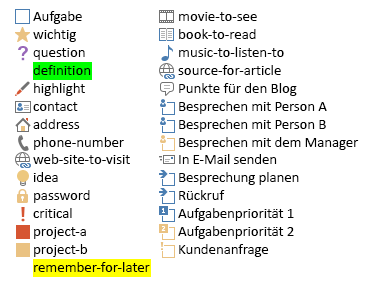

# <a name="use-note-tags-in-onenote-pages"></a><span data-ttu-id="8b163-103">Verwenden von Notiztags auf OneNote-Seiten</span><span class="sxs-lookup"><span data-stu-id="8b163-103">Use note tags in OneNote pages</span></span>

<span data-ttu-id="8b163-104">**Gilt für** Heimanwender-Notizbücher in OneDrive | Unternehmensnotizbücher in Office 365</span><span class="sxs-lookup"><span data-stu-id="8b163-104">**Applies to** Consumer notebooks on OneDrive | Enterprise notebooks on Office 365</span></span>

<span data-ttu-id="8b163-105">Verwenden Sie das `data-tag`-Attribut zum Hinzufügen und Aktualisieren von Kontrollkästchen, Sternen und anderen integrierten Notiztags auf einer OneNote-Seite, wie in der folgenden Abbildung gezeigt.</span><span class="sxs-lookup"><span data-stu-id="8b163-105">Use the `data-tag` attribute to add and update check boxes, stars, and other built-in note tags on a OneNote page, as shown in the following image.</span></span>


<a name="attributes"></a>

## <a name="note-tag-attributes"></a><span data-ttu-id="8b163-107">Notiztag-Attribute</span><span class="sxs-lookup"><span data-stu-id="8b163-107">Note tag attributes</span></span>

<span data-ttu-id="8b163-108">Ein Notiztag wird im HTML-Code einer OneNote-Seite durch das `data-tag`-Attribut dargestellt.</span><span class="sxs-lookup"><span data-stu-id="8b163-108">In the HTML of a OneNote page, a note tag is represented by the `data-tag` attribute.</span></span> <span data-ttu-id="8b163-109">Beispiel:</span><span class="sxs-lookup"><span data-stu-id="8b163-109">For example:</span></span>

- <span data-ttu-id="8b163-110">Ein deaktiviertes Aufgabenfeld:  `<p data-tag="to-do">`</span><span class="sxs-lookup"><span data-stu-id="8b163-110">An unchecked to-do box:  `<p data-tag="to-do">`</span></span> 

- <span data-ttu-id="8b163-111">Ein aktiviertes Aufgabenfeld:  `<p data-tag="to-do:completed">`</span><span class="sxs-lookup"><span data-stu-id="8b163-111">A checked to-do box:  `<p data-tag="to-do:completed">`</span></span> 

- <span data-ttu-id="8b163-112">Ein Stern:  `<h2 data-tag="important">`</span><span class="sxs-lookup"><span data-stu-id="8b163-112">A star:  `<h2 data-tag="important">`</span></span> 

<span data-ttu-id="8b163-113">Ein `data-tag`-Wert besteht aus einem Shape und manchmal einem Status (siehe [unterstützte Werte](#built-in-note-tags-for-onenote).)</span><span class="sxs-lookup"><span data-stu-id="8b163-113">A `data-tag` value is composed of a shape, and sometimes a status (see all [supported values](#built-in-note-tags-for-onenote)).</span></span>

| <span data-ttu-id="8b163-114">Eigenschaft</span><span class="sxs-lookup"><span data-stu-id="8b163-114">Property</span></span> | <span data-ttu-id="8b163-115">Beschreibung</span><span class="sxs-lookup"><span data-stu-id="8b163-115">Description</span></span> |  
|:------|:------|  
| <span data-ttu-id="8b163-116">shape</span><span class="sxs-lookup"><span data-stu-id="8b163-116">shape</span></span> | <span data-ttu-id="8b163-117">Der Bezeichner für das Notiztag (Beispiel: `to-do` oder `important`).</span><span class="sxs-lookup"><span data-stu-id="8b163-117">The identifier of the note tag (example: `to-do` or `important`).</span></span> |  
| <span data-ttu-id="8b163-118">status</span><span class="sxs-lookup"><span data-stu-id="8b163-118">status</span></span> | <span data-ttu-id="8b163-119">Der Status der Kontrollkästchen von Notiztags.</span><span class="sxs-lookup"><span data-stu-id="8b163-119">The status of check box note tags.</span></span> <span data-ttu-id="8b163-120">Dies wird nur dazu verwendet, die Kontrollkästchen als abgeschlossen zu kennzeichnen.</span><span class="sxs-lookup"><span data-stu-id="8b163-120">This is used only to set check boxes as completed.</span></span> |  
 

<a name="note-tags"></a>

## <a name="add-or-update-note-tags"></a><span data-ttu-id="8b163-121">Hinzufügen oder Aktualisieren von Notiztags</span><span class="sxs-lookup"><span data-stu-id="8b163-121">Add or update note tags</span></span>

<span data-ttu-id="8b163-122">Verwenden Sie zum Hinzufügen oder Aktualisieren eines integrierten Notiztags das `data-tag`-Attribut für ein unterstütztes Element.</span><span class="sxs-lookup"><span data-stu-id="8b163-122">To add or update a built-in note tag, just use the `data-tag` attribute on a supported element.</span></span> <span data-ttu-id="8b163-123">Im Folgenden ist z. B. ein Absatz als wichtig gekennzeichnet:</span><span class="sxs-lookup"><span data-stu-id="8b163-123">For example, here's a paragraph marked as important:</span></span>

```html
<p data-tag="important">...</p>
```

<span data-ttu-id="8b163-124">Trennen Sie mehrere Notiztags durch Kommas:</span><span class="sxs-lookup"><span data-stu-id="8b163-124">Separate multiple note tags with commas:</span></span>

```html
<p data-tag="important, critical">...</p>
```

<span data-ttu-id="8b163-125">Sie können ein `data-tag` für die folgenden Elemente definieren:</span><span class="sxs-lookup"><span data-stu-id="8b163-125">You can define a `data-tag` on the following elements:</span></span>

- <span data-ttu-id="8b163-126">p</span><span class="sxs-lookup"><span data-stu-id="8b163-126">p</span></span> 
- <span data-ttu-id="8b163-127">ul, ol, li (weitere Informationen zu [Notiztags in Listen](#note-tags-on-lists))</span><span class="sxs-lookup"><span data-stu-id="8b163-127">ul, ol, li (see more about [note tags on lists](#note-tags-on-lists))</span></span>
- <span data-ttu-id="8b163-128">img</span><span class="sxs-lookup"><span data-stu-id="8b163-128">img</span></span> 
- <span data-ttu-id="8b163-129">h1 – h6</span><span class="sxs-lookup"><span data-stu-id="8b163-129">h1 - h6</span></span> 
- <span data-ttu-id="8b163-130">title</span><span class="sxs-lookup"><span data-stu-id="8b163-130">title</span></span> 

<span data-ttu-id="8b163-131">Eine Liste der Notiztags, die Sie mit Microsoft Graph verwenden können, finden Sie unter [Integrierte Notiztags](#built-in-note-tags-for-onenote).</span><span class="sxs-lookup"><span data-stu-id="8b163-131">See [Built-in note tags](#built-in-note-tags-for-onenote) for a list of note tags that you can use with Microsoft Graph.</span></span> <span data-ttu-id="8b163-132">Das Hinzufügen oder Aktualisieren von benutzerdefinierten Tags mit Microsoft Graph wird nicht unterstützt.</span><span class="sxs-lookup"><span data-stu-id="8b163-132">Adding or updating custom tags using Microsoft Graph is not supported.</span></span>
 
### <a name="examples"></a><span data-ttu-id="8b163-133">Beispiele</span><span class="sxs-lookup"><span data-stu-id="8b163-133">Examples</span></span>

<span data-ttu-id="8b163-134">Im Folgenden finden Sie eine einfache Aufgabenliste, in der das erste Element abgeschlossen ist.</span><span class="sxs-lookup"><span data-stu-id="8b163-134">Here's a simple to-do list with the first item completed.</span></span>

```html 
<p data-tag="to-do:completed" data-id="prep">Till garden bed</p> 
<p data-tag="to-do" data-id="spring">Plant peas and spinach</p>
<p data-tag="to-do" data-id="summer">Plant tomatoes and peppers</p>
```

<span data-ttu-id="8b163-135">Beachten Sie, dass die oben aufgeführten `<p>`-Tags jeweils ein `data-id`-Attribut enthalten.</span><span class="sxs-lookup"><span data-stu-id="8b163-135">Note that the `<p>` tags above each include a `data-id` attribute.</span></span> <span data-ttu-id="8b163-136">Dies erleichtert das Aktualisieren der Kontrollkästchen-Notiztags.</span><span class="sxs-lookup"><span data-stu-id="8b163-136">This makes it easier to update the check box note tags.</span></span> <span data-ttu-id="8b163-137">Mit der folgenden Anforderung wird z. B. die Aufgabe Frühjahrsbepflanzung als abgeschlossen gekennzeichnet.
</span><span class="sxs-lookup"><span data-stu-id="8b163-137">For example, the following request marks the spring planting to-do item as completed.</span></span>

```json
PATCH https://graph.microsoft.com/v1.0/me/onenote/notebooks/pages/{page-id}/content

Content-Type: application/json
Authorization: Bearer {token}

[
   {
    'target':'#spring',
    'action':'replace',
    'content':'<p data-tag="to-do:completed"  data-id="spring">Plant peas and spinach</p>'
  }
]
```

<span data-ttu-id="8b163-138">Die folgende Anforderung erstellt eine Seite, die alle [integrierten Notiztags](#built-in-note-tags-for-onenote) enthält.</span><span class="sxs-lookup"><span data-stu-id="8b163-138">The following request creates a page that contains all [built-in note tags](#built-in-note-tags-for-onenote).</span></span>

```html 
POST https://graph.microsoft.com/v1.0/me/onenote/notebooks/pages

Content-Type: text/html
Authorization: Bearer {token}


<!DOCTYPE html>
<html>
  <head>
    <title data-tag="to-do:completed">All built-in note tags</title>
  </head>
  <body>
    <h1 data-tag="important">Paragraphs with built-in note tags</h1>
    <p data-tag="to-do">to-do</p>
    <p data-tag="important">important</p>
    <p data-tag="question">question</p>
    <p data-tag="definition">definition</p>
    <p data-tag="highlight">highlight</p>
    <p data-tag="contact">contact</p>
    <p data-tag="address">address</p>
    <p data-tag="phone-number">phone-number</p>
    <p data-tag="web-site-to-visit">web-site-to-visit</p>
    <p data-tag="idea">idea</p>
    <p data-tag="password">password</p>
    <p data-tag="critical">critical</p>
    <p data-tag="project-a">project-a</p>
    <p data-tag="project-b">project-b</p>
    <p data-tag="remember-for-later">remember-for-later</p>
    <p data-tag="movie-to-see">movie-to-see</p>
    <p data-tag="book-to-read">book-to-read</p>
    <p data-tag="music-to-listen-to">music-to-listen-to</p>
    <p data-tag="source-for-article">source-for-article</p>
    <p data-tag="remember-for-blog">remember-for-blog</p>
    <p data-tag="discuss-with-person-a">discuss-with-person-a</p>
    <p data-tag="discuss-with-person-b">discuss-with-person-b</p>
    <p data-tag="discuss-with-manager">discuss-with-manager</p>
    <p data-tag="send-in-email">send-in-email</p>
    <p data-tag="schedule-meeting">schedule-meeting</p>
    <p data-tag="call-back">call-back</p>
    <p data-tag="to-do-priority-1">to-do-priority-1</p>
    <p data-tag="to-do-priority-2">to-do-priority-2</p>
    <p data-tag="client-request">client-request</p>
    <h1 data-tag="important">Paragraphs with check boxes marked with "completed" status</h1>
    <p data-tag="to-do:completed">to-do:completed</p>
    <p data-tag="discuss-with-person-a:completed">discuss-with-person-a:completed</p>
    <p data-tag="discuss-with-person-b:completed">discuss-with-person-b:completed</p>
    <p data-tag="discuss-with-manager:completed">discuss-with-manager:completed</p>
    <p data-tag="schedule-meeting:completed">schedule-meeting:completed</p>
    <p data-tag="call-back:completed">call-back:completed</p>
    <p data-tag="to-do-priority-1:completed">to-do-priority-1:completed</p>
    <p data-tag="to-do-priority-2:completed">to-do-priority-2:completed</p>
    <p data-tag="client-request:completed">client-request:completed</p>
    <h1 data-tag="important">Multiple note tags</h1>
    <p data-tag="project-a,  client-request:completed">Two note tags:  project-a, client-request:completed</p>
    <p data-tag="idea, send-in-email, question">Three note tags:  idea, send-in-email, question</p>
    <h1 data-tag="important">Using note tags with other elements</h1>
    <p><b>Note tag on a list item:</b></p>
    <ul>
      <li data-tag="to-do-priority-1:completed">Make a to-do list</li>
    </ul>
    <p><b>Note tag on an image:</b></p>
    
    <p><b>Note tag with embedded style:</b></p>
    <p data-tag="important">Next time, <b>don't</b> forget to invite <span style="background-color:yellow">Dan</span>.</p>
  </body>
</html>
``` 

<span data-ttu-id="8b163-139">Weitere Informationen zum Erstellen von Seiten finden Sie unter [Erstellen von OneNote-Seiten](onenote-create-page.md).</span><span class="sxs-lookup"><span data-stu-id="8b163-139">For more information about creating pages, see [Create OneNote pages](onenote-create-page.md).</span></span> <span data-ttu-id="8b163-140">Weitere Informationen zum Aktualisieren von Seiten finden Sie unter [Aktualisieren von OneNote-Seiten](onenote-update-page.md).</span><span class="sxs-lookup"><span data-stu-id="8b163-140">For more about updating pages, see [Update OneNote pages](onenote-update-page.md).</span></span>


<a name="note-tags-lists"></a>

## <a name="note-tags-on-lists"></a><span data-ttu-id="8b163-141">Notiztags in Listen</span><span class="sxs-lookup"><span data-stu-id="8b163-141">Note tags on lists</span></span>

<span data-ttu-id="8b163-142">Hier sind einige Richtlinien für das Arbeiten mit Notiztags in Listen:</span><span class="sxs-lookup"><span data-stu-id="8b163-142">Here are some guidelines for working with note tags on lists:</span></span>

- <span data-ttu-id="8b163-143">Verwenden Sie `p`-Elemente für Aufgabenlisten.</span><span class="sxs-lookup"><span data-stu-id="8b163-143">Use `p` elements for to-do lists.</span></span> <span data-ttu-id="8b163-144">Sie zeigen keine Aufzählungen oder Nummern an und können einfacher aktualisiert werden.</span><span class="sxs-lookup"><span data-stu-id="8b163-144">They don't display a bullet or number, and they're easier to update.</span></span>

- <span data-ttu-id="8b163-145">Zum Erstellen oder Aktualisieren von Listen, die **dasselbe** Notiztag für alle Listenelemente anzeigen, definieren Sie `data-tag` in `ul` oder `ol`.</span><span class="sxs-lookup"><span data-stu-id="8b163-145">To create or update lists that display the **same** note tag for all list items, define `data-tag` on the `ul` or `ol`.</span></span> <span data-ttu-id="8b163-146">Um die gesamte Liste zu aktualisieren, müssen Sie `data-tag` für `ul` oder `ol` neu definieren.</span><span class="sxs-lookup"><span data-stu-id="8b163-146">To update the entire list, you'll need to redefine `data-tag` on the `ul` or `ol`.</span></span>

- <span data-ttu-id="8b163-147">Zum Erstellen oder Aktualisieren von Listen, die ein **eindeutiges** Notiztag für einige oder alle Listenelemente anzeigen, definieren Sie `data-tag` für `li`-Elemente, und schachteln Sie die `li`-Elemente nicht in `ul` oder `ol`.</span><span class="sxs-lookup"><span data-stu-id="8b163-147">To create or update lists that display a **unique** note tag for some or all list items, define `data-tag` on `li` elements, and don't nest the `li` elements in a `ul` or `ol`.</span></span> <span data-ttu-id="8b163-148">Um die gesamte Liste zu aktualisieren, müssen Sie das `ul`-Element, das in der HTML-Ausgabe zurückgegeben wird, entfernen und nur die ungeschachtelten `li`-Elemente zurückgeben.</span><span class="sxs-lookup"><span data-stu-id="8b163-148">To update the entire list, you'll need to remove the `ul` that's returned in the output HTML and provide only the unnested `li` elements.</span></span>

- <span data-ttu-id="8b163-149">Um bestimmte `li`-Elemente zu aktualisieren, setzen Sie die `li`-Elemente einzeln als Ziel ein und definieren Sie `data-tag` des `li`-Elements.</span><span class="sxs-lookup"><span data-stu-id="8b163-149">To update specific `li` elements, target the `li` elements individually and define the `data-tag` on the `li` element.</span></span> <span data-ttu-id="8b163-150">Ein einzeln adressiertes `li`-Element kann so aktualisiert werden, dass es ein eindeutiges Notiztag anzeigt, unabhängig davon, wie die Liste ursprünglich definiert wurde.</span><span class="sxs-lookup"><span data-stu-id="8b163-150">Any individually addressed `li` element can be updated to display a unique note tag, no matter how the list was originally defined.</span></span>

  <span data-ttu-id="8b163-151">Die Richtlinien basieren auf den folgenden Regeln, die von Microsoft Graph angewendet werden:</span><span class="sxs-lookup"><span data-stu-id="8b163-151">The guidelines are based on the following rules that are applied by Microsoft Graph:</span></span>

  - <span data-ttu-id="8b163-152">Die `data-tag`-Einstellung für ein `ul`- oder `ol`-Element überschreibt alle Einstellungen in untergeordneten `li`-Elementen.</span><span class="sxs-lookup"><span data-stu-id="8b163-152">The `data-tag` setting for a `ul` or `ol` overrides all settings on child `li` elements.</span></span> <span data-ttu-id="8b163-153">Dies gilt auch dann, wenn das `ul`- oder `ol`-Element kein `data-tag` angibt, aber seine untergeordneten `li`-Elemente dies tun.</span><span class="sxs-lookup"><span data-stu-id="8b163-153">This applies even when the `ul` or `ol` doesn't specify a `data-tag` but its child `li` elements do.</span></span>

    <span data-ttu-id="8b163-154">Wenn Sie beispielsweise ein `ul`- oder `ol`-Element erstellen, das `data-tag="project-a"` definiert, zeigen alle Listenelemente das Notiztag *Project A* an.</span><span class="sxs-lookup"><span data-stu-id="8b163-154">For example, if you create a `ul` or `ol` that defines `data-tag="project-a"`, all its list items will display the *Project A* note tag.</span></span> <span data-ttu-id="8b163-155">Wenn dagegen das `ul`- oder `ol`-Element kein `data-tag` definiert, zeigt keines seiner Elemente ein Notiztag an.</span><span class="sxs-lookup"><span data-stu-id="8b163-155">Or if the `ul` or `ol` doesn't define a `data-tag`, none of its items will display a note tag.</span></span> <span data-ttu-id="8b163-156">Diese Außerkraftsetzung geschieht unabhängig von expliziten Einstellungen in untergeordneten `li`-Elementen.</span><span class="sxs-lookup"><span data-stu-id="8b163-156">This override happens regardless of any explicit settings on child `li` elements.</span></span>

- <span data-ttu-id="8b163-157">Eindeutige `data-tag`-Einstellungen werden für Listenelemente unter den folgenden Bedingungen berücksichtigt:</span><span class="sxs-lookup"><span data-stu-id="8b163-157">Unique `data-tag` settings are honored for list items under the following conditions:</span></span>

  - <span data-ttu-id="8b163-158">Die `li`-Elemente sind nicht in einem `ul` oder `ol` in einer Erstellungs- oder Aktualisierungsanforderung geschachtelt.</span><span class="sxs-lookup"><span data-stu-id="8b163-158">The `li` elements are not nested in a `ul` or `ol` in a create or update request.</span></span>

  - <span data-ttu-id="8b163-159">Ein `li`-Element wird einzeln in einer Aktualisierungsanforderung adressiert.</span><span class="sxs-lookup"><span data-stu-id="8b163-159">An `li` element is individually addressed in an update request.</span></span>

- <span data-ttu-id="8b163-160">Ungeschachtelte `li`-Elemente, die im Eingabe-HTML-Code gesendet wurden, werden in einem `ul` im Ausgabe-HTML-Code zurückgegeben.</span><span class="sxs-lookup"><span data-stu-id="8b163-160">Unnested `li` elements sent in input HTML are returned in a `ul` in the output HTML.</span></span>

- <span data-ttu-id="8b163-161">Im Ausgabe-HTML-Code werden alle `data-tag`-Listeneinstellungen in `span`-Elementen für die Listenelemente definiert.</span><span class="sxs-lookup"><span data-stu-id="8b163-161">In output HTML, all `data-tag` list settings are defined on `span` elements on the list items.</span></span>


<span data-ttu-id="8b163-162">Der folgende Code zeigt, wie einige dieser Regeln angewendet werden.</span><span class="sxs-lookup"><span data-stu-id="8b163-162">The following code shows how some of these rules are applied.</span></span> <span data-ttu-id="8b163-163">Der Eingabe-HTML-Code erstellt zwei Listen mit Notiztags.</span><span class="sxs-lookup"><span data-stu-id="8b163-163">The input HTML creates two lists with note tags.</span></span> <span data-ttu-id="8b163-164">Der Ausgabe-HTML-Code wird für die Listen zurückgegeben, wenn Sie den Inhalt der Seite abrufen.</span><span class="sxs-lookup"><span data-stu-id="8b163-164">The output HTML is what's returned for the lists when you retrieve page content.</span></span>

#### <a name="input-html"></a><span data-ttu-id="8b163-165">Eingabe-HTML</span><span class="sxs-lookup"><span data-stu-id="8b163-165">Input HTML</span></span>

```html 
<!--To display the same note tag on all list items, define note tags on the ul or ol.--> 
<ul data-tag="project-a" data-id="agenda">
  <li>An item with a Project A note tag</li>
  <li>An item with a Project A note tag</li>
</ul>

<!--To display unique note tags on list items, don't nest li elements in a ul or ol.--> 
<li data-tag="idea" data-id="my-idea">An item with an Idea note tag</li>
<li data-tag="question" data-id="my-question">An item with a Question note tag</li>
```
 
#### <a name="output-html"></a><span data-ttu-id="8b163-166">Ausgabe-HTML</span><span class="sxs-lookup"><span data-stu-id="8b163-166">Output HTML</span></span>

```html 
<ul>
  <li><span data-tag="project-a">An item with a Project A note tag</span></li>
  <li><span data-tag="project-a">An item with a Project A note tag</span></li>
</ul>
<br />
<ul>
  <li style="..."><span data-tag="idea">An item with an Idea note tag</span></li>
  <li style="..."><span data-tag="question">An item with a Question note tag</span></li>
</ul>
```

<a name="output-html"></a>

## <a name="retrieve-note-tags"></a><span data-ttu-id="8b163-167">Abrufen von Notiztags</span><span class="sxs-lookup"><span data-stu-id="8b163-167">Retrieve note tags</span></span>

<span data-ttu-id="8b163-168">Integrierte Notiztags sind im Ausgabe-HTML-Code enthalten, wenn Sie Seiteninhalte abrufen:</span><span class="sxs-lookup"><span data-stu-id="8b163-168">Built-in note tags are included in the output HTML when you get page content:</span></span>

`GET ../api/v1.0/pages/{page-id}/content` 

<span data-ttu-id="8b163-169">Ein `data-tag`-Attribut in der HTML-Ausgabe enthält immer einen Shape-Wert. Zusätzlich ist ein Status enthalten, wenn es sich um ein Kontrollkästchen-Notiztag handelt, das auf „completed“ festgelegt wurde.</span><span class="sxs-lookup"><span data-stu-id="8b163-169">A `data-tag` attribute in the output HTML always includes a shape value, and it only includes a status if it represents a check box note tag that's set to completed.</span></span> <span data-ttu-id="8b163-170">Das folgende Beispiel zeigt den Eingabe-HTML-Code, der zum Erstellen einiger Notiztags verwendet wurde, und den zurückgegebenen Ausgabe-HTML-Code.</span><span class="sxs-lookup"><span data-stu-id="8b163-170">The following examples show the input HTML used to create some note tags and the output HTML that's returned.</span></span>

#### <a name="input-html"></a><span data-ttu-id="8b163-171">Eingabe-HTML</span><span class="sxs-lookup"><span data-stu-id="8b163-171">Input HTML</span></span>

```html 
<h1>Status meeting</h1>
<p data-tag="important">Next week's meeting has been moved to <b>Wednesday</b>.</p>
<p data-tag="question">What are the exact dates for the conference?</p>
<p>Upcoming training opportunities. See Katie for more info.</p>
<p data-tag="project-a">Around the room updates.</p>
<ul data-tag="critical">
  <li>Design handouts</li>
  <li>Plan keynote</li>
</ul>
```

#### <a name="output-html"></a><span data-ttu-id="8b163-172">Ausgabe-HTML</span><span class="sxs-lookup"><span data-stu-id="8b163-172">Output HTML</span></span>

```html 
<h1 style="...">Status meeting</h1>
<p data-tag="important">Next week's meeting has been moved to <span style="font-weight:bold">Wednesday</span>.</p>
<p data-tag="question">What are the exact dates for the conference?</p>
<p>Upcoming training opportunities. See Katie for more info.</p>
<p data-tag="project-a">Around the room updates.</p>
<ul>
  <li><span data-tag="critical">Design handouts</span></li>
  <li><span data-tag="critical">Plan keynote</span></li>
</ul>
```

<span data-ttu-id="8b163-173">Beachten Sie, dass das auf Listenebene definierte `data-tag`-Attribut auf dessen Listenelemente übertragen wird.</span><span class="sxs-lookup"><span data-stu-id="8b163-173">Note that the `data-tag` attribute defined at the list level is pushed to its list items.</span></span> <span data-ttu-id="8b163-174">Weitere Informationen zur Verwendung von Notiztags mit Listen finden Sie unter [Notiztags in Listen](#note-tags-on-lists).</span><span class="sxs-lookup"><span data-stu-id="8b163-174">For more information about using note tags with lists, see [Note tags on lists](#note-tags-on-lists).</span></span>

> <span data-ttu-id="8b163-175">**Hinweis:** Im HTML-Ausgabe-Code werden die Notiztags für Definition und Speicherung als `data-tag="remember-for-later"` zurückgegeben.</span><span class="sxs-lookup"><span data-stu-id="8b163-175">**Note:** In the output HTML, the definition and remember-for-later note tags are both returned as `data-tag="remember-for-later"`.</span></span> <span data-ttu-id="8b163-176">Das `title`-Element gibt keine Notiztaginformationen zurück.</span><span class="sxs-lookup"><span data-stu-id="8b163-176">The `title` element doesn't return any note tag information.</span></span>


<a name="built-in-tags"></a>

## <a name="built-in-note-tags-for-onenote"></a><span data-ttu-id="8b163-177">Integrierte Notiztags für OneNote</span><span class="sxs-lookup"><span data-stu-id="8b163-177">Built-in note tags for OneNote</span></span>

<span data-ttu-id="8b163-178">OneNote umfasst die folgenden integrierten Notiztags:</span><span class="sxs-lookup"><span data-stu-id="8b163-178">OneNote includes the following built-in note tags:</span></span>



<span data-ttu-id="8b163-180">Die Werte, die Sie dem `data-tag`-Attribut zuweisen können, werden in der folgenden Tabelle aufgeführt.</span><span class="sxs-lookup"><span data-stu-id="8b163-180">The values you can assign to the `data-tag` attribute are shown in the following table.</span></span> <span data-ttu-id="8b163-181">Benutzerdefinierte Tags werden nicht unterstützt.</span><span class="sxs-lookup"><span data-stu-id="8b163-181">Custom tags are not supported.</span></span>

||<span data-ttu-id="8b163-182">Tags</span><span class="sxs-lookup"><span data-stu-id="8b163-182">Tags</span></span>||
|:---|:---|:-----|
|`shape[:status]` |`to-do`<br/><br/>`to-do:completed`|`important`|
|`question`|`definition`|`highlight`|
|`contact`|`address`|`phone-number`|
|`web-site-to-visit`|`idea`|`password`|
|`critical`|`project-a`|`project-b`|
|`remember-for-later`|`movie-to-see`|`book-to-read`|
|`music-to-listen-to`|`source-for-article`|`remember-for-blog`|
|`discuss-with-person-a`<br/><br/>`discuss-with-person-a:completed`|`discuss-with-person-b`<br/><br/>`discuss-with-person-b:completed`|`discuss-with-manager`<br/><br/>`discuss-with-manager:completed`|
|`send-in-email`|`schedule-meeting`<br/><br/>`schedule-meeting:completed`|`call-back`<br/><br/>`call-back:completed`|
|`to-do-priority-1`<br/><br/>`to-do-priority-1:completed`|`to-do-priority-2`<br/><br/>`to-do-priority-2:completed`|`client-request`<br/><br/>`client-request:completed`|


<a name="request-response-info"></a>

## <a name="response-information"></a><span data-ttu-id="8b163-183">Antwortinformationen</span><span class="sxs-lookup"><span data-stu-id="8b163-183">Response information</span></span>

<span data-ttu-id="8b163-184">Microsoft Graph gibt die folgenden Informationen in der Antwort zurück.</span><span class="sxs-lookup"><span data-stu-id="8b163-184">Microsoft Graph returns the following information in the response.</span></span>

| <span data-ttu-id="8b163-185">Antwortdaten</span><span class="sxs-lookup"><span data-stu-id="8b163-185">Response data</span></span> | <span data-ttu-id="8b163-186">Beschreibung</span><span class="sxs-lookup"><span data-stu-id="8b163-186">Description</span></span> |  
|------|------|  
| <span data-ttu-id="8b163-187">Erfolgscode</span><span class="sxs-lookup"><span data-stu-id="8b163-187">Success code</span></span> | <span data-ttu-id="8b163-188">HTTP-Statuscode 201 bei erfolgreich ausgeführter POST-Anforderung, HTTP-Statuscode 204 bei erfolgreich ausgeführter PATCH-Anforderung</span><span class="sxs-lookup"><span data-stu-id="8b163-188">A 201 HTTP status code for a successful POST request, and a 204 HTTP status code for a successful PATCH request.</span></span> |  
| <span data-ttu-id="8b163-189">Fehler</span><span class="sxs-lookup"><span data-stu-id="8b163-189">Errors</span></span> | <span data-ttu-id="8b163-190">Informationen zu OneNote-Fehlern, die Microsoft Graph zurückgeben kann, finden Sie unter [Fehlercodes für OneNote-APIs in Microsoft Graph](onenote-error-codes.md).</span><span class="sxs-lookup"><span data-stu-id="8b163-190">Read [Error codes for OneNote APIs in Microsoft Graph](onenote-error-codes.md) to learn about OneNote errors that Microsoft Graph can return.</span></span> |  


<a name="permissions"></a>

## <a name="permissions"></a><span data-ttu-id="8b163-191">Berechtigungen</span><span class="sxs-lookup"><span data-stu-id="8b163-191">Permissions</span></span>

<span data-ttu-id="8b163-192">Zum Erstellen oder Aktualisieren von OneNote-Seiten müssen Sie die entsprechenden Berechtigungen anfordern.</span><span class="sxs-lookup"><span data-stu-id="8b163-192">To create or update OneNote pages, you'll need to request appropriate permissions.</span></span> <span data-ttu-id="8b163-193">Wählen Sie die niedrigste Berechtigungsstufe, die Ihre App zur Erledigung ihrer Aufgaben benötigt.</span><span class="sxs-lookup"><span data-stu-id="8b163-193">Choose the lowest level of permissions that your app needs to do its work.</span></span>

#### <a name="permissions-for-post-pages"></a><span data-ttu-id="8b163-194">Berechtigungen für BEITRAG-Seiten</span><span class="sxs-lookup"><span data-stu-id="8b163-194">Permissions for POST pages</span></span>

- <span data-ttu-id="8b163-195">Notes.Create</span><span class="sxs-lookup"><span data-stu-id="8b163-195">Notes.Create</span></span>
- <span data-ttu-id="8b163-196">Notes.ReadWrite</span><span class="sxs-lookup"><span data-stu-id="8b163-196">Notes.ReadWrite</span></span>
- <span data-ttu-id="8b163-197">Notes.ReadWrite.All</span><span class="sxs-lookup"><span data-stu-id="8b163-197">Notes.ReadWrite.All</span></span>  

#### <a name="permissions-for-patch-pages"></a><span data-ttu-id="8b163-198">Berechtigungen für PATCH-Seiten</span><span class="sxs-lookup"><span data-stu-id="8b163-198">Permissions for PATCH pages</span></span>

- <span data-ttu-id="8b163-199">Notes.ReadWrite</span><span class="sxs-lookup"><span data-stu-id="8b163-199">Notes.ReadWrite</span></span>
- <span data-ttu-id="8b163-200">Notes.ReadWrite.All</span><span class="sxs-lookup"><span data-stu-id="8b163-200">Notes.ReadWrite.All</span></span>  

<span data-ttu-id="8b163-201">Weitere Informationen zu Berechtigungsbereichen und deren Funktionsweise finden Sie unter [OneNote-Berechtigungsbereiche](permissions-reference.md).</span><span class="sxs-lookup"><span data-stu-id="8b163-201">For more information about permission scopes and how they work, see [OneNote permission scopes](permissions-reference.md).</span></span>


<a name="see-also"></a>

## <a name="see-also"></a><span data-ttu-id="8b163-202">Siehe auch</span><span class="sxs-lookup"><span data-stu-id="8b163-202">See also</span></span>

- [<span data-ttu-id="8b163-203">Erstellen von OneNote-Seiten</span><span class="sxs-lookup"><span data-stu-id="8b163-203">Create OneNote pages</span></span>](onenote-create-page.md)
- [<span data-ttu-id="8b163-204">Aktualisieren der Inhalte von OneNote-Seiten</span><span class="sxs-lookup"><span data-stu-id="8b163-204">Update OneNote page content</span></span>](onenote-update-page.md)
- [<span data-ttu-id="8b163-205">Integrieren mit OneNote</span><span class="sxs-lookup"><span data-stu-id="8b163-205">Integrate with OneNote</span></span>](integrate-with-onenote.md)
- [<span data-ttu-id="8b163-206">OneNote-Entwicklerblog</span><span class="sxs-lookup"><span data-stu-id="8b163-206">OneNote Developer Blog</span></span>](https://go.microsoft.com/fwlink/?LinkID=390183)
- [<span data-ttu-id="8b163-207">Fragen zur OneNote-Entwicklung auf Stack Overflow</span><span class="sxs-lookup"><span data-stu-id="8b163-207">OneNote development questions on Stack Overflow</span></span>](https://go.microsoft.com/fwlink/?LinkID=390182)
- [<span data-ttu-id="8b163-208">OneNote GitHub-Repos</span><span class="sxs-lookup"><span data-stu-id="8b163-208">OneNote GitHub repos</span></span>](https://go.microsoft.com/fwlink/?LinkID=390178)  
 


