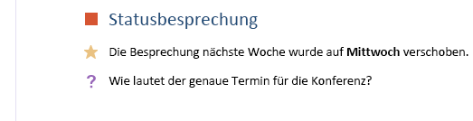

# <a name="use-note-tags-in-onenote-pages"></a>Verwenden von Notiztags auf OneNote-Seiten

*__Gilt für:__ Privatanwender-Notizbücher auf OneDrive | Enterprise-Notizbücher auf Office 365*

Verwenden Sie das `data-tag`-Attribut zum Hinzufügen und Aktualisieren von Kontrollkästchen, Sternen und anderen integrierten Notiztags auf einer OneNote-Seite, wie in der folgenden Abbildung gezeigt.




<a name="attributes"></a>
## <a name="note-tag-attributes"></a>Notiztag-Attribute

Ein Notiztag wird im HTML-Code einer OneNote-Seite durch das `data-tag`-Attribut dargestellt. Beispiel:

- Ein deaktiviertes Aufgabenfeld:  `<p data-tag="to-do">` 
- Ein aktiviertes Aufgabenfeld:  `<p data-tag="to-do:completed">` 
- Ein Stern:  `<h2 data-tag="important">` 

Ein `data-tag`-Wert besteht aus einem Shape und manchmal einem Status. (*siehe [unterstützte Werte](#built-in-note-tags-for-onenote)*)

| Eigenschaft | Beschreibung |  
|:------|:------|  
| shape | Der Bezeichner für das Notiztag (Beispiel: `to-do` oder `important`). |  
| status | Der Status der Kontrollkästchen von Notiztags. Dies wird nur dazu verwendet, die Kontrollkästchen als abgeschlossen zu kennzeichnen. |  
 

<a name="note-tags"></a>
## <a name="add-or-update-note-tags"></a>Hinzufügen oder Aktualisieren von Notiztags

Verwenden Sie zum Hinzufügen oder Aktualisieren eines integrierten Notiztags das `data-tag`-Attribut für ein unterstütztes Element. Im Folgenden ist z. B. ein Absatz als wichtig gekennzeichnet:

```html
<p data-tag="important">...</p>
```

Trennen Sie mehrere Notiztags durch Kommas:

```html
<p data-tag="important, critical">...</p>
```

Sie können ein `data-tag` für die folgenden Elemente definieren:

- p 
- ul, ol, li (*Weitere Informationen zu [Notiztags in Listen](#note-tags-on-lists)*)
- img 
- h1 – h6 
- title 

Eine Liste der Notiztags, die Sie mit Microsoft Graph verwenden können, finden Sie unter [Integrierte Notiztags](#built-in-note-tags-for-onenote). Das Hinzufügen oder Aktualisieren von benutzerdefinierten Tags mit Microsoft Graph wird nicht unterstützt.
 
**Beispiele**

Im Folgenden finden Sie eine einfache Aufgabenliste, in der das erste Element abgeschlossen ist.

```html 
<p data-tag="to-do:completed" data-id="prep">Till garden bed</p> 
<p data-tag="to-do" data-id="spring">Plant peas and spinach</p>
<p data-tag="to-do" data-id="summer">Plant tomatoes and peppers</p>
```

Beachten Sie, dass die oben aufgeführten `<p>`-Tags jeweils ein `data-id`-Attribut enthalten. Auf diese Weise ist es einfacher, die Kontrollkästchen für Notiztags zu aktualisieren. Mit der folgenden Anforderung wird z. B. die spring-Aufgabe Pflanzen als abgeschlossen gekennzeichnet.

``` 
PATCH https://graph.microsoft.com/v1.0/me/onenote/notebooks/pages/{page-id}/content

Content-Type: application/json
Authorization: Bearer {token}

[
   {
    'target':'#spring',
    'action':'replace',
    'content':'<p data-tag="to-do:completed"  data-id="spring">Plant peas and spinach</p>'
  }
]
```

Die folgende Anforderung erstellt eine Seite, die alle [integrierten Notiztags](#built-in-note-tags-for-onenote) enthält.

``` 
POST https://graph.microsoft.com/v1.0/me/onenote/notebooks/pages

Content-Type: text/html
Authorization: Bearer {token}


<!DOCTYPE html>
<html>
  <head>
    <title data-tag="to-do:completed">All built-in note tags</title>
  </head>
  <body>
    <h1 data-tag="important">Paragraphs with built-in note tags</h1>
    <p data-tag="to-do">to-do</p>
    <p data-tag="important">important</p>
    <p data-tag="question">question</p>
    <p data-tag="definition">definition</p>
    <p data-tag="highlight">highlight</p>
    <p data-tag="contact">contact</p>
    <p data-tag="address">address</p>
    <p data-tag="phone-number">phone-number</p>
    <p data-tag="web-site-to-visit">web-site-to-visit</p>
    <p data-tag="idea">idea</p>
    <p data-tag="password">password</p>
    <p data-tag="critical">critical</p>
    <p data-tag="project-a">project-a</p>
    <p data-tag="project-b">project-b</p>
    <p data-tag="remember-for-later">remember-for-later</p>
    <p data-tag="movie-to-see">movie-to-see</p>
    <p data-tag="book-to-read">book-to-read</p>
    <p data-tag="music-to-listen-to">music-to-listen-to</p>
    <p data-tag="source-for-article">source-for-article</p>
    <p data-tag="remember-for-blog">remember-for-blog</p>
    <p data-tag="discuss-with-person-a">discuss-with-person-a</p>
    <p data-tag="discuss-with-person-b">discuss-with-person-b</p>
    <p data-tag="discuss-with-manager">discuss-with-manager</p>
    <p data-tag="send-in-email">send-in-email</p>
    <p data-tag="schedule-meeting">schedule-meeting</p>
    <p data-tag="call-back">call-back</p>
    <p data-tag="to-do-priority-1">to-do-priority-1</p>
    <p data-tag="to-do-priority-2">to-do-priority-2</p>
    <p data-tag="client-request">client-request</p>
    <h1 data-tag="important">Paragraphs with check boxes marked with "completed" status</h1>
    <p data-tag="to-do:completed">to-do:completed</p>
    <p data-tag="discuss-with-person-a:completed">discuss-with-person-a:completed</p>
    <p data-tag="discuss-with-person-b:completed">discuss-with-person-b:completed</p>
    <p data-tag="discuss-with-manager:completed">discuss-with-manager:completed</p>
    <p data-tag="schedule-meeting:completed">schedule-meeting:completed</p>
    <p data-tag="call-back:completed">call-back:completed</p>
    <p data-tag="to-do-priority-1:completed">to-do-priority-1:completed</p>
    <p data-tag="to-do-priority-2:completed">to-do-priority-2:completed</p>
    <p data-tag="client-request:completed">client-request:completed</p>
    <h1 data-tag="important">Multiple note tags</h1>
    <p data-tag="project-a,  client-request:completed">Two note tags:  project-a, client-request:completed</p>
    <p data-tag="idea, send-in-email, question">Three note tags:  idea, send-in-email, question</p>
    <h1 data-tag="important">Using note tags with other elements</h1>
    <p><b>Note tag on a list item:</b></p>
    <ul>
      <li data-tag="to-do-priority-1:completed">Make a to-do list</li>
    </ul>
    <p><b>Note tag on an image:</b></p>
    
    <p><b>Note tag with embedded style:</b></p>
    <p data-tag="important">Next time, <b>don't</b> forget to invite <span style="background-color:yellow">Dan</span>.</p>
  </body>
</html>
``` 

Weitere Informationen zum Erstellen von Seiten finden Sie unter [Erstellen von OneNote-Seiten](onenote-create-page.md). Weitere Informationen zum Aktualisieren von Seiten finden Sie unter [Aktualisieren von OneNote-Seiten](onenote_update_page.md).


<a name="note-tags-lists"></a>
### <a name="note-tags-on-lists"></a>Notiztags in Listen

Hier sind einige Richtlinien für das Arbeiten mit Notiztags in Listen:

- Verwenden Sie `p`-Elemente für Aufgabenlisten. Sie zeigen keine Aufzählungen oder Nummern an und können einfacher aktualisiert werden.

- So erstellen oder aktualisieren Sie Listen, die das **gleiche** Notiztag für alle Listenelemente anzeigen:
  
   <p id="indent">Definieren Sie `data-tag` für `ul` oder `ol`. Um die gesamte Liste zu aktualisieren, müssen Sie `data-tag` für `ul` oder `ol` neu definieren.</p>

- So erstellen oder aktualisieren Sie Listen, die ein **eindeutiges** Notiztag für einige oder alle Elemente anzeigen:
  
   <p id="indent">Definieren Sie `data-tag` für `li`-Elemente, und schachteln Sie die `li`-Elemente nicht in einem `ul`- oder `ol`-Element. Um die gesamte Liste zu aktualisieren, müssen Sie das `ul`-Element, das in der HTML-Ausgabe zurückgegeben wird, entfernen und nur die ungeschachtelten `li`-Elemente zurückgeben.</p>

- So aktualisieren Sie bestimmte `li` Elemente:

   <p id="indent">Wählen Sie die `li`-Elemente einzeln aus, und definieren Sie das `data-tag` für das `li`-Element. Ein einzeln adressiertes `li`-Element kann so aktualisiert werden, dass es ein eindeutiges Notiztag anzeigt, unabhängig davon, wie die Liste ursprünglich definiert wurde.</p>

Die Richtlinien basieren auf den folgenden Regeln, die von Microsoft Graph angewendet werden:

- Die `data-tag`-Einstellung für ein `ul`- oder `ol`-Element überschreibt alle Einstellungen in untergeordneten `li`-Elementen. Dies gilt auch dann, wenn das `ul`- oder `ol`-Element kein `data-tag` angibt, aber seine untergeordneten `li`-Elemente dies tun.

   Wenn Sie beispielsweise ein `ul`- oder `ol`-Element erstellen, das `data-tag="project-a"` definiert, zeigen alle Listenelemente das Notiztag *Project A* an. Wenn dagegen das `ul`- oder `ol`-Element kein `data-tag` definiert, zeigt keines seiner Elemente ein Notiztag an. Diese Außerkraftsetzung geschieht unabhängig von expliziten Einstellungen in untergeordneten `li`-Elementen.

- Eindeutige `data-tag`-Einstellungen werden für Listenelemente unter den folgenden Bedingungen berücksichtigt:

   - Die `li`-Elemente sind nicht in einem `ul` oder `ol` in einer Erstellungs- oder Aktualisierungsanforderung geschachtelt.

   - Ein `li`-Element wird einzeln in einer Aktualisierungsanforderung adressiert.

- Ungeschachtelte `li`-Elemente, die im Eingabe-HTML-Code gesendet wurden, werden in einem `ul` im Ausgabe-HTML-Code zurückgegeben.

- Im Ausgabe-HTML-Code werden alle `data-tag`-Listeneinstellungen in `span`-Elementen für die Listenelemente definiert.

<br />
Der folgende Code zeigt, wie einige dieser Regeln angewendet werden. Der Eingabe-HTML-Code erstellt zwei Listen mit Notiztags. Der Ausgabe-HTML-Code wird für die Listen zurückgegeben, wenn Sie den Inhalt der Seite abrufen.

**Eingabe-HTML-Code**

```html 
<!--To display the same note tag on all list items, define note tags on the ul or ol.--> 
<ul data-tag="project-a" data-id="agenda">
  <li>An item with a Project A note tag</li>
  <li>An item with a Project A note tag</li>
</ul>

<!--To display unique note tags on list items, don't nest li elements in a ul or ol.--> 
<li data-tag="idea" data-id="my-idea">An item with an Idea note tag</li>
<li data-tag="question" data-id="my-question">An item with a Question note tag</li>
```
 
**Ausgabe-HTML-Code**

```html 
<ul>
  <li><span data-tag="project-a">An item with a Project A note tag</span></li>
  <li><span data-tag="project-a">An item with a Project A note tag</span></li>
</ul>
<br />
<ul>
  <li style="..."><span data-tag="idea">An item with an Idea note tag</span></li>
  <li style="..."><span data-tag="question">An item with a Question note tag</span></li>
</ul>
```

<a name="output-html"></a>
## <a name="retrieve-note-tags"></a>Abrufen von Notiztags

Integrierte Notiztags sind im Ausgabe-HTML-Code enthalten, wenn Sie Seiteninhalte abrufen:

`GET ../api/v1.0/pages/{page-id}/content` 

Ein `data-tag`-Attribut in der HTML-Ausgabe enthält immer einen Shape-Wert. Zusätzlich ist ein Status enthalten, wenn es sich um ein Kontrollkästchen-Notiztag handelt, das auf „completed“ festgelegt wurde. Das folgende Beispiel zeigt den Eingabe-HTML-Code, der zum Erstellen einiger Notiztags verwendet wurde, und den zurückgegebenen Ausgabe-HTML-Code.

**Eingabe-HTML-Code**

```html 
<h1>Status meeting</h1>
<p data-tag="important">Next week's meeting has been moved to <b>Wednesday</b>.</p>
<p data-tag="question">What are the exact dates for the conference?</p>
<p>Upcoming training opportunities. See Katie for more info.</p>
<p data-tag="project-a">Around the room updates.</p>
<ul data-tag="critical">
  <li>Design handouts</li>
  <li>Plan keynote</li>
</ul>
```

**Ausgabe-HTML-Code**

```html 
<h1 style="...">Status meeting</h1>
<p data-tag="important">Next week's meeting has been moved to <span style="font-weight:bold">Wednesday</span>.</p>
<p data-tag="question">What are the exact dates for the conference?</p>
<p>Upcoming training opportunities. See Katie for more info.</p>
<p data-tag="project-a">Around the room updates.</p>
<ul>
  <li><span data-tag="critical">Design handouts</span></li>
  <li><span data-tag="critical">Plan keynote</span></li>
</ul>
```

Beachten Sie, dass das auf Listenebene definierte `data-tag`-Attribut auf dessen Listenelemente übertragen wird. Weitere Informationen zur Verwendung von Notiztags mit Listen finden Sie unter [Notiztags in Listen](#note-tags-on-lists).

> **Hinweis:** Im HTML-Ausgabe-Code werden die Notiztags für Definition und Speicherung als `data-tag="remember-for-later"` zurückgegeben. Das `title`-Element gibt keine Notiztaginformationen zurück.

<a name="built-in-tags"></a>
## <a name="built-in-note-tags-for-onenote"></a>Integrierte Notiztags für OneNote

OneNote umfasst die folgenden integrierten Notiztags:


Die Werte, die Sie dem `data-tag`-Attribut zuweisen können, werden im Folgenden aufgeführt. Benutzerdefinierte Tags werden nicht unterstützt.

||Tags||
|:---|:---|:-----|
| `shape[:status]` |`to-do`<br />`to-do:completed`|`important`|
|`question`|`definition`|`highlight`|
|`contact`|`address`|`phone-number`|
|`web-site-to-visit`|`idea`|`password`|
|`critical`|`project-a`|`project-b`|
|`remember-for-later`|`movie-to-see`|`book-to-read`|
|`music-to-listen-to`|`source-for-article`|`remember-for-blog`|
|`discuss-with-person-a`<br />`discuss-with-person-a:completed`|`discuss-with-person-b`<br />`discuss-with-person-b:completed`|`discuss-with-manager`<br />`discuss-with-manager:completed`|
|`send-in-email`|`schedule-meeting`<br />`schedule-meeting:completed`|`call-back`<br />`call-back:completed`|
|`to-do-priority-1`<br />`to-do-priority-1:completed`|`to-do-priority-2`<br />`to-do-priority-2:completed`|`client-request`<br />`client-request:completed`|


<a name="request-response-info"></a>
## <a name="response-information"></a>Antwortinformationen
Microsoft Graph gibt die folgenden Informationen in der Antwort zurück.

| Antwortdaten | Beschreibung |  
|------|------|  
| Erfolgscode | HTTP-Statuscode 201 für eine erfolgreiche POST-Anforderung, HTTP-Statuscode 204 für eine erfolgreiche PATCH-Anforderung. |  
| Fehler | Weitere Informationen zu OneNote-Fehlern, die Microsoft Graph zurückgeben kann, finden Sie unter [Fehlercodes für OneNote-APIs in Microsoft Graph](onenote_error_codes.md). |  


<a name="permissions"></a>
## <a name="permissions"></a>Berechtigungen

Zum Erstellen oder Aktualisieren von OneNote-Seiten müssen Sie die entsprechenden Berechtigungen anfordern. Wählen Sie die niedrigste Berechtigungsstufe, die Ihre App zur Erledigung ihrer Aufgaben benötigt.

**Berechtigungen für _POST Pages_**

- Notes.Create
- Notes.ReadWrite
- Notes.ReadWrite.All  

**Berechtigungen für _PATCH Pages_**

- Notes.ReadWrite
- Notes.ReadWrite.All  

Weitere Informationen zu Berechtigungsbereichen und deren Funktionsweise finden Sie unter [OneNote-Berechtigungsbereiche](permissions_reference.md).


<a name="see-also"></a>
## <a name="additional-resources"></a>Weitere Ressourcen

- [Erstellen von OneNote-Seiten](onenote-create-page.md)
- [Aktualisieren von OneNote-Seiteninhalten](onenote_update_page.md)
- [Integrieren in OneNote](integrate_with_onenote.md)
- [OneNote-Entwicklerblog](http://go.microsoft.com/fwlink/?LinkID=390183)
- [Fragen zur OneNote-Entwicklung auf Stack Overflow](http://go.microsoft.com/fwlink/?LinkID=390182)
- [OneNote GitHub-Repos](http://go.microsoft.com/fwlink/?LinkID=390178)  
 


