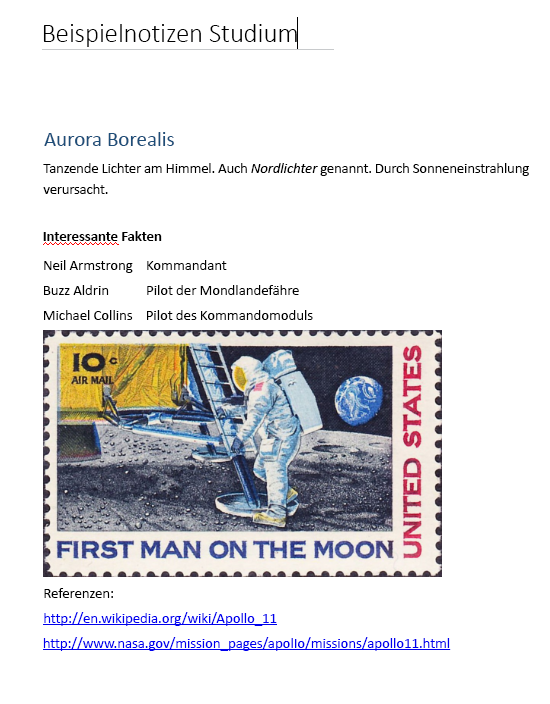

# <a name="input-and-output-html-in-onenote-pages"></a><span data-ttu-id="6d89c-101">Eingabe- und Ausgabe-HTML auf OneNote-Seiten</span><span class="sxs-lookup"><span data-stu-id="6d89c-101">Input and output HTML in OneNote pages</span></span>

<span data-ttu-id="6d89c-102">Der HTML-Code, der den Seiteninhalt und die Seitenstruktur definiert, wenn Sie eine OneNote-Seite [erstellen](onenote-create-page.md) oder [aktualisieren](onenote_update_page.md), wird *Eingabe-HTML* genannt.</span><span class="sxs-lookup"><span data-stu-id="6d89c-102">The HTML that defines the page content and structure when you [create](onenote-create-page.md) or [update](onenote_update_page.md) a OneNote page is called *input HTML*.</span></span> 

<span data-ttu-id="6d89c-103">Der HTML-Code, der beim [Abrufen von Seiteninhalt](onenote-get-content.md) zurückgegeben wird, heißt *Ausgabe-HTML*.</span><span class="sxs-lookup"><span data-stu-id="6d89c-103">The HTML that's returned when you [get page content](onenote-get-content.md) is called *output HTML*.</span></span> <span data-ttu-id="6d89c-104">Der Ausgabe-HTML-Code entspricht nicht dem Eingabe-HTML-Code.</span><span class="sxs-lookup"><span data-stu-id="6d89c-104">Output HTML won't be the same as input HTML.</span></span>

<span data-ttu-id="6d89c-105">Die OneNote-APIs in Microsoft Graph behalten den semantischen Inhalt und die grundlegende Struktur des Eingabe-HTML-Codes bei, konvertieren diese jedoch in [unterstützte HTML-Elemente und CSS-Eigenschaften](onenote-create-page.md#supported-html-and-css-for-onenote-pages).</span><span class="sxs-lookup"><span data-stu-id="6d89c-105">The OneNote APIs in Microsoft Graph preserve the semantic content and basic structure of the input HTML, but convert it to a set of [supported HTML elements and CSS properties](onenote-create-page.md#supported-html-and-css-for-onenote-pages).</span></span> <span data-ttu-id="6d89c-106">Die APIs fügen zudem benutzerdefinierte Attribute hinzu, die OneNote-Funktionen unterstützen.</span><span class="sxs-lookup"><span data-stu-id="6d89c-106">The APIs also add custom attributes that support OneNote features.</span></span>
 
<span data-ttu-id="6d89c-107">Dieser Artikel beschreibt die wichtigsten Elemente und Attribute von Eingabe- und Ausgabe-HTML-Codes.</span><span class="sxs-lookup"><span data-stu-id="6d89c-107">This article describes the principal elements and attributes of input and output HTML.</span></span> <span data-ttu-id="6d89c-108">Es kann hilfreich sein, Eingabe-HTML-Codes zu verstehen, wenn Sie Seiteninhalte erstellen oder aktualisieren. Mit Ausgabe- HTML-Codes sollten Sie sich auskennen, wenn Sie zurückgegebene Seiteninhalte analysieren möchten.</span><span class="sxs-lookup"><span data-stu-id="6d89c-108">It can be helpful to understand input HTML when you're creating or updating page content, and output HTML when you're parsing returned page content.</span></span> 

## <a name="body-element"></a><span data-ttu-id="6d89c-109">Textelement</span><span class="sxs-lookup"><span data-stu-id="6d89c-109">Body element</span></span>

<span data-ttu-id="6d89c-110">Der HTML-Inhalt im Seitentext repräsentiert den Seiteninhalt und die Seitenstruktur, einschließlich der Bild- und Dateiressourcen.</span><span class="sxs-lookup"><span data-stu-id="6d89c-110">The HTML content in the page body represents the page content and structure, including image and file resources.</span></span> <span data-ttu-id="6d89c-111">Das **Text**-Element kann die folgenden Attribute in der Eingabe- und Ausgabe-HTML enthalten.</span><span class="sxs-lookup"><span data-stu-id="6d89c-111">The **body** element can contain the following attributes in the input and output HTML.</span></span>

#### <a name="input-attributes"></a><span data-ttu-id="6d89c-112">Eingabeattribute</span><span class="sxs-lookup"><span data-stu-id="6d89c-112">Input attributes</span></span>

|<span data-ttu-id="6d89c-113">Eingabeattribut</span><span class="sxs-lookup"><span data-stu-id="6d89c-113">Input attribute</span></span>|<span data-ttu-id="6d89c-114">Beschreibung</span><span class="sxs-lookup"><span data-stu-id="6d89c-114">Description</span></span>|
|:------|:------|
| <span data-ttu-id="6d89c-115">data-absolute-enabled</span><span class="sxs-lookup"><span data-stu-id="6d89c-115">data-absolute-enabled</span></span> | <span data-ttu-id="6d89c-116">Gibt an, ob der Eingabe-Textkörper [absolute positioned](onenote-abs-pos.md)-Elemente unterstützt.</span><span class="sxs-lookup"><span data-stu-id="6d89c-116">Indicates whether the input body supports [absolute positioned](onenote-abs-pos.md) elements.</span></span> |
| <span data-ttu-id="6d89c-117">Formatvorlage</span><span class="sxs-lookup"><span data-stu-id="6d89c-117">style</span></span> | <p><span data-ttu-id="6d89c-118">Die CSS-[style](#styles)-Eigenschaften des Textkörpers.</span><span class="sxs-lookup"><span data-stu-id="6d89c-118">The CSS [style](#styles) properties of the body.</span></span> <span data-ttu-id="6d89c-119">In der Ausgabe-HTML können Eingabeeinstellungen eingebettet in die entsprechenden untergeordneten Elemente zurückgegeben werden.</span><span class="sxs-lookup"><span data-stu-id="6d89c-119">In the output HTML, input settings might be returned inline on appropriate child elements.</span></span></p><p><span data-ttu-id="6d89c-120">Hintergrundfarbe wird derzeit nicht für das **Text**-Element unterstützt.</span><span class="sxs-lookup"><span data-stu-id="6d89c-120">Background color is not currently supported for the **body** element.</span></span></p> |
 

#### <a name="output-attributes"></a><span data-ttu-id="6d89c-121">Ausgabeattribute</span><span class="sxs-lookup"><span data-stu-id="6d89c-121">Output attributes</span></span>

|<span data-ttu-id="6d89c-122">Ausgabeattribute</span><span class="sxs-lookup"><span data-stu-id="6d89c-122">Output attribute</span></span>|<span data-ttu-id="6d89c-123">Beschreibung</span><span class="sxs-lookup"><span data-stu-id="6d89c-123">Description</span></span>|
|:------|:------|
| <span data-ttu-id="6d89c-124">data-absolute-enabled</span><span class="sxs-lookup"><span data-stu-id="6d89c-124">data-absolute-enabled</span></span> | <span data-ttu-id="6d89c-125">Gibt an, ob der Textkörper [absolute positioned](onenote-abs-pos.md)-Elemente unterstützt.</span><span class="sxs-lookup"><span data-stu-id="6d89c-125">Indicates whether the body supports [absolute positioned](onenote-abs-pos.md) elements.</span></span> <span data-ttu-id="6d89c-126">Immer **true** in der HTML-Ausgabe.</span><span class="sxs-lookup"><span data-stu-id="6d89c-126">Always **true** in output HTML.</span></span> |
| <span data-ttu-id="6d89c-127">Formatvorlage</span><span class="sxs-lookup"><span data-stu-id="6d89c-127">style</span></span> | <span data-ttu-id="6d89c-128">Die Eigenschaften **font-family** und **font-size** des Textkörpers.</span><span class="sxs-lookup"><span data-stu-id="6d89c-128">The **font-family** and **font-size** properties of the body.</span></span> |


## <a name="div-elements"></a><span data-ttu-id="6d89c-129">Div-Elemente</span><span class="sxs-lookup"><span data-stu-id="6d89c-129">Div elements</span></span>

<span data-ttu-id="6d89c-130">**Div**-Elemente enthalten Text, Bilder und andere Inhalte.</span><span class="sxs-lookup"><span data-stu-id="6d89c-130">**Div** elements contain text, images, and other content.</span></span> <span data-ttu-id="6d89c-131">Das **div**-Element kann die folgenden Attribute in der Eingabe- und Ausgabe-HTML enthalten.</span><span class="sxs-lookup"><span data-stu-id="6d89c-131">A **div** element can contain the following attributes in the input and output HTML.</span></span>

#### <a name="input-attributes"></a><span data-ttu-id="6d89c-132">Eingabeattribute</span><span class="sxs-lookup"><span data-stu-id="6d89c-132">Input attributes</span></span>

|<span data-ttu-id="6d89c-133">Eingabeattribut</span><span class="sxs-lookup"><span data-stu-id="6d89c-133">Input attribute</span></span>|<span data-ttu-id="6d89c-134">Beschreibung</span><span class="sxs-lookup"><span data-stu-id="6d89c-134">Description</span></span>|
|:------|:------|
| <span data-ttu-id="6d89c-135">data-id</span><span class="sxs-lookup"><span data-stu-id="6d89c-135">data-id</span></span> | <span data-ttu-id="6d89c-136">Ein Verweis für das Element.</span><span class="sxs-lookup"><span data-stu-id="6d89c-136">A reference for the element.</span></span><br/><br/><span data-ttu-id="6d89c-137">Wird verwendet, um [Seiteninhalt zu aktualisieren](onenote_update_page.md).</span><span class="sxs-lookup"><span data-stu-id="6d89c-137">Used to [update page content](onenote_update_page.md).</span></span> |
| <span data-ttu-id="6d89c-138">data-render-fallback</span><span class="sxs-lookup"><span data-stu-id="6d89c-138">data-render-fallback</span></span> | <span data-ttu-id="6d89c-139">Die Ausweichaktion bei einem Fehler der [Extraktion](onenote-extract-data.md): **Rendern** (Standard) oder **Keine**</span><span class="sxs-lookup"><span data-stu-id="6d89c-139">The fallback action if the [extraction](onenote-extract-data.md) fails: **render** (default) or **none**.</span></span> |
| <span data-ttu-id="6d89c-140">data-render-method</span><span class="sxs-lookup"><span data-stu-id="6d89c-140">data-render-method</span></span> | <span data-ttu-id="6d89c-141">Die auszuführende [Extraktionsmethode](onenote-extract-data.md), z. B.:</span><span class="sxs-lookup"><span data-stu-id="6d89c-141">The [extraction](onenote-extract-data.md) method to perform, for example:  or .</span></span><br/><span data-ttu-id="6d89c-142">`extract.businesscard` oder `extract.recipe`</span><span class="sxs-lookup"><span data-stu-id="6d89c-142">`extract.businesscard` or `extract.recipe`</span></span> |
| <span data-ttu-id="6d89c-143">data-render-src</span><span class="sxs-lookup"><span data-stu-id="6d89c-143">data-render-src</span></span> | <span data-ttu-id="6d89c-144">Die Inhaltsquelle für die [Extraktion](onenote-extract-data.md).</span><span class="sxs-lookup"><span data-stu-id="6d89c-144">The content source for the [extraction](onenote-extract-data.md).</span></span> |
| <span data-ttu-id="6d89c-145">Formatvorlage</span><span class="sxs-lookup"><span data-stu-id="6d89c-145">style</span></span> | <span data-ttu-id="6d89c-146">Die Position, Größe, Schriftart und Farbe von Eigenschaften für div:</span><span class="sxs-lookup"><span data-stu-id="6d89c-146">The position, size, font, and color properties for the div:</span></span> <ul><li><span data-ttu-id="6d89c-147">**Position** (**absolut** nur), **links**, **oben**und **Breite** (Höhe wird für div automatisch konfiguriert)</span><span class="sxs-lookup"><span data-stu-id="6d89c-147">**position** (**absolute** only), **left**, **top**, and **width** (height is auto-configured for divs)</span></span><br/><br/><span data-ttu-id="6d89c-148">Wird verwendet, um ein [absolut positioniertes](onenote-abs-pos.md)-Div-Element zu erstellen, wenn das Div-Element ein direktes untergeordnetes Element des Texts und für den Text `data-absolute-enabled="true"` angegeben ist.</span><span class="sxs-lookup"><span data-stu-id="6d89c-148">Used to create an [absolute positioned](onenote-abs-pos.md) div, only if the div is a direct child of the body when the body sets `data-absolute-enabled="true"`.</span></span><br/><br/><span data-ttu-id="6d89c-149">Beispiel: `<div style="position:absolute;width:360px;top:350px;left:300px" ... />`</span><span class="sxs-lookup"><span data-stu-id="6d89c-149">Example: `<div style="position:absolute;width:360px;top:350px;left:300px" ... />`</span></span></li><li><span data-ttu-id="6d89c-p108">Die CSS-[style](#styles)-Eigenschaften des Elements. In der Ausgabe-HTML werden diese Werte inline in entsprechenden untergeordneten Elementen zurückgegeben.</span><span class="sxs-lookup"><span data-stu-id="6d89c-p108">The CSS [style](#styles) properties of the element. In the output HTML, these values are returned inline on appropriate child elements.</span></span></li></ul> |
 

<span data-ttu-id="6d89c-152">Die OneNote-APIs in Microsoft Graph umschließen alle Texte mit mindestens einem Div.</span><span class="sxs-lookup"><span data-stu-id="6d89c-152">The OneNote APIs in Microsoft Graph wrap all body content in at least one div.</span></span> <span data-ttu-id="6d89c-153">Die API erstellt ein standardmäßiges Div (mit `data-id="_default"`-Attributen), die den Textkörper enthalten, wenn:</span><span class="sxs-lookup"><span data-stu-id="6d89c-153">The API creates a default div (attributed with `data-id="_default"`) to contain the body content if:</span></span>

- <span data-ttu-id="6d89c-154">Das **data-absolute-enabled**-Attribut des Eingabe-Textkörper-Elements ausgelassen oder auf **false** gesetzt wird.</span><span class="sxs-lookup"><span data-stu-id="6d89c-154">The input body element's **data-absolute-enabled** attribute is omitted or set to **false**.</span></span> <span data-ttu-id="6d89c-155">In diesem Fall werden alle Inhalte des Textkörpers im standardmäßigen Div abgelegt.</span><span class="sxs-lookup"><span data-stu-id="6d89c-155">In this case, all body content is put in the default div.</span></span>

- <span data-ttu-id="6d89c-156">Das **data-absolute-enabled**-Attribut des Eingabe-Textkörper-Elements auf **true** gesetzt wird, die Eingabe HTML jedoch direkt untergeordnete Elemente enthält, die [absolute positioned](onenote-abs-pos.md)&nbsp;**div**, **img** oder **object**-Elemente sind.</span><span class="sxs-lookup"><span data-stu-id="6d89c-156">The input body element's **data-absolute-enabled** attribute is **true**, but the input HTML contains direct children that aren't [absolute positioned](onenote-abs-pos.md)&nbsp;**div**, **img**, or **object** elements.</span></span> <span data-ttu-id="6d89c-157">In diesem Fall werden untergeordnete Elemente, die keine [absolut positionierte](onenote-abs-pos.md)&nbsp;**div**, **img** oder **Objekt**-Elemente sind, im standardmäßigen Div abgelegt.</span><span class="sxs-lookup"><span data-stu-id="6d89c-157">In this case, direct children that aren't [absolute positioned](onenote-abs-pos.md)&nbsp;**div**, **img**, or **object** elements are put in the default div.</span></span>


#### <a name="output-attributes"></a><span data-ttu-id="6d89c-158">Ausgabeattribute</span><span class="sxs-lookup"><span data-stu-id="6d89c-158">Output attributes</span></span>

|<span data-ttu-id="6d89c-159">Ausgabeattribute</span><span class="sxs-lookup"><span data-stu-id="6d89c-159">Output attribute</span></span>|<span data-ttu-id="6d89c-160">Beschreibung</span><span class="sxs-lookup"><span data-stu-id="6d89c-160">Description</span></span>|
|:------|:------|
| <span data-ttu-id="6d89c-161">data-id</span><span class="sxs-lookup"><span data-stu-id="6d89c-161">data-id</span></span> | <span data-ttu-id="6d89c-162">Ein Verweis für das Element.</span><span class="sxs-lookup"><span data-stu-id="6d89c-162">A reference for the element.</span></span><br/><br/><span data-ttu-id="6d89c-163">Wird verwendet, um [Seiteninhalt zu aktualisieren](onenote_update_page.md).</span><span class="sxs-lookup"><span data-stu-id="6d89c-163">Used to [update page content](onenote_update_page.md).</span></span> |
| <span data-ttu-id="6d89c-164">ID</span><span class="sxs-lookup"><span data-stu-id="6d89c-164">id</span></span> | <span data-ttu-id="6d89c-165">Eine eindeutige generierte ID für das Element.</span><span class="sxs-lookup"><span data-stu-id="6d89c-165">A unique, generated ID for the element.</span></span> <span data-ttu-id="6d89c-166">Zurückgegeben von einem [GET requests to a page's *-content*-Endpunkt ](../api-reference/v1.0/api/page_get.md), wenn die `includeIDs=true`-Abfrageoption verwendet wird.</span><span class="sxs-lookup"><span data-stu-id="6d89c-166">Returned by [GET requests to a page's *content* endpoint](../api-reference/v1.0/api/page_get.md) when the `includeIDs=true` query option is used.</span></span><br/><br/><span data-ttu-id="6d89c-167">Wird verwendet, um [Seiteninhalt zu aktualisieren](onenote_update_page.md).</span><span class="sxs-lookup"><span data-stu-id="6d89c-167">Used to [update page content](onenote_update_page.md).</span></span> |
| <span data-ttu-id="6d89c-168">Formatvorlage</span><span class="sxs-lookup"><span data-stu-id="6d89c-168">style</span></span> | <span data-ttu-id="6d89c-169">Die Positions- und Größeneigenschaften des div-Elements.</span><span class="sxs-lookup"><span data-stu-id="6d89c-169">The position and size properties of the div.</span></span> |
 
### <a name="non-contributing-divs"></a><span data-ttu-id="6d89c-170">Nicht beitragende Divs</span><span class="sxs-lookup"><span data-stu-id="6d89c-170">Non-contributing divs</span></span>

<span data-ttu-id="6d89c-171">Wenn ein **div**-Element in der Eingabe-HTML nichts zur Seitenstruktur beiträgt und keine von OneNote verwendeten Informationen enthält,  verschiebt die API den Inhalt des div-Elements in das übergeordnete oder standardmäßige div-Element.</span><span class="sxs-lookup"><span data-stu-id="6d89c-171">When a **div** element in the input HTML does not contribute to the page structure or carry information that OneNote uses, the API moves the div's content into the parent or default div.</span></span> <span data-ttu-id="6d89c-172">Dieser Vorgang wird in den folgenden Beispielen dargestellt.</span><span class="sxs-lookup"><span data-stu-id="6d89c-172">This is illustrated in the following examples.</span></span>

#### <a name="input-html"></a><span data-ttu-id="6d89c-173">Eingabe-HTML</span><span class="sxs-lookup"><span data-stu-id="6d89c-173">Input HTML</span></span>

<span data-ttu-id="6d89c-174">Enthält ein nicht beitragendes, geschachteltes div-Element.</span><span class="sxs-lookup"><span data-stu-id="6d89c-174">Contains a non-contributing, nested div.</span></span>

```html
<html>
    <head>
        <title>Page Title</title>
    </head>
    <body>
        <div>
            <p>Some text</p>
            <div>
                <p>More text inside a div that doesn't define page structure</p>
            </div>
        </div>
    </body>
</html>
```

#### <a name="output-html"></a><span data-ttu-id="6d89c-175">Ausgabe-HTML</span><span class="sxs-lookup"><span data-stu-id="6d89c-175">Output HTML</span></span>

> <span data-ttu-id="6d89c-176">**Hinweis:** Der DIV-Inhalt wurde in die übergeordnete Div verschoben, und die geschachtelten `<div>`-Tags wurden entfernt.</span><span class="sxs-lookup"><span data-stu-id="6d89c-176">**Note:** The div's content was moved to the parent div and the nested `<div>` tags have been removed.</span></span> <span data-ttu-id="6d89c-177">Die Div wäre erhalten geblieben, wenn sie semantische Informationen definiert hätte, z. B. eine **Daten-ID** (Beispiel: `<div data-id="keep-me">`).</span><span class="sxs-lookup"><span data-stu-id="6d89c-177">The div would have been preserved if it defined any semantic information, such as a **data-id** (example: `<div data-id="keep-me">`).</span></span>

```html
<html htmlns="http://www.w3.org/1999/xhtml" lang="en-US">
    <head>
        <title>Page Title</title>
    </head>
    <body data-absolute-enabled="true" style="font-family:Calibri;font-size:11px">
        <div data-id="_default" style="position:absolute;left:48px;top:120px;width:624px">
            <p>Some text</p>
            <p>More text inside a nested div</p>
        </div>
    </body>
</html>
```


## <a name="img-elements"></a><span data-ttu-id="6d89c-178">Img-Elemente</span><span class="sxs-lookup"><span data-stu-id="6d89c-178">Img elements</span></span>

<span data-ttu-id="6d89c-179">Bilder auf OneNote-Seiten werden durch **img**-Elemente dargestellt.</span><span class="sxs-lookup"><span data-stu-id="6d89c-179">Images on OneNote pages are represented by **img** elements.</span></span> <span data-ttu-id="6d89c-180">Das **img**-Element kann die folgenden Attribute in der Eingabe- und Ausgabe-HTML enthalten.</span><span class="sxs-lookup"><span data-stu-id="6d89c-180">An **img** element can contain the following attributes in the input and output HTML.</span></span>

#### <a name="input-attributes"></a><span data-ttu-id="6d89c-181">Eingabeattribute</span><span class="sxs-lookup"><span data-stu-id="6d89c-181">Input attributes</span></span>

|<span data-ttu-id="6d89c-182">Eingabeattribut</span><span class="sxs-lookup"><span data-stu-id="6d89c-182">Input attribute</span></span>|<span data-ttu-id="6d89c-183">Beschreibung</span><span class="sxs-lookup"><span data-stu-id="6d89c-183">Description</span></span>|
|:------|:------|
| <span data-ttu-id="6d89c-184">alt</span><span class="sxs-lookup"><span data-stu-id="6d89c-184">alt</span></span> | <span data-ttu-id="6d89c-185">Der angegebene Alternativtext für das Bild.</span><span class="sxs-lookup"><span data-stu-id="6d89c-185">The supplied alt text for the image.</span></span> |
| <span data-ttu-id="6d89c-186">data-id</span><span class="sxs-lookup"><span data-stu-id="6d89c-186">data-id</span></span> | <span data-ttu-id="6d89c-187">Ein Verweis für das Element.</span><span class="sxs-lookup"><span data-stu-id="6d89c-187">A reference for the element.</span></span><br/><br/><span data-ttu-id="6d89c-188">Wird verwendet, um [Seiteninhalt zu aktualisieren](onenote_update_page.md).</span><span class="sxs-lookup"><span data-stu-id="6d89c-188">Used to [update page content](onenote_update_page.md).</span></span> |
| <span data-ttu-id="6d89c-189">data-render-src</span><span class="sxs-lookup"><span data-stu-id="6d89c-189">data-render-src</span></span> |<span data-ttu-id="6d89c-190">Es ist entweder **data-render-src** oder **src** erforderlich ist.</span><span class="sxs-lookup"><span data-stu-id="6d89c-190">Either **data-render-src** or **src** is required.</span></span><br/><br/><span data-ttu-id="6d89c-191">Die Webseite, die als Bitmapbild auf der OneNote-Seite gerendert werden soll:</span><span class="sxs-lookup"><span data-stu-id="6d89c-191">The webpage to render as a bit-mapped image on the OneNote page:</span></span><br/><br/> <span data-ttu-id="6d89c-192">- `data-render-src="http://..."` für eine öffentliche URL.</span><span class="sxs-lookup"><span data-stu-id="6d89c-192">- `data-render-src="http://..."` for a public URL.</span></span><br/><br/> <span data-ttu-id="6d89c-193">- `data-render-src="name:BlockName"` für ein Bild-Bestandteil im Block "Präsentation" einer [mehrteiligen Anforderung](../api-reference/v1.0/api/section_post_pages.md#example).</span><span class="sxs-lookup"><span data-stu-id="6d89c-193">- `data-render-src="name:BlockName"` for an image part in the "Presentation" block of a [multipart request](../api-reference/v1.0/api/section_post_pages.md#example).</span></span><br/><br/><span data-ttu-id="6d89c-194">Diese Methode ist nützlich, wenn die Webseite so komplex ist, dass sie nicht zuverlässig von OneNote analysiert werden kann, oder wenn für die Seite eine Anmeldung erforderlich ist.</span><span class="sxs-lookup"><span data-stu-id="6d89c-194">This method is useful when the webpage is more complex than the OneNote page can faithfully render, or when the page requires login credentials.</span></span>|
| <span data-ttu-id="6d89c-195">data-tag</span><span class="sxs-lookup"><span data-stu-id="6d89c-195">data-tag</span></span> | <span data-ttu-id="6d89c-196">Ein [Notiztag](onenote-note-tags.md) für das Element.</span><span class="sxs-lookup"><span data-stu-id="6d89c-196">A [note tag](onenote-note-tags.md) on the element.</span></span> |
| <span data-ttu-id="6d89c-197">Formatvorlage</span><span class="sxs-lookup"><span data-stu-id="6d89c-197">style</span></span> |<span data-ttu-id="6d89c-198">Die Position- und Größen-Eigenschaften für das Bild: **Position** (nur **absolute**), **links**, **oben**, **Breite** und **Höhe**.</span><span class="sxs-lookup"><span data-stu-id="6d89c-198">The position and size properties for the image: **position** (**absolute** only), **left**, **top**, **width**, and **height**.</span></span><br/><br/><span data-ttu-id="6d89c-199">Die Größe kann für jedes Bild festgelegt werden.</span><span class="sxs-lookup"><span data-stu-id="6d89c-199">Size can be set on any image.</span></span><br/><br/><span data-ttu-id="6d89c-200">Positionseigenschaften werden verwendet, um ein [absolute positioned](onenote-abs-pos.md)-Bild zu erstellen, wenn das Bild ein direktes untergeordnetes Element des Textkörpers und für den Textkörper `data-absolute-enabled="true"` angegeben ist.</span><span class="sxs-lookup"><span data-stu-id="6d89c-200">Position properties are used to create an [absolute positioned](onenote-abs-pos.md) image, only if the image is a direct child of the body when the body sets `data-absolute-enabled="true"`.</span></span><br/><br/><span data-ttu-id="6d89c-201">Beispiel: ``</span><span class="sxs-lookup"><span data-stu-id="6d89c-201">Example: ``</span></span><br/><br/><span data-ttu-id="6d89c-202">In der Ausgabe-HTML wird die Bildgröße separat in **width**- und **height**-Attributen zurückgegeben.</span><span class="sxs-lookup"><span data-stu-id="6d89c-202">In the output HTML, the image size is returned separately in **width** and **height** attributes.</span></span> |
| <span data-ttu-id="6d89c-203">src</span><span class="sxs-lookup"><span data-stu-id="6d89c-203">src</span></span> |<span data-ttu-id="6d89c-204">Es ist entweder **src** oder **data-render-src** erforderlich ist.</span><span class="sxs-lookup"><span data-stu-id="6d89c-204">Either **src** or **data-render-src** is required.</span></span><br/><br/><span data-ttu-id="6d89c-205">Das Bild, das auf der OneNote-Seite gerendert werden soll:</span><span class="sxs-lookup"><span data-stu-id="6d89c-205">The image to render on the OneNote page:</span></span><br/><br/><span data-ttu-id="6d89c-206">- `src="http://..."` für eine URL zu einem öffentlich verfügbaren Bild im Internet.</span><span class="sxs-lookup"><span data-stu-id="6d89c-206">- `src="http://..."` for a URL to a publicly available image on the internet.</span></span><br/><br/> <span data-ttu-id="6d89c-207">- `src="name:BlockName"` für einen benannten Teil in einer mehrteiligen Anforderung, die das Bild darstellt.</span><span class="sxs-lookup"><span data-stu-id="6d89c-207">- `src="name:BlockName"` for a named part in a multipart request that represents the image.</span></span>|
| <span data-ttu-id="6d89c-208">Breite, Höhe</span><span class="sxs-lookup"><span data-stu-id="6d89c-208">width, height</span></span> | <span data-ttu-id="6d89c-209">Die Breite oder Höhe des Bilds, in Pixel, aber ohne px.</span><span class="sxs-lookup"><span data-stu-id="6d89c-209">The width or height of the image, in pixels but without the px.</span></span> <span data-ttu-id="6d89c-210">Beispiel: `width="400"`</span><span class="sxs-lookup"><span data-stu-id="6d89c-210">Example: `width="400"`</span></span> |
 
> <span data-ttu-id="6d89c-211">**Hinweis:** Die OneNote-APIs erkennen automatisch den Eingabe-Bildtyp und geben ihn als **data-fullres-src-type** an die Ausgabe-HTML zurück.</span><span class="sxs-lookup"><span data-stu-id="6d89c-211">**Note:** The OneNote APIs automatically detect the input image type, and returns it as the **data-fullres-src-type** in the output HTML.</span></span> <span data-ttu-id="6d89c-212">Daneben gibt die API auch den Bildtyp des optimierten Bildes in **data-src-type** zurück.</span><span class="sxs-lookup"><span data-stu-id="6d89c-212">The API also returns the image type of the optimized image in **data-src-type**.</span></span>
 

#### <a name="output-attributes"></a><span data-ttu-id="6d89c-213">Ausgabeattribute</span><span class="sxs-lookup"><span data-stu-id="6d89c-213">Output attributes</span></span>

|<span data-ttu-id="6d89c-214">Ausgabeattribute</span><span class="sxs-lookup"><span data-stu-id="6d89c-214">Output attribute</span></span>|<span data-ttu-id="6d89c-215">Beschreibung</span><span class="sxs-lookup"><span data-stu-id="6d89c-215">Description</span></span>|
|:------|:------|
| <span data-ttu-id="6d89c-216">alt</span><span class="sxs-lookup"><span data-stu-id="6d89c-216">alt</span></span> | <span data-ttu-id="6d89c-217">Der angegebene Alternativtext für das Bild.</span><span class="sxs-lookup"><span data-stu-id="6d89c-217">The supplied alt text for the image.</span></span> |
| <span data-ttu-id="6d89c-218">data-id</span><span class="sxs-lookup"><span data-stu-id="6d89c-218">data-id</span></span> | <span data-ttu-id="6d89c-219">Ein Verweis für das Element.</span><span class="sxs-lookup"><span data-stu-id="6d89c-219">A reference for the element.</span></span><br/><br/><span data-ttu-id="6d89c-220">Wird verwendet, um [Seiteninhalt zu aktualisieren](onenote_update_page.md).</span><span class="sxs-lookup"><span data-stu-id="6d89c-220">Used to [update page content](onenote_update_page.md).</span></span> |
| <span data-ttu-id="6d89c-221">data-index</span><span class="sxs-lookup"><span data-stu-id="6d89c-221">data-index</span></span> | <span data-ttu-id="6d89c-p118">Die Position des Bilds. Für die Unterstützung von [geteilten Bildern](#split-images).</span><span class="sxs-lookup"><span data-stu-id="6d89c-p118">The position of the image. For [split image](#split-images) support.</span></span> |
| <span data-ttu-id="6d89c-224">data-fullres-src</span><span class="sxs-lookup"><span data-stu-id="6d89c-224">data-fullres-src</span></span> | <span data-ttu-id="6d89c-225">Der Endpunkt für die Version der Bildressource, die ursprünglich in die Seite eingebettet war.</span><span class="sxs-lookup"><span data-stu-id="6d89c-225">The endpoint for the version of the image resource that was originally embedded in the page.</span></span> |
| <span data-ttu-id="6d89c-226">data-fullres-src-type</span><span class="sxs-lookup"><span data-stu-id="6d89c-226">data-fullres-src-type</span></span> | <span data-ttu-id="6d89c-227">Der Medientyp der **data-fullres-src**-Ressource. Beispiel: `image/png` oder `image/jpeg`.</span><span class="sxs-lookup"><span data-stu-id="6d89c-227">The media type of the **data-fullres-src** resource, for example: `image/png` or `image/jpeg`.</span></span> |
| <span data-ttu-id="6d89c-228">data-options</span><span class="sxs-lookup"><span data-stu-id="6d89c-228">data-options</span></span> | <span data-ttu-id="6d89c-p119">Der Quelltyp: **printout** für PDF-Dateien oder **splitimage** für alle anderen. Gilt nur für [geteilte Bilder](#split-images), die mit dem **data-render-src**-Attribut erstellt wurden.</span><span class="sxs-lookup"><span data-stu-id="6d89c-p119">The source type: **printout** for PDF files or **splitimage** for all others. Applies only to [split images](#split-images) created with the **data-render-src** attribute.</span></span> |
| <span data-ttu-id="6d89c-231">data-render-original-src</span><span class="sxs-lookup"><span data-stu-id="6d89c-231">data-render-original-src</span></span> | <span data-ttu-id="6d89c-232">Die ursprüngliche URL des Bilds, wenn das Quellbild aus dem öffentlichen Internet stammt und mit dem **data-render-src**-Attribut erstellt wurde.</span><span class="sxs-lookup"><span data-stu-id="6d89c-232">The original source URL of the image, if the source image is from the public internet and was created with the **data-render-src** attribute.</span></span> |
| <span data-ttu-id="6d89c-233">data-src-type</span><span class="sxs-lookup"><span data-stu-id="6d89c-233">data-src-type</span></span> | <span data-ttu-id="6d89c-234">Der Medientyp der **src**-Ressource. Beispiel: `image/png` oder `image/jpeg`.</span><span class="sxs-lookup"><span data-stu-id="6d89c-234">The media type of the **src** resource, for example: `image/png` or `image/jpeg`.</span></span> |
| <span data-ttu-id="6d89c-235">data-tag</span><span class="sxs-lookup"><span data-stu-id="6d89c-235">data-tag</span></span> | <span data-ttu-id="6d89c-236">Ein [Notiztag](onenote-note-tags.md) für das Element.</span><span class="sxs-lookup"><span data-stu-id="6d89c-236">A [note tag](onenote-note-tags.md) on the element.</span></span> |
| <span data-ttu-id="6d89c-237">ID</span><span class="sxs-lookup"><span data-stu-id="6d89c-237">id</span></span> | <span data-ttu-id="6d89c-238">Eine eindeutige generierte ID für das Element.</span><span class="sxs-lookup"><span data-stu-id="6d89c-238">A unique, generated ID for the element.</span></span> <span data-ttu-id="6d89c-239">Zurückgegeben von einem [GET requests to a page's *-content*-Endpunkt ](../api-reference/v1.0/api/page_get.md), wenn die `includeIDs=true`-Abfrageoption verwendet wird.</span><span class="sxs-lookup"><span data-stu-id="6d89c-239">Returned by [GET requests to a page's *content* endpoint](../api-reference/v1.0/api/page_get.md) when the `includeIDs=true` query option is used.</span></span><br/><br/><span data-ttu-id="6d89c-240">Wird verwendet, um [Seiteninhalt zu aktualisieren](onenote_update_page.md).</span><span class="sxs-lookup"><span data-stu-id="6d89c-240">Used to [update page content](onenote_update_page.md).</span></span> |
| <span data-ttu-id="6d89c-241">src</span><span class="sxs-lookup"><span data-stu-id="6d89c-241">src</span></span> | <span data-ttu-id="6d89c-242">Der Endpunkt für die Version der Bildressource, die für Webbrowser sowie mobile Geräte und Tablets optimiert wurde.</span><span class="sxs-lookup"><span data-stu-id="6d89c-242">The endpoint for the version of the image resource that has been optimized for web browsers and mobile and tablet form factors.</span></span> |
| <span data-ttu-id="6d89c-243">Formatvorlage</span><span class="sxs-lookup"><span data-stu-id="6d89c-243">style</span></span> | <span data-ttu-id="6d89c-244">Die Positionseigenschaften des Bilds.</span><span class="sxs-lookup"><span data-stu-id="6d89c-244">The position properties of the image.</span></span> |
| <span data-ttu-id="6d89c-245">Breite, Höhe</span><span class="sxs-lookup"><span data-stu-id="6d89c-245">width, height</span></span> | <span data-ttu-id="6d89c-246">Die Breite oder Höhe des Bilds in Pixel.</span><span class="sxs-lookup"><span data-stu-id="6d89c-246">The width or height of the image, in pixels.</span></span> |
 

### <a name="output-html-examples-for-images"></a><span data-ttu-id="6d89c-247">Beispiele für die Ausgabe-HTML für Bilder</span><span class="sxs-lookup"><span data-stu-id="6d89c-247">Output HTML examples for images</span></span>

<span data-ttu-id="6d89c-248">Ausgabe-**img**-Elemente enthalten die Endpunkte für Bilddateiressourcen und den Bildtyp (siehe  unten).</span><span class="sxs-lookup"><span data-stu-id="6d89c-248">Output **img** elements contain endpoints for image file resources and the image type, as shown below.</span></span> <span data-ttu-id="6d89c-249">Sie können separate [GET-Anforderung zu Bildressourcen-Endpunkten](../api-reference/v1.0/api/resource_get.md) durchführen, um die binäre Inhalt abzurufen.</span><span class="sxs-lookup"><span data-stu-id="6d89c-249">You can make separate [GET requests to image resource endpoints](../api-reference/v1.0/api/resource_get.md) to retrieve their binary contents.</span></span>

```html

```

<span data-ttu-id="6d89c-250">Standardmäßig können Bilder nicht direkt in einem Browser gerendert werden, da sie wie die restlichen Seiteninhalte privat sind und eine Autorisierung erforderlich ist, um sie abzurufen.</span><span class="sxs-lookup"><span data-stu-id="6d89c-250">By default, images won't render directly in a browser because they are private and require authorization to retrieve them, like the rest of the page contents.</span></span> <span data-ttu-id="6d89c-251">Um Öffentliche URLs für die Bildressourcen auf einer Seite zu erhalten, fügen Sie **preAuthenticated=true** in die Abfragezeichenfolge ein, wenn Sie die Seiteninhalte abrufen (Beispiel: `GET ../pages/{page-id}/content?preAuthenticated=true`).</span><span class="sxs-lookup"><span data-stu-id="6d89c-251">To get public URLs to the image resources on a page, include **preAuthenticated=true** in the query string when you retrieve the page content (example: `GET ../pages/{page-id}/content?preAuthenticated=true`).</span></span> <span data-ttu-id="6d89c-252">Die öffentlichen URLs, die zurückgegeben werden, sind eine Stunde lang gültig.</span><span class="sxs-lookup"><span data-stu-id="6d89c-252">The public URLs that are returned are valid for one hour.</span></span> 

#### <a name="image-with-public-url-when-preauthenticatedtrue-is-included-in-the-request"></a><span data-ttu-id="6d89c-253">Bild mit öffentlichen URL, wenn _vorauthentifiziert = True_ in der Anfrage enthalten ist</span><span class="sxs-lookup"><span data-stu-id="6d89c-253">Image with public URL when _preAuthenticated=true_ is included in the request</span></span>

```html

```

<span data-ttu-id="6d89c-254">Die folgenden Beispiele zeigen, welche Informationen ein **img**-Element in der Ausgabe-HTML enthalten kann.</span><span class="sxs-lookup"><span data-stu-id="6d89c-254">The following examples show the information an **img** element might contain in the output HTML.</span></span>

#### <a name="image-with-web-ready-and-high-resolution-resources"></a><span data-ttu-id="6d89c-255">Bild mit webfähigen Ressourcen in hoher Auflösung</span><span class="sxs-lookup"><span data-stu-id="6d89c-255">Image with web-ready and high resolution resources</span></span>

```html

```

#### <a name="image-created-by-using-the-data-render-src-attribute"></a><span data-ttu-id="6d89c-256">Mit dem *data-render-src*-Attribut erstelltes Bild</span><span class="sxs-lookup"><span data-stu-id="6d89c-256">Image created by using the *data-render-src* attribute</span></span>

```html

```

### <a name="split-images"></a><span data-ttu-id="6d89c-257">Aufteilen von Bildern</span><span class="sxs-lookup"><span data-stu-id="6d89c-257">Split images</span></span>

<span data-ttu-id="6d89c-258">Bilder, die mit dem **data-render-src**-Attribut (aus einer Webseiten-URL oder einem benannten Teil) erstellt werden, werden für eine bessere Leistung und ein besseres Rendering möglicherweise in aus mehreren Komponenten bestehende Bilder aufgeteilt.</span><span class="sxs-lookup"><span data-stu-id="6d89c-258">Images that are created using the **data-render-src** attribute (from a webpage URL or a named part) might be split into multiple component images for performance and rendering reasons.</span></span> <span data-ttu-id="6d89c-259">Komponenten-Bildern wird allen der gleiche **data-id**-Wert zugewiesen.</span><span class="sxs-lookup"><span data-stu-id="6d89c-259">Component images are all assigned the same **data-id** value.</span></span> <span data-ttu-id="6d89c-260">Jedes Komponenten-Bild verfügt über ein nullbasiertes data-index-Attribut, welches das ursprüngliche vertikale Layout definiert.</span><span class="sxs-lookup"><span data-stu-id="6d89c-260">Each component image has a zero-based data-index attribute that defines the original vertical layout.</span></span>

#### <a name="split-image-with-three-component-images"></a><span data-ttu-id="6d89c-261">Aufgeteiltes Bild mit drei Komponentenbildern</span><span class="sxs-lookup"><span data-stu-id="6d89c-261">Split image with three component images</span></span>

```html
<div data-id="multi-component-image" style="position:absolute;left:48px;top:120px;width:624px">
    
    
    
</div>
```

<span data-ttu-id="6d89c-262">Da Benutzer die Bilder auf der Seite verschieben können, werden die Indizes möglicherweise in falscher Reihenfolge zurückgegebenen.</span><span class="sxs-lookup"><span data-stu-id="6d89c-262">Because users can move the images on the page, the returned indexes might be out of order.</span></span> <span data-ttu-id="6d89c-263">Die Sortierung erfolgt normalerweise von oben nach unten auf der Y-Achse und von links nach rechts auf der X-Achse, wenn es Konflikte mit der Y-Sortierung gibt.</span><span class="sxs-lookup"><span data-stu-id="6d89c-263">Ordering should be in top to bottom y-order, then left to right x-order if there are y-order conflicts.</span></span>

## <a name="iframe-elements"></a><span data-ttu-id="6d89c-264">iframe-Elemente</span><span class="sxs-lookup"><span data-stu-id="6d89c-264">iframe elements</span></span>

<span data-ttu-id="6d89c-265">OneNote-Seiten können eingebettete Videos enthalten, die durch **iframe**-Elemente dargestellt werden.</span><span class="sxs-lookup"><span data-stu-id="6d89c-265">OneNote pages can contain embedded videos represented by **iframe** elements.</span></span> 

> <span data-ttu-id="6d89c-266">**Hinweis:** Sie können auch [eine Videodatei mithilfe eines **Objekt**-Elements](onenote_images_files.md#adding-files) anfügen.</span><span class="sxs-lookup"><span data-stu-id="6d89c-266">**Note:** You can also [attach a video file using an **object** element](onenote_images_files.md#adding-files).</span></span>

#### <a name="input-attributes"></a><span data-ttu-id="6d89c-267">Eingabeattribute</span><span class="sxs-lookup"><span data-stu-id="6d89c-267">Input attributes</span></span>

|<span data-ttu-id="6d89c-268">Eingabeattribut</span><span class="sxs-lookup"><span data-stu-id="6d89c-268">Input attribute</span></span>|<span data-ttu-id="6d89c-269">Beschreibung</span><span class="sxs-lookup"><span data-stu-id="6d89c-269">Description</span></span>|
|:------|:------|
| <span data-ttu-id="6d89c-270">data-original-src</span><span class="sxs-lookup"><span data-stu-id="6d89c-270">data-original-src</span></span> | <span data-ttu-id="6d89c-271">Erforderlich.</span><span class="sxs-lookup"><span data-stu-id="6d89c-271">Required.</span></span> <span data-ttu-id="6d89c-272">Die URL der Videoquelle.</span><span class="sxs-lookup"><span data-stu-id="6d89c-272">The URL of the video source.</span></span> <span data-ttu-id="6d89c-273">Siehe [Liste der unterstützten Videoquellen](onenote_images_files.md#adding-videos).</span><span class="sxs-lookup"><span data-stu-id="6d89c-273">See the [list of supported video sources](onenote_images_files.md#adding-videos).</span></span> <br/><br/><span data-ttu-id="6d89c-274">Beispiel: `data-original-src="https://www.youtube.com/watch?v=3Ztr44aKmQ8"`</span><span class="sxs-lookup"><span data-stu-id="6d89c-274">Example: `data-original-src="https://www.youtube.com/watch?v=3Ztr44aKmQ8"`</span></span> |
| <span data-ttu-id="6d89c-275">Breite, Höhe</span><span class="sxs-lookup"><span data-stu-id="6d89c-275">width, height</span></span> | <span data-ttu-id="6d89c-276">Die Breite oder Höhe des iframe in Pixel.</span><span class="sxs-lookup"><span data-stu-id="6d89c-276">The width or height of the iframe, in pixels.</span></span> <span data-ttu-id="6d89c-277">Beispiel: `width=300`</span><span class="sxs-lookup"><span data-stu-id="6d89c-277">Example: `width=300`</span></span> |

#### <a name="output-attributes"></a><span data-ttu-id="6d89c-278">Ausgabeattribute</span><span class="sxs-lookup"><span data-stu-id="6d89c-278">Output attributes</span></span>

|<span data-ttu-id="6d89c-279">Ausgabeattribute</span><span class="sxs-lookup"><span data-stu-id="6d89c-279">Output attribute</span></span>|<span data-ttu-id="6d89c-280">Beschreibung</span><span class="sxs-lookup"><span data-stu-id="6d89c-280">Description</span></span>|
|:------|:------|
| <span data-ttu-id="6d89c-281">data-original-src</span><span class="sxs-lookup"><span data-stu-id="6d89c-281">data-original-src</span></span> | <span data-ttu-id="6d89c-282">Die URL der Videoquelle.</span><span class="sxs-lookup"><span data-stu-id="6d89c-282">The URL of the video source.</span></span> |
| <span data-ttu-id="6d89c-283">src</span><span class="sxs-lookup"><span data-stu-id="6d89c-283">src</span></span> | <span data-ttu-id="6d89c-284">Ein Link zu dem Video, das in die OneNote-Seite eingebettet ist.</span><span class="sxs-lookup"><span data-stu-id="6d89c-284">A link to the video that is embedded in the OneNote page.</span></span> |
| <span data-ttu-id="6d89c-285">Breite, Höhe</span><span class="sxs-lookup"><span data-stu-id="6d89c-285">width, height</span></span> | <span data-ttu-id="6d89c-286">Die Breite oder Höhe des iframe in Pixel.</span><span class="sxs-lookup"><span data-stu-id="6d89c-286">The width or height of the iframe, in pixels.</span></span><br/><br/><span data-ttu-id="6d89c-287">Beispiel: `width=300`</span><span class="sxs-lookup"><span data-stu-id="6d89c-287">Example: `width=300`</span></span> |
 
### <a name="output-html-example-for-videos"></a><span data-ttu-id="6d89c-288">Beispiel für eine Ausgabe-HTML eines Videos</span><span class="sxs-lookup"><span data-stu-id="6d89c-288">Output HTML example for videos</span></span>

<span data-ttu-id="6d89c-289">Ausgabe-**iframe**-Elemente enthalten Endpunkte, die wie dargestellt auf die Quellseite und das Video verweisen.</span><span class="sxs-lookup"><span data-stu-id="6d89c-289">Output **iframe** elements contain endpoints that link to the source page and video, as shown.</span></span> 

```html
<iframe 
    width="340" height="280" 
    data-original-src="https://www.youtube.com/watch?v=3Ztr44aKmQ8" 
    src="https://www.youtube.com/embed/3Ztr44aKmQ8?feature=oembed&autoplay=true" />
``` 

## <a name="object-elements"></a><span data-ttu-id="6d89c-290">Objekt-Elemente</span><span class="sxs-lookup"><span data-stu-id="6d89c-290">Object elements</span></span>

<span data-ttu-id="6d89c-291">OneNote-Seiten können Dateianlagen enthalten, die durch **Objekt**-Elemente dargestellt werden.</span><span class="sxs-lookup"><span data-stu-id="6d89c-291">OneNote pages can contain file attachments represented by **object** elements.</span></span> <span data-ttu-id="6d89c-292">Das **object**-Element kann die folgenden Attribute in der Eingabe- und Ausgabe-HTML enthalten.</span><span class="sxs-lookup"><span data-stu-id="6d89c-292">An **object** element can contain the following attributes in the input and output HTML.</span></span>

> <span data-ttu-id="6d89c-293">**Hinweis:** OneNote-APIs können auch Dateiinhalte als Bilder auf einer Seite rendern, wenn die Datei als Bild gesendet und das Attribut **data-render-src** verwendet wird.</span><span class="sxs-lookup"><span data-stu-id="6d89c-293">**Note:** The OneNote APIs can also render file content as images in a page when the file is sent as an image and uses the **data-render-src** attribute.</span></span>
> <span data-ttu-id="6d89c-294">Beispiel: ``</span><span class="sxs-lookup"><span data-stu-id="6d89c-294">Example: ``</span></span>
 

#### <a name="input-attributes"></a><span data-ttu-id="6d89c-295">Eingabeattribute</span><span class="sxs-lookup"><span data-stu-id="6d89c-295">Input attributes</span></span>

|<span data-ttu-id="6d89c-296">Eingabeattribut</span><span class="sxs-lookup"><span data-stu-id="6d89c-296">Input attribute</span></span>|<span data-ttu-id="6d89c-297">Beschreibung</span><span class="sxs-lookup"><span data-stu-id="6d89c-297">Description</span></span>|
|:------|:------|
| <span data-ttu-id="6d89c-298">Daten</span><span class="sxs-lookup"><span data-stu-id="6d89c-298">data</span></span> | <span data-ttu-id="6d89c-299">Erforderlich.</span><span class="sxs-lookup"><span data-stu-id="6d89c-299">Required.</span></span> <span data-ttu-id="6d89c-300">Der Name des Teils, der die Datei in der [mehrteiligen Anforderung](../api-reference/v1.0/api/section_post_pages.md#example) darstellt.</span><span class="sxs-lookup"><span data-stu-id="6d89c-300">The name of the part that represents the file in the [multipart request](../api-reference/v1.0/api/section_post_pages.md#example).</span></span> |
| <span data-ttu-id="6d89c-301">data-attachment</span><span class="sxs-lookup"><span data-stu-id="6d89c-301">data-attachment</span></span> | <span data-ttu-id="6d89c-p130">Erforderlich. Der Dateiname.</span><span class="sxs-lookup"><span data-stu-id="6d89c-p130">Required. The file name.</span></span> |
| <span data-ttu-id="6d89c-304">data-id</span><span class="sxs-lookup"><span data-stu-id="6d89c-304">data-id</span></span> | <span data-ttu-id="6d89c-305">Ein Verweis für das Element.</span><span class="sxs-lookup"><span data-stu-id="6d89c-305">A reference for the element.</span></span><br/><br/><span data-ttu-id="6d89c-306">Wird verwendet, um [Seiteninhalt zu aktualisieren](onenote_update_page.md).</span><span class="sxs-lookup"><span data-stu-id="6d89c-306">Used to [update page content](onenote_update_page.md).</span></span> |
| <span data-ttu-id="6d89c-307">Formatvorlage</span><span class="sxs-lookup"><span data-stu-id="6d89c-307">style</span></span> | <span data-ttu-id="6d89c-308">Die Position- und Größen-Eigenschaften für das Objekt: **Position** (nur **absolute**), **links**, **oben** und **Breite**.</span><span class="sxs-lookup"><span data-stu-id="6d89c-308">The position and size properties for the object: **position** (**absolute** only), **left**, **top**, and **width**.</span></span><br/><br/><span data-ttu-id="6d89c-309">Wird verwendet, um ein [absolut positioniertes](onenote-abs-pos.md)-Object-Element zu erstellen, wenn das Object-Element ein direktes untergeordnetes Element des Textkörpers und für den Textkörper `data-absolute-enabled="true"` angegeben ist.</span><span class="sxs-lookup"><span data-stu-id="6d89c-309">Used to create an [absolute positioned](onenote-abs-pos.md) object, only if the object is a direct child of the body when the body sets `data-absolute-enabled="true"`.</span></span><br/><br/><span data-ttu-id="6d89c-310">Beispiel: `<object style="position:absolute;top:350px;left:300px" ... />`</span><span class="sxs-lookup"><span data-stu-id="6d89c-310">Example: `<object style="position:absolute;top:350px;left:300px" ... />`</span></span> |
| <span data-ttu-id="6d89c-311">Typ</span><span class="sxs-lookup"><span data-stu-id="6d89c-311">type</span></span> | <span data-ttu-id="6d89c-312">Erforderlich.</span><span class="sxs-lookup"><span data-stu-id="6d89c-312">Required.</span></span><br/><br/><span data-ttu-id="6d89c-313">Der standardmäßige Mediendateityp.</span><span class="sxs-lookup"><span data-stu-id="6d89c-313">The standard media file type.</span></span> <span data-ttu-id="6d89c-314">Bei bekannten Dateitypen wird das dem Dateityp zugeordnete Symbol auf der OneNote-Seite angezeigt.</span><span class="sxs-lookup"><span data-stu-id="6d89c-314">Known file types display the icon associated with the file type on the OneNote page.</span></span> <span data-ttu-id="6d89c-315">Bei unbekannten Dateitypen wird ein generisches Symbol angezeigt.</span><span class="sxs-lookup"><span data-stu-id="6d89c-315">Unknown file types display a generic file icon.</span></span> |
<!--todo: add link to known file types--> 

#### <a name="output-attributes"></a><span data-ttu-id="6d89c-316">Ausgabeattribute</span><span class="sxs-lookup"><span data-stu-id="6d89c-316">Output attributes</span></span>

|<span data-ttu-id="6d89c-317">Ausgabeattribute</span><span class="sxs-lookup"><span data-stu-id="6d89c-317">Output attribute</span></span>|<span data-ttu-id="6d89c-318">Beschreibung</span><span class="sxs-lookup"><span data-stu-id="6d89c-318">Description</span></span>|
|:------|:------|
| <span data-ttu-id="6d89c-319">Daten</span><span class="sxs-lookup"><span data-stu-id="6d89c-319">data</span></span> | <span data-ttu-id="6d89c-320">Der Endpunkt für die Dateiressource.</span><span class="sxs-lookup"><span data-stu-id="6d89c-320">The endpoint for the file resource.</span></span> |
| <span data-ttu-id="6d89c-321">data-attachment</span><span class="sxs-lookup"><span data-stu-id="6d89c-321">data-attachment</span></span> | <span data-ttu-id="6d89c-322">Der Dateiname.</span><span class="sxs-lookup"><span data-stu-id="6d89c-322">The file name.</span></span> |
| <span data-ttu-id="6d89c-323">data-id</span><span class="sxs-lookup"><span data-stu-id="6d89c-323">data-id</span></span> | <span data-ttu-id="6d89c-324">Ein Verweis für das Element.</span><span class="sxs-lookup"><span data-stu-id="6d89c-324">A reference for the element.</span></span><br/><br/><span data-ttu-id="6d89c-325">Wird verwendet, um [Seiteninhalt zu aktualisieren](onenote_update_page.md).</span><span class="sxs-lookup"><span data-stu-id="6d89c-325">Used to [update page content](onenote_update_page.md).</span></span> |
| <span data-ttu-id="6d89c-326">ID</span><span class="sxs-lookup"><span data-stu-id="6d89c-326">id</span></span> | <span data-ttu-id="6d89c-327">Eine eindeutige generierte ID für das Element.</span><span class="sxs-lookup"><span data-stu-id="6d89c-327">A unique, generated ID for the element.</span></span> <span data-ttu-id="6d89c-328">Zurückgegeben von einem [GET requests to a page's *-content*-Endpunkt ](../api-reference/v1.0/api/page_get.md), wenn die `includeIDs=true`-Abfrageoption verwendet wird.</span><span class="sxs-lookup"><span data-stu-id="6d89c-328">Returned by [GET requests to a page's *content* endpoint](../api-reference/v1.0/api/page_get.md) when the `includeIDs=true` query option is used.</span></span><br/><br/><span data-ttu-id="6d89c-329">Wird verwendet, um [Seiteninhalt zu aktualisieren](onenote_update_page.md).</span><span class="sxs-lookup"><span data-stu-id="6d89c-329">Used to [update page content](onenote_update_page.md).</span></span> |
| <span data-ttu-id="6d89c-330">Formatvorlage</span><span class="sxs-lookup"><span data-stu-id="6d89c-330">style</span></span> | <span data-ttu-id="6d89c-331">Die Positionseigenschaften des Objekts.</span><span class="sxs-lookup"><span data-stu-id="6d89c-331">The position properties of the object.</span></span> |
| <span data-ttu-id="6d89c-332">Typ</span><span class="sxs-lookup"><span data-stu-id="6d89c-332">type</span></span> | <span data-ttu-id="6d89c-333">Der standardmäßige Mediendateityp.</span><span class="sxs-lookup"><span data-stu-id="6d89c-333">The standard media file type.</span></span> |
 

#### <a name="output-html-example-for-objects"></a><span data-ttu-id="6d89c-334">Beispiel für Ausgabe-HTML für Objekte</span><span class="sxs-lookup"><span data-stu-id="6d89c-334">Output HTML example for objects</span></span>

<span data-ttu-id="6d89c-335">Ausgabe-**Objekt**-Elemente enthalten Endpunkte, die wie dargestellt auf Dateiressourcen auf der Seite verweisen.</span><span class="sxs-lookup"><span data-stu-id="6d89c-335">Output **object** elements contain endpoints that link to the file resources in the page, as shown.</span></span> <span data-ttu-id="6d89c-336">Sie können separate [GET-Anforderung zu Dateiressourcen-Endpunkten](../api-reference/v1.0/api/resource_get.md) durchführen, um die binäre Inhalt abzurufen.</span><span class="sxs-lookup"><span data-stu-id="6d89c-336">You can make separate [GET requests to file resource endpoints](../api-reference/v1.0/api/resource_get.md) to retrieve their binary contents.</span></span>

```html
<object
    data="https://graph.microsoft.com/v1.0/me/onenote/resources/{file-id}/$value"
    data-attachment="fileName.pdf" 
    type="application/pdf" 
    [style="..."] />
``` 

## <a name="paragraphs-and-headings"></a><span data-ttu-id="6d89c-337">Absätze und Überschriften</span><span class="sxs-lookup"><span data-stu-id="6d89c-337">Paragraphs and headings</span></span>

<span data-ttu-id="6d89c-338">Absätze, Überschriften und andere Textcontainer können die folgenden Attribute in der Eingabe- und Ausgabe-HTML enthalten.</span><span class="sxs-lookup"><span data-stu-id="6d89c-338">Paragraphs, headings, and other text containers can contain the following attributes in the input and output HTML.</span></span>

#### <a name="input-attributes"></a><span data-ttu-id="6d89c-339">Eingabeattribute</span><span class="sxs-lookup"><span data-stu-id="6d89c-339">Input attributes</span></span>

|<span data-ttu-id="6d89c-340">Eingabeattribut</span><span class="sxs-lookup"><span data-stu-id="6d89c-340">Input attribute</span></span>|<span data-ttu-id="6d89c-341">Beschreibung</span><span class="sxs-lookup"><span data-stu-id="6d89c-341">Description</span></span>|
|:------|:------|
| <span data-ttu-id="6d89c-342">data-id</span><span class="sxs-lookup"><span data-stu-id="6d89c-342">data-id</span></span> | <span data-ttu-id="6d89c-343">Ein Verweis für das Element.</span><span class="sxs-lookup"><span data-stu-id="6d89c-343">A reference for the element.</span></span><br/><br/><span data-ttu-id="6d89c-344">Wird verwendet, um [Seiteninhalt zu aktualisieren](onenote_update_page.md).</span><span class="sxs-lookup"><span data-stu-id="6d89c-344">Used to [update page content](onenote_update_page.md).</span></span> |
| <span data-ttu-id="6d89c-345">data-tag</span><span class="sxs-lookup"><span data-stu-id="6d89c-345">data-tag</span></span> | <span data-ttu-id="6d89c-346">Ein  [Notiztag ](onenote-note-tags.md) für ein **p**- oder **h1** - **h6**-Element.</span><span class="sxs-lookup"><span data-stu-id="6d89c-346">A [note tag](onenote-note-tags.md) on a **p** or **h1** - **h6** element.</span></span> |
| <span data-ttu-id="6d89c-347">Formatvorlage</span><span class="sxs-lookup"><span data-stu-id="6d89c-347">style</span></span> | <span data-ttu-id="6d89c-348">Die CSS-[style](#styles)-Eigenschaften des Elements.</span><span class="sxs-lookup"><span data-stu-id="6d89c-348">The CSS [style](#styles) properties of the element.</span></span> |
 

#### <a name="output-attributes"></a><span data-ttu-id="6d89c-349">Ausgabeattribute</span><span class="sxs-lookup"><span data-stu-id="6d89c-349">Output attributes</span></span>

|<span data-ttu-id="6d89c-350">Ausgabeattribute</span><span class="sxs-lookup"><span data-stu-id="6d89c-350">Output attribute</span></span>|<span data-ttu-id="6d89c-351">Beschreibung</span><span class="sxs-lookup"><span data-stu-id="6d89c-351">Description</span></span>|
|:------|:------|
| <span data-ttu-id="6d89c-352">data-id</span><span class="sxs-lookup"><span data-stu-id="6d89c-352">data-id</span></span> | <span data-ttu-id="6d89c-353">Ein Verweis für das Element.</span><span class="sxs-lookup"><span data-stu-id="6d89c-353">A reference for the element.</span></span><br/><br/><span data-ttu-id="6d89c-354">Wird verwendet, um [Seiteninhalt zu aktualisieren](onenote_update_page.md).</span><span class="sxs-lookup"><span data-stu-id="6d89c-354">Used to [update page content](onenote_update_page.md).</span></span> |
| <span data-ttu-id="6d89c-355">data-tag</span><span class="sxs-lookup"><span data-stu-id="6d89c-355">data-tag</span></span> | <span data-ttu-id="6d89c-356">Ein  [Notiztag ](onenote-note-tags.md) für ein **p**- oder **h1** - **h6**-Element.</span><span class="sxs-lookup"><span data-stu-id="6d89c-356">A [note tag](onenote-note-tags.md) on a **p** or **h1** - **h6** element.</span></span> |
| <span data-ttu-id="6d89c-357">ID</span><span class="sxs-lookup"><span data-stu-id="6d89c-357">id</span></span> | <span data-ttu-id="6d89c-358">Eine eindeutige generierte ID für das Element.</span><span class="sxs-lookup"><span data-stu-id="6d89c-358">A unique, generated ID for the element.</span></span> <span data-ttu-id="6d89c-359">Zurückgegeben von einem [GET requests to a page's *-content*-Endpunkt ](../api-reference/v1.0/api/page_get.md), wenn die `includeIDs=true`-Abfrageoption verwendet wird.</span><span class="sxs-lookup"><span data-stu-id="6d89c-359">Returned by [GET requests to a page's *content* endpoint](../api-reference/v1.0/api/page_get.md) when the `includeIDs=true` query option is used.</span></span><br/><br/><span data-ttu-id="6d89c-360">Wird verwendet, um [Seiteninhalt zu aktualisieren](onenote_update_page.md).</span><span class="sxs-lookup"><span data-stu-id="6d89c-360">Used to [update page content](onenote_update_page.md).</span></span> |
| <span data-ttu-id="6d89c-361">Formatvorlage</span><span class="sxs-lookup"><span data-stu-id="6d89c-361">style</span></span> | <span data-ttu-id="6d89c-362">Die CSS-[style](#styles)-Eigenschaften des Elements.</span><span class="sxs-lookup"><span data-stu-id="6d89c-362">The CSS [style](#styles) properties of the element.</span></span> <span data-ttu-id="6d89c-363">In der Ausgabe-HTML können diese Werte eingebettet in die entsprechenden untergeordneten Elemente oder in **span**-Elementen zurückgegeben.</span><span class="sxs-lookup"><span data-stu-id="6d89c-363">In the output HTML, these values may be returned inline on appropriate child elements or on **span** elements.</span></span> |
 

<span data-ttu-id="6d89c-364">Die folgenden Beispiele zeigen Eingabe-HTML, die verschiedene Möglichkeiten zum Definieren von Formatvorlagen für Textcontainer verwendet, und die zurückgegebene Ausgabe-HTML.</span><span class="sxs-lookup"><span data-stu-id="6d89c-364">The following examples show input HTML that uses different ways to define styles on text containers and the output HTML that's returned.</span></span>

#### <a name="input-html-with-styles-defined-using-inline-character-styles-in-the-start-tag-and-within-a-span-element"></a><span data-ttu-id="6d89c-365">Eingabe-HTML, in der Formatvorlagen mit Inlinezeichenformaten, im Starttag und in einem span-Element definiert sind.</span><span class="sxs-lookup"><span data-stu-id="6d89c-365">Input HTML with styles defined using inline character styles, in the start tag, and within a span element.</span></span>

```html
<h1>Heading <i>One</i> text</h1>
<p style="font-size:8pt;color:green;font-family:Courier;text-align:center">Some text</p>
<p>Some <span  style="font-size:16px;color:#ff0000;font-family:Segoe UI Black">more</span> text</p>
``` 

#### <a name="output-html-with-the-i-character-style-and-the-font-settings-in-the-p-start-tag-returned-as-inline-css-styles-on-span-elements"></a><span data-ttu-id="6d89c-366">Ausgabe-HTML, in der das `<i>`-Zeichenformat und die Schriftarteinstellungen im `<p>`-Starttag als Inline-CSS-Formate in span-Elementen zurückgegeben werden.</span><span class="sxs-lookup"><span data-stu-id="6d89c-366">Output HTML with the `<i>` character style and the font settings in the `<p>` start tag returned as inline CSS styles on span elements.</span></span>

```html
<h1 style="font-size:16pt;color:#1e4e79;margin-top:11pt;margin-bottom:11pt">Heading <span style="font-style:italic">One</span> text</h1>
<p style="text-align:center"><span style="font-family:Courier;font-size:8pt;color:green">Some text</span></p>
<p>Some <span style="font-family:Segoe UI Black;font-size:12pt;color:red">more</span> text</p>
``` 


## <a name="lists"></a><span data-ttu-id="6d89c-367">Listen</span><span class="sxs-lookup"><span data-stu-id="6d89c-367">Lists</span></span>

<span data-ttu-id="6d89c-368">Listen werden als **ol**- oder **ul**-Elemente dargestellt, die **li**-Elemente enthalten.</span><span class="sxs-lookup"><span data-stu-id="6d89c-368">Lists are represented as **ol** or **ul** elements that contain list items represented as **li** elements.</span></span>

<span data-ttu-id="6d89c-369">Listen und Listenelemente können die folgenden Attribute in der Eingabe- und Ausgabe-HTML enthalten.</span><span class="sxs-lookup"><span data-stu-id="6d89c-369">Lists and list items can contain the following attributes in the input and output HTML.</span></span>

#### <a name="input-attributes"></a><span data-ttu-id="6d89c-370">Eingabeattribute</span><span class="sxs-lookup"><span data-stu-id="6d89c-370">Input attributes</span></span>

|<span data-ttu-id="6d89c-371">Eingabeattribut</span><span class="sxs-lookup"><span data-stu-id="6d89c-371">Input attribute</span></span>|<span data-ttu-id="6d89c-372">Beschreibung</span><span class="sxs-lookup"><span data-stu-id="6d89c-372">Description</span></span>|
|:------|:------|
| <span data-ttu-id="6d89c-373">data-id</span><span class="sxs-lookup"><span data-stu-id="6d89c-373">data-id</span></span> | <span data-ttu-id="6d89c-374">Ein Verweis für das Element.</span><span class="sxs-lookup"><span data-stu-id="6d89c-374">A reference for the element.</span></span><br/><br/><span data-ttu-id="6d89c-375">Wird verwendet, um [Seiteninhalt zu aktualisieren](onenote_update_page.md).</span><span class="sxs-lookup"><span data-stu-id="6d89c-375">Used to [update page content](onenote_update_page.md).</span></span> |
| <span data-ttu-id="6d89c-376">data-tag</span><span class="sxs-lookup"><span data-stu-id="6d89c-376">data-tag</span></span> | <span data-ttu-id="6d89c-377">Ein [Notiztag](onenote-note-tags.md) für ein **ul**-, **ol**- oder **li**-Element.</span><span class="sxs-lookup"><span data-stu-id="6d89c-377">A [note tag](onenote-note-tags.md) on a **ul**, **ol**, or **li** element.</span></span> |
| <span data-ttu-id="6d89c-378">Formatvorlage</span><span class="sxs-lookup"><span data-stu-id="6d89c-378">style</span></span> | <span data-ttu-id="6d89c-379">Die **list-style-type**- und die CSS-[style](#styles)-Eigenschaften für die Liste oder das Listenelement.</span><span class="sxs-lookup"><span data-stu-id="6d89c-379">The **list-style-type** and the CSS [style](#styles) properties for the list or list item.</span></span> |
 

#### <a name="output-attributes"></a><span data-ttu-id="6d89c-380">Ausgabeattribute</span><span class="sxs-lookup"><span data-stu-id="6d89c-380">Output attributes</span></span>

|<span data-ttu-id="6d89c-381">Ausgabeattribute</span><span class="sxs-lookup"><span data-stu-id="6d89c-381">Output attribute</span></span>|<span data-ttu-id="6d89c-382">Beschreibung</span><span class="sxs-lookup"><span data-stu-id="6d89c-382">Description</span></span>|
|:------|:------|
| <span data-ttu-id="6d89c-383">data-id</span><span class="sxs-lookup"><span data-stu-id="6d89c-383">data-id</span></span> | <span data-ttu-id="6d89c-384">Ein Verweis für das Element.</span><span class="sxs-lookup"><span data-stu-id="6d89c-384">A reference for the element.</span></span><br/><br/><span data-ttu-id="6d89c-385">Wird verwendet, um [Seiteninhalt zu aktualisieren](onenote_update_page.md).</span><span class="sxs-lookup"><span data-stu-id="6d89c-385">Used to [update page content](onenote_update_page.md).</span></span> |
| <span data-ttu-id="6d89c-386">data-tag</span><span class="sxs-lookup"><span data-stu-id="6d89c-386">data-tag</span></span> |  <span data-ttu-id="6d89c-387">Ein [Notiztag](onenote-note-tags.md) in einem **li**-Element.</span><span class="sxs-lookup"><span data-stu-id="6d89c-387">A [note tag](onenote-note-tags.md) on a span in a **li** element.</span></span> |
| <span data-ttu-id="6d89c-388">ID</span><span class="sxs-lookup"><span data-stu-id="6d89c-388">id</span></span> | <span data-ttu-id="6d89c-389">Eine eindeutige generierte ID für das Element.</span><span class="sxs-lookup"><span data-stu-id="6d89c-389">A unique, generated ID for the element.</span></span> <span data-ttu-id="6d89c-390">Zurückgegeben von einem [GET requests to a page's *-content*-Endpunkt ](../api-reference/v1.0/api/page_get.md), wenn die `includeIDs=true`-Abfrageoption verwendet wird.</span><span class="sxs-lookup"><span data-stu-id="6d89c-390">Returned by [GET requests to a page's *content* endpoint](../api-reference/v1.0/api/page_get.md) when the `includeIDs=true` query option is used.</span></span><br/><br/><span data-ttu-id="6d89c-391">Wird verwendet, um [Seiteninhalt zu aktualisieren](onenote_update_page.md).</span><span class="sxs-lookup"><span data-stu-id="6d89c-391">Used to [update page content](onenote_update_page.md).</span></span> |
| <span data-ttu-id="6d89c-392">Formatvorlage</span><span class="sxs-lookup"><span data-stu-id="6d89c-392">style</span></span> | <span data-ttu-id="6d89c-393">Die **list-style-type**- und CSS-[style](#styles)-Eigenschaften des Elements.</span><span class="sxs-lookup"><span data-stu-id="6d89c-393">The **list-style-type** and CSS [style](#styles) properties of the element.</span></span> <span data-ttu-id="6d89c-394">In der Ausgabe HTML werden die Listenebene-Einstellungen an die  Listenelemente zurückgegeben.</span><span class="sxs-lookup"><span data-stu-id="6d89c-394">In the output HTML, list-level settings are returned on list items.</span></span> <span data-ttu-id="6d89c-395">Standard-Eigenschaften werden nicht zurückgegeben.</span><span class="sxs-lookup"><span data-stu-id="6d89c-395">Default properties are not returned.</span></span> |
 
### <a name="list-styles"></a><span data-ttu-id="6d89c-396">Listentyp</span><span class="sxs-lookup"><span data-stu-id="6d89c-396">List styles</span></span>

<span data-ttu-id="6d89c-397">Die OneNote-APIs in Microsoft Graph unterstützen die folgenden Listentypen:</span><span class="sxs-lookup"><span data-stu-id="6d89c-397">The OneNote APIs in Microsoft Graph support the following list styles:</span></span>

|<span data-ttu-id="6d89c-398">Sortierte Liste</span><span class="sxs-lookup"><span data-stu-id="6d89c-398">Ordered list</span></span>|<span data-ttu-id="6d89c-399">Unsortierte Liste</span><span class="sxs-lookup"><span data-stu-id="6d89c-399">Unordered list</span></span>|
|:------|:------|
| <span data-ttu-id="6d89c-400">keine</span><span class="sxs-lookup"><span data-stu-id="6d89c-400">none</span></span> | <span data-ttu-id="6d89c-401">Keine</span><span class="sxs-lookup"><span data-stu-id="6d89c-401">none</span></span> |
| <span data-ttu-id="6d89c-402">decimal (Standard)</span><span class="sxs-lookup"><span data-stu-id="6d89c-402">decimal (default)</span></span> | <span data-ttu-id="6d89c-403">disc (Standard)</span><span class="sxs-lookup"><span data-stu-id="6d89c-403">disc (default)</span></span> |
| <span data-ttu-id="6d89c-404">lower-alpha</span><span class="sxs-lookup"><span data-stu-id="6d89c-404">lower-alpha</span></span> | <span data-ttu-id="6d89c-405">circle</span><span class="sxs-lookup"><span data-stu-id="6d89c-405">circle</span></span> |
| <span data-ttu-id="6d89c-406">lower-roman</span><span class="sxs-lookup"><span data-stu-id="6d89c-406">lower-roman</span></span> | <span data-ttu-id="6d89c-407">square</span><span class="sxs-lookup"><span data-stu-id="6d89c-407">square</span></span> |
| <span data-ttu-id="6d89c-408">upper-alpha</span><span class="sxs-lookup"><span data-stu-id="6d89c-408">upper-alpha</span></span> | &nbsp; |
| <span data-ttu-id="6d89c-409">upper-roman</span><span class="sxs-lookup"><span data-stu-id="6d89c-409">upper-roman</span></span> | &nbsp; |
 
<span data-ttu-id="6d89c-410">Sie können globale Formatvorlagen für eine Liste im **ol**- oder **ul**-Element in der Eingabe-HTML anwenden, aber Formatvorlagen werden in den **li**-Elementen zurückgegeben.</span><span class="sxs-lookup"><span data-stu-id="6d89c-410">You can apply global styles for a list on the **ol** or **ul** element in the input HTML, but styles are returned on the **li** elements.</span></span>

#### <a name="homogenous-list-style"></a><span data-ttu-id="6d89c-411">Homogener Listentyp</span><span class="sxs-lookup"><span data-stu-id="6d89c-411">Homogenous list style</span></span>

<span data-ttu-id="6d89c-412">Dieses Beispiel zeigt Eingabe-HTML, die den Listenformattyp im **ol**-Element und CSS-Formatvorlagen in einzelnen Listenelementen festlegt.</span><span class="sxs-lookup"><span data-stu-id="6d89c-412">This example shows input HTML that sets the list style type on the **ol** element and CSS styles on individual list items.</span></span>

```html
<ol style="list-style-type:upper-roman;color:blue">
    <li style="font-weight:bold">Jacksonville</li>
    <li style="text-decoration:line-through">Orlando</li>
    <li style="font-family:Courier">Naples</li>
</ol>
``` 

<span data-ttu-id="6d89c-p138">Dies ist die Ausgabe-HTML. Beachten Sie, dass Formatvorlagen inline in den einzelnen **li**- oder **span**-Elementen zurückgegeben werden.</span><span class="sxs-lookup"><span data-stu-id="6d89c-p138">This is the output HTML. Notice that styles are returned inline on the individual **li** or **span** elements.</span></span>

```html
<ol>
    <li style="list-style-type:upper-roman"><span style="color:blue;font-weight:bold">Jacksonville</span></li>
    <li style="list-style-type:upper-roman"><span style="color:blue;text-decoration:line-through">Orlando</span></li>
    <li style="list-style-type:upper-roman"><span style="font-family:Courier;color:blue">Naples</span></li>
</ol>
``` 

#### <a name="variable-list-styles"></a><span data-ttu-id="6d89c-415">Variable Listentypen</span><span class="sxs-lookup"><span data-stu-id="6d89c-415">Variable list styles</span></span>

<span data-ttu-id="6d89c-416">Dieses Beispiel zeigt Eingabe-HTML, die verschiedene Listenformattypen in den **li**-Elementen festlegt.</span><span class="sxs-lookup"><span data-stu-id="6d89c-416">This example shows input HTML that sets different list style types on the **li** elements.</span></span>

```html
<ul style="font-style:italic">
    <li style="list-style-type:square">square style</li>
    <li style="list-style-type:circle">circle style</li>
    <li style="list-style-type:disc">disc style (default)</li>
</ul>
``` 

<span data-ttu-id="6d89c-p139">Dies ist die Ausgabe-HTML. Beachten Sie, dass Formatvorlagen inline in den einzelnen **li**- oder **span**-Elementen zurückgegeben werden.</span><span class="sxs-lookup"><span data-stu-id="6d89c-p139">This is the output HTML. Notice that styles are returned inline on the individual **li** or **span** elements.</span></span>

```html
<ul>
    <li style="list-style-type:square"><span style="font-style:italic">square style</span></li>
    <li style="list-style-type:circle"><span style="font-style:italic">circle style</span></li>
    <li><span style="font-style:italic">disc style (default)</span></li>
</ul>
``` 


## <a name="tables"></a><span data-ttu-id="6d89c-419">Tabellen</span><span class="sxs-lookup"><span data-stu-id="6d89c-419">Tables</span></span>

<span data-ttu-id="6d89c-p140">Tabellen werden als **Tabelle**-Elemente dargestellt, die **tr**- und **td**-Elemente enthalten können. Geschachtelte Tabellen werden unterstützt.</span><span class="sxs-lookup"><span data-stu-id="6d89c-p140">Tables are represented as **table** elements that can contain **tr** and **td** elements. Nested tables are supported.</span></span>

<span data-ttu-id="6d89c-422">Tabellen können die folgenden Attribute in der Eingabe- und Ausgabe-HTML enthalten.</span><span class="sxs-lookup"><span data-stu-id="6d89c-422">Tables can contain the following attributes in the input and output HTML.</span></span> <span data-ttu-id="6d89c-423">Die OneNote-APIs unterstützen keine **rowspan**- oder **colspan**-Attribute.</span><span class="sxs-lookup"><span data-stu-id="6d89c-423">The OneNote APIs do not support **rowspan** or **colspan** attributes.</span></span> 

#### <a name="input-attributes"></a><span data-ttu-id="6d89c-424">Eingabeattribute</span><span class="sxs-lookup"><span data-stu-id="6d89c-424">Input attributes</span></span>

|<span data-ttu-id="6d89c-425">Eingabeattribut</span><span class="sxs-lookup"><span data-stu-id="6d89c-425">Input attribute</span></span>|<span data-ttu-id="6d89c-426">Beschreibung</span><span class="sxs-lookup"><span data-stu-id="6d89c-426">Description</span></span>|
|:------|:------|
| <span data-ttu-id="6d89c-427">data-id</span><span class="sxs-lookup"><span data-stu-id="6d89c-427">data-id</span></span> | <span data-ttu-id="6d89c-428">Ein Verweis für das Element.</span><span class="sxs-lookup"><span data-stu-id="6d89c-428">A reference for the element.</span></span><br/><br/><span data-ttu-id="6d89c-429">Wird verwendet, um [Seiteninhalt zu aktualisieren](onenote_update_page.md).</span><span class="sxs-lookup"><span data-stu-id="6d89c-429">Used to [update page content](onenote_update_page.md).</span></span> |
| <span data-ttu-id="6d89c-430">Formatvorlage</span><span class="sxs-lookup"><span data-stu-id="6d89c-430">style</span></span> | <span data-ttu-id="6d89c-431">Die CSS-[style](#styles)-Eigenschaften des Elements und:</span><span class="sxs-lookup"><span data-stu-id="6d89c-431">The CSS [style](#styles) properties of the element, and also:</span></span><br/> <span data-ttu-id="6d89c-432">- **Rahmen**.</span><span class="sxs-lookup"><span data-stu-id="6d89c-432">- **border**.</span></span> <span data-ttu-id="6d89c-433">Kann entweder 0px oder 1px sein.</span><span class="sxs-lookup"><span data-stu-id="6d89c-433">Can be either 0px or 1px.</span></span><br/> <span data-ttu-id="6d89c-434">- **Breite**.</span><span class="sxs-lookup"><span data-stu-id="6d89c-434">- **width**.</span></span> <span data-ttu-id="6d89c-435">**width**. Unterstützt von **table** und td als Pixel oder Prozentsatz der Seitenbreite.</span><span class="sxs-lookup"><span data-stu-id="6d89c-435">Supported by **table** and **td** as pixels or percentage of page width.</span></span><br/><br/><span data-ttu-id="6d89c-436">Beispiele: `width="100px"` oder `width="60%"`</span><span class="sxs-lookup"><span data-stu-id="6d89c-436">Example: `width="100px"` or `width="60%"`</span></span> |
 

#### <a name="output-attributes"></a><span data-ttu-id="6d89c-437">Ausgabeattribute</span><span class="sxs-lookup"><span data-stu-id="6d89c-437">Output attributes</span></span>

|<span data-ttu-id="6d89c-438">Ausgabeattribute</span><span class="sxs-lookup"><span data-stu-id="6d89c-438">Output attribute</span></span>|<span data-ttu-id="6d89c-439">Beschreibung</span><span class="sxs-lookup"><span data-stu-id="6d89c-439">Description</span></span>|
|:------|:------|
| <span data-ttu-id="6d89c-440">data-id</span><span class="sxs-lookup"><span data-stu-id="6d89c-440">data-id</span></span> | <span data-ttu-id="6d89c-441">Ein Verweis für das Element.</span><span class="sxs-lookup"><span data-stu-id="6d89c-441">A reference for the element.</span></span><br/><br/><span data-ttu-id="6d89c-442">Wird verwendet, um [Seiteninhalt zu aktualisieren](onenote_update_page.md).</span><span class="sxs-lookup"><span data-stu-id="6d89c-442">Used to [update page content](onenote_update_page.md).</span></span> |
| <span data-ttu-id="6d89c-443">ID</span><span class="sxs-lookup"><span data-stu-id="6d89c-443">id</span></span> | <span data-ttu-id="6d89c-444">Eine eindeutige generierte ID für das Element.</span><span class="sxs-lookup"><span data-stu-id="6d89c-444">A unique, generated ID for the element.</span></span> <span data-ttu-id="6d89c-445">Zurückgegeben von einem [GET requests to a page's *-content*-Endpunkt ](../api-reference/v1.0/api/page_get.md), wenn die `includeIDs=true`-Abfrageoption verwendet wird.</span><span class="sxs-lookup"><span data-stu-id="6d89c-445">Returned by [GET requests to a page's *content* endpoint](../api-reference/v1.0/api/page_get.md) when the `includeIDs=true` query option is used.</span></span><br/><br/><span data-ttu-id="6d89c-446">Wird verwendet, um [Seiteninhalt zu aktualisieren](onenote_update_page.md).</span><span class="sxs-lookup"><span data-stu-id="6d89c-446">Used to [update page content](onenote_update_page.md).</span></span> |
| <span data-ttu-id="6d89c-447">Formatvorlage</span><span class="sxs-lookup"><span data-stu-id="6d89c-447">style</span></span> | <span data-ttu-id="6d89c-448">Die CSS-[style](#styles)-Eigenschaften des Elements.</span><span class="sxs-lookup"><span data-stu-id="6d89c-448">The CSS [style](#styles) properties of the element.</span></span> |
 

<span data-ttu-id="6d89c-449">Die folgenden Beispiele zeigen Eingabe-HTML, die verschiedene Möglichkeiten zum Definieren von Formatvorlagen für Tabellen verwendet, und die zurückgegebene Ausgabe-HTML.</span><span class="sxs-lookup"><span data-stu-id="6d89c-449">The following examples show input HTML that uses different ways to define styles on tables and the output HTML that's returned.</span></span>

#### <a name="input-html-with-optional-settings-at-different-levels"></a><span data-ttu-id="6d89c-450">Eingabe-HTML mit optionalen Einstellungen auf verschiedenen Ebenen</span><span class="sxs-lookup"><span data-stu-id="6d89c-450">Input HTML with optional settings at different levels.</span></span>

```html
<table style="border:0px;width:500px;background-color:green">
    <tr> 
        <td>Cell 1</td> 
        <td>Cell 2</td> 
        <td>Cell 3</td> 
    </tr> 
    <tr style="background-color:blue"> 
        <td style="text-align:right;background-color:red">Left</td> 
        <td style="text-align:center">Middle</td> 
        <td>Right</td> 
    </tr> 
</table>
```
 
#### <a name="output-html-with-css-styles-returned-inline-on-the-td-elements"></a><span data-ttu-id="6d89c-451">Ausgabe-HTML mit inline in td-Elementen zurückgegebenen CSS-Formatvorlagen</span><span class="sxs-lookup"><span data-stu-id="6d89c-451">Output HTML with CSS styles returned inline on the td elements.</span></span>

```html
<table style="border:0px">
    <tr>
        <td style="background-color:green;width:166;border:0px">Cell 1</td>
        <td style="background-color:green;width:166;border:0px">Cell 2</td>
        <td style="background-color:green;width:166;border:0px">Cell 3</td>
    </tr>
    <tr>
        <td style="background-color:red;width:166;border:0px;text-align:right">Left</td>
        <td style="background-color:blue;width:166;border:0px;text-align:center">Middle</td>
        <td style="background-color:blue;width:166;border:0px">Right</td>
    </tr>
</table>
``` 


## <a name="styles"></a><span data-ttu-id="6d89c-452">Formatvorlagen</span><span class="sxs-lookup"><span data-stu-id="6d89c-452">Styles</span></span>

<span data-ttu-id="6d89c-453">OneNote APIs in Microsoft Graph unterstützt die folgenden Inline-CSS-**style**-Eigenschaften für Elemente im Seitentextkörper, wie **body**, **div**, **p**, **li** und **span**.</span><span class="sxs-lookup"><span data-stu-id="6d89c-453">OneNote APIs in Microsoft Graph support the following inline CSS **style** properties for elements in the page body, such as **body**, **div**, **p**, **li**, and **span**.</span></span>

|<span data-ttu-id="6d89c-454">Eigenschaft</span><span class="sxs-lookup"><span data-stu-id="6d89c-454">Property</span></span>|<span data-ttu-id="6d89c-455">Beispiel</span><span class="sxs-lookup"><span data-stu-id="6d89c-455">Example</span></span>|
|:------|:------|
| <span data-ttu-id="6d89c-456">background-color</span><span class="sxs-lookup"><span data-stu-id="6d89c-456">background-color</span></span> | <span data-ttu-id="6d89c-457">`style="background-color:#66cc66"` (Standardwert ist Weiß)</span><span class="sxs-lookup"><span data-stu-id="6d89c-457">`style="background-color:#66cc66"` (defaults to white)</span></span><br/><br/><span data-ttu-id="6d89c-458">Das hexadezimale Format und benannte Farben werden unterstützt.</span><span class="sxs-lookup"><span data-stu-id="6d89c-458">Both hexadecimal format and named colors are supported.</span></span> |
| <span data-ttu-id="6d89c-459">Farbe</span><span class="sxs-lookup"><span data-stu-id="6d89c-459">color</span></span> | <span data-ttu-id="6d89c-460">`style="color:#ffffff"` (Standardwert ist Schwarz)</span><span class="sxs-lookup"><span data-stu-id="6d89c-460">`style="color:#ffffff"` (defaults to black)</span></span> |
| <span data-ttu-id="6d89c-461">font-family</span><span class="sxs-lookup"><span data-stu-id="6d89c-461">font-family</span></span> | <span data-ttu-id="6d89c-462">`style="font-family:Courier"` (Standardwert ist Calibri)</span><span class="sxs-lookup"><span data-stu-id="6d89c-462">`style="font-family:Courier"` (defaults to Calibri)</span></span> |
| <span data-ttu-id="6d89c-463">font-size</span><span class="sxs-lookup"><span data-stu-id="6d89c-463">font-size</span></span> | <span data-ttu-id="6d89c-464">`style="font-size:10pt"` (Standardwert ist 11pt)</span><span class="sxs-lookup"><span data-stu-id="6d89c-464">`style="font-size:10pt"` (defaults to 11pt)</span></span><br/><br/><span data-ttu-id="6d89c-465">Die APIs akzeptieren den Schriftgrad in *pt* oder *px*, *px* wird jedoch zu *pt* konvertiert.</span><span class="sxs-lookup"><span data-stu-id="6d89c-465">The APIs accept font size in *pt* or *px*, but converts *px* to *pt*.</span></span> <span data-ttu-id="6d89c-466">Dezimalwerte werden auf die nächste n.0pt oder n.5pt gerundet.</span><span class="sxs-lookup"><span data-stu-id="6d89c-466">Decimal values are rounded to the nearest n.0pt or n.5pt.</span></span> |
| <span data-ttu-id="6d89c-467">font-style</span><span class="sxs-lookup"><span data-stu-id="6d89c-467">font-style</span></span> | <span data-ttu-id="6d89c-468">`style="font-style:italic"` (nur normal oder kursiv)</span><span class="sxs-lookup"><span data-stu-id="6d89c-468">`style="font-style:italic"` (normal or italic only)</span></span> |
| <span data-ttu-id="6d89c-469">font-weight</span><span class="sxs-lookup"><span data-stu-id="6d89c-469">font-weight</span></span> | <span data-ttu-id="6d89c-470">`style="font-weight:bold"` (nur normal oder fett)</span><span class="sxs-lookup"><span data-stu-id="6d89c-470">`style="font-weight:bold"` (normal or bold only)</span></span> |
| <span data-ttu-id="6d89c-471">strike-through</span><span class="sxs-lookup"><span data-stu-id="6d89c-471">strike-through</span></span> | `style="text-decoration:line-through"` |
| <span data-ttu-id="6d89c-472">text-align</span><span class="sxs-lookup"><span data-stu-id="6d89c-472">text-align</span></span> | <span data-ttu-id="6d89c-473">`style="text-align:center"` (nur für Blockelementen)</span><span class="sxs-lookup"><span data-stu-id="6d89c-473">`style="text-align:center"` (for block elements only)</span></span> |
| <span data-ttu-id="6d89c-474">text-decoration</span><span class="sxs-lookup"><span data-stu-id="6d89c-474">text-decoration</span></span> | <span data-ttu-id="6d89c-475">`style="text-decoration:underline"` (nur keine oder unterstrichen)</span><span class="sxs-lookup"><span data-stu-id="6d89c-475">`style="text-decoration:underline"` (none or underline only)</span></span> |
 

<span data-ttu-id="6d89c-476">Die folgenden Inlinezeichenformate werden ebenfalls unterstützt:</span><span class="sxs-lookup"><span data-stu-id="6d89c-476">The following inline character styles and are also supported:</span></span>

<table id="simpletable">
<tr>
<td id="simplecell"><span data-ttu-id="6d89c-477">&lt;b&gt;</span><span class="sxs-lookup"><span data-stu-id="6d89c-477">&lt;b&gt;</span></span></td>
<td id="simplecell"><span data-ttu-id="6d89c-478">&lt;i&gt;</span><span class="sxs-lookup"><span data-stu-id="6d89c-478">&lt;i&gt;</span></span></td>
<td id="simplecell"><span data-ttu-id="6d89c-479">&lt;u&gt;</span><span class="sxs-lookup"><span data-stu-id="6d89c-479">&lt;u&gt;</span></span></td>
</tr>
<tr>
<td id="simplecell"><span data-ttu-id="6d89c-480">&lt;em&gt;</span><span class="sxs-lookup"><span data-stu-id="6d89c-480">&lt;em&gt;</span></span></td>
<td id="simplecell"><span data-ttu-id="6d89c-481">&lt;strong&gt;</span><span class="sxs-lookup"><span data-stu-id="6d89c-481">&lt;strong&gt;</span></span></td>
<td id="simplecell"><span data-ttu-id="6d89c-482">&lt;strike&gt;</span><span class="sxs-lookup"><span data-stu-id="6d89c-482">&lt;strike&gt;</span></span></td>
</tr>
<tr>
<td id="simplecell"><span data-ttu-id="6d89c-483">&lt;sup&gt;</span><span class="sxs-lookup"><span data-stu-id="6d89c-483">&lt;sup&gt;</span></span></td>
<td id="simplecell"><span data-ttu-id="6d89c-484">&lt;sub&gt;</span><span class="sxs-lookup"><span data-stu-id="6d89c-484">&lt;sub&gt;</span></span></td>
<td id="simplecell"><span data-ttu-id="6d89c-485">&lt;del&gt;</span><span class="sxs-lookup"><span data-stu-id="6d89c-485">&lt;del&gt;</span></span></td>
</tr>
<tr>
<td id="simplecell"><span data-ttu-id="6d89c-486">&lt;cite&gt;</span><span class="sxs-lookup"><span data-stu-id="6d89c-486">&lt;cite&gt;</span></span></td>
<td id="simplecell">&nbsp;</td>
<td id="simplecell">&nbsp;</td>
</tr>
</table>

 
## <a name="input-and-output-html-example"></a><span data-ttu-id="6d89c-487">Beispiel für Eingabe- und Ausgabe-HTML</span><span class="sxs-lookup"><span data-stu-id="6d89c-487">Input and output HTML example</span></span>

<span data-ttu-id="6d89c-488">Die folgende Abbildung zeigt eine einfache Seite, die mit der Microsoft Graph erstellt wurde.</span><span class="sxs-lookup"><span data-stu-id="6d89c-488">The following image shows a simple page that was created with Microsoft Graph.</span></span>



<span data-ttu-id="6d89c-490">Dabei handelt es sich um die Eingabe-HTML, die im Nachrichtentextkörper gesendet wurde, um die Seite zu erstellen.</span><span class="sxs-lookup"><span data-stu-id="6d89c-490">This is the input HTML sent in the message body to create the page.</span></span>

```html
<html lang="en-US">
    <head>
        <title>Sample Study Notes</title>
        <meta name="created" content="2015-01-01T01:01"/>
    </head>
    <body>
        <h1>Aurora Borealis</h1>
        <p>Dancing lights in the sky. Also called <i>Northern Lights</i>. Caused by solar radiation.</p>
        <br />
        <p><b>Intersting facts</b></p>
        <table>
            <tr>
                <td>Neil Armstrong</td>
                <td>Commander</td>
            </tr>
            <tr>
                <td>Buzz Aldrin</td>
                <td>LM Pilot</td>
            </tr>
            <tr>
                <td>Michael Collins</td>
                <td>Command Module Pilot</td>
            </tr>
        </table>
        
        <p>References:</p>
        <p><a href="http://en.wikipedia.org/wiki/Apollo_11">http://en.wikipedia.org/wiki/Apollo_11</a></p>
        <p><a href="http://www.nasa.gov/mission_pages/apollo/missions/apollo11.html">http://www.nasa.gov/mission_pages/apollo/missions/apollo11.html</a></p>
    </body>
</html>
``` 

<br/>

<span data-ttu-id="6d89c-491">Im Folgenden sehen Sie die Ausgabe-HTML, die die Microsoft Graph zurückgibt, wenn Sie [den Seiteninhalt abrufen](onenote-get-content.md).</span><span class="sxs-lookup"><span data-stu-id="6d89c-491">This is the output HTML that Microsoft Graph returns when you [get page content](onenote-get-content.md).</span></span>

> <span data-ttu-id="6d89c-492">**Hinweis:** Wenn Sie [eine Seite erstellen](onenote-create-page.md) oder [die Metadaten einer Seite abrufen](../api-reference/v1.0/api/page_get.md), gibt die API die *Inhalte*-Endpunkt-URL der Seite in der **contentUrl**Eigenschaft zurück.</span><span class="sxs-lookup"><span data-stu-id="6d89c-492">**Note:** When you [create a page](onenote-create-page.md) or [get page metadata](../api-reference/v1.0/api/page_get.md), the API returns the *content* endpoint URL of the page in the **contentUrl** property.</span></span>

```html
<html htmlns="http://www.w3.org/1999/xhtml" lang="en-US">
    <head>
        <title>Sample Study Notes</title>
    </head>
    <body data-absolute-enabled="true" style="font-family:Calibri;font-size:11pt">
        <div data-id="_default" style="position:absolute;left:48px;top:120px;width:624px">
            <h1 style="font-size:16pt;color:#1e4e79;margin-top:11pt;margin-bottom:11pt">American History 101: Moon Landing</h1>
            <p>First moon landing - July 20, 1969 with Apollo 11 (Eagle)</p>
            <br />
            <p><span style="font-weight:bold">Apollo 11 Astronauts</span></p>
            <table style="border:0px">
                <tr>
                    <td style="border:0px">Neil Armstrong</td>
                    <td style="border:0px">Commander</td>
                </tr>
                <tr>
                    <td style="border:0px">Buzz Aldrin</td>
                    <td style="border:0px">LM Pilot</td>
                </tr>
                <tr>
                    <td style="border:0px">Michael Collins</td>
                    <td style="border:0px">Command Module Pilot</td>
                </tr>
            </table>
            <br />
            
            <p>References:</p>
            <p><a href="http://en.wikipedia.org/wiki/Apollo_11">http://en.wikipedia.org/wiki/Apollo_11</a></p>
            <p><a href="http://www.nasa.gov/mission_pages/apollo/missions/apollo11.html">http://www.nasa.gov/mission_pages/apollo/missions/apollo11.html</a></p>
        </div>
    </body>
</html>
``` 

## <a name="see-also"></a><span data-ttu-id="6d89c-493">Siehe auch</span><span class="sxs-lookup"><span data-stu-id="6d89c-493">See also</span></span>

- [<span data-ttu-id="6d89c-494">Abrufen von OneNote-Inhalt und -Struktur</span><span class="sxs-lookup"><span data-stu-id="6d89c-494">Get OneNote content and structure</span></span>](onenote-get-content.md)
- [<span data-ttu-id="6d89c-495">Erstellen von OneNote-Seiten</span><span class="sxs-lookup"><span data-stu-id="6d89c-495">Create OneNote pages</span></span>](onenote-create-page.md)
- [<span data-ttu-id="6d89c-496">Aktualisieren mit OneNote-Seiteninhalt</span><span class="sxs-lookup"><span data-stu-id="6d89c-496">Update OneNote page content</span></span>](onenote_update_page.md)
- [<span data-ttu-id="6d89c-497">Hinzufügen von Bildern, Videos und Dateien</span><span class="sxs-lookup"><span data-stu-id="6d89c-497">Add images, videos, and files</span></span>](onenote_images_files.md)
