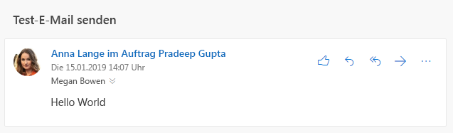

# <a name="send-outlook-messages-from-another-user"></a><span data-ttu-id="97ea1-103">Senden von Outlook-Nachrichten von einem anderen Benutzer</span><span class="sxs-lookup"><span data-stu-id="97ea1-103">Send Outlook messages from another user</span></span>

<span data-ttu-id="97ea1-104">Exchange Online bietet [Postfachberechtigungen](/Exchange/recipients/mailbox-permissions), über die ein Benutzer E-Mails senden kann, bei denen es so aussieht, als würden diese von einem anderen Benutzer, einer Verteilerliste, einer Gruppe, einer Ressource oder von einem freigegebenen Postfach gesendet werden.</span><span class="sxs-lookup"><span data-stu-id="97ea1-104">Exchange Online provides [mailbox permissions](/Exchange/recipients/mailbox-permissions) that allow a user to send mail that appears to be sent from another user, distribution list, group, resource, or shared mailbox.</span></span> <span data-ttu-id="97ea1-105">Microsoft Graph unterstützt dieses Feature auch, das Endergebnis variiert aber in Abhängigkeit von den genauen Berechtigungen, die in Exchange Online gewährt wurden, und von der API, die Sie zum Senden der E-Mail verwenden.</span><span class="sxs-lookup"><span data-stu-id="97ea1-105">Microsoft Graph supports this feature as well, but the end result varies depending on the exact permissions granted in Exchange Online and which API you use to send the mail.</span></span>

## <a name="permissions"></a><span data-ttu-id="97ea1-106">Berechtigungen</span><span class="sxs-lookup"><span data-stu-id="97ea1-106">Permissions</span></span>

<span data-ttu-id="97ea1-107">Zwei Arten von Berechtigungen gelten für das Senden von Nachrichten von einem anderen Benutzer: [Microsoft Graph-Berechtigungen](permissions-reference.md) und Berechtigungen.</span><span class="sxs-lookup"><span data-stu-id="97ea1-107">Two types of permissions apply to sending messages from another user: [Microsoft Graph permissions](permissions-reference.md), and mailbox permissions.</span></span>

### <a name="microsoft-graph-permissions"></a><span data-ttu-id="97ea1-108">Microsoft Graph-Berechtigungen</span><span class="sxs-lookup"><span data-stu-id="97ea1-108">Microsoft Graph permissions</span></span>

<span data-ttu-id="97ea1-109">Um Nachrichten von einem anderen Benutzer zu senden, verwenden Anwendungen, die Benutzertoken verwenden, die Berechtigung **Mail.Send.Shared**.</span><span class="sxs-lookup"><span data-stu-id="97ea1-109">In order to send messages from another user, applications that use user tokens use the **Mail.Send.Shared** permission.</span></span>

> [!NOTE]
> <span data-ttu-id="97ea1-110">Anwendungen, die Anwendungstoken anstelle von Benutzertoken verwenden und bei denen die **Mail.Send**-Berechtigung von einem Administrator genehmigt wurde, können E-Mails als beliebiger Benutzer in der Organisation senden, indem die E-Mails normal über das Postfach des Benutzers gesendet werden.</span><span class="sxs-lookup"><span data-stu-id="97ea1-110">Applications that use application tokens instead of user tokens and have the **Mail.Send** permission consented by an administrator can send mail as any user in the organization by sending the mail normally through the user's mailbox.</span></span>

### <a name="mailbox-permissions"></a><span data-ttu-id="97ea1-111">Postfachberechtigungen</span><span class="sxs-lookup"><span data-stu-id="97ea1-111">Mailbox permissions</span></span>

<span data-ttu-id="97ea1-112">Zwei Berechtigungen haben Auswirkungen auf das Endergebnis des Sendens einer Nachricht von einem anderen Benutzer: **Senden im Auftrag von** und **Senden als**.</span><span class="sxs-lookup"><span data-stu-id="97ea1-112">Two permissions affect the end result of sending a message from another user: **Send on Behalf** and **Send As**.</span></span> <span data-ttu-id="97ea1-113">Der Benutzer, der bei der Anwendung mit der Berechtigung **Mail.Send.Shared** angemeldet ist, MUSS mindestens eine dieser Berechtigungen für das Postfach, die Gruppe oder die Verteilerliste besitzen, von der die E-Mail stammt.</span><span class="sxs-lookup"><span data-stu-id="97ea1-113">The user that is signed in to your application with the **Mail.Send.Shared** permission MUST have at least one of these permissions granted to the mailbox, group, or distribution list that the mail is from.</span></span>

#### <a name="send-on-behalf"></a><span data-ttu-id="97ea1-114">Senden im Auftrag von</span><span class="sxs-lookup"><span data-stu-id="97ea1-114">Send on Behalf</span></span>

<span data-ttu-id="97ea1-115">Bei dieser Berechtigung gibt es für den Empfänger der E-Mail einen Hinweis im E-Mail-Client, dass die Nachricht von dem Benutzer Ihrer Anwendung im Auftrag eines anderen Benutzers gesendet wurde.</span><span class="sxs-lookup"><span data-stu-id="97ea1-115">With this permission, the recipient of the email has an indication in their email client that the message was sent by the user of your application on behalf of another user.</span></span>



<span data-ttu-id="97ea1-117">Dies wird in Microsoft Graph als `sender`-Eigenschaft (Benutzer, der die Nachricht tatsächlich gesendet hat) und als `from`-Eigenschaft verfügbar gemacht (Benutzer/Gruppe/usw., von dem bzw. der die Nachricht zu sein scheint).</span><span class="sxs-lookup"><span data-stu-id="97ea1-117">This is exposed in Microsoft Graph as the `sender` (user that actually sent the message) and `from` (user/group/etc. that the message appears to be from) properties.</span></span>

```json
{
  "id": "AAMkAGE1...",
  "subject": "Send mail test",
  "sender": {
    "emailAddress": {
      "name": "Adele Vance",
      "address": "AdeleV@contoso.com"
    }
  },
  "from": {
    "emailAddress": {
      "name": "Pradeep Gupta",
      "address": "PradeepG@contoso.com"
    }
  }
}
```

<span data-ttu-id="97ea1-118">Ein Benutzer kann diese Berechtigung für das eigene Postfach einem anderen Benutzer [mithilfe von Outlook](https://support.office.com/article/Allow-someone-else-to-manage-your-mail-and-calendar-41C40C04-3BD1-4D22-963A-28EAFEC25926) erteilen.</span><span class="sxs-lookup"><span data-stu-id="97ea1-118">A user can grant this permission for their own mailbox to another user by [using Outlook](https://support.office.com/article/Allow-someone-else-to-manage-your-mail-and-calendar-41C40C04-3BD1-4D22-963A-28EAFEC25926).</span></span> <span data-ttu-id="97ea1-119">Administratoren können diese Berechtigung für ein beliebiges Postfach, eine beliebige Gruppe oder eine beliebige Verteilerliste im [Office 365 Admin Center](/office365/admin/add-users/give-mailbox-permissions-to-another-user?view=o365-worldwide) erteilen.</span><span class="sxs-lookup"><span data-stu-id="97ea1-119">Administrators can grant this permission for any mailbox, group, or distribution list in the [Office 365 admin center](/office365/admin/add-users/give-mailbox-permissions-to-another-user?view=o365-worldwide).</span></span>

#### <a name="send-as"></a><span data-ttu-id="97ea1-120">Senden als</span><span class="sxs-lookup"><span data-stu-id="97ea1-120">Send As</span></span>

<span data-ttu-id="97ea1-121">Bei dieser Berechtigung gibt es keinen Hinweis darauf, dass die Nachricht als ein anderer Benutzer gesendet wurde.</span><span class="sxs-lookup"><span data-stu-id="97ea1-121">With this permission, there is no indication that the message was sent as a different user.</span></span> <span data-ttu-id="97ea1-122">Die `sender`-Eigenschaft und die `from`-Eigenschaft weisen denselben Wert auf.</span><span class="sxs-lookup"><span data-stu-id="97ea1-122">The `sender` and `from` properties have the same value.</span></span>

<span data-ttu-id="97ea1-123">Benutzer können diese Berechtigung nicht für ihre Postfächer erteilen.</span><span class="sxs-lookup"><span data-stu-id="97ea1-123">Users cannot grant this permission to their mailboxes.</span></span> <span data-ttu-id="97ea1-124">Administratoren können diese Berechtigung im Office 365 Admin Center erteilen.</span><span class="sxs-lookup"><span data-stu-id="97ea1-124">Admins can grant this permission in the Office 365 admin center.</span></span>

## <a name="sending-with-microsoft-graph"></a><span data-ttu-id="97ea1-125">Senden mit Microsoft Graph</span><span class="sxs-lookup"><span data-stu-id="97ea1-125">Authenticating with Microsoft Graph</span></span>

<span data-ttu-id="97ea1-126">Sie können Nachrichten von einem anderen Benutzer senden, indem Sie die Nachricht [direkt senden](/graph/api/user-sendmail?view=graph-rest-1.0) oder [einen Entwurf erstellen](/graph/api/user-post-messages?view=graph-rest-1.0) und diesen dann [senden](/graph/api/message-send?view=graph-rest-1.0).</span><span class="sxs-lookup"><span data-stu-id="97ea1-126">You can send messages from another user by either [sending directly](/graph/api/user-sendmail?view=graph-rest-1.0) or by [creating a draft](/graph/api/user-post-messages?view=graph-rest-1.0) and then [sending it](/graph/api/message-send?view=graph-rest-1.0).</span></span>

<span data-ttu-id="97ea1-127">Um Nachrichten von einem anderen Benutzer zu senden, legen Sie die `from`-Eigenschaft in der [Nachricht](/graph/api/resources/message?view=graph-rest-1.0), die an die E-Mail-Adresse des Benutzers gesendet wird, auf „Senden von“ fest.</span><span class="sxs-lookup"><span data-stu-id="97ea1-127">In order to send from another user, set the `from` property on the [message](/graph/api/resources/message?view=graph-rest-1.0) sent to the email address of the user to send from.</span></span> <span data-ttu-id="97ea1-128">Sie müssen die `sender`-Eigenschaft nicht festlegen: Microsoft Graph legt sie basierend auf den Postfachberechtigungen, die dem angemeldeten Benutzer erteilt wurden, entsprechend fest.</span><span class="sxs-lookup"><span data-stu-id="97ea1-128">You don't need to set the `sender` property - Microsoft Graph will set it appropriately, based on the mailbox permissions granted to the user who has signed in.</span></span>

<span data-ttu-id="97ea1-129">Konfigurieren Sie die Nachricht wie folgt, um beispielsweise E-Mails von der Gruppe `sales@contoso.com` zu senden.</span><span class="sxs-lookup"><span data-stu-id="97ea1-129">For example, to send mail from the `sales@contoso.com` group, configure the message as follows.</span></span>

```json
{
  "subject": "January sales report",
  "toRecipients": [
    {
      "emailAddress": {
        "address": "MeganB@contoso.com"
      }
    }
  ],
  "from": [
    {
      "emailAddress": {
        "address": "sales@contoso.com"
      }
    }
  ]
}
```

## <a name="sent-items-behavior"></a><span data-ttu-id="97ea1-130">Verhalten von gesendeten Elementen</span><span class="sxs-lookup"><span data-stu-id="97ea1-130">Sent Items behavior</span></span>

<span data-ttu-id="97ea1-131">Nachdem die Nachricht gesendet wurde, kann sie im Ordner „Gesendete Elemente“ des sendenden Benutzers, im Ordner „Gesendete Elemente“ des ursprünglichen Benutzers oder in beiden Ordnern gespeichert werden.</span><span class="sxs-lookup"><span data-stu-id="97ea1-131">After the message is sent, it can be saved to the sending user's Sent Items folder, the from user's Sent Items folder, or both.</span></span> <span data-ttu-id="97ea1-132">Sie müssen die Nachricht aber nicht speichern.</span><span class="sxs-lookup"><span data-stu-id="97ea1-132">It can also not be saved at all.</span></span>

> [!NOTE]
> <span data-ttu-id="97ea1-133">Wenn die Nachricht von einer Adresse gesendet wird, die nicht über ein Postfach verfügt (z. B. eine Verteilerliste), gibt es für den Benutzer, von dem die Nachricht stammt, keinen Ordner „Gesendete Elemente“.</span><span class="sxs-lookup"><span data-stu-id="97ea1-133">If the message is sent from an address that does not have a mailbox (a distribution list, for example), there is no Sent Items for the from user.</span></span>

- <span data-ttu-id="97ea1-134">Wenn Ihre Anwendung die Nachricht über den `/me`-Endpunkt sendet (oder über `/users/{user-id}`, wobei `user-id` dem angemeldeten Benutzer entspricht), so wird die Nachricht standardmäßig im Ordner „Gesendete Elemente“ des sendenden Benutzers gespeichert.</span><span class="sxs-lookup"><span data-stu-id="97ea1-134">If your application sends by using the `/me` endpoint (or `/users/{user-id}` where the `user-id` corresponds to the signed in user), by default, the message will be saved in the sending user's Sent Items folder.</span></span>
- <span data-ttu-id="97ea1-135">Wenn Ihre Anwendung die Nachricht über `/users/{user-id}` sendet, wobei `user-id` dem Benutzer entspricht, von dem die Nachricht stammt, so wird die Nachricht standardmäßig im Ordner „Gesendete Elemente“ des Benutzers gespeichert, von dem die Nachricht stammt.</span><span class="sxs-lookup"><span data-stu-id="97ea1-135">If your application sends by using the `/users/{user-id}` where the `user-id` corresponds to the from user, by default, the message will be saved in the from user's Sent Items folder.</span></span>
    > [!IMPORTANT]
    > <span data-ttu-id="97ea1-136">Um eine Nachricht auf diese Weise zu senden, muss der sendende Benutzer zusätzlich zur Berechtigung **Senden im Auftrag von** oder **Senden als** über die Postfachberechtigung **Vollzugriff** verfügen.</span><span class="sxs-lookup"><span data-stu-id="97ea1-136">In order to send this way, the sending user must have the **Full Access** mailbox permission in addition to either the **Send on Behalf** or **Send As** permission.</span></span>

<span data-ttu-id="97ea1-137">Das Standardverhalten kann durch andere externe Faktoren geändert werden:</span><span class="sxs-lookup"><span data-stu-id="97ea1-137">The default behavior can be changed by other outside factors:</span></span>

- <span data-ttu-id="97ea1-138">Administratoren können das Postfach des Benutzers, von dem die Nachricht stammt, so ändern, [dass im Ordner „Gesendete Elemente“ immer eine Kopie von Nachrichten gespeichert wird, die von einem Stellvertreter gesendet werden](/exchange/recipients-in-exchange-online/manage-user-mailboxes/automatically-save-sent-items-in-delegator-s-mailbox).</span><span class="sxs-lookup"><span data-stu-id="97ea1-138">Administrators can update the from user's mailbox to [always save a copy of messages sent from a delegate](/exchange/recipients-in-exchange-online/manage-user-mailboxes/automatically-save-sent-items-in-delegator-s-mailbox) to their Sent Items.</span></span>
- <span data-ttu-id="97ea1-139">Durch Festlegen der `saveToSentItems`-Eigenschaft auf `true` in einer Anforderung zum [Senden von E-Mails](/graph/api/user-sendmail?view=graph-rest-1.0) können Sie verhindern, dass die Nachricht im Ordner „Gesendete Elemente“ gespeichert wird.</span><span class="sxs-lookup"><span data-stu-id="97ea1-139">By setting the `saveToSentItems` property to `true` in a [send mail](/graph/api/user-sendmail?view=graph-rest-1.0) request, you can prevent the item from being saved to the Sent Items folder.</span></span> <span data-ttu-id="97ea1-140">Wenn ein Administrator aber die Einstellung „immer eine Kopie speichern“ konfiguriert hat, wird die Nachricht dennoch im Ordner „Gesendete Elemente“ des Benutzers gespeichert, von dem die Nachricht stammt.</span><span class="sxs-lookup"><span data-stu-id="97ea1-140">However, if an administrator has configured the "always save a copy" setting, the message will still be saved to the from user's Sent Items.</span></span>

## <a name="examples"></a><span data-ttu-id="97ea1-141">Beispiele</span><span class="sxs-lookup"><span data-stu-id="97ea1-141">Examples</span></span>

### <a name="example-1-successful-send-through-me-endpoint"></a><span data-ttu-id="97ea1-142">Beispiel 1: Erfolgreiches Senden über /me-Endpunkt</span><span class="sxs-lookup"><span data-stu-id="97ea1-142">Example 1: Successful send through /me endpoint</span></span>

<span data-ttu-id="97ea1-143">In diesem Beispiel wurde Adele Vance die Berechtigung **Senden im Auftrag von** für das Postfach von Allan Deyoung erteilt.</span><span class="sxs-lookup"><span data-stu-id="97ea1-143">In this example, Adele Vance has been granted **Send on Behalf** permission to Allan Deyoung's mailbox.</span></span>

#### <a name="request"></a><span data-ttu-id="97ea1-144">Anforderung</span><span class="sxs-lookup"><span data-stu-id="97ea1-144">Request</span></span>

```http
POST /me/sendmail
Content-Type: application/json

{
  "message": {
    "subject": "Expense reports",
    "body": {
      "contentType": "text",
      "content": "Have you submitted your expense reports yet?"
    },
    "toRecipients": [
      {
        "emailAddress": {
          "address": "MeganB@contoso.com"
        }
      }
    ],
    "from": [
      {
        "emailAddress": {
          "address": "AllanD@contoso.com"
        }
      }
    ]
  }
}
```

#### <a name="response"></a><span data-ttu-id="97ea1-145">Antwort</span><span class="sxs-lookup"><span data-stu-id="97ea1-145">Response</span></span>

```http
HTTP/1.1 202 Accepted
```

### <a name="example-2-unsuccessful-attempt-to-send-without-permissions"></a><span data-ttu-id="97ea1-146">Beispiel 2: Fehlgeschlagener Sendeversuch ohne Berechtigungen</span><span class="sxs-lookup"><span data-stu-id="97ea1-146">Example 2: Unsuccessful attempt to send without permissions</span></span>

<span data-ttu-id="97ea1-147">In diesem Beispiel versucht Adele Vance, eine E-Mail von Patti Fernandez zu senden, ihr wurde aber weder die Berechtigung **Senden im Auftrag von** noch die Berechtigung **Senden als** erteilt.</span><span class="sxs-lookup"><span data-stu-id="97ea1-147">In this example, Adele Vance attempts to send an email from Patti Fernandez, but has not been granted either the **Send on Behalf** or **Send As** permission.</span></span> <span data-ttu-id="97ea1-148">Die Antwort enthält einen `ErrorSendAsDenied`-Fehler.</span><span class="sxs-lookup"><span data-stu-id="97ea1-148">The response contains a `ErrorSendAsDenied`.</span></span>

<!-- markdownlint-disable MD024 -->

#### <a name="request"></a><span data-ttu-id="97ea1-149">Anforderung</span><span class="sxs-lookup"><span data-stu-id="97ea1-149">Request</span></span>

```http
POST /me/sendmail
Content-Type: application/json

{
  "message": {
    "subject": "Support ticket",
    "body": {
      "contentType": "text",
      "content": "I noticed you opened a support ticket yesterday..."
    },
    "toRecipients": [
      {
        "emailAddress": {
          "address": "MeganB@contoso.com"
        }
      }
    ],
    "from": [
      {
        "emailAddress": {
          "address": "PattiF@contoso.com"
        }
      }
    ]
  }
}
```

#### <a name="response"></a><span data-ttu-id="97ea1-150">Antwort</span><span class="sxs-lookup"><span data-stu-id="97ea1-150">Response</span></span>

```http
HTTP/1.1 403 Forbidden
Content-Type: application/json

{
  "error": {
    "code": "ErrorSendAsDenied",
    "message": "The user account which was used to submit this request does not have the right to send mail on behalf of the specified sending account., Cannot submit message.",
    "innerError": {
      "request-id": "24e7991e-01ae-4cc2-8e06-532a96fd8948",
      "date": "2019-01-16T18:53:25"
    }
  }
}
```

## <a name="next-steps"></a><span data-ttu-id="97ea1-151">Nächste Schritte</span><span class="sxs-lookup"><span data-stu-id="97ea1-151">Next steps</span></span>

<span data-ttu-id="97ea1-152">Weitere Informationen:</span><span class="sxs-lookup"><span data-stu-id="97ea1-152">Find out more about:</span></span>

- [<span data-ttu-id="97ea1-153">Gründe für die Integration in Outlook-Mail</span><span class="sxs-lookup"><span data-stu-id="97ea1-153">Why integrate with Outlook mail</span></span>](outlook-mail-concept-overview.md)
- <span data-ttu-id="97ea1-154">[Verwenden der Mail-API](/graph/api/resources/mail-api-overview?view=graph-rest-1.0) und [Anwendungsfälle](/graph/api/resources/mail-api-overview?view=graph-rest-1.0#common-use-cases) für die Mail-API in Microsoft Graph v1.0.</span><span class="sxs-lookup"><span data-stu-id="97ea1-154">[Using the mail API](/graph/api/resources/mail-api-overview?view=graph-rest-1.0) and its [use cases](/graph/api/resources/mail-api-overview?view=graph-rest-1.0#common-use-cases) in Microsoft Graph v1.0.</span></span>

<!-- {
  "type": "#page.annotation",
  "suppressions": [
    "Error: /concepts/outlook-send-mail-from-other-user.md:
      Exception processing links.
    System.ArgumentException: Link Definition was null. Link text: !NOTE
      at ApiDoctor.Validation.DocFile.get_LinkDestinations()
      at ApiDoctor.Validation.DocSet.ValidateLinks(Boolean includeWarnings, String[] relativePathForFiles, IssueLogger issues, Boolean requireFilenameCaseMatch, Boolean printOrphanedFiles)"
  ]
}-->
