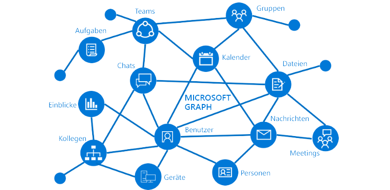

# Übersicht über Microsoft GraphOverview of Microsoft Graph

Microsoft Graph ist das Gateway zu Daten und Intelligence in Microsoft 365.Microsoft Graph is the gateway to data and intelligence in Microsoft 365. Microsoft Graph bietet ein einheitliches Programmiermodell, das Sie verwenden können, um die enorme Menge von Daten in Office 365, Enterprise Mobility + Security und Windows 10 zu nutzen.Microsoft Graph provides a unified programmability model that you can use to take advantage of the tremendous amount of data in Office 365, Enterprise Mobility + Security, and Windows 10. 

Mit der Microsoft Graph-API können Sie Apps für Organisationen und Heimanwender erstellen, die mit den Daten von Millionen von Benutzern interagieren.You can use the Microsoft Graph API to build apps for organizations and consumers that interact with the data of millions of users. Mit Microsoft Graph können Sie eine Verbindung mit einer Vielzahl von Ressourcen, Beziehungen und Intelligence über einen einzelnen Endpunkt herstellen: `https://graph.microsoft.com`.With Microsoft Graph, you can connect to a wealth of resources, relationships, and intelligence, all through a single endpoint: `https://graph.microsoft.com`.

## Was ist im Diagramm zu sehen?What's in the graph?
Microsoft Graph macht REST-APIs und Clientbibliotheken für den Zugriff auf Daten aus diesen Quellen verfügbar:Microsoft Graph exposes REST APIs and client libraries to access data on the following:

- Azure Active DirectoryAzure Active Directory
- Office 365-Dienste: SharePoint, OneDrive, Outlook/Exchange, Microsoft Teams, OneNote, Planner und ExcelOffice 365 services: SharePoint, OneDrive, Outlook/Exchange, Microsoft Teams, OneNote, Planner, and Excel
- Enterprise Mobility + Security-Dienste: Identity Manager, Intune, Advanced Threat Analytics und Advanced Threat Protection.Enterprise Mobility and Security services: Identity Manager, Intune, Advanced Threat Analytics, and Advanced Threat Protection.
- Windows 10-Dienste: Aktivitäten und GeräteWindows 10 services: activities and devices
- Schulung und WeiterbildungEducation

Weitere Informationen finden Sie unter [Wesentliche Dienste und Features in Microsoft Graph](overview-major-services.md).To find out more, see [Major services and features in Microsoft Graph](overview-major-services.md).

Microsoft Graph verbindet alle Ressourcen in diesen Diensten durch Beziehungen.Microsoft Graph connects all the resources across these services using relationships. Beispielsweise kann ein Benutzer mit einer Gruppe über eine [memberOf](/graph/api/user-list-memberof?view=graph-rest-1.0)-Beziehung und mit einem anderen Benutzer über eine [manager](/graph/api/user-list-manager?view=graph-rest-1.0)-Beziehung verbunden sein.For example, a user can be connected to a group through a [memberOf](/graph/api/user-list-memberof?view=graph-rest-1.0) relationship, and to another user through a [manager relationship](/graph/api/user-list-manager?view=graph-rest-1.0). Ihre App kann diese Beziehungen durchlaufen, um über die API auf diese verbundenen Ressourcen zuzugreifen und Aktionen für sie auszuführen.Your app can traverse these relationships to access these connected resources and perform actions on them through the API.

Mit Microsoft Graph können Sie außerdem wertvolle Erkenntnisse aus den Daten gewinnen.You can also get valuable insights and intelligence about the data from Microsoft Graph. Sie können z. B. herausfinden, welche Dateien eines bestimmten Benutzers [besonders beliebt](/graph/api/resources/insights-trending?view=graph-rest-beta) sind oder mit welchen [Personen](/graph/api/user-list-people?view=graph-rest-beta) er eng zusammenarbeitet.For example, you can get the popular files [trending around](/graph/api/resources/insights-trending?view=graph-rest-beta) a particular user, or [get the most relevant people](/graph/api/user-list-people?view=graph-rest-beta) around a user.

Entdecken Sie die Möglichkeiten der Beziehungen innerhalb von Microsoft Graph.Discover the possibilities in the relationships within Microsoft Graph.

## Was können Sie mit Microsoft Graph tun?What can you do with Microsoft Graph? 

Sie können Microsoft Graph verwenden, um Benutzer zielgerichtet mit für sie relevanten Informationen zu versorgen und ihnen so zu helfen, produktiver zu arbeiten. Stellen Sie sich eine App vor, die ...You can use Microsoft Graph to build experiences around the user's unique context to help them be more productive. Imagine an app that...

- auf Ihr nächstes Meeting schaut und Ihnen hilft, sich darauf vorzubereiten, indem sie Profilinformationen für Teilnehmer, einschließlich ihrer Jobtitel und deren Arbeit, sowie Informationen über die neuesten Dokumente und Projekte, an denen sie arbeiten, bereitstellt.Looks at your next meeting and helps you prepare for it by providing profile information for attendees, including their job titles and who they work with, as well as information about the latest documents and projects they're working on.
- Ihren Kalender überprüft und die beste Zeit für Ihre nächstes Teammeeting vorschlägt.Scans your calendar, and suggests the best times for the next team meeting.
- die neueste Verkaufsprognose aus einer Excel-Datei in Ihrem OneDrive abruft, damit Sie sie in Echtzeit aktualisieren können - auf Ihrem Mobiltelefon.Fetches the latest sales projection chart from an Excel file in your OneDrive and lets you update the forecast in real time, all from your phone.
- Änderungen in Ihrem Kalender abonniert, Ihnen eine Warnung sendet, wenn Sie zu viel Zeit in Meetings verbringen, und Vorschläge macht, welche Meetings sie getrost verpassen oder delegieren können, abhängig von den anderen Teilnehmern und davon, wie eng sie mit diesen zusammenarbeiten.Subscribes to changes in your calendar, sends you an alert when you’re spending too much time in meetings, and provides recommendations for the ones you can miss or delegate based on how relevant the attendees are to you.
- Ihnen hilft, persönliche und geschäftliche Informationen auf Ihrem Mobiltelefon zu sortieren. Beispielsweise sollten Bilder in Ihrem persönlichen OneDrive gespeichert werden und Geschäftsbelege in Ihrem OneDrive for Business.Helps you sort out personal and work information on your phone; for example, by categorizing pictures that should go to your personal OneDrive and business receipts that should go to your OneDrive for Business.

Mit der Microsoft Graph-API können Sie all dies und mehr erledigen.You can do all this and more with the Microsoft Graph API.

>**Hinweis:** Wenn Sie die Microsoft Graph-API verwenden, stimmen Sie den [Microsoft Graph-Nutzungsbedingungen](https://developer.microsoft.com/graph/docs/misc/terms-of-use) und den [Microsoft-Datenschutzbestimmungen](https://go.microsoft.com/fwlink/?LinkId=521839) zu.**Note:** When you use the Microsoft Graph API, you agree to the [Microsoft Graph Terms of Use](https://developer.microsoft.com/graph/docs/misc/terms-of-use) and the [Microsoft Privacy Statement](https://go.microsoft.com/fwlink/?LinkId=521839).

### Beliebte AnforderungenPopular requests

Sehen Sie sich diese allgemeinen Szenarios für das Arbeiten mit der Microsoft Graph-API an.Check out some of these common scenarios for working with the Microsoft Graph API. Über die Links gelangen Sie zum [Graph-Tester](https://developer.microsoft.com/graph/graph-explorer).The links take you to the [Graph Explorer](https://developer.microsoft.com/graph/graph-explorer).

| **Vorgang****Operation** | **URL****URL** |
|:--------------------------|:----------------------------------------|
|   Eigenes Profil mit GET abrufenGET my profile |    [`https://graph.microsoft.com/v1.0/me`](https://developer.microsoft.com/graph/graph-explorer/?request=me&version=v1.0) |
|   Eigene Dateien mit GET abrufenGET my files | [`https://graph.microsoft.com/v1.0/me/drive/root/children`](https://developer.microsoft.com/graph/graph-explorer/?request=me%2Fdrive%2Froot%2Fchildren&version=v1.0) |
|   Eigenes Foto mit GET abrufen	GET my photo | [`https://graph.microsoft.com/v1.0/me/photo/$value`](https://developer.microsoft.com/graph/graph-explorer/?request=me%2Fphoto%2F%24value&version=v1.0) |
|   Eigene E-Mail mit GET abrufenGET my mail |   [`https://graph.microsoft.com/v1.0/me/messages`](https://developer.microsoft.com/graph/graph-explorer/?request=me%2Fmessages&version=v1.0) |
|   Eigene E-Mails mit Wichtigkeit „Hoch“ mit GET abrufenGET my high importance email | [`https://graph.microsoft.com/v1.0/me/messages?$filter=importance%20eq%20'high'`](https://developer.microsoft.com/graph/graph-explorer/?request=me%2Fmessages%3F%24filter%3Dimportance%2520eq%2520'high'&version=v1.0) |
|   Eigene Kalenderereignisse mit GET abrufenGET my calendar events |    [`https://graph.microsoft.com/v1.0/me/events`](https://developer.microsoft.com/graph/graph-explorer/?request=me%2Fevents&version=v1.0) |
|   Eigenen Vorgesetzten mit GET abrufenGET my manager  | [`https://graph.microsoft.com/v1.0/me/manager`](https://developer.microsoft.com/graph/graph-explorer/?request=me%2Fmanager&version=v1.0) |
|   Letzten Benutzer zum Ändern der Datei „foo.txt“ mit GET abrufenGET last user to modify file foo.txt |  [`https://graph.microsoft.com/v1.0/me/drive/root/children/foo.txt/lastModifiedByUser`](https://developer.microsoft.com/graph/graph-explorer/?request=me%2Fdrive%2Froot%2Fchildren%2Ffoo.txt%2FlastModifiedByUser&version=v1.0) |
|   Office 365-Gruppen, bei denen ich Mitglied bin, mit GET abrufenGET Office365 groups I’m member of| [`https://graph.microsoft.com/v1.0/me/memberOf/$/microsoft.graph.group?$filter=groupTypes/any(a:a%20eq%20'unified')`](https://developer.microsoft.com/graph/graph-explorer/?request=me%2FmemberOf%2F%24%2Fmicrosoft.graph.group%3F%24filter%3DgroupTypes%2Fany(a%3Aa%2520eq%2520'unified')&version=v1.0) |
|   Benutzer in meiner Organisation mit GET abrufenGET users in my organization     | [`https://graph.microsoft.com/v1.0/users`](https://developer.microsoft.com/graph/graph-explorer/?request=users&version=v1.0) |
|   Gruppen in meiner Organisation mit GET abrufenGET groups in my organization | [`https://graph.microsoft.com/v1.0/groups`](https://developer.microsoft.com/graph/graph-explorer/?request=groups&version=v1.0) |
|   Verwandte Personen mit GET abrufenGET people related to me    | [`https://graph.microsoft.com/v1.0/me/people`](https://developer.microsoft.com/graph/graph-explorer/?request=me%2Fpeople&version=beta)  |
|   Populäre Elemente mit GET abrufenGET items trending around me |  [`https://graph.microsoft.com/beta/me/insights/trending`](https://developer.microsoft.com/graph/graph-explorer/?request=me%2Finsights%2Ftrending&version=beta) |
|   Eigene Notizen mit GET abrufenGET my notes |  [`https://graph.microsoft.com/v1.0/me/onenote/notebooks`](https://developer.microsoft.com/graph/graph-explorer/?request=me%2Fonenote%2Fnotebooks&version=beta) |

## Zugriff auf Microsoft Graph im großen MaßstabAccess Microsoft Graph at scale

Microsoft Graph Data Connect ermöglicht den Massenzugriff auf Office 365-Daten, im Gegensatz zum herkömmlichen Transaktionszugriff.Microsoft Graph Data Connect enables bulk - rather than the traditional transactional - access to Office 365 data. Mit den Office 365-Massendaten können Sie Azure-Tools verwenden, um intelligente Apps mit dieser Funktionalität zu erstellen:With the bulk Office 365 data, you can use Azure tools to build intelligent apps that:

- Suchen des nächstgelegenen Experten zu einem Thema in Ihrer OrganisationFind you the closest expert on a topic to you in your organization 
- Automatische Erstellung von WissensdatenbankenAutomate knowledge base creation
- Analysieren von Besprechungsanfragen, um Erkenntnisse über die Auslastung von Konferenzräumen zu gewinnenAnalyze meeting requests to provide insights into conference room utilization
- Erkennen von Betrug mit Produktivitäts- und KommunikationsdatenDetect fraud with productivity and communication data

## Wann sollte Microsoft Graph Data Connect verwendet werden?When should I use Microsoft Graph Data Connect?

Microsoft Graph Data Connect bietet Ihnen einen neuen Weg zur Interaktion mit den Daten, die über die Microsoft Graph-APIs verfügbar sind.Microsoft Graph Data Connect provides a new way for you to interact with the data that's available through Microsoft Graph APIs. Über den skalierbaren Zugriff auf Office 365-Daten hinaus bietet Microsoft Graph Data Connect eine einmalige Sammlung von Funktionen, mit denen sich die Erstellung intelligenter Anwendungen optimieren lässt, und all das innerhalb der Microsoft-Cloud.In addition to providing scalable access to Office 365 data, Microsoft Graph Data Connect also provides a unique set of capabilities that streamline the building of intelligent applications, all within the Microsoft cloud.

|**Funktion****Feature**| **Microsoft Graph-API****Microsoft Graph API** | **Microsoft Graph Data Connect****Microsoft Graph Data Connect** |
|:----------|:------------------------|:--------------------------------------|
| **Zugriffsbereich****Access scope** | Einzelner Benutzer oder gesamter MandantSingle user or entire tenant | Viele Benutzer oder GruppenMany users or groups |
| **Zugriffsmuster****Access pattern** | EchtzeitReal time | Wiederkehrender ZeitplanRecurrent schedule |
| **Datenoperationen****Data operations** | Arbeitet auf dem DatenmasterOperates on data master | Arbeitet auf einem Cache der DatenOperates on a cache of the data |
| **Datenschutz****Data protection** | Daten sind geschützt, während sie sich in Microsoft 365 befindenData is protected while in Microsoft 365 | Der Datenschutz wird auf den Cache der Daten in Ihrem Azure-Abonnement ausgeweitetData protection is extended to the cache of data in your Azure subscription |
| **Benutzerzustimmung****User consent** | SelfSelf RessourcentypenResource types | KeineNone |
| **Administratorzustimmung****Admin consent** | Gesamte OrganisationEntire organization RessourcentypenResource types | Ausgewählte BenutzergruppenSelect groups of users Ressourcentypen und EigenschaftenResource types and properties Ausschluss von BenutzernExcludes users |
| **Zugriffstools****Access tools** | RESTful-WebabfragenRESTful web queries | Azure Data FactoryAzure Data Factory |

Weitere Informationen zu Microsoft Graph Data Connect finden Sie unter [Microsoft Graph Data Connect](data-connect-overview.md).For more information about Microsoft Graph Data Connect, see [Microsoft Graph Data Connect](data-connect-overview.md). Informationen zum Einstieg finden Sie in der [Übersicht zu Microsoft Graph Data Connect](data-connect-concept-overview.md).To get started, see [Overview of Microsoft Graph Data Connect](data-connect-concept-overview.md). 

## Nächste SchritteNext steps

- Sehen Sie sich [ausgewählte Szenarios](https://developer.microsoft.com/graph/examples) an.Check out some [featured scenarios](https://developer.microsoft.com/graph/examples).
- Starten Sie eine Beispielanforderung im [Graph-Tester](https://developer.microsoft.com/graph/graph-explorer).Try a sample request in the [Graph Explorer](https://developer.microsoft.com/graph/graph-explorer).
- Nutzen Sie den [Schnellstart](https://developer.microsoft.com/graph/quick-start), um eine sofort ausführbare Beispiel-App einzurichten.Use the [quick start](https://developer.microsoft.com/graph/quick-start) to set up a ready-to-run sample app.
- Sehen Sie im Inhaltsverzeichnis unter **Lernen** nach, um mehr über die Dienste und Features zu erfahren, die Sie in diesen Szenarios verwenden können.Look under **Learn** in the table of contents to read about services and features that you can use in your scenarios. 
- Erfahren Sie, wie Sie [ein Authentifizierungstoken](auth-overview.md) in Ihrer App erhalten.Find out how to [get an auth token](auth-overview.md) in your app.
- Beginnen Sie damit, die [API zu verwenden](use-the-api.md).Start [using the API](use-the-api.md).

## Feedback?Feedback?

Ihr Feedback ist uns wichtig. Nehmen Sie auf [Stack Overflow](https://stackoverflow.com/questions/tagged/office365+or+microsoftgraph) Kontakt mit uns auf. Taggen Sie Ihre Fragen mit {MicrosoftGraph}.Your feedback is important to us. Connect with us on [Stack Overflow](https://stackoverflow.com/questions/tagged/office365+or+microsoftgraph). Tag your questions with {MicrosoftGraph}.

