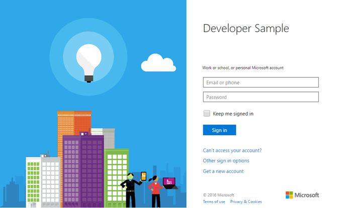

# <a name="get-started-with-microsoft-graph-in-a-php-app"></a><span data-ttu-id="fd971-101">Erste Schritte mit Microsoft Graph in einer PHP-App</span><span class="sxs-lookup"><span data-stu-id="fd971-101">Get started with Microsoft Graph in a PHP app</span></span>

<span data-ttu-id="fd971-p101">Dieser Artikel beschreibt die erforderlichen Aufgaben zum Abrufen eines Zugriffstokens vom Azure AD v2.0-Endpunkt und zum Aufrufen von Microsoft Graph. Sie werden durch die Erstellung der [Connect-Beispiels für PHP (REST)](https://github.com/microsoftgraph/php-connect-rest-sample) geführt und erhalten Informationen zu den Hauptkonzepten, die Sie zur Verwendung von Microsoft Graph implementieren. In diesem Artikel wird auch beschrieben, wie Sie mithilfe von REST-Aufrufen auf Microsoft Graph zugreifen.</span><span class="sxs-lookup"><span data-stu-id="fd971-p101">This article describes the tasks required to get an access token from the Azure AD v2.0 endpoint and call  Microsoft Graph. It walks you through building the [Connect Sample for PHP (REST)](https://github.com/microsoftgraph/php-connect-rest-sample) and explains the main concepts that you implement to use Microsoft Graph. The article also describes how to access Microsoft Graph by using REST calls.</span></span>

<span data-ttu-id="fd971-p102">Um Microsoft Graph in Ihrer PHP-App zu verwenden, müssen Sie für Benutzer die Microsoft-Anmeldeseite anzeigen. Auf dem folgenden Screenshot ist eine Anmeldeseite für Microsoft-Konten dargestellt.</span><span class="sxs-lookup"><span data-stu-id="fd971-p102">To use Microsoft Graph in your PHP app, you need to show the Microsoft sign in page to your users. The following screenshot shows a sign in page for Microsoft accounts.</span></span>



<span data-ttu-id="fd971-108">**Sie möchten keine App erstellen?**</span><span class="sxs-lookup"><span data-stu-id="fd971-108">**Don't feel like building an app?**</span></span> <span data-ttu-id="fd971-109">Laden Sie sich für einen Schnelleinstieg das [Connect-Beispiel für PHP (REST)](https://github.com/microsoftgraph/php-connect-rest-sample) herunter, auf dem dieser Artikel basiert.</span><span class="sxs-lookup"><span data-stu-id="fd971-109">Get up and running fast by downloading the Connect Sample for PHP that this article is based on.</span></span> <span data-ttu-id="fd971-110">Oder testen Sie die Version [Connect-Beispiel für PHP (SDK)](https://github.com/microsoftgraph/php-connect-sample), die die [Microsoft Graph-Bibliothek für PHP](https://github.com/microsoftgraph/msgraph-sdk-php) verwendet.</span><span class="sxs-lookup"><span data-stu-id="fd971-110">Or try out the [Connect Sample for PHP (SDK)](https://github.com/microsoftgraph/php-connect-sample) version that uses the [Microsoft Graph Library for PHP](https://github.com/microsoftgraph/msgraph-sdk-php).</span></span>


## <a name="prerequisites"></a><span data-ttu-id="fd971-111">Voraussetzungen</span><span class="sxs-lookup"><span data-stu-id="fd971-111">Prerequisites</span></span>

<span data-ttu-id="fd971-112">Für die ersten Schritte benötigen Sie:</span><span class="sxs-lookup"><span data-stu-id="fd971-112">To get started, you'll need:</span></span> 

- <span data-ttu-id="fd971-113">Ein [Microsoft-Konto](https://www.outlook.com/) oder ein [Geschäfts- oder Schulkonto](http://dev.office.com/devprogram)</span><span class="sxs-lookup"><span data-stu-id="fd971-113">A [Microsoft account](https://www.outlook.com/) or a [work or school account](http://dev.office.com/devprogram)</span></span>
- <span data-ttu-id="fd971-114">PHP, Version 5.5.9 oder höher</span><span class="sxs-lookup"><span data-stu-id="fd971-114">PHP version 5.5.9 or greater</span></span>
- [<span data-ttu-id="fd971-115">Composer</span><span class="sxs-lookup"><span data-stu-id="fd971-115">Composer</span></span>](https://getcomposer.org/)


## <a name="register-the-application"></a><span data-ttu-id="fd971-116">Registrieren der App</span><span class="sxs-lookup"><span data-stu-id="fd971-116">Register the application</span></span>
<span data-ttu-id="fd971-p104">Registrieren Sie eine App im Microsoft App-Registrierungsportal. Dadurch wird die APP-ID und das Kennwort generiert, mit der bzw. dem Sie die App konfigurieren.</span><span class="sxs-lookup"><span data-stu-id="fd971-p104">Register an app on the Microsoft App Registration Portal. This generates the app ID and password that you'll use to configure the app.</span></span>

1. <span data-ttu-id="fd971-119">Melden Sie sich beim [Microsoft-App-Registrierungsportal](https://apps.dev.microsoft.com/) entweder mit Ihrem persönlichen oder geschäftlichen Konto oder mit Ihrem Schulkonto an.</span><span class="sxs-lookup"><span data-stu-id="fd971-119">Sign into the [Microsoft App Registration Portal](https://apps.dev.microsoft.com/) using either your personal or work or school account.</span></span>

2. <span data-ttu-id="fd971-120">Klicken Sie auf **App hinzufügen**.</span><span class="sxs-lookup"><span data-stu-id="fd971-120">Choose **Add an app**.</span></span>

3. <span data-ttu-id="fd971-121">Geben Sie einen Namen für die App ein, und wählen Sie **Anwendung erstellen** aus.</span><span class="sxs-lookup"><span data-stu-id="fd971-121">Enter a name for the app, and choose **Create application**.</span></span> 
    
    <span data-ttu-id="fd971-122">Die Registrierungsseite wird angezeigt, und die Eigenschaften der App werden aufgeführt.</span><span class="sxs-lookup"><span data-stu-id="fd971-122">The registration page displays, listing the properties of your app.</span></span>

4. <span data-ttu-id="fd971-123">Wählen Sie **Neues Kennwort generieren** aus.</span><span class="sxs-lookup"><span data-stu-id="fd971-123">Choose **Generate New Password**.</span></span>

5. <span data-ttu-id="fd971-124">Kopieren Sie die Anwendungs-ID und das Kennwort:</span><span class="sxs-lookup"><span data-stu-id="fd971-124">Copy the application ID and password.</span></span>

6. <span data-ttu-id="fd971-125">Wählen Sie **Plattform hinzufügen** und **Web** aus.</span><span class="sxs-lookup"><span data-stu-id="fd971-125">Choose **Add Platform** and **Web**.</span></span>

7. <span data-ttu-id="fd971-126">Geben Sie im Feld **Umleitungs-URI** `http://localhost:8000/oauth` ein.</span><span class="sxs-lookup"><span data-stu-id="fd971-126">In the **Redirect URI** field, type `http://localhost:8000/oauth`.</span></span>

8. <span data-ttu-id="fd971-127">Wählen Sie **Speichern** aus.</span><span class="sxs-lookup"><span data-stu-id="fd971-127">Choose **Save**.</span></span>


## <a name="configure-the-project"></a><span data-ttu-id="fd971-128">Konfigurieren des Projekts</span><span class="sxs-lookup"><span data-stu-id="fd971-128">Configure the project</span></span>

<span data-ttu-id="fd971-p105">Starten Sie ein neues Projekt mithilfe von Composer. Um ein neues PHP-Projekt mithilfe des Laravel-Frameworks zu erstellen, verwenden Sie den folgenden Befehl:</span><span class="sxs-lookup"><span data-stu-id="fd971-p105">Start a new project using composer. To create a new PHP project using the Laravel framework, use the following command:</span></span>

```bash
composer create-project --prefer-dist laravel/laravel getstarted
```
 
<span data-ttu-id="fd971-131">Auf diese Weise wird ein **getstarted**-Ordner erstellt, den Sie für dieses Projekt verwenden können.</span><span class="sxs-lookup"><span data-stu-id="fd971-131">This creates a **getstarted** folder that you can use for this project.</span></span>

> <span data-ttu-id="fd971-132">Hinweis: Sie können auch das [Startprojekt](https://github.com/microsoftgraph/php-connect-rest-sample/tree/master/starter-project) verwenden, das die Konfiguration des Projekts übernimmt, sodass Sie sich auf die Codierungsabschnitte dieser Vorgehensweise konzentrieren können.</span><span class="sxs-lookup"><span data-stu-id="fd971-132">Note: You can also use the [Starter project](https://github.com/microsoftgraph/php-connect-rest-sample/tree/master/starter-project) that takes care of the project configuration so you can focus on the coding sections of this walkthrough.</span></span>

## <a name="authenticate-the-user-and-get-an-access-token"></a><span data-ttu-id="fd971-133">Authentifizierung des Benutzers und Abrufen eines Zugriffstokens</span><span class="sxs-lookup"><span data-stu-id="fd971-133">Authenticate the user and get an access token</span></span>
<span data-ttu-id="fd971-p106">Verwenden Sie eine OAuth-Bibliothek, um den Authentifizierungsprozess zu vereinfachen. [Die PHP League](http://thephpleague.com/) bietet eine [OAuth-Clientbibliothek](https://github.com/thephpleague/oauth2-client) an, die Sie in diesem Projekt verwenden können.</span><span class="sxs-lookup"><span data-stu-id="fd971-p106">Use an OAuth library to simplify the authentication process. [The PHP League](http://thephpleague.com/) provides an [OAuth client library](https://github.com/thephpleague/oauth2-client) that you can use in this project.</span></span>

### <a name="add-the-dependency-to-composer"></a><span data-ttu-id="fd971-136">Hinzufügen der Abhängigkeit zu Composer</span><span class="sxs-lookup"><span data-stu-id="fd971-136">Add the dependency to composer</span></span>

<span data-ttu-id="fd971-137">Öffnen Sie die `composer.json`-Datei, und fügen Sie die folgende Abhängigkeit in den Abschnitt **require** ein:</span><span class="sxs-lookup"><span data-stu-id="fd971-137">Open the `composer.json` file and include the following dependency in the **require** section:</span></span>

```json
"league/oauth2-client": "^1.4"
```

<span data-ttu-id="fd971-138">Aktualisieren Sie die Abhängigkeiten, indem Sie den folgenden Befehl ausführen:</span><span class="sxs-lookup"><span data-stu-id="fd971-138">Update the dependencies by running the following command:</span></span>

```bash
composer update
```

### <a name="start-the-authentication-flow"></a><span data-ttu-id="fd971-139">Starten des Authentifizierungsflusses</span><span class="sxs-lookup"><span data-stu-id="fd971-139">Start the authentication flow</span></span>

1. <span data-ttu-id="fd971-p107">Öffnen Sie die Datei **resources** > **views** > **welcome.blade.php**. Ersetzen Sie das **title**-div-Element durch den folgenden Code.</span><span class="sxs-lookup"><span data-stu-id="fd971-p107">Open the **resources** > **views** > **welcome.blade.php** file. Replace the **title** div element with the following code.</span></span>
    ```html
    <div class="title" onClick="window.location='/oauth'">Sign in to Microsoft</div>
    ```
    
2. <span data-ttu-id="fd971-p108">Fügen Sie die `Illuminate\Http\Request`-Klasse mithilfe von Type Hinting in die Datei **app** > **Http** > **routes.php** ein. Fügen Sie die folgende Zeile vor einer Routendeklaration ein.</span><span class="sxs-lookup"><span data-stu-id="fd971-p108">Type-hint the `Illuminate\Http\Request` class on the **app** > **Http** > **routes.php** file. Add the following line before any route declaration.</span></span>
    ```php
    use Illuminate\Http\Request;
    ```
    
3. <span data-ttu-id="fd971-p109">Fügen Sie eine */oauth*-Route zur Datei **app** > **Http** > **routes.php** hinzu. Um die Route hinzuzufügen, kopieren Sie den folgenden Code hinter die Standardroutendeklaration. Fügen Sie die **Anwendungs-ID** und das **Kennwort** Ihrer App in den Platzhalter ein, der mit **\<YOUR_APPLICATION_ID\>** bzw. **\<YOUR_PASSWORD\>** markiert ist.</span><span class="sxs-lookup"><span data-stu-id="fd971-p109">Add an */oauth* route to the **app** > **Http** > **routes.php** file. To add the route, copy the following code after the default route declaration. Insert the **application ID** and **password** of your app in the placeholder marked with **\<YOUR_APPLICATION_ID\>** and **\<YOUR_PASSWORD\>** respectively.</span></span>
    ```php
    Route::get('/oauth', function () {
        $provider = new \League\OAuth2\Client\Provider\GenericProvider([
            'clientId'                => '<YOUR_APPLICATION_ID>',
            'clientSecret'            => '<YOUR_PASSWORD>',
            'redirectUri'             => 'http://localhost:8000/oauth',
            'urlAuthorize'            => 'https://login.microsoftonline.com/common/oauth2/v2.0/authorize',
            'urlAccessToken'          => 'https://login.microsoftonline.com/common/oauth2/v2.0/token',
            'urlResourceOwnerDetails' => '',
            'scopes'                  => 'openid mail.send'
        ]);

        if (!$request->has('code')) {
            return redirect($provider->getAuthorizationUrl());
        }
    });
    ```
    
<span data-ttu-id="fd971-p110">Nun sollten Sie eine PHP-App haben, in der *Bei Microsoft anmelden* angezeigt wird. Wen Sie auf den Text klicken, wird in der App die Microsoft-Anmeldeseite angezeigt. Der nächste Schritt besteht darin, den Code zu behandeln, den der Autorisierungsserver an den Umleitung-URI sendet, und diesen durch ein Zugriffstoken zu ersetzen.</span><span class="sxs-lookup"><span data-stu-id="fd971-p110">At this point, you should have a PHP app that displays *Sign in to Microsoft*. If you click the text, the app presents the Microsoft sign-in page. The next step is to handle the code that the authorization server sends to the redirect URI and exchange it for an access token.</span></span>

### <a name="exchange-the-authorization-code-for-an-access-token"></a><span data-ttu-id="fd971-150">Ersetzen des Autorisierungscodes durch ein Zugriffstoken</span><span class="sxs-lookup"><span data-stu-id="fd971-150">Exchange the authorization code for an access token</span></span>

<span data-ttu-id="fd971-151">Sie müssen die Antwort des Autorisierungsservers verarbeiten, die einen Code enthält, der durch ein Zugriffstoken ersetzt werden kann.</span><span class="sxs-lookup"><span data-stu-id="fd971-151">You need to handle the authorization server response, which contains a code that you can exchange for an access token.</span></span>

<span data-ttu-id="fd971-p111">Aktualisieren Sie die */oauth*-Route so, dass ein Zugriffstoken mit dem Autorisierungscode abgerufen werden kann. Öffnen Sie hierfür die Datei **app** > **Http** > **routes.php**, und fügen Sie die folgende *else*-Bedingungsklausel zu der vorhandenen *if*-Anweisung hinzu.</span><span class="sxs-lookup"><span data-stu-id="fd971-p111">Update the */oauth* route so it can get an access token with the authorization code. To do this, open the **app** > **Http** > **routes.php** file and add the following *else* conditional clause to the existing *if* statement.</span></span>

```php
if (!$request->has('code')) {
    ...
    // add the following lines
} else {
    $accessToken = $provider->getAccessToken('authorization_code', [
        'code'     => $request->input('code')
    ]);
    exit($accessToken->getToken());
}
```
    
<span data-ttu-id="fd971-p112">Beachten Sie, dass in dieser Zeile `exit($accessToken->getToken());` ein Zugriffstoken vorhanden ist. Sie können nun Code hinzufügen, um Microsoft Graph aufzurufen.</span><span class="sxs-lookup"><span data-stu-id="fd971-p112">Note that you have an access token in this line: `exit($accessToken->getToken());`. Now you're ready to add code to call Microsoft Graph.</span></span> 

## <a name="call-microsoft-graph-using-rest"></a><span data-ttu-id="fd971-156">Aufrufen von Microsoft Graph mithilfe von REST</span><span class="sxs-lookup"><span data-stu-id="fd971-156">Call Microsoft Graph using REST</span></span>
<span data-ttu-id="fd971-p113">Sie können Microsoft Graph mithilfe von REST aufrufen. Ersetzen Sie die Zeile `exit($accessToken->getToken());` durch den folgenden Code. Fügen Sie Ihre E-Mail-Adresse in den Platzhalter ein, der mit **\<YOUR_EMAIL_ADDRESS\>** markiert ist.</span><span class="sxs-lookup"><span data-stu-id="fd971-p113">You can call Microsoft Graph using REST. Replace the line `exit($accessToken->getToken());` with the following code. Insert your email address in the placeholder marked with **\<YOUR_EMAIL_ADDRESS\>**.</span></span>

```php
$client = new \GuzzleHttp\Client();

$email = "{
    Message: {
    Subject: 'Sent using the Microsoft Graph REST API',
    Body: {
        ContentType: 'text',
        Content: 'This is the email body'
    },
    ToRecipients: [
        {
            EmailAddress: {
            Address: '<YOUR_EMAIL_ADDRESS>'
            }
        }
    ]
    }}";

$response = $client->request('POST', 'https://graph.microsoft.com/v1.0/me/sendmail', [
    'headers' => [
        'Authorization' => 'Bearer ' . $accessToken->getToken(),
        'Content-Type' => 'application/json;odata.metadata=minimal;odata.streaming=true'
    ],
    'body' => $email
]);
if($response.getStatusCode() === 201) {
    exit('Email sent, check your inbox');
} else {
    exit('There was an error sending the email. Status code: ' . $response.getStatusCode());
}
```

## <a name="run-the-app"></a><span data-ttu-id="fd971-160">Ausführen der App</span><span class="sxs-lookup"><span data-stu-id="fd971-160">Run the app</span></span>
<span data-ttu-id="fd971-161">Sie können Ihre PHP-App nun testen.</span><span class="sxs-lookup"><span data-stu-id="fd971-161">You're ready to try your PHP app.</span></span>

1. <span data-ttu-id="fd971-162">Geben Sie in der Shell den folgenden Befehl ein:</span><span class="sxs-lookup"><span data-stu-id="fd971-162">In your shell, type the following command:</span></span>
    ```bash
    php artisan serve
    ```
    
2. <span data-ttu-id="fd971-163">Navigieren Sie im Webbrowser zu `http://localhost:8000`.</span><span class="sxs-lookup"><span data-stu-id="fd971-163">Go to `http://localhost:8000` in your web browser.</span></span>
3. <span data-ttu-id="fd971-164">Wählen Sie **Bei Microsoft anmelden** aus.</span><span class="sxs-lookup"><span data-stu-id="fd971-164">Choose **Sign in to Microsoft**.</span></span>
4. <span data-ttu-id="fd971-165">Melden Sie sich mit Ihrem persönlichen Konto oder mit Ihrem Geschäfts- oder Schulkonto an, und gewähren Sie die erforderlichen Berechtigungen.</span><span class="sxs-lookup"><span data-stu-id="fd971-165">Sign in with your personal or work or school account and grant the requested permissions.</span></span>

<span data-ttu-id="fd971-p114">Überprüfen Sie den Posteingang der E-Mail-Adresse, die Sie im Abschnitt [Aufrufen von Microsoft Graph mithilfe von REST](#call-microsoft-graph-using-rest) konfiguriert haben. Dort sollten Sie eine E-Mail von dem Konto vorfinden, das Sie zum Anmelden bei der App verwendet haben.</span><span class="sxs-lookup"><span data-stu-id="fd971-p114">Check the inbox of the email address that you configured in [Call the Microsoft Graph using REST](#call-microsoft-graph-using-rest) section. You should have an email from the account that you used to sign in to the app.</span></span>

## <a name="next-steps"></a><span data-ttu-id="fd971-168">Nächste Schritte</span><span class="sxs-lookup"><span data-stu-id="fd971-168">Next steps</span></span>
- <span data-ttu-id="fd971-169">Testen Sie den [Microsoft Graph-Explorer](https://developer.microsoft.com/graph/graph-explorer).</span><span class="sxs-lookup"><span data-stu-id="fd971-169">Try out the [Microsoft Graph explorer](https://developer.microsoft.com/graph/graph-explorer).</span></span>


## <a name="see-also"></a><span data-ttu-id="fd971-170">Siehe auch</span><span class="sxs-lookup"><span data-stu-id="fd971-170">See also</span></span>
* [<span data-ttu-id="fd971-171">Azure AD v2.0-Protokolle</span><span class="sxs-lookup"><span data-stu-id="fd971-171">Azure AD v2.0 protocols</span></span>](https://azure.microsoft.com/de-DE/documentation/articles/active-directory-v2-protocols/)
* [<span data-ttu-id="fd971-172">Azure AD v2.0-Tokens</span><span class="sxs-lookup"><span data-stu-id="fd971-172">Azure AD v2.0 tokens</span></span>](https://azure.microsoft.com/de-DE/documentation/articles/active-directory-v2-tokens/)
