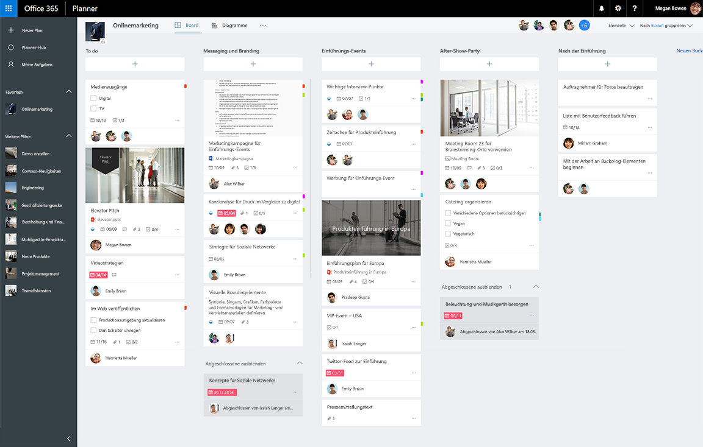

# Übersicht über Planner-Aufgaben und Pläne-APIPlanner tasks and plans API overview
Planner bietet Teams eine einfache und visuelle Möglichkeit, ihre Arbeit zu organisieren.Planner provides a simple and visual way for teams to organize their work. Kunden können mit Planner Pläne erstellen, Aufgaben organisieren und zuweisen, Informationen zum Fortschritt teilen und Inhalte gemeinsam bearbeiten.Customers can use Planner to create plans, organize and assign tasks, share progress, and collaborate on content.  Planner bietet mehrere interaktive Oberfläche, darunter ein Task Board, eine Diagrammseite und eine Zeitplanansicht sowie Integrationen in Office 365.Planner provides several interactive experiences including a task board, a charts page, and a schedule view, as well as integrations throughout Office 365.

**Task Board in Office 365 Planner****Office 365 Planner task board**

## Vorteile der Integration mit Planner-AufgabenWhy integrate with Planner tasks?
Planner bietet Funktionen zum Nachverfolgen von Aufgaben für die Zusammenarbeit in Office 365.Planner provides task tracking capabilities for collaboration experiences in Office 365. Wenn Ihre Szenarien das Nachverfolgen von Aufgaben und Organisieren der Arbeit für ein Team oder eine Gruppe von Endbenutzern erfordert, ist Planner die richtige Wahl für Sie.If your scenarios require tracking tasks and organizing work for a team or group of end users, Planner is the right service for you. Die Planner-Integration kann Sie dabei unterstützen, die Millionen von Benutzern zu erreichen, die in Office 365 zusammenarbeiten.Planner integration can help you reach the millions of users collaborating on Office 365. 

### Organisieren der Arbeit Ihres TeamsOrganize your team’s work
Planner bietet einen gemeinsamen Ort, an dem Sie ein Team zusammenstellen, [Aufgaben erstellen](../api-reference/v1.0/api/planner_post_tasks.md) und diese Aufgaben anderen im Team zuweisen können.Planner provides a shared space where you can build a team, [create tasks](../api-reference/v1.0/api/planner_post_tasks.md), and assign them to others on the team. Mit Planner weiß jeder immer, wer gerade was erledigt und ob die Aufgaben im Zeitplan liegen. Sie können Aufgaben mit zusätzlichen Informationen wie Fälligkeitsdaten, Fortschritt und Beschreibungen aktualisieren und die Aufgaben dann weiter mit anpassbaren Buckets und Kategoriebezeichnungen organisieren.Planner makes it easy for everyone to know who’s doing what and if things are on track. You can update tasks with additional information like due dates, progress, and descriptions, and then further organize tasks with customizable buckets and category labels.   

### Zusammenarbeit in Office 365Collaborate across Office 365
Planner kann in die Oberfläche für die Zusammenarbeit in Office 365 integriert werden.Planner integrates into collaboration experiences across Office 365. Zusätzlich zu den Web- und Mobilgeräte-Clients von Planner können Benutzer Pläne und Aufgaben von Planner in SharePoint und Microsoft Teams anzeigen und aktualisieren.In addition to Planner web and mobile clients, users can view and update Planner plans and tasks from within SharePoint and Microsoft Teams.  

Der Microsoft Graph- und Office 365-Gruppendienst ergänzt Planner ebenfalls.Planner itself is also powered by the Microsoft Graph and the Office 365 group service. Dateien, die Sie hochladen und an Planner-Aufgaben anfügen, werden in SharePoint gespeichert.Files that you upload and attach to Planner tasks are stored in SharePoint. Planner-Kommentare basieren auf Outlook-Gruppenunterhaltungen.Planner comments are based on Outlook group conversations.

<!-- Add image
Note: Put an image here showing the relationship between Planner and other things
-->

### Automatisieren der Erstellung von Plänen und AufgabenAutomate the creation of plans and tasks
Verwenden Sie sich wiederholende Prozesse oder Projekttypen?Are you working on repeated process or project type? Mit der Planner-API können Sie das Erstellen eines Plans und eine Liste der Aufgaben automatisieren.You can use the Planner API to automate the creation of a plan and a list of tasks.  
 
## Wichtigste Aufgaben der Planner-APITop Planner API tasks

|VorgangOperation|URLURL|
|:--------|:--|
|Anzeigen aller [Pläne](../api-reference/beta/resources/plannerplan.md) einer GruppeSee all the [plans](../api-reference/beta/resources/plannerplan.md) for a group|GET [https://graph.microsoft.com/v1.0/groups/{id}/planner/plans](https://developer.microsoft.com/en-us/graph/graph-explorer?request=groups/{id}/planner/plans&version=v1.0)GET|
|Anzeigen aller [Aufgaben](../api-reference/beta/resources/plannertask.md) in einem PlanSee [tasks](../api-reference/beta/resources/plannertask.md) in a plan|GET [https://graph.microsoft.com/v1.0/planner/plans/{id}/tasks](https://developer.microsoft.com/en-us/graph/graph-explorer?request=planner/plans/{id}/tasks&version=v1.0)GET|
|Anzeigen aller [eigenen Aufgaben](../api-reference/beta/api/planneruser_list_tasks.md), die mir in Plänen zugewiesen sindSee all [my tasks](../api-reference/beta/api/planneruser_list_tasks.md) assigned to me across plans|GET [https://graph.microsoft.com/v1.0/me/planner/tasks/](https://developer.microsoft.com/en-us/graph/graph-explorer?request=me/planner/tasks/&version=v1.0)GET|
|[Erstellen einer neuen AufgabeCreate a new subscription](../api-reference/v1.0/api/planner_post_tasks.md)|POST [https://graph.microsoft.com/v1.0/planner/tasks](https://developer.microsoft.com/en-us/graph/graph-explorer?request=groups/{id}/planner/plans&version=v1.0)POST|
|[Aktualisieren einer AufgabeUpdate a task](../api-reference/v1.0/api/plannertask_update.md)|PATCH [https://graph.microsoft.com/v1.0/planner/tasks/{task-id}](https://developer.microsoft.com/en-us/graph/graph-explorer?request=groups/{id}/planner/plans&version=v1.0)PATCH|
|[Löschen einer AufgabeDelete a task](../api-reference/v1.0/api/plannertask_delete.md)|DELETE [https://graph.microsoft.com/v1.0/planner/tasks/<id>](https://developer.microsoft.com/en-us/graph/graph-explorer?request=groups/{id}/planner/plans&version=v1.0)DELETE|

## Nächste SchritteNext steps

- [Verwenden der Planner-APIUse the Planner API](../api-reference/v1.0/resources/planner_overview.md)
- [Arbeiten mit PlänenWork with plans](../api-reference/v1.0/resources/planner_overview.md#plans)
- [Arbeiten mit AufgabenWork with tasks](../api-reference/v1.0/resources/planner_overview.md#tasks)
