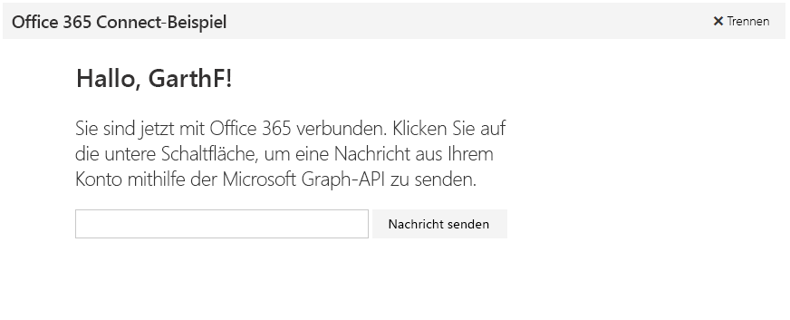

# <a name="get-started-with-microsoft-graph-in-a-python-app"></a>Erste Schritte mit Microsoft Graph in einer Python-App 

Dieser Artikel beschreibt die erforderlichen Aufgaben zum Abrufen eines Zugriffstokens aus dem Azure AD und zum Aufrufen von Microsoft Graph. Sie werden durch das [Microsoft Connect-Beispiel für Python](https://github.com/microsoftgraph/python3-connect-rest-sample) geführt und erhalten Informationen zu den Hauptkonzepten, die Sie zur Verwendung der Microsoft Graph-API implementieren. In diesem Artikel wird beschrieben, wie Sie mithilfe von direkten REST-Aufrufen auf Microsoft Graph zugreifen.



##  <a name="prerequisites"></a>Voraussetzungen

* [Python 3.5.2](https://www.python.org/downloads/)
* [Flask-OAuthlib](https://github.com/lepture/flask-oauthlib)
* [Flask-Script 0.4](http://flask-script.readthedocs.io/en/latest/)
* Ein [Microsoft-Konto](https://www.outlook.com/) oder ein [Office 365 for Business](https://msdn.microsoft.com/en-us/office/office365/howto/setup-development-environment#bk_Office365Account)-Konto.
* [Microsoft Graph Connect-Beispiel für Python](https://github.com/microsoftgraph/python3-connect-rest-sample)

## <a name="register-the-application-in-azure-active-directory"></a>Registrieren der Anwendung in Azure Active Directory

Sie müssen Ihre Anwendung zuerst registrieren und die Berechtigungen für die Verwendung von Microsoft Graph festlegen. Dann können Benutzer sich bei der Anwendung mit Geschäfts- oder Schulkonten anmelden.

## <a name="register-the-application"></a>Registrieren der App

Registrieren Sie eine App im Microsoft App-Registrierungsportal. Dadurch werden die ID und das Kennwort der App generiert, mit der bzw. dem Sie die App für die Authentifizierung konfigurieren.

1. Melden Sie sich beim [Microsoft-App-Registrierungsportal](https://apps.dev.microsoft.com/) entweder mit Ihrem persönlichen oder geschäftlichen Konto oder mit Ihrem Schulkonto an.

2. Klicken Sie auf **App hinzufügen**.

3. Geben Sie einen Namen für die App ein, und wählen Sie **Anwendung erstellen** aus.

    Die Registrierungsseite wird angezeigt, und die Eigenschaften der App werden aufgeführt.

4. Kopieren Sie die Anwendungs-ID: Dies ist der eindeutige Bezeichner für Ihre App.

5. Wählen Sie unter **Anwendungsgeheimnisse** die Option **Neues Kennwort generieren** aus. Kopieren Sie das Anwendungsgeheimnis aus dem Dialogfeld **Neues Kennwort wurde generiert**.

    Sie werden die ID und das Geheimnis der Anwendung verwenden, um die App zu konfigurieren.

6. Wählen Sie unter **Plattformen** die Option **Plattform hinzufügen** > ** Web** aus.

7. Stellen Sie sicher, dass das Kontrollkästchen **Impliziten Fluss zulassen** aktiviert ist, und geben Sie *http://localhost:5000/login/authorized* als Umleitungs-URI ein.

    Die Option **Impliziten Fluss zulassen** ermöglicht den OpenID Connect-Hybridfluss. Während der Authentifizierung ermöglicht dies der App, sowohl Anmeldeinformationen (das **id_token**) als auch Artefakte (in diesem Fall ein Autorisierungscode) abzurufen, den die App zum Abrufen eines Zugriffstokens verwendet.

    Der Umleitungs-URI *http://localhost:5000/login/authorized* ist der Wert, den die OmniAuth-Middleware entsprechend der Konfiguration verwendet, sobald sie die Authentifizierungsanforderung verarbeitet hat.

8. Wählen Sie **Speichern** aus.

## <a name="configure-and-run-the-app"></a>Konfigurieren und Ausführen der App

1. Öffnen Sie mithilfe eines Texteditors Ihrer Wahl die Datei **_PRIVATE.txt**.
2. Ersetzen Sie *ENTER_YOUR_CLIENT_ID* durch die Client-ID Ihrer registrierten Anwendung.
3. Ersetzen Sie *ENTER_YOUR_SECRET* durch den Schlüssel, den Sie für Ihre App generiert haben.
4. Starten Sie den Entwicklungsserver, indem Sie ```python manage.py runserver``` ausführen.
5. Navigieren Sie zu ```http://localhost:5000/``` im Webbrowser.

<!--<a name="authCode"></a>-->
## <a name="receive-an-authorization-code-in-your-reply-url-page"></a>Erhalten eines Autorisierungscodes auf Ihrer Antwort-URL-Seite

Sobald der Benutzer sich angemeldet hat, wird der Browser auf Ihre Antwort-URL weitergeleitet, also die Route ```login/authorized``` in der Datei [*connectsample.py*](https://github.com/microsoftgraph/python3-connect-rest-sample/blob/master/connectsample.py), und zwar mit einem Zugriffstoken in der Antwort. Im Beispiel wird das Token als Sitzungsvariable gespeichert.

```python
@app.route('/login/authorized')
def authorized():
    """Handler for login/authorized route."""
    response = msgraphapi.authorized_response()

    if response is None:
        return "Access Denied: Reason={0}\nError={1}".format( \
            request.args['error'], request.args['error_description'])

    # Check response for state
    if str(session['state']) != str(request.args['state']):
        raise Exception('State has been messed with, end authentication')
    session['state'] = '' # reset session state to prevent re-use

    # Okay to store this in a local variable, encrypt if it's going to client
    # machine or database. Treat as a password.
    session['microsoft_token'] = (response['access_token'], '')
    # Store the token in another session variable for easy access
    session['access_token'] = response['access_token']
    me_response = msgraphapi.get('me')
    me_data = json.loads(json.dumps(me_response.data))
    username = me_data['displayName']
    email_address = me_data['userPrincipalName']
    session['alias'] = username
    session['userEmailAddress'] = email_address
    return redirect('main')
```

<!--<a name="request"></a>-->
## <a name="use-the-access-token-in-a-request-to-the-microsoft-graph-api"></a>Verwenden des Zugriffstokens in einer Anforderung an die Microsoft Graph-API

Mit einem Zugriffstoken kann Ihre App authentifizierte Anforderungen an die Microsoft Graph-API senden. Ihre App muss das Zugriffstoken an den **Autorisierungs**-Header jeder Anforderung anfügen.

Im Connect-Beispiel wird eine E-Mail mithilfe des ```me/microsoft.graph.sendMail```-Endpunkts in der Microsoft Graph-API gesendet. Der Code ist in der ```call_sendmail_endpoint```-Funktion in der Datei [*connectsample.py*](https://github.com/microsoftgraph/python3-connect-rest-sample/blob/master/connectsample.py) vorhanden. Dies ist der Code, der zeigt, wie dem Header „Autorisierung“ der Zugriffscode angehängt wird.

```python
    # Set request headers.
    headers = { 
      'User-Agent' : 'python_tutorial/1.0',
      'Authorization' : 'Bearer {0}'.format(access_token),
      'Accept' : 'application/json',
      'Content-Type' : 'application/json'
    }
```

> **Hinweis** Die Anforderung muss auch einen Header des Typs **Content-Type** mit einem Wert senden, der von der Graph-API akzeptiert wird, z. B. `application/json`.

Die Microsoft Graph-API ist eine leistungsfähige einheitliche API, die für die Interaktion mit beliebigen Microsoft-Daten verwendet werden kann. Informationen zu weiteren Möglichkeiten mit Microsoft Graph finden Sie in der API-Referenz.