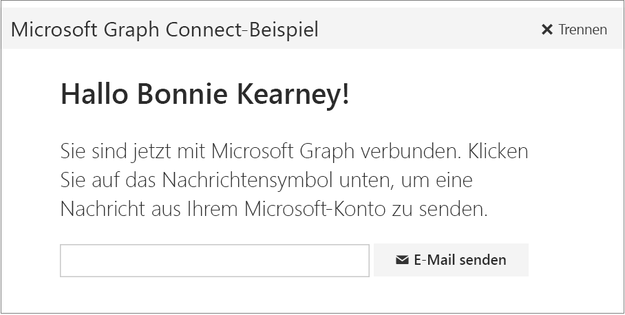

# <a name="get-started-with-microsoft-graph-in-a-ruby-on-rails-app"></a><span data-ttu-id="9034b-101">Erste Schritte mit Microsoft Graph in einer Ruby on Rails-App</span><span class="sxs-lookup"><span data-stu-id="9034b-101">Get started with Microsoft Graph in a Ruby on Rails app</span></span>

<span data-ttu-id="9034b-p101">Dieser Artikel beschreibt die erforderlichen Aufgaben zum Abrufen eines Zugriffstokens vom Azure AD v2.0-Endpunkt und zum Aufrufen von Microsoft Graph. Sie werden durch die Erstellung des [Microsoft Graph Ruby on Rails Connect-Beispiels](https://github.com/microsoftgraph/ruby-connect-rest-sample) geführt und erhalten Informationen zu den Hauptkonzepten, die Sie zur Verwendung von Microsoft Graph implementieren. In diesem Artikel wird auch beschrieben, wie Sie mithilfe von direkten REST-Aufrufen auf Microsoft Graph zugreifen.</span><span class="sxs-lookup"><span data-stu-id="9034b-p101">This article describes the tasks required to get an access token from the Azure AD v2.0 endpoint and call Microsoft Graph. It walks you through building the [Microsoft Graph Ruby on Rails Connect Sample](https://github.com/microsoftgraph/ruby-connect-rest-sample) and explains the main concepts that you implement to use the Microsoft Graph. The article also describes how to access Microsoft Graph by using direct REST calls.</span></span>

<span data-ttu-id="9034b-105">Zum Herunterladen einer Version des Connect-Beispiels, das den Endpunkt Azure AD verwendet, siehe [Microsoft Graph Ruby on Rails Connect-Beispiel](https://github.com/microsoftgraph/ruby-connect-rest-sample/tree/last_v1_auth).</span><span class="sxs-lookup"><span data-stu-id="9034b-105">To download a version of the Connect sample that uses the Azure AD endpoint, see [Microsoft Graph Ruby on Rails Connect Sample](https://github.com/microsoftgraph/ruby-connect-rest-sample/tree/last_v1_auth).</span></span>

<span data-ttu-id="9034b-106">In der folgenden Abbildung ist die App dargestellt, die Sie erstellen.</span><span class="sxs-lookup"><span data-stu-id="9034b-106">The following image shows the app you'll create.</span></span> 



<span data-ttu-id="9034b-p102">**Sie möchten keine App erstellen?** Verwenden Sie für einen schnellen Einstieg den [Schnellstart Microsoft Graph](https://graph.microsoft.io/de-DE/getting-started), oder laden Sie das [Ruby REST Connect-Beispiel](https://github.com/microsoftgraph/ruby-connect-rest-sample) herunter, auf dem dieser Artikel basiert.</span><span class="sxs-lookup"><span data-stu-id="9034b-p102">**Don't feel like building an app?** Use the [Microsoft Graph quick start](https://graph.microsoft.io/de-DE/getting-started) to get up and running fast, or download the [Ruby REST Connect sample](https://github.com/microsoftgraph/ruby-connect-rest-sample) that this article is based on.</span></span>


## <a name="prerequisites"></a><span data-ttu-id="9034b-110">Voraussetzungen</span><span class="sxs-lookup"><span data-stu-id="9034b-110">Prerequisites</span></span>

<span data-ttu-id="9034b-111">Für die ersten Schritte benötigen Sie:</span><span class="sxs-lookup"><span data-stu-id="9034b-111">To get started, you'll need:</span></span> 

- <span data-ttu-id="9034b-112">Zum Ausführen des Beispiels ist Ruby 2.1 auf einem Entwicklungsserver erforderlich.</span><span class="sxs-lookup"><span data-stu-id="9034b-112">Ruby 2.1 to run the sample on a development server.</span></span>
- <span data-ttu-id="9034b-113">Rails-Framework (das Beispiel wurde auf Rails 4.2 getestet).</span><span class="sxs-lookup"><span data-stu-id="9034b-113">Rails framework (the sample has been tested on Rails 4.2).</span></span>
- <span data-ttu-id="9034b-114">Bundler Dependency Manager.</span><span class="sxs-lookup"><span data-stu-id="9034b-114">Bundler dependency manager.</span></span>
- <span data-ttu-id="9034b-115">Rack-Webserveroberfläche für Ruby.</span><span class="sxs-lookup"><span data-stu-id="9034b-115">Rack web server interface for Ruby.</span></span>
- <span data-ttu-id="9034b-116">Ein [Microsoft-Konto](https://www.outlook.com/) oder ein [Geschäfts- oder Schulkonto](https://docs.microsoft.com/de-DE/office/developer-program/office-365-developer-program-faq#account-types)</span><span class="sxs-lookup"><span data-stu-id="9034b-116">A [Microsoft account](https://www.outlook.com/) or a [work or school account](https://docs.microsoft.com/de-DE/office/developer-program/office-365-developer-program-faq#account-types)</span></span>
- <span data-ttu-id="9034b-p103">Das Microsoft Graph Connect-Startprojekt für Ruby on Rails. Laden Sie das [Microsoft Graph Ruby on Rails Connect-Beispiel](https://github.com/microsoftgraph/ruby-connect-rest-sample) herunter. Das Startprojekt befindet sich im _Start_ordner.</span><span class="sxs-lookup"><span data-stu-id="9034b-p103">The Microsoft Graph Connect Starter Project for Ruby on Rails. Download the [Microsoft Graph Ruby on Rails Connect Sample](https://github.com/microsoftgraph/ruby-connect-rest-sample). The starter project is located in the _starter_ folder.</span></span>


## <a name="register-the-application"></a><span data-ttu-id="9034b-120">Registrieren der App</span><span class="sxs-lookup"><span data-stu-id="9034b-120">Register the application</span></span>

<span data-ttu-id="9034b-p104">Registrieren Sie eine App im Microsoft App-Registrierungsportal. Dadurch werden die ID und das Geheimnis der App generiert, mit der bzw. dem Sie die App für die Authentifizierung konfigurieren.</span><span class="sxs-lookup"><span data-stu-id="9034b-p104">Register an app on the Microsoft App Registration Portal. This generates the app ID and secret that you'll use to configure the app for authentication.</span></span>

1. <span data-ttu-id="9034b-123">Melden Sie sich beim [Microsoft-App-Registrierungsportal](https://apps.dev.microsoft.com/) entweder mit Ihrem persönlichen oder geschäftlichen Konto oder mit Ihrem Schulkonto an.</span><span class="sxs-lookup"><span data-stu-id="9034b-123">Sign into the [Microsoft App Registration Portal](https://apps.dev.microsoft.com/) using either your personal or work or school account.</span></span>

2. <span data-ttu-id="9034b-124">Klicken Sie auf **App hinzufügen**.</span><span class="sxs-lookup"><span data-stu-id="9034b-124">Choose **Add an app**.</span></span>

3. <span data-ttu-id="9034b-125">Geben Sie einen Namen für die App ein, und wählen Sie **Anwendung erstellen** aus.</span><span class="sxs-lookup"><span data-stu-id="9034b-125">Enter a name for the app, and choose **Create application**.</span></span>

    <span data-ttu-id="9034b-126">Die Registrierungsseite wird angezeigt, und die Eigenschaften der App werden aufgeführt.</span><span class="sxs-lookup"><span data-stu-id="9034b-126">The registration page displays, listing the properties of your app.</span></span>

4. <span data-ttu-id="9034b-p105">Kopieren Sie die Anwendungs-ID: Dies ist der eindeutige Bezeichner für Ihre App.</span><span class="sxs-lookup"><span data-stu-id="9034b-p105">Copy the application ID. This is the unique identifier for your app.</span></span>

5. <span data-ttu-id="9034b-p106">Wählen Sie unter **Anwendungsgeheimnisse** die Option **Neues Kennwort generieren** aus. Kopieren Sie das Anwendungsgeheimnis aus dem Dialogfeld **Neues Kennwort wurde generiert**.</span><span class="sxs-lookup"><span data-stu-id="9034b-p106">Under **Application Secrets**, choose **Generate New Password**. Copy the app secret from the **New password generated** dialog.</span></span>

    <span data-ttu-id="9034b-131">Sie werden die ID und das Geheimnis der Anwendung verwenden, um die App zu konfigurieren.</span><span class="sxs-lookup"><span data-stu-id="9034b-131">You'll use the application ID and app secret to configure the app.</span></span>

6. <span data-ttu-id="9034b-132">Klicken Sie unter **Plattformen** auf **Plattform hinzufügen** > **Web**.</span><span class="sxs-lookup"><span data-stu-id="9034b-132">Under **Platforms**, choose **Add platform** > **Web**.</span></span>

7. <span data-ttu-id="9034b-133">Vergewissern Sie sich, dass das Kontrollkästchen **Allow Implicit Flow** aktiviert ist, und geben Sie als Umleitungs-URI *http://localhost:3000/auth/microsoft_v2_auth/callback* ein.</span><span class="sxs-lookup"><span data-stu-id="9034b-133">Make sure the Allow Implicit Flow check box is selected, and enter http://localhost:55065/ as the Redirect URI.</span></span>

    <span data-ttu-id="9034b-p107">Die Option „Impliziten Fluss zulassen“ ermöglicht den OpenID Connect-Hybridfluss. Während der Authentifizierung ermöglicht dies der App, sowohl Anmeldeinformationen (das id_token) als auch Artefakte (in diesem Fall ein Autorisierungscode) abzurufen, den die App zum Abrufen eines Zugriffstokens verwendet.</span><span class="sxs-lookup"><span data-stu-id="9034b-p107">The Allow Implicit Flow option enables the OpenID Connect hybrid flow. During authentication, this enables the app to receive both sign-in info (the id_token) and artifacts (in this case, an authorization code) that the app uses to obtain an access token.</span></span>

    <span data-ttu-id="9034b-136">Der Umleitungs-URI *http://localhost:3000/auth/microsoft_v2_auth/callback* ist der Wert, den die OmniAuth-Middleware laut Konfiguration verwenden soll, sobald sie die Authentifizierungsanforderung verarbeitet hat.</span><span class="sxs-lookup"><span data-stu-id="9034b-136">The redirect URI http://localhost:3000/auth/microsoft_v2_auth/callback is the value that the OmniAuth middleware is configured to use once it has processed the authentication request.</span></span>

8. <span data-ttu-id="9034b-137">Klicken Sie auf **Speichern**.</span><span class="sxs-lookup"><span data-stu-id="9034b-137">Choose **Save**.</span></span>

## <a name="configure-the-project"></a><span data-ttu-id="9034b-138">Konfigurieren des Projekts</span><span class="sxs-lookup"><span data-stu-id="9034b-138">Configure the project</span></span>

1. <span data-ttu-id="9034b-p108">Laden Sie das [Microsoft Graph Ruby on Rails Connect-Beispiel](https://github.com/microsoftgraph/ruby-connect-rest-sample) herunter, oder klonen Sie es. Öffnen Sie den Startordner im Editor Ihrer Wahl.</span><span class="sxs-lookup"><span data-stu-id="9034b-p108">Download or clone the [Microsoft Graph Ruby on Rails Connect Sample](https://github.com/microsoftgraph/ruby-connect-rest-sample). Open the _starter_ folder in the editor of your choice.</span></span>
1. <span data-ttu-id="9034b-141">Wenn Sie weder über einen Bundler noch über ein Rack verfügen, können Sie sie mithilfe des folgenden Befehls installieren.</span><span class="sxs-lookup"><span data-stu-id="9034b-141">If you don't already have bundler and rack, you can install them with the following command.</span></span>

    ```
    gem install bundler rack
    ```
2. <span data-ttu-id="9034b-142">Führen Sie in der Datei „config/environment.rb“ die folgenden Schritte aus:</span><span class="sxs-lookup"><span data-stu-id="9034b-142">In the config/environment.rb file, do the following:</span></span>
    - <span data-ttu-id="9034b-143">Ersetzen Sie *ENTER_YOUR_CLIENT_ID* durch die Client-ID Ihrer registrierten Anwendung.</span><span class="sxs-lookup"><span data-stu-id="9034b-143">Replace *ENTER_YOUR_CLIENT_ID* with the client ID of your registered  application.</span></span>
    - <span data-ttu-id="9034b-144">Ersetzen Sie *ENTER_YOUR_SECRET* durch den Schlüssel Ihrer registrierten Anwendung.</span><span class="sxs-lookup"><span data-stu-id="9034b-144">Replace *ENTER_YOUR_SECRET* with the key of your registered application.</span></span>

3. <span data-ttu-id="9034b-145">Installieren Sie die Rails-Anwendung und -Abhängigkeiten mit dem folgenden Befehl.</span><span class="sxs-lookup"><span data-stu-id="9034b-145">Install the Rails application and dependencies with the following command.</span></span>

    ```
    bundle install
    ```

## <a name="authenticate-the-user-and-get-an-access-token"></a><span data-ttu-id="9034b-146">Authentifizierung des Benutzers und Abrufen eines Zugriffstokens</span><span class="sxs-lookup"><span data-stu-id="9034b-146">Authenticate the user and get an access token</span></span>

<span data-ttu-id="9034b-p109">Diese App verwendet den Authorization Code Grant-Datenfluss mit einer delegierten Benutzeridentität. Für eine Webanwendung erfordert der Ablauf die ID und das Geheimnis der Anwendung, sowie den Umleitungs-URI aus der registrierten App.</span><span class="sxs-lookup"><span data-stu-id="9034b-p109">This app uses the authorization code grant flow with a delegated user identity. For a web application, the flow requires the application ID, secret, and redirect URI from the registered app.</span></span> 

<span data-ttu-id="9034b-149">Der Authentifizierungsfluss kann in diese grundlegenden Schritte unterteilt werden:</span><span class="sxs-lookup"><span data-stu-id="9034b-149">The auth flow can be broken down into these basic steps:</span></span>

1. <span data-ttu-id="9034b-150">Umleitung des Benutzers für die Authentifizierung und Zustimmung</span><span class="sxs-lookup"><span data-stu-id="9034b-150">Redirect the user for authentication and consent</span></span>
2. <span data-ttu-id="9034b-151">Anfordern eines Autorisierungscodes</span><span class="sxs-lookup"><span data-stu-id="9034b-151">Get an authorization code</span></span>
3. <span data-ttu-id="9034b-152">Einlösen des Autorisierungscodes für ein Zugriffstoken</span><span class="sxs-lookup"><span data-stu-id="9034b-152">Redeem the authorization code for an access token</span></span>

><span data-ttu-id="9034b-153">Weitere Informationen zu diesem Autorisierungsfluss finden Sie unter [Webanwendung zu Web-API](https://azure.microsoft.com/de-DE/documentation/articles/active-directory-authentication-scenarios/#web-application-to-web-api) und [Integrieren einer Microsoft-Identität und von Microsoft Graph in eine Webanwendung mit OpenID Connect](https://azure.microsoft.com/de-DE/documentation/samples/active-directory-dotnet-webapp-openidconnect-v2/) in der Dokumentation zu Azure AD.</span><span class="sxs-lookup"><span data-stu-id="9034b-153">For more information about this auth flow, see [Web application to web API](https://azure.microsoft.com/de-DE/documentation/articles/active-directory-authentication-scenarios/#web-application-to-web-api) and  [Integrate Microsoft identity and the Microsoft Graph into a web application using OpenID Connect](https://azure.microsoft.com/de-DE/documentation/samples/active-directory-dotnet-webapp-openidconnect-v2/) in the Azure AD documentation.</span></span>

<span data-ttu-id="9034b-154">Wir verwenden einen Dreierstack [Rack](http://rack.github.io/) Middleware, damit die App sich gegenüber Microsoft Graph authentifizieren kann:</span><span class="sxs-lookup"><span data-stu-id="9034b-154">We'll be using a stack of three pieces of [Rack](http://rack.github.io/) middleware to enable the app to authenticate against the Microsoft Graph:</span></span>

- <span data-ttu-id="9034b-155">[OmniAuth](https://rubygems.org/gems/omniauth), ein allgemeines Rack-Framework für die Multi-Provider-Authentifizierung.</span><span class="sxs-lookup"><span data-stu-id="9034b-155">[OmniAuth](https://rubygems.org/gems/omniauth), a generalized Rack framework for multiple-provider authentication.</span></span>
- <span data-ttu-id="9034b-156">[Omniauth-oauth2](https://rubygems.org/gems/omniauth-oauth2), eine abstrakte OAuth2-Strategie für OmniAuth.</span><span class="sxs-lookup"><span data-stu-id="9034b-156">[Omniauth-oauth2](https://rubygems.org/gems/omniauth-oauth2), an abstract OAuth2 strategy for OmniAuth.</span></span> 
- <span data-ttu-id="9034b-p110">Omniauth-microsoft_v2_auth, eine OmniAuth-Strategie, die Omniauth-oauth2 anpasst, um konkret Authentifizierung gegenüber dem Azure AD v2.0-Endpunkt bereitzustellen. Dieses Projekt ist im Codebeispiel enthalten.</span><span class="sxs-lookup"><span data-stu-id="9034b-p110">omniauth-microsoft_v2_auth, an OmniAuth strategy that customizes Omniauth-oauth2 to specifically provide authentication against the Azure AD v2.0 endpoint. This project is included in the code sample.</span></span>

### <a name="specify-gem-dependencies-for-authentication"></a><span data-ttu-id="9034b-159">Festlegen von Gem-Abhängigkeiten für die Authentifizierung</span><span class="sxs-lookup"><span data-stu-id="9034b-159">Specify gem dependencies for authentication</span></span>

<span data-ttu-id="9034b-160">Heben Sie in Gemfile die Auskommentierung folgender Gems auf, um sie als Abhängigkeiten hinzuzufügen.</span><span class="sxs-lookup"><span data-stu-id="9034b-160">In Gemfile, uncomment the following gems to add them as dependencies.</span></span>

    ```
    gem 'omniauth'
    gem 'omniauth-oauth2'
    gem 'omniauth-microsoft_v2_auth', path: './omniauth-microsoft_v2_auth'
    ```

<span data-ttu-id="9034b-161">Beachten Sie, dass `omniauth-microsoft_v2_auth` im App-Projekt enthalten ist und ausgehend von dem angegebenen Pfad installiert werden wird.</span><span class="sxs-lookup"><span data-stu-id="9034b-161">Note that `omniauth-microsoft_v2_auth` is included in the app project, and will be installed from the path specified.</span></span> 

### <a name="configure-the-authentication-middleware"></a><span data-ttu-id="9034b-162">Konfigurieren der Authentifizierungs-Middleware</span><span class="sxs-lookup"><span data-stu-id="9034b-162">Configure the authentication middleware</span></span>

<span data-ttu-id="9034b-163">Entfernen Sie in `config/initializers/omniauth-microsoft_v2_auth.rb` die Auskommentierung aus folgenden Zeilen:</span><span class="sxs-lookup"><span data-stu-id="9034b-163">In `config/initializers/omniauth-microsoft_v2_auth.rb`, uncomment the following lines.</span></span>

    ```
    Rails.application.config.middleware.use OmniAuth::Builder do
      provider :microsoft_v2_auth,
      ENV['CLIENT_ID'],
      ENV['CLIENT_SECRET'],
      :scope => ENV['SCOPE']
    end
    ```
<span data-ttu-id="9034b-p111">Dadurch wird die OmniAuth Middleware konfiguriert, und unter anderem werden die zu verwendende ID und das zu verwendende Geheimnis der App sowie die Bereiche festgelegt, die für den Benutzer anzufordern sind. Dies sind die Werte, die Sie zuvor in `config/environment.rb` angegeben haben.</span><span class="sxs-lookup"><span data-stu-id="9034b-p111">This configures the OmniAuth middleware, including specifying the app ID and app secret to use, as well as the scopes to request for the user. These are the values you specified earlier in `config/environment.rb`.</span></span>

### <a name="specify-routes-for-authentication"></a><span data-ttu-id="9034b-166">Festlegen von Routen für die Authentifizierung</span><span class="sxs-lookup"><span data-stu-id="9034b-166">Specify routes for authentication</span></span>

<span data-ttu-id="9034b-p112">Jetzt müssen wir zwei Routen für den Authentifizierungsfluss festlegen. Die erste Route leitet die Authentifizierungsanforderung an die OmniAuth Middleware weiter, und die zweite nennt den Speicherort in der App, zu dem OmniAuth umleiten soll, nachdem die Authentifizierung erfolgt ist.</span><span class="sxs-lookup"><span data-stu-id="9034b-p112">Now we need to specify two routes necessary for the authentication flow. The first route forwards the authentication request to the OmniAuth middleware, and the second specifies the location in the app to which OmniAuth should redirect once authentication has occurred.</span></span>

<span data-ttu-id="9034b-169">Entfernen Sie in `config/routes.rb` die Auskommentierung aus folgender Routenanweisung:</span><span class="sxs-lookup"><span data-stu-id="9034b-169">In `config/routes.rb`, uncomment the following route directive.</span></span>

    get '/login', to: 'pages#login'

<span data-ttu-id="9034b-170">Dadurch werden Anmeldeanfragen an die `login`-Methode des Pages-Controllers geleitet, die wiederum die Anforderung an die Omniauth-microsoft_v2_auth Middleware weiterleitet.</span><span class="sxs-lookup"><span data-stu-id="9034b-170">This directs login requests to the pages controller's `login` method, which in turn redirects the request to the omniauth-microsoft_v2_auth middleware.</span></span>

    def login
        redirect_to '/auth/microsoft_v2_auth'
    end

<span data-ttu-id="9034b-p113">Im nächsten Schritt müssen Sie angeben, zu welchem Ziel in der App OmniAuth nach erfolgter Authentifizierung umleiten soll. Heben Sie die Auskommentierung der folgenden Route auf:</span><span class="sxs-lookup"><span data-stu-id="9034b-p113">Next, we need to specify where in the app OmniAuth should redirect once authentication has occurred. Uncomment the following route.</span></span>

    match '/auth/:provider/callback', to: 'pages#callback', via: [:get, :post]

<span data-ttu-id="9034b-173">Sobald OmniAuth den Benutzer authentifiziert hat, wird die bei der App-Registrierung festgelegte Umleitungs-URL aufgerufen, in unserem Fall *http://localhost:3000/auth/microsoft_v2_auth/callback*.</span><span class="sxs-lookup"><span data-stu-id="9034b-173">When OmniAuth has finished authenticating the user, it calls the redirect URL specified in the app registration; in this case, http://localhost:3000/auth/microsoft_v2_auth/callback. The route pattern above matches that URL and so routes the request to the page controller's  method.</span></span> <span data-ttu-id="9034b-174">Diese URL wird mit dem oben angegebenen Routenmuster abgeglichen. Da sie zu dem Muster passt, wird die Anforderung an die Methode `callback` des Seitencontrollers weitergeleitet.</span><span class="sxs-lookup"><span data-stu-id="9034b-174">When OmniAuth has finished authenticating the user, it calls the redirect URL specified in the app registration; in this case, http://localhost:3000/auth/microsoft_v2_auth/callback. The route pattern above matches that URL and so routes the request to the page controller's `callback` method.</span></span>

### <a name="get-an-access-token"></a><span data-ttu-id="9034b-175">Abrufen eines Zugriffstokens</span><span class="sxs-lookup"><span data-stu-id="9034b-175">Get an access token</span></span>

<span data-ttu-id="9034b-176">Als Nächstes fügen wir den Code hinzu, der den Authentifizierungsprozess startet und das Zugriffstoken abruft, sobald der Benutzer sich erfolgreich angemeldet hat.</span><span class="sxs-lookup"><span data-stu-id="9034b-176">Next, we'll add the code that actually starts the authentication process, and retrieves the access token once the user has successfully signed in.</span></span>

<span data-ttu-id="9034b-p115">Sehen Sie sich `app/views/pages/index.html.erb` an, die Ansicht für das Stammverzeichnis der Website. Die Ansicht enthält eine einzelne Schaltfläche, die Benutzern die Anmeldung ermöglicht.</span><span class="sxs-lookup"><span data-stu-id="9034b-p115">Take a look at `app/views/pages/index.html.erb`, the view for the site root. The view includes a single button, which enables users to sign in.</span></span>

    <button class="ms-Button" onclick="window.location.href = '/login'">
        <span class="ms-Button-label"><%= t('connect_button') %></span>
    </button>

<span data-ttu-id="9034b-p116">Wie oben gezeigt veranlasst die Login-Methode die Weiterleitung an die OmniAuth Middleware, die mit der App-ID und dem App-Geheimnis sowie den Bereichen konfiguriert ist, die für den Benutzer anzufordern sind. Nachdem der Benutzer erfolgreich authentifiziert worden ist, übergibt OmniAuth ein Hash mit dem Zugriffstoken und andere Benutzerinformationen an die App.</span><span class="sxs-lookup"><span data-stu-id="9034b-p116">As shown earlier, the login method redirects to the OmniAuth middleware, which has been configured with the app ID and app secret, as well as the scopes to request for the user. Once the user is successfully authenticated, OmniAuth returns a hash with the access token and other user information to the app.</span></span>

<span data-ttu-id="9034b-181">Nun fügen wir Code zur Behandlung des OmniAuth-Rückrufs und zum Abrufen von Informationen von diesem Hash hinzu.</span><span class="sxs-lookup"><span data-stu-id="9034b-181">Now let's add code to handle the OmniAuth callback, and retrieve information from that hash.</span></span> 

<span data-ttu-id="9034b-182">Ersetzen Sie in `app/controllers/pages_controller.rb` die leere `callback`-Methode durch den folgenden Code.</span><span class="sxs-lookup"><span data-stu-id="9034b-182">In `app/controllers/pages_controller.rb`, replace the empty `callback` method with the following code.</span></span>

    ```
    def callback
        # Access the authentication hash for omniauth
        # and extract the auth token, user name, and email
        data = request.env['omniauth.auth']
    
        @email = data[:extra][:raw_info][:userPrincipalName]
        @name = data[:extra][:raw_info][:displayName]

        # Associate token/user values to the session
        session[:access_token] = data['credentials']['token']
        session[:name] = @name
        session[:email] = @email
        
        # Debug logging
        logger.info "Name: #{@name}"
        logger.info "Email: #{@email}"
        logger.info "[callback] - Access token: #{session[:access_token]}"
    end

    ```

<span data-ttu-id="9034b-183">Diese Methode ruft den Authentifizierungs-Hash ab und speichert dann das Zugriffstoken, den Benutzernamen und die E-Mail-Daten in der aktuellen Sitzung.</span><span class="sxs-lookup"><span data-stu-id="9034b-183">This method retrieves the authentication hash, and then stores the access token, user name, and email in the current session.</span></span>

> <span data-ttu-id="9034b-p117">**Hinweis:** Die einfache Handhabung von Authentifizierung und Token bei diesem Projekt dient nur zur Veranschaulichung. In einer Produktions-App würden Sie die Authentifizierung wahrscheinlich robuster gestalten, unter anderem mit sicherer Handhabung von Token und Tokenaktualisierung.</span><span class="sxs-lookup"><span data-stu-id="9034b-p117">**Note:** The simple authentication  and token handling in this project is presented for illustrative purposes only. In a production app, you would likely construct a more robust way of handling authentication, including secure token handling and token refresh.</span></span>

## <a name="call-microsoft-graph"></a><span data-ttu-id="9034b-186">Aufrufen von Microsoft Graph</span><span class="sxs-lookup"><span data-stu-id="9034b-186">Call Microsoft Graph</span></span>

<span data-ttu-id="9034b-187">Sie können nun Code hinzufügen, um Microsoft Graph aufzurufen.</span><span class="sxs-lookup"><span data-stu-id="9034b-187">Now you're ready to add code to call Microsoft Graph.</span></span> 

<span data-ttu-id="9034b-p118">Die von der `callback`-Methode gerenderte Ansicht (`app/views/pages/callback.html.erb`) beinhaltet ein einfaches Formular mit einer einzigen Schaltfläche. Das Formular übergibt an `send_mail` und enthält einen einzelnen Parameter, die E-Mail-Adresse des Empfängers.</span><span class="sxs-lookup"><span data-stu-id="9034b-p118">The view rendered by the `callback` method (`app/views/pages/callback.html.erb`) includes a simple form with a single button. The form posts to  `send_mail`, and includes a single parameter, the email address of the intended recipient.</span></span>
    
    ``` 
    <form action="../../send_mail" method="post">
      <div class="ms-Grid-col ms-u-mdPush1 ms-u-md9 ms-u-lgPush1 ms-u-lg6">
        ...
            <div class="ms-TextField">
               <input class="ms-TextField-field" name="specified_email" value="<%= @email %>">
            </div>
            <button class="ms-Button">
            <span class="ms-Button-label"><i class="ms-Icon ms-Icon--mail" aria-hidden="true"></i><%= t('send_mail_button') %></span>
            </button> 
        ...
    ```

<span data-ttu-id="9034b-190">Ersetzen Sie in `app/controllers/pages_controller.rb` die leere `send_mail`-Methode durch den folgenden Code.</span><span class="sxs-lookup"><span data-stu-id="9034b-190">In `app/controllers/pages_controller.rb`, replace the empty `send_mail` method with the following code.</span></span>

    ```
    def send_mail
        logger.debug "[send_mail] - Access token: #{session[:access_token]}"
        
        # Used in the template
        @name = session[:name]
        @email = params[:specified_email]
        @recipient = params[:specified_email]
        @mail_sent = false
        
        send_mail_endpoint = URI("#{GRAPH_RESOURCE}#{SENDMAIL_ENDPOINT}")
        content_type = CONTENT_TYPE
        http = Net::HTTP.new(send_mail_endpoint.host, send_mail_endpoint.port)
        http.use_ssl = true
        
        # If you want to use a sniffer tool, like Fiddler, to see the request
        # you might need to add this line to tell the engine not to verify the
        # certificate or you might see a "certificate verify failed" error
        # http.verify_mode = OpenSSL::SSL::VERIFY_NONE
        
        email_body = File.read('app/assets/MailTemplate.html')
        email_body.sub! '{given_name}', @name
        email_subject = t('email_subject')
        
        logger.debug email_body
    
        email_message = "{
            Message: {
            Subject: '#{email_subject}',
            Body: {
                ContentType: 'HTML',
                Content: '#{email_body}'
            },
            ToRecipients: [
                {
                    EmailAddress: {
                        Address: '#{@recipient}'
                    }
                }
            ]
            },
            SaveToSentItems: true
            }"
            
        response = http.post(
            SENDMAIL_ENDPOINT,
            email_message,
            'Authorization' => "Bearer #{session[:access_token]}",
            'Content-Type' => content_type
        )
        
        logger.debug "Code: #{response.code}"
        logger.debug "Message: #{response.message}"
        
        # The send mail endpoint returns a 202 - Accepted code on success
        if response.code == '202'
            @mail_sent = true
        else
            @mail_sent = false
            flash[:httpError] = "#{response.code} - #{response.message}"
        end
        
        render 'callback'
    end
    ```

<span data-ttu-id="9034b-191">Dieser Code erstellt die HTTP-Anforderung, formatiert die E-Mail und ruft dann Microsoft Graph zum Senden der E-Mail auf.</span><span class="sxs-lookup"><span data-stu-id="9034b-191">This code constructs the HTTP request, formats the email, and then calls Microsoft Graph to send the email.</span></span>

<span data-ttu-id="9034b-p119">Um die E-Mail zu erstellen, zieht der Code den Benutzernamen aus dem Sitzungstoken und die E-Mail-Adresse des Empfängers aus den Parametern des Formulars heraus. Der Code liest dann den Textkörper der E-Mail aus einer Vorlage, die im Projekt enthalten ist, interpoliert den Benutzernamen und die E-Mail-Adresse und fügt den Text der E-Mail-Nachricht als Textkörper der HTTP-Anforderung an.</span><span class="sxs-lookup"><span data-stu-id="9034b-p119">To create the email, the code pulls the user name from the session token and the recipient email address from the parameters passed from the form. The code then reads the email body from a template included in the project, interpolates the user name and email address, and attaches the email text as the HTTP request body.</span></span>

<span data-ttu-id="9034b-194">Zum Senden der E-Mail erstellt der Code die HTTP-Anforderung, fügt das Zugriffstoken als Autorisierungsheader hinzu und sendet dann die Anfrage an den Sendmail-Endpunkt.</span><span class="sxs-lookup"><span data-stu-id="9034b-194">To send the email, the code constructs the HTTP request, attaches the access token as an authorization header, and then posts the request to the send email endpoint.</span></span>

<span data-ttu-id="9034b-195">Schließlich verwendet der Code, den zurückgegebenen HTTP-Antwortcode, um den Benutzer zu informieren, ob die E-Mail erfolgreich war oder nicht.</span><span class="sxs-lookup"><span data-stu-id="9034b-195">Finally, the code uses the HTTP response code returned to notify the user whether or not the email was successful.</span></span>

## <a name="run-the-app"></a><span data-ttu-id="9034b-196">Ausführen der App</span><span class="sxs-lookup"><span data-stu-id="9034b-196">Run the app</span></span>

1. <span data-ttu-id="9034b-197">Installieren Sie die Rails-Anwendung und -Abhängigkeiten mit dem folgenden Befehl.</span><span class="sxs-lookup"><span data-stu-id="9034b-197">Install the Rails application and dependencies with the following command.</span></span>

    ```
    bundle install
    ```
2. <span data-ttu-id="9034b-198">Geben Sie zum Starten der Rails-Anwendung den folgenden Befehl ein.</span><span class="sxs-lookup"><span data-stu-id="9034b-198">To start the Rails application, type the following command.</span></span>

    ```
    rackup -p 3000
    ```
3. <span data-ttu-id="9034b-199">Navigieren Sie im Webbrowser zu `http://localhost:3000`.</span><span class="sxs-lookup"><span data-stu-id="9034b-199">Go to `http://localhost:3000` in your web browser.</span></span>

## <a name="see-also"></a><span data-ttu-id="9034b-200">Siehe auch</span><span class="sxs-lookup"><span data-stu-id="9034b-200">See also</span></span>
- <span data-ttu-id="9034b-201">Testen Sie die REST-API mithilfe des [Graph-Explorers](https://developer.microsoft.com/graph/graph-explorer).</span><span class="sxs-lookup"><span data-stu-id="9034b-201">Try out the REST API using the [Graph explorer](https://developer.microsoft.com/graph/graph-explorer).</span></span>
- <span data-ttu-id="9034b-202">Schauen Sie sich weitere [Microsoft Graph-Beispiele](https://github.com/microsoftgraph) unter GitHub an.</span><span class="sxs-lookup"><span data-stu-id="9034b-202">Explore our other [Microsoft Graph samples](https://github.com/microsoftgraph) on GitHub.</span></span>


