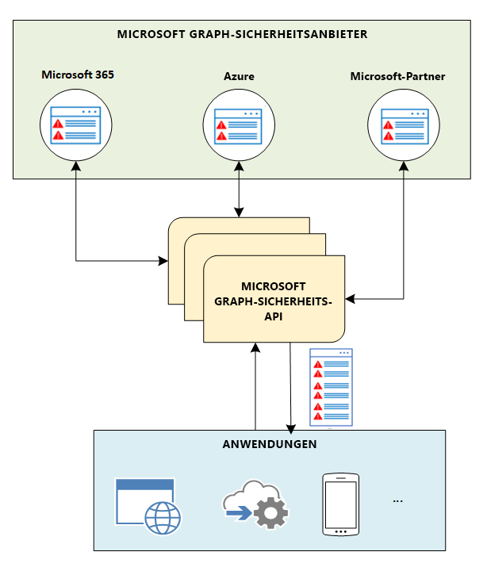

# Übersicht über die Sicherheits-API von Microsoft Graph

Sie können die Sicherheits-API von Microsoft Graph verwenden, um eine Verbindung zu Microsoft-Sicherheitsprodukten, -Diensten- und -Partnern herzustellen, um Sicherheitsvorgänge zu optimieren und den Schutz vor Bedrohungen, deren Erkennung sowie die Reaktionsmöglichkeiten zu verbessern. Die Sicherheits-API von Microsoft Graph ist ein zwischengeschalteter Dienst (oder Broker), der eine einzige programmgesteuerte Schnittstelle bietet, um mehrere [Microsoft Graph-Sicherheitsanbieter](/graph/api/resources/securityvendorinformation?view=graph-rest-1.0) (auch als Sicherheitsanbieter oder Anbieter bezeichnet) zu verbinden. Anforderungen an die Sicherheits-API von Microsoft Graph gelten im Verbund für alle anwendbaren Sicherheitsanbieter. Die Ergebnisse werden aggregiert und an die anfordernde Anwendung in einem gemeinsamen Schema zurückgegeben, wie im folgenden Diagramm dargestellt. Einzelheiten hierzu finden Sie unter [Datenfluss der Sicherheits-API in Microsoft Graph](security-dataflow.md).

Weitere Informationen zur Autorisierung finden Sie unter [Autorisierung und Sicherheits-API von Microsoft Graph](security-authorization.md). Weitere Informationen zu Berechtigungen, einschließlich delegierter und Anwendungsberechtigungen, finden Sie unter [Berechtigungen](permissions-reference.md#security-permissions).

## Vorteile der Sicherheits-API von Microsoft Graph

Die [Microsoft Graph-Sicherheits-API](/graph/api/resources/security-api-overview?view=graph-rest-1.0) macht es einfach, sich mit Sicherheitslösungen von Microsoft und Partnern zu verbinden. Sie ermöglicht es Ihnen, den Wert dieser Lösungen besser zu erkennen und ggf. zu erweitern. Sie können sich problemlos mit der Microsoft Graph-Sicherheits-API verbinden, indem Sie je nach Ihren Anforderungen einen der folgenden Ansätze verwenden:

- [Schreiben von Code](https://aka.ms/graphsecuritysdk) – Hier finden Sie [Codebeispiele](https://aka.ms/graphsecurityapicode) in C#, Java, NodeJS und mehr.
- [Herstellen einer Verbindung mithilfe von Skripts](https://aka.ms/graphsecuritypowershellsampleblog) – Hier finden Sie [PowerShell-Beispiele](https://aka.ms/graphsecuritypowershellsample).
- [Drag & Drop in Workflows und Playbooks](https://aka.ms/graphsecurityconnectorsblogpost) – Verwenden Sie [Microsoft Graph-Sicherheitsconnectors](https://aka.ms/graphsecurityconnectors) für [Azure Logic Apps](https://docs.microsoft.com/azure/logic-apps/logic-apps-overview), [Microsoft Flow](https://flow.microsoft.com/) und [PowerApps](https://powerapps.microsoft.com/).
- [Übertragen von Daten in Berichte und Dashboards](https://aka.ms/graphsecuritypowerbiconnectorblogpost) – Verwenden Sie den [Microsoft Graph-Sicherheitsconnector für Power BI](https://aka.ms/graphsecuritypowerbiconnectordoc).
- [Herstellen einer Verbindung mithilfe von Jupyter-Notizbüchern](https://jupyter.org/) – Hier finden Sie [Beispiele für Jupyter-Notizbücher](https://aka.ms/graphsecurityjupyternotebooks).  

### Vereinheitlichen und Standardisieren der Warnungsverfolgung

Stellen Sie einmalig eine Verbindung her, um Warnungen aus beliebigen in Microsoft Graph integrierten Sicherheitslösungen zu integrieren, und halten Sie Warnungsstatus und Aufgaben für alle Lösungen synchronisiert. Sie können Warnungen auch zu SIEM-Lösungen (Security Information and Event Management) wie Splunk und IBM QRadar über [Azure Monitor](https://docs.microsoft.com/de-DE/azure/monitoring-and-diagnostics/monitor-stream-monitoring-data-event-hubs#what-can-i-do-with-the-monitoring-data-being-sent-to-my-event-hub) streamen. Informationen zur Integration von SIEM in die Sicherheits-API finden Sie unter [Integrieren in SIEM](security-siemintegration.md).

### Korrelierende Sicherheitswarnungen zur Verbesserung des Bedrohungsschutzes und der Reaktion

Korrelieren Sie Warnungen über Sicherheitslösungen hinweg mit einem einheitlichen Warnungsschema. Auf diese Weise erhalten Sie nicht nur umsetzbare Informationen zu Warnungen; Sicherheitsanalysten können damit auch Warnungen auch mit Informationen zu Ressourcen und Benutzern ergänzen, wodurch eine schnellere Reaktion auf Bedrohungen und der Schutz von Objekten ermöglicht wird.  

### Aktualisieren von Warnungskategorien, -status und -zuweisungen

Kategorisieren Sie Benachrichtigungen mit zusätzlichem Kontext oder Informationen zu Bedrohungen, um über die Reaktion und Behebung zu informieren. Stellen Sie sicher, dass Kommentare und Feedback zu Warnungen für alle Workflows sichtbar sind. Synchronisierung Sie Warnungsstatus und -zuweisungen, damit alle integrierten Lösungen den aktuellen Status widerspiegeln. Verwenden Sie Webhook-Abonnements, um über Änderungen benachrichtigt zu werden.  

### Aufheben der Sperrung von Sicherheitskontext zu Untersuchungszwecken

Gewinnen Sie Einblicke in den sicherheitsrelevanten Bestand (z. B. Benutzer, Hosts und Apps), und fügen Sie organisatorischen Kontext von anderen Microsoft Graph-Anbietern (Azure Active Directory, Microsoft Intune, Office 365) hinzu, um Business- und Sicherheitskontexte zusammenzubringen und die Reaktion auf Sicherheitsrisiken zu verbessern.

## Automatisieren von Sicherheitsworkflows und -berichten

Automatisieren Sie Sicherheitsverwaltung, -überwachung und -untersuchungen, um die betriebliche Effizienz und die Reaktionszeiten zu verbessern. Erhalten Sie tiefere Einblicke und erfahren Sie mehr über den Kontext, indem Sie die Microsoft Graph-Sicherheits-API in Ihre Berichte und Dashboards integrieren.

## Erhalten Sie tiefe Einblicke, um Ihre Sicherheitslösungen zu trainieren.

Visualisieren Sie Ihre Daten über verschiedene in Ihrem Unternehmen ausgeführte Sicherheitsprodukte hinweg, um tiefere Einblicke in die Sicherheit zu erhalten. Entdecken Sie Möglichkeiten, wie Sie aus den Daten lernen und Ihre Sicherheitslösungen trainieren können. Das Schema bietet mehrere Eigenschaften, auf die Sie sich stützen können, um aus Ihren Sicherheitsdaten umfangreiche explorative Datasets zu erstellen.

## Nutzen von Informationen zu Bedrohungen (Threat Intelligence) in Microsoft-Sicherheitslösungen (Vorschau)

Senden Sie Ihre Bedrohungsindikatoren automatisch an Microsoft-Sicherheitslösungen, um `alert`-, `block`- oder `allow`-Aktionen zu aktivieren. Verwenden Sie die Microsoft Graph-Sicherheits-API direkt, oder nutzen Sie die Vorteile der Integration mit führenden Threat Intelligence-Plattformen.

## Schnelles Reagieren auf neue Bedrohungen (Vorschau)

Ermöglichen Sie schnelles Handeln zum Schutz vor neuen Bedrohungen, z. B. durch Blockieren von Dateien, URLs, Domänen oder IP-Adressen aus Ihren Sicherheitswerkzeugen und Workflows heraus.

### Proaktives Verwalten von Sicherheitsrisiken (Vorschau)

Verwenden Sie Microsoft Secure Store (Vorschau), um Einblicke in die Sicherheitsanforderungen Ihrer Organisation bereitzustellen und Vorschläge zur Verbesserung zu erhalten und eine Verbesserung vorherzusagen, nachdem diese Vorschläge umgesetzt wurden. Messen Sie ganz einfach Ihre Fortschritte im Zeitablauf, und erhalten Sie Einblicke in bestimmte Änderungen, die zu Verbesserung führen.

## Vorteile der Verwendung der Sicherheits-API von Microsoft Graph

In der folgenden Tabelle sin die Vorteile aufgeführt, die unterschiedliche Sicherheitslösungen durch Integration in die Sicherheits-API von Microsoft Graph nutzen können.  

|**Bereich**     | **Nutzen**|
|:---------------|:---------|
|**Managed Security Service Providers (MSSPs)**|<ul><li>Optimierte Integration in Sicherheitstools, -workflows und -berichte.</li> <li>Reduzierter Zeitaufwand und weniger Aufwand für Bereitstellung und Wartung.</li> <li>Automatisches Reagieren auf Warnungen durch Ergreifen von Maßnahmen gegen Bedrohungen.</li> <li>Die Möglichkeit, MSSP-Kunden einen Mehrwert bereitzustellen.</li></ul>|
|**SIEM- und Risikomanagementlösungen**|<ul><li>Nahtlose Integration in Microsoft-Sicherheitslösungen und Ökosystempartner.</li> <li>Vielfältige Warnungsmetadaten.</li> <li>Bessere Warnungskorrelation.</li></ul>|
|**Anwendungen**  (Informationen zu Bedrohungen, mobil, Cloud, IOT, Betrugsaufdeckung, Identität & Zugriff, Risiko & Compliance, Firewall usw.)|<ul><li>Einheitliche Bedrohungsverwaltung, Verhinderung und einheitliches Risikomanagement über unterschiedliche Sicherheitslösungen hinweg.</li> <li>Über Microsoft Graph zur Verfügung gestellte Warnungen, Aktionen und Kunden-Informationen zu Bedrohungen.</li> <li>Sofortige Integration in Microsoft Graph-aktivierte Lösungen.</li> <li>Tiefe Einblicke in die Sicherheit, um andere Sicherheitslösungen zu trainieren.</li> </ul>|

## API-Referenz
Suchen Sie die API-Referenz für diesen Dienst?

- [Sicherheits-API in Microsoft Graph v1.0](/graph/api/resources/security-api-overview?view=graph-rest-1.0)
- [Sicherheits-API in Microsoft Graph, Betaversion](/graph/api/resources/security-api-overview?view=graph-rest-beta)

## Nächste Schritte

- [Verwenden der Sicherheits-API von Microsoft Graph](/graph/api/resources/security-api-overview?view=graph-rest-1.0)
- Möchten Sie erfahren, wie Sie ein Sicherheitsanbieter werden können? Wenden Sie sich an [graphsecfeedback](mailto:graphsecfeedback@microsoft.com).
