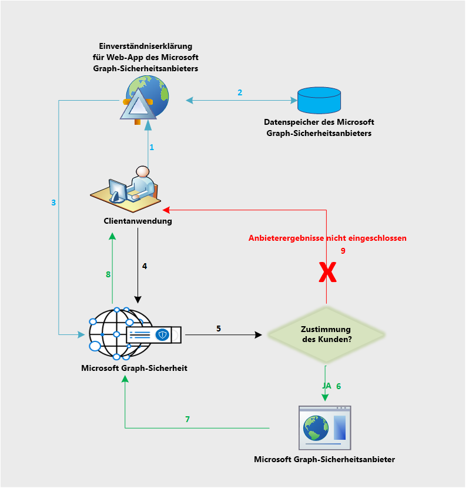

# Datenfluss in der Microsoft Graph Security-APIMicrosoft Graph Security API data flow

Die Microsoft Graph Security-API leitet Anforderungen im Verbund an alle Anbieter im Microsoft Graph Security-Ökosystem weiter.The Microsoft Graph Security API federates requests to all providers in the Microsoft Graph Security ecosystem. Dies basiert auf der Zustimmung des von der Anwendung bereitgestellten Sicherheitsanbieters, wie im folgenden Diagramm dargestellt.This is based on the security provider consent provided by the application, as shown in the following diagram. Der Ablauf der Zustimmung betrifft nur nicht von Microsoft stammende Anbieter.The consent workflow only applies to non-Microsoft providers.

Im Folgenden finden Sie eine Beschreibung des Ablaufs:The following is a description of the flow:

1. Der Anwendungsbenutzer meldet sich bei der Anbieteranwendung an, um das Zustimmungsformular vom Anbieter anzuzeigen.The application user signs in to the provider application to view the consent form from the provider. Die Benutzeroberfläche dieses Zustimmungsformulars ist im Besitz des Anbieters und betrifft nur nicht von Microsoft stammende Anbieter, um die ausdrückliche Zustimmung ihrer Kunden zum Senden von Anforderungen an die Microsoft Graph Security-API einzuholen.This consent form experience or UI is owned by the provider and applies to non-Microsoft providers only to get explicit consent from their customers to send requests to Microsoft Graph Security API.
2. Die Zustimmung des Kunden wird auf der Anbieterseite gespeichert.The client consent is stored on the provider side.
3. Der Zustimmungsdienst des Anbieters ruft die Microsoft Graph Security-API auf, um über die erteilte Zustimmung für den betreffenden Kunden zu informieren.The provider consent service calls the Microsoft Graph Security API to inform consent approval for the respective customer.
4. Die Anwendung sendet eine Anforderung an die Microsoft Graph Security-API.The application sends a request to the Microsoft Graph Security API.
5. Die Microsoft Graph Security-API prüft die den verschiedenen Anbietern zugeordneten Zustimmungsinformationen für diesen Kunden nach.The Microsoft Graph Security API checks for the consent information for this customer mapped to various providers.
6. Die Microsoft Graph Security-API ruft alle Anbieter auf, denen der Kunde mithilfe der Zustimmungsfunktionalität des Anbieters eine explizite Zustimmung erteilt hat.The Microsoft Graph Security API calls all those providers the customer has given explicit consent to via the provider consent experience.
7. Die Antwort wird von allen Anbietern zurückgegeben, die eine Zustimmung für diesen Kunden erhalten haben.The response is returned from all the consented providers for that client.
8. Die Antwort wird in Form eines Resultsets an die Anwendung zurückgegeben.The result set response is returned to the application.
9. Wenn der Kunde keinem Anbieter zugestimmt hat, sind in der Antwort keine Ergebnisse dieser Anbieter enthalten.If the customer has not consented to any provider, no results from those providers are included in the response.
