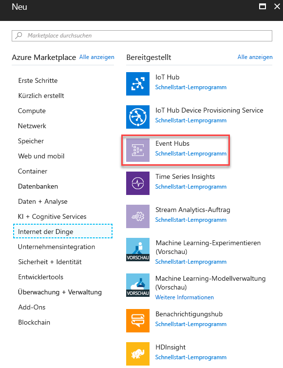
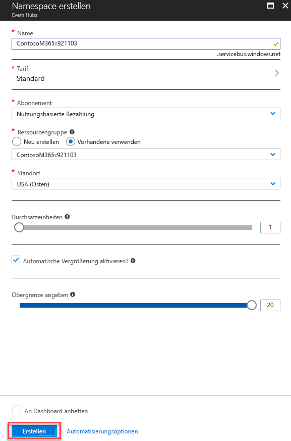

# <a name="integrate-microsoft-graph-security-api-alerts-with-ibm-qradar-siem-using-azure-monitor"></a>Integration von Microsoft Graph-Sicherheits-API-Warnungen mit IBM-QRadar-SIEM mithilfe von Azure Monitor

Die Microsoft Graph-Sicherheitsanbieter können über einen einzelnen REST-Endpunkt verwaltet werden. Dieser Endpunkt kann für [Azure Monitor](https://docs.microsoft.com/en-us/azure/monitoring-and-diagnostics/) konfiguriert werden, der Connectors für mehrere SIEM-Produkte unterstützt. Die Anweisungen in Schritt 1 und 2 dieses Artikels verweisen auf alle Azure Monitor-Connectors, die Verbrauch über Ereignis-Hubs unterstützen. Dieser Artikel beschreibt die Ende-zu-Ende-Integration des  [QRadar](https://www.ibm.com/us-en/marketplace/ibm-qradar-siem)-SIEM-Connectors.

Der Integrationsvorgang umfasst die folgenden Schritte:

1. [Einrichten des Azure Event Hubs zum Empfangen von Sicherheitswarnungen für Ihren Mandanten](#step-1-set-up-an-event-hubs-namespace-in-azure-to-receive-security-alerts-for-your-tenant).
2. [Konfigurieren von Azure Monitor zum Senden von Sicherheitswarnungen vom Mandanten an den Event Hub](#step-2-configure-azure-monitor-to-send-security-alerts-from-your-tenant-to-the-event-hub)
3. [Herunterladen und installieren Sie QRadar um Sicherheitswarnungen zu nutzen](#step-3-download-and-install-the-qradar-to-consume-security-alerts).

Nachdem Sie diese Schritte durchgeführt haben, nutzt Ihr IBM QRadar die Sicherheitswarnungen aller Sicherheitsprodukte, die in Microsoft Graph integriert sind und für die Ihr Mandant lizenziert ist. Alle neuen Sicherheitsprodukte, die Sie lizenzieren, senden ebenfalls Warnungen über diese Verbindung, und zwar in demselben Schema und ohne weiteren Integrationsaufwand.

## <a name="step-1-set-up-an-event-hubs-namespace-in-azure-to-receive-security-alerts-for-your-tenant"></a>Schritt 1: Einrichten eines Event Hub-Namespace in Azure zum Empfangen von Sicherheitswarnungen für Ihren Mandanten

Sie müssen zunächst einen [Microsoft Azure Event Hub](https://docs.microsoft.com/en-us/azure/event-hubs/)-Namespace und einen Event-Hub erstellen. Dieser Namespace und Event Hub ist das Ziel für alle Sicherheitswarnungen in Ihrer Organisation. Ein Event Hub-Namespace ist eine logische Gruppierung von Event Hubs, die dieselbe Zugriffsrichtlinie verwenden. Beachten Sie einige Details zum Event Hub-Namespace und den Event Hubs, die Sie erstellen:

- Wir empfehlen die Verwendung eines standardmäßigen Event Hub-Namespace, insbesondere dann, wenn Sie andere Azure-Überwachungsdaten über dieselben Event Hubs senden.
- In der Regel ist nur eine Durchsatzeinheit erforderlich. Wenn sich die Nutzung erhöht und sie nach oben skalieren müssen, können Sie die Anzahl der Durchsatzeinheiten für den Namespace später immer noch manuell erhöhen oder die automatische Erhöhung aktivieren.
- Die Anzahl der Durchsatzeinheiten ermöglicht Ihnen, den Durchsatzmaßstab für die Event Hubs zu erhöhen. Die Anzahl der Partitionen ermöglicht Ihnen, den Verbrauch für viele Kunden zu parallelisieren. Eine einzelne Partition kann bis zu 20 MBit/s erzielen bzw. ungefähr 20.000 Nachrichten pro Sekunde. Abhängig von dem Tool, das die Daten verbraucht, wird der Verbrauch durch mehrere Partitionen unterstützt oder auch nicht. Wenn Sie nicht sicher sind, wie viele Partitionen Sie festlegen sollen, empfehlen wir, mit vier Partitionen zu beginnen.
- Wir empfehlen, dass Sie die Nachrichtenaufbewahrung für Ihren Event Hub auf 7 Tage festlegen. Sollte das verbrauchende Tool länger als einen Tag ausfällt, wird hierdurch sichergestellt, dass das Tool dort fortfahren kann, wo es aufgehört hat (für Ereignissen, die bis zu sieben Tage alt sind).
- Wir empfehlen die Verwendung der standardmäßigen Consumergruppe für Ihren Event Hub. Sie müssen keine anderen Consumergruppen erstellen und keine separate Consumergruppe verwenden, es sei denn, Sie haben zwei verschiedene Tools, die dieselben Daten von demselben Event Hub verbrauchen.
- In der Regel müssen Port 5671 und 5672 auf dem Computer geöffnet sein, der die Daten vom Event Hub verbraucht.

Weitere Informationen finden sie auch unter [Häufig gestellte Fragen zu Azure Event Hubs](https://docs.microsoft.com/en-us/azure/event-hubs/event-hubs-faq).

1. Melden Sie sich beim [Azure-Portal](https://portal.azure.com/) an, und wählen Sie **Ressource erstellen** oben links auf dem Bildschirm.

    

2. Wählen Sie **Internet of Things** und dann **Event Hubs**.

    

3. Geben Sie unter **Namespace erstellen** einen Namen für den Namespace ein. Nachdem Sie sichergestellt haben, dass der Name des Namespace verfügbar ist, wählen Sie den Tarif aus (Basic oder Standard). Wählen Sie außerdem ein Azure-Abonnement, eine Ressourcengruppe und einen Speicherort, an dem die Ressource erstellt werden soll. Wählen Sie **Erstellen**, um den Namespace zu erstellen. Sie müssen möglicherweise einige Minuten warten, bis das System die Ressourcen vollständig bereitgestellt hat.

    

## <a name="step-2-configure-azure-monitor-to-send-security-alerts-from-your-tenant-to-the-event-hub"></a>Schritt 2: Konfigurieren von Azure Monitor zum Senden von Sicherheitswarnungen vom Mandanten an den Event Hub

Das Aktivieren des Streamings von Sicherheitswarnungen Ihrer Organisation über Azure Monitor erfolgt einmal für den gesamten Azure Active Directory (Azure AD)-Mandanten. Alle Produkte, die für die Microsoft Graph-Sicherheits-API lizenziert und aktiviert sind, beginnen mit dem Senden von Sicherheitswarnungen an Azure Monitor, wobei die Daten an die verbrauchenden Anwendungen gestreamt werden. Alle zusätzlichen Microsoft Graph-Sicherheits-API-fähigen Produkte, die von Ihrer Organisation lizenziert und bereitgestellt werden, streamen automatisch Sicherheitswarnungen über dieselbe Azure Monitor-Konfiguration. Es ist kein weiterer Integrationsaufwand durch Ihre Organisation erforderlich.

Sicherheitswarnungen sind Daten mit der höchsten Berechtigungsstufe, die in der Regel nur für Sicherheitsexperten und globale Administratoren in einer Organisation angezeigt werden. Aus diesem Grund benötigen Sie ein globales Administratorkonto für Azure AD, um die erforderlichen Schritte zum Konfigurieren der Integration von Sicherheitswarnungen mit SIEM-Systemen zu konfigurieren. Sie benötigen dieses Konto nur einmal während des Setups, um anzufordern, dass die Sicherheitswarnungen Ihrer Organisation an Azure Monitor gesendet werden.

> **Hinweis:** Derzeit unterstützt das Azure Monitor Diagnose-Einstellungsblatt nicht die Konfiguration von Ressourcen auf Mandantenebene. Microsoft Graph Security API-Benachrichtigungen sind eine Ressource auf Mandantenebene, die die Verwendung der Azure-Ressourcen-Manager-API zur Konfiguration von Azure Monitor zur Unterstützung des Verbrauchs der Sicherheitswarnungen Ihres Unternehmens voraussetzt.

1. Registrieren Sie in Ihrem Azure-Abonnement (befindet sich unter "Alle Dienste) „microsoft.insights“ (Azure Monitor) als Ressourcenanbieter.  
> **Hinweis:** Registrieren Sie "Microsoft.SecurityGraph" (Microsoft Graph Sicherheits-API) nicht als Ressourcenanbieter in Ihrem Azure-Abonnement, da, wie oben beschrieben, "Microsoft.SecurityGraph" eine Ressource auf Mandantenebene ist. Die Konfiguration auf Mandantenebene werden ist Teil von Nr. 6 weiter unten.

2. Um Azure Monitor mithilfe der Azure Resource Manager-API zu konfigurieren, besorgen Sie sich das [ARMClient](https://github.com/projectkudu/ARMClient)-Tool. Dieses Tool wird verwendet, um REST-API-Aufrufe über die Befehlszeile an das Azure-Portal zu senden.

3. Erstellen Sie eine JSON-Datei mit Diagnose-Einstellungen wie die folgende:

    ``` json
    {
      "location": "",
      "properties": {
        "name": "securityApiAlerts",
        "serviceBusRuleId": "/subscriptions/SUBSCRIPTION_ID/resourceGroups/RESOURCE_GROUP/providers/Microsoft.EventHub/namespaces/EVENT_HUB_NAMESPACE/authorizationrules/RootManageSharedAccessKey",
        "logs": [
          {
            "category": "Alert",
            "enabled": true,
            "retentionPolicy": {
              "enabled": true,
              "days": 7
            }
          }
        ]
      }
    }
    ```

    Ersetzen Sie die Werte in der JSON-Datei wie folgt:

    **SUBSCRIPTION_ID** ist die Abonnement-ID des Azure-Abonnements, das die Ressourcengruppe hostet und der Event Hub-Namespace, an den Sie Sicherheitswarnungen von Ihrer Organisation senden.

    **RESOURCE_GROUP** ist die Ressourcengruppe mit dem Ereignis Hub-Namespace, an den Sie Sicherheitswarnungen von Ihrer Organisation senden.

    **EVENT_HUB_NAMESPACE** ist der Event Hub-Namespace, an den Sie Sicherheitswarnungen von Ihrer Organisation senden.

    **“days”:** ist die Anzahl der Tage, die Nachrichten im Ereignis-Hub aufbewahrt werden sollen.

4. Speichern Sie die Datei als JSON in dem Verzeichnis, in dem Sie „ARMClient.exe“ aufrufen. Nennen Sie die Datei zum Beispiel **AzMonConfig.json.**

5. Führen Sie den folgenden Befehl aus, um sich beim ARMClient-Tool anzumelden. Sie müssen Anmeldedaten eines globalen Administratorkontos verwenden.

    ``` shell
    ARMClient.exe login
    ```

6. Führen Sie den folgenden Befehl aus, um Azure Monitor so zu Konfigurieren, dass Sicherheitswarnungen an den Event Hub-Namespace gesendet werden. Dadurch wird automatisch einen Event Hub innerhalb des Namespace bereitgestellt und der Fluss von Sicherheitswarnungen an den Event Hub begonnen. Stellen Sie sicher, dass der Name der Einstellung (in diesem Beispiel **securityApiAlerts**) dem Einstellungsnamen entspricht, den Sie in der JSON-Datei für das Feld **name** angegeben haben.

    ``` shell
    ARMClient.exe put https://management.azure.com/providers/Microsoft.SecurityGraph/diagnosticSettings/securityApiAlerts?api-version=2017-04-01-preview  @".\AzMonConfig.json"
    ```

7. Um sicherzustellen, dass die Einstellungen richtig angewendet wurden, führen Sie diesen Befehl aus, und stellen Sie sicher, dass die Ausgabe den JSON-Dateieinstellungen entspricht.

    ``` shell
    ARMClient.exe get https://management.azure.com/providers/Microsoft.SecurityGraph/diagnosticSettings/securityApiAlerts?api-version=2017-04-01-preview
    ```
8. Beenden Sie das ARMClient-Tool. Sie haben jetzt die Konfiguration von Azure Monitor zum Senden von Sicherheitswarnungen von Mandanten an den Event Hub abgeschlossen.

## <a name="step-3-download-and-install-the-qradar-to-consume-security-alerts"></a>Schritt 3: Herunterladen und installieren Sie QRadar um Sicherheitswarnungen zu nutzen

1. Herunterladen und Installieren von [IBM QRadar](https://www.ibm.com/us-en/marketplace/ibm-qradar-siem). **Version 7.2.8 mit Patch 7 oder höher ist erforderlich** zum Lesen von Ereignissen aus einem Microsoft Azure-Event-Hub.
2. Führen Sie die Schritte unter [Konfigurieren von Microsoft Azure Event-Hubs, um mit IBM QRadar zu kommunizieren](https://www.ibm.com/support/knowledgecenter/SS42VS_DSM/t_dsm_guide_microsoft_azure_enable_event_hubs.html) aus, um Ihren Event-Hub zu konfigurieren.
3. Abschließend führen Sie die Schritte in [Konfigurierung von QRadar zum Sammeln von Ereignissen aus Microsoft Azure -Event-Hubs mithilfe des Microsoft Azure-Event-Hubs-Protokolls](https://www.ibm.com/support/knowledgecenter/SS42VS_DSM/t_logsource_microsoft_azure_event_hubs.html) aus, um sich Sicherheitshinweise anzeigen zu lassen.
  
 > **Hinweis:** Die Integration von Microsoft Azure mit IBM QRadar unterstützt die Ereignisse, die in [Microsoft Azure DSM Spezifikationen](https://www.ibm.com/support/knowledgecenter/SS42VS_DSM/c_dsm_guide_microsoft_azure_DSM_specs.html) aufgelistet sind. Wir arbeiten derzeit mit IBM QRadar daran, eine vollständige Unterstützung für Warnhinweise der Microsoft Graph-Sicherheits-API hinzuzufügen. Derzeit können Sie Microsoft Security Graph-API-Benachrichtigungen erhalten und diese in Ihrer IBM QRadar-Konsole anzeigen lassem. Sie können den [DSM-Editor](https://www.ibm.com/support/knowledgecenter/SS42VS_7.2.8/com.ibm.qradar.doc/c_qradar_adm_dsm_ed_overview.html) benutzen, um die Analyse von Microsoft Security Graph-API-Warnungen zu aktivieren.  
