# <a name="integrate-microsoft-graph-security-api-alerts-with-your-siem-using-azure-monitor"></a>Integrieren von Warnungen der Microsoft Graph Security-API und SIEM mithilfe von Azure Monitor

Die Microsoft Graph Security-Anbieter können über einen einzelnen REST-Endpunkt verwaltet werden. Dieser Endpunkt kann auf [Azure Monitor](https://docs.microsoft.com/de-DE/azure/monitoring-and-diagnostics/) konfiguriert werden, der Connectors zu verschiedenen SIEM-Produkten unterstützt. Die Anweisungen in Schritt 1 und Schritt 2 dieses Artikels beziehen sich auf alle Azure Monitor-Connectors, die Nutzung über Event Hubs unterstützen. In diesem Artikel ist die End-to-End-Integration des [Splunk](https://splunkbase.splunk.com/) SIEM-Connectors beschrieben.

Der Integrationsvorgang umfasst die folgenden Schritte:

1. [Einrichten des Azure Event Hubs zum Empfangen von Sicherheitswarnungen für den Mandanten](#step-1-set-up-an-event-hubs-namespace-in-azure-to-receive-security-alerts-for-your-tenant)
2. [Konfigurieren von Azure Monitor zum Senden von Sicherheitswarnungen vom Mandanten an den Event Hub](#step-2-configure-azure-monitor-to-send-security-alerts-from-your-tenant-to-the-event-hub)
3. [Herunterladen und Installieren des Azure Monitor-Add-Ons für Splunk, das es Splunk ermöglicht, Sicherheitswarnungen zu verbrauchen](#step-3-download-and-install-the-azure-monitor-add-on-for-splunk-which-will-allow-splunk-to-consume-security-alerts)
4. [Registrieren einer Anwendung bei dem Azure Active Directory des Mandanten, das Splunk verwendet, um Lesevorgänge vom Event Hub durchzuführen](#step-4-register-an-application-with-your-tenant-azure-active-directory-which-splunk-will-use-to-read-from-the-event-hub )
5. [Erstellen eines Azure Key Vault zum Speichern der Zugriffsschlüssel für den Event Hub](#step-5-create-an-azure-key-vault-to-store-the-access-key-for-the-event-hub)
6. [Konfigurieren der Splunk-Dateneingaben zum Verbrauchen von Sicherheitswarnungen, die im Event Hub gespeichert sind](#step-6-configure-the-splunk-data-inputs-to-consume-security-alerts-stored-in-the-event-hub)

Nachdem Sie diese Schritte durchgeführt haben, verbraucht Ihre Splunk Enterprise die Sicherheitswarnungen aller Sicherheitsprodukte, die in Microsoft Graph integriert sind und für die Ihr Mandant lizenziert ist. Alle neuen Sicherheitsprodukte, die Sie lizenzieren, senden ebenfalls Warnungen über diese Verbindung, und zwar in demselben Schema und ohne weiteren Integrationsaufwand.

## <a name="step-1-set-up-an-event-hubs-namespace-in-azure-to-receive-security-alerts-for-your-tenant"></a>Schritt 1: Einrichten eines Event Hub-Namespace in Azure zum Empfangen von Sicherheitswarnungen für Ihren Mandanten

Sie müssen zunächst einen [Microsoft Azure Event Hubs](https://docs.microsoft.com/de-DE/azure/event-hubs/)-Namespace und einen Event Hub erstellen. Dieser Namespace und Event Hub ist das Ziel für alle Sicherheitswarnungen in Ihrer Organisation. Ein Event Hub-Namespace ist eine logische Gruppierung von Event Hubs, die dieselbe Zugriffsrichtlinie verwenden. Beachten Sie einige Details zum Event Hub-Namespace und den Event Hubs, die Sie erstellen:

- Wir empfehlen die Verwendung eines standardmäßigen Event Hub-Namespace, insbesondere dann, wenn Sie andere Azure-Überwachungsdaten über dieselben Event Hubs senden.
- In der Regel ist nur eine Durchsatzeinheit erforderlich. Wenn sich die Nutzung erhöht und sie nach oben skalieren müssen, können Sie die Anzahl der Durchsatzeinheiten für den Namespace später immer noch manuell erhöhen oder die automatische Erhöhung aktivieren.
- Die Anzahl der Durchsatzeinheiten ermöglicht Ihnen, den Durchsatzmaßstab für die Event Hubs zu erhöhen. Die Anzahl der Partitionen ermöglicht Ihnen, den Verbrauch für viele Kunden zu parallelisieren. Eine einzelne Partition kann bis zu 20 MBit/s erzielen bzw. ungefähr 20.000 Nachrichten pro Sekunde. Abhängig von dem Tool, das die Daten verbraucht, wird der Verbrauch durch mehrere Partitionen unterstützt oder auch nicht. Wenn Sie nicht sicher sind, wie viele Partitionen Sie festlegen sollen, empfehlen wir, mit vier Partitionen zu beginnen.
- Wir empfehlen, dass Sie die Nachrichtenaufbewahrung für Ihren Event Hub auf 7 Tage festlegen. Sollte das verbrauchende Tool länger als einen Tag ausfällt, wird hierdurch sichergestellt, dass das Tool dort fortfahren kann, wo es aufgehört hat (für Ereignissen, die bis zu sieben Tage alt sind).
- Wir empfehlen die Verwendung der standardmäßigen Consumergruppe für Ihren Event Hub. Sie müssen keine anderen Consumergruppen erstellen und keine separate Consumergruppe verwenden, es sei denn, Sie haben zwei verschiedene Tools, die dieselben Daten von demselben Event Hub verbrauchen.
- In der Regel müssen Port 5671 und 5672 auf dem Computer geöffnet sein, der die Daten vom Event Hub verbraucht.

Weitere Informationen finden sie auch unter [Häufig gestellte Fragen zu Azure Event Hubs](https://docs.microsoft.com/de-DE/azure/event-hubs/event-hubs-faq).

1. Melden Sie sich beim [Azure-Portal](https://portal.azure.com/) an, und wählen Sie **Ressource erstellen** oben links auf dem Bildschirm.

    

2. Wählen Sie **Internet of Things** und dann **Event Hubs**.

    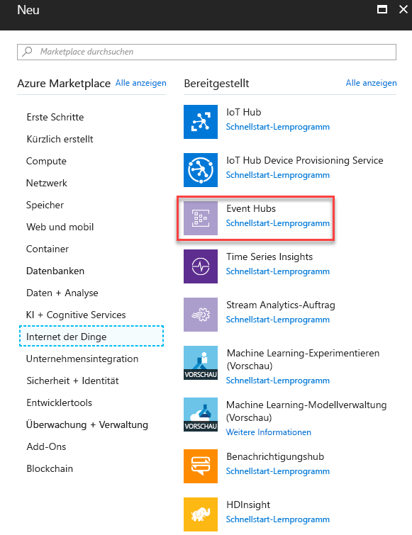

3. Geben Sie unter **Namespace erstellen** einen Namen für den Namespace ein. Nachdem Sie sichergestellt haben, dass der Name des Namespace verfügbar ist, wählen Sie den Tarif aus (Basic oder Standard). Wählen Sie außerdem ein Azure-Abonnement, eine Ressourcengruppe und einen Speicherort, an dem die Ressource erstellt werden soll. Wählen Sie **Erstellen**, um den Namespace zu erstellen. Sie müssen möglicherweise einige Minuten warten, bis das System die Ressourcen vollständig bereitgestellt hat.

    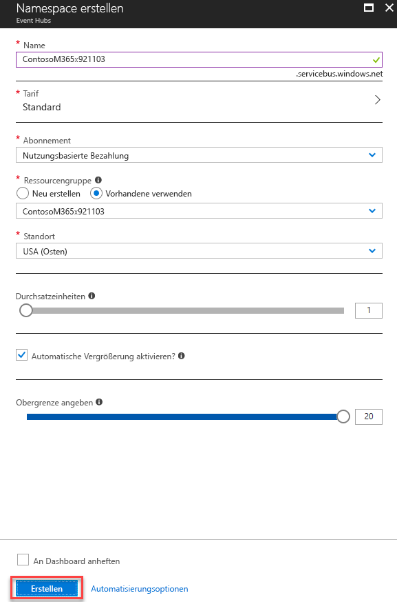

## <a name="step-2-configure-azure-monitor-to-send-security-alerts-from-your-tenant-to-the-event-hub"></a>Schritt 2: Konfigurieren von Azure Monitor zum Senden von Sicherheitswarnungen vom Mandanten an den Event Hub

Das Aktivieren des Streamings von Sicherheitswarnungen Ihrer Organisation über Azure Monitor erfolgt einmal für den gesamten Azure Active Directory (Azure AD)-Mandanten. Alle Produkte, die für die Microsoft Graph Security-API lizenziert sind und diese unterstützen, beginnen mit dem Senden von Sicherheitswarnungen an Azure Monitor, wobei die Daten an die verbrauchenden Anwendungen gestreamt werden. Alle zusätzlichen die Microsoft Graph Security-API unterstützenden Produkte, die von Ihrer Organisation lizenziert und bereitgestellt werden, streamen automatisch Sicherheitswarnungen über dieselbe Azure Monitor-Konfiguration. Es ist kein weiterer Integrationsaufwand durch Ihre Organisation erforderlich.

Sicherheitswarnungen sind Daten mit der höchsten Berechtigungsstufe, die in der Regel nur für Sicherheitsexperten und globale Administratoren in einer Organisation angezeigt werden. Aus diesem Grund benötigen Sie ein globales Administratorkonto für Azure AD, um die erforderlichen Schritte zum Konfigurieren der Integration von Sicherheitswarnungen mit SIEM-Systemen zu konfigurieren. Sie benötigen dieses Konto nur einmal während des Setups, um anzufordern, dass die Sicherheitswarnungen Ihrer Organisation an Azure Monitor gesendet werden.

> **Hinweis:** Derzeit unterstützt das Azure Monitor Diagnostics-Einstellungsblatt nicht die Konfiguration von Ressourcen auf Mandantenebene. Da es sich bei Warnungen der Microsoft Graph Security-API um eine Ressource auf Mandantenebene handelt, müssen Sie die Azure Resource Manager-API verwenden, um Azure Monitor zur Nutzung von Sicherheitswarnungen Ihrer Organisation zu konfigurieren.

1. Registrieren Sie in Ihrem Azure-Abonnement „microsoft.insights“ (Azure Monitor) als Ressourcenanbieter.  
 > **Hinweis:** Registrieren Sie „Microsoft.SecurityGraph“ (Microsoft Graph Security-API) in Ihrem Azure-Abonnement nicht als Ressourcenanbieter, da „Microsoft.SecurityGraph“ ein Anbieter auf Mandantenebene ist, wie oben erläutert. Die Konfiguration auf Mandantenebene werden ist Teil von Nr. 6 weiter unten.

2. Um Azure Monitor mithilfe der Azure Resource Manager-API zu konfigurieren, besorgen Sie sich das [ARMClient](https://github.com/projectkudu/ARMClient)-Tool. Dieses Tool wird verwendet, um REST-API-Aufrufe über die Befehlszeile an das Azure-Portal zu senden.

3. Erstellen Sie eine JSON-Datei mit Diagnose-Einstellungen wie die folgende:

<!-- {
  "blockType": "ignored"
} -->

    ``` json
    {
      "location": "",
      "properties": {
        "name": "securityApiAlerts",
        "serviceBusRuleId": "/subscriptions/SUBSCRIPTION_ID/resourceGroups/RESOURCE_GROUP/providers/Microsoft.EventHub/namespaces/EVENT_HUB_NAMESPACE/authorizationrules/RootManageSharedAccessKey",
        "logs": [
          {
            "category": "Alert",
            "enabled": true,
            "retentionPolicy": {
              "enabled": true,
              "days": 7
            }
          }
        ]
      }
    }
    ```

  Ersetzen Sie die Werte in der JSON-Datei wie folgt:

  * **SUBSCRIPTION_ID** ist die Abonnement-ID des Azure-Abonnements, das die Ressourcengruppe hostet und der Event Hub-Namespace, an den Sie Sicherheitswarnungen von Ihrer Organisation senden.
  * **RESOURCE_GROUP** ist die Ressourcengruppe mit dem Ereignis Hub-Namespace, an den Sie Sicherheitswarnungen von Ihrer Organisation senden.
  * **EVENT_HUB_NAMESPACE** ist der Event Hub-Namespace, an den Sie Sicherheitswarnungen von Ihrer Organisation senden.
  * **„days“:** ist die Anzahl der Tage, die Nachrichten im Event Hub aufbewahrt werden sollen.
  
&nbsp;
4. Speichern Sie die Datei als JSON in dem Verzeichnis, in dem Sie „ARMClient.exe“ aufrufen. Nennen Sie die Datei zum Beispiel **AzMonConfig.json.**

5. Führen Sie den folgenden Befehl aus, um sich beim ARMClient-Tool anzumelden. Sie müssen Anmeldedaten eines globalen Administratorkontos verwenden.

    ``` shell
    ARMClient.exe login
    ```

6. Führen Sie den folgenden Befehl aus, um Azure Monitor so zu Konfigurieren, dass Sicherheitswarnungen an den Event Hub-Namespace gesendet werden. Dadurch wird automatisch einen Event Hub innerhalb des Namespace bereitgestellt und der Fluss von Sicherheitswarnungen an den Event Hub begonnen. Stellen Sie sicher, dass der Name der Einstellung (in diesem Beispiel **securityApiAlerts**) dem Einstellungsnamen entspricht, den Sie in der JSON-Datei für das Feld **name** angegeben haben.

    ``` shell
    ARMClient.exe put https://management.azure.com/providers/Microsoft.SecurityGraph/diagnosticSettings/securityApiAlerts?api-version=2017-04-01-preview  @".\AzMonConfig.json"
    ```

7. Um sicherzustellen, dass die Einstellungen richtig angewendet wurden, führen Sie diesen Befehl aus, und stellen Sie sicher, dass die Ausgabe den JSON-Dateieinstellungen entspricht.

    ``` shell
    ARMClient.exe get https://management.azure.com/providers/Microsoft.SecurityGraph/diagnosticSettings/securityApiAlerts?api-version=2017-04-01-preview
    ```

8. Beenden Sie das ARMClient-Tool. Sie haben jetzt die Konfiguration von Azure Monitor zum Senden von Sicherheitswarnungen von Mandanten an den Event Hub abgeschlossen.

## <a name="step-3-download-and-install-the-azure-monitor-add-on-for-splunk-which-will-allow-splunk-to-consume-security-alerts"></a>Schritt 3: Herunterladen und Installieren des Azure Monitor-Add-Ons für Splunk, das es Splunk ermöglicht, Sicherheitswarnungen zu verbrauchen

1. Diese Integration unterstützt nur [Splunk Enterprise](https://splunkbase.splunk.com/)-Bereitstellungen.
2. Laden Sie das [Azure Monitor-Add-On für Splunk](https://github.com/Microsoft/AzureMonitorAddonForSplunk) herunter, und installieren Sie es. Ausführliche Installationsanweisungen finden Sie unter [Installation](https://github.com/Microsoft/AzureMonitorAddonForSplunk/wiki/Installation). **Es wird nur das Azure Monitor-Add-On für Splunk Version 1.2.9 oder höher unterstützt.**
3. Befolgen Sie nach der erfolgreichen Installation des Add-Ons die Konfigurationsschritte in der [Wiki zur Konfiguration des Azure Monitor-Add-Ons](https://github.com/Microsoft/AzureMonitorAddonForSplunk/wiki/Configuration-of-Splunk ), um Splunk zu konfigurieren.
4. Wie in den Installationsanweisungen zum Add-On angegeben, funktioniert das Add-On, sobald Sie einen Deaktivieren-Aktivieren-Zyklus auf der Seite „Manage Apps“ in Splunk Web ausgeführt  haben. Sie können Splunk auch neu starten.

## <a name="step-4-register-an-application-with-your-tenant-azure-active-directory-which-splunk-will-use-to-read-from-the-event-hub"></a>Schritt 4: Registrieren einer Anwendung bei dem Azure Active Directory des Mandanten, das Splunk verwendet, um Lesevorgänge vom Event Hub durchzuführen

Splunk benötigt eine Anwendungsregistrierung in Azure Active Directory in Ihrer Organisation, um die erforderlichen Berechtigungen und App-Anmeldeinformationen zu erhalten, um Azure Monitor Event Hub zu authentifizieren.

1. Gehen Sie im Azure-Portal zu **App-Registrierungen**, und wählen Sie **Registrierung einer neuen Anwendung** aus.

    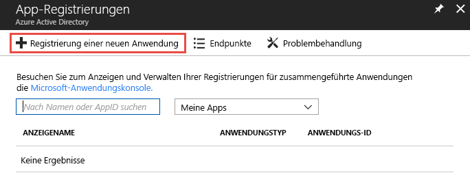

2. Wählen Sie einen Namen für die Anwendung aus, wählen Sie **Web-App/API** als Typ, und **`https://localhost`** als URL für die Anmeldung. Wählen Sie dann **Erstellen** aus.

    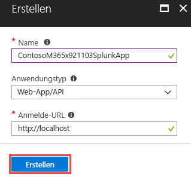

3. Nachdem die Anwendung erstellt wurde, kopieren Sie die **Anwendungs-ID**, und speichern Sie sie zur späteren Verwendung beim Konfigurieren der Splunk Dateneingaben. Wechseln Sie dann zu den Anwendungseinstellungen, und wählen Sie **Schlüssel**.

    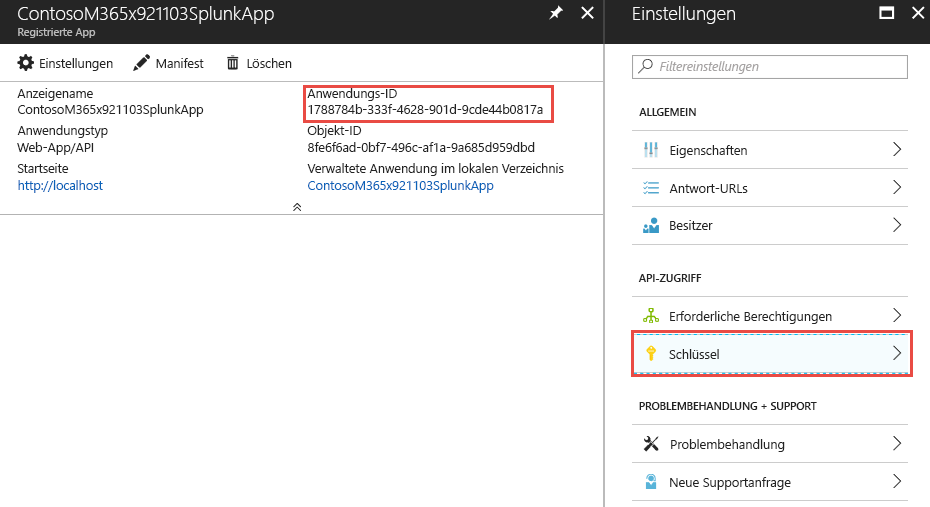

    Hierdurch können Sie einen neuen Schlüssel generieren, der als „geheimer Anwendungsschlüssel“ bezeichnet wird. Nachdem er generiert wurde, kopieren Sie den **geheimen Anwendungsschlüssel**, und speichern Sie ihn zur späteren Verwendung beim Konfigurieren der Splunk-Dateneingaben.

4. Erteilen Sie der Anwendung die Rolle **Leser** im Azure-Abonnement mit dem Event Hub, der die Sicherheitswarnungen Ihrer Organisation enthält.

    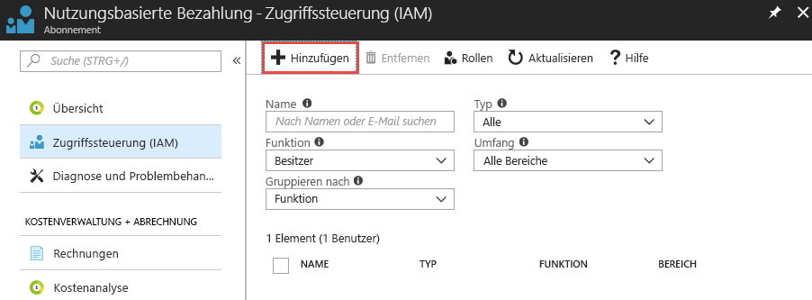

    Wählen Sie Ihr Abonnement, wählen Sie **Zugriffssteuerung (IAM)**. Wählen Sie **Hinzufügen**, um Berechtigungen hinzuzufügen. Wählen Sie Ihre Anwendung aus, und wählen Sie als **Rolle** für die Anwendung **Leser**.

    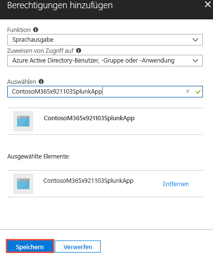

    Wählen Sie **Speichern**, um die gewährten Berechtigungen der Anwendung zum Abonnement hinzuzufügen.

## <a name="step-5-create-an-azure-key-vault-to-store-the-access-key-for-the-event-hub"></a>Schritt 5: Erstellen eines Azure Key Vault zum Speichern der Zugriffsschlüssel für den Event Hub

Azure Key Vaults dienen zum Speichern von Geheimnissen wie Identitäten, Kennwörtern und Zertifikaten für die Verwendung zur Laufzeit durch Anwendungen. In diesem Schritt erstellen Sie einen Azure Key Vault zum Speichern der Geheimnisse, die Splunk benötigt, um eine Verbindung mit Azure-Event-Hubs herzustellen und die darin enthaltenen Sicherheitswarnungen zu lesen.

1. Wechseln Sie im Azure-Portal zu **Key Vaults**, und wählen Sie **Hinzufügen** aus.

    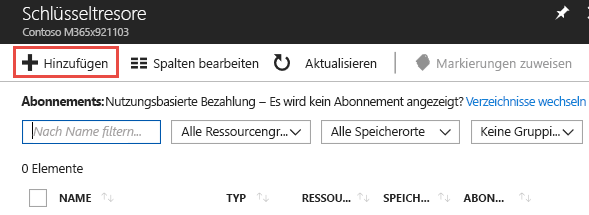

2. Wählen Sie beim Erstellen des neuen Key Vaults **Zugriffsrichtlinien**, um eine neue Zugriffsrichtlinie für die Anwendung hinzuzufügen, die Sie gerade in Schritt 4 registriert haben. Gewähren Sie der Anwendung die Berechtigung **Get**. Dadurch kann Splunk, das als registrierte Anwendung fungiert, auf die in diesem Azure Key Vault gespeicherten Schlüssel (Geheimnisse) zugreifen.

    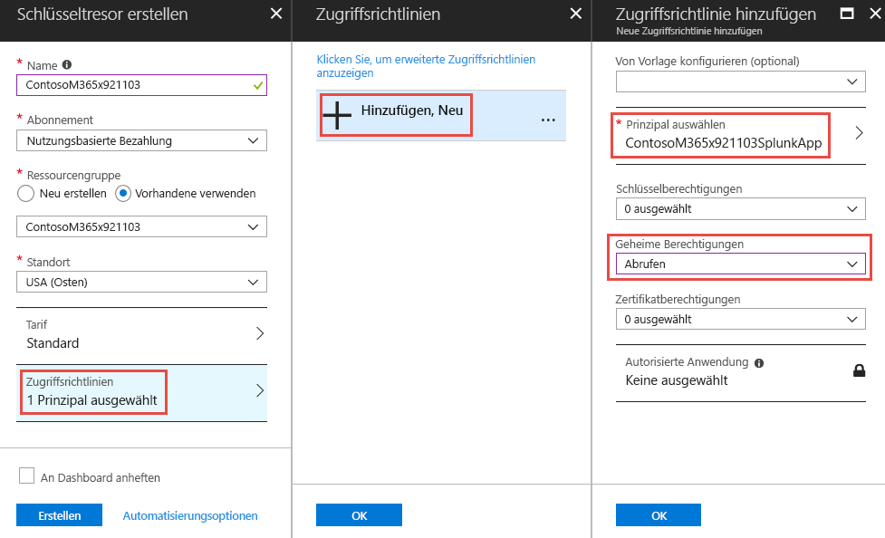

    Wählen Sie **Erstellen**, um die Erstellung Ihres neuen Azure Key Vault abzuschließen.

3. Generieren Sie einen neuen geheimen Schlüssel im Key Vault, um den Zugriffsschlüssel für den Event Hub-Namespace zu speichern. Rufen Sie zuerst den Zugriffsschlüssel für den Event Hub-Namespace ab, indem Sie den Event Hub-Namespace öffnen und die Option **Freigegebene Zugriffsrichtlinien** auswählen. Wählen Sie die **RootManageSharedAccessKey**-Richtlinie aus der Liste, und kopieren Sie den **Primärschlüssel** aus der Liste.

    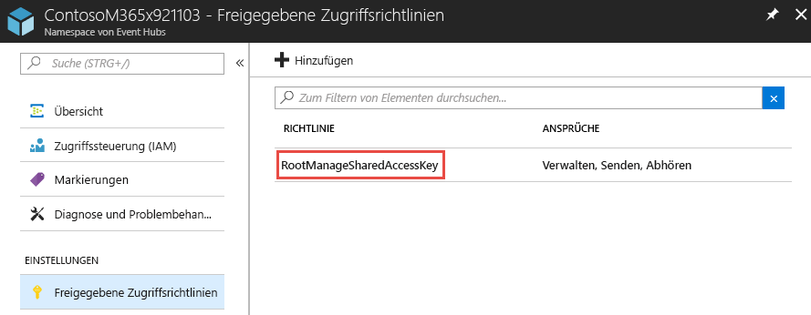

4. Öffnen Sie den Key Vault, und wählen Sie **Geheimnisse**. Wählen Sie **Generieren/Importieren**, um dem Key Vault ein neues Geheimnis hinzuzufügen. Fügen Sie den **Primärschlüssel** aus dem Event Hub-Namespace **RootManageSharedAccessKey** ein.

    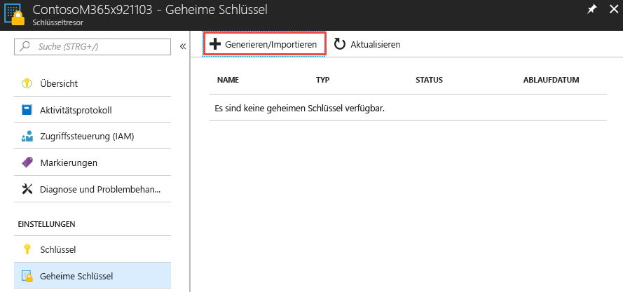

5. Nachdem es erstellt wurde, wählen Sie das Geheimnis aus, und kopieren Sie die **Geheimnisversion** des Geheimnisses. Dies wird weiter unten in Schritt 6 verwendet, um Splunk-Dateneingaben zu konfigurieren.

    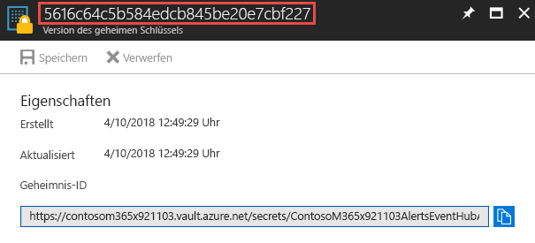

## <a name="step-6-configure-the-splunk-data-inputs-to-consume-security-alerts-stored-in-the-event-hub"></a>Schritt 6: Konfigurieren der Splunk-Dateneingaben zum Verbrauchen von Sicherheitswarnungen, die im Event Hub gespeichert sind

Der letzte Schritt des Einrichtungsprozesses besteht darin, die Splunk-Dateneingaben so zu konfigurieren, dass sie den Event Hub, die Anwendung und die Geheimnisse nutzen, die Sie in den vorhergehenden Schritten erstellt haben.

1. Folgen Sie den Anweisungen im Thema [Splunk-Konfiguration](https://github.com/Microsoft/AzureMonitorAddonForSplunk/wiki/Configuration-of-Splunk), um Splunk-Dateneingaben für das Azure Monitor-Add-On zu öffnen und zu konfigurieren. Wechseln Sie zu **Einstellungen** und **Dateneingaben**. Wählen Sie **Azure Monitor-Diagnoseprotokolle**.
2. Wählen Sie **Neu**, und füllen Sie alle erforderlichen Felder mit den Werten aus, die Sie in den vorhergehenden Schritten erhalten haben. Die folgende Abbildung zeigt alle erforderlichen Felder mit den Werten aus den vorherigen Beispielen in diesem Artikel.

    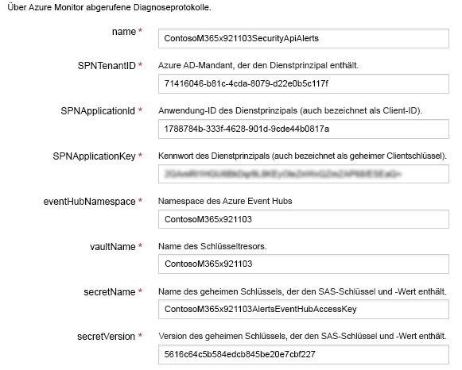

3. Wählen Sie **Weiter**, und suchen sie nach den Sicherheitswarnungen für Ihre Organisation, die von Azure Monitor abgerufen wurden.

## <a name="optional-use-splunk-search-to-explore-data"></a>(Optional) Verwenden der Splunk-Suche für Datenanalyse

Nachdem Sie das Plug-In für Azure Monitor Splunk eingerichtet haben, ruft Ihre Splunk-Instanz Ereignisse vom konfigurierten Event Hub ab. Standardmäßig indiziert Splunk jede Eigenschaft des Warnungsschemas der Microsoft Graph-Sicherheits-API, um die Suche zuzulassen.

Um nach Microsoft Graph-Sicherheits-API-Warnungen zu suchen, Dashboards zu erstellen oder Splunk-Nachrichten mit der Suchabfrage festzulegen, navigieren Sie in Splunk zu „Apps“ -> „App für Suche und Berichterstellung“.

**Beispiele**:<br/>
Testen Sie die Suche nach Graph-Sicherheitswarnungen:

- Geben Sie in die Suchleiste `sourcetype="amdl:securitygraph:alert"` ein, um alle Warnungen über die Microsoft Graph-Sicherheit-API abzurufen. Im rechten Bereich werden die Eigenschaften der obersten Ebene des Azure Monitor-Protokolls angezeigt, wobei die Graph-Sicherheitswarnung unter dem Feld „Eigenschaften“ zu sehen ist.<br/>
- Im linken Bereich werden die ausgewählten und interessanten Felder angezeigt. Sie können ausgewählte Felder verwenden, um Dashboards oder Splunk-Warnungen zu erstellen. Sie können auch ausgewählte Felder hinzufügen oder entfernen, indem Sie mit der rechten Maustaste auf diese Felder klicken.  
> **Hinweis:** Sie können die Suche, wie in der folgenden Abfrage gezeigt, bei Bedarf eingrenzen. In dem Beispiel werden die Graph-Sicherheitswarnungen nach Warnungen aus Azure Security Center mit hoher Priorität gefiltert. `eventDatetime`, `severity`, `status` und `provider` wurden ebenfalls als ausgewählte Felder verwendet, die angezeigt werden sollen. Informationen zu erweiterten Suchbegriffen finden Sie in den [Tutorials zur Splunk-Suche](https://docs.splunk.com/Documentation/Splunk/7.1.2/SearchTutorial/WelcometotheSearchTutorial).

 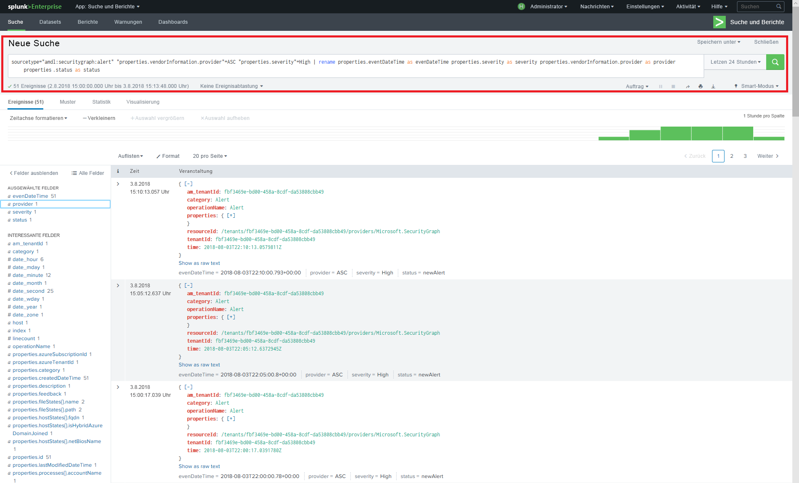
> Suchabfrage: `sourcetype="amdl:securitygraph:alert" "properties.vendorInformation.provider"=ASC "properties.severity"=High | rename properties.eventDataTime as eventDateTime properties.severity as severity properties.vendorInformation.provider as provider properties.status as status`

Mit Splunk können auch mehrere Aktionen auf die Suchergebnisse erfolgen, indem die Menüoption „Speichern unter“ oben rechts auf dem Bildschirm verwendet wird. Sie können basierend auf dem Suchfilter Berichte, Dashboardbereiche oder Warnungen erstellen.
Unten folgt ein Beispiel für ein Dashboard mit einem Ereignisstream basierend auf der vorherigen Abfrage: Sie können zu jedem Ereignis einen Drilldownlink hinzufügen, um die auf die Details der Microsoft Graph-Website zuzugreifen. Weitere Informationen dazu finden Sie in der [Dokumentation zu Splunk-Drilldown](https://docs.splunk.com/Documentation/Splunk/7.1.2/Viz/DrilldownIntro).

 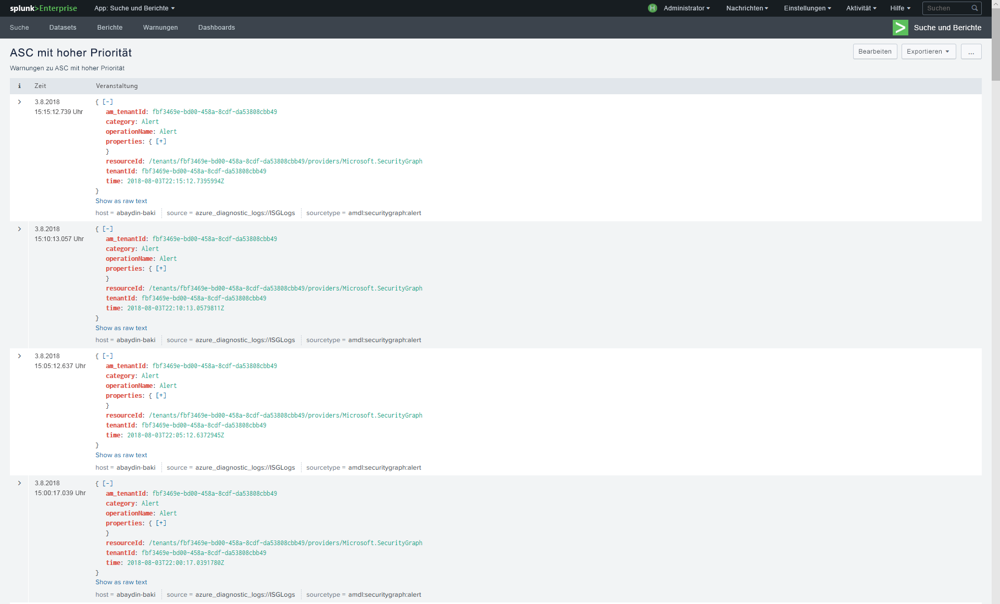

Oder Sie können ein Dashboard als Zeitachse erstellen:

 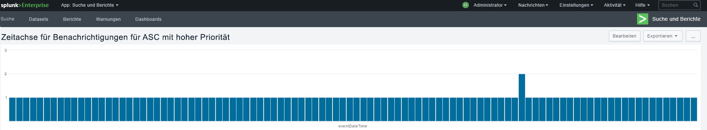

Weitere Informationen finden Sie in dem [Tutorial zu Splunk-Suche und -Berichten](https://docs.splunk.com/Documentation/Splunk/7.1.2/SearchTutorial/WelcometotheSearchTutorial).

