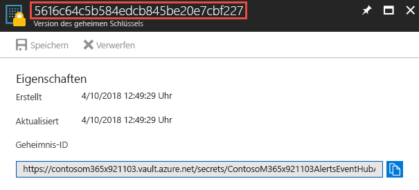

# <a name="integrate-security-api-alerts-with-your-siem-using-azure-monitor"></a>Integrieren von Sicherheits-API-Warnungen mit Ihrem SIEM unter Verwendung von Azure Monitor

Die Sicherheits-API in Microsoft Graph bietet die Möglichkeit, Sicherheitswarnungen vieler verschiedener Sicherheitsprodukte, die als „Provider“ bezeichnet werden, über einen einzelnen REST-Endpunkt zu verwalten. Einige Organisationen nehmen möglicherweise bereits Azure-spezifische Protokolldaten über Azure Monitor in SIEM-Lösungen auf. Um die Integration zu vereinfachen, stehen die über die REST-API verfügbar gemachten Warnungen auch über Azure Monitor bereit. Wenn Ihre Organisation die Azure Monitor-Integration mit Ihrer SIEM-Lösung bereits konfiguriert hat, können Sie jetzt ganz einfach die Sicherheitswarnungen Ihrer Organisation den Daten hinzufügen, die über Azure Monitor verfügbar sind. Dieser Artikel führt Sie durch die Schritte, die zur Umsetzung dieser Integration erforderlich sind.

Azure Monitor unterstützt mehrere verschiedene SIEM-Connectors unterschiedlicher Hersteller. Eine (nicht vollständige) Liste von SIEM-Tools mit Connectors für Azure Monitor-Daten finden Sie im Artikel [Senden von Überwachungsdaten an einen Event Hub](https://docs.microsoft.com/de-DE/azure/monitoring-and-diagnostics/monitor-stream-monitoring-data-event-hubs#what-can-i-do-with-the-monitoring-data-being-sent-to-my-event-hub). Die Anweisungen in Schritt 1 und Schritt 2 dieses Artikels gelten für alle Azure Monitor-Connectors, die den Verbrauch über einen Event Hub unterstützen. Dieser Artikel beschreibt die Ende-zu-Ende-Konfiguration für den Splunk SIEM-Connector.

Der Integrationsvorgang umfasst die folgenden Schritte:

1. [Einrichten des Azure Event Hubs zum Empfangen von Sicherheitswarnungen für den Mandanten](#step-1-set-up-an-event-hubs-namespace-in-azure-to-receive-security-alerts-for-your-tenant)
2. [Konfigurieren von Azure Monitor zum Senden von Sicherheitswarnungen vom Mandanten an den Event Hub](#step-2-configure-azure-monitor-to-send-security-alerts-from-your-tenant-to-the-event-hub)
3. [Herunterladen und Installieren des Azure Monitor-Add-Ons für Splunk, das es Splunk ermöglicht, Sicherheitswarnungen zu verbrauchen](#step-3-download-and-install-the-azure-monitor-add-on-for-splunk-which-will-allow-splunk-to-consume-security-alerts)
4. [Registrieren einer Anwendung bei dem Azure Active Directory des Mandanten, das Splunk verwendet, um Lesevorgänge vom Event Hub durchzuführen](#step-4-register-an-application-with-your-tenant-azure-active-directory-which-splunk-will-use-to-read-from-the-event-hub )
5. [Erstellen eines Azure Key Vault zum Speichern der Zugriffsschlüssel für den Event Hub](#step-5-create-an-azure-key-vault-to-store-the-access-key-for-the-event-hub)
6. [Konfigurieren der Splunk-Dateneingaben zum Verbrauchen von Sicherheitswarnungen, die im Event Hub gespeichert sind](#step-6-configure-the-splunk-data-inputs-to-consume-security-alerts-stored-in-the-event-hub)

Nachdem Sie diese Schritte durchgeführt haben, verbraucht Ihre Splunk Enterprise die Sicherheitswarnungen aller Sicherheitsprodukte, die in Microsoft Graph integriert sind und für die Ihr Mandant lizenziert ist. Alle neuen Sicherheitsprodukte, die Sie lizenzieren, senden ebenfalls Warnungen über diese Verbindung, und zwar in demselben Schema und ohne weiteren Integrationsaufwand.

## <a name="step-1-set-up-an-event-hubs-namespace-in-azure-to-receive-security-alerts-for-your-tenant"></a>Schritt 1: Einrichten eines Event Hub-Namespace in Azure zum Empfangen von Sicherheitswarnungen für Ihren Mandanten

Sie müssen zunächst einen Microsoft Azure Event Hub-Namespace und einen Event Hub erstellen. Dieser Namespace und Event Hub ist das Ziel für alle Sicherheitswarnungen in Ihrer Organisation. Ein Event Hub-Namespace ist eine logische Gruppierung von Event Hubs, die dieselbe Zugriffsrichtlinie verwenden. Beachten Sie einige Details zum Event Hub-Namespace und den Event Hubs, die Sie erstellen:

- Wir empfehlen die Verwendung eines standardmäßigen Event Hub-Namespace, insbesondere dann, wenn Sie andere Azure-Überwachungsdaten über dieselben Event Hubs senden.
- In der Regel ist nur eine Durchsatzeinheit erforderlich. Wenn sich die Nutzung erhöht und sie nach oben skalieren müssen, können Sie die Anzahl der Durchsatzeinheiten für den Namespace später immer noch manuell erhöhen oder die automatische Erhöhung aktivieren.
- Die Anzahl der Durchsatzeinheiten ermöglicht Ihnen, den Durchsatzmaßstab für die Event Hubs zu erhöhen. Die Anzahl der Partitionen ermöglicht Ihnen, den Verbrauch für viele Kunden zu parallelisieren. Eine einzelne Partition kann bis zu 20 MBit/s erzielen bzw. ungefähr 20.000 Nachrichten pro Sekunde. Abhängig von dem Tool, das die Daten verbraucht, wird der Verbrauch durch mehrere Partitionen unterstützt oder auch nicht. Wenn Sie nicht sicher sind, wie viele Partitionen Sie festlegen sollen, empfehlen wir, mit vier Partitionen zu beginnen.
- Wir empfehlen, dass Sie die Nachrichtenaufbewahrung für Ihren Event Hub auf 7 Tage festlegen. Sollte das verbrauchende Tool länger als einen Tag ausfällt, wird hierdurch sichergestellt, dass das Tool dort fortfahren kann, wo es aufgehört hat (für Ereignissen, die bis zu sieben Tage alt sind).
- Wir empfehlen die Verwendung der standardmäßigen Consumergruppe für Ihren Event Hub. Sie müssen keine anderen Consumergruppen erstellen und keine separate Consumergruppe verwenden, es sei denn, Sie haben zwei verschiedene Tools, die dieselben Daten von demselben Event Hub verbrauchen.
- In der Regel müssen Port 5671 und 5672 auf dem Computer geöffnet sein, der die Daten vom Event Hub verbraucht.

Weitere Informationen finden sie auch unter [Häufig gestellte Fragen zu Azure Event Hubs](https://docs.microsoft.com/de-DE/azure/event-hubs/event-hubs-faq).

1. Melden Sie sich beim [Azure-Portal](https://portal.azure.com/) an, und wählen Sie **Ressource erstellen** oben links auf dem Bildschirm.

    

2. Wählen Sie **Internet of Things** und dann **Event Hubs**.

    

3. Geben Sie unter **Namespace erstellen** einen Namen für den Namespace ein. Nachdem Sie sichergestellt haben, dass der Name des Namespace verfügbar ist, wählen Sie den Tarif aus (Basic oder Standard). Wählen Sie außerdem ein Azure-Abonnement, eine Ressourcengruppe und einen Speicherort, an dem die Ressource erstellt werden soll. Wählen Sie **Erstellen**, um den Namespace zu erstellen. Sie müssen möglicherweise einige Minuten warten, bis das System die Ressourcen vollständig bereitgestellt hat.

    

## <a name="step-2-configure-azure-monitor-to-send-security-alerts-from-your-tenant-to-the-event-hub"></a>Schritt 2: Konfigurieren von Azure Monitor zum Senden von Sicherheitswarnungen vom Mandanten an den Event Hub

Das Aktivieren des Streamings von Sicherheitswarnungen Ihrer Organisation über Azure Monitor erfolgt einmal für den gesamten Azure Active Directory (Azure AD)-Mandanten. Alle Produkte, die für die Sicherheits-API lizenziert und aktiviert sind, beginnen mit dem Senden von Sicherheitswarnungen an Azure Monitor, wobei die Daten an die verbrauchenden Anwendungen gestreamt werden. Alle zusätzlichen API-fähigen Produkte, die von Ihrer Organisation lizenziert und bereitgestellt werden, streamen automatisch Sicherheitswarnungen über dieselbe Azure Monitor-Konfiguration. Es ist kein weiterer Integrationsaufwand durch Ihre Organisation erforderlich.

Sicherheitswarnungen sind Daten mit der höchsten Berechtigungsstufe, die in der Regel nur für Sicherheitsexperten und globale Administratoren in einer Organisation angezeigt werden. Aus diesem Grund benötigen Sie ein globales Administratorkonto für Azure AD, um die erforderlichen Schritte zum Konfigurieren der Integration von Sicherheitswarnungen mit SIEM-Systemen zu konfigurieren. Sie benötigen dieses Konto nur einmal während des Setups, um anzufordern, dass die Sicherheitswarnungen Ihrer Organisation an Azure Monitor gesendet werden.

> **Hinweis:** Derzeit ermöglicht das Azure Monitor Diagnostics-Einstellungsblatt nicht die Konfiguration von Ressourcen auf Mandantenebene. Da es sich bei der API für Sicherheitswarnungen um eine Ressource auf Mandantenebene handelt, müssen Sie die Azure Resource Manager-API verwenden, um Azure Monitor für Sicherheitswarnungen Ihrer Organisation konfigurieren.

1. Registrieren Sie in Ihrem Azure-Abonnement „microsoft.insights“ (Azure Monitor) als Ressourcenanbieter.  
> **Hinweis:** Registrieren Sie „Microsoft.SecurityGraph“ (Security Graph-API) in Ihrem Azure-Abonnement nicht als Ressourcenanbieter, da „Microsoft.SecurityGraph“ ist Anbieter auf Mandantenebene ist. Die Konfiguration auf Mandantenebene werden ist Teil von Nr. 6 weiter unten. 

2. Um Azure Monitor mithilfe der Azure Resource Manager-API zu konfigurieren, besorgen Sie sich das [ARMClient](https://github.com/projectkudu/ARMClient)-Tool. Dieses Tool wird verwendet, um REST-API-Aufrufe über die Befehlszeile an das Azure-Portal zu senden.

3. Erstellen Sie eine JSON-Datei mit Diagnose-Einstellungen wie die folgende:

    ``` json
    {
      "location": "",
      "properties": {
        "name": "securityApiAlerts",
        "serviceBusRuleId": "/subscriptions/SUBSCRIPTION_ID/resourceGroups/RESOURCE_GROUP/providers/Microsoft.EventHub/namespaces/EVENT_HUB_NAMESPACE/authorizationrules/RootManageSharedAccessKey",
        "logs": [
          {
            "category": "Alert",
            "enabled": true,
            "retentionPolicy": {
              "enabled": true,
              "days": 7
            }
          }
        ]
      }
    }
    ```

    Ersetzen Sie die Werte in der JSON-Datei wie folgt:

     **SUBSCRIPTION_ID** ist die Abonnement-ID des Azure-Abonnements, das die Ressourcengruppe hostet und der Event Hub-Namespace, an den Sie Sicherheitswarnungen von Ihrer Organisation senden.
     
     **RESOURCE_GROUP** ist die Ressourcengruppe mit dem Ereignis Hub-Namespace, an den Sie Sicherheitswarnungen von Ihrer Organisation senden.
     
     **EVENT_HUB_NAMESPACE** ist der Event Hub-Namespace, an den Sie Sicherheitswarnungen von Ihrer Organisation senden.
     
     **“days”:** 7 ist die Anzahl der Tage, die Nachrichten im Event Hub aufbewahrt werden sollen.

4. Speichern Sie die Datei als JSON in dem Verzeichnis, in dem Sie „ARMClient.exe“ aufrufen. Nennen Sie die Datei zum Beispiel **AzMonConfig.json.**

5. Führen Sie den folgenden Befehl aus, um sich beim ARMClient-Tool anzumelden. Sie müssen Anmeldedaten eines globalen Administratorkontos verwenden.

    ``` shell
    ARMClient.exe login
    ```

6. Führen Sie den folgenden Befehl aus, um Azure Monitor so zu Konfigurieren, dass Sicherheitswarnungen an den Event Hub-Namespace gesendet werden. Dadurch wird automatisch einen Event Hub innerhalb des Namespace bereitgestellt und der Fluss von Sicherheitswarnungen an den Event Hub begonnen. Stellen Sie sicher, dass der Name der Einstellung (in diesem Beispiel **securityApiAlerts**) dem Einstellungsnamen entspricht, den Sie in der JSON-Datei für das Feld **name** angegeben haben.

    ``` shell
    ARMClient.exe put https://management.azure.com/providers/Microsoft.SecurityGraph/diagnosticSettings/securityApiAlerts?api-version=2017-04-01-preview  @".\AzMonConfig.json"
    ```

7. Um sicherzustellen, dass die Einstellungen richtig angewendet wurden, führen Sie diesen Befehl aus, und stellen Sie sicher, dass die Ausgabe den JSON-Dateieinstellungen entspricht.

    ``` shell
    ARMClient.exe get https://management.azure.com/providers/Microsoft.SecurityGraph/diagnosticSettings/securityApiAlerts?api-version=2017-04-01-preview
    ```
8. Beenden Sie das ARMClient-Tool. Sie haben jetzt die Konfiguration von Azure Monitor zum Senden von Sicherheitswarnungen von Mandanten an den Event Hub abgeschlossen.

## <a name="step-3-download-and-install-the-azure-monitor-add-on-for-splunk-which-will-allow-splunk-to-consume-security-alerts"></a>Schritt 3: Herunterladen und Installieren des Azure Monitor-Add-Ons für Splunk, das es Splunk ermöglicht, Sicherheitswarnungen zu verbrauchen

1. Laden Sie **Splunk Enterprise** herunter, oder verwenden Sie eine vorhandene Splunk Enterprise-Installation.
2. Laden Sie das [Azure Monitor-Add-On für Splunk](https://github.com/Microsoft/AzureMonitorAddonForSplunk) herunter, und installieren Sie es. Ausführliche Installationsanweisungen finden Sie unter [Installation](https://github.com/Microsoft/AzureMonitorAddonForSplunk/wiki/Installation).
3. Es ist ein zusätzlicher Schritt erforderlich, da das Azure Monitor-Add-On für Splunk erstellt wurde, bevor Warnungen der Sicherheits-API in der Azure Monitor-Integration verfügbar waren. Es müssen zwei Splunk-Konfigurationsdateien geändert werden, damit Splunk die neue Protokollkategorie erkennt, die von der Sicherheits-API für Azure Monitor verwendet wird, sowie den Namen des Event Hubs, den Sie für Sicherheitswarnungen Ihrer Organisation konfiguriert haben.

    a.  Öffnen Sie die Datei **logCategories.json** aus dem Pfad                 **\etc\apps\TA-Azure_Monitor\bin\app** im Splunk-Installationsverzeichnis.
   Fügen Sie die folgende Zeile an die Liste der Standard-Protokollkategorien an:  
    `“MICROSOFT.SECURITYGRAPH/ALERT”: “_json”`  
    Hiermit wird dem Azure Monitor Add-On für Splunk mitgeteilt, dass der Protokolltyp als JSON zu behandeln ist.

    b. Öffnen Sie die Datei **hubs.json** im Pfad **\etc\apps\TA-Azure_Monitor\bin\app** im Splunk-Installationsverzeichnis.  
    Fügen Sie die folgende Zeile zur Liste der Standard-Event-Hubs hinzu:  
    `“insights-logs-alert”: “tenantId”`  
    Dies teilt dem Azure Monitor-Add-On für Splunk den Namen des Event Hubs mit und gibt an, dass die Ressource-ID die Azure AD-Mandanten-ID ist, da diese Sicherheitswarnungen eine Ressource auf Mandantenebene sind. Achten Sie darauf, den Event Hub-Namen (insights-logs-alert) hier zu ändern, wenn Sie beim Provisioning zuvor bereits einen benutzerdefinierten Namen für den Event Hub ausgewählt haben.

4. Wie in den Installationsanweisungen zum Add-On angegeben, funktioniert das Add-On, sobald Sie einen Deaktivieren-Aktivieren-Zyklus auf der Seite „Manage Apps“ in Splunk Web ausgeführt  haben. Sie können Splunk auch neu starten.

## <a name="step-4-register-an-application-with-your-tenant-azure-active-directory-which-splunk-will-use-to-read-from-the-event-hub"></a>Schritt 4: Registrieren einer Anwendung bei dem Azure Active Directory des Mandanten, das Splunk verwendet, um Lesevorgänge vom Event Hub durchzuführen

Splunk benötigt eine Anwendungsregistrierung im Azure Active Directory Ihrer Organisation, um die Berechtigungen und Geheimnisse abzurufen, die es zum Lesen von Sicherheitswarnungen aus dem Event Hub benötigt. Jedes Standardbenutzerkonto in der Domäne kann eine App registrieren. 

1. Gehen Sie im Azure-Portal zu **App-Registrierungen**, und wählen Sie **Registrierung einer neuen Anwendung** aus.

    

2. Wählen Sie einen Namen für die Anwendung aus, wählen Sie **Web-App/API** als Typ, und **`http://localhost`** als URL für die Anmeldung. Wählen Sie dann **Erstellen** aus.

    

3. Nachdem die Anwendung erstellt wurde, kopieren Sie die **Anwendungs-ID**, und speichern Sie sie zur späteren Verwendung beim Konfigurieren der Splunk Dateneingaben. Wechseln Sie dann zu den Anwendungseinstellungen, und wählen Sie **Schlüssel**.

    

    Hierdurch können Sie einen neuen Schlüssel generieren, der als „geheimer Anwendungsschlüssel“ bezeichnet wird. Nachdem er generiert wurde, kopieren Sie den **geheimen Anwendungsschlüssel**, und speichern Sie ihn zur späteren Verwendung beim Konfigurieren der Splunk-Dateneingaben.

4. Erteilen Sie der Anwendung die Rolle **Leser** im Azure-Abonnement mit dem Event Hub, der die Sicherheitswarnungen Ihrer Organisation enthält.

    

    Wählen Sie Ihr Abonnement, wählen Sie **Zugriffssteuerung (IAM)**. Wählen Sie **Hinzufügen**, um Berechtigungen hinzuzufügen. Wählen Sie Ihre Anwendung aus, und wählen Sie als **Rolle** für die Anwendung **Leser**.

    

    Wählen Sie **Speichern**, um die gewährten Berechtigungen der Anwendung zum Abonnement hinzuzufügen.

## <a name="step-5-create-an-azure-key-vault-to-store-the-access-key-for-the-event-hub"></a>Schritt 5: Erstellen eines Azure Key Vault zum Speichern der Zugriffsschlüssel für den Event Hub

Azure Key Vaults dienen zum Speichern von Geheimnissen wie Identitäten, Kennwörtern und Zertifikaten für die Verwendung zur Laufzeit durch Anwendungen. In diesem Schritt erstellen Sie einen Azure Key Vault zum Speichern der Geheimnisse, die Splunk benötigt, um eine Verbindung mit Azure-Event-Hubs herzustellen und die darin enthaltenen Sicherheitswarnungen zu lesen.

1. Wechseln Sie im Azure-Portal zu **Key Vaults**, und wählen Sie **Hinzufügen** aus.

    

2. Wählen Sie beim Erstellen des neuen Key Vaults **Zugriffsrichtlinien**, um eine neue Zugriffsrichtlinie für die Anwendung hinzuzufügen, die Sie gerade in Schritt 4 registriert haben. Gewähren Sie der Anwendung die Berechtigung **Get**. Dadurch kann Splunk, das als registrierte Anwendung fungiert, auf die in diesem Azure Key Vault gespeicherten Schlüssel (Geheimnisse) zugreifen.

    

    Wählen Sie **Erstellen**, um die Erstellung Ihres neuen Azure Key Vault abzuschließen.

3. Generieren Sie einen neuen geheimen Schlüssel im Key Vault, um den Zugriffsschlüssel für den Event Hub-Namespace zu speichern. Rufen Sie zuerst den Zugriffsschlüssel für den Event Hub-Namespace ab, indem Sie den Event Hub-Namespace öffnen und die Option **Freigegebene Zugriffsrichtlinien** auswählen. Wählen Sie die **RootManageSharedAccessKey**-Richtlinie aus der Liste, und kopieren Sie den **Primärschlüssel** aus der Liste.

    

4. Öffnen Sie den Key Vault, und wählen Sie **Geheimnisse**. Wählen Sie **Generieren/Importieren**, um dem Key Vault ein neues Geheimnis hinzuzufügen. Fügen Sie den **Primärschlüssel** aus dem Event Hub-Namespace **RootManageSharedAccessKey** ein.

    

5. Nachdem es erstellt wurde, wählen Sie das Geheimnis aus, und kopieren Sie die **Geheimnisversion** des Geheimnisses. Dies wird weiter unten in Schritt 6 verwendet, um Splunk-Dateneingaben zu konfigurieren.

    

## <a name="step-6-configure-the-splunk-data-inputs-to-consume-security-alerts-stored-in-the-event-hub"></a>Schritt 6: Konfigurieren der Splunk-Dateneingaben zum Verbrauchen von Sicherheitswarnungen, die im Event Hub gespeichert sind

Der letzte Schritt des Einrichtungsprozesses besteht darin, die Splunk-Dateneingaben so zu konfigurieren, dass sie den Event Hub, die Anwendung und die Geheimnisse nutzen, die Sie in den vorhergehenden Schritten erstellt haben.

1. Folgen Sie den Anweisungen im Thema [Splunk-Konfiguration](https://github.com/Microsoft/AzureMonitorAddonForSplunk/wiki/Configuration-of-Splunk), um Splunk-Dateneingaben für das Azure Monitor-Add-On zu öffnen und zu konfigurieren. Wechseln Sie zu **Einstellungen** und **Dateneingaben**. Wählen Sie **Azure Monitor-Diagnoseprotokolle**.
2. Wählen Sie **Neu**, und füllen Sie alle erforderlichen Felder mit den Werten aus, die Sie in den vorhergehenden Schritten erhalten haben. Die folgende Abbildung zeigt alle erforderlichen Felder mit den Werten aus den vorherigen Beispielen in diesem Artikel.

    

3. Wählen Sie **Weiter**, und suchen sie nach den Sicherheitswarnungen für Ihre Organisation, die von Azure Monitor abgerufen wurden.
