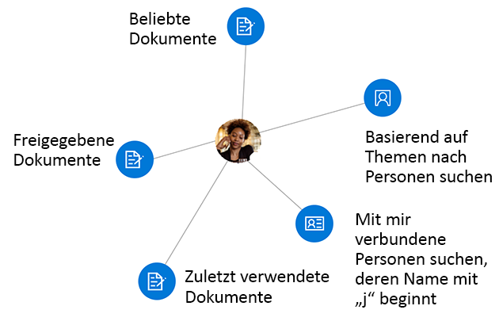
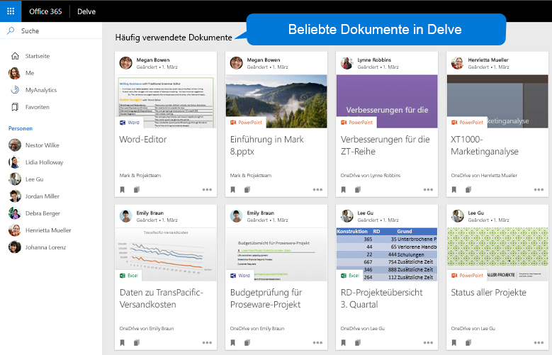
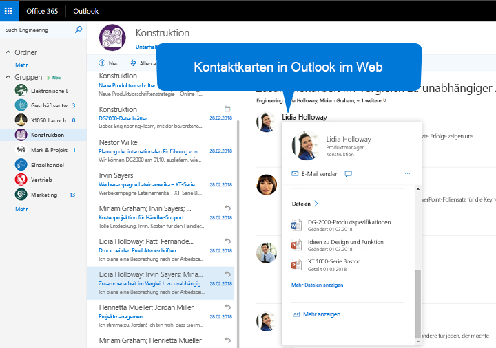

# <a name="overview-of-social-intelligence-and-analytics-in-microsoft-graph"></a><span data-ttu-id="dacd5-106">Übersicht über Informationen aus sozialen Netzwerken und deren Analyse in Microsoft Graph</span><span class="sxs-lookup"><span data-stu-id="dacd5-106">Overview of social intelligence and analytics in Microsoft Graph</span></span>

<span data-ttu-id="dacd5-107">Die mehreren hundert Millionen Benutzer von Microsoft 365-Clouddiensten sind Teil des Herzstücks von Microsoft Graph.</span><span class="sxs-lookup"><span data-stu-id="dacd5-107">The hundreds of millions of users of Microsoft 365 cloud services form part of the core of Microsoft Graph.</span></span> <span data-ttu-id="dacd5-108">Die Daten der Benutzer werden sorgfältig verwaltet, geschützt und mit der entsprechenden Berechtigung durch die Dienste von Microsoft Graph zur Verfügung gestellt, um die Produktivität und Kreativität in Unternehmen zu fördern.</span><span class="sxs-lookup"><span data-stu-id="dacd5-108">The users' data is carefully managed, protected, and with proper authorization, made available by Microsoft Graph services to drive productivity and creativity in businesses.</span></span> <span data-ttu-id="dacd5-109">Benutzerdaten sind in Microsoft Graph zahlreich vorhanden, aber die Daten, die sich aus den sozialen Interaktionen des Benutzers ableiten, sind besonders interessant.</span><span class="sxs-lookup"><span data-stu-id="dacd5-109">As ubiquitous the user's data is in Microsoft Graph, data derived from the user's social interactions is particularly interesting.</span></span> <span data-ttu-id="dacd5-110">Sie bieten intelligente Einblicke, die Antworten auf Fragen wie die folgenden bieten:</span><span class="sxs-lookup"><span data-stu-id="dacd5-110">It provides intelligent insights that can answer questions such as the following:</span></span>

- <span data-ttu-id="dacd5-111">„An wen sollte sich der Benutzer wenden, um Informationen zu diesem Thema zu erhalten?“</span><span class="sxs-lookup"><span data-stu-id="dacd5-111">"Who should this user contact for information on this topic?"</span></span>
- <span data-ttu-id="dacd5-112">„Welche Dokumente sind für diese Person am interessantesten?“</span><span class="sxs-lookup"><span data-stu-id="dacd5-112">"Which documents are most interesting to this person?"</span></span>

<span data-ttu-id="dacd5-113">Sie können die Personen-API und die Einblicke API in Microsoft Graph nutzen, um intelligentere Apps zu erstellen, die auf die für einen Benutzer relevanten Personen bzw. Dokumente zugreifen.</span><span class="sxs-lookup"><span data-stu-id="dacd5-113">You can use the people API and insights API in Microsoft Graph to build smarter apps that can, respectively, access the relevant people and documents for a user.</span></span>

<span data-ttu-id="dacd5-114">Die Personen-API gibt Personen geordnet nach Relevanz für einen Benutzer zurück, basierend auf den Kontakten, sozialen Netzwerken, dem Organisationsverzeichnis und den letzten Kommunikationen per E-Mail und Skype des Benutzers.</span><span class="sxs-lookup"><span data-stu-id="dacd5-114">The people API returns people ordered by relevance to a user, based on that user's contacts, social networks, organization directory, and recent communications on email and Skype.</span></span> <span data-ttu-id="dacd5-115">Dies ist besonders nützlich, wenn Personen ausgewählt werde müssen.</span><span class="sxs-lookup"><span data-stu-id="dacd5-115">This is particularly useful for people-picking scenarios.</span></span>

<span data-ttu-id="dacd5-116">Die Einblicke-API verwendet erweiterte Analysemethoden und maschinelles Lernen, um dem Benutzer die relevantesten Dateien bereitzustellen, die er für seine tägliche Arbeit benötigt.</span><span class="sxs-lookup"><span data-stu-id="dacd5-116">The insights API uses advanced analytics and machine learning to provide the most relevant files users need throughout their work day.</span></span> <span data-ttu-id="dacd5-117">Die API unterstützt die bekannten Office 365-Oberflächen, einschließlich Office Delve, die SharePoint-Startseite, die Discover-Ansicht in OneDrive for Business und Outlook im Web.</span><span class="sxs-lookup"><span data-stu-id="dacd5-117">The API powers familiar Office 365 experiences, including Office Delve, SharePoint Home, the Discover view in OneDrive for Business, and Outlook on the web.</span></span>



## <a name="why-integrate-with-people-data"></a><span data-ttu-id="dacd5-119">Vorteile der Integration mit Personendaten</span><span class="sxs-lookup"><span data-stu-id="dacd5-119">Why integrate with people data?</span></span>

<span data-ttu-id="dacd5-120">Die Personen-API gibt Daten einer einzelnen Entität zurück: [person](/graph/api/resources/person?view=graph-rest-1.0). Diese enthält die für die heute Geschäftsumgebung typischen Daten einer Einzelperson.</span><span class="sxs-lookup"><span data-stu-id="dacd5-120">The people API returns data of a single entity, [person](/graph/api/resources/person?view=graph-rest-1.0), which includes typical data of an individual in today's business world.</span></span> <span data-ttu-id="dacd5-121">Diese **Personendaten** werden aufgrund ihrer _Relevanz_ in Bezug auf einen Microsoft Graph-Benutzer erst besonders nützlich.</span><span class="sxs-lookup"><span data-stu-id="dacd5-121">What makes this **person** data especially useful is its _relevance_ with respect to a Microsoft Graph user.</span></span> <span data-ttu-id="dacd5-122">Die Relevanz wird durch eine Relevanzbewertung für jede Person ausgedrückt. Diese wird auf Grundlage der Kommunikations- und Zusammenarbeitsmuster sowie der Geschäftsbeziehungen des Benutzers berechnet.</span><span class="sxs-lookup"><span data-stu-id="dacd5-122">Relevance is noted in a relevance score of each person, calculated based on the user's communication and collaboration patterns and business relationships.</span></span> <span data-ttu-id="dacd5-123">Für diese _Relevanzdaten_ gibt es drei wichtige Arten der Anwendung.</span><span class="sxs-lookup"><span data-stu-id="dacd5-123">There are 3 main types of application of this _relevance_ data.</span></span>

### <a name="browse-people-by-relevance"></a><span data-ttu-id="dacd5-124">Suchen von Personen nach Relevanz</span><span class="sxs-lookup"><span data-stu-id="dacd5-124">Browse people by relevance</span></span>

<span data-ttu-id="dacd5-125">Sie können Personen durchsuchen, die mit dem angemeldeten Benutzer oder einem anderem Benutzer im Unternehmen des angemeldeten Benutzers in Beziehung stehen, vorausgesetzt, Sie verfügen über die entsprechende [Autorisierung](people-example.md#authorization).</span><span class="sxs-lookup"><span data-stu-id="dacd5-125">You can browse people who are related to the signed-in user or to some other user in the signed-in user's organization, provided you have got the appropriate [authorization](people-example.md#authorization).</span></span> <span data-ttu-id="dacd5-126">Sie erhalten eine Sammlung von **person**-Objekten, die nach Relevanz geordnet ist.</span><span class="sxs-lookup"><span data-stu-id="dacd5-126">You get a collection of **person** objects that are ordered by relevance.</span></span> <span data-ttu-id="dacd5-127">Sie können die Sammlung der **person**-Objekte, die in der Antwort zurückgegeben wird, indem Sie die Abfrageparameter `top`, `skip`, `orderby`, `select` und `filter` angeben, noch weiter [anpassen](people-example.md#browse-people).</span><span class="sxs-lookup"><span data-stu-id="dacd5-127">You can further [customize](people-example.md#browse-people) the collection of **person** objects that is returned in the response by specifying the query parameters `top`, `skip`, `orderby`, `select`, and `filter`.</span></span>

### <a name="fuzzy-searches-based-on-people-criteria"></a><span data-ttu-id="dacd5-128">Fuzzysuche basierend auf Personenkriterien</span><span class="sxs-lookup"><span data-stu-id="dacd5-128">Fuzzy searches based on people criteria</span></span>

<span data-ttu-id="dacd5-129">Mit der Personen-API können Sie nach Personen suchen, die für den angemeldeten Benutzer relevant sind, vorausgesetzt, dass Ihre App die Berechtigung durch diesen Benutzer erhalten hat.</span><span class="sxs-lookup"><span data-stu-id="dacd5-129">The people API lets you search for people relevant to the signed-in user, provided that your app has got permissions by that user.</span></span> <span data-ttu-id="dacd5-130">(Erfahren Sie mehr über [Personenberechtigungen](permissions-reference.md#people-permissions).)</span><span class="sxs-lookup"><span data-stu-id="dacd5-130">(Read more on [people permissions](permissions-reference.md#people-permissions).)</span></span>

<span data-ttu-id="dacd5-131">Fuzzysuchen geben Ergebnisse basierend auf einer genauen Übereinstimmung sowie auf Ableitungen zur Absicht der Suche zurück.</span><span class="sxs-lookup"><span data-stu-id="dacd5-131">Fuzzy searches return results based on an exact match and also on inferences about the intent of the search.</span></span> <span data-ttu-id="dacd5-132">Zur Veranschaulichung gibt das folgende Beispiel **person**-Objekte zurück, die für den angemeldeten Benutzer relevant sind, dessen Name _oder E-Mail-Adresse_ ein Wort enthält, das mit „j“ beginnt.</span><span class="sxs-lookup"><span data-stu-id="dacd5-132">To illustrate this, the following example returns **person** objects relevant to the signed-in user whose name, _or email address_, contains a word that starts with 'j'.</span></span>

<!-- { "blockType": "ignored" } -->
```http
GET /me/people/?$search=j
```

### <a name="fuzzy-searches-based-on-topic-criteria"></a><span data-ttu-id="dacd5-133">Fuzzysuche basierend auf Themenkriterien</span><span class="sxs-lookup"><span data-stu-id="dacd5-133">Fuzzy searches based on topic criteria</span></span>

<span data-ttu-id="dacd5-134">Mit der Personen-API können Sie Suchvorgänge nach Personen durchführen, die für den angemeldeten Benutzer relevant sind und Interesse an der Kommunikation mit dem Benutzer über bestimmte „Themen“ gezeigt haben.</span><span class="sxs-lookup"><span data-stu-id="dacd5-134">The people API also lets you perform searches for people who are relevant to the signed-in user, and have expressed an interest in communicating with that user over certain "topics".</span></span> <span data-ttu-id="dacd5-135">„Themen“ in diesem Sinne sind einfach Wörter, die in der E-Mail-Kommunikation von den Benutzern am häufigsten verwendet wurden.</span><span class="sxs-lookup"><span data-stu-id="dacd5-135">Topics are just words that have been used most by users in email conversations.</span></span> <span data-ttu-id="dacd5-136">Microsoft extrahiert diese Wörter und erstellt ohne deren Kontext einen Index für diese Daten, um die Fuzzysuche zu erleichtern.</span><span class="sxs-lookup"><span data-stu-id="dacd5-136">Microsoft extracts such words, free of their contexts, and creates an index for this data to facilitate fuzzy searches.</span></span>

<span data-ttu-id="dacd5-137">Das folgende Beispiel veranschaulicht die Rückschlüsse über den Zweck der Suche zum englischen Begriff „Beetle“:</span><span class="sxs-lookup"><span data-stu-id="dacd5-137">The following example illustrates inferences about the intent of a search on the topic "beetle":</span></span>

<!-- { "blockType": "ignored" } -->
```http
GET /me/people/?$search="topic:beetle" 
```

<span data-ttu-id="dacd5-138">Eine Fuzzysuche im Index der Themendaten gibt Instanzen zurück, die sich auf das Insekt beziehen (zu Deutsch „Käfer“), auf den Volkswagen-Käfer (englisch „Beetle“), auf die Musikgruppe „Beatles“ und andere Definitionen.</span><span class="sxs-lookup"><span data-stu-id="dacd5-138">A fuzzy search in the topic data index return instances that mean the beetle insect, the iconic Volkswagen Beetle car, the Beatles band, and other definitions.</span></span>


## <a name="why-integrate-with-document-based-insights-preview"></a><span data-ttu-id="dacd5-139">Vorteile von dokumentbasierten Einblicken (Vorschau)</span><span class="sxs-lookup"><span data-stu-id="dacd5-139">Why integrate with document-based insights (preview)?</span></span>

### <a name="use-intelligence-to-improve-collaboration"></a><span data-ttu-id="dacd5-140">Nutzen von Informationen zur Verbesserung der Zusammenarbeit</span><span class="sxs-lookup"><span data-stu-id="dacd5-140">Use intelligence to improve collaboration</span></span>

<span data-ttu-id="dacd5-141">An einem typischen Arbeitstag verwenden Benutzer häufig große Mengen an Informationen, die in verschiedenen Dokumenten gespeichert sind, und arbeiten auf verschiedene Weise mit anderen Personen zusammen.</span><span class="sxs-lookup"><span data-stu-id="dacd5-141">During a typical work day, users often interact with large amounts of information stored across many documents and collaborate with other users in many different ways.</span></span> <span data-ttu-id="dacd5-142">Es ist wichtig, dass die Benutzer immer die richtigen Informationen zum richtigen Zeitpunkt finden können.</span><span class="sxs-lookup"><span data-stu-id="dacd5-142">It's important that they can always can find what they need, when they need it.</span></span>

<span data-ttu-id="dacd5-143">Sie können die Einblicke-API verwenden, die APIs für [trending](/graph/api/resources/insights-trending?view=graph-rest-beta), [shared](/graph/api/resources/insights-shared?view=graph-rest-beta) und [used](/graph/api/resources/insights-used?view=graph-rest-beta) beinhaltet. Hiermit können Sie Dateien aus Office 365 basierend auf dem aktuellen Kontext und den Anforderungen der Benutzer abrufen, sodass die Produktivität der Benutzer gesteigert und die Zusammenarbeit im Unternehmen gefördert wird.</span><span class="sxs-lookup"><span data-stu-id="dacd5-143">You can use the insights API, which includes the [trending](/graph/api/resources/insights-trending?view=graph-rest-beta), [shared](/graph/api/resources/insights-shared?view=graph-rest-beta), and [used](/graph/api/resources/insights-used?view=graph-rest-beta) APIs, to surface files from across Office 365 based on your users' current context and needs, making users more productive and improving collaboration in your organization.</span></span>

<span data-ttu-id="dacd5-144">Sie können die Ergebnisse der Einblicke-API auf einfache Weise in der App darstellen.</span><span class="sxs-lookup"><span data-stu-id="dacd5-144">It is easy to render the results from the insights API in your app.</span></span> <span data-ttu-id="dacd5-145">Jedes Ergebnis bietet eine Reihe von allgemeinen Visualisierungseigenschaften, wie z. B. eine Vorschaubild-URL oder Vorschautext.</span><span class="sxs-lookup"><span data-stu-id="dacd5-145">Every result comes with a set of common visualization properties, like a preview image URL or preview text.</span></span>

### <a name="make-relevant-content-visible"></a><span data-ttu-id="dacd5-146">Sichtbarmachen relevanter Inhalte</span><span class="sxs-lookup"><span data-stu-id="dacd5-146">Make relevant content visible</span></span>

<span data-ttu-id="dacd5-147">In Office 365 verwendet Delve den _trending_-Einblick, um Benutzer dabei zu unterstützen, die Dokumente zu finden, die für sie gerade von besonderem Interesse sind.</span><span class="sxs-lookup"><span data-stu-id="dacd5-147">In Office 365, Delve uses the _trending_ insight to help users discover the documents that are most interesting to them right now.</span></span> <span data-ttu-id="dacd5-148">Siehe Abbildung 1.</span><span class="sxs-lookup"><span data-stu-id="dacd5-148">See figure 1.</span></span>

<span data-ttu-id="dacd5-149">Sie können die [trending](/graph/api/resources/insights-trending?view=graph-rest-beta)-Entität programmgesteuert in der Einblicke-API verwenden, um den Kunden Ihrer App eine ähnliche Oberfläche bereitzustellen.</span><span class="sxs-lookup"><span data-stu-id="dacd5-149">Programmatically, you can use the [trending](/graph/api/resources/insights-trending?view=graph-rest-beta) entity in the insights API to provide your app customers a similar experience.</span></span> <span data-ttu-id="dacd5-150">Verwenden Sie die **trending**-Entität, um eine Verbindung zu Dokumenten herzustellen, die für den Benutzer einen Trend darstellen und relevant sind.</span><span class="sxs-lookup"><span data-stu-id="dacd5-150">Use the **trending** entity to connect to documents that are trending around and relevant to the user.</span></span> <span data-ttu-id="dacd5-151">Beim [Auflisten von Trenddokumenten](/graph/api/insights-list-trending?view=graph-rest-beta) werden die Dateien zurückgegeben, die in OneDrive oder auf SharePoint-Teamwebsites gespeichert sind, und zwar sortiert nach Relevanz mit den wichtigsten am Anfang.</span><span class="sxs-lookup"><span data-stu-id="dacd5-151">[Listing trending documents](/graph/api/insights-list-trending?view=graph-rest-beta) returns those files stored on OneDrive or SharePoint team sites, sorted by relevance with the most important ones first.</span></span> 

<span data-ttu-id="dacd5-152">**Abbildung 1: Delve in Office 365 zeigt häufig verwendete Dokumente für einen Benutzer an**</span><span class="sxs-lookup"><span data-stu-id="dacd5-152">**Figure 1. Delve in Office 365 showing popular documents for a user**</span></span>



### <a name="allow-users-to-collaborate-and-get-back-to-work"></a><span data-ttu-id="dacd5-154">Bessere Zusammenarbeit der Benutzer und Erledigung der eigentlichen Arbeit</span><span class="sxs-lookup"><span data-stu-id="dacd5-154">Allow users to collaborate and get back to work</span></span>

<span data-ttu-id="dacd5-155">Die neuen Personenkarten in Office 365 nutzen die _Verwendet_- und _Freigegeben_-Einblicke, um Personen und Wissen miteinander zu verbinden.</span><span class="sxs-lookup"><span data-stu-id="dacd5-155">The new Office 365 people cards tap into the _used_ and _shared_ insights to connect the dots between people and units of knowledge.</span></span> <span data-ttu-id="dacd5-156">Die Personenkarte identifiziert relevante Dokumente zu einer Person und zeigt sie anzeigt.</span><span class="sxs-lookup"><span data-stu-id="dacd5-156">The people card identifies and displays relevant documents about a person.</span></span> <span data-ttu-id="dacd5-157">Benutzer können Personenkarten überall in der Produktsuite sehen, wie z. B. in Outlook im Web.</span><span class="sxs-lookup"><span data-stu-id="dacd5-157">Users can see people cards across the suite, for example, in Outlook on the web.</span></span> <span data-ttu-id="dacd5-158">Siehe Abbildung 2.</span><span class="sxs-lookup"><span data-stu-id="dacd5-158">See figure 2.</span></span>

<span data-ttu-id="dacd5-159">Die Einblicke-API bietet mit den Entitäten [used](/graph/api/resources/insights-used?view=graph-rest-beta) und [shared](/graph/api/resources/insights-shared?view=graph-rest-beta) ähnliche Funktionen.</span><span class="sxs-lookup"><span data-stu-id="dacd5-159">The insights API provides a similar functionality with the [used](/graph/api/resources/insights-used?view=graph-rest-beta) and [shared](/graph/api/resources/insights-shared?view=graph-rest-beta) entities.</span></span> <span data-ttu-id="dacd5-160">Sie geben zurück, was sich ein Benutzer angesehen oder woran er gearbeitet hat, oder was Kollegen mit dem Benutzer zuletzt in Office 365 geteilt haben.</span><span class="sxs-lookup"><span data-stu-id="dacd5-160">They return what a user has been viewing or working on most recently, or what colleagues have shared with the user most recently in Office 365.</span></span>

<span data-ttu-id="dacd5-161">**Abbildung 2: Outlook im Web mit einer Personenkarte fpr einen Benutzer**</span><span class="sxs-lookup"><span data-stu-id="dacd5-161">**Figure 2. Outlook on the web showing a people card for a user**</span></span>



## <a name="api-reference"></a><span data-ttu-id="dacd5-163">API-Referenz</span><span class="sxs-lookup"><span data-stu-id="dacd5-163">API reference</span></span>
<span data-ttu-id="dacd5-164">Suchen Sie die API-Referenz für diesen Dienst?</span><span class="sxs-lookup"><span data-stu-id="dacd5-164">Looking for the API reference for these services?</span></span>

- [<span data-ttu-id="dacd5-165">Personen-API in Microsoft Graph v1.0</span><span class="sxs-lookup"><span data-stu-id="dacd5-165">People API in Microsoft Graph v1.0</span></span>](/graph/api/resources/social-overview?view=graph-rest-1.0)
- [<span data-ttu-id="dacd5-166">API für Informationen aus sozialen Netzwerken und deren Analyse in Microsoft Graph Beta</span><span class="sxs-lookup"><span data-stu-id="dacd5-166">API for social intelligence and analytics in Microsoft Graph beta</span></span>](/graph/api/resources/social-overview?view=graph-rest-beta)

## <a name="next-steps"></a><span data-ttu-id="dacd5-167">Nächste Schritte</span><span class="sxs-lookup"><span data-stu-id="dacd5-167">Next steps</span></span>

* <span data-ttu-id="dacd5-168">Verwenden Sie den [Graph-Tester](https://developer.microsoft.com/graph/graph-explorer), um den Personen- und Einblicke APIs mit Ihren eigenen Dateien zu testen.</span><span class="sxs-lookup"><span data-stu-id="dacd5-168">Use the [Graph Explorer](https://developer.microsoft.com/graph/graph-explorer) to try out the people and insight APIs with your own files.</span></span> <span data-ttu-id="dacd5-169">Melden Sie sich an und wählen Sie in der linken Spalte **Mehr Beispiele anzeigen**.</span><span class="sxs-lookup"><span data-stu-id="dacd5-169">Sign in, and choose **Show more samples** in the column on the left.</span></span> <span data-ttu-id="dacd5-170">Aktivieren Sie mithilfe des Menüs **Personen** und **Einblicke (Beta)**.</span><span class="sxs-lookup"><span data-stu-id="dacd5-170">Use the menu to turn on **People** and **Insights (beta)**.</span></span>
* <span data-ttu-id="dacd5-171">Weitere Informationen zur [Personen-API](people-example.md) und zur [person](/graph/api/resources/person?view=graph-rest-1.0)-Entität.</span><span class="sxs-lookup"><span data-stu-id="dacd5-171">Find more about the [people API](people-example.md) and the [person](/graph/api/resources/person?view=graph-rest-1.0) entity.</span></span>
* <span data-ttu-id="dacd5-172">Erste Schritte mit der Einblicke-API finden Sie unter [Verwenden der Einblicke-API](/graph/api/resources/insights?view=graph-rest-beta).</span><span class="sxs-lookup"><span data-stu-id="dacd5-172">To get started with insights API, see [Use the insights API](/graph/api/resources/insights?view=graph-rest-beta).</span></span>
