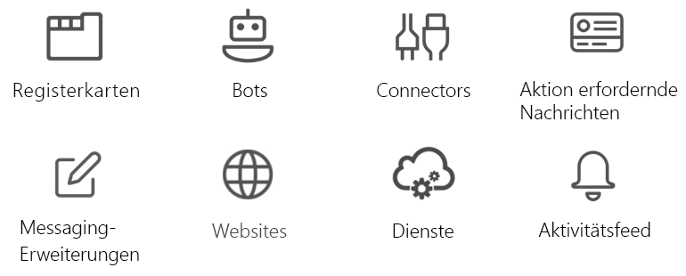

# Microsoft Teams-API (Übersicht) (Vorschau)Microsoft Teams teamwork API overview

Microsoft Teams ist der ultimative Hub für Zusammenarbeit und intelligente Kommunikation.Microsoft Teams is the ultimate hub for teamwork and intelligent communications. Microsoft Teams, das auf den Stärken und der Größe von Office 365 aufbaut, bietet mit mehr als 120 Millionen von Benutzern chatbasierte Funktionen für Zusammenarbeit, Besprechungen, Anrufe sowie Enterprise-VoIP-Funktionen.Built on the strength and scale of Office 365 with over 120 million users, Microsoft Teams delivers chat-based collaboration, meetings, calling, and enterprise voice features.

## Gründe für die Integration in Microsoft TeamsWhy integrate with Microsoft Teams?

Dank der Integration in Microsoft Teams wird das Erstellen ihrer eigenen Dienste und Apps erleichtert. Außerdem können Sie Millionen von Unternehmenskunden erreichen und Menschen helfen, ihre Arbeit zusammen zu bewältigen.Integrating with Microsoft Teams makes it easy for you to build your own services and apps, reaching millions of enterprise users and helping people get work done together. Sie können Microsoft Graph verwenden, um Teams, Kanäle, Nachrichten usw. zu erstellen und zu verwalten.You can use Microsoft Graph to create and manage teams, channels, messages, and more.

### Verwenden von Microsoft Graph in jeder Art von AppUse Microsoft Graph in any kind of app

Microsoft Teams-Apps, die auf Microsoft Graph basieren, geben Arbeitsgruppen ein neues Tool an die Hand, um die Zusammenarbeit produktiver und interessanter zu gestalten.Microsoft Teams apps built on Microsoft Graph give work groups a new tool to make collaboration a more productive and compelling experience. Mit Microsoft Teams können Arbeitsgruppenbenutzer Ressourcen freigeben, über Chats interagieren und Ereignisse im Teamkalender planen.Using Microsoft Teams, work group users share assets, interact through chat, and schedule events on the team calendar. Steigern Sie den Nutzen von Microsoft Teams, indem Sie Team-, Kanal- und Unterhaltungsautomatisierung über Apps hinzufügen, die auf der Microsoft Teams-API basieren.Enhance the value of Microsoft Teams by adding team, channel, and conversation automation via apps based on the Microsoft Teams API.

Websites, Dienste und systemeigene Plattformanwendungen werden nicht innerhalb der Microsoft Teams-Benutzeroberfläche ausgeführt, können aber verwendet werden, um die Microsoft Teams-APIs aufzurufen, die Microsoft Teams-Automatisierungsszenarien ermöglichen.Websites, services, and native platform applications are not run within the Microsoft Teams user experience but can be used to call the Microsoft Teams APIs that enable Microsoft Teams automation scenarios.

**Typen von Apps, die für Microsoft Teams aktiviert sind****Types of apps enabled for Microsoft Teams**

Diese Zusammenarbeitstools umfassen Microsoft Graph-fähige Registerkarten oder Bot-Apps, die innerhalb von Microsoft Teams ausgeführt werden.These collaboration tools include Microsoft Graph-enabled tab or bot apps running inside Microsoft Teams. Sie können Microsoft Graph auch außerhalb einer Microsoft Teams-App aufrufen, z. B. von einer Website oder einem Webdienst aus.You can also call Microsoft Graph outside of a Microsoft Teams app, such as from a website or a web service. Wenn Sie Ihre Website bereits für Microsoft Graph aktiviert haben, können Sie diese Arbeit für Microsoft Teams verwenden, indem Sie die [Microsoft Teams-Entwicklerplattform](https://docs.microsoft.com/en-us/microsoftteams/platform/#pivot=home&panel=home-all) verwenden, um eine Registerkarten-App zu erstellen, die den vorhandenen Websitecode verwendet.If you've already enabled your website for Microsoft Graph, you can use that work for Microsoft Teams by using the [Microsoft Teams developer platform](https://docs.microsoft.com/en-us/microsoftteams/platform/#pivot=home&panel=home-all) to create a tab app that uses the existing website code.

Wenn eine Microsoft Teams-Registerkarte oder Bot-App nicht ideal für Ihr Szenario ist, wählen Sie einen der folgenden App-Typen aus.If a Microsoft Teams tab or bot app is not the ideal way to complete your scenario, choose one of the following app types.

|App-TypApp type|SzenariobeschreibungScenario description|
|:-------|:-------------------|
|RegisterkartenTabs|Inhalte mit verbesserter Anzeige in Microsoft Teams.Surface enhanced content within Microsoft Teams.|
|ConnectorsConnectors|Für Posts optimierte Updates für Kanäle.Post enhanced updates to channels.|
|Aktionen fordernde NachrichtenActionable messaging|Fügen Sie Ihren Connector-Karten verbesserte Interaktion hinzu.Add enhanced interaction to your connector cards.|
|WebseitenWebsites|Inhalte mit verbesserter Anzeige in Ihren Webseiten.Surface enhanced content in your web pages.|
|BotsBots|Helfen Sie Benutzern, Aufgaben in Unterhaltungen zu erledigen.Help users get tasks done in conversations.|
|AktivitätsfeedActivity feed|Benutzer über Feed-Benachrichtigungen einbeziehen.Engage users via feed notifications.|
|Messaging-ErweiterungenMessaging extensions|Zulassen, dass Benutzer erweiterte Karten in Unterhaltungen abfragen und freigeben.Allow users to query and share enhanced cards in conversations.|
|DiensteServices|Verbessern Sie Ihre Clientanwendungen mit Microsoft Graph-Daten über Ihren Webdienst.Enhance your client applications with Microsoft Graph data via your web service.|

### Erstellen mehrerer Teams und KanäleCreate multiple teams and channels

Geben Sie Ihren Kunden die Möglichkeit, neue [Teams](../api-reference/beta/resources/team.md) und [Kanäle](../api-reference/beta/resources/channel.md) zu erstellen, die mit Ihrer App verknüpft sind.Allow your customers to create new [teams](../api-reference/beta/resources/team.md) and [channels](../api-reference/beta/resources/channel.md) linked to your app. Vereinfachen Sie das Erstellen einer großen Anzahl von Teams und das Auffüllen dieser Teams mit Benutzern und Kanälen, indem Sie die Microsoft Teams-API verwenden.Make creating large numbers of teams and populating them with users and channels easy by using the Microsoft Teams API.

### Automatisieren von TeamlebenszyklenAutomate team lifecycles

Verwenden Sie Microsoft Graph, um ein neues virtuelles Team zu erstellen, wenn sich ein neues Unternehmensproblem ergibt, [füllen Sie das Team](../api-reference/v1.0/api/group_post_members.md) mit den richtigen Personen, und konfigurieren Sie das Team mit Kanälen.Use Microsoft Graph to create a new virtual team when a new business issue arises, [populate the team](../api-reference/v1.0/api/group_post_members.md) with the right people, and configure the team with channels. Um eine Teamkanalbesprechung zu dem neuen Unternehmensproblem zu starten, können Sie den Kanal mit einem neuen Unterhaltungsthread anlegen, um eine Willkommensnachricht für neue Teammitglieder zu veröffentlichen.To start a team channel discussion around the new business issue, you can seed the channel with a new conversation thread to post a welcome message to new team members. Wenn Sie das neue Team zusammenbringen möchten, um das Unternehmensproblem zu besprechen, fügen Sie dem Teamkalender ein neues Ereignis hinzu, und laden Sie dann die Teammitglieder zu dem Ereignis ein.If you want to get the new team together to discuss the business issue, add a new event to the team calendar and then invite the members of the team to the event.

Wenn das Unternehmensproblem gelöst wurde und Sie das virtuelle Team nicht mehr benötigen, verwenden Sie die Microsoft Teams-API, um das Team aufzulösen.When the business issue is resolved and you no longer need the virtual team, use the Microsoft Teams API to tear down the team. Wenn Sie die maximale Dauer des virtuellen Teams bei der Erstellung kennen, legen Sie eine [Ablaufrichtlinie für die Office 365-Gruppe](https://support.office.com/en-us/article/office-365-group-expiration-policy-8d253fe5-0e09-4b3c-8b5e-f48def064733?ui=en-US&rs=en-US&ad=US) für das Team fest, durch die das Team gemäß der Richtlinie automatisch entfernt wird.If you know the maximum duration of the virtual team when you create it, set an [Office 365 group expiration policy](https://support.office.com/en-us/article/office-365-group-expiration-policy-8d253fe5-0e09-4b3c-8b5e-f48def064733?ui=en-US&rs=en-US&ad=US) for the team that automatically removes the team according to the policy.

## Nächste SchritteNext steps

- Erfahren Sie, wie Sie [die Microsoft Teams-API verwenden](../api-reference/beta/resources/teams_api_overview.md).Learn how to [use the Microsoft Teams API](../api-reference/beta/resources/teams_api_overview.md).
- Führen Sie einen Drilldown für die Methoden, Eigenschaften und Beziehungen der Ressourcen [team](../api-reference/beta/resources/team.md), [channel](../api-reference/beta/resources/channel.md) und [group](../api-reference/v1.0/resources/group.md) aus.Drill down on the methods, properties, and relationships of the [team](../api-reference/beta/resources/team.md), [channel](../api-reference/beta/resources/channel.md), and [group](../api-reference/v1.0/resources/group.md) resources.
- Probieren Sie die API im [Graph-Tester](https://developer.microsoft.com/en-us/graph/graph-explorer) aus.Try the API in the [Graph Explorer](https://developer.microsoft.com/en-us/graph/graph-explorer).
- Erfahren Sie mehr über das [Microsoft Teams-Programmiermodell](https://docs.microsoft.com/en-us/microsoftteams/platform/concepts/concepts-overview).Read more about the [Microsoft Teams programming model](https://docs.microsoft.com/en-us/microsoftteams/platform/concepts/concepts-overview).
- Schnelleinstieg mit [Beispielcode](https://github.com/OfficeDev/microsoft-teams-sample-graph).Get a jump-start with [sample code](https://github.com/OfficeDev/microsoft-teams-sample-graph).
