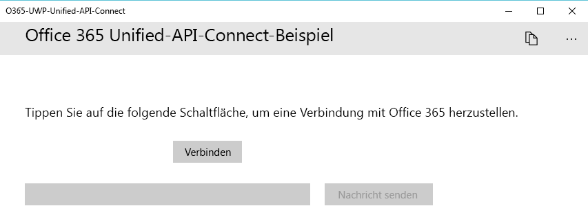
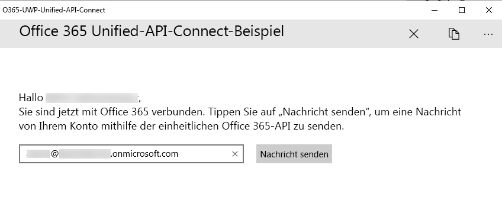

# <a name="get-started-with-microsoft-graph-in-a-universal-windows-10-app"></a>Erste Schritte mit Microsoft Graph in einer universellen Windows 10-App

> **Sie erstellen Apps für Unternehmenskunden?** Ihre App funktioniert möglicherweise nicht, wenn Ihr Unternehmenskunde Enterprise Mobility-Sicherheitsfunktionen wie <a href="https://azure.microsoft.com/en-us/documentation/articles/active-directory-conditional-access-device-policies/" target="_newtab">bedingten Gerätezugriff</a> aktiviert. In diesem Fall treten bei Ihren Kunden möglicherweise Fehler auf. 

> Zur Unterstützung **aller Unternehmenskunden** über **alle Unternehmensszenarien** hinweg müssen Sie den Azure AD-Endpunkt verwenden und Ihre Apps mithilfe des [Azure-Portals](https://aka.ms/aadapplist) verwalten. Weitere Informationen finden Sie unter [Entscheiden zwischen dem Azure AD- und dem Azure AD v2.0-Endpunkt](../concepts/auth_overview.md#deciding-between-the-azure-ad-and-azure-ad-v20-endpoints).

Dieser Artikel beschreibt die erforderlichen Aufgaben zum Abrufen eines Zugriffstokens vom [Azure AD v2.0-Endpunkt](https://developer.microsoft.com/de-DE/graph/docs/concepts/converged_auth) und zum Aufrufen von Microsoft Graph. Er führt Sie schrittweise durch den Code im [Microsoft Graph Connect-Beispiel für UWP (Bibliothek)](https://github.com/microsoftgraph/uwp-csharp-connect-sample) und erläutert die wichtigsten Konzepte, die in eine App implementiert werden müssen, die Microsoft Graph verwendet.

**Sie möchten keine App erstellen?** Verwenden Sie für einen schnellen Einstieg den [Microsoft Graph-Schnellstart](https://developer.microsoft.com/graph/quick-start), oder laden Sie das [Microsoft Graph Connect-Beispiel für UWP (Bibliothek)](https://github.com/microsoftgraph/uwp-csharp-connect-sample) herunter, auf dem dieser Artikel basiert. Beachten Sie auch, dass es eine [REST-Version dieses Beispiels](https://github.com/microsoftgraph/uwp-csharp-connect-rest-sample) gibt.

## <a name="sample-user-interface"></a>Beispielbenutzeroberfläche

Das Beispiel enthält eine sehr einfache Benutzeroberfläche, die aus einer oberen Befehlsleiste, einer **Schaltfläche zum Herstellen einer Verbindung**, einer Schaltfläche zum **Senden von E-Mails** und aus einem Textfeld besteht, in das die E-Mail-Adresse des angemeldeten Benutzers automatisch eingetragen wird, die jedoch bearbeitet werden kann.

Die Schaltfläche zum **Senden von E-Mails** ist deaktiviert, wenn der Benutzer keine Verbindung hergestellt hat:



Die obere Befehlsleiste enthält eine Schaltfläche zum Trennen der Verbindung, wenn der Benutzer eine Verbindung hergestellt hat:



Die gesamten Zeichenfolgen der Beispielbenutzeroberfläche werden in der Datei „Resources.resw“ innerhalb des Objektordners gespeichert.

## <a name="prerequisites"></a>Voraussetzungen

Für die ersten Schritte benötigen Sie: 

- Ein [Microsoft-Konto](https://www.outlook.com/) oder ein [Geschäfts-, Schul- oder Unikonto](http://dev.office.com/devprogram)
- Visual Studio 2017 
- Das [Microsoft Graph-Startprojekt für UWP (Bibliothek)](https://github.com/microsoftgraph/uwp-csharp-connect-sample/tree/master/starter). Beide Vorlagen enthalten leere Klassen, denen Sie Code hinzufügen müssen. Außerdem enthalten sie Ressourcenzeichenfolgen. Um dieses Projekt abzurufen, müssen Sie das [Microsoft Graph Connect-Beispiel für UWP (Bibliothek)](https://github.com/microsoftgraph/uwp-csharp-connect-sample) klonen oder herunterladen und dann die Projektmappe im Ordner **starter** öffnen.


## <a name="register-the-app"></a>Registrieren der App
 
1. Melden Sie sich beim [App-Registrierungsportal](https://apps.dev.microsoft.com/) entweder mit Ihrem persönlichen oder geschäftlichen Konto oder mit Ihrem Schulkonto an.
2. Klicken Sie auf **App hinzufügen**.
3. Geben Sie einen Namen für die App ein, und wählen Sie **Anwendung erstellen** aus.
    
    Die Registrierungsseite wird angezeigt, und die Eigenschaften der App werden aufgeführt.
 
4. Wählen Sie unter **Plattformen** die Option **Plattform hinzufügen** aus.
5. Wählen Sie **Systemeigene Anwendung**.
6. Kopieren Sie die Werte für die Client-ID (App-ID) und den Umleitungs-URI in die Zwischenablage. Sie müssen diese Werte in die Beispiel-App eingeben.

    Die App-ID ist ein eindeutiger Bezeichner für Ihre App. Der Umleitungs-URI ist ein eindeutiger, von Windows 10 für jede Anwendung bereitgestellter URI, der sicherstellt, dass an diesen URI gesendete Nachrichten nur an diese Anwendung gesendet werden. 

7. Klicken Sie auf **Speichern**.

## <a name="configure-the-project"></a>Konfigurieren des Projekts

1. Öffnen Sie die Projektmappendatei für das Startprojekt in Visual Studio.
2. Öffnen Sie die Datei **App.xaml** des Projekts, und suchen Sie den Knoten `Application.Resources`. Ersetzen Sie die Platzhalter der Anwendungs-ID und des Umleitungs-URI durch die entsprechenden Werte der App, die Sie registriert haben.


```xml
    <Application.Resources>
        <!-- Add your Client Id here. -->
        <x:String x:Key="ida:ClientID">ENTER_YOUR_CLIENT_ID</x:String>
        <!-- Add your Redirect URI here. -->
        <x:String x:Key="ida:ReturnUrl">ENTER_YOUR_REDIRECT_URI</x:String>
    </Application.Resources>
```

## <a name="send-an-email-with-microsoft-graph"></a>Senden einer E-Mail mit Microsoft Graph

Öffnen Sie die Datei MailHelper.cs in Ihrem Startprojekt. Diese Datei enthält den Code, durch den eine E-Mail erstellt und gesendet wird. Er besteht aus einer einzigen Methode – ``ComposeAndSendMailAsync`` –, die eine POST-Anforderung konstruiert und an den Endpunkt **https://graph.microsoft.com/v1.0/me/microsoft.graph.SendMail** sendet. 

Die ``ComposeAndSendMailAsync``-Methode verwendet die drei Zeichenfolgenwerte ``subject``, ``bodyContent`` und ``recipients``, die von der Datei „MainPage.xaml.cs“ an sie übergeben werden. Die Zeichenfolgen ``subject`` und ``bodyContent`` werden zusammen mit allen anderen Benutzeroberflächenzeichenfolgen in der Datei „Resources.resw“ gespeichert. Die Zeichenfolge ``recipients`` stammt aus dem Adressfeld in der App-Schnittstelle. 

Die erste Aufgabe innerhalb der Methode ``ComposeAndSendMailAsync`` besteht darin, das Foto des aktuellen Benutzers aus Microsoft Graph abzurufen. Diese Zeile ruft die Methode `GetCurrentUserPhotoStreamAsync` auf:

```
            // Get current user photo
            Stream photoStream = await GetCurrentUserPhotoStreamAsync();
```

Die vollständige Methode `GetCurrentUserPhotoStreamAsync` sieht wie folgt aus:

```
        // Gets the stream content of the signed-in user's photo. 
        // This snippet doesn't work with consumer accounts.
        public async Task<Stream> GetCurrentUserPhotoStreamAsync()
        {
            Stream currentUserPhotoStream = null;

            try
            {
                var graphClient = AuthenticationHelper.GetAuthenticatedClient();
                currentUserPhotoStream = await graphClient.Me.Photo.Content.Request().GetAsync();

            }

            // If the user account is MSA (not work or school), the service will throw an exception.
            catch (ServiceException)
            {
                return null;
            }

            return currentUserPhotoStream;

        }
```

Wenn der Benutzer kein Foto hat, wird mit dieser Logik eine andere Bilddatei abgerufen, die in das Projekt eingeschlossen wurde:

```
            // If the user doesn't have a photo, or if the user account is MSA, we use a default photo

            if (photoStream == null)
            {
                StorageFile file = await Windows.ApplicationModel.Package.Current.InstalledLocation.GetFileAsync("test.jpg");
                photoStream = (await file.OpenReadAsync()).AsStreamForRead();
            }
```

Nachdem nun ein Bilddatenstrom vorliegt, kann die Datei in OneDrive hochgeladen werden, indem die Methode `UploadFileToOneDriveAsync` aufgerufen wird:

```
            MemoryStream photoStreamMS = new MemoryStream();
            // Copy stream to MemoryStream object so that it can be converted to byte array.
            photoStream.CopyTo(photoStreamMS);

            DriveItem photoFile = await UploadFileToOneDriveAsync(photoStreamMS.ToArray());
```

Die vollständige Methode `UploadFileToOneDriveAsync` sieht wie folgt aus:

```
        // Uploads the specified file to the user's root OneDrive directory.
        public async Task<DriveItem> UploadFileToOneDriveAsync(byte[] file)
        {
            DriveItem uploadedFile = null;

            try
            {
                var graphClient = AuthenticationHelper.GetAuthenticatedClient();
                MemoryStream fileStream = new MemoryStream(file);
                uploadedFile = await graphClient.Me.Drive.Root.ItemWithPath("me.png").Content.Request().PutAsync<DriveItem>(fileStream);

            }


            catch (ServiceException)
            {
                return null;
            }

            return uploadedFile;
        }
```

Dieser Datenstrom kann auch zum Erstellen eines `MessageAttachmentsCollectionPage`-Objekts verwendet werden, das zusammen mit der Nachricht übergeben werden kann:

```
            MessageAttachmentsCollectionPage attachments = new MessageAttachmentsCollectionPage();
            attachments.Add(new FileAttachment
            {
                ODataType = "#microsoft.graph.fileAttachment",
                ContentBytes = photoStreamMS.ToArray(),
                ContentType = "image/png",
                Name = "me.png"
            });
```

Durch Aufruf der Methode `GetSharingLinkAsync` kann ein Freigabelink für die neu hochgeladene OneDrive-Datei abgerufen werden. Die Zeichenfolge `bodyContent` enthält einen Platzhalter für den Freigabelink:

```
            // Get the sharing link and insert it into the message body.
            Permission sharingLink = await GetSharingLinkAsync(photoFile.Id);
            string bodyContentWithSharingLink = String.Format(bodyContent, sharingLink.Link.WebUrl);
```

Die vollständige Methode `GetSharingLinkAsync` sieht wie folgt aus:

```
        public static async Task<Permission> GetSharingLinkAsync(string Id)
        {
            Permission permission = null;

            try
            {
                var graphClient = AuthenticationHelper.GetAuthenticatedClient();
                permission = await graphClient.Me.Drive.Items[Id].CreateLink("view").Request().PostAsync();
            }

            catch (ServiceException)
            {
                return null;
            }

            return permission;
        }
```

Da der Benutzer mehrere Adressen übergeben kann, besteht die nächste Aufgabe darin, die Zeichenfolge ``recipients`` in einen Satz von `EmailAddress`-Objekten zu unterteilen, die dann verwendet werden können, um die Liste der `Recipients`-Objekte zu erstellen, die im POST-Text der Anforderung übergeben werden.

```
            // Prepare the recipient list
            string[] splitter = { ";" };
            var splitRecipientsString = recipients.Split(splitter, StringSplitOptions.RemoveEmptyEntries);
            List<Recipient> recipientList = new List<Recipient>();

            foreach (string recipient in splitRecipientsString)
            {
                recipientList.Add(new Recipient { EmailAddress = new EmailAddress { Address = recipient.Trim() } });
            }
```

Die letzte Aufgabe besteht darin, ein `Message`-Objekt zu erstellen und dieses über den `GraphServiceClient` an den Endpunkt **me/microsoft.graph.SendMail** zu senden. Da die Zeichenfolge ``bodyContent`` ein HTML-Dokument ist, legt die Anforderung den Wert **ContentType** auf HTML fest.

```
            try
            {
                var graphClient = AuthenticationHelper.GetAuthenticatedClient();

                var email = new Message
                {
                    Body = new ItemBody
                    {
                        Content = bodyContentWithSharingLink,
                        ContentType = BodyType.Html,
                    },
                    Subject = subject,
                    ToRecipients = recipientList,
                    Attachments = attachments
                };

                try
                {
                    await graphClient.Me.SendMail(email, true).Request().PostAsync();
                }
                catch (ServiceException exception)
                {
                    throw new Exception("We could not send the message: " + exception.Error == null ? "No error message returned." : exception.Error.Message);
                }


            }

            catch (Exception e)
            {
                throw new Exception("We could not send the message: " + e.Message);
            }
```

Die vollständige Klasse sieht wie folgt aus:

```
    public class MailHelper
    {
        /// <summary>
        /// Compose and send a new email.
        /// </summary>
        /// <param name="subject">The subject line of the email.</param>
        /// <param name="bodyContent">The body of the email.</param>
        /// <param name="recipients">A semicolon-separated list of email addresses.</param>
        /// <returns></returns>
        public async Task ComposeAndSendMailAsync(string subject,
                                                            string bodyContent,
                                                            string recipients)
        {

            // Get current user photo
            Stream photoStream = await GetCurrentUserPhotoStreamAsync();


            // If the user doesn't have a photo, or if the user account is MSA, we use a default photo

            if (photoStream == null)
            {
                StorageFile file = await Windows.ApplicationModel.Package.Current.InstalledLocation.GetFileAsync("test.jpg");
                photoStream = (await file.OpenReadAsync()).AsStreamForRead();
            }

            MemoryStream photoStreamMS = new MemoryStream();
            // Copy stream to MemoryStream object so that it can be converted to byte array.
            photoStream.CopyTo(photoStreamMS);

            DriveItem photoFile = await UploadFileToOneDriveAsync(photoStreamMS.ToArray());

            MessageAttachmentsCollectionPage attachments = new MessageAttachmentsCollectionPage();
            attachments.Add(new FileAttachment
            {
                ODataType = "#microsoft.graph.fileAttachment",
                ContentBytes = photoStreamMS.ToArray(),
                ContentType = "image/png",
                Name = "me.png"
            });

            // Get the sharing link and insert it into the message body.
            Permission sharingLink = await GetSharingLinkAsync(photoFile.Id);
            string bodyContentWithSharingLink = String.Format(bodyContent, sharingLink.Link.WebUrl);

            // Prepare the recipient list
            string[] splitter = { ";" };
            var splitRecipientsString = recipients.Split(splitter, StringSplitOptions.RemoveEmptyEntries);
            List<Recipient> recipientList = new List<Recipient>();

            foreach (string recipient in splitRecipientsString)
            {
                recipientList.Add(new Recipient { EmailAddress = new EmailAddress { Address = recipient.Trim() } });
            }

            try
            {
                var graphClient = AuthenticationHelper.GetAuthenticatedClient();

                var email = new Message
                {
                    Body = new ItemBody
                    {
                        Content = bodyContentWithSharingLink,
                        ContentType = BodyType.Html,
                    },
                    Subject = subject,
                    ToRecipients = recipientList,
                    Attachments = attachments
                };

                try
                {
                    await graphClient.Me.SendMail(email, true).Request().PostAsync();
                }
                catch (ServiceException exception)
                {
                    throw new Exception("We could not send the message: " + exception.Error == null ? "No error message returned." : exception.Error.Message);
                }


            }

            catch (Exception e)
            {
                throw new Exception("We could not send the message: " + e.Message);
            }
        }


        // Gets the stream content of the signed-in user's photo. 
        // This snippet doesn't work with consumer accounts.
        public async Task<Stream> GetCurrentUserPhotoStreamAsync()
        {
            Stream currentUserPhotoStream = null;

            try
            {
                var graphClient = AuthenticationHelper.GetAuthenticatedClient();
                currentUserPhotoStream = await graphClient.Me.Photo.Content.Request().GetAsync();

            }

            // If the user account is MSA (not work or school), the service will throw an exception.
            catch (ServiceException)
            {
                return null;
            }

            return currentUserPhotoStream;

        }

        // Uploads the specified file to the user's root OneDrive directory.
        public async Task<DriveItem> UploadFileToOneDriveAsync(byte[] file)
        {
            DriveItem uploadedFile = null;

            try
            {
                var graphClient = AuthenticationHelper.GetAuthenticatedClient();
                MemoryStream fileStream = new MemoryStream(file);
                uploadedFile = await graphClient.Me.Drive.Root.ItemWithPath("me.png").Content.Request().PutAsync<DriveItem>(fileStream);

            }


            catch (ServiceException)
            {
                return null;
            }

            return uploadedFile;
        }

        public static async Task<Permission> GetSharingLinkAsync(string Id)
        {
            Permission permission = null;

            try
            {
                var graphClient = AuthenticationHelper.GetAuthenticatedClient();
                permission = await graphClient.Me.Drive.Items[Id].CreateLink("view").Request().PostAsync();
            }

            catch (ServiceException)
            {
                return null;
            }

            return permission;
        }

    }
``` 

 
Sie haben nun die erforderlichen Schritte für die Interaktion mit Microsoft Graph durchgeführt: App-Registrierung, Benutzerauthentifizierung und Ausführen der Anforderungen. 

## <a name="run-the-app"></a>Ausführen der App
1. Drücken Sie zum Erstellen und Ausführen der App F5. 

2. Melden Sie sich mit Ihrem persönlichen Konto oder mit Ihrem Geschäfts- oder Schulkonto an, und gewähren Sie die erforderlichen Berechtigungen.

3. Klicken Sie auf die Schaltfläche **E-Mail senden**. Wenn die E-Mail gesendet wird, wird unter der Schaltfläche eine Erfolgsmeldung angezeigt. Die E-Mail-Nachricht enthält das Foto als Anlage und stellt außerdem einen Freigabelink zur hochgeladenen Datei in OneDrive bereit.

## <a name="next-steps"></a>Nächste Schritte
- Testen Sie die REST-API mithilfe des [Graph-Explorers](https://developer.microsoft.com/de-DE/graph/graph-explorer).
- Beispiele allgemeiner Vorgänge sowohl für REST- als auch für SDK-Operationen finden Sie im [Microsoft Graph UWP Snippets-Beispiel (SDK)](https://github.com/microsoftgraph/uwp-csharp-snippets-sample) und im [Microsoft Graph UWP Snippets-Beispiel (REST)](https://github.com/microsoftgraph/uwp-csharp-snippets-rest-sample), oder erforschen Sie unsere [UWP-Bespiele](https://github.com/microsoftgraph?utf8=%E2%9C%93&query=uwp) auf GitHub.

## <a name="see-also"></a>Siehe auch
- [Microsoft Graph .NET Clientbibliothek](https://github.com/microsoftgraph/msgraph-sdk-dotnet)
- [Protokolle für Azure AD v2.0](https://azure.microsoft.com/de-DE/documentation/articles/active-directory-v2-protocols/)
- [Azure AD v2.0-Tokens](https://azure.microsoft.com/de-DE/documentation/articles/active-directory-v2-tokens/)

