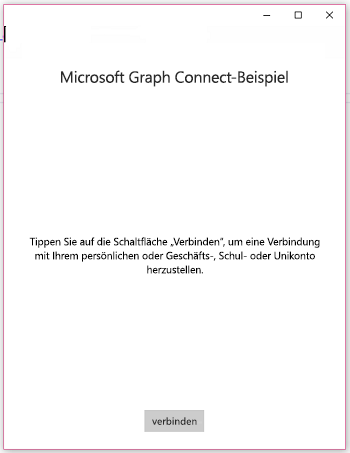
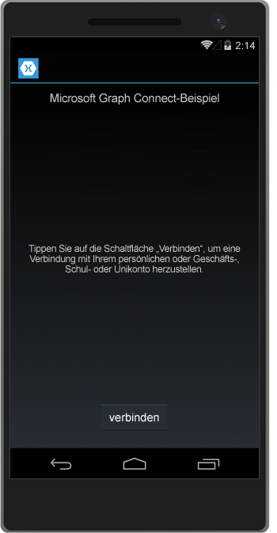
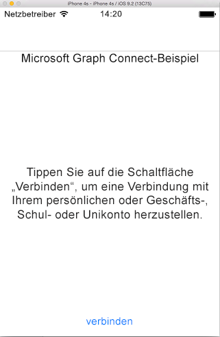
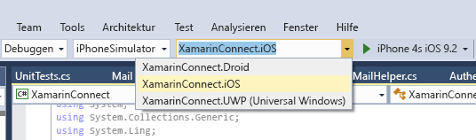

# <a name="get-started-with-microsoft-graph-in-a-xamarin-forms-app"></a>Erste Schritte mit Microsoft Graph in einer Xamarin Forms-App

> **Sie erstellen Apps für Unternehmenskunden?** Ihre App funktioniert möglicherweise nicht, wenn Ihr Unternehmenskunde Enterprise Mobility-Sicherheitsfunktionen wie <a href="https://azure.microsoft.com/documentation/articles/active-directory-conditional-access-device-policies/" target="_newtab">bedingten Gerätezugriff</a> aktiviert. In diesem Fall treten bei Ihren Kunden möglicherweise Fehler auf. 

Dieser Artikel beschreibt die erforderlichen Aufgaben zum Abrufen eines Zugriffstokens vom [Azure AD v2.0-Endpunkt](https://developer.microsoft.com/graph/docs/concepts/converged_auth) und zum Aufrufen von Microsoft Graph. Er führt Sie durch den Code im [Microsoft Graph Connect-Beispiel für Xamarin Forms](https://github.com/microsoftgraph/xamarin-csharp-connect-sample) und erläutert die wichtigsten Konzepte, die in einer App implementiert werden müssen, die Microsoft Graph verwendet. In diesem Artikel wird auch beschrieben, wie Sie mit der [Microsoft Graph Clientbibliothek](http://www.nuget.org/packages/Microsoft.Graph/) auf Microsoft Graph zugreifen.

Dies ist die App, die Sie erstellen.

| UWP | Android | iOS |
| --- | ------- | ----|
|  |  |  |

**Sie möchten keine App erstellen?** Verwenden Sie für einen schnellen Einstieg den [Schnellstart Microsoft Graph](https://developer.microsoft.com/graph/quick-start), oder laden Sie das [Microsoft Graph Connect-Beispiel für Xamarin Forms](https://github.com/microsoftgraph/xamarin-csharp-connect-sample) herunter, auf dem dieser Artikel basiert.

## <a name="prerequisites"></a>Voraussetzungen

Für die ersten Schritte benötigen Sie: 

- Ein [Microsoft-Konto](https://www.outlook.com/) oder ein [Geschäfts- oder Schulkonto](http://dev.office.com/devprogram)
- Visual Studio 2015 
- [Xamarin für Visual Studio](https://www.xamarin.com/visual-studio)
- Windows 10 (mit [aktiviertem Entwicklungsmodus](https://msdn.microsoft.com/library/windows/apps/xaml/dn706236.aspx))
- Das [Microsoft Graph Connect-Startprojekt für Xamarin Forms](https://github.com/microsoftgraph/xamarin-csharp-connect-sample/tree/master/starter). Diese Vorlage enthält verschiedene Klassen, denen Sie Code hinzufügen müssen. Darüber hinaus enthält sie vollständige Ansichten und Ressourcenzeichenfolgen. Um dieses Projekt abzurufen, müssen Sie das [Microsoft Graph Connect-Beispiel für Xamarin Forms](https://github.com/microsoftgraph/xamarin-csharp-connect-sample) klonen oder herunterladen und dann die **XamarinConnect**-Projektmappe im **Start**ordner öffnen. 

Wenn Sie das iOS-Projekt in diesem Beispiel ausführen möchten, benötigen Sie Folgendes:

- Das neueste iOS-SDK
- Die neueste Version von Xcode
- Mac OS X Sierra (10.12) und höher 
- [Xamarin.iOS](https://docs.microsoft.com/visualstudio/mac/installation)
- Einen mit [Visual Studio verbundenen Xamarin Mac-Agent](https://developer.xamarin.com/guides/ios/getting_started/installation/windows/connecting-to-mac/)


## <a name="register-the-app"></a>Registrieren der App
 
1. Melden Sie sich beim [App-Registrierungsportal](https://apps.dev.microsoft.com/) entweder mit Ihrem persönlichen oder geschäftlichen Konto oder mit Ihrem Schulkonto an.
2. Klicken Sie auf **App hinzufügen**.
3. Geben Sie einen Namen für die App ein, und wählen Sie dann **Erstellen** aus.
    
    Die Registrierungsseite wird angezeigt, und die Eigenschaften der App werden aufgeführt.
 
4. Wählen Sie unter **Plattformen** die Option **Plattform hinzufügen** aus.
5. Wählen Sie **Systemeigene Anwendung**.
6. Kopieren Sie den ID-Wert der Anwendung und den Wert für den benutzerdefinierten Umleitungs-URI (unter **Systemeigene Anwendung**), der für Sie erstellt wurde, als Sie die Plattform **Systemeigene Anwendung** hinzugefügt haben. Dieser URI muss den Wert der Anwendungs-ID enthalten und das folgende Format aufweisen: `msal[Application Id]://auth` Sie müssen diese Werte in die Beispiel-App eingeben.

    Die App-ID ist ein eindeutiger Bezeichner für Ihre App. 

7. Klicken Sie auf **Speichern**.

## <a name="configure-the-project"></a>Konfigurieren des Projekts

1. Öffnen Sie die Projektmappendatei für das Startprojekt in Visual Studio.
2. Öffnen Sie die Datei **App.cs** innerhalb des Projekts **XamarinConnect (Portable)**, und suchen Sie das Feld `ClientId`. Ersetzen Sie den Platzhalter-der Anwendungs-ID durch die Anwendungs-ID der App, die Sie registriert haben.

    ```
    public static string ClientID = "ENTER_YOUR_CLIENT_ID";
    public static string RedirectUri = "msal" + ClientID + "://auth";
    public static string[] Scopes = { "User.Read", "Mail.Send", "Files.ReadWrite" };
    ```
    Im Wert `Scopes` sind die Microsoft Graph Berechtigungsbereiche gespeichert, die die App anfordern muss, wenn der Benutzer sich authentifiziert. Beachten Sie, dass der Klassenkonstruktor `App` den ClientID-Wert verwendet, um eine Instanz der MSAL-Klasse `PublicClientApplication` zu instanziieren. Sie verwenden diese Klasse später zum Authentifizieren des Benutzers.
    
    ```
    IdentityClientApp = new PublicClientApplication(ClientID);
    ```

3. Öffnen Sie die Datei „UserDetailsClient.iOS\info.plist“ in einem Texteditor. Sie können diese Datei leider nicht in Visual Studio bearbeiten. Suchen Sie das Element `<string>msalENTER_YOUR_CLIENT_ID</string>` unter dem Schlüssel `CFBundleURLSchemes`.

4. Ersetzen Sie `ENTER_YOUR_CLIENT_ID` durch den Wert der Anwendungs-ID, die Sie beim Registrieren der App erhalten haben. Sie müssen `msal` unbedingt vor der Anwendungs-ID beibehalten. Der resultierende Zeichenfolgenwert sollte wie folgt aussehen: `<string>msal[application id]</string>`.

5. Öffnen Sie die Datei „UserDetailsClient.Droid\Properties\AndroidManifest.xml“. Suchen Sie das folgende Element: `<data android:scheme="msalENTER_YOUR_CLIENT_ID" android:host="auth" />`.

6. Ersetzen Sie `ENTER_YOUR_CLIENT_ID` durch den Wert der Anwendungs-ID, die Sie beim Registrieren der App erhalten haben. Sie müssen `msal` unbedingt vor der Anwendungs-ID beibehalten. Der resultierende Zeichenfolgenwert sollte wie folgt aussehen: `<data android:scheme="msal[application id]" android:host="auth" />`.

## <a name="send-an-email-with-microsoft-graph"></a>Senden einer E-Mail mit Microsoft Graph

Öffnen Sie die Datei MailHelper.cs in Ihrem Startprojekt. Diese Datei enthält den Code, durch den eine E-Mail erstellt und gesendet wird. Er besteht aus einer einzigen Methode – ``ComposeAndSendMailAsync`` –, die eine POST-Anforderung konstruiert und an den Endpunkt **https://graph.microsoft.com/v1.0/me/microsoft.graph.SendMail** sendet. 

Die Methode ``ComposeAndSendMailAsync`` verwendet drei Zeichenfolgenwerte – ``subject``, ``bodyContent`` und ``recipients`` –, die von der Datei "MainPage.xaml.cs" an sie übergeben werden. Die Zeichenfolgen ``subject`` und ``bodyContent`` werden zusammen mit allen anderen Benutzeroberflächenzeichenfolgen in der Datei „AppResources.resx“ gespeichert. Die Zeichenfolge ``recipients`` stammt aus dem Adressfeld in der App-Schnittstelle. 

**Verwenden von Deklarationen**

Stellen Sie sicher, dass diese Deklarationen am Anfang der Datei vorhanden sind:

```
using System;
using System.Collections.Generic;
using System.Linq;
using System.Reflection;
using System.Threading.Tasks;
using Microsoft.Graph;
```

Die erste Aufgabe innerhalb der Methode ``ComposeAndSendMailAsync`` besteht darin, das Foto des aktuellen Benutzers aus Microsoft Graph abzurufen. Diese Zeile ruft die Methode `GetCurrentUserPhotoStreamAsync` auf, die als Stub vorliegt:

```
            // Get current user photo
            Stream photoStream = await GetCurrentUserPhotoStreamAsync();
```

Die vollständige Methode `GetCurrentUserPhotoStreamAsync` sieht wie folgt aus:

```
        // Gets the stream content of the signed-in user's photo. 
        // This snippet doesn't work with consumer accounts.
        public async Task<Stream> GetCurrentUserPhotoStreamAsync()
        {
            Stream currentUserPhotoStream = null;

            try
            {
                var graphClient = AuthenticationHelper.GetAuthenticatedClient();
                currentUserPhotoStream = await graphClient.Me.Photo.Content.Request().GetAsync();

            }

            // If the user account is MSA (not work or school), the service will throw an exception.
            catch (ServiceException)
            {
                return null;
            }

            return currentUserPhotoStream;

        }
```

Wenn der Benutzer kein Foto hat, wird mit dieser Logik eine andere Bilddatei abgerufen, die in das Projekt eingeschlossen wurde:

```
            // If the user doesn't have a photo, or if the user account is MSA, we use a default photo

            if (photoStream == null)
            {
                var assembly = typeof(MailHelper).GetTypeInfo().Assembly;
                photoStream = assembly.GetManifestResourceStream("XamarinConnect.test.jpg");
            }
```

Nachdem nun ein Bilddatenstrom vorliegt, kann die Datei in OneDrive hochgeladen werden, indem die als Stub vorliegende Methode `UploadFileToOneDriveAsync` aufgerufen wird:

```
            MemoryStream photoStreamMS = new MemoryStream();
            // Copy stream to MemoryStream object so that it can be converted to byte array.
            photoStream.CopyTo(photoStreamMS);

            DriveItem photoFile = await UploadFileToOneDriveAsync(photoStreamMS.ToArray());
```

Die vollständige Methode `UploadFileToOneDriveAsync` sieht wie folgt aus:

```
        // Uploads the specified file to the user's root OneDrive directory.
        public async Task<DriveItem> UploadFileToOneDriveAsync(byte[] file)
        {
            DriveItem uploadedFile = null;

            try
            {
                var graphClient = AuthenticationHelper.GetAuthenticatedClient();
                MemoryStream fileStream = new MemoryStream(file);
                uploadedFile = await graphClient.Me.Drive.Root.ItemWithPath("me.png").Content.Request().PutAsync<DriveItem>(fileStream);

            }


            catch (ServiceException)
            {
                return null;
            }

            return uploadedFile;
        }
```

Dieser Datenstrom kann auch zum Erstellen eines `MessageAttachmentsCollectionPage`-Objekts verwendet werden, das zusammen mit der Nachricht übergeben werden kann:

```
            MessageAttachmentsCollectionPage attachments = new MessageAttachmentsCollectionPage();
            attachments.Add(new FileAttachment
            {
                ODataType = "#microsoft.graph.fileAttachment",
                ContentBytes = photoStreamMS.ToArray(),
                ContentType = "image/png",
                Name = "me.png"
            });
```

Durch Aufruf der als Stub vorliegenden Methode `GetSharingLinkAsync` kann ein Freigabelink für die neu hochgeladene OneDrive-Datei abgerufen werden. Die Zeichenfolge `bodyContent` enthält einen Platzhalter für den Freigabelink:

```
            // Get the sharing link and insert it into the message body.
            Permission sharingLink = await GetSharingLinkAsync(photoFile.Id);
            string bodyContentWithSharingLink = String.Format(bodyContent, sharingLink.Link.WebUrl);
```

Die vollständige Methode `GetSharingLinkAsync` sieht wie folgt aus:

```
        public static async Task<Permission> GetSharingLinkAsync(string Id)
        {
            Permission permission = null;

            try
            {
                var graphClient = AuthenticationHelper.GetAuthenticatedClient();
                permission = await graphClient.Me.Drive.Items[Id].CreateLink("view").Request().PostAsync();
            }

            catch (ServiceException)
            {
                return null;
            }

            return permission;
        }
```

Da der Benutzer mehrere Adressen übergeben kann, besteht die nächste Aufgabe darin, die Zeichenfolge ``recipients`` in einen Satz von `EmailAddress`-Objekten zu unterteilen, die dann verwendet werden können, um die Liste der `Recipients`-Objekte zu erstellen, die im POST-Text der Anforderung übergeben werden.

```
            // Prepare the recipient list
            string[] splitter = { ";" };
            var splitRecipientsString = recipients.Split(splitter, StringSplitOptions.RemoveEmptyEntries);
            List<Recipient> recipientList = new List<Recipient>();

            foreach (string recipient in splitRecipientsString)
            {
                recipientList.Add(new Recipient { EmailAddress = new EmailAddress { Address = recipient.Trim() } });
            }
```

Die letzte Aufgabe besteht darin, ein `Message`-Objekt zu erstellen und dieses über den `GraphServiceClient` an den Endpunkt **me/microsoft.graph.SendMail** zu senden. Da die Zeichenfolge ``bodyContent`` ein HTML-Dokument ist, legt die Anforderung den Wert **ContentType** auf HTML fest.

```
            try
            {
                var graphClient = AuthenticationHelper.GetAuthenticatedClient();

                var email = new Message
                {
                    Body = new ItemBody
                    {
                        Content = bodyContentWithSharingLink,
                        ContentType = BodyType.Html,
                    },
                    Subject = subject,
                    ToRecipients = recipientList,
                    Attachments = attachments
                };

                try
                {
                    await graphClient.Me.SendMail(email, true).Request().PostAsync();
                }
                catch (ServiceException exception)
                {
                    throw new Exception("We could not send the message: " + exception.Error == null ? "No error message returned." : exception.Error.Message);
                }


            }

            catch (Exception e)
            {
                throw new Exception("We could not send the message: " + e.Message);
            }
```

Die vollständige Klasse sieht wie folgt aus:

```
    public class MailHelper
    {
        /// <summary>
        /// Compose and send a new email.
        /// </summary>
        /// <param name="subject">The subject line of the email.</param>
        /// <param name="bodyContent">The body of the email.</param>
        /// <param name="recipients">A semicolon-separated list of email addresses.</param>
        /// <returns></returns>
        public async Task ComposeAndSendMailAsync(string subject,
                                                            string bodyContent,
                                                            string recipients)
        {

            // Get current user photo
            Stream photoStream = await GetCurrentUserPhotoStreamAsync();


            // If the user doesn't have a photo, or if the user account is MSA, we use a default photo

            if (photoStream == null)
            {
                var assembly = typeof(MailHelper).GetTypeInfo().Assembly;
                photoStream = assembly.GetManifestResourceStream("XamarinConnect.test.jpg");
            }

            MemoryStream photoStreamMS = new MemoryStream();
            // Copy stream to MemoryStream object so that it can be converted to byte array.
            photoStream.CopyTo(photoStreamMS);

            DriveItem photoFile = await UploadFileToOneDriveAsync(photoStreamMS.ToArray());

            MessageAttachmentsCollectionPage attachments = new MessageAttachmentsCollectionPage();
            attachments.Add(new FileAttachment
            {
                ODataType = "#microsoft.graph.fileAttachment",
                ContentBytes = photoStreamMS.ToArray(),
                ContentType = "image/png",
                Name = "me.png"
            });

            // Get the sharing link and insert it into the message body.
            Permission sharingLink = await GetSharingLinkAsync(photoFile.Id);
            string bodyContentWithSharingLink = String.Format(bodyContent, sharingLink.Link.WebUrl);


            // Prepare the recipient list
            string[] splitter = { ";" };
            var splitRecipientsString = recipients.Split(splitter, StringSplitOptions.RemoveEmptyEntries);
            List<Recipient> recipientList = new List<Recipient>();

            foreach (string recipient in splitRecipientsString)
            {
                recipientList.Add(new Recipient { EmailAddress = new EmailAddress { Address = recipient.Trim() } });
            }

            try
            {
                var graphClient = AuthenticationHelper.GetAuthenticatedClient();

                var email = new Message
                {
                    Body = new ItemBody
                    {
                        Content = bodyContentWithSharingLink,
                        ContentType = BodyType.Html,
                    },
                    Subject = subject,
                    ToRecipients = recipientList,
                    Attachments = attachments
                };

                try
                {
                    await graphClient.Me.SendMail(email, true).Request().PostAsync();
                }
                catch (ServiceException exception)
                {
                    throw new Exception("We could not send the message: " + exception.Error == null ? "No error message returned." : exception.Error.Message);
                }


            }

            catch (Exception e)
            {
                throw new Exception("We could not send the message: " + e.Message);
            }
        }

        // Gets the stream content of the signed-in user's photo. 
        // This snippet doesn't work with consumer accounts.
        public async Task<Stream> GetCurrentUserPhotoStreamAsync()
        {
            Stream currentUserPhotoStream = null;

            try
            {
                var graphClient = AuthenticationHelper.GetAuthenticatedClient();
                currentUserPhotoStream = await graphClient.Me.Photo.Content.Request().GetAsync();

            }

            // If the user account is MSA (not work or school), the service will throw an exception.
            catch (ServiceException)
            {
                return null;
            }

            return currentUserPhotoStream;

        }

        // Uploads the specified file to the user's root OneDrive directory.
        public async Task<DriveItem> UploadFileToOneDriveAsync(byte[] file)
        {
            DriveItem uploadedFile = null;

            try
            {
                var graphClient = AuthenticationHelper.GetAuthenticatedClient();
                MemoryStream fileStream = new MemoryStream(file);
                uploadedFile = await graphClient.Me.Drive.Root.ItemWithPath("me.png").Content.Request().PutAsync<DriveItem>(fileStream);

            }


            catch (ServiceException)
            {
                return null;
            }

            return uploadedFile;
        }

        public static async Task<Permission> GetSharingLinkAsync(string Id)
        {
            Permission permission = null;

            try
            {
                var graphClient = AuthenticationHelper.GetAuthenticatedClient();
                permission = await graphClient.Me.Drive.Items[Id].CreateLink("view").Request().PostAsync();
            }

            catch (ServiceException)
            {
                return null;
            }

            return permission;
        }


    }
``` 

Sie haben nun die drei erforderlichen Schritte für die Interaktion mit Microsoft Graph durchgeführt: App-Registrierung, Benutzerauthentifizierung und eine Anforderung. 

## <a name="run-the-app"></a>Ausführen der App
1. Wählen Sie das auszuführende Projekt aus. Wenn Sie die Option für die universelle Windows-Plattform auswählen, können Sie das Beispiel auf dem lokalen Computer ausführen. Wenn Sie das iOS-Projekt ausführen möchten, müssen Sie eine Verbindung zu einem [Mac herstellen, auf dem die Xamarin-Tools installiert](https://developer.xamarin.com/guides/ios/getting_started/installation/windows/connecting-to-mac/) sind. (Sie können diese Projektmappe auch in Xamarin Studio auf einem Mac öffnen und das Beispiel direkt dort ausführen.) Sie können den [Visual Studio-Emulator für Android](https://www.visualstudio.com/features/msft-android-emulator-vs.aspx) verwenden, wenn Sie das Android-Projekt ausführen möchten. 

    

2. Drücken Sie zum Erstellen und Debuggen F5. Führen Sie die Lösung aus, und melden Sie sich entweder mit Ihrem persönlichen Konto oder mit Ihrem Geschäfts- oder Schulkonto an.
    > **Hinweis** Möglicherweise müssen Sie den Buildkonfigurations-Manager öffnen, um sicherzustellen, dass die Build- und Bereitstellungsschritte für das UWP-Projekt ausgewählt sind. 

3. Melden Sie sich mit Ihrem persönlichen Konto oder mit Ihrem Geschäfts- oder Schulkonto an, und gewähren Sie die erforderlichen Berechtigungen.

4. Klicken Sie auf die Schaltfläche **E-Mail senden**. Nachdem die E-Mail gesendet wurde, wird eine Erfolgsmeldung angezeigt. Diese E-Mail-Nachricht enthält das Foto als Anlage und stellt außerdem einen Freigabelink zur hochgeladenen Datei in OneDrive bereit.

## <a name="next-steps"></a>Nächste Schritte
- Testen Sie die REST-API mithilfe des [Graph-Explorers](https://developer.microsoft.com/graph/graph-explorer).
- Beispiele für allgemeine Vorgänge finden Sie in der [Microsoft Graph SDK Snippets-Bibliothek für Xamarin.Forms](https://github.com/microsoftgraph/xamarin-csharp-snippets-sample), oder erforschen Sie unsere anderen [Xamarin-Beispiele](https://github.com/microsoftgraph?utf8=%E2%9C%93&query=xamarin) auf GitHub.

## <a name="see-also"></a>Siehe auch
- [Microsoft Graph .NET Clientbibliothek](https://github.com/microsoftgraph/msgraph-sdk-dotnet)
- [Protokolle für Azure AD v2.0](https://azure.microsoft.com/documentation/articles/active-directory-v2-protocols/)
- [Azure AD v2.0-Tokens](https://azure.microsoft.com/documentation/articles/active-directory-v2-tokens/)
